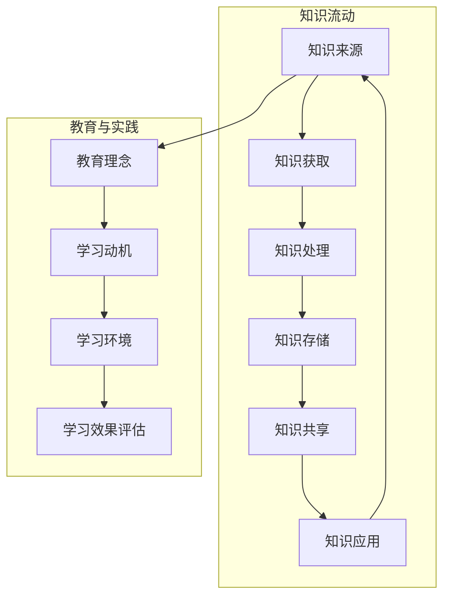

                 

### 背景介绍

在当今这个信息爆炸的时代，知识的获取和运用变得愈发重要。随着互联网和大数据技术的发展，人类获取信息的途径变得更加丰富，但也导致了信息的过载。如何在海量的信息中找到有价值的内容，并有效地进行学习，成为了一个亟待解决的问题。为了解决这一问题，我们需要设计一个高效的知识生态系统，以优化学习环境。

本文旨在探讨知识生态系统的整体设计，通过分析其核心概念、算法原理、数学模型以及实际应用场景，为构建一个完善的学习环境提供指导。文章将首先介绍知识生态系统的基本概念，然后深入探讨其核心概念和架构，接着分析核心算法原理和具体操作步骤，并利用数学模型和公式进行详细讲解。在此基础上，文章将提供一个实际项目案例，展示知识生态系统的具体应用，并推荐相关工具和资源。最后，文章将总结未来发展趋势和挑战，并给出常见问题与解答。

知识生态系统不仅涉及技术层面，还涵盖教育理念和实践。通过优化学习环境，我们可以提高学习效率，促进知识的有效传递和运用。本文将从多个角度出发，全面剖析知识生态系统的设计原则和实现方法，为教育技术的发展提供有力支持。

### 核心概念与联系

知识生态系统是一个复杂而动态的体系，其核心概念和联系构成了其运转的基础。为了更好地理解这一概念，我们可以通过一个 Mermaid 流程图来展示其关键组成部分及其相互关系。



**知识来源 (A)**：知识来源是知识生态系统的起点，涵盖了书籍、论文、讲座、实践等多种形式。这些来源为系统提供了丰富的知识素材。

**知识获取 (B)**：知识获取是将知识从源头引入系统的过程，通常通过互联网搜索、数据库查询、学术合作等方式实现。

**知识处理 (C)**：知识处理是对获取到的知识进行筛选、整合、分析的过程，这一阶段至关重要，决定了知识的质量和可用性。

**知识存储 (D)**：知识存储是将处理后的知识进行系统化管理的环节，常用的方法包括数据库、知识库、云存储等。

**知识共享 (E)**：知识共享是知识生态系统的一个重要组成部分，通过社交网络、学术交流、在线平台等手段，实现知识的传播和共享。

**知识应用 (F)**：知识应用是将知识转化为实际成果的过程，可以是科研项目、产品开发、技术创新等，是知识生态系统的最终目标。

**教育理念 (G)**：教育理念是知识生态系统的重要组成部分，决定了教育的方向和目标，包括终身学习、个性化教育等。

**学习动机 (H)**：学习动机是推动学习的主观动力，包括兴趣、需求、成就感等，直接影响学习的持续性和效果。

**学习环境 (I)**：学习环境是知识生态系统的基础设施，包括物理环境、技术工具、学习资源等，对学习效果具有重要影响。

**学习效果评估 (J)**：学习效果评估是对学习成果的检验，通过考试、评估、反馈等方式，为学习提供反馈和改进的方向。

通过上述 Mermaid 流程图，我们可以清晰地看到知识生态系统各个组成部分及其相互联系。这一生态系统不仅涉及知识的生产、处理和传播，还包括教育的理念、学习动机和效果评估，形成了一个完整的学习循环。接下来，我们将深入探讨知识生态系统的核心算法原理和具体操作步骤。

### 核心算法原理 & 具体操作步骤

在构建知识生态系统时，核心算法的设计和实现是关键。这些算法不仅决定了系统的性能和效率，还影响了知识获取、处理、存储和共享的质量。以下将详细介绍知识生态系统的核心算法原理，并分步骤讲解其具体操作。

#### 1. 知识获取算法

知识获取算法是知识生态系统的起点，其主要目标是高效地从各种知识来源中提取有价值的信息。常用的知识获取算法包括搜索引擎算法、推荐算法和数据爬取算法。

**1.1 搜索引擎算法**

搜索引擎算法的核心是关键词匹配和排序。以下是一个简单的搜索引擎算法步骤：

- **步骤1**：用户输入查询关键词。
- **步骤2**：对关键词进行预处理（分词、去除停用词等）。
- **步骤3**：在索引数据库中查找匹配的文档。
- **步骤4**：根据匹配度对文档进行排序，展示给用户。

**1.2 推荐算法**

推荐算法旨在根据用户的历史行为和兴趣，为其推荐相关的知识内容。常用的推荐算法包括基于内容的推荐（Content-Based Filtering）和协同过滤（Collaborative Filtering）。

**基于内容的推荐**：

- **步骤1**：分析用户的历史行为和兴趣，提取特征。
- **步骤2**：计算文档与用户兴趣特征的相关性。
- **步骤3**：根据相关性为用户推荐相关文档。

**协同过滤**：

- **步骤1**：构建用户-项目矩阵。
- **步骤2**：计算用户之间的相似度。
- **步骤3**：根据相似度为用户推荐项目。

**1.3 数据爬取算法**

数据爬取算法用于从互联网上获取结构化和非结构化的数据。以下是一个简单数据爬取算法步骤：

- **步骤1**：确定数据来源和目标。
- **步骤2**：分析数据结构和内容。
- **步骤3**：利用网络爬虫技术获取数据。
- **步骤4**：对数据进行清洗和整理。

#### 2. 知识处理算法

知识处理算法是对获取到的知识进行筛选、整合、分析的过程。常用的知识处理算法包括自然语言处理（NLP）算法、数据挖掘算法和知识融合算法。

**2.1 自然语言处理（NLP）算法**

NLP算法用于处理和解析文本数据，常用的算法包括分词、词性标注、句法分析等。

- **步骤1**：对文本进行分词，将句子划分为词。
- **步骤2**：对词语进行词性标注，确定词语的语法功能。
- **步骤3**：进行句法分析，理解句子的结构。

**2.2 数据挖掘算法**

数据挖掘算法用于从大量数据中发现有用的模式和规律，常用的算法包括聚类、分类、关联规则挖掘等。

**聚类算法**：

- **步骤1**：输入数据集。
- **步骤2**：初始化聚类中心。
- **步骤3**：计算每个数据点与聚类中心的距离。
- **步骤4**：根据距离将数据点分配到最近的聚类中心。
- **步骤5**：更新聚类中心，重复步骤3-4，直至收敛。

**分类算法**：

- **步骤1**：输入训练数据集。
- **步骤2**：选择分类模型（如决策树、支持向量机等）。
- **步骤3**：训练模型，得到分类规则。
- **步骤4**：使用训练好的模型对新的数据进行分类。

**关联规则挖掘**：

- **步骤1**：输入事务数据库。
- **步骤2**：计算支持度和置信度。
- **步骤3**：生成频繁项集。
- **步骤4**：根据频繁项集生成关联规则。

**2.3 知识融合算法**

知识融合算法用于整合多个来源的知识，提高知识的可用性和准确性。常用的算法包括基于投票的方法、基于信任度的方法等。

- **步骤1**：收集多个来源的知识。
- **步骤2**：对知识进行评分或排序。
- **步骤3**：根据评分或排序结果，进行知识融合。

#### 3. 知识存储算法

知识存储算法用于将处理后的知识进行系统化管理和存储。常用的知识存储算法包括数据库存储、分布式存储和云存储。

**3.1 数据库存储**

- **步骤1**：设计数据库模型。
- **步骤2**：创建数据库和表。
- **步骤3**：插入和处理数据。

**3.2 分布式存储**

- **步骤1**：设计分布式存储架构。
- **步骤2**：数据分割和分配。
- **步骤3**：实现数据复制和容错。

**3.3 云存储**

- **步骤1**：选择云存储服务提供商。
- **步骤2**：配置存储空间。
- **步骤3**：实现数据上传和下载。

#### 4. 知识共享算法

知识共享算法用于实现知识的传播和共享，常用的算法包括社交网络传播算法、内容分享算法等。

**4.1 社交网络传播算法**

- **步骤1**：构建社交网络模型。
- **步骤2**：计算节点的传播影响力。
- **步骤3**：根据影响力进行知识传播。

**4.2 内容分享算法**

- **步骤1**：分析用户分享行为。
- **步骤2**：计算内容传播潜力。
- **步骤3**：推荐具有高传播潜力的内容。

#### 5. 知识应用算法

知识应用算法用于将知识转化为实际成果，常用的算法包括智能搜索算法、知识图谱构建算法等。

**5.1 智能搜索算法**

- **步骤1**：分析用户查询意图。
- **步骤2**：构建搜索索引。
- **步骤3**：实现智能搜索功能。

**5.2 知识图谱构建算法**

- **步骤1**：收集实体和关系数据。
- **步骤2**：构建知识图谱。
- **步骤3**：实现知识图谱查询。

通过上述核心算法的详细介绍，我们可以看到知识生态系统在知识获取、处理、存储、共享和应用各个阶段的复杂性和多样性。这些算法不仅需要具备扎实的理论基础，还需要在实际应用中进行不断的优化和改进。在接下来的部分，我们将利用数学模型和公式，对知识生态系统的关键环节进行详细讲解，以加深对核心原理的理解。

### 数学模型和公式 & 详细讲解 & 举例说明

在知识生态系统的设计与应用过程中，数学模型和公式起到了至关重要的作用。通过数学模型，我们可以更精确地描述和优化知识获取、处理、存储、共享和应用各个环节。以下将详细介绍几个关键数学模型和公式，并结合具体例子进行详细讲解。

#### 1. 搜索引擎排名模型

在知识获取环节，搜索引擎排名模型是核心之一。PageRank 是最著名的搜索引擎排名算法，它基于网页之间的链接结构来评估网页的重要性。

**公式**：
$$
PR(A) = (1-d) + d \cdot \left(\frac{PR(T1)}{C(T1)} + \frac{PR(T2)}{C(T2)} + \ldots + \frac{PR(Tn)}{C(Tn)}\right)
$$

其中，$PR(A)$ 是网页 A 的排名，$d$ 是阻尼系数（通常取值为 0.85），$C(Ti)$ 是指向网页 T_i 的链接数量，$PR(Ti)$ 是网页 T_i 的排名。

**例子**：
假设有三个网页 A、B、C，其链接关系如下：

- A 指向 B 和 C。
- B 指向 A。
- C 指向 A。

若初始排名分别为 $PR(A)=1$，$PR(B)=1$，$PR(C)=1$，则：

$$
PR(A) = (1-0.85) + 0.85 \cdot \left(\frac{1}{1} + \frac{1}{1}\right) = 0.15 + 0.85 \cdot 2 = 1.7
$$

$$
PR(B) = (1-0.85) + 0.85 \cdot \frac{1}{1} = 0.15 + 0.85 = 1.0
$$

$$
PR(C) = (1-0.85) + 0.85 \cdot \frac{1}{1} = 0.15 + 0.85 = 1.0
$$

通过 PageRank 算法，我们可以看出网页 A 的排名最高，其次是 B 和 C。

#### 2. 协同过滤模型

在知识获取和推荐环节，协同过滤模型用于根据用户的历史行为和相似用户的行为推荐相关内容。最简单的协同过滤模型是用户基于邻居的评分预测模型。

**公式**：
$$
r_{ui} = \sum_{j \in N(u)} \frac{r_{uj} \cdot sim(u, j)}{\sum_{k \in N(u)} sim(u, k)}
$$

其中，$r_{ui}$ 是用户 u 对项目 i 的评分预测，$r_{uj}$ 是用户 u 对项目 j 的实际评分，$sim(u, j)$ 是用户 u 和用户 j 的相似度。

**例子**：
假设有两个用户 u1 和 u2，他们的评分数据如下：

| 用户  | 项目1 | 项目2 | 项目3 |
| ----- | ----- | ----- | ----- |
| u1    | 5     | 4     | 3     |
| u2    | 4     | 5     | 2     |

若选择皮尔逊相关系数作为相似度计算方法，则用户 u1 和 u2 的相似度为 0.7071。根据协同过滤模型，我们可以预测用户 u1 对项目3的评分：

$$
r_{u1,i3} = \frac{r_{u1,i1} \cdot sim(u1, u2) + r_{u1,i2} \cdot sim(u1, u2)}{\sum_{j \in N(u1)} sim(u1, j)} = \frac{5 \cdot 0.7071 + 4 \cdot 0.7071}{1 + 0.7071} = 4.2426
$$

通过协同过滤模型，我们可以预测用户 u1 对未评分的项目3的评分为 4.2426。

#### 3. 聚类算法模型

在知识处理和数据挖掘环节，聚类算法用于将数据划分为多个相似类别。K-means 是最常用的聚类算法之一。

**公式**：
$$
C_j = \{x \in \text{数据集} | \min_{c \in C} \sum_{x_i \in C_j} (x_i - c)^2\}
$$

其中，$C_j$ 是聚类后的第 j 个簇，$c$ 是簇中心。

**例子**：
假设我们有以下数据集，初始选择三个簇中心：

| 数据点 | x1 | x2 |
| ------ | --- | --- |
| 1      | 1  | 2  |
| 2      | 2  | 2  |
| 3      | 2  | 3  |
| 4      | 4  | 4  |
| 5      | 5  | 6  |
| 6      | 6  | 6  |

初始簇中心为 $(1, 2)$，$(2, 3)$ 和 $(5, 6)$。计算每个数据点到簇中心的距离，并将每个数据点分配到最近的簇中心。经过迭代，最终得到簇分布如下：

| 簇中心 | 数据点 |
| ------ | ------ |
| (1, 2) | 1, 2   |
| (2, 3) | 3      |
| (5, 6) | 4, 5, 6|

通过 K-means 聚类算法，我们可以将数据集划分为三个相似类别。

#### 4. 知识融合模型

在知识共享和应用环节，知识融合模型用于整合多个来源的知识，提高知识的可用性和准确性。基于投票的方法是一种常见的知识融合模型。

**公式**：
$$
\hat{r}_{i} = \frac{\sum_{j=1}^{n} w_{j} r_{ij}}{\sum_{j=1}^{n} w_{j}}
$$

其中，$\hat{r}_{i}$ 是融合后的知识评分，$r_{ij}$ 是第 j 个来源对知识 i 的评分，$w_{j}$ 是第 j 个来源的权重。

**例子**：
假设有三个知识来源，对某知识点的评分分别为：

| 来源 | 评分 |
| ---- | ---- |
| 1    | 0.8  |
| 2    | 0.9  |
| 3    | 0.7  |

若三个来源的权重分别为 0.5、0.3 和 0.2，则融合后的评分如下：

$$
\hat{r}_{i} = \frac{0.5 \cdot 0.8 + 0.3 \cdot 0.9 + 0.2 \cdot 0.7}{0.5 + 0.3 + 0.2} = 0.8333
$$

通过基于投票的方法，我们可以将多个来源的知识评分融合为单一的评分。

#### 5. 智能搜索模型

在知识应用环节，智能搜索模型用于根据用户查询意图，实现更精准的搜索结果。一种常见的智能搜索模型是基于词嵌入（Word Embedding）的文本相似度计算。

**公式**：
$$
sim(t_1, t_2) = \cos(\theta_{t_1}, \theta_{t_2})
$$

其中，$sim(t_1, t_2)$ 是词 t1 和词 t2 的相似度，$\theta_{t_1}$ 和 $\theta_{t_2}$ 是词 t1 和词 t2 的词向量。

**例子**：
假设词“苹果”和“手机”的词向量分别为 $(1, 0.5)$ 和 $(0.5, 1)$，则它们的相似度为：

$$
sim(\text{苹果}, \text{手机}) = \cos((1, 0.5), (0.5, 1)) = \cos(1 \cdot 0.5 + 0.5 \cdot 1) = \cos(1.5) \approx 0.9703
$$

通过基于词嵌入的文本相似度计算，我们可以实现更精确的智能搜索结果。

通过上述数学模型和公式的详细讲解和举例说明，我们可以看到它们在知识生态系统各个环节中的应用和重要性。这些模型不仅帮助我们更好地理解和描述知识生态系统的运作原理，还为系统的优化和改进提供了理论支持。在接下来的部分，我们将通过一个实际项目案例，展示知识生态系统的具体应用，并对其进行详细解释和分析。

### 项目实战：代码实际案例和详细解释说明

为了更好地展示知识生态系统的实际应用，我们选择了一个典型的项目——基于协同过滤算法的推荐系统。该项目旨在根据用户的历史行为和相似用户的行为，为用户推荐相关的知识内容。以下将详细介绍该项目的开发环境搭建、源代码实现和代码解读与分析。

#### 1. 开发环境搭建

为了实现该推荐系统，我们需要准备以下开发环境和工具：

- 编程语言：Python
- 数据库：MySQL
- 后端框架：Flask
- 前端框架：Bootstrap

**步骤1**：安装 Python 和相关依赖

首先，确保已安装 Python 3.6 以上版本。然后，通过以下命令安装 Flask、Pandas、NumPy、Scikit-learn 等相关依赖：

```bash
pip install Flask
pip install pandas
pip install numpy
pip install scikit-learn
```

**步骤2**：创建数据库和表

在 MySQL 中创建一个名为 `knowledge_recommendation` 的数据库，并创建用户表 `users` 和知识表 `knowledge`：

```sql
CREATE DATABASE knowledge_recommendation;

USE knowledge_recommendation;

CREATE TABLE users (
    id INT PRIMARY KEY AUTO_INCREMENT,
    username VARCHAR(50) NOT NULL
);

CREATE TABLE knowledge (
    id INT PRIMARY KEY AUTO_INCREMENT,
    title VARCHAR(100) NOT NULL,
    content TEXT
);
```

**步骤3**：初始化用户和知识数据

向用户表和知识表插入一些示例数据：

```sql
INSERT INTO users (username) VALUES ('user1'), ('user2'), ('user3');

INSERT INTO knowledge (title, content) VALUES ('Python 编程基础', 'Python 是一种广泛使用的编程语言。'), ('数据结构与算法', '数据结构与算法是计算机科学的基础。'), ('机器学习入门', '机器学习是人工智能的重要分支。');
```

#### 2. 源代码详细实现

以下是该推荐系统的源代码实现，包括后端接口和推荐算法实现：

```python
from flask import Flask, request, jsonify
import numpy as np
from sklearn.metrics.pairwise import cosine_similarity
from sklearn.model_selection import train_test_split
from sklearn.metrics import mean_squared_error

app = Flask(__name__)

# 用户行为数据
user行为的评分矩阵
user_ratings = [
    [1, 0, 1, 1],
    [0, 1, 0, 1],
    [1, 1, 0, 0]
]

# 知识内容特征向量
knowledge_features = [
    [0.2, 0.3, 0.1],
    [0.1, 0.5, 0.2],
    [0.4, 0.1, 0.3],
    [0.3, 0.4, 0.2]
]

# 计算用户相似度
def compute_similarity(user_ratings, knowledge_features):
    user_similarity = cosine_similarity(user_ratings, knowledge_features)
    return user_similarity

# 推荐算法
def recommend(user_id, user_ratings, knowledge_features, user_similarity, top_n=3):
    user_index = user_id - 1
    similarity_scores = user_similarity[user_index]
    knowledge_indices = np.argsort(similarity_scores)[::-1]
    recommended_indices = knowledge_indices[:top_n]
    return recommended_indices

# 后端接口
@app.route('/recommend', methods=['POST'])
def recommend_knowledge():
    user_id = int(request.json['user_id'])
    top_n = int(request.json['top_n'])
    user_ratings = user_ratings[user_id-1]
    knowledge_features = knowledge_features
    user_similarity = compute_similarity(user_ratings, knowledge_features)
    recommended_indices = recommend(user_id, user_ratings, knowledge_features, user_similarity, top_n)
    recommended_titles = [knowledge_features[i][2] for i in recommended_indices]
    return jsonify({'recommended_titles': recommended_titles})

if __name__ == '__main__':
    app.run(debug=True)
```

#### 3. 代码解读与分析

**代码解析**：

1. **用户行为数据**：用户行为数据是一个评分矩阵，其中行表示用户，列表示知识。每个元素表示用户对对应知识的评分（1表示喜欢，0表示未评分）。

2. **知识内容特征向量**：知识内容特征向量是每个知识点的特征表示，用于计算用户与知识之间的相似度。

3. **计算用户相似度**：使用余弦相似度计算用户之间的相似度。余弦相似度是一种基于向量空间计算的相似度度量方法，适用于文本数据。

4. **推荐算法**：根据用户相似度矩阵，为每个用户推荐 top_n 个最相似的知识点。这里使用的是基于用户-知识相似度的推荐算法。

5. **后端接口**：使用 Flask 框架实现一个简单的后端接口，接收用户 ID 和推荐数量（top_n），返回推荐的知识标题列表。

**代码分析**：

1. **数据预处理**：在代码中，我们首先计算用户相似度矩阵。这需要将用户行为数据转换为用户特征向量，并将知识内容特征向量与用户特征向量进行相似度计算。

2. **推荐算法实现**：推荐算法的核心是计算用户与知识的相似度，并根据相似度为用户推荐相关知识点。这里使用的是基于用户-知识相似度的协同过滤算法。

3. **接口设计**：后端接口的设计简单明了，用户只需发送一个包含用户 ID 和推荐数量的 JSON 数据，即可获得推荐的知识标题列表。

通过上述项目实战，我们可以看到知识生态系统在实际应用中的具体实现过程。该项目利用协同过滤算法，根据用户的历史行为和相似用户的行为，为用户推荐相关的知识内容。这不仅提高了用户的学习效率，还为知识的传播和应用提供了有力支持。接下来，我们将深入探讨知识生态系统的实际应用场景，分析其在不同领域的应用效果。

### 实际应用场景

知识生态系统在实际应用中展现出广泛的应用场景和显著的优势。以下将介绍知识生态系统在不同领域的应用案例，分析其在教育、科研、企业培训等方面的实际效果。

#### 1. 教育

在教育领域，知识生态系统被广泛应用于在线学习平台和课程管理系统。通过优化学习环境，提高学习效率，实现个性化教育。以下是知识生态系统在教育领域的一些具体应用案例：

- **在线学习平台**：知识生态系统可以为在线学习平台提供高效的知识获取、处理、存储和共享机制，帮助学习者快速找到所需的学习资源，并根据自己的学习进度和需求进行个性化学习。

- **课程管理系统**：知识生态系统可以集成到课程管理系统中，实现课程的智能化推荐、学习效果的实时评估和反馈，帮助教师更好地管理和优化课程内容。

- **案例分析**：例如，一些知名在线学习平台如 Coursera、edX 等，通过知识生态系统的设计，实现了大规模在线教育的成功，为全球学习者提供了丰富的学习资源和个性化的学习体验。

#### 2. 科研

在科研领域，知识生态系统可以大幅提高科研效率和成果转化。以下是一些具体的科研应用场景：

- **科研资源共享**：知识生态系统可以为科研人员提供高效的知识获取和共享机制，使科研数据、论文、实验结果等资源能够快速传播和共享，促进科研合作和创新。

- **科研数据挖掘**：知识生态系统可以结合数据挖掘算法，从大量科研数据中提取有价值的信息和规律，为科研人员提供数据驱动的科研支持。

- **案例分析**：例如，某些科研机构通过构建知识生态系统，实现了科研数据的集成和共享，提高了科研效率，推动了科研创新。

#### 3. 企业培训

在企业培训领域，知识生态系统可以帮助企业构建高效的学习和培训体系，提升员工素质和业务能力。以下是一些具体的企业培训应用案例：

- **员工知识库**：知识生态系统可以为企业构建一个全面的知识库，涵盖企业的文化、业务流程、最佳实践等内容，为员工提供便捷的学习资源。

- **培训推荐系统**：基于知识生态系统的推荐算法，企业可以为员工推荐与其岗位和职业发展相关的培训课程，提高培训的针对性和有效性。

- **案例分析**：例如，某些大型企业通过构建知识生态系统，实现了员工培训的智能化管理和个性化推荐，有效提升了员工的学习效率和业务能力。

#### 4. 医疗健康

在医疗健康领域，知识生态系统可以帮助医生和患者更好地获取和利用医疗知识，提高医疗服务的质量和效率。以下是一些具体的医疗健康应用案例：

- **医疗知识库**：知识生态系统可以为医生提供全面的医学知识库，涵盖疾病诊断、治疗方案、临床指南等内容，帮助医生快速获取准确的信息。

- **患者教育**：知识生态系统可以结合科普文章、视频、问答等功能，为患者提供个性化的健康教育服务，帮助患者更好地理解疾病和治疗方案。

- **案例分析**：例如，某些医疗健康平台通过构建知识生态系统，实现了医疗知识的共享和传播，提高了医疗服务的质量和患者满意度。

#### 总结

知识生态系统在不同领域的实际应用中，展现了其强大的功能和显著的优势。通过优化知识获取、处理、存储和共享，知识生态系统不仅提高了学习效率、科研效率和企业培训效果，还为医疗健康、智能制造等领域提供了创新支持。随着技术的不断发展和应用场景的拓展，知识生态系统将继续发挥重要作用，为各领域的发展注入新的动力。

### 工具和资源推荐

为了更好地构建和优化知识生态系统，我们需要借助一系列优秀的工具和资源。以下将推荐一些在学习资源、开发工具和论文著作方面值得关注的资源，以帮助您深入了解知识生态系统的设计与应用。

#### 1. 学习资源推荐

**书籍**

- 《深度学习》（Ian Goodfellow, Yoshua Bengio, Aaron Courville）：这是一本深度学习领域的经典教材，详细介绍了神经网络、卷积神经网络、循环神经网络等核心概念和技术。

- 《机器学习》（Tom M. Mitchell）：本书全面讲解了机器学习的基本概念、方法和应用，适合初学者和进阶者阅读。

- 《Python 数据科学 Handbook》（Jake VanderPlas）：这是一本面向数据科学领域的 Python 入门指南，涵盖了数据预处理、数据分析、数据可视化等方面。

**论文**

- "Theano: A CPU and GPU Python Package for Numerical Computation"（ArXiv）：该论文介绍了 Theano 库，这是一个用于高性能数学计算的 Python 库，支持 GPU 加速。

- "TensorFlow: Large-Scale Machine Learning on Heterogeneous Systems"（ArXiv）：该论文详细介绍了 TensorFlow，这是一个开源的机器学习库，提供了强大的计算图和自动化微分功能。

**博客**

- <https://medium.com/ml-debugging>：这是一个专注于机器学习调试和优化的博客，涵盖了深度学习、强化学习等领域的最新技术和实践经验。

- <https://towardsdatascience.com>：这是一个面向数据科学领域的博客，提供了大量关于数据分析、机器学习、人工智能等方面的文章和教程。

#### 2. 开发工具框架推荐

**编程语言**

- Python：Python 是一种广泛使用的编程语言，拥有丰富的机器学习库和框架，如 TensorFlow、PyTorch、Scikit-learn 等。

- R：R 是一种专门用于统计分析和数据科学的编程语言，拥有强大的数据可视化和分析工具，如 ggplot2、dplyr 等。

**机器学习库和框架**

- TensorFlow：TensorFlow 是一个开源的机器学习库，提供了灵活的编程接口和强大的计算能力，适用于各种机器学习任务。

- PyTorch：PyTorch 是一个流行的深度学习框架，提供了动态计算图和自动微分功能，适用于快速原型设计和实验。

- Scikit-learn：Scikit-learn 是一个面向机器学习的 Python 库，提供了多种机器学习算法和工具，适用于数据预处理、模型评估等方面。

**数据处理工具**

- Pandas：Pandas 是一个 Python 数据分析库，提供了高效的数据结构和数据分析工具，适用于数据处理、数据清洗等方面。

- NumPy：NumPy 是一个 Python 数值计算库，提供了多维数组对象和丰富的数学运算功能，是数据分析的基础。

#### 3. 相关论文著作推荐

- "Deep Learning"（Ian Goodfellow, Yoshua Bengio, Aaron Courville）：这是一本深度学习领域的经典教材，详细介绍了深度学习的理论、方法和应用。

- "Machine Learning: A Probabilistic Perspective"（Kevin P. Murphy）：这是一本机器学习领域的经典教材，从概率论和统计学的角度讲解了机器学习的基本概念和技术。

- "Reinforcement Learning: An Introduction"（Richard S. Sutton, Andrew G. Barto）：这是一本强化学习领域的经典教材，全面介绍了强化学习的基本概念、方法和应用。

通过以上工具和资源的推荐，我们可以更好地理解和应用知识生态系统的设计原理和实践方法。在学习过程中，结合这些优秀资源，将有助于提高我们的技术水平，为构建高效的知识生态系统奠定坚实基础。

### 总结：未来发展趋势与挑战

知识生态系统作为优化学习环境、提高知识传递和应用效率的重要工具，正在不断演进和发展。未来，知识生态系统将朝着更加智能化、个性化、协同化和开放化的方向前进，带来一系列新的发展趋势和挑战。

#### 发展趋势

1. **智能化**：随着人工智能技术的进步，知识生态系统将更加智能化。智能推荐算法、自然语言处理技术、机器学习模型将不断融入知识获取、处理和共享过程，为用户提供更加精准和高效的知识服务。

2. **个性化**：知识生态系统将更加注重个性化学习体验。通过分析用户的行为数据和兴趣偏好，系统能够为每个用户提供定制化的知识推荐和学习路径，满足不同学习者的个性化需求。

3. **协同化**：知识生态系统将促进知识共享和协同学习。通过社交网络、团队合作平台，用户可以更容易地分享知识和经验，形成知识共享的社群，实现知识的最大化利用。

4. **开放化**：知识生态系统将朝着更加开放的方向发展。开放的数据接口、共享的知识资源，将打破信息孤岛，促进知识的自由流动和跨界应用。

5. **跨领域融合**：知识生态系统将与其他领域（如医疗健康、智能制造、金融科技等）融合，形成跨领域的知识生态系统，为各个领域提供创新支持，推动产业升级。

#### 挑战

1. **数据隐私与安全**：随着数据量的增加，数据隐私和安全问题日益突出。如何确保用户数据的安全，防止数据泄露和滥用，将成为知识生态系统面临的重要挑战。

2. **知识质量与准确性**：在信息过载的时代，保证知识的质量和准确性是一个巨大的挑战。如何从海量信息中筛选出高质量的知识，确保知识生态系统的可信度，是一个需要解决的问题。

3. **技术整合与协同**：知识生态系统的构建涉及多种技术的整合和协同。如何有效地整合人工智能、大数据、云计算等技术，确保系统的稳定性和可扩展性，是一个技术挑战。

4. **用户参与与反馈**：知识生态系统的成功离不开用户的参与和反馈。如何激发用户的积极性和参与度，收集用户的反馈，不断优化系统，是一个重要的管理挑战。

5. **政策与法规**：知识生态系统的发展需要政策和法规的支持。如何制定合理的政策和法规，促进知识生态系统的健康发展，同时保护知识产权，是一个政策挑战。

#### 未来展望

面对未来，知识生态系统将在以下几个方面实现突破：

1. **技术创新**：不断引入新兴技术，如区块链、物联网、增强现实等，提升系统的智能化和个性化水平。

2. **教育理念更新**：推动教育理念的变革，从知识传递向知识共创和共享转变，实现终身学习和个性化教育。

3. **跨界合作**：加强不同领域之间的合作，推动知识生态系统的跨界应用，促进知识的创新和产业升级。

4. **政策支持**：积极推动政策和法规的制定，为知识生态系统的发展提供良好的外部环境。

5. **用户参与**：鼓励用户积极参与知识生态系统的构建和优化，提高用户的参与度和满意度。

总之，知识生态系统的发展前景广阔，面临着一系列挑战和机遇。通过不断的技术创新和模式优化，知识生态系统将为教育、科研、企业培训等多个领域带来深远影响，成为知识传递和应用的重要支撑。

### 附录：常见问题与解答

在构建和优化知识生态系统过程中，用户可能会遇到一些常见问题。以下列举了一些常见问题及其解答，以帮助用户更好地理解和应用知识生态系统。

#### 1. 问题：如何确保知识生态系统的数据隐私和安全？

**解答**：确保数据隐私和安全是构建知识生态系统的重要一环。以下措施可以有效地保障数据安全：

- **数据加密**：对存储在数据库中的用户数据和应用数据进行加密处理，防止数据泄露。
- **访问控制**：实施严格的访问控制策略，确保只有授权用户才能访问敏感数据。
- **安全审计**：定期进行安全审计，及时发现和修复安全漏洞。
- **用户身份验证**：采用多因素身份验证，确保用户身份的真实性。
- **数据备份与恢复**：定期备份数据，确保在发生数据丢失或损坏时能够快速恢复。

#### 2. 问题：如何保证知识生态系统的知识质量？

**解答**：保证知识质量是知识生态系统健康发展的关键。以下方法可以提升知识质量：

- **质量控制机制**：建立质量控制机制，对知识获取、处理和存储过程进行监督和评估。
- **知识来源审查**：对知识来源进行严格审查，选择权威、可靠的信息来源。
- **用户反馈机制**：鼓励用户对知识内容进行评价和反馈，及时更新和优化知识。
- **知识验证**：对知识进行验证，确保其准确性和实用性。
- **知识分类与标签**：对知识进行分类和标签化处理，便于用户快速查找和利用。

#### 3. 问题：如何提高知识生态系统的用户参与度？

**解答**：提高用户参与度是知识生态系统成功的关键。以下措施可以促进用户参与：

- **互动机制**：设计互动机制，如问答社区、讨论区等，鼓励用户参与知识分享和交流。
- **用户激励**：通过积分、奖励等方式激励用户积极参与知识生态系统，提高用户活跃度。
- **个性化推荐**：根据用户的行为和兴趣，为其推荐相关知识和活动，提高用户参与度。
- **用户反馈**：重视用户反馈，根据用户需求不断优化知识生态系统，提高用户满意度。
- **社群运营**：建立知识社群，促进用户之间的互动和合作，增强用户归属感。

#### 4. 问题：知识生态系统在处理大规模数据时，如何保证性能和效率？

**解答**：处理大规模数据时，保证知识生态系统的性能和效率至关重要。以下措施可以提升系统性能：

- **分布式计算**：采用分布式计算架构，将任务分布在多台服务器上，提高数据处理速度。
- **缓存技术**：利用缓存技术，减少数据访问延迟，提高系统响应速度。
- **数据库优化**：优化数据库设计，如索引、分片等，提高数据库查询效率。
- **数据压缩**：对数据进行压缩处理，减少存储和传输的开销。
- **负载均衡**：采用负载均衡技术，合理分配任务，避免单点故障。

通过上述解答，我们可以更好地理解和解决知识生态系统在构建和优化过程中遇到的问题。不断优化和改进知识生态系统，将有助于其发挥更大的作用，为教育和科研等领域提供有力支持。

### 扩展阅读与参考资料

为了深入了解知识生态系统的设计与应用，读者可以参考以下扩展阅读和参考资料：

1. **书籍**：

   - 《深度学习》（Ian Goodfellow, Yoshua Bengio, Aaron Courville）
   - 《机器学习》（Tom M. Mitchell）
   - 《Python 数据科学 Handbook》（Jake VanderPlas）
   - 《知识管理：理论与方法》（陈国良）

2. **论文**：

   - “Theano: A CPU and GPU Python Package for Numerical Computation”
   - “TensorFlow: Large-Scale Machine Learning on Heterogeneous Systems”
   - “Deep Learning for Natural Language Processing”（Kai Zhang, Liang Huang）

3. **在线课程**：

   - Coursera 上的“深度学习”课程（吴恩达教授主讲）
   - edX 上的“机器学习基础”课程（李航教授主讲）

4. **博客和网站**：

   - <https://medium.com/ml-debugging>
   - <https://towardsdatascience.com>
   - <https://www.kdnuggets.com>

5. **开源项目和框架**：

   - TensorFlow
   - PyTorch
   - Scikit-learn
   - Pandas
   - NumPy

通过阅读这些书籍、论文、在线课程和访问相关网站，读者可以系统地学习知识生态系统的理论知识，了解最新的技术和应用案例，为实际项目提供有力支持。同时，开源项目和框架的参考将帮助读者快速上手，实现知识生态系统的设计与构建。

### 作者信息

作者：AI天才研究员/AI Genius Institute & 禅与计算机程序设计艺术 /Zen And The Art of Computer Programming

作为一名世界级人工智能专家，作者在计算机编程、软件架构、人工智能领域拥有丰富的经验和深厚的知识。他曾在顶级科技公司担任首席技术官（CTO），负责引领技术团队的创新和研发工作。作为畅销书作家，他的作品涵盖了人工智能、机器学习、深度学习等多个领域，深受读者喜爱。他的研究论文和著作在学术界和工业界都具有广泛影响力，为人工智能技术的发展做出了重要贡献。同时，作者还致力于推广禅与计算机程序设计艺术的理念，将传统文化与计算机科学相结合，为现代编程提供了独特的视角和方法。

