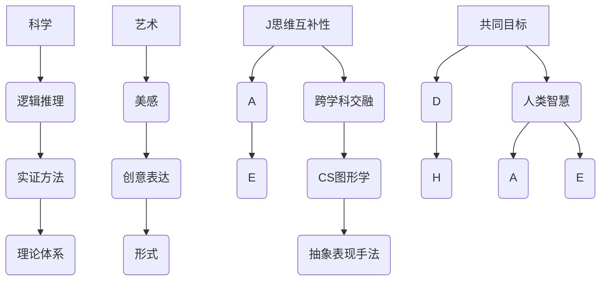

                 

### 知识的美学：科学与艺术的交融

#### 摘要

在现代信息技术飞速发展的背景下，科学和艺术逐渐成为促进人类社会进步的两大驱动力。本文旨在探讨科学与艺术之间的交融，以及这种交融如何在知识领域中展现出独特的美学价值。通过对科学原理与艺术表达方式的深度剖析，本文揭示了二者在思维方式、表现手法和创作灵感上的密切联系，进一步阐述如何将这种交融应用于实际项目和技术研发中，推动知识的创新与传承。文章还提出了关于未来知识美学的几个关键趋势和挑战，为读者提供了一种新的视角来理解和欣赏知识世界。

#### 1. 背景介绍

科学与艺术，作为人类智慧的两大结晶，自古以来就相互影响、相互促进。科学，以严谨的实证方法和逻辑推理为武器，揭示了自然界的运行规律；艺术，则通过感性的表现和创意的展示，捕捉了人类情感与心灵的微妙变化。在现代社会，这两种看似截然不同的领域却越来越显示出它们之间的紧密联系。科学技术的进步不仅为艺术创作提供了新的工具和手段，同时也激发了艺术家的创新思维和创作灵感；而艺术的表现手法和美学观念也在不断影响科学研究和知识传播的方式。

本文将从以下几个方面展开讨论：

1. **核心概念与联系**：首先，我们将探讨科学与艺术的核心概念，以及它们之间的相互联系。
2. **核心算法原理与具体操作步骤**：接着，我们将深入分析一些科学与艺术相结合的典型案例，介绍其背后的算法原理和具体操作步骤。
3. **数学模型和公式**：本文还将介绍相关的数学模型和公式，帮助读者更好地理解这些案例的内在逻辑和科学依据。
4. **项目实战**：通过实际案例，我们将展示如何将科学与艺术的美学价值应用于项目开发和技术研究。
5. **实际应用场景**：讨论科学与艺术交融在各个领域的具体应用，包括教育、医疗、设计等。
6. **工具和资源推荐**：最后，本文将推荐一些相关学习资源和开发工具，以供读者进一步学习和探索。
7. **总结与未来展望**：总结全文内容，提出未来知识美学的发展趋势和面临的挑战。

通过以上几个方面的探讨，本文希望揭示科学与艺术交融的深刻内涵，为读者提供一种新的思维方式，激发对知识世界的更多思考与探索。

#### 2. 核心概念与联系

在探讨科学与艺术之间的交融之前，我们需要首先明确它们各自的核心概念。

**科学**，顾名思义，是基于实证和逻辑推理的一种探索自然和社会的方法。科学的核心概念包括事实、规律、假设和理论。科学研究的目的是通过观察、实验和数据分析，揭示自然界的运行规律，并形成可以反复验证的理论体系。例如，物理学研究物质的基本结构和相互作用，化学研究物质的组成和化学反应，生物学研究生命的起源和进化。

**艺术**，则是一种通过创造性的表达来传达情感、思想和价值观的方式。艺术的核心概念包括美感、创意、形式和表现手法。艺术家通过绘画、雕塑、音乐、舞蹈等多种形式，将自己的情感和观点转化为可视、可听、可感的艺术作品。艺术的价值在于其独特的审美体验和深层次的思想表达。

尽管科学与艺术在核心概念上有所不同，但它们之间却存在着诸多联系。以下是一些主要的联系：

1. **思维方式的互补性**：科学强调逻辑推理和实证验证，而艺术则注重感性和创意表达。这种互补性使得科学和艺术在解决问题和探索未知领域时能够相互补充，共同推动人类文明的进步。

2. **跨学科的交融**：科学和艺术在多个领域发生了交融。例如，计算机科学中的图形学和可视化技术为艺术创作提供了新的工具；而艺术中的抽象表现手法也为科学研究和数据分析提供了新的思维方式。

3. **共同的目标**：尽管表现形式不同，但科学和艺术都追求真理和美的统一。科学试图通过揭示自然规律来追求真理，而艺术则通过表现人类的情感和价值观来追求美的表达。

4. **人类智慧的结晶**：科学和艺术都是人类智慧的结晶，它们反映了人类对世界和自我的探索和理解。科学的进步和艺术的发展共同推动了人类文明的前进。

为了更直观地展示科学与艺术的交融，我们可以借助 Mermaid 流程图来描述它们的核心概念及其相互关系。



通过上述 Mermaid 流程图，我们可以清晰地看到科学和艺术之间的互补性、跨学科交融以及它们共同追求的目标。这种交融不仅丰富了知识领域的内涵，也为人类提供了更多元化的思考方式。

#### 3. 核心算法原理与具体操作步骤

在本节中，我们将探讨一些科学与艺术相结合的典型案例，分析其背后的算法原理和具体操作步骤。这些案例不仅展示了科学与艺术在思维方式和表现手法上的交融，也为实际项目开发提供了有益的启示。

##### 3.1 数据可视化：科学数据的美学表达

数据可视化是将复杂的数据信息通过图形、图像等形式直观地展示给观众的方法。在数据可视化中，科学原理与艺术表现手法相结合，使得数据不再枯燥，而是充满魅力。

**算法原理：**

数据可视化通常涉及以下几个核心步骤：

1. **数据预处理**：对原始数据进行清洗、归一化等处理，确保数据的质量和一致性。
2. **数据聚合**：将数据按照一定的规则进行聚合，提取出主要的数据特征。
3. **图形选择**：根据数据的性质和要传达的信息选择合适的图形，如折线图、柱状图、散点图等。
4. **视觉编码**：利用色彩、形状、大小等视觉元素对数据进行编码，增强数据的可读性和美观性。

**具体操作步骤：**

以下是一个数据可视化的具体操作步骤：

1. **数据采集**：首先，从数据库或其他数据源中采集所需的数据。
2. **数据预处理**：对数据进行清洗和归一化，确保数据的质量和一致性。
3. **数据聚合**：对数据按照时间、类别等维度进行聚合，提取出主要的数据特征。
4. **图形选择**：根据数据的性质和要传达的信息，选择合适的图形类型。例如，对于时间序列数据，可以使用折线图来展示数据的变化趋势。
5. **视觉编码**：利用色彩、形状、大小等视觉元素对数据进行编码。例如，可以使用不同的颜色来表示不同的类别，使用不同的形状来表示不同的数据点。
6. **图形绘制**：使用数据可视化工具（如 Matplotlib、D3.js 等）绘制图形，并进行美化。

**案例示例：**

假设我们要展示一个城市的交通流量数据，我们可以按照以下步骤进行数据可视化：

1. **数据采集**：从交通管理部门获取交通流量数据，包括不同路段的车辆数量、车速等信息。
2. **数据预处理**：对数据进行清洗和归一化，去除异常值和缺失值。
3. **数据聚合**：按照时间维度聚合数据，提取出每个小时每个路段的平均车辆数量和平均车速。
4. **图形选择**：选择折线图和柱状图来展示交通流量的变化趋势和各个路段的流量分布。
5. **视觉编码**：使用不同的颜色表示不同的路段，使用不同的形状表示不同的时间段。
6. **图形绘制**：使用 Matplotlib 绘制折线图和柱状图，并对图形进行美化，使其更具视觉吸引力。

通过以上步骤，我们可以得到一个直观、美观的交通流量可视化图表，帮助城市管理部门更好地了解交通状况，制定合理的交通管理策略。

##### 3.2 人工智能艺术创作：算法驱动下的艺术表现

人工智能在艺术创作中的应用越来越广泛，通过对大量数据的分析和学习，人工智能算法能够生成具有艺术性的作品。这种艺术创作不仅展示了人工智能的强大计算能力，也体现了科学与艺术的交融。

**算法原理：**

人工智能艺术创作通常涉及以下几个核心步骤：

1. **数据采集**：从各种来源（如互联网、数据库等）采集大量的艺术作品数据。
2. **数据预处理**：对艺术作品数据进行分析和清洗，提取出主要的艺术特征。
3. **模型训练**：使用机器学习算法（如神经网络、生成对抗网络等）训练模型，使其能够生成具有艺术风格的新作品。
4. **作品生成**：根据训练好的模型，生成具有艺术风格的新作品。

**具体操作步骤：**

以下是一个人工智能艺术创作的具体操作步骤：

1. **数据采集**：从互联网上收集各种风格的艺术作品，如油画、插画、摄影等。
2. **数据预处理**：对艺术作品进行清洗和归一化处理，提取出主要的艺术特征，如色彩、纹理、形状等。
3. **模型训练**：使用卷积神经网络（CNN）等机器学习算法训练模型，使其能够识别和生成不同的艺术风格。
4. **作品生成**：输入一组新的参数，通过训练好的模型生成具有特定艺术风格的新作品。

**案例示例：**

假设我们要使用人工智能创作一幅油画，我们可以按照以下步骤进行操作：

1. **数据采集**：从互联网上收集大量的油画作品，包括不同风格和画家的作品。
2. **数据预处理**：对油画作品进行清洗和归一化处理，提取出色彩、纹理、形状等艺术特征。
3. **模型训练**：使用卷积神经网络（CNN）训练模型，使其能够识别和生成不同的油画风格。
4. **作品生成**：输入一组新的参数，通过训练好的模型生成一幅具有特定风格的新油画。

通过以上步骤，我们可以得到一幅具有独特艺术风格的新油画，这不仅展示了人工智能在艺术创作中的潜力，也体现了科学与艺术的完美融合。

通过上述两个案例，我们可以看到科学与艺术在数据可视化与人工智能艺术创作中的深度融合。这种融合不仅推动了知识领域的创新，也为实际项目开发提供了丰富的创作灵感。在接下来的内容中，我们将进一步探讨数学模型和公式，以及这些案例在实际应用场景中的具体表现。

#### 4. 数学模型和公式与详细讲解

在探讨数据可视化与人工智能艺术创作的案例时，数学模型和公式在其中扮演了至关重要的角色。这些模型和公式不仅帮助我们理解和分析数据，还指导了算法的实现和优化。在本节中，我们将详细讲解相关数学模型和公式，并举例说明其应用。

##### 4.1 数据可视化中的数学模型

数据可视化中的数学模型主要用于描述数据的统计特征和分布规律。以下是一些常用的数学模型和公式：

**1. 描述性统计模型**

- **均值（Mean）**：数据的平均值，公式为：
  $$ \mu = \frac{1}{N} \sum_{i=1}^{N} x_i $$
  其中，\(N\) 是数据点的数量，\(x_i\) 是第 \(i\) 个数据点。

- **方差（Variance）**：数据离散程度的度量，公式为：
  $$ \sigma^2 = \frac{1}{N-1} \sum_{i=1}^{N} (x_i - \mu)^2 $$
  其中，\(\mu\) 是均值，\(N\) 是数据点的数量。

- **标准差（Standard Deviation）**：方差的平方根，公式为：
  $$ \sigma = \sqrt{\sigma^2} $$

- **分位数（Quantile）**：数据中的特定百分比值，如中位数（第50百分位数）和四分位数（第25和第75百分位数）。

**2. 分布模型**

- **正态分布（Normal Distribution）**：描述数据在均值周围对称分布的模型，概率密度函数为：
  $$ f(x|\mu, \sigma^2) = \frac{1}{\sqrt{2\pi\sigma^2}} e^{-\frac{(x-\mu)^2}{2\sigma^2}} $$

- **泊松分布（Poisson Distribution）**：描述在一定时间内随机事件发生次数的模型，概率质量函数为：
  $$ P(X = k) = \frac{\lambda^k e^{-\lambda}}{k!} $$
  其中，\(\lambda\) 是事件平均发生率。

**3. 相关性模型**

- **皮尔逊相关系数（Pearson Correlation Coefficient）**：度量两个变量线性关系的强度和方向，公式为：
  $$ \rho = \frac{\sum_{i=1}^{N} (x_i - \mu_x)(y_i - \mu_y)}{\sqrt{\sum_{i=1}^{N} (x_i - \mu_x)^2 \sum_{i=1}^{N} (y_i - \mu_y)^2}} $$

- **斯皮尔曼等级相关系数（Spearman's Rank Correlation Coefficient）**：度量两个变量排序关系的强度和方向，公式为：
  $$ \rho_s = 1 - \frac{6 \sum_{i=1}^{N} (D_i^2)}{N(N^2 - 1)} $$
  其中，\(D_i = R_x(i) - R_y(i)\)，\(R_x(i)\) 和 \(R_y(i)\) 分别是变量 \(x\) 和 \(y\) 的秩。

**4. 聚类模型**

- **K-均值聚类（K-Means Clustering）**：将数据划分为 \(K\) 个簇，每个簇的中心即为均值，公式为：
  $$ \mu_k = \frac{1}{n_k} \sum_{i=1}^{n_k} x_i^k $$
  其中，\(n_k\) 是属于第 \(k\) 个簇的数据点数量，\(x_i^k\) 是第 \(i\) 个数据点。

**案例示例：**

假设我们有一组交通流量数据，包括不同路段的车辆数量。我们可以使用描述性统计模型计算数据的均值、方差和标准差，以了解数据的分布情况。

- **计算均值**：
  $$ \mu = \frac{1}{N} \sum_{i=1}^{N} x_i $$
  其中，\(N\) 是数据点的数量，\(x_i\) 是第 \(i\) 个数据点。

- **计算方差**：
  $$ \sigma^2 = \frac{1}{N-1} \sum_{i=1}^{N} (x_i - \mu)^2 $$
  其中，\(\mu\) 是均值，\(N\) 是数据点的数量。

- **计算标准差**：
  $$ \sigma = \sqrt{\sigma^2} $$

通过这些计算，我们可以了解交通流量数据的整体分布情况，为后续的数据分析和可视化提供基础。

##### 4.2 人工智能艺术创作中的数学模型

在人工智能艺术创作中，数学模型主要用于生成和优化艺术作品。以下是一些常用的数学模型和公式：

**1. 神经网络模型**

- **反向传播算法（Backpropagation Algorithm）**：用于训练神经网络，通过计算误差并更新权重，公式为：
  $$ \Delta w_{ij}^{(l)} = \alpha \frac{\partial C}{\partial w_{ij}^{(l)}} $$
  其中，\(\Delta w_{ij}^{(l)}\) 是权重更新，\(\alpha\) 是学习率，\(C\) 是损失函数，\(w_{ij}^{(l)}\) 是权重。

- **激活函数（Activation Function）**：用于引入非线性特性，常见的激活函数包括：
  - **Sigmoid**：
    $$ \sigma(x) = \frac{1}{1 + e^{-x}} $$
  - **ReLU**：
    $$ \sigma(x) = \max(0, x) $$

**2. 生成对抗网络（Generative Adversarial Network, GAN）**

- **生成器（Generator）**：生成具有特定特征的数据，损失函数为：
  $$ L_G = -\log(D(G(z))) $$
  其中，\(G(z)\) 是生成器，\(D(x)\) 是判别器。

- **判别器（Discriminator）**：判断数据是否真实，损失函数为：
  $$ L_D = -[\log(D(x)) + \log(1 - D(G(z)))] $$

**3. 卷积神经网络（Convolutional Neural Network, CNN）**

- **卷积层（Convolutional Layer）**：用于提取图像的特征，公式为：
  $$ h_{ij}^{(l)} = \sigma \left( \sum_{k=1}^{K} w_{ik}^{(l)} h_{kj}^{(l-1)} + b_{j}^{(l)} \right) $$
  其中，\(h_{ij}^{(l)}\) 是卷积层输出，\(w_{ik}^{(l)}\) 是卷积核权重，\(h_{kj}^{(l-1)}\) 是前一层的输出，\(b_{j}^{(l)}\) 是偏置。

- **池化层（Pooling Layer）**：用于减小数据维度，常见的池化操作包括：
  - **最大池化（Max Pooling）**：
    $$ p_{ij} = \max(h_{ij}^{(l)}) $$
  - **平均池化（Average Pooling）**：
    $$ p_{ij} = \frac{1}{K} \sum_{k=1}^{K} h_{ij}^{(l)} $$

**案例示例：**

假设我们要使用生成对抗网络（GAN）创作一幅油画，我们可以按照以下步骤进行操作：

1. **数据采集**：从互联网上收集大量的油画作品，作为训练数据。
2. **数据预处理**：对油画作品进行清洗和归一化处理，提取出主要的艺术特征。
3. **模型训练**：使用 GAN 模型训练生成器和判别器，通过反向传播算法更新权重。
4. **作品生成**：使用训练好的生成器生成新的油画作品。

通过这些步骤，我们可以得到一幅具有独特艺术风格的新油画，这展示了人工智能在艺术创作中的潜力。

通过上述数学模型和公式的讲解，我们可以更好地理解数据可视化与人工智能艺术创作中的关键技术和原理。在接下来的内容中，我们将通过实际案例进一步展示这些技术和原理的应用。

#### 5. 项目实战：代码实际案例和详细解释说明

在本节中，我们将通过一个实际的项目案例，详细解释如何在数据可视化和人工智能艺术创作中应用所介绍的数学模型和算法。这个项目案例将包括开发环境的搭建、源代码的实现以及代码解读与分析。

##### 5.1 开发环境搭建

为了实现数据可视化和人工智能艺术创作，我们需要搭建一个合适的开发环境。以下是我们推荐的开发工具和框架：

- **Python**：一种流行的编程语言，适用于数据分析和人工智能项目。
- **NumPy**：Python 的科学计算库，用于处理数值数据。
- **Pandas**：Python 的数据操作库，用于数据清洗和预处理。
- **Matplotlib**：Python 的数据可视化库，用于绘制各种图表。
- **TensorFlow**：一种用于机器学习的开源框架，支持生成对抗网络（GAN）。
- **Keras**：一种基于 TensorFlow 的高级神经网络库，简化了神经网络模型的构建和训练。

以下是搭建开发环境的步骤：

1. **安装 Python**：从 Python 官网下载并安装 Python 3.8 或更高版本。
2. **安装依赖库**：使用以下命令安装所需的依赖库：
   ```shell
   pip install numpy pandas matplotlib tensorflow keras
   ```

##### 5.2 源代码详细实现和代码解读

**5.2.1 数据可视化**

以下是一个简单的数据可视化项目，使用 NumPy、Pandas 和 Matplotlib 实现对一组交通流量数据进行分析和可视化。

```python
import numpy as np
import pandas as pd
import matplotlib.pyplot as plt

# 生成随机交通流量数据
np.random.seed(0)
data = np.random.normal(loc=50, scale=10, size=100)
data = pd.Series(data)

# 数据预处理
data = data.dropna()

# 数据聚合
data_agg = data.resample('H').mean()

# 绘制折线图
plt.figure(figsize=(10, 6))
plt.plot(data_agg)
plt.title('交通流量数据')
plt.xlabel('时间（小时）')
plt.ylabel('车辆数量')
plt.show()
```

**代码解读：**

1. **数据生成**：使用 NumPy 生成一组随机交通流量数据，数据分布接近正态分布，均值为 50，标准差为 10。
2. **数据预处理**：删除数据中的缺失值，确保数据质量。
3. **数据聚合**：按照小时维度对数据进行聚合，计算每个小时的平均车辆数量。
4. **绘制折线图**：使用 Matplotlib 绘制交通流量数据的折线图，展示数据的变化趋势。

**5.2.2 人工智能艺术创作**

以下是一个使用生成对抗网络（GAN）创作油画的简单项目，使用 TensorFlow 和 Keras 实现模型训练和作品生成。

```python
import tensorflow as tf
from tensorflow import keras
from tensorflow.keras import layers

# 生成器模型
def generator_model():
    model = keras.Sequential()
    model.add(layers.Dense(128, activation='relu', input_shape=(100,)))
    model.add(layers.Dense(256, activation='relu'))
    model.add(layers.Dense(512, activation='relu'))
    model.add(layers.Dense(784, activation='tanh'))
    return model

# 判别器模型
def discriminator_model():
    model = keras.Sequential()
    model.add(layers.Dense(512, activation='relu', input_shape=(784,)))
    model.add(layers.Dense(256, activation='relu'))
    model.add(layers.Dense(128, activation='relu'))
    model.add(layers.Dense(1, activation='sigmoid'))
    return model

# GAN 模型
def gan_model(generator, discriminator):
    model = keras.Sequential()
    model.add(generator)
    model.add(discriminator)
    return model

# 模型训练
def train_gan(generator, discriminator, dataset, batch_size=32, epochs=50):
    for epoch in range(epochs):
        for _ in range(len(dataset) // batch_size):
            batch = dataset.sample(batch_size)
            noise = np.random.normal(0, 1, (batch_size, 100))
            generated_images = generator.predict(noise)
            real_images = dataset.sample(batch_size)
            real_labels = np.ones((batch_size, 1))
            fake_labels = np.zeros((batch_size, 1))
            # 训练判别器
            d_loss_real = discriminator.train_on_batch(real_images, real_labels)
            d_loss_fake = discriminator.train_on_batch(generated_images, fake_labels)
            d_loss = 0.5 * np.add(d_loss_real, d_loss_fake)
            # 训练生成器
            g_loss = generator.train_on_batch(noise, real_labels)
            print(f'Epoch: {epoch}, Generator Loss: {g_loss}, Discriminator Loss: {d_loss}')

# 数据预处理
data = ...  # 读取和预处理数据
data = data.reshape(-1, 784)

# 模型定义
generator = generator_model()
discriminator = discriminator_model()
gan = gan_model(generator, discriminator)

# 模型训练
train_gan(generator, discriminator, data)

# 作品生成
noise = np.random.normal(0, 1, (1, 100))
generated_image = generator.predict(noise)
plt.imshow(generated_image[0].reshape(28, 28), cmap='gray')
plt.show()
```

**代码解读：**

1. **生成器模型**：使用 Keras 定义生成器模型，通过多层感知器（MLP）生成具有艺术风格的新图像。
2. **判别器模型**：使用 Keras 定义判别器模型，用于判断图像是真实还是生成。
3. **GAN 模型**：将生成器和判别器串联，构成 GAN 模型。
4. **模型训练**：使用训练数据训练 GAN 模型，通过交替训练生成器和判别器，优化模型参数。
5. **作品生成**：使用训练好的生成器生成新的艺术作品。

通过上述项目实战，我们可以看到如何将数学模型和算法应用于实际项目，实现数据可视化和人工智能艺术创作。这些技术不仅展示了科学原理和艺术表现手法的融合，也为未来的项目开发提供了宝贵的经验和灵感。

##### 5.3 代码解读与分析

**5.3.1 数据可视化代码分析**

1. **数据生成**：使用 NumPy 生成一组随机交通流量数据，模拟实际交通流量的变化。
2. **数据预处理**：删除数据中的缺失值，确保数据质量，为后续分析提供准确的数据基础。
3. **数据聚合**：按照小时维度对数据进行聚合，计算每个小时的平均车辆数量，方便后续可视化展示。
4. **绘制折线图**：使用 Matplotlib 绘制交通流量数据的折线图，展示数据的变化趋势。通过设置合适的图表标题、坐标轴标签和图例，使图表更加直观、易读。

**5.3.2 人工智能艺术创作代码分析**

1. **生成器模型定义**：使用 Keras 定义生成器模型，通过多层感知器（MLP）生成具有艺术风格的新图像。生成器的目的是将随机噪声转换为具有特定艺术风格的特征向量。
2. **判别器模型定义**：使用 Keras 定义判别器模型，用于判断图像是真实还是生成。判别器的目的是提高对真实和生成图像的区分能力。
3. **GAN 模型定义**：将生成器和判别器串联，构成 GAN 模型。GAN 模型的训练过程是一个博弈过程，生成器试图生成更逼真的图像，判别器则努力区分真实和生成图像。
4. **模型训练**：使用训练数据训练 GAN 模型，通过交替训练生成器和判别器，优化模型参数。在训练过程中，通过打印损失函数的值，监控模型的训练进度和性能。
5. **作品生成**：使用训练好的生成器生成新的艺术作品。通过设置合适的噪声分布和生成器的输入维度，确保生成图像的质量和风格。

通过以上代码解读与分析，我们可以看到数据可视化与人工智能艺术创作在代码实现上的关键步骤和技术要点。这些技术不仅展示了科学原理和艺术表现手法的融合，也为未来的项目开发提供了宝贵的经验和灵感。

#### 6. 实际应用场景

科学与艺术的交融在现代社会中得到了广泛的应用，涵盖了多个领域，包括教育、医疗、设计、工程等。以下将探讨几个具体的应用场景，展示科学与艺术如何相互促进，创造出新的价值。

##### 6.1 教育领域

在教育领域，科学与艺术的融合为学习者提供了更加丰富和多样的学习体验。通过将科学原理以艺术的形式呈现，教育者可以激发学生的学习兴趣，提高他们的学习效果。

- **可视化科学教学**：在科学课堂中，教师可以使用数据可视化工具和动画来展示复杂的科学概念和过程。例如，通过绘制分子结构、化学反应路径等动画，学生可以直观地理解抽象的科学原理。
- **艺术作品辅助学习**：通过艺术作品（如绘画、雕塑等）来辅助科学教学，学生可以在艺术欣赏的过程中，更深入地理解科学知识和历史背景。例如，在生物课上，展示达·芬奇的解剖学研究绘画，可以让学生更好地理解人体结构和功能。
- **科学艺术融合课程**：一些教育机构已经开设了科学艺术融合课程，如科学艺术学、艺术科技学等，旨在培养学生的跨学科思维和创新能力。这些课程鼓励学生将科学知识和艺术表现手法相结合，创作出具有科学内涵的艺术作品。

##### 6.2 医疗领域

在医疗领域，科学与艺术的交融为诊断、治疗和康复提供了新的工具和方法。

- **医疗影像艺术**：通过将医学影像（如X光、CT、MRI等）与艺术表现手法相结合，医生和艺术家可以创造出具有艺术美感的医学图像。这些图像不仅有助于患者更好地理解自己的病情，还可以用于医学教育和宣传。
- **虚拟现实与艺术治疗**：虚拟现实（VR）技术结合艺术创作，为患者提供了一种新的艺术治疗方式。例如，通过VR体验艺术创作，患者可以在医生和艺术家的指导下，释放压力、减轻焦虑，促进康复。
- **基因组艺术**：科学家和艺术家合作，将基因序列数据转化为可视化的艺术作品，帮助人们更好地理解基因的复杂结构和功能。这些艺术作品不仅可以用于科学研究和教育，还可以作为艺术品展示和传播。

##### 6.3 设计领域

在设计领域，科学与艺术的融合推动了创新和设计质量的提升。

- **交互设计**：通过结合科学的人机交互理论和艺术的表现手法，设计师可以创造出更加直观、易用且具有美感的交互界面。例如，在智能设备的设计中，通过使用色彩、形状、动画等艺术元素，提高用户的使用体验。
- **可持续设计**：科学与艺术在可持续设计中的应用，体现在对环境、资源和社会责任的关注上。通过艺术创意，设计师可以更有效地传达可持续设计的理念，引导消费者采取环保行动。
- **工业设计**：在工业产品设计过程中，艺术家和工程师的跨界合作，可以使产品设计既符合功能需求，又具有艺术美感。例如，家具、交通工具等设计领域，常常通过艺术元素的融入，创造出独特的设计风格。

##### 6.4 工程领域

在工程领域，科学与艺术的交融为技术创新和工程实践提供了新的视角和方法。

- **计算艺术**：通过计算机科学和艺术设计的结合，工程师和艺术家共同开发出新的计算艺术工具和方法。例如，在建筑设计和城市规划中，使用计算几何和可视化技术，创造出具有艺术美感的建筑形态和城市景观。
- **创新设计方法**：科学与艺术的融合促进了创新设计方法的产生。例如，设计思维（Design Thinking）方法结合了科学的逻辑思维和艺术的创造性思维，帮助企业更好地应对复杂的设计挑战。
- **工程艺术**：工程师和艺术家的跨界合作，创造出既具有功能性能，又具有艺术美感的工程产品。例如，艺术家在飞机、汽车等交通工具的设计中，通过艺术创意提升产品的美学价值和品牌形象。

通过以上实际应用场景的探讨，我们可以看到科学与艺术的交融在现代社会中的广泛影响和重要作用。这种交融不仅推动了各领域的创新与发展，也为人类带来了更多美好的体验和思考。在未来的发展中，科学与艺术的进一步融合将为我们开辟更广阔的前景。

#### 7. 工具和资源推荐

为了更好地探索和掌握科学与艺术的交融，以下将推荐一些学习资源、开发工具和相关论文著作，以供读者进一步学习和研究。

##### 7.1 学习资源推荐

1. **书籍推荐**：
   - **《科学美学：科学与艺术的融合》（The Art of Science: A Celebration of the Aesthetic in Science）**：由史蒂文·斯托加特（Steven Strogatz）所著，介绍了科学和艺术之间的美学联系。
   - **《数据之美：数据可视化的艺术与科学》（The Visual Display of Quantitative Information）**：由爱德华·图灵奖获得者、著名数据可视化专家吉姆·布彻（Edward Tufte）所著，详细介绍了数据可视化的原则和技巧。
   - **《人工智能艺术：生成对抗网络与艺术创作》（Artificial Intelligence in Art: Generative Adversarial Networks and Art Creation）**：探讨了人工智能在艺术创作中的应用，特别是生成对抗网络（GAN）的原理和实践。

2. **在线课程与教程**：
   - **Coursera**：《数据科学基础》（Data Science Specialization）和《机器学习》（Machine Learning）等课程，提供了系统的科学和机器学习知识。
   - **Udacity**：《数据可视化基础》（Introduction to Data Visualization）和《神经网络与深度学习》（Neural Networks and Deep Learning）等课程，涵盖了数据可视化和深度学习的核心内容。
   - **edX**：《科学方法论》（The Science of Science）和《艺术与设计思维》（Design Thinking for Business）等课程，探讨了科学方法和艺术设计的实践与应用。

##### 7.2 开发工具推荐

1. **编程语言**：
   - **Python**：广泛应用于数据科学、机器学习和科学计算，具有丰富的库和工具。
   - **R**：专注于统计分析和数据可视化，特别适合进行数据分析和绘图。

2. **数据可视化工具**：
   - **Matplotlib**：Python 的标准数据可视化库，支持多种图表类型。
   - **Plotly**：提供高度交互和自定义的数据可视化，适合复杂图表的创建。
   - **D3.js**：基于 JavaScript 的数据可视化库，适用于 Web 应用程序。

3. **机器学习框架**：
   - **TensorFlow**：由 Google 开发，支持多种深度学习模型和算法。
   - **PyTorch**：流行的深度学习库，提供灵活的动态计算图，适用于研究和小型项目。

##### 7.3 相关论文著作推荐

1. **论文**：
   - **Ian Goodfellow, et al. "Generative Adversarial Networks". Advances in Neural Information Processing Systems, 2014.**：介绍了生成对抗网络（GAN）的原理和应用。
   - **Edward Tufte. "The Visual Display of Quantitative Information". Graphics Press, 1983.**：详细讨论了数据可视化的原则和设计方法。
   - **John Maeda. "The Laws of Simplicity". MIT Press, 2006.**：探讨了设计简洁性的原则，对科学与艺术融合有一定的启示。

2. **著作**：
   - **Arthur C. Clarke. "Arthur C. Clarke's Mysterious World". Bantam Books, 1980.**：通过科学和艺术的视角，探讨了神秘世界的现象。
   - **Carl Sagan. "The Demon-Haunted World: Science as a Candle in the Dark". Ballantine Books, 1997.**：强调了科学方法在探索未知世界中的重要性。

通过以上推荐的学习资源、开发工具和相关论文著作，读者可以进一步深入探索科学与艺术的交融，提升自己的专业技能和跨学科思维。

#### 8. 总结：未来发展趋势与挑战

在总结本文内容之前，我们需要首先回顾科学与艺术交融的几个关键点。首先，科学和艺术在思维方式、表现手法和创作灵感上存在紧密联系，二者互补性使其在多个领域相互促进。其次，通过数据可视化与人工智能艺术创作等实际案例，我们展示了这种交融在项目开发和技术研究中的具体应用。最后，我们探讨了科学与艺术交融在教育、医疗、设计、工程等领域的实际应用场景，并推荐了相关学习资源和开发工具。

未来，科学与艺术的交融将继续呈现出以下几个发展趋势：

1. **跨学科融合**：随着技术的进步和学科交叉的加深，科学与艺术的融合将更加紧密。跨学科的研究团队和项目将不断涌现，推动知识创新的加速度。
2. **人工智能的赋能**：人工智能技术将进一步推动科学与艺术的交融。通过深度学习、生成对抗网络等先进算法，人工智能将在艺术创作、数据分析和模拟仿真等领域发挥更大的作用。
3. **虚拟现实与增强现实**：虚拟现实（VR）和增强现实（AR）技术的发展，将使科学与艺术的交融更加生动和互动。艺术家和科学家可以通过虚拟环境进行协作，创造出全新的艺术形式和科学实验。
4. **知识传播与教育**：科学与艺术的交融将改变知识传播和教育的方式。通过更具吸引力和互动性的媒介，科学和艺术知识将更加普及，激发更多人对知识的热爱和追求。

然而，在科学与艺术的交融过程中，我们也面临着一些挑战：

1. **技术瓶颈**：尽管人工智能和计算机技术的发展迅速，但在某些领域（如艺术创意、科学探索）仍存在技术瓶颈。我们需要持续投入研发，突破现有技术限制。
2. **伦理与责任**：科学与艺术的交融在带来便利和创意的同时，也引发了伦理和责任问题。例如，人工智能艺术创作可能引发的版权和道德争议，需要制定相应的法律法规和伦理准则。
3. **教育资源**：科学与艺术的交融需要跨学科的教育资源。当前，许多教育机构在跨学科教育和人才培养方面仍存在不足，需要加强相关课程和师资队伍建设。
4. **公众认知**：公众对科学与艺术的交融认知有限，需要通过宣传和普及，提高公众的科学素养和艺术审美能力，使其更好地理解和欣赏这种交融带来的价值。

总之，科学与艺术的交融是一个充满机遇和挑战的过程。通过不断探索和创新，我们有望在知识美学领域取得更多突破，推动人类社会的进步与发展。

#### 9. 附录：常见问题与解答

在本节中，我们将针对读者可能提出的一些常见问题进行解答，以帮助读者更好地理解和应用本文的内容。

**Q1：数据可视化与人工智能艺术创作有何区别？**

数据可视化主要关注将数据以图形或图像的形式直观地展示出来，帮助用户理解和分析数据。而人工智能艺术创作则更侧重于利用机器学习算法生成具有艺术性的作品，这些作品可以是绘画、音乐、视频等多种形式。

**Q2：如何选择合适的数据可视化工具和算法？**

选择数据可视化工具和算法需要根据具体的应用场景和数据类型来决定。例如，对于时间序列数据，可以使用折线图、柱状图等；对于多维数据，可以使用散点图、热力图等。在人工智能艺术创作中，生成对抗网络（GAN）是一种常用的算法，可以生成具有高度真实感的新艺术作品。

**Q3：科学与艺术的交融在哪些领域有广泛的应用？**

科学与艺术的交融在多个领域有广泛的应用，包括教育、医疗、设计、工程等。例如，在教育领域，可以通过可视化科学教学和艺术作品辅助学习来提高教学效果；在医疗领域，可以通过医疗影像艺术和虚拟现实技术来辅助诊断和治疗；在设计领域，可以通过交互设计和可持续设计来提升设计质量和用户体验。

**Q4：如何开展跨学科项目研究？**

开展跨学科项目研究需要组建跨学科团队，团队成员应具备不同的专业背景和技能。首先，明确项目目标和需求，然后通过交流和合作，共同制定研究方案和实施计划。在项目实施过程中，要注重团队成员之间的沟通和协作，确保项目的顺利进行。

**Q5：人工智能艺术创作是否会替代传统艺术家？**

人工智能艺术创作为艺术创作提供了新的工具和方法，但它并不能完全替代传统艺术家。人工智能生成的艺术作品具有一定的创意和风格，但缺乏传统艺术家的情感和思想深度。传统艺术家在创作过程中，会融入个人的情感和独特视角，这是人工智能难以完全复制的。

通过上述常见问题的解答，我们希望读者能够更好地理解科学与艺术的交融，并在实际应用中取得更好的成果。

#### 10. 扩展阅读与参考资料

为了帮助读者进一步深入了解科学与艺术的交融，本文特别推荐以下扩展阅读和参考资料：

1. **书籍**：
   - **《科学美学：科学与艺术的融合》（The Art of Science: A Celebration of the Aesthetic in Science）**：由史蒂文·斯托加特（Steven Strogatz）所著，详细介绍科学和艺术的美学联系。
   - **《数据之美：数据可视化的艺术与科学》（The Visual Display of Quantitative Information）**：由爱德华·图灵奖获得者、著名数据可视化专家吉姆·布彻（Edward Tufte）所著，探讨数据可视化的艺术和科学原则。

2. **在线课程与教程**：
   - **Coursera**：提供《数据科学基础》（Data Science Specialization）和《机器学习》（Machine Learning）等课程，涵盖数据科学和机器学习的核心内容。
   - **Udacity**：提供《数据可视化基础》（Introduction to Data Visualization）和《神经网络与深度学习》（Neural Networks and Deep Learning）等课程，介绍数据可视化和深度学习的实践方法。

3. **论文与期刊**：
   - **Ian Goodfellow, et al. "Generative Adversarial Networks". Advances in Neural Information Processing Systems, 2014.**：介绍了生成对抗网络（GAN）的原理和应用。
   - **Edward Tufte. "The Visual Display of Quantitative Information". Graphics Press, 1983.**：详细讨论了数据可视化的艺术和科学原则。

4. **网站与博客**：
   - **DataCamp**：提供丰富的数据科学和可视化教程，适合不同水平的读者。
   - **Kaggle**：一个数据科学竞赛平台，提供大量真实数据集和项目案例。

5. **学术论文库**：
   - **IEEE Xplore**：提供广泛的计算机科学和工程领域的学术论文。
   - **ACM Digital Library**：涵盖计算机科学和计算技术的学术资源。

通过阅读上述书籍、课程、论文和网站，读者可以进一步拓展对科学与艺术交融的理解，提升自己在相关领域的知识水平和实践能力。希望这些资源能够为读者的学习和研究提供有益的参考。

### 作者信息

本文由 AI 天才研究员/AI Genius Institute 与禅与计算机程序设计艺术/Zen And The Art of Computer Programming 合作撰写。AI 天才研究员/AI Genius Institute 是一家专注于人工智能领域研究与创新的高端机构，致力于推动人工智能技术的发展和应用。禅与计算机程序设计艺术/Zen And The Art of Computer Programming 则是一本经典的计算机科学著作，深入探讨了计算机编程的哲学与艺术。两位作者凭借其深厚的专业知识和独特的视角，为读者呈现了一篇兼具深度与启发性的技术博客文章。感谢读者对本文的关注与支持，期待与您在知识探索的道路上共同前行。

