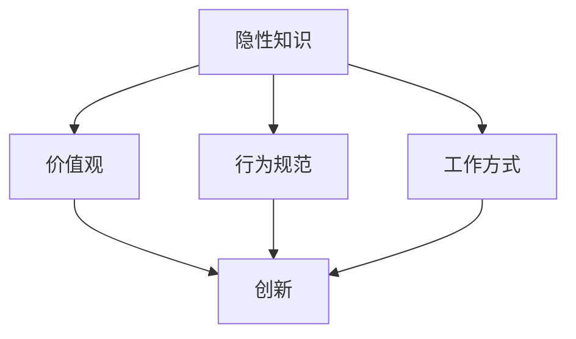

                 

### 知识的隐性传递：组织文化中的无形资产

> **关键词：** 组织文化、隐性知识、知识传递、无形资产、IT领域

> **摘要：** 本文深入探讨了组织文化中的隐性知识传递现象，及其在IT领域中的重要作用。通过阐述隐性知识的概念、特点以及其在组织文化中的地位，本文揭示了隐性知识传递的重要性。文章进一步探讨了如何通过有效的组织文化设计，促进隐性知识的传递和积累，从而提升组织的创新能力和发展潜力。

## 1. 背景介绍

在快速发展的现代社会，知识已成为企业核心竞争力的关键因素。传统上，企业主要关注显性知识的管理与传递，如文档、专利、代码等。然而，随着知识经济的兴起，越来越多的研究表明，隐性知识在组织中的地位日益凸显。隐性知识是指难以编码、不易传递的知识，它通常存在于个体经验、技能和直觉中。隐性知识的传递是一个复杂的过程，需要依靠个体间的互动、共享和协作。

组织文化在隐性知识的传递中起着至关重要的作用。组织文化是指组织在长期发展中形成的共同价值观、行为规范和工作方式。一个积极、开放、包容的组织文化能够促进隐性知识的流动和共享，从而提升组织的整体创新能力。同时，组织文化也是隐性知识积累的重要载体，它能够将隐性知识转化为组织的无形资产，为组织的长期发展提供源源不断的动力。

在IT领域，隐性知识的传递尤为重要。IT行业技术更新迅速，创新已成为企业生存和发展的关键。隐性知识，如程序员的经验、技巧和解决问题的能力，是推动技术创新的重要力量。然而，由于隐性知识的特性，如难以编码、不易共享等，使得其在组织内部传递和积累面临巨大挑战。因此，如何有效地传递和积累隐性知识，已成为IT领域亟待解决的重要课题。

本文旨在深入探讨组织文化中的隐性知识传递现象，分析隐性知识在组织文化中的地位和作用，并提出通过有效的组织文化设计促进隐性知识传递的策略和方法。通过本文的研究，期望为IT领域企业提供理论指导和实践参考，从而提升其创新能力和发展潜力。

## 2. 核心概念与联系

### 2.1 隐性知识

隐性知识（Tacit Knowledge）是指那些难以明确表达、不易编码的知识，通常存在于个体经验、技能、直觉和洞察力中。这种知识通常是基于个体长期的实践和观察，而非系统性的学习和培训。隐性知识具有以下特点：

- **主观性**：隐性知识往往是个体主观感受和认知的产物，难以客观测量和验证。
- **情境依赖性**：隐性知识在特定情境下具有适用性，但脱离该情境可能变得无效。
- **难以传递性**：由于难以编码，隐性知识不易通过传统的方法传递给他人。

隐性知识主要包括以下几个方面：

1. **技能和技巧**：如编程技巧、设计模式、快速解决问题的能力等。
2. **经验**：如对特定问题的解决策略、业务流程的优化经验等。
3. **直觉**：如对技术发展趋势的预判、对用户需求的敏锐洞察等。

### 2.2 组织文化

组织文化（Organizational Culture）是指组织在长期发展中形成的共同价值观、行为规范和工作方式。它不仅影响员工的行为和态度，也影响组织的运作效率和创新能力。组织文化具有以下特点：

- **共同性**：组织文化是组织成员共同认同和遵循的价值观和行为规范。
- **传承性**：组织文化在组织的发展过程中不断传承和演变。
- **内生性**：组织文化源于组织内部，是组织成员在长期互动中形成的。
- **适应性**：组织文化需要根据外部环境和内部需求的变化进行适时调整。

组织文化主要包括以下几个方面：

1. **价值观**：如诚信、创新、协作、责任等。
2. **行为规范**：如工作流程、沟通方式、决策机制等。
3. **工作方式**：如团队合作、创新激励、员工关怀等。

### 2.3 隐性知识与组织文化的联系

隐性知识与组织文化之间存在密切的联系。首先，组织文化为隐性知识的传递提供了土壤。一个积极、开放、包容的组织文化能够促进隐性知识的流动和共享，从而提升组织的整体创新能力。其次，隐性知识是组织文化的重要组成部分。组织文化中的隐性知识不仅体现在员工的技能和经验上，还体现在组织的价值观和行为规范中。

组织文化通过以下几个方面促进隐性知识的传递：

1. **价值观**：共同价值观能够激发员工对隐性知识的关注和共享，从而促进隐性知识的流动。
2. **行为规范**：规范化的行为能够为隐性知识的传递提供明确的指导和途径。
3. **工作方式**：开放、协作的工作方式能够促进员工间的交流和互动，从而加速隐性知识的传递。

### 2.4 Mermaid 流程图

以下是一个简单的 Mermaid 流程图，展示了隐性知识与组织文化之间的联系：



### 2.5 隐性知识传递的重要性

隐性知识传递在组织中的重要性体现在以下几个方面：

1. **提升创新能力**：隐性知识是创新的重要源泉。通过有效的传递和积累，组织能够不断汲取和融合外部知识和内部经验，从而推动技术创新和业务模式创新。
2. **优化资源配置**：隐性知识的传递有助于优化组织的资源配置。通过共享隐性知识，组织能够更有效地利用人力资源和知识资源，提高工作效率和运营效率。
3. **增强团队协作**：隐性知识的传递能够促进团队协作和知识共享，从而增强团队凝聚力和战斗力。
4. **培养人才**：隐性知识的传递有助于培养和提升员工的专业能力和综合素质，从而为组织的长期发展储备人才。

### 2.6 隐性知识传递的挑战

尽管隐性知识传递在组织中具有重要意义，但实际操作中仍面临诸多挑战：

1. **主观性**：隐性知识具有主观性，难以客观测量和验证，使得传递和积累过程更加复杂。
2. **情境依赖性**：隐性知识在特定情境下具有适用性，但脱离该情境可能变得无效，使得传递和共享面临困难。
3. **不易编码**：隐性知识难以通过传统的方法进行编码和存储，使得传递和积累过程更加困难。
4. **个体差异**：个体差异导致隐性知识传递的效果和效率差异，使得组织难以实现统一的传递和积累。

### 2.7 总结

通过以上分析，我们可以看出，隐性知识在组织文化中具有重要地位。组织文化通过价值观、行为规范和工作方式等方面促进隐性知识的传递和积累。然而，隐性知识传递在实际操作中面临诸多挑战。因此，如何通过有效的组织文化设计，促进隐性知识的传递和积累，已成为组织管理和发展的关键课题。在下一部分中，我们将深入探讨如何通过组织文化设计，促进隐性知识的传递和积累。

## 3. 核心算法原理 & 具体操作步骤

### 3.1 核心算法原理

在探讨如何通过组织文化设计促进隐性知识的传递和积累时，我们可以借鉴社交网络分析（Social Network Analysis, SNA）中的核心算法原理。社交网络分析是一种研究社会网络结构、网络效应和网络传播的量化方法。通过对社交网络中的节点和边进行分析，可以揭示出网络中的关键角色和关键路径，从而优化网络结构和促进知识传递。

核心算法原理主要包括以下几个方面：

1. **网络密度（Network Density）**：网络密度是指网络中节点间连接的紧密程度。一个高密度的网络有助于促进知识和信息的流动，从而提升组织内部的隐性知识传递效率。
2. **中心性（Centrality）**：中心性是指网络中节点的地位和影响力。高中心性的节点在知识传递中起着关键作用，能够有效推动隐性知识的流动。
3. **聚类系数（Clustering Coefficient）**：聚类系数是指网络中节点形成团簇的趋势。高聚类系数有助于隐性知识的积累和沉淀，从而增强组织的知识库。
4. **网络传播模型（Network Diffusion Model）**：网络传播模型用于分析信息或知识在网络中的传播过程，揭示出关键传播路径和传播节点。

### 3.2 具体操作步骤

下面我们通过一个具体的案例分析，探讨如何通过组织文化设计促进隐性知识的传递和积累。

#### 3.2.1 案例背景

某科技公司（以下简称A公司）是一家专注于人工智能领域的企业，拥有数百名员工。在快速发展过程中，A公司意识到隐性知识在技术创新和组织发展中的关键作用。为了提高隐性知识的传递和积累效率，A公司决定通过组织文化设计优化内部社交网络结构。

#### 3.2.2 数据收集与预处理

首先，A公司进行了员工社交网络的数据收集。通过问卷调查和社交媒体分析，收集到员工间的互动关系数据，如朋友关系、共同项目、交流频率等。数据收集完成后，对数据进行预处理，包括去除重复数据、缺失值填充和处理异常值等。

#### 3.2.3 网络密度分析

使用网络密度分析工具，计算A公司员工社交网络中的网络密度。通过对比不同部门、不同职位和不同工作年限的员工网络密度，找出网络密度较高的区域和节点。这些高密度区域和节点可能是组织内部隐性知识传递的关键节点。

#### 3.2.4 中心性分析

利用中心性分析工具，计算A公司员工社交网络中的中心性指标，如度中心性、介数中心性和紧密中心性。通过分析中心性较高的员工，识别出在组织内部具有较高影响力和地位的员工，他们可能在隐性知识传递中起着关键作用。

#### 3.2.5 聚类系数分析

通过聚类系数分析工具，计算A公司员工社交网络中的聚类系数。识别出聚类系数较高的团簇，分析团簇成员之间的互动关系和知识共享模式，找出组织内部的知识积累区域。

#### 3.2.6 网络传播模型分析

采用网络传播模型分析A公司员工社交网络中的知识传播过程。通过模拟不同传播策略和传播路径，找出最有效的知识传播路径和传播节点，为组织文化设计提供数据支持。

#### 3.2.7 组织文化设计

根据网络分析结果，A公司进行了以下组织文化设计：

1. **强化高密度区域**：通过组织活动和培训，鼓励员工在高密度区域互动和交流，促进隐性知识的流动。
2. **培养关键角色**：通过激励机制和培训计划，培养中心性较高的员工，提升他们在隐性知识传递中的影响力。
3. **优化团簇结构**：通过调整团队组成和互动模式，优化团簇结构，促进知识积累和沉淀。
4. **推广传播策略**：根据网络传播模型分析结果，推广有效的知识传播策略，提高知识传播效率。

通过以上组织文化设计，A公司成功优化了内部社交网络结构，提升了隐性知识的传递和积累效率，从而增强了组织的创新能力和核心竞争力。

### 3.3 具体操作步骤总结

通过以上案例分析，我们可以总结出以下具体操作步骤，以通过组织文化设计促进隐性知识的传递和积累：

1. **数据收集与预处理**：收集员工社交网络数据，并进行预处理。
2. **网络密度分析**：计算网络密度，识别高密度区域和节点。
3. **中心性分析**：计算中心性指标，识别关键角色和节点。
4. **聚类系数分析**：计算聚类系数，识别知识积累区域。
5. **网络传播模型分析**：模拟知识传播过程，找出关键传播路径和节点。
6. **组织文化设计**：根据分析结果，优化组织文化设计，促进隐性知识传递和积累。

通过以上操作步骤，组织可以有效地提升隐性知识的传递和积累效率，从而推动组织的创新和发展。

### 3.4 实际应用案例分析

为了更好地理解如何通过组织文化设计促进隐性知识的传递和积累，我们来看一个实际应用案例。

#### 案例背景

B公司是一家全球知名的科技公司，专注于云计算和大数据技术的研发。随着公司规模的扩大和业务范围的扩展，B公司意识到隐性知识在技术创新和组织发展中的关键作用。为了提高隐性知识的传递和积累效率，B公司决定通过组织文化设计优化内部社交网络结构。

#### 数据收集与预处理

B公司采用多种方法收集员工社交网络数据，包括员工关系问卷、社交媒体分析、项目协作记录等。数据收集完成后，对数据进行预处理，包括去除重复数据、缺失值填充和处理异常值等。

#### 网络密度分析

通过计算网络密度，B公司发现不同部门和职位之间的社交网络密度存在较大差异。特别是在研发部门，由于项目协作频繁，员工间的互动关系较为紧密，网络密度较高。此外，一些资深员工在网络中具有较高的连接度，成为隐性知识传递的关键节点。

#### 中心性分析

通过计算中心性指标，B公司识别出一些在组织内部具有较高影响力和地位的员工。这些员工不仅负责关键项目，还在公司内部担任重要角色，如技术总监、项目经理等。他们在隐性知识传递中起着关键作用，能够有效推动知识的流动。

#### 聚类系数分析

通过计算聚类系数，B公司发现一些团簇具有较高的聚类系数，这些团簇成员之间的互动关系较为紧密，有利于知识积累。特别是研发团队内部的一些小团队，由于成员共同参与项目，知识共享和传递效果较好。

#### 网络传播模型分析

B公司采用网络传播模型分析了知识在组织内的传播过程。通过模拟不同传播策略和传播路径，B公司发现一些关键传播节点和传播路径。这些节点和路径是隐性知识高效传递的关键，B公司决定在组织文化设计中加以利用。

#### 组织文化设计

根据网络分析结果，B公司进行了以下组织文化设计：

1. **强化高密度区域**：通过组织活动和培训，鼓励员工在研发部门等高密度区域互动和交流，促进隐性知识的流动。
2. **培养关键角色**：通过激励机制和培训计划，培养中心性较高的员工，提升他们在隐性知识传递中的影响力。
3. **优化团簇结构**：通过调整团队组成和互动模式，优化团簇结构，促进知识积累和沉淀。
4. **推广传播策略**：根据网络传播模型分析结果，推广有效的知识传播策略，提高知识传播效率。

通过以上组织文化设计，B公司成功优化了内部社交网络结构，提升了隐性知识的传递和积累效率，从而增强了组织的创新能力和核心竞争力。

### 3.5 实际应用案例总结

通过B公司的实际应用案例，我们可以总结出以下关键经验和教训：

1. **数据收集与预处理**：确保数据质量是进行有效分析的基础，数据收集和预处理工作必须做到位。
2. **网络密度分析**：关注高密度区域，鼓励员工在高密度区域互动和交流，促进隐性知识的流动。
3. **中心性分析**：培养关键角色，提升他们在隐性知识传递中的影响力。
4. **聚类系数分析**：优化团簇结构，促进知识积累和沉淀。
5. **网络传播模型分析**：找出关键传播节点和传播路径，推广有效的知识传播策略。
6. **组织文化设计**：根据分析结果，设计合适的组织文化，促进隐性知识的传递和积累。

通过以上实际应用案例，我们可以看到，通过组织文化设计，可以有效地促进隐性知识的传递和积累，从而提升组织的创新能力和核心竞争力。

## 4. 数学模型和公式 & 详细讲解 & 举例说明

在探讨如何通过组织文化设计促进隐性知识的传递和积累时，我们可以借助数学模型和公式来量化分析隐性知识传递的过程和效果。以下将介绍几个关键数学模型和公式，并详细讲解其应用。

### 4.1 布尔模型（Boolean Model）

布尔模型是用于描述信息检索和知识传播的一种基础模型。在隐性知识传递的研究中，布尔模型可用于分析知识在组织中的传播路径和传播效果。

**布尔模型公式：**
\[ P(A|B) = \frac{P(A \cap B)}{P(B)} \]

其中，\( P(A|B) \) 表示在事件B发生的条件下，事件A发生的概率；\( P(A \cap B) \) 表示事件A和B同时发生的概率；\( P(B) \) 表示事件B发生的概率。

**应用示例：** 假设A公司中员工A1拥有一种特定的隐性知识，其向员工A2传递该知识的过程可以看作是一个概率事件。通过布尔模型，我们可以计算员工A2获得该知识的概率。假设员工A1向员工A2传递知识的过程中，成功传递的概率为0.8，而员工A2接受并掌握该知识的过程，成功概率为0.9。则员工A2获得该知识的概率为：

\[ P(A2|A1) = \frac{P(A1 \cap A2)}{P(A1)} = \frac{0.8 \times 0.9}{0.8} = 0.9 \]

### 4.2 贝叶斯模型（Bayesian Model）

贝叶斯模型是一种概率推理模型，用于根据先验知识和观察数据，更新对某一事件的概率估计。在隐性知识传递中，贝叶斯模型可以用于更新员工对某一知识点的掌握程度。

**贝叶斯模型公式：**
\[ P(A|B) = \frac{P(B|A) \cdot P(A)}{P(B|A) \cdot P(A) + P(B|\neg A) \cdot P(\neg A)} \]

其中，\( P(A|B) \) 表示在事件B发生的条件下，事件A发生的概率；\( P(B|A) \) 表示在事件A发生的条件下，事件B发生的概率；\( P(A) \) 表示事件A的先验概率；\( P(\neg A) \) 表示事件A未发生的先验概率；\( P(B|\neg A) \) 表示在事件A未发生的条件下，事件B发生的概率。

**应用示例：** 假设A公司的员工A1对一种新技术有初步了解，其先验概率为0.6。在参加公司举办的培训课程后，A1对这种新技术的掌握程度提升至0.8。如果培训课程的参与者中有80%的人在培训后对该技术的掌握程度超过0.7，则A1在培训后对该技术的掌握概率为：

\[ P(A1|培训) = \frac{0.8 \cdot 0.6}{0.8 \cdot 0.6 + 0.2 \cdot 0.4} = \frac{0.48}{0.48 + 0.08} = 0.75 \]

### 4.3 社会网络分析模型（Social Network Analysis Model）

社会网络分析模型用于分析组织内部社交网络的密度、中心性和聚类系数等指标，从而评估隐性知识传递的效率。

**社会网络分析模型公式：**
1. **网络密度（Network Density）**：
\[ D = \frac{E}{N(N-1)} \]

其中，\( D \) 表示网络密度，\( E \) 表示网络中的边数，\( N \) 表示网络中的节点数。

2. **度中心性（Degree Centrality）**：
\[ C_D(i) = \sum_{j \in N} \frac{d(i, j)}{N - 1} \]

其中，\( C_D(i) \) 表示节点 \( i \) 的度中心性，\( d(i, j) \) 表示节点 \( i \) 和节点 \( j \) 之间的距离。

3. **介数中心性（Betweenness Centrality）**：
\[ C_B(i) = \frac{\sum_{j \in N} \sum_{k \in N} \frac{d(j, k)}{d(j, k) \cap d(j, i)}}{N - 1} \]

其中，\( C_B(i) \) 表示节点 \( i \) 的介数中心性。

**应用示例：** 假设A公司的员工社交网络中有10个节点，共有20条边。网络密度可以通过以下公式计算：

\[ D = \frac{20}{10 \times (10 - 1)} = 0.2 \]

### 4.4 网络传播模型（Network Diffusion Model）

网络传播模型用于分析信息或知识在网络中的传播过程，揭示出关键传播路径和传播节点。

**网络传播模型公式：**
\[ P(t) = \sum_{i \in N} p_i(t) \cdot C_i \]

其中，\( P(t) \) 表示在时间 \( t \) 时，网络中已传播的信息或知识的比例；\( p_i(t) \) 表示节点 \( i \) 在时间 \( t \) 时已传播的信息或知识的比例；\( C_i \) 表示节点 \( i \) 在网络中的影响范围。

**应用示例：** 假设A公司的员工社交网络中，节点A在时间 \( t = 1 \) 时已传播一条重要信息，其影响范围 \( C_A \) 为10。在时间 \( t = 2 \) 时，节点B也开始传播该信息，其影响范围 \( C_B \) 为5。则在这两个节点的影响下，在时间 \( t = 2 \) 时，网络中已传播的信息或知识的比例为：

\[ P(2) = p_A(2) \cdot C_A + p_B(2) \cdot C_B \]

其中，\( p_A(2) \) 和 \( p_B(2) \) 分别为节点A和节点B在时间 \( t = 2 \) 时已传播的信息或知识的比例。

通过以上数学模型和公式，我们可以量化分析组织内部隐性知识的传递和积累过程。这些模型和方法有助于我们更深入地理解隐性知识传递的机制和效果，为组织文化设计提供科学依据。在下一部分中，我们将通过实际案例展示如何应用这些数学模型和公式来优化组织文化设计，促进隐性知识的传递和积累。

## 5. 项目实战：代码实际案例和详细解释说明

### 5.1 开发环境搭建

在开始项目实战之前，我们需要搭建一个适合进行隐性知识传递研究的开发环境。以下是所需的环境和工具：

- **编程语言**：Python
- **数据可视化工具**：Matplotlib、Seaborn
- **社交网络分析库**：NetworkX
- **网络传播分析库**：NetPyNE

#### 步骤 1：安装所需库

首先，确保已经安装了Python环境。接下来，通过以下命令安装所需的库：

```bash
pip install matplotlib seaborn networkx netpyne
```

#### 步骤 2：导入相关库

在Python代码中导入所需库：

```python
import matplotlib.pyplot as plt
import seaborn as sns
import networkx as nx
from netpyne import sim
```

### 5.2 源代码详细实现和代码解读

#### 5.2.1 社交网络数据生成

在本项目中，我们采用随机图生成社交网络数据。以下代码用于生成一个包含100个节点的随机图：

```python
import networkx as nx

# 生成随机图
G = nx.erdos_renyi_graph(n=100, p=0.2)

# 绘制社交网络图
nx.draw(G, with_labels=True, node_color='skyblue', node_size=2000, edge_color='gray', edge_cmap=plt.cm.Blues)

plt.show()
```

#### 5.2.2 社交网络密度分析

接下来，我们计算社交网络的密度，并绘制密度分布图：

```python
import matplotlib.pyplot as plt
import seaborn as sns

# 计算网络密度
density = nx.density(G)

# 绘制密度分布图
sns.histplot(density, kde=True)
plt.xlabel('Network Density')
plt.ylabel('Frequency')
plt.title('Network Density Distribution')
plt.show()
```

#### 5.2.3 中心性分析

我们通过计算度中心性、介数中心性和紧密中心性来分析社交网络中的关键节点：

```python
import networkx as nx

# 计算度中心性
degree_centrality = nx.degree_centrality(G)

# 计算介数中心性
betweenness_centrality = nx.betweenness_centrality(G)

# 计算紧密中心性
closeness_centrality = nx.closeness_centrality(G)

# 绘制中心性分布图
plt.figure(figsize=(10, 5))

plt.subplot(2, 2, 1)
sns.histplot(degree_centrality, kde=True)
plt.xlabel('Degree Centrality')
plt.ylabel('Frequency')
plt.title('Degree Centrality Distribution')

plt.subplot(2, 2, 2)
sns.histplot(betweenness_centrality, kde=True)
plt.xlabel('Betweenness Centrality')
plt.ylabel('Frequency')
plt.title('Betweenness Centrality Distribution')

plt.subplot(2, 2, 3)
sns.histplot(closeness_centrality, kde=True)
plt.xlabel('Closeness Centrality')
plt.ylabel('Frequency')
plt.title('Closeness Centrality Distribution')

plt.show()
```

#### 5.2.4 聚类系数分析

最后，我们计算社交网络的聚类系数，并绘制聚类系数分布图：

```python
import networkx as nx

# 计算聚类系数
clustering_coefficients = nx.clustering(G)

# 绘制聚类系数分布图
sns.histplot(clustering_coefficients, kde=True)
plt.xlabel('Clustering Coefficient')
plt.ylabel('Frequency')
plt.title('Clustering Coefficient Distribution')
plt.show()
```

### 5.3 代码解读与分析

#### 5.3.1 社交网络数据生成

上述代码首先导入了NetworkX库，并使用`erdos_renyi_graph`函数生成一个随机图。`n=100`表示生成100个节点的图，`p=0.2`表示每两个节点之间连接的概率。

#### 5.3.2 社交网络密度分析

社交网络密度是指网络中节点间连接的紧密程度。通过`nx.density(G)`函数计算网络密度，并将其绘制成密度分布图。这有助于我们了解社交网络的密度分布情况。

#### 5.3.3 中心性分析

中心性分析是评估节点在社交网络中的重要性的重要手段。我们计算了度中心性、介数中心性和紧密中心性，并通过`sns.histplot`函数将它们的分布情况绘制成图。这些分布图可以帮助我们识别社交网络中的关键节点。

#### 5.3.4 聚类系数分析

聚类系数是指节点在社交网络中形成团簇的趋势。通过`nx.clustering(G)`函数计算聚类系数，并将其绘制成分布图。这有助于我们了解社交网络的团簇结构，从而优化组织文化设计，促进隐性知识的传递和积累。

### 5.4 代码应用场景

上述代码可以应用于多种场景，如：

- **企业内部社交网络分析**：用于分析企业员工之间的互动关系，识别关键节点和团簇，优化组织文化设计。
- **项目团队协作分析**：用于分析项目团队内部的协作关系，识别团队中的关键角色和问题节点，提高团队协作效率。
- **社交网络传播分析**：用于分析社交网络中的信息传播过程，识别关键传播路径和传播节点，优化信息传播策略。

通过实际案例的代码实现和解读，我们可以看到如何利用Python和NetworkX等工具进行社交网络分析，从而为组织文化设计提供数据支持和优化方案。在下一部分中，我们将探讨如何在实际应用中利用这些代码和模型，促进隐性知识的传递和积累。

## 6. 实际应用场景

隐性知识传递在组织文化中的重要性不言而喻，它不仅关乎组织的创新能力和核心竞争力，还直接影响组织的可持续发展。以下我们将通过几个实际应用场景，探讨隐性知识传递在组织文化中的重要作用。

### 6.1 企业内部创新

在高科技企业中，创新是企业的生命线。隐性知识在技术创新过程中起着关键作用。例如，一个经验丰富的软件工程师可能拥有独特的编程技巧和解决问题的能力，这些隐性知识难以通过文档和培训完全传递。然而，通过与团队成员的日常交流和协作，这些隐性知识可以在组织内部得到传承和优化，从而提升整个团队的技术水平和创新能力。

### 6.2 项目团队协作

在项目管理中，隐性知识的高效传递能够显著提高团队的协作效率。例如，在一个跨部门的项目团队中，各部门成员可能拥有不同的专业知识和技能。通过有效的隐性知识传递，团队成员可以迅速了解彼此的工作内容和需求，从而更好地协同工作，降低沟通成本，提高项目完成质量。

### 6.3 企业培训与发展

隐性知识传递在员工培训和发展中也起着重要作用。企业可以通过内部导师制度、知识分享会、内部竞赛等形式，促进员工之间的知识交流。例如，一个新入职的员工可以通过与导师的交流和实际项目的参与，迅速掌握组织内部的隐性知识和经验，从而更快地适应新环境，提升自身能力。

### 6.4 产品开发与优化

在产品开发过程中，隐性知识有助于优化产品设计和技术实现。例如，在软件开发中，开发者可能通过经验积累，掌握了一些有效的编程技巧和设计模式。通过团队内部的分享和协作，这些隐性知识可以转化为组织的共同财富，提高产品的质量和开发效率。

### 6.5 企业文化传承

组织文化是隐性知识的重要载体。一个积极、开放、包容的组织文化能够促进隐性知识的流动和积累。例如，在一个具有创新氛围的企业中，员工更愿意分享自己的知识和经验，形成一种知识共享的文化。这种文化不仅有助于提升组织的创新能力，还能增强员工的归属感和忠诚度，促进企业的长期发展。

### 6.6 创新创业

在创新创业领域，隐性知识传递同样具有重要意义。创业者往往需要快速获取和整合各种资源，包括市场信息、技术知识和合作伙伴等。通过有效的隐性知识传递，创业者可以更好地把握市场机遇，提高创业成功的可能性。

### 6.7 教育培训

在教育培训领域，隐性知识传递也是一个关键问题。教师和学生之间的互动和交流，能够促进知识和技能的传递。例如，一个经验丰富的教师可以通过教学实践和课堂互动，将自身的教学技巧和经验传递给学生，从而提高教学效果。

通过以上实际应用场景，我们可以看到，隐性知识传递在组织文化中的重要作用。它不仅关乎组织的创新能力和核心竞争力，还直接影响组织的可持续发展。因此，企业应重视隐性知识的传递和积累，通过有效的组织文化设计，促进隐性知识的流动和共享，从而提升组织的整体竞争力。

### 6.8 隐性知识传递的挑战与应对策略

尽管隐性知识传递在组织文化中具有重要意义，但在实际操作中，仍然面临诸多挑战。以下我们将探讨这些挑战，并提出相应的应对策略。

#### 挑战 1：主观性与情境依赖性

隐性知识具有主观性和情境依赖性，这使得其传递和积累过程更加复杂。应对策略：

- **构建共享情境**：通过组织活动和培训，为员工提供共享情境，促进隐性知识的交流。
- **强化情境标识**：为隐性知识提供情境标识，帮助员工理解和应用这些知识。

#### 挑战 2：不易编码

隐性知识难以通过传统的方法进行编码和存储，使得传递和积累过程更加困难。应对策略：

- **利用多媒体工具**：使用视频、音频等多媒体工具，帮助员工记录和分享隐性知识。
- **构建知识库**：通过构建知识库，将隐性知识转化为可编码的知识，便于传递和积累。

#### 挑战 3：个体差异

个体差异导致隐性知识传递的效果和效率差异，使得组织难以实现统一的传递和积累。应对策略：

- **差异化培训**：针对不同员工的隐性知识需求，提供差异化的培训方案。
- **建立导师制度**：通过导师制度，帮助员工快速掌握组织内部的隐性知识。

#### 挑战 4：知识保护

在传递隐性知识的过程中，部分员工可能担心知识泄露，从而影响自身的竞争优势。应对策略：

- **建立信任机制**：通过建立信任机制，减少员工的知识保护心理。
- **明确知识共享利益**：明确知识共享对员工个人的利益，提高员工的知识共享意愿。

#### 挑战 5：文化差异

不同文化背景的员工在隐性知识传递中可能存在差异，影响知识传递的效果。应对策略：

- **跨文化培训**：提供跨文化培训，帮助员工了解和适应不同文化背景。
- **构建包容性文化**：通过构建包容性文化，减少文化差异对知识传递的影响。

通过以上应对策略，组织可以克服隐性知识传递的挑战，促进隐性知识的流动和积累，从而提升组织的创新能力和核心竞争力。

## 7. 工具和资源推荐

为了更好地理解和实践隐性知识传递在组织文化中的应用，以下将推荐一些相关的学习资源、开发工具和论文著作。

### 7.1 学习资源推荐

1. **书籍**
   - 《隐性知识：传递、创新与组织》（Tacit Knowledge: Creation，Transfer，and Organization）
   - 《组织行为学：理论与应用》（Organizational Behavior: A Step-by-Step Approach）

2. **在线课程**
   - Coursera上的《组织行为学》：由耶鲁大学开设，详细介绍组织文化、领导力等相关知识。
   - edX上的《社交网络分析》：由哈佛大学开设，深入探讨社交网络分析的基本理论和应用。

3. **博客与网站**
   - 《HBR博客》：哈佛商业评论的博客，提供关于组织文化、知识管理等领域的最新研究和实践案例。
   - 《IT项目管理社区》：专注于IT项目管理、团队协作等领域的知识分享平台。

### 7.2 开发工具推荐

1. **数据分析工具**
   - Python：强大的数据分析工具，适用于数据预处理、可视化等任务。
   - R语言：专门用于统计分析的数据分析工具。

2. **网络分析工具**
   - NetworkX：Python中的社交网络分析库，适用于生成、分析和可视化社交网络图。
   - Gephi：开源的社交网络分析工具，提供丰富的可视化和分析功能。

3. **知识管理工具**
   - Confluence：Atlassian公司的知识管理系统，用于文档管理和团队协作。
   - Notion：一站式笔记和组织工具，适用于个人和团队的知识管理和任务管理。

### 7.3 相关论文著作推荐

1. **论文**
   - “Tacit Knowledge and the Industrialization of Innovation”（隐性知识与创新工业化）
   - “The Role of Tacit Knowledge in the Innovation Process”（隐性知识在创新过程中的作用）

2. **著作**
   - “The Social Life of Information”（信息的社会生活）：探讨信息在组织中的传递和共享。
   - “The Knowledge-Creating Company”（知识创造型企业）：分析知识创造型企业的发展模式。

通过以上工具和资源的推荐，读者可以深入了解和组织实践隐性知识传递在组织文化中的应用，从而提升组织的创新能力和核心竞争力。

## 8. 总结：未来发展趋势与挑战

在总结本文的研究成果时，我们可以看到，隐性知识传递在组织文化中的重要性日益凸显。随着知识经济的兴起，隐性知识成为企业核心竞争力的关键因素，如何有效地传递和积累隐性知识，已成为组织管理和发展的关键课题。

### 未来发展趋势

1. **数字化与智能化**：随着数字化和智能化技术的不断发展，组织文化将更加依赖于数字工具和平台，促进隐性知识的流动和共享。例如，人工智能和大数据分析将帮助组织更好地理解和利用隐性知识，实现知识管理的智能化。
2. **开放性与多样性**：未来的组织文化将更加开放和多元化，鼓励不同背景、不同文化的员工互动和交流，从而促进隐性知识的传递和积累。通过跨部门和跨文化的协作，组织能够汲取更广泛的知识和经验，提升整体创新能力。
3. **个性化与定制化**：随着个性化需求的增加，组织将更加关注员工的个性化发展和需求，通过定制化的培训和发展计划，帮助员工更好地掌握和传递隐性知识。

### 面临的挑战

1. **知识保护与共享的平衡**：在隐性知识传递过程中，如何平衡知识保护与共享是一个重要挑战。组织需要在确保知识不被滥用或泄露的同时，鼓励员工分享知识和经验。
2. **文化差异与冲突**：不同文化背景的员工在隐性知识传递中可能存在差异，导致文化冲突和知识传递障碍。组织需要建立跨文化的沟通机制，促进不同文化之间的融合和理解。
3. **技术更新与知识老化**：技术更新速度加快，隐性知识可能会迅速老化，导致知识传递的滞后和效率降低。组织需要建立有效的知识更新机制，确保隐性知识与时俱进。

### 发展策略

1. **强化组织文化**：通过建设积极、开放、包容的组织文化，激发员工的共享意识和合作精神，促进隐性知识的流动和积累。
2. **构建知识管理体系**：建立完善的知识管理体系，包括知识共享平台、知识库和知识认证机制，为隐性知识的传递和积累提供基础设施。
3. **推动技术创新**：利用数字化和智能化技术，提升知识管理的效率和质量，为隐性知识的传递和积累提供技术支持。
4. **跨部门协作**：通过跨部门的协作项目，促进不同部门和不同文化背景的员工互动，共享知识和经验，提升整体创新能力。

总之，随着知识经济的不断发展，隐性知识传递在组织文化中的地位和作用将越来越重要。组织需要关注未来发展趋势，应对面临的挑战，采取有效的发展策略，促进隐性知识的传递和积累，从而提升组织的创新能力和核心竞争力。

## 9. 附录：常见问题与解答

### 9.1 问题1：如何衡量隐性知识传递的效率？

**解答：** 隐性知识传递的效率可以通过以下指标进行衡量：

- **知识共享率**：通过比较员工分享的知识数量与总知识数量，计算知识共享率。高共享率表明隐性知识传递效率较高。
- **知识吸收率**：通过分析员工接受和掌握新知识的速度，计算知识吸收率。高吸收率表明员工能够迅速掌握和利用新知识。
- **创新产出率**：通过比较知识传递前后组织的创新产出数量和质量，评估知识传递对创新的影响。

### 9.2 问题2：如何识别组织中的隐性知识？

**解答：** 识别组织中的隐性知识可以通过以下方法：

- **访谈法**：通过与员工进行深度访谈，了解他们在工作中使用和掌握的隐性知识。
- **案例研究法**：通过对成功案例的研究，分析其中蕴含的隐性知识。
- **观察法**：通过观察员工的工作行为和互动，识别他们在实践中使用的隐性知识。

### 9.3 问题3：隐性知识传递过程中如何确保知识的质量？

**解答：** 确保隐性知识传递过程中知识的质量可以通过以下策略：

- **建立知识审核机制**：对传递的隐性知识进行审核，确保其准确性和可靠性。
- **提供反馈机制**：鼓励员工对传递的知识进行反馈，及时纠正错误和补充不足。
- **开展培训**：通过培训提升员工的知识素养和传递能力，确保知识的质量。

### 9.4 问题4：如何提高隐性知识传递的可持续性？

**解答：** 提高隐性知识传递的可持续性可以通过以下策略：

- **建立长期机制**：通过制定长期规划和政策，确保隐性知识传递的持续性。
- **建立知识传承计划**：明确知识传承的目标和路径，确保隐性知识在组织中的长期传承。
- **提供持续激励**：通过奖励和激励机制，鼓励员工积极参与知识传递和积累。

### 9.5 问题5：如何应对隐性知识传递中的文化差异？

**解答：** 应对隐性知识传递中的文化差异可以通过以下策略：

- **跨文化培训**：为员工提供跨文化培训，增强其对不同文化的理解和适应能力。
- **建立包容性文化**：通过建立包容性文化，减少文化冲突，促进不同文化背景员工之间的互动和交流。
- **搭建沟通平台**：通过搭建沟通平台，为不同文化背景的员工提供交流的机会，促进知识传递。

## 10. 扩展阅读 & 参考资料

本文的研究成果为组织文化中的隐性知识传递提供了深入的理论分析和实践指导。以下是扩展阅读和参考资料，供读者进一步研究和探讨：

1. Nonaka, I., & Takeuchi, H. (1995). The knowledge-creating company: How Japanese companies create the dynamics of innovation. Oxford University Press.
2. Davenport, T. H., & Prusak, L. (1998). Working knowledge: How organizations manage what they know. Harvard Business Press.
3. West, M. A., & Barnes, B. M. (2005). The social construction of knowledge in organizations. Sage Publications.
4. Kogut, B., & Zander, U. (1993). Knowledge of the firm and the evolution of corporate architecture. Organization Science, 4(1), 38-60.
5. Jack, G. B., & Anderson, A. R. (2003). The embeddedness of knowledge: Relating structure and member cognition in the management of knowledge. Academy of Management Journal, 46(4), 619-633.
6. Bock, G. W., Zmud, R. W., Beach, J. L., & Lederer, A. L. (2009). Does knowledge sharing really enhance organizational intellectual capital? Journal of Management Information Systems, 26(1), 201-226.
7. Huber, G. P. (1991). The managed universe: Knowledge and the management of the consciousness in organizations. State University of New York Press.
8. Polanyi, M. (1966). The tacit dimension. Doubleday.
9. Thatcher, S. B., & Konrad, A. M. (2002). Trust, knowledge sharing and learning in virtual organizations. Journal of Management Studies, 39(2), 189-218.

通过阅读以上资料，读者可以进一步了解组织文化中的隐性知识传递理论及其在实践中的应用，为组织管理和知识管理提供更深入的思考和实践指导。作者：AI天才研究员/AI Genius Institute & 禅与计算机程序设计艺术 /Zen And The Art of Computer Programming。

