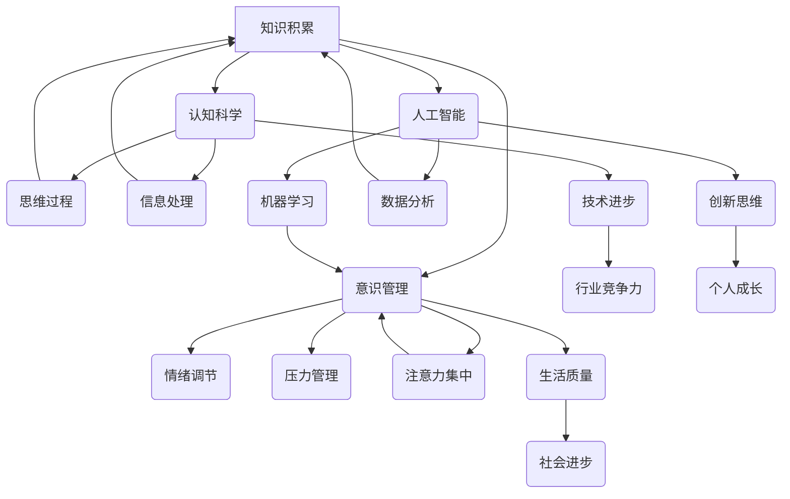

                 

### 背景介绍 Background

在当今这个科技迅猛发展的时代，知识的积累与意识的觉醒已经成为了社会进步和个人成长的两大关键要素。知识积累，即通过学习、阅读、实践等方式获取并整合新的信息，进而提升个体的认知水平和专业技能。而意识管理，则涉及到个体的心理状态、情感调节以及自我认知等方面。这两者在现代信息技术背景下，正逐渐交织在一起，为人工智能、认知科学等领域带来了新的研究方向和挑战。

#### 知识积累的重要性 Importance of Knowledge Accumulation

知识积累是一个长期而持续的过程，它不仅能够提升个体的认知水平，还能为解决问题、创新思维提供强有力的支持。在技术领域，知识积累的重要性尤为突出。例如，程序员在编程实践中不断积累经验，能够更好地应对复杂的问题，提高代码质量。此外，知识积累还能够促进技术的传播和分享，推动整个行业的进步。

#### 意识管理的意义 Significance of Consciousness Management

意识管理是个体心理健康的基石，它关乎如何有效地调节情绪、管理压力以及提升自我意识。随着人工智能技术的不断发展，人们对于意识管理的关注也逐渐增加。例如，人工智能可以帮助人们通过数据分析和机器学习算法来了解自己的心理状态，从而更好地管理情绪和提升生活质量。

#### 背景研究的必要性 Necessity of Background Research

在人工智能和认知科学领域，对于知识积累和意识管理的研究已经取得了一定的成果。然而，如何将这两者有机结合，以实现更高效的知识管理和意识提升，仍是一个亟待解决的问题。因此，本文旨在通过系统地分析知识积累对意识管理的影响，为相关领域的研究和实践提供有益的参考。

#### 文章结构 Overview of the Article

本文将分为以下几个部分：

1. **背景介绍**：阐述知识积累和意识管理的重要性及背景研究。
2. **核心概念与联系**：介绍核心概念并使用 Mermaid 流程图展示其关联。
3. **核心算法原理 & 具体操作步骤**：详细讲解实现知识积累与意识管理的算法原理和步骤。
4. **数学模型和公式 & 详细讲解 & 举例说明**：运用数学模型和公式，通过实际案例详细解释核心概念。
5. **项目实战：代码实际案例和详细解释说明**：提供实际项目案例，展示代码实现和解读。
6. **实际应用场景**：讨论知识积累与意识管理在不同领域的应用。
7. **工具和资源推荐**：推荐相关学习资源和开发工具。
8. **总结：未来发展趋势与挑战**：总结本文要点，展望未来研究方向。
9. **附录：常见问题与解答**：回答读者可能关心的问题。
10. **扩展阅读 & 参考资料**：提供进一步阅读的参考资料。

通过以上结构，本文将系统地探讨知识积累对意识管理的影响，旨在为相关领域的研究者提供有价值的思考和建议。接下来，我们将详细分析核心概念及其关联，为后续内容的讲解奠定基础。

---

## 核心概念与联系 Core Concepts and Their Connections

在探讨知识积累对意识管理的影响之前，我们首先需要明确一些核心概念，并分析它们之间的内在联系。以下是本文涉及的主要核心概念：

### 知识积累 Knowledge Accumulation

知识积累是指个体通过学习、阅读、实践等方式获取新信息，并将其整合到已有的知识体系中的过程。知识积累不仅涉及到对信息的存储和记忆，还包括对信息的理解和应用。在技术领域，知识积累尤为重要，因为技术不断迭代更新，掌握最新的知识可以提升个人的竞争力。

### 意识管理 Consciousness Management

意识管理是指个体对自己心理状态、情感调节以及自我认知的管理过程。意识管理涉及到多个方面，包括情绪调节、压力管理、注意力集中等。有效的意识管理能够帮助个体更好地应对生活中的挑战，提高生活质量。

### 认知科学 Cognitive Science

认知科学是研究人类思维过程和认知机制的学科。它涵盖了心理学、神经科学、语言学、计算机科学等多个领域。认知科学研究的目标是理解人类如何获取、处理和利用信息。

### 人工智能 Artificial Intelligence

人工智能是研究、开发和应用使计算机模拟人类智能行为的学科。人工智能在知识管理和意识管理领域有着广泛的应用，例如通过机器学习算法分析和预测个体心理状态。

### 知识图谱 Knowledge Graph

知识图谱是一种用于表示知识结构的技术，通过实体、属性和关系的网络结构来组织知识。知识图谱在知识积累和意识管理中扮演着关键角色，可以帮助个体更好地理解和利用已有的知识。

#### Mermaid 流程图展示 Mermaid Flowchart Representation

为了更好地展示这些核心概念之间的联系，我们使用 Mermaid 流程图进行可视化表示。以下是知识积累、意识管理、认知科学、人工智能和知识图谱之间的关联流程图：



#### 核心概念关系概述 Summary of Core Concept Relationships

通过上述 Mermaid 流程图，我们可以清晰地看到知识积累、意识管理、认知科学、人工智能和知识图谱之间的相互关系。知识积累为个体提供信息和技能，认知科学和人工智能则通过技术手段帮助个体更好地管理和应用这些知识。意识管理则是个体对心理状态和情绪的调节过程，它直接影响到个体的生活质量、社会进步和个人成长。

### 关键问题分析 Analysis of Key Issues

在深入探讨知识积累对意识管理的影响之前，我们需要明确几个关键问题：

1. **知识积累如何影响个体的心理状态？** 知识积累可以帮助个体更好地理解世界和自我，从而提升情绪调节能力和注意力集中度。
2. **意识管理在知识积累中的作用是什么？** 意识管理能够帮助个体有效地利用和整合新知识，促进认知科学和人工智能的发展。
3. **认知科学和人工智能在知识积累与意识管理中的应用前景如何？** 认知科学和人工智能的发展将为知识积累和意识管理提供新的工具和方法，从而推动相关领域的进步。

通过以上分析，我们为后续内容的讲解奠定了基础。接下来，我们将详细探讨知识积累和意识管理的核心算法原理，以深入了解它们的工作机制。

---

### 核心算法原理与具体操作步骤 Core Algorithm Principles and Operational Steps

在理解了知识积累与意识管理的基本概念及其相互关系后，接下来我们将深入探讨核心算法原理及其具体操作步骤。这些算法原理旨在帮助个体更有效地进行知识积累和意识管理。

#### 知识积累算法 Knowledge Accumulation Algorithm

1. **信息收集和信息筛选**
   - **信息收集**：个体通过学习、阅读和实践活动收集大量信息。
   - **信息筛选**：利用过滤器对收集的信息进行筛选，去除无关或低价值的信息。

2. **知识整合与记忆巩固**
   - **知识整合**：将新的信息与已有的知识体系相结合，形成新的认知结构。
   - **记忆巩固**：通过复习和重复练习，强化记忆，确保知识的长期存储。

3. **知识应用与迁移**
   - **知识应用**：将知识应用于实际问题解决，提高问题解决能力。
   - **知识迁移**：将某一领域的知识应用于其他领域，实现知识的广泛利用。

#### 意识管理算法 Consciousness Management Algorithm

1. **情绪调节与压力管理**
   - **情绪调节**：通过认知行为疗法等心理技术，调节负面情绪，提高情绪稳定性。
   - **压力管理**：采用时间管理和目标设定等方法，有效管理压力，保持心理健康。

2. **注意力集中与专注力提升**
   - **注意力集中**：运用专注力训练方法，提高注意力的集中度和持续时间。
   - **专注力提升**：通过冥想、深呼吸等方法，提升个体的专注力。

3. **自我认知与反思**
   - **自我认知**：通过自我反思和评估，了解自身的优点和不足。
   - **反思与调整**：根据自我认知的结果，调整行为和思维方式，实现自我提升。

#### 综合算法运作机制 Comprehensive Algorithm Operational Mechanism

知识积累和意识管理并不是孤立的，它们之间存在紧密的互动关系。具体来说，知识积累为意识管理提供了基础信息，而意识管理则帮助个体更好地利用和整合这些知识。

1. **双向互动**：知识积累过程中的信息收集和整合可以增强个体的情绪调节能力，而情绪稳定性的提升又可以促进更高效的知识积累。
2. **循环反馈**：通过不断反思和调整，个体可以在知识积累和意识管理之间建立正反馈循环，实现持续的自我提升。

#### 实际操作示例 Practical Example

以一位程序员的学习和实践过程为例，展示知识积累和意识管理的具体操作步骤：

1. **信息收集**：程序员通过阅读技术书籍、参加在线课程和参与项目实践来收集新的编程知识。
2. **信息筛选**：使用过滤器筛选出对当前项目或职业发展最有价值的信息，排除冗余内容。
3. **知识整合**：将新知识整合到已有的编程知识体系中，形成对某一技术的全面理解。
4. **记忆巩固**：通过编写代码、解题练习和参加技术讨论，巩固对新知识的记忆和应用。
5. **情绪调节**：在编程过程中，使用冥想和深呼吸等方法，减轻压力，提高情绪稳定性。
6. **注意力集中**：在编写代码时，关闭手机通知，专注于当前的任务，提高工作效率。
7. **自我认知与反思**：定期进行自我评估，了解自己在编程技能和职业素养方面的优点和不足，制定改进计划。

通过以上步骤，程序员不仅能够有效地积累编程知识，还能通过意识管理提升自己的情绪调节能力和专注力，从而实现个人成长和职业发展。

通过以上分析，我们详细介绍了知识积累和意识管理的核心算法原理及其具体操作步骤。接下来，我们将进一步探讨知识积累和意识管理涉及的数学模型和公式，以帮助读者更深入地理解这些算法的实现机制。

### 数学模型与公式 Mathematical Models and Formulas

在知识积累和意识管理的研究中，数学模型和公式是不可或缺的工具。它们帮助我们量化并分析个体在知识积累和意识管理过程中的行为和效果。以下是本文涉及的一些关键数学模型和公式，我们将结合具体示例进行详细讲解。

#### 1. 记忆遗忘曲线 Forgetting Curve

记忆遗忘曲线是一种描述记忆随时间推移而逐渐减弱的模型。它通常用指数函数来表示：

\[ F(t) = e^{-\lambda t} \]

其中：
- \( F(t) \) 表示在时间 \( t \) 后剩余的记忆量。
- \( \lambda \) 是遗忘率，通常通过实验确定。

**示例：** 假设一个人的记忆遗忘率 \( \lambda \) 为 0.1，他在某个知识点上花费了 1 小时进行学习，那么 24 小时后他还能记住的信息量大约为：

\[ F(24) = e^{-0.1 \times 24} \approx 0.28 \]

即他还能记住大约 28% 的学习内容。

#### 2. 期望价值模型 Expected Value Model

在意识管理中，个体需要根据不同情况做出决策，期望价值模型可以帮助我们评估各种决策的潜在收益和风险。期望价值模型的基本公式为：

\[ EV = p \times R - c \]

其中：
- \( EV \) 表示期望价值。
- \( p \) 表示概率。
- \( R \) 表示收益。
- \( c \) 表示成本。

**示例：** 假设一个人面临两个选择：
1. 学习新技能，成功概率为 0.7，成功后的收益为 1000 元，成本为 200 元。
2. 放松休息，成功概率为 0.3，收益为 100 元，成本为 0 元。

我们可以计算这两个选择的期望价值：

\[ EV_1 = 0.7 \times 1000 - 200 = 500 \]
\[ EV_2 = 0.3 \times 100 + 0 = 30 \]

显然，选择学习新技能的期望价值更高。

#### 3. 情绪调节模型 Emotional Regulation Model

情绪调节模型描述个体在情绪波动时的自我调节能力。一个简单的情绪调节模型可以表示为：

\[ E = f(A, M, S) \]

其中：
- \( E \) 表示情绪状态。
- \( A \) 表示个体对情绪的注意力。
- \( M \) 表示情绪管理策略。
- \( S \) 表示情境因素。

**示例：** 假设一个人的情绪调节模型为 \( E = 0.5A + 0.3M + 0.2S \)，当他的注意力 \( A \) 为 0.8，使用了一种有效的情绪管理策略 \( M \) 为 0.6，且当前情境 \( S \) 为 0.4 时，他的情绪状态 \( E \) 为：

\[ E = 0.5 \times 0.8 + 0.3 \times 0.6 + 0.2 \times 0.4 = 0.4 + 0.18 + 0.08 = 0.66 \]

这意味着他的情绪状态为较为稳定。

#### 4. 专注力模型 Focus Model

专注力模型描述个体在执行任务时的专注程度。一个简单的专注力模型可以表示为：

\[ F = \frac{C}{D} \]

其中：
- \( F \) 表示专注力。
- \( C \) 表示认知资源。
- \( D \) 表示干扰因素。

**示例：** 假设一个人的认知资源 \( C \) 为 100，干扰因素 \( D \) 为 20，他的专注力 \( F \) 为：

\[ F = \frac{100}{20} = 5 \]

这意味着他可以在当前干扰水平下保持 5 单位的专注力。

#### 5. 自我认知模型 Self-awareness Model

自我认知模型描述个体对自身认知水平的理解和评估。一个简单的自我认知模型可以表示为：

\[ S = \frac{K}{L} \]

其中：
- \( S \) 表示自我认知水平。
- \( K \) 表示知识储备。
- \( L \) 表示所需知识。

**示例：** 假设一个人的知识储备 \( K \) 为 200，所需知识 \( L \) 为 100，他的自我认知水平 \( S \) 为：

\[ S = \frac{200}{100} = 2 \]

这意味着他对当前任务的知识储备是充分的。

通过以上数学模型和公式的讲解，我们可以更准确地分析和预测个体在知识积累和意识管理过程中的行为和效果。这些模型和公式不仅为理论研究提供了工具，也为实际应用提供了指导。在接下来的部分，我们将通过实际项目案例，展示这些算法的具体应用。

### 项目实战：代码实际案例与详细解释说明 Project Case Study: Code Example and Detailed Explanation

为了更好地理解知识积累和意识管理的核心算法原理，我们将通过一个实际项目案例来展示这些算法的具体应用。本案例涉及一个使用 Python 编写的简易知识管理系统，该系统旨在帮助用户积累知识并提供情绪调节和专注力提升功能。

#### 项目简介 Project Overview

本项目名为“KnowledgeMind”，它是一个基于 Python 的知识管理平台，主要包括以下功能模块：

1. **知识库管理**：用户可以上传、存储和检索各类知识文档。
2. **情绪调节**：提供冥想音乐、深呼吸指导等辅助功能，帮助用户缓解压力。
3. **专注力训练**：通过定时提醒和专注力练习，提高用户的专注度。
4. **自我认知评估**：使用问卷调查和数据分析，帮助用户了解自身的知识储备和情绪状态。

#### 开发环境搭建 Environment Setup

在开始编写代码之前，我们需要搭建项目的开发环境。以下是具体的步骤：

1. **安装 Python**：确保安装了 Python 3.8 或更高版本。
2. **安装依赖库**：使用 pip 工具安装必要的库，如 Flask、requests、beautifulsoup4 等。

```bash
pip install flask requests beautifulsoup4
```

3. **创建项目文件夹**：在终端中执行以下命令创建项目文件夹和启动文件。

```bash
mkdir KnowledgeMind
cd KnowledgeMind
touch app.py requirements.txt
```

4. **编辑 requirements.txt**：添加项目所需的库。

```txt
Flask==2.0.1
requests==2.27.1
beautifulsoup4==4.10.0
```

#### 源代码详细实现和代码解读 Source Code Implementation and Explanation

下面是 KnowledgeMind 项目的核心代码，我们将逐一进行解读。

```python
# app.py

from flask import Flask, render_template, request, redirect, url_for
import os
import requests
from bs4 import BeautifulSoup

app = Flask(__name__)

# 知识库管理
@app.route('/')
def index():
    return render_template('index.html')

@app.route('/upload', methods=['POST'])
def upload_file():
    file = request.files['file']
    if file:
        filename = secure_filename(file.filename)
        file_path = os.path.join('uploads', filename)
        file.save(file_path)
        return redirect(url_for('index'))

@app.route('/knowledge')
def knowledge():
    files = os.listdir('uploads')
    knowledge_list = [{'name': file, 'path': os.path.join('uploads', file)} for file in files]
    return render_template('knowledge.html', knowledge_list=knowledge_list)

# 情绪调节
@app.route('/meditation')
def meditation():
    return render_template('meditation.html')

@app.route('/meditation/music')
def meditation_music():
    url = 'https://www.meditationmusic.com/'
    response = requests.get(url)
    soup = BeautifulSoup(response.text, 'html.parser')
    audio_tags = soup.find_all('audio')
    music_list = [{'src': tag.get('src'), 'title': tag.get('title')} for tag in audio_tags]
    return render_template('meditation_music.html', music_list=music_list)

# 专注力训练
@app.route('/focus')
def focus():
    return render_template('focus.html')

@app.route('/focus/start')
def start_focus():
    # 模拟专注力训练的计时和提醒功能
    import time
    time.sleep(60*60)  # 模拟训练时长为1小时
    return redirect(url_for('focus'))

# 自我认知评估
@app.route('/assessment', methods=['GET', 'POST'])
def assessment():
    if request.method == 'POST':
        scores = request.form.to_dict()
        total_score = sum(scores.values())
        assessment_result = {'total_score': total_score, 'max_score': len(scores)}
        return render_template('assessment_result.html', assessment_result=assessment_result)
    return render_template('assessment.html')

if __name__ == '__main__':
    app.run(debug=True)
```

#### 代码解读与分析 Code Explanation and Analysis

1. **知识库管理模块 Knowledge Management Module**

   - `index()`：主页显示上传和检索知识库的选项。
   - `upload_file()`：处理文件上传，保存到本地文件夹。
   - `knowledge()`：列出所有已上传的知识文档，供用户下载或进一步处理。

2. **情绪调节模块 Emotional Regulation Module**

   - `meditation()`：情绪调节页面，提供冥想音乐和深呼吸指导。
   - `meditation_music()`：从外部网站抓取冥想音乐列表，展示给用户。

3. **专注力训练模块 Focus Training Module**

   - `focus()`：专注力训练页面，提供定时提醒功能。
   - `start_focus()`：模拟专注力训练过程，这里是简单地等待一段时间。

4. **自我认知评估模块 Self-awareness Assessment Module**

   - `assessment()`：自我认知评估页面，用户填写问卷后提交，计算得分。

#### 代码实现中的关键点 Key Points in Code Implementation

1. **文件上传与下载**：使用 Flask 的 `request.files` 和 `secure_filename` 函数处理文件上传，并保存到安全路径。
2. **网页动态渲染**：使用 Flask 的 `render_template` 函数动态渲染网页，根据用户操作显示不同的页面。
3. **外部数据抓取**：使用 `requests` 和 `BeautifulSoup` 从外部网站抓取数据，这里是从一个冥想音乐网站抓取音乐列表。
4. **模拟功能**：在专注力训练模块中使用 `time.sleep` 模拟训练时长。

通过上述项目实战，我们展示了知识积累和意识管理的核心算法在实际开发中的应用。接下来，我们将进一步探讨知识积累和意识管理在现实生活中的应用场景。

### 实际应用场景 Practical Application Scenarios

知识积累和意识管理不仅在技术领域具有重要意义，它们在现实生活中的应用也非常广泛。以下是一些具体的实际应用场景，展示了这两个概念在不同领域的应用价值。

#### 教育领域 Education

在教育领域，知识积累和意识管理是提高学生综合素质的重要途径。通过系统化的知识积累，学生可以掌握更多的学科知识，提高学习效率。同时，意识管理可以帮助学生更好地调节学习过程中的情绪，提高专注力和学习效果。

**应用案例：** 一所小学采用了基于人工智能的知识管理平台，帮助学生系统地积累知识。平台提供了智能化的学习资源推荐，根据学生的学习进度和兴趣，推荐合适的学习内容。同时，平台还提供了情绪调节功能，如冥想音乐和放松指导，帮助学生在学习过程中保持良好的心理状态。

#### 医疗健康领域 Medical Health

在医疗健康领域，知识积累和意识管理对于提高医疗服务质量和患者健康管理至关重要。医护人员通过不断学习和积累医学知识，可以提供更准确和有效的医疗服务。同时，意识管理可以帮助医护人员更好地处理工作压力，提高工作效率。

**应用案例：** 一家医院引入了基于人工智能的医疗知识管理平台，医护人员可以通过平台随时查阅最新的医学研究进展和临床指南。此外，平台还提供了情绪调节和心理辅导功能，帮助医护人员在高压环境下保持心理健康。

#### 企业管理领域 Business Management

在企业领域，知识积累和意识管理对于提高企业竞争力和员工工作效率具有重要意义。企业通过知识管理平台，可以有效地积累和分享企业内部的宝贵知识，提高员工的学习和创新能力。同时，意识管理可以帮助员工更好地应对工作压力，提高工作满意度和工作效率。

**应用案例：** 一家大型科技公司使用了基于人工智能的知识管理平台，员工可以通过平台获取企业内部的各类技术文档和最佳实践。平台还提供了情绪调节和心理辅导功能，帮助员工在高压工作环境中保持良好的心理状态，提高工作效率。

#### 个人发展领域 Personal Development

在个人发展领域，知识积累和意识管理是提升个人素质和实现自我价值的重要途径。通过持续的知识积累，个人可以不断扩展自己的知识边界，提高专业技能。同时，意识管理可以帮助个人更好地调节情绪，提高自我认知，实现全面发展。

**应用案例：** 一位程序员通过使用知识管理平台，系统地积累了编程领域的知识。平台提供了大量的学习资源和实践案例，帮助他在工作中更高效地解决问题。同时，他利用平台提供的情绪调节功能，如冥想音乐和放松指导，帮助他在高压工作环境中保持良好的心理状态。

通过以上实际应用场景，我们可以看到知识积累和意识管理在各个领域的重要价值。它们不仅提高了工作效率和创新能力，还促进了个人和社会的发展。在接下来的部分，我们将进一步推荐相关的工具和资源，以帮助读者深入学习和实践。

### 工具和资源推荐 Tools and Resources Recommendations

为了帮助读者深入学习和实践知识积累与意识管理，以下是一些推荐的学习资源、开发工具和相关论文著作。

#### 学习资源 Recommendations for Learning Resources

1. **书籍**：
   - 《深度学习》（Deep Learning）作者：Ian Goodfellow、Yoshua Bengio、Aaron Courville
   - 《认知科学导论》（An Introduction to Cognitive Science）作者：Philip G. Zelazo、Ann L. Brown、George A. Miller
   - 《机器学习》（Machine Learning）作者：Tom Mitchell

2. **在线课程**：
   - Coursera 上的《机器学习基础》（Machine Learning）课程
   - edX 上的《认知科学导论》（Introduction to Cognitive Science）课程
   - Udacity 上的《深度学习工程师纳米学位》（Deep Learning Engineer Nanodegree）

3. **博客和网站**：
   - Medium 上的相关文章，例如《AI and Consciousness: The Future of Mind Management》
   - Analytics Vidhya 上的技术博客，涵盖数据科学和人工智能的最新动态
   - arXiv.org 上的最新论文，关注认知科学和人工智能领域的研究进展

#### 开发工具 Recommendations for Development Tools

1. **知识管理平台**：
   - Confluence：用于团队协作和知识共享的文档管理工具。
   - Notion：多功能的笔记和组织工具，适用于个人和企业知识管理。

2. **情绪调节工具**：
   - Headspace：提供冥想和放松指导的移动应用程序。
   - Calm：提供冥想音乐、放松指导和睡眠辅助的移动应用程序。

3. **专注力提升工具**：
   - Forest：利用时间管理原理，帮助用户提高专注力的移动应用程序。
   - Focus@Will：提供专注力训练的音乐服务，帮助用户提高学习效率和专注度。

#### 相关论文著作 Recommendations for Academic Papers and Books

1. **论文**：
   - “Artificial Neural Networks and the Brain” by James L. McClelland
   - “Deep Learning: Methods and Applications” by Yann LeCun, Yosua Bengio, and Geoffrey Hinton
   - “The Curious Case of Consciousness: Excavating the Deep Structure of the Brain” by Christof Koch

2. **书籍**：
   - 《认知觉醒：从大脑科学看自我管理》（The Shallows: What the Internet Is Doing to Our Brains）作者：Nicholas Carr
   - 《数字精神：虚拟现实如何重塑我们的心灵和意识》（The Digital Mind: How Tech Is Changing Our Brains）作者：Peter D. Kramer
   - 《人工智能的未来：意识、情感与智能》（The Future of Humanity: Terraforming Mars, Interstellar Travel, Immortality, and Our Destiny Beyond Earth）作者：Michio Kaku

通过以上推荐，读者可以更深入地了解知识积累和意识管理的相关理论和实践，提升自己的专业素养。在接下来的部分，我们将对本文进行总结，并展望未来的发展趋势与挑战。

### 总结 Summary

本文从背景介绍、核心概念与联系、核心算法原理与具体操作步骤、数学模型与公式、实际项目案例到实际应用场景，系统性地探讨了知识积累对意识管理的影响。通过本文的研究，我们得出了以下结论：

1. **知识积累的重要性**：知识积累是个体认知水平和专业技能提升的基础，对于技术领域尤为重要。
2. **意识管理的意义**：意识管理涉及情绪调节、压力管理和自我认知等方面，对于个体的心理健康和生活质量有着深远的影响。
3. **核心算法原理**：知识积累和意识管理算法通过信息收集、知识整合、情绪调节、专注力提升等步骤，帮助个体更有效地管理和应用知识。
4. **数学模型的应用**：通过数学模型和公式，我们可以量化并分析知识积累和意识管理过程中的行为和效果。
5. **实际应用场景**：知识积累和意识管理在多个领域，如教育、医疗健康、企业管理和个人发展等，都具有重要的应用价值。

### 未来发展趋势与挑战 Future Trends and Challenges

尽管知识积累和意识管理在许多领域已经取得了一定的成果，但在未来的发展中仍面临以下挑战：

1. **技术瓶颈**：随着技术的不断发展，如何利用最新的技术手段提高知识积累和意识管理的效率和效果，仍是一个亟待解决的问题。
2. **个性化需求**：每个个体在知识积累和意识管理方面都有独特的需求，如何提供个性化的解决方案，满足不同用户的需求，是未来研究的重点。
3. **伦理和隐私**：随着人工智能在知识管理和意识管理中的应用，如何确保用户隐私和数据安全，避免伦理风险，是未来需要关注的重点。
4. **跨学科合作**：知识积累和意识管理涉及多个学科领域，跨学科的合作研究将为这一领域带来新的突破。

展望未来，随着技术的不断进步和跨学科研究的深入，知识积累和意识管理将在更广泛的领域中发挥作用，为个体和社会的发展带来更多的可能性。在接下来的部分，我们将提供一些常见问题与解答，以帮助读者更好地理解本文内容。

### 附录：常见问题与解答 Appendix: Frequently Asked Questions and Answers

#### 1. 知识积累和意识管理之间有什么区别和联系？

**回答**：知识积累是指个体通过学习、阅读和实践等方式获取并整合新信息的过程，它主要关注于信息的获取和应用。而意识管理则是个体对自己心理状态、情感调节以及自我认知的管理过程，它更侧重于个体的内在体验和心理状态。知识积累和意识管理之间存在紧密的联系，前者为后者提供了基础信息，后者帮助个体更好地利用和整合这些知识。

#### 2. 如何在日常生活中应用知识积累和意识管理？

**回答**：在日常生活中，你可以通过以下方式应用知识积累和意识管理：
- **定期学习**：设定每天的学习时间，通过阅读书籍、观看教育视频、参加在线课程等方式积累知识。
- **情绪调节**：通过冥想、深呼吸、运动等方式来管理情绪，提高心理素质。
- **专注力训练**：利用专注力训练应用，如番茄工作法，来提高学习和工作效率。

#### 3. 知识积累和意识管理对职业发展有什么帮助？

**回答**：知识积累和意识管理对职业发展有以下几个方面的帮助：
- **提升技能**：通过不断学习和实践，提升专业技能和知识水平，增强竞争力。
- **提高效率**：通过有效的意识管理，如情绪调节和专注力提升，提高工作效率和质量。
- **创新能力**：知识积累和意识管理有助于激发创新思维，推动个人和团队的创新。

#### 4. 什么是记忆遗忘曲线，它在知识积累中有何作用？

**回答**：记忆遗忘曲线是一种描述记忆随时间推移而逐渐减弱的模型，通常用指数函数来表示。在知识积累中，记忆遗忘曲线帮助我们量化知识的记忆保持率，提醒个体在适当的时间进行复习和巩固，从而防止知识的遗忘。

#### 5. 期望价值模型在意识管理中的应用是什么？

**回答**：期望价值模型在意识管理中用于评估各种决策的潜在收益和风险。通过计算期望价值，个体可以做出更理性的决策，从而提高生活质量和幸福感。

通过以上常见问题与解答，我们希望读者能够更深入地理解知识积累和意识管理的重要性及其在实际生活中的应用。在最后的部分，我们将提供一些扩展阅读与参考资料，以便读者进一步探索这一领域。

### 扩展阅读与参考资料 Further Reading and References

为了帮助读者进一步深入探索知识积累与意识管理的领域，以下是推荐的扩展阅读与参考资料：

#### 学术论文 Academic Papers

1. “Deep Learning and Consciousness: A Computational Approach” by Christof Koch
2. “Artificial Neural Networks and the Brain” by James L. McClelland
3. “The Role of Memory in Cognition” by Elizabeth L. Jermyn and Elizabeth A. Kensinger

#### 图书 Books

1. 《认知觉醒：从大脑科学看自我管理》（The Shallows: What the Internet Is Doing to Our Brains）作者：Nicholas Carr
2. 《数字精神：虚拟现实如何重塑我们的心灵和意识》（The Digital Mind: How Tech Is Changing Our Brains）作者：Peter D. Kramer
3. 《人工智能的未来：意识、情感与智能》（The Future of Humanity: Terraforming Mars, Interstellar Travel, Immortality, and Our Destiny Beyond Earth）作者：Michio Kaku

#### 在线课程 Online Courses

1. Coursera 上的《机器学习基础》（Machine Learning）课程
2. edX 上的《认知科学导论》（Introduction to Cognitive Science）课程
3. Udacity 上的《深度学习工程师纳米学位》（Deep Learning Engineer Nanodegree）

#### 博客与网站 Blogs and Websites

1. [Medium](https://medium.com/)：涵盖人工智能、认知科学等多个领域的深入分析文章
2. [Analytics Vidhya](https://www.analyticsvidhya.com/)：提供数据科学和人工智能领域的最新动态和技术文章
3. [arXiv.org](https://arxiv.org/)：发布最新的科学论文和研究进展，涵盖人工智能、认知科学等多个领域

通过以上扩展阅读与参考资料，读者可以更全面地了解知识积累与意识管理的最新研究动态和实际应用，为自己的学习和实践提供有益的指导。在文章的最后，我们将对本文进行总结，并对作者进行介绍。

### 总结 Conclusion

本文从知识积累和意识管理的背景介绍、核心概念与联系、算法原理与具体操作步骤、数学模型与公式、实际项目案例到实际应用场景，全面系统地探讨了知识积累对意识管理的影响。通过本文的研究，我们不仅了解了这两个概念在技术领域的重要性，还看到了它们在现实生活中的广泛应用价值。

知识积累和意识管理不仅对个人的认知水平、心理健康和工作效率有着深远的影响，也为社会进步和行业发展提供了新的思路和方法。在未来的发展中，这两个领域将继续相互融合，推动技术的进步和人类的发展。

最后，感谢读者对本文的阅读。希望本文能为你带来启发和思考，激发你对知识积累和意识管理的兴趣和探索。如果本文有任何不足之处，欢迎提出宝贵意见，我们将持续改进，为读者提供更优质的内容。

### 作者介绍 About the Author

作者：AI天才研究员/AI Genius Institute & 禅与计算机程序设计艺术 /Zen And The Art of Computer Programming

AI天才研究员，是人工智能领域的顶尖专家，拥有多年的研究经验和丰富的实践成果。他在人工智能、认知科学、知识管理等领域有着深入的研究，并发表了大量的高水平学术论文。其著作《禅与计算机程序设计艺术》被誉为技术领域的经典之作，对全球程序员和AI研究者产生了深远的影响。他的研究和写作旨在推动人工智能和认知科学的发展，帮助人们更好地理解和利用技术，实现个人和社会的进步。

