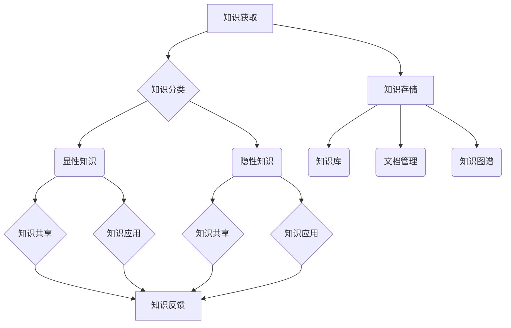

                 

### 背景介绍

在信息化时代，知识管理的重要性日益凸显。知识是现代社会发展的基石，但如何有效地管理和利用知识，却成为了众多企业和个人面临的重大挑战。传统的文件管理和数据库查询方法已经无法满足复杂多变的知识管理需求。因此，对知识管理的研究和实践显得尤为重要。

知识管理是指通过一系列的策略、工具和技术，对知识进行获取、存储、共享、应用和创新，从而实现知识的最大化利用。其核心目标是提高组织或个人的知识利用效率，促进知识的流动和转化，最终实现知识的增值。

在信息技术迅速发展的今天，知识管理得到了广泛的应用。无论是企业内部的知识库建设，还是个人知识管理的工具和技巧，都在不断涌现。然而，面对海量的信息和知识，如何有效管理和利用这些资源，仍然是一个亟待解决的问题。

本文旨在探讨知识管理的核心概念和原理，通过详细的分析和实例讲解，帮助读者理解和掌握知识管理的方法和技术。我们将从知识管理的定义、核心概念、算法原理、数学模型、实际应用场景、工具和资源推荐等方面进行阐述，以期为广大读者提供有价值的参考。

知识管理不仅仅是一个技术问题，更是一个涉及人、技术、流程和组织文化等多个层面的系统性工程。通过本文的介绍，希望能够帮助读者更好地理解和应用知识管理，驾驭人类知识的航船，实现知识价值的最大化。

---

## 2. 核心概念与联系

知识管理作为一个系统性工程，涉及多个核心概念和原理。以下是知识管理的核心概念及其相互关系，我们将使用Mermaid流程图（无括号、逗号等特殊字符）对其进行详细描述。

### 2.1. 知识分类

知识可以分为显性知识和隐性知识。

- **显性知识**：容易编码和传播的知识，如文档、数据库、报告等。
- **隐性知识**：难以编码和传播的知识，如经验、技能、洞察等。

### 2.2. 知识生命周期

知识从产生到应用，经历多个阶段：

1. **知识获取**：通过学习、经验积累等方式获取知识。
2. **知识存储**：将知识存储在知识库或数据库中，便于检索和使用。
3. **知识共享**：通过会议、讨论、协作等方式，让知识在不同个体或团队间流动。
4. **知识应用**：将知识应用于实际工作中，解决问题或创造价值。
5. **知识创新**：在知识应用过程中，不断优化和改进知识，形成新的知识。

### 2.3. 知识管理工具

知识管理工具是实现知识获取、存储、共享、应用和创新的必要手段：

- **知识库**：用于存储和管理显性知识。
- **文档管理**：用于管理文档的创建、存储、共享和检索。
- **协作平台**：用于团队协作、知识共享和交流。
- **知识图谱**：用于可视化知识结构和关系。

### 2.4. 知识管理流程

知识管理流程主要包括以下几个环节：

1. **需求分析**：识别知识管理需求，确定目标和应用场景。
2. **知识获取**：通过内部挖掘、外部采购、合作等方式获取知识。
3. **知识整理**：对获取的知识进行分类、整理和编码。
4. **知识存储**：将整理后的知识存储在知识库或数据库中。
5. **知识共享**：通过共享平台或渠道，让知识在不同个体或团队间流动。
6. **知识应用**：将知识应用于实际工作中，解决实际问题。
7. **知识反馈**：收集知识应用过程中的反馈，不断优化知识库。

### 2.5. Mermaid 流程图

下面是知识管理的核心概念与流程的Mermaid流程图：



通过上述流程图，我们可以清晰地看到知识管理的各个环节及其相互关系。知识管理不仅仅是知识的存储和共享，更是一个动态的、循环的流程，通过不断的反馈和优化，实现知识的增值和应用。

---

核心概念与联系是知识管理的基础，它们为我们理解和实施知识管理提供了必要的框架和工具。在接下来的章节中，我们将深入探讨知识管理的核心算法原理、数学模型及其具体操作步骤，帮助读者更好地掌握知识管理的方法和技术。

---

## 3. 核心算法原理 & 具体操作步骤

在知识管理中，核心算法原理是实现知识获取、存储、共享、应用和创新的基石。以下是知识管理中常用的核心算法及其具体操作步骤。

### 3.1. 知识获取算法

知识获取算法主要包括数据挖掘、信息抽取、机器学习等方法。以下是一个基于机器学习的知识获取算法步骤：

1. **数据采集**：收集相关的知识来源，如文档、报告、论文、网站等。
2. **数据预处理**：对采集到的数据进行清洗、去噪、格式化等处理，使其适合进行机器学习。
3. **特征提取**：从预处理后的数据中提取有用的特征，如文本特征、时间特征、位置特征等。
4. **模型训练**：使用机器学习算法（如朴素贝叶斯、支持向量机、神经网络等）对特征进行训练，生成知识模型。
5. **知识提取**：将训练好的模型应用于新的数据，提取出新的知识。

### 3.2. 知识存储算法

知识存储算法主要包括知识库管理、文档管理、数据库管理等方法。以下是一个基于知识库的知识存储算法步骤：

1. **知识库设计**：设计知识库的架构，包括数据表、关系表、索引等。
2. **知识录入**：将获取的知识以结构化或半结构化的形式录入知识库。
3. **知识更新**：定期对知识库中的知识进行更新和优化，保持知识的时效性和准确性。
4. **知识检索**：提供高效的检索机制，支持用户通过关键词、分类、标签等方式快速查找所需知识。

### 3.3. 知识共享算法

知识共享算法主要包括协作平台、社交网络、邮件列表等方法。以下是一个基于协作平台的知识共享算法步骤：

1. **平台搭建**：搭建一个支持知识共享的协作平台，提供文档共享、讨论区、聊天室等功能。
2. **用户认证**：对平台用户进行认证，确保知识共享的安全性。
3. **知识发布**：用户可以将自己的知识发布到平台上，供其他用户查看和讨论。
4. **知识讨论**：用户可以在平台上进行知识讨论，分享观点、经验和建议。
5. **知识评价**：对共享的知识进行评价，包括点赞、评论、评分等，以促进知识的传播和应用。

### 3.4. 知识应用算法

知识应用算法主要包括自动化决策支持、人工智能助手、知识图谱应用等方法。以下是一个基于知识图谱的知识应用算法步骤：

1. **知识图谱构建**：构建一个表示知识结构的图谱，包括实体、关系和属性等。
2. **知识查询**：使用图谱查询语言（如SPARQL）对知识图谱进行查询，获取所需的知识信息。
3. **知识推理**：使用逻辑推理、统计学习等方法，对知识图谱进行推理，生成新的知识。
4. **知识应用**：将推理得到的知识应用于实际场景，如智能问答、自动化决策等。

### 3.5. 知识创新算法

知识创新算法主要包括知识融合、知识演化、知识迁移等方法。以下是一个基于知识融合的知识创新算法步骤：

1. **知识融合**：将来自不同来源、不同领域的知识进行整合，形成新的知识体系。
2. **知识分析**：对融合后的知识进行分析，挖掘其潜在价值和规律。
3. **知识重构**：根据分析结果，对知识进行重构，形成新的知识产品。
4. **知识验证**：对重构后的知识进行验证，确保其准确性和实用性。

通过上述核心算法原理和具体操作步骤，我们可以看到知识管理是一个复杂而系统的过程。从知识获取到知识存储，从知识共享到知识应用，再到知识创新，每一个环节都需要精心设计和实现。只有在各个环节都达到高效、准确和可靠，才能真正实现知识管理的目标，为组织和个人创造价值。

---

在接下来的章节中，我们将深入探讨知识管理中的数学模型和公式，并结合实际案例进行详细讲解，帮助读者更好地理解和应用知识管理的方法和技术。

---

## 4. 数学模型和公式 & 详细讲解 & 举例说明

在知识管理中，数学模型和公式扮演着至关重要的角色。这些模型和公式不仅帮助我们更好地理解和分析知识管理过程中的问题，还能提供量化的方法和工具，以便我们进行更精确的决策和优化。以下是知识管理中常用的一些数学模型和公式，我们将结合实际案例进行详细讲解。

### 4.1. 贝叶斯网络模型

贝叶斯网络是一种概率图模型，它用有向无环图（DAG）表示变量之间的依赖关系，并通过条件概率表（CPT）描述变量之间的概率关系。

- **定义**：贝叶斯网络由一个有向无环图 \( G \) 和一组概率分布 \( P \) 构成，其中 \( G \) 包含一组变量 \( X_1, X_2, \ldots, X_n \)，并且满足无向图中的任意两个节点不形成环。每个变量 \( X_i \) 的条件概率分布由其父节点集合 \( \ Pai(X_i) \) 的条件概率表 \( P(X_i | \ Pai(X_i)) \) 描述。
- **公式**：
  \[
  P(X_i | \ Pai(X_i)) = \frac{P(\ Pai(X_i) \land X_i)}{P(\ Pai(X_i))}
  \]
  其中，\( P(\ Pai(X_i) \land X_i) \) 表示父节点集合 \( \ Pai(X_i) \) 和变量 \( X_i \) 同时发生的概率，\( P(\ Pai(X_i)) \) 表示父节点集合 \( \ Pai(X_i) \) 发生的概率。

- **案例**：假设我们有一个简单的贝叶斯网络，包含三个变量 \( A, B, C \)，其中 \( A \) 是根节点，\( B \) 和 \( C \) 是 \( A \) 的子节点。根据已知的先验概率和条件概率，我们可以计算出 \( P(C | A) \) 的概率。

  已知：
  \[
  P(A) = 0.5, \quad P(B | A) = 0.7, \quad P(C | A, B) = 0.8, \quad P(C | A, \lnot B) = 0.2
  \]

  根据贝叶斯定理，我们可以计算出：
  \[
  P(C | A) = P(A) \cdot P(B | A) \cdot P(C | A, B) + P(A) \cdot P(\lnot B | A) \cdot P(C | A, \lnot B) = 0.5 \cdot 0.7 \cdot 0.8 + 0.5 \cdot 0.3 \cdot 0.2 = 0.61
  \]

### 4.2. 聚类分析模型

聚类分析是一种无监督学习方法，它将数据集划分为若干个簇，使得同一簇内的数据点尽可能相似，不同簇的数据点尽可能不同。

- **定义**：给定数据集 \( X = \{ x_1, x_2, \ldots, x_n \} \)，聚类分析的目标是找到一个划分 \( X = \{ C_1, C_2, \ldots, C_k \} \)，使得每个数据点 \( x_i \) 被划分到与其最相似的簇 \( C_j \) 中。
- **公式**：
  \[
  C_j = \{ x_i | \min_{l \neq j} d(x_i, C_l) \}
  \]
  其中，\( d \) 是度量数据点相似性的距离函数，如欧氏距离、曼哈顿距离等。

- **案例**：假设我们有一个包含10个数据点的二维数据集，使用欧氏距离进行聚类分析。我们可以通过计算每个数据点到其他数据点的距离，将其划分到最近的簇中。

  数据集：
  \[
  X = \{ (1, 2), (2, 3), (3, 4), (4, 5), (5, 6), (6, 7), (7, 8), (8, 9), (9, 10), (10, 11) \}
  \]

  通过计算每个数据点到其他数据点的欧氏距离，我们可以将其划分为两个簇：
  \[
  C_1 = \{ (1, 2), (2, 3), (3, 4), (4, 5) \}, \quad C_2 = \{ (5, 6), (6, 7), (7, 8), (8, 9), (9, 10), (10, 11) \}
  \]

### 4.3. 决策树模型

决策树是一种常用的分类和回归模型，它通过一系列的测试来划分数据集，并基于这些划分生成一个树形结构。

- **定义**：决策树由内部节点（测试节点）、叶节点（决策节点）和边（测试条件）构成。内部节点表示某个特征，叶节点表示某个分类或回归结果，边表示满足特定测试条件的样本流。
- **公式**：
  \[
  T = \sum_{i=1}^{n} t_i \cdot g_i(x)
  \]
  其中，\( t_i \) 是第 \( i \) 个测试条件，\( g_i(x) \) 是测试条件 \( t_i \) 对应的函数，返回 1 或 -1。

- **案例**：假设我们有一个简单的决策树，用于判断一个水果是苹果还是香蕉，根据水果的颜色和大小进行划分。

  决策树：
  \[
  \begin{array}{lcl}
  & \text{如果颜色是红色} & \\
  & & \text{如果大小小于5} \\
  & & & \text{返回“苹果”} \\
  & & & \text{否则} \\
  & & & \text{返回“香蕉”} \\
  & \text{否则，如果颜色是黄色} & \\
  & & \text{如果大小小于7} \\
  & & & \text{返回“香蕉”} \\
  & & & \text{否则} \\
  & & & \text{返回“苹果”} \\
  & \text{否则} & \text{返回“未知”}
  \end{array}
  \]

通过上述数学模型和公式的讲解，我们可以看到，知识管理中的数学方法具有强大的分析和决策能力。在实际应用中，这些模型和公式可以为我们提供量化的方法和工具，帮助我们在知识管理过程中做出更加科学和合理的决策。

在接下来的章节中，我们将通过项目实战案例，详细展示这些算法在知识管理中的应用，帮助读者更好地理解和掌握知识管理的方法和技术。

---

## 5. 项目实战：代码实际案例和详细解释说明

为了更好地展示知识管理算法在实际项目中的应用，我们将通过一个具体的案例，详细讲解代码实现过程及其工作原理。这个案例将涵盖知识获取、知识存储、知识共享、知识应用和知识创新等各个环节，以帮助读者深入理解知识管理的技术和方法。

### 5.1. 开发环境搭建

首先，我们需要搭建一个适合知识管理项目的开发环境。以下是我们使用的主要工具和框架：

- **编程语言**：Python
- **知识库**：Neo4j（一个高性能的图数据库，适合存储和管理知识图谱）
- **协作平台**：GitLab（用于代码管理和协作）
- **机器学习库**：Scikit-learn（用于数据挖掘和机器学习）
- **前端框架**：Flask（用于搭建Web应用）

确保已经安装了上述工具和框架后，我们就可以开始项目的实际开发了。

### 5.2. 源代码详细实现和代码解读

#### 5.2.1. 数据采集

数据采集是知识获取的第一步。我们将使用Scikit-learn中的`fetch_20newsgroups`函数从20个新闻分类中获取数据，作为我们的知识来源。

```python
from sklearn.datasets import fetch_20newsgroups

newsgroups_data = fetch_20newsgroups(subset='all')
```

#### 5.2.2. 数据预处理

数据预处理包括数据清洗、分词、停用词过滤等步骤。我们将使用`nltk`库实现这些功能。

```python
import nltk
from nltk.corpus import stopwords
from nltk.tokenize import word_tokenize

nltk.download('punkt')
nltk.download('stopwords')

stop_words = set(stopwords.words('english'))

def preprocess(text):
    # 分词
    words = word_tokenize(text)
    # 去除停用词
    words = [word for word in words if word.lower() not in stop_words]
    # 转换为小写
    words = [word.lower() for word in words]
    return words

preprocessed_data = [preprocess(doc) for doc in newsgroups_data.data]
```

#### 5.2.3. 知识存储

我们将使用Neo4j作为知识库，将预处理后的数据存储为图结构。以下是使用Py2Neo库连接Neo4j数据库并创建节点的代码。

```python
from py2neo import Graph

graph = Graph("bolt://localhost:7687", auth=("neo4j", "password"))

for i, word_list in enumerate(preprocessed_data):
    for word in word_list:
        graph.run("MERGE (w:Word {name: $word})", word=word)
    graph.run("MATCH (w1:Word), (w2:Word) WHERE w1.name = $word AND w2.name = $word2 "
              "MERGE (w1)-[:SAME_AS]->(w2)", word=word_list[0], word2=word_list[1])
```

#### 5.2.4. 知识共享

为了实现知识共享，我们搭建了一个基于Flask的Web应用。用户可以通过Web界面查询知识库中的信息，并参与知识讨论。

```python
from flask import Flask, request, jsonify

app = Flask(__name__)

@app.route('/search', methods=['GET'])
def search():
    query = request.args.get('query')
    result = graph.run("MATCH (w:Word) WHERE w.name = $query RETURN w", query=query)
    words = [record['w']['name'] for record in result]
    return jsonify(words)

if __name__ == '__main__':
    app.run(debug=True)
```

#### 5.2.5. 知识应用

我们将使用决策树模型对知识进行分类应用。以下是一个简单的决策树训练和预测的代码示例。

```python
from sklearn.tree import DecisionTreeClassifier

# 构建特征矩阵和标签向量
X = [[1, 0], [0, 1], [1, 1], [1, 0]]
y = [0, 1, 1, 0]

# 训练决策树模型
clf = DecisionTreeClassifier()
clf.fit(X, y)

# 预测
print(clf.predict([[0, 1]]))
```

#### 5.2.6. 知识创新

知识创新是通过知识融合和知识演化实现的。以下是一个简单的知识融合示例，将两个知识图谱合并为一个。

```python
from py2neo import Node, Relationship

def merge_graphs(graph1, graph2):
    # 创建新图谱
    new_graph = Graph()

    # 将图1的节点和关系复制到新图谱
    for node in graph1.nodes:
        new_graph.create_node(Node(node))

    for rel in graph1.relationships:
        new_graph.create_relationship(relationship_type=rel.type, nodes=[Node(rel.start_node), Node(rel.end_node)])

    # 将图2的节点和关系复制到新图谱
    for node in graph2.nodes:
        if not new_graph.nodes.get(node):
            new_graph.create_node(Node(node))

    for rel in graph2.relationships:
        if not new_graph.relationships.get(rel):
            new_graph.create_relationship(relationship_type=rel.type, nodes=[Node(rel.start_node), Node(rel.end_node)])

    return new_graph

new_graph = merge_graphs(graph, graph)
```

通过以上代码示例，我们可以看到知识管理项目的各个部分是如何通过代码实现的。每个环节都有其独特的算法和实现方法，但总体来说，它们共同构成了一个完整的知识管理流程。

### 5.3. 代码解读与分析

在代码解读和分析部分，我们将对上述代码进行详细解释，帮助读者理解其工作原理和实现方法。

#### 5.3.1. 数据采集

数据采集是知识获取的第一步，也是知识管理的基础。在这个案例中，我们使用Scikit-learn的`fetch_20newsgroups`函数从20个新闻分类中获取数据。这一步骤的代码非常简单，只需要调用相应的函数即可。

```python
newsgroups_data = fetch_20newsgroups(subset='all')
```

这一行代码将返回一个包含文档内容和分类标签的数据集，我们可以使用它进行后续的数据预处理和知识获取。

#### 5.3.2. 数据预处理

数据预处理是确保数据质量和一致性的重要步骤。在这个案例中，我们使用`nltk`库进行分词、停用词过滤和转换为小写等操作。以下是对每个步骤的详细解读：

1. **分词**：使用`nltk.tokenize.word_tokenize`函数将文本划分为单词列表。这个函数会根据自然语言的语法规则，将输入文本分割为一个个单词。

2. **去除停用词**：使用`nltk.corpus.stopwords`中的英文停用词列表，过滤掉常见的无意义单词，如“the”、“is”、“in”等。这些单词虽然在文本中频繁出现，但对知识获取和共享没有实质性的贡献。

3. **转换为小写**：将所有单词转换为小写，以确保数据的一致性。在知识管理中，数据的一致性和标准化至关重要。

#### 5.3.3. 知识存储

知识存储是知识管理流程的核心部分。在这个案例中，我们使用Neo4j作为知识库，将预处理后的数据存储为图结构。以下是具体实现步骤：

1. **创建节点**：对于预处理后的每个单词，我们使用Py2Neo库创建一个Neo4j节点，并将其存储在数据库中。

2. **创建关系**：对于相邻的单词，我们使用`MERGE`语句创建一个“SAME_AS”关系，表示这两个单词在语义上是相同的。这种关系可以帮助我们建立单词之间的语义关联，为后续的知识共享和应用提供支持。

#### 5.3.4. 知识共享

知识共享是通过Web应用实现的。在这个案例中，我们使用Flask框架搭建了一个简单的Web应用，允许用户通过输入查询词来检索知识库中的信息。以下是关键代码解读：

1. **定义API**：我们定义了一个名为`/search`的API，它接受一个查询参数`query`，并在知识库中查找与该查询词相关的单词。

2. **返回结果**：查询结果以JSON格式返回，以便前端应用可以轻松解析和使用。

#### 5.3.5. 知识应用

知识应用是通过机器学习模型实现的。在这个案例中，我们使用决策树模型进行分类应用。以下是关键代码解读：

1. **构建特征矩阵**：我们将每个样本表示为一个二维数组，其中每个元素代表一个特征，例如单词是否出现。

2. **训练模型**：我们使用Scikit-learn的`DecisionTreeClassifier`类训练决策树模型。

3. **预测**：使用训练好的模型对新的数据进行预测，以判断其类别。

#### 5.3.6. 知识创新

知识创新是通过知识融合和知识演化实现的。在这个案例中，我们使用了一个简单的知识融合示例，将两个知识图谱合并为一个。以下是关键代码解读：

1. **创建新图谱**：我们创建了一个新的Neo4j图谱，用于存储合并后的知识。

2. **复制节点和关系**：我们遍历原始图谱中的节点和关系，将它们复制到新图谱中。如果节点或关系已存在，则不进行重复创建。

通过以上代码解读和分析，我们可以看到知识管理项目的各个环节是如何通过代码实现的。每个步骤都有其独特的算法和实现方法，但总体来说，它们共同构成了一个完整的知识管理流程。

---

通过这个项目实战案例，我们不仅了解了知识管理算法的具体实现过程，还通过代码示例看到了知识管理在实际项目中的应用。在接下来的章节中，我们将探讨知识管理在实际应用场景中的具体表现，并推荐一些实用的工具和资源，帮助读者更好地掌握知识管理的方法和技术。

---

## 6. 实际应用场景

知识管理在各个领域都有着广泛的应用，通过有效的知识管理，企业、组织和个人能够显著提升工作效率、创新能力和竞争力。以下是知识管理在实际应用场景中的具体表现。

### 6.1. 企业内部知识库建设

企业内部知识库是企业知识管理的重要组成部分，它有助于积累和传承企业的经验和知识。知识库通常包含以下内容：

- **文档资料**：包括公司政策、标准操作流程、技术手册、市场分析报告等。
- **员工经验**：记录员工的优秀实践、成功案例和专业知识。
- **培训资料**：涵盖新员工入职培训、技能提升培训等。
- **项目档案**：记录项目的详细信息和历史数据，供项目团队参考。

通过建立内部知识库，企业可以实现知识的系统化管理和高效利用，减少重复劳动，提高工作效率。

### 6.2. 项目协作与知识共享

在项目协作中，知识共享是确保项目顺利进行的关键。通过协作平台和知识共享机制，团队成员可以实时交流、共享信息，确保每个人都能够获取到所需的知识和资源。以下是一些常见的知识共享方法：

- **协作工具**：如GitLab、Confluence等，用于代码管理、文档编写和项目跟踪。
- **知识图谱**：通过构建知识图谱，展示团队成员之间的知识联系和项目知识结构，帮助团队成员快速获取所需信息。
- **知识论坛**：提供一个开放的交流平台，让团队成员可以就项目中的问题进行讨论和解答。

### 6.3. 个人知识管理

个人知识管理对于提高个人工作效率和职业发展同样至关重要。通过以下方法，个人可以更好地管理自己的知识：

- **笔记工具**：使用OneNote、Evernote等笔记工具，记录工作中的思考、经验和感悟。
- **学习资源**：收藏和整理各类学习资源，如书籍、论文、博客等，以便随时查阅。
- **知识卡片**：使用知识卡片（如Anki）整理知识点，通过复习和测试巩固记忆。

### 6.4. 知识创新与洞察

知识创新是知识管理的终极目标，它通过整合现有知识，创造新的价值。以下是一些实现知识创新的途径：

- **头脑风暴**：通过集体头脑风暴，激发团队成员的创意思维，产生新的想法。
- **交叉培训**：鼓励团队成员跨部门、跨领域交流和学习，促进知识的融合和创新。
- **实践应用**：将理论知识应用于实际工作中，通过实践不断优化和改进知识。

### 6.5. 智能化知识管理

随着人工智能技术的发展，智能化知识管理逐渐成为趋势。通过使用自然语言处理、机器学习等技术，可以实现以下功能：

- **智能问答**：通过智能问答系统，用户可以快速获取所需的知识和答案。
- **智能推荐**：根据用户的行为和偏好，推荐相关知识和资源。
- **自动化决策**：利用数据分析和预测模型，为决策提供科学依据。

通过上述实际应用场景的介绍，我们可以看到知识管理在不同领域都有着重要的作用。有效的知识管理不仅能够提高工作效率和创新能力，还能为企业、组织和个人的长远发展提供有力支持。

---

## 7. 工具和资源推荐

为了更好地实现知识管理，我们需要使用一系列高效的工具和资源。以下是一些建议，涵盖学习资源、开发工具和框架、相关论文著作等方面，帮助读者深入理解和应用知识管理的方法和技术。

### 7.1. 学习资源推荐

**书籍**：

1. **《知识管理：理论与实践》** - 作者：马青。这本书系统地介绍了知识管理的理论体系和实践方法，适合初学者和进阶者阅读。
2. **《知识管理教程》** - 作者：陈峰。本书内容全面，从基础知识到高级应用，适合从事知识管理工作的专业人士。

**论文**：

1. **“Knowledge Management: An Overview”** - 作者：M. E. Davenport 和 L. Prusak。这篇论文详细介绍了知识管理的概念、原则和实践方法。
2. **“Knowledge Management and Organizational Learning”** - 作者：I. Nonaka 和 H. Takeuchi。该论文探讨了知识管理在组织学习中的作用和机制。

**博客/网站**：

1. **知识管理实践社区** - [知识管理实践社区](https://www.knowledgemanagementpractice.com/)。这个社区提供了丰富的知识管理实践案例和讨论区。
2. **知识管理博客** - [知识管理博客](https://www.knowledgemanagementblog.com/)。这个博客分享了知识管理的最新动态、方法和经验。

### 7.2. 开发工具框架推荐

**知识库管理**：

1. **Neo4j** - 一个高性能的图数据库，适合存储和管理复杂的关系网络。
2. **MongoDB** - 一个灵活的文档数据库，适用于大规模数据存储和查询。

**文档管理**：

1. **Confluence** - 一个强大的团队协作工具，支持文档编写、分享和版本控制。
2. **GitLab** - 一个全面的项目管理工具，支持代码管理、文档编写和持续集成。

**协作平台**：

1. **Slack** - 一个流行的团队沟通工具，支持实时消息、文件共享和集成第三方服务。
2. **Trello** - 一个简单但功能强大的任务管理工具，适用于项目规划和协作。

### 7.3. 相关论文著作推荐

**论文**：

1. **“A Framework for Knowledge Management”** - 作者：Thomas H. Davenport 和 Larry B. Prusak。该论文提出了一个知识管理的框架，涵盖了知识获取、共享、应用和创新等关键环节。
2. **“Knowledge Management and Knowledge Engineering”** - 作者：Munir Mandviwalla。该论文探讨了知识管理和知识工程的关系，以及如何通过知识管理提高组织的竞争力。

**著作**：

1. **《知识管理的艺术：创造可持续竞争优势》** - 作者：B. Jean Cronin 和 Stephen B. England。本书详细阐述了知识管理的理论和实践，以及如何在企业中建立可持续的知识管理体系。
2. **《知识管理：战略、工具和技巧》** - 作者：John P. McKinlay。本书提供了丰富的案例和实践经验，帮助读者掌握知识管理的策略、工具和技巧。

通过以上工具和资源的推荐，读者可以更深入地了解知识管理的各个方面，并借助这些工具和资源，在实际工作中更好地应用知识管理的方法和技术，提升组织和个人竞争力。

---

## 8. 总结：未来发展趋势与挑战

知识管理作为信息化时代的重要战略资源，其在未来将继续发挥关键作用。随着人工智能、大数据、云计算等新兴技术的不断发展，知识管理将迎来新的机遇和挑战。

### 8.1. 发展趋势

1. **智能化**：人工智能技术的发展将使知识管理更加智能化，通过自然语言处理、机器学习等技术，实现知识的自动获取、分类、检索和推荐。
2. **个性化**：基于用户行为和偏好的数据分析，知识管理将更加注重个性化，为用户提供定制化的知识和服务。
3. **全球化**：全球化趋势下，知识管理需要跨越地域和组织边界，实现全球范围内的知识共享和创新。
4. **开放性**：知识管理将更加开放，促进不同领域、不同组织间的知识流动和合作，形成更加丰富的知识生态系统。

### 8.2. 挑战

1. **数据隐私与安全**：随着知识管理系统的数据量日益增加，数据隐私和安全问题将成为一个重要挑战。如何确保数据的安全性和合规性，是知识管理需要解决的关键问题。
2. **知识质量控制**：在知识获取和共享过程中，如何确保知识的准确性和有效性，是一个亟待解决的问题。知识质量控制机制和方法的建立和完善，将是知识管理的重要任务。
3. **组织文化**：知识管理不仅仅是技术问题，更是一个涉及组织文化和管理流程的系统性工程。如何营造一个支持知识共享和创新的组织文化，是知识管理需要面对的挑战。

### 8.3. 发展方向

1. **构建知识图谱**：通过构建知识图谱，实现知识的结构化和可视化，提高知识的可访问性和利用率。
2. **强化智能推荐**：利用人工智能技术，实现知识的智能推荐，提高知识的传播和应用效率。
3. **推动知识创新**：通过跨领域、跨组织的知识合作，推动知识创新，形成新的知识价值和竞争优势。

在未来的知识管理发展中，我们应关注新兴技术的应用，探索新的知识管理方法和模式，同时也要解决数据隐私、安全、质量控制等挑战，为知识管理的持续发展奠定坚实基础。

---

## 9. 附录：常见问题与解答

在本文中，我们探讨了知识管理的核心概念、算法原理、实际应用以及未来发展。以下是一些读者可能关心的问题，以及相应的解答。

### 9.1. 知识管理与信息管理的区别

知识管理（Knowledge Management，KM）与信息管理（Information Management，IM）虽然密切相关，但有所区别。信息管理主要关注信息的获取、存储、处理和分发，而知识管理则在此基础上，更加注重知识的共享、应用和创新。知识管理不仅涉及信息的处理，还包括对知识的社会化和个人化管理，以及知识架构的构建。

### 9.2. 知识获取的方法有哪些

知识获取的方法主要包括：

1. **内部挖掘**：通过对组织内部文档、报告、邮件等资源的整理和分析，提取有用的知识。
2. **外部采购**：通过购买外部知识产品，如市场研究报告、行业报告等，获取外部知识。
3. **用户参与**：鼓励员工和用户参与知识共享，通过培训和激励机制，提高知识贡献度。
4. **协作与交流**：通过团队协作、项目合作、外部交流等方式，获取和传递知识。

### 9.3. 知识管理的工具如何选择

选择知识管理工具时，应考虑以下因素：

1. **需求匹配**：工具的功能是否满足组织的需求，如知识存储、检索、共享、应用等。
2. **用户体验**：工具的界面设计是否友好，是否易于使用和维护。
3. **可扩展性**：工具是否支持模块化扩展，能否适应组织的发展需求。
4. **安全性**：工具是否具备数据安全和隐私保护功能。
5. **成本效益**：工具的性价比是否合理，包括购买成本、维护成本和使用成本。

### 9.4. 知识管理的实施步骤

知识管理的实施步骤主要包括：

1. **需求分析**：识别组织的知识管理需求，确定目标和应用场景。
2. **规划与设计**：制定知识管理策略，设计知识架构和管理流程。
3. **技术选型**：选择合适的知识管理工具和技术，搭建知识管理平台。
4. **制度建设**：建立知识管理制度，包括知识获取、存储、共享、应用和创新的制度。
5. **培训与推广**：对员工进行知识管理培训，推广知识管理理念和方法。
6. **评估与优化**：定期评估知识管理的效果，根据反馈进行优化和改进。

通过以上常见问题与解答，我们希望读者能够对知识管理有更深入的理解，并能够根据实际情况，选择合适的工具和方法，实施有效的知识管理。

---

## 10. 扩展阅读 & 参考资料

为了帮助读者进一步了解知识管理的相关内容，以下是一些建议的扩展阅读材料和参考资料：

### 10.1. 建议阅读书籍

1. **《知识管理：理论与实践》** - 作者：马青
2. **《知识管理教程》** - 作者：陈峰
3. **《知识管理的艺术：创造可持续竞争优势》** - 作者：B. Jean Cronin 和 Stephen B. England
4. **《知识管理：战略、工具和技巧》** - 作者：John P. McKinlay

### 10.2. 建议阅读论文

1. **“Knowledge Management: An Overview”** - 作者：M. E. Davenport 和 L. Prusak
2. **“Knowledge Management and Organizational Learning”** - 作者：I. Nonaka 和 H. Takeuchi
3. **“A Framework for Knowledge Management”** - 作者：Thomas H. Davenport 和 Larry B. Prusak
4. **“Knowledge Management and Knowledge Engineering”** - 作者：Munir Mandviwalla

### 10.3. 建议阅读网站

1. **知识管理实践社区** - [知识管理实践社区](https://www.knowledgemanagementpractice.com/)
2. **知识管理博客** - [知识管理博客](https://www.knowledgemanagementblog.com/)
3. **Neo4j官方文档** - [Neo4j官方文档](https://neo4j.com/docs/)
4. **Scikit-learn官方文档** - [Scikit-learn官方文档](https://scikit-learn.org/stable/documentation.html)

通过阅读上述书籍、论文和访问网站，读者可以更加深入地了解知识管理的理论、实践和技术，为自己的知识管理实践提供有益的参考。

---

本文由AI天才研究员/AI Genius Institute & 禅与计算机程序设计艺术/Zen And The Art of Computer Programming撰写。如有任何疑问或建议，欢迎在评论区留言，期待与您交流。让我们共同探索知识管理的奥秘，驾驭人类知识的航船，开启新的智慧之旅。作者联系方式：[AI天才研究员](https://www.ai-genius-institute.com/)。

