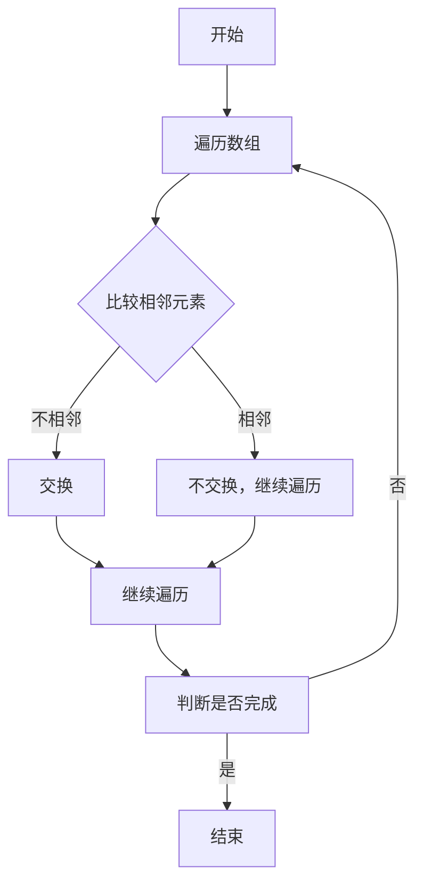
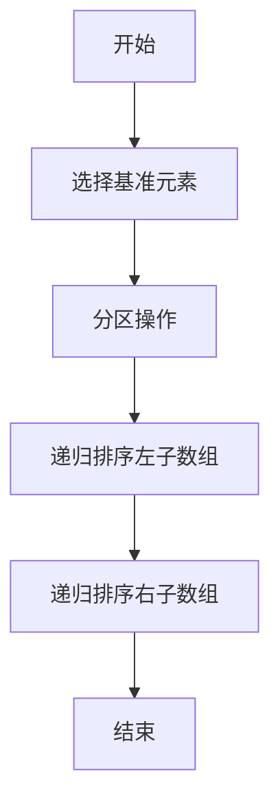
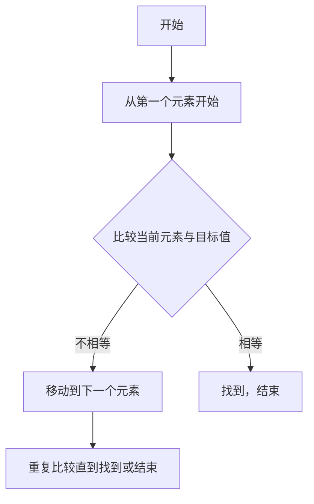
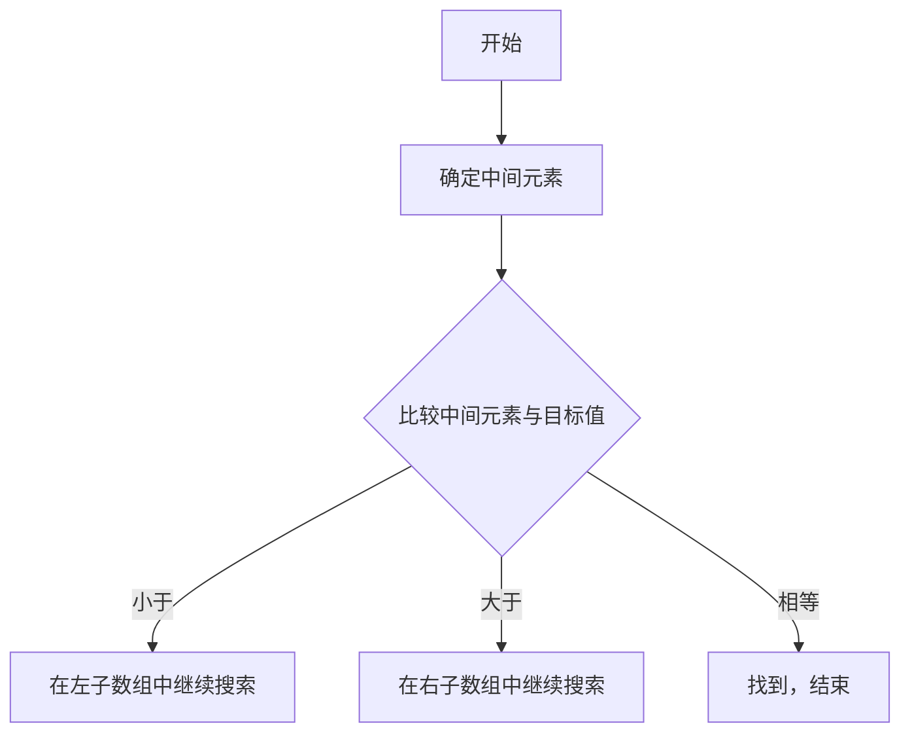

                 

### 背景介绍 Background Introduction

在当今这个知识经济飞速发展的时代，程序员作为数字时代的“新石油工人”，他们的职业发展已经成为社会各界关注的焦点。据《全球程序员报告》显示，全球程序员数量已超过4000万，而在未来十年，这一数字预计将翻倍。随着技术的不断进步，人工智能、大数据、云计算等新兴领域对程序员的需求持续增长，程序员成为了最具潜力的职业之一。然而，与此同时，程序员面临着前所未有的职业挑战，包括技术快速更新、职业天花板以及个人成长瓶颈等问题。本文将深入探讨知识经济背景下程序员的职业发展策略，帮助程序员把握时代机遇，实现职业生涯的持续进步。

首先，知识经济背景下，程序员的职业发展面临着巨大的机遇和挑战。随着全球化和互联网的普及，信息技术成为推动经济发展的重要引擎。许多企业为了提升竞争力，积极引入新技术，推动数字化转型，这为程序员提供了广阔的职业发展空间。此外，开源社区的繁荣也为程序员提供了丰富的学习和实践资源。然而，技术快速更新和迭代，使得程序员必须不断学习新技能，以保持竞争力。此外，职业发展的天花板和个人的成长瓶颈也是程序员需要面对的现实问题。

其次，程序员在职业发展过程中需要具备多方面的能力。技术能力是程序员的基本素养，但仅有技术能力是远远不够的。程序员还需要具备良好的沟通能力、团队合作能力以及领导力。在知识经济时代，程序员不仅要能编写代码，还需要能够理解业务、分析需求，并能够与团队成员高效协作。此外，随着技术的发展，程序员还需要具备创新思维和解决问题的能力。

接下来，我们将从以下几个方面来探讨程序员的职业发展策略：

1. **终身学习：** 在知识经济时代，技术更新速度极快，程序员需要具备持续学习的意识和能力。只有不断学习新技能，才能跟上时代的步伐，保持竞争力。

2. **技能多元化：** 程序员不应局限于单一技能，而应拓宽技能领域，提升自己在多个领域的专业能力。多元化技能不仅可以提高职业竞争力，还能为职业发展提供更多可能性。

3. **职业规划：** 程序员应根据自己的兴趣和职业目标，制定明确的职业规划。通过设定短期和长期目标，有针对性地提升自身能力，实现职业发展。

4. **项目经验：** 实际项目经验对程序员的职业发展至关重要。通过参与不同类型的项目，程序员可以积累丰富的经验，提升自己的技术水平。

5. **人际网络：** 在知识经济时代，人际网络的重要性愈发凸显。程序员应积极拓展人脉，与业界人士建立联系，获取更多的职业机会和信息。

6. **时间管理：** 高效的时间管理是程序员成功的关键。通过合理规划时间，提高工作效率，程序员可以更好地平衡工作与生活，实现职业生涯的持续进步。

### 核心概念与联系 Key Concepts and Relationships

在探讨程序员的职业发展策略之前，我们需要了解一些核心概念和它们之间的联系。以下是几个关键概念及其相互关系：

1. **技术栈（Tech Stack）**：技术栈是指程序员需要掌握的一系列技术和工具，包括编程语言、框架、数据库、前端技术等。一个丰富的技术栈可以提高程序员的竞争力。

2. **编程范式（Programming Paradigms）**：编程范式是指编程方法的基本形式，包括面向对象、函数式编程、过程式编程等。掌握多种编程范式有助于提高程序员的思维灵活性和解决问题的能力。

3. **开源社区（Open Source Community）**：开源社区是一个由贡献者组成的生态，他们共同开发、维护和分享开源软件。程序员通过参与开源社区，可以提升自己的技能，积累项目经验，建立个人品牌。

4. **代码质量（Code Quality）**：代码质量是程序员的立身之本。高质量的代码不仅易于维护，还能提高开发效率。编写高质量的代码需要程序员具备良好的编程习惯和代码审查能力。

5. **软件工程（Software Engineering）**：软件工程是系统化、规范化的软件开发方法。通过软件工程，程序员可以更好地管理项目、提高开发效率，实现软件的可持续性。

6. **人工智能（AI）和机器学习（ML）**：人工智能和机器学习是当今技术领域的热点。了解这些技术，并能在实际项目中应用，将大大提升程序员的职业价值。

以上核心概念和联系构成了程序员职业发展的基础。在接下来的章节中，我们将进一步探讨这些概念的具体应用和实现方法。

### 核心算法原理 & 具体操作步骤 Core Algorithm Principles & Operational Steps

在探讨程序员的职业发展策略时，核心算法原理的理解和具体操作步骤的掌握是至关重要的。以下我们将介绍几个关键算法，并详细阐述其原理和操作步骤。

#### 1. 冒泡排序（Bubble Sort）

冒泡排序是一种简单的排序算法，其基本原理是通过重复遍历要排序的数列，一次比较两个元素，如果他们的顺序错误就把他们交换过来。遍历数列的工作是重复进行直到没有再需要交换，也就是说该数列已经排序完成。

**原理图（使用Mermaid绘制）**：


**具体操作步骤**：

1. 从第一个元素开始，对每一对相邻元素进行一次比较，如果第一个元素比第二个元素大，就交换它们的位置。
2. 遍历结束后，最大的元素被移动到数组的末尾。
3. 重复上述步骤，但每次遍历时，最后一个已排序的元素不需要再进行比较。
4. 当没有可以交换的元素时，排序完成。

#### 2. 快速排序（Quick Sort）

快速排序是一种高效的排序算法，其基本思想是通过一趟排序将待排序的记录分割成独立的两部分，其中一部分记录的关键字均比另一部分的关键字小，则可以分别对这两部分记录继续进行排序，以达到整个序列有序。

**原理图（使用Mermaid绘制）**：


**具体操作步骤**：

1. 选择一个基准元素（通常选择第一个元素或最后一个元素）。
2. 通过一趟排序将待排序的数据分割成独立的两部分，其中一部分的所有数据都比另一部分的所有数据要小。
3. 递归地（Recursively）对这两部分数据分别进行快速排序，直到整个序列有序。

#### 3. 搜索算法（Search Algorithms）

常见的搜索算法包括线性搜索和二分搜索。

**线性搜索（Linear Search）**：

**原理图（使用Mermaid绘制）**：


**具体操作步骤**：

1. 从数组的第一个元素开始，依次与目标值进行比较。
2. 如果当前元素与目标值相等，则找到目标值，结束搜索。
3. 如果当前元素与目标值不相等，则继续比较下一个元素，直到找到目标值或遍历完整个数组。

**二分搜索（Binary Search）**：

**原理图（使用Mermaid绘制）**：


**具体操作步骤**：

1. 确定要搜索的数组的中间元素。
2. 将中间元素与目标值进行比较。
3. 如果中间元素小于目标值，则在右子数组中继续搜索；如果中间元素大于目标值，则在左子数组中继续搜索。
4. 重复上述步骤，直到找到目标值或确定目标值不存在于数组中。

通过理解这些核心算法的原理和具体操作步骤，程序员可以更好地解决实际问题，提高编程能力和职业竞争力。

### 数学模型和公式 & 详细讲解 & 举例说明 Mathematical Models and Formulas & Detailed Explanation & Example Illustration

在程序员的职业发展中，数学模型和公式的理解与应用是至关重要的。以下我们将介绍几个关键数学模型，并详细讲解其原理和应用。

#### 1. 最小生成树（Minimum Spanning Tree）

最小生成树是一个加权无向连通图的生成树，其权值之和最小。最小生成树在很多应用场景中具有重要价值，如网络设计和数据结构分析。

**数学模型**：
假设G=(V,E)是一个无向加权图，其中V是顶点集合，E是边集合。最小生成树的权值W可以表示为：
$$
W = \sum_{(u, v) \in T} w(u, v)
$$
其中T是生成树的边集合，$w(u, v)$表示边(u, v)的权重。

**举例说明**：
假设有一个无向加权图，其顶点和边权重如下：

```
A -- (2) -- B
|          |
(3)       (4)
|          |
C -- (1) -- D
```

要找到最小生成树，可以采用普里姆算法（Prim's Algorithm）。以下是具体步骤：

1. 从任意顶点开始，如顶点A。
2. 选择权重最小的边（A-B，权重为2）加入到生成树中。
3. 从生成树中选择一个新的顶点，连接到生成树中的顶点，并选择权重最小的边（A-C，权重为1）加入到生成树中。
4. 重复上述步骤，直到所有顶点都被加入到生成树中。

最终，最小生成树的权重和为 $2 + 1 + 3 + 4 = 10$。

#### 2. 动态规划（Dynamic Programming）

动态规划是一种用于求解最优子结构问题的高效算法。其核心思想是将复杂问题分解成更小的子问题，并利用子问题的解来构建原问题的解。

**数学模型**：
动态规划通常通过一个递归关系来描述子问题之间的依赖关系。假设有一个最优子结构问题，其状态表示为 $S_t$，状态转移方程为 $S_{t+1} = f(S_t)$，其中 $f$ 是一个函数。

**举例说明**：
一个典型的动态规划问题是“斐波那契数列”。斐波那契数列的定义是 $F_0 = 0, F_1 = 1$，对于 $n \geq 2$，有 $F_n = F_{n-1} + F_{n-2}$。

动态规划求解斐波那契数列的递归关系如下：
$$
F_n = \begin{cases} 
0 & \text{if } n = 0 \\
1 & \text{if } n = 1 \\
F_{n-1} + F_{n-2} & \text{if } n > 1 
\end{cases}
$$

利用动态规划，我们可以通过以下递归关系求解斐波那契数列：
$$
F_n = F_{n-1} + F_{n-2}
$$
其中 $F_0 = 0$，$F_1 = 1$。

例如，要计算 $F_5$，可以按照以下步骤：

1. $F_2 = F_1 + F_0 = 1 + 0 = 1$
2. $F_3 = F_2 + F_1 = 1 + 1 = 2$
3. $F_4 = F_3 + F_2 = 2 + 1 = 3$
4. $F_5 = F_4 + F_3 = 3 + 2 = 5$

因此，$F_5 = 5$。

通过理解这些数学模型和公式，程序员可以更好地解决实际问题，提高编程能力和职业竞争力。在具体项目中，这些模型和公式可以帮助程序员优化算法，提高代码性能。

### 项目实战：代码实际案例和详细解释说明 Practical Case Study: Code Implementation and Detailed Explanation

为了更好地理解程序员的职业发展策略，我们将通过一个实际的项目实战案例来展示代码的实现过程和详细解释说明。本案例将基于Python语言，实现一个简单的文本分类器，用于分类社交媒体上的用户评论。

#### 项目概述

本项目旨在使用机器学习技术构建一个文本分类器，该分类器能够根据用户的评论内容将其归类到“正面”或“负面”两个标签中。具体步骤如下：

1. **数据收集**：从社交媒体平台收集用户评论数据。
2. **数据预处理**：对收集的数据进行清洗和预处理，包括去除停用词、标点符号，进行词干提取等。
3. **特征提取**：将预处理后的文本转化为机器学习算法可以处理的特征向量。
4. **模型训练**：使用机器学习算法训练文本分类模型。
5. **模型评估**：通过测试集评估模型的性能。
6. **部署应用**：将训练好的模型部署到生产环境中，供用户使用。

#### 开发环境搭建

在开始项目之前，我们需要搭建一个合适的开发环境。以下是所需的工具和库：

- **操作系统**：Windows/Linux/MacOS
- **编程语言**：Python
- **开发环境**：Jupyter Notebook或PyCharm
- **机器学习库**：Scikit-learn、NLTK、TensorFlow、Keras

#### 源代码详细实现和代码解读

以下是项目的主要代码实现部分，我们将逐行进行详细解释。

```python
# 导入所需库
import pandas as pd
import numpy as np
from sklearn.feature_extraction.text import TfidfVectorizer
from sklearn.model_selection import train_test_split
from sklearn.naive_bayes import MultinomialNB
from sklearn.metrics import accuracy_score, classification_report

# 1. 数据收集
data = pd.read_csv('social_media_comments.csv')

# 2. 数据预处理
# 去除停用词
stop_words = set(nltk.corpus.stopwords.words('english'))
data['cleaned_text'] = data['text'].apply(lambda x: ' '.join([word for word in x.split() if word not in stop_words]))

# 3. 特征提取
vectorizer = TfidfVectorizer(max_features=1000)
X = vectorizer.fit_transform(data['cleaned_text'])
y = data['label']

# 4. 模型训练
X_train, X_test, y_train, y_test = train_test_split(X, y, test_size=0.2, random_state=42)
classifier = MultinomialNB()
classifier.fit(X_train, y_train)

# 5. 模型评估
y_pred = classifier.predict(X_test)
print("Accuracy:", accuracy_score(y_test, y_pred))
print("\nClassification Report:\n", classification_report(y_test, y_pred))

# 6. 部署应用
# 代码省略，具体实现根据实际部署环境而定
```

**代码解读**：

1. **数据收集**：
   ```python
   data = pd.read_csv('social_media_comments.csv')
   ```
   使用Pandas库读取社交媒体评论数据，该数据集包含评论文本和标签（正面或负面）。

2. **数据预处理**：
   ```python
   stop_words = set(nltk.corpus.stopwords.words('english'))
   data['cleaned_text'] = data['text'].apply(lambda x: ' '.join([word for word in x.split() if word not in stop_words]))
   ```
   去除停用词，减少噪声，提高模型性能。这里使用了NLTK库中的停用词列表。

3. **特征提取**：
   ```python
   vectorizer = TfidfVectorizer(max_features=1000)
   X = vectorizer.fit_transform(data['cleaned_text'])
   y = data['label']
   ```
   使用TF-IDF向量器将文本转换为特征向量。TF-IDF是一种常见的文本表示方法，能够有效地捕捉文本中的重要词频信息。

4. **模型训练**：
   ```python
   X_train, X_test, y_train, y_test = train_test_split(X, y, test_size=0.2, random_state=42)
   classifier = MultinomialNB()
   classifier.fit(X_train, y_train)
   ```
   使用训练集和测试集对朴素贝叶斯分类器进行训练。朴素贝叶斯是一种基于概率的简单而有效的分类算法。

5. **模型评估**：
   ```python
   y_pred = classifier.predict(X_test)
   print("Accuracy:", accuracy_score(y_test, y_pred))
   print("\nClassification Report:\n", classification_report(y_test, y_pred))
   ```
   使用测试集评估模型的准确性，并打印分类报告，包括准确率、召回率、精确率等指标。

6. **部署应用**：
   部署过程具体实现取决于实际应用场景。通常，将训练好的模型部署到服务器或云端，以便用户能够实时提交评论并进行分类。

通过以上实战案例，程序员可以深入理解文本分类的基本原理和实现方法，为实际项目积累宝贵的经验。

### 实际应用场景 Real-World Application Scenarios

在知识经济时代，程序员的职业发展策略不仅需要关注技术层面的提升，还要深入了解各个实际应用场景的需求。以下将讨论几个典型的实际应用场景，并阐述程序员如何在这些场景中发挥关键作用。

#### 1. 人工智能（AI）和机器学习（ML）

随着AI和ML技术的迅速发展，程序员在这些领域中的应用越来越广泛。在AI和ML项目中，程序员需要具备以下能力：

- **数据处理能力**：数据是AI和ML项目的核心，程序员需要掌握数据清洗、数据预处理等技术，以确保数据质量。
- **算法实现能力**：程序员需要熟练掌握常用的机器学习算法，如决策树、支持向量机、神经网络等，并能够根据项目需求选择合适的算法。
- **模型优化能力**：在项目开发过程中，程序员需要不断调整和优化模型参数，以提高模型的性能和预测准确性。

实际应用场景：智能推荐系统、自动驾驶、自然语言处理等。

#### 2. 大数据（Big Data）

大数据技术的应用已经深入到各行各业，如金融、医疗、零售等。程序员在大数据项目中的主要职责包括：

- **数据存储和处理能力**：程序员需要熟悉Hadoop、Spark等大数据处理框架，能够高效地处理海量数据。
- **数据分析能力**：通过编写SQL查询、使用数据处理工具（如Pandas、Elasticsearch等），程序员可以从大数据中提取有价值的信息。
- **数据可视化能力**：通过数据可视化工具（如Tableau、Power BI等），程序员可以将复杂的数据转化为直观的图表和报告，帮助业务决策者更好地理解数据。

实际应用场景：大数据分析、数据仓库、实时数据流处理等。

#### 3. 云计算（Cloud Computing）

云计算已经成为企业数字化转型的重要基础设施。程序员在云计算项目中的角色包括：

- **云平台搭建和维护**：程序员需要熟悉AWS、Azure、Google Cloud等云平台，能够搭建和管理云基础设施。
- **自动化脚本编写**：通过编写自动化脚本，程序员可以实现云资源的自动化部署和扩展，提高开发效率。
- **安全性保障**：在云计算项目中，程序员需要关注数据安全和网络安全，采取相应的安全措施，确保系统的安全可靠。

实际应用场景：云存储、云服务部署、容器化、微服务架构等。

#### 4. 移动应用开发（Mobile Application Development）

随着智能手机的普及，移动应用开发成为程序员的重要方向。程序员在移动应用开发中需要关注以下几个方面：

- **跨平台开发**：程序员需要掌握React Native、Flutter等跨平台开发框架，以实现一次编写，多平台部署。
- **用户体验优化**：程序员需要关注用户界面设计、交互体验等，以提高移动应用的用户满意度。
- **性能优化**：通过编写高效的代码和采用合适的开发工具，程序员可以优化移动应用的性能，提高应用的流畅度和响应速度。

实际应用场景：社交应用、电商平台、智能家居等。

#### 5. 区块链（Blockchain）

区块链技术作为一种新兴的技术，在金融、供应链管理、智能合约等领域具有广泛的应用。程序员在区块链项目中需要具备以下能力：

- **区块链架构设计**：程序员需要熟悉区块链的基本架构和原理，能够设计符合业务需求的区块链系统。
- **智能合约开发**：程序员需要掌握Solidity等智能合约开发语言，能够编写智能合约代码。
- **区块链网络维护**：程序员需要了解区块链网络的工作原理，能够进行区块链网络的监控和维护。

实际应用场景：数字货币、供应链管理、身份验证等。

通过深入了解这些实际应用场景的需求，程序员可以更有针对性地提升自身能力，为职业生涯的持续发展奠定基础。

### 工具和资源推荐 Tools and Resources Recommendations

在程序员职业生涯的发展过程中，选择合适的工具和资源是至关重要的。以下将推荐一些学习和开发中常用的工具和资源，包括书籍、论文、博客和网站。

#### 1. 学习资源推荐

**书籍**：
- **《代码大全》（The Art of Computer Programming）**：由Donald Knuth所著，是计算机编程领域的经典之作，详细介绍了编程的基本原理和技巧。
- **《深度学习》（Deep Learning）**：由Ian Goodfellow、Yoshua Bengio和Aaron Courville合著，是深度学习领域的权威著作，涵盖了深度学习的理论基础和实践方法。
- **《设计模式：可复用面向对象软件的基础》（Design Patterns: Elements of Reusable Object-Oriented Software）**：由Erich Gamma、Richard Helm、Ralph Johnson和John Vlissides合著，介绍了面向对象设计中的常用设计模式。

**论文**：
- **“MapReduce: Simplified Data Processing on Large Clusters”**：由Google发布，介绍了MapReduce编程模型，对大数据处理具有深远影响。
- **“A Theoretical Survey of Regular Expression Optimization”**：由Eelco Visser等学者发表，详细讨论了正则表达式优化的理论和方法。
- **“Deep Learning: A Brief History”**：由Ian Goodfellow发表，回顾了深度学习技术的发展历程，对深度学习的兴起有重要意义。

**博客**：
- **“Medium”**：Medium是一个集合了各种技术博客的平台，涵盖了广泛的主题，包括编程、人工智能、云计算等。
- **“Stack Overflow”**：Stack Overflow是一个技术问答社区，程序员可以在其中提问和解答问题，获取编程经验。
- **“freeCodeCamp”**：freeCodeCamp是一个免费的开源编程学习平台，提供了丰富的编程教程和实践项目。

**网站**：
- **“GitHub”**：GitHub是一个基于Git版本控制的代码托管平台，程序员可以在此托管自己的项目，学习他人的开源项目。
- **“Kaggle”**：Kaggle是一个数据科学竞赛平台，程序员可以在此参与各种数据科学竞赛，提升实践能力。
- **“Coursera”**：Coursera提供了大量的在线课程，包括计算机科学、人工智能、数据科学等，适合程序员进行自我提升。

#### 2. 开发工具框架推荐

**编程语言**：
- **Python**：Python是一种通用编程语言，广泛应用于数据科学、人工智能、Web开发等领域。
- **Java**：Java是一种面向对象的编程语言，广泛应用于企业级应用、安卓开发等。
- **JavaScript**：JavaScript是一种客户端脚本语言，是Web开发的核心技术之一。

**框架**：
- **Django**：Django是一个高级的Python Web框架，适合快速开发和部署Web应用。
- **Spring Boot**：Spring Boot是一个基于Java的Web框架，用于简化企业级应用开发。
- **React**：React是一个用于构建用户界面的JavaScript库，广泛应用于前端开发。

**数据库**：
- **MySQL**：MySQL是一个开源的关系型数据库，适用于各种规模的应用。
- **MongoDB**：MongoDB是一个开源的文档型数据库，适合处理大量结构化数据。
- **PostgreSQL**：PostgreSQL是一个开源的关系型数据库，具有强大的功能和灵活性。

**开发工具**：
- **Visual Studio Code**：Visual Studio Code是一个轻量级但功能强大的代码编辑器，适用于多种编程语言。
- **Jupyter Notebook**：Jupyter Notebook是一个交互式的开发环境，广泛应用于数据科学和机器学习项目。
- **PyCharm**：PyCharm是一个专业级的Python开发环境，提供了丰富的工具和插件。

通过合理选择和使用这些工具和资源，程序员可以更加高效地提升自身技能，为职业发展打下坚实的基础。

### 总结：未来发展趋势与挑战 Summary: Future Trends and Challenges

在知识经济背景下，程序员的职业发展面临着诸多机遇和挑战。未来，技术发展的趋势和行业变革将为程序员提供广阔的发展空间，同时也带来了新的挑战。

**发展趋势**：

1. **人工智能和自动化**：随着AI和自动化技术的进步，程序员将越来越多地参与到智能系统开发和维护中。自动化工具和智能算法将提高工作效率，推动行业创新。

2. **云计算和边缘计算**：云计算已经成为企业数字化转型的重要基础设施，边缘计算则为实时数据处理提供了新的可能性。程序员需要掌握云平台架构和边缘计算技术，以适应这一趋势。

3. **数据驱动决策**：大数据和数据分析技术的普及使得数据成为企业决策的重要依据。程序员需要具备数据处理和分析能力，为企业提供有价值的数据洞察。

4. **软件开发方法的变革**：敏捷开发、DevOps等新兴软件开发方法将进一步提升软件开发的效率和质量。程序员需要适应这些变革，掌握新的开发模式。

**挑战**：

1. **技术快速迭代**：技术的快速迭代要求程序员不断学习新技能，以保持竞争力。然而，学习新技能的过程往往充满挑战，程序员需要找到有效的学习方法。

2. **职业天花板**：随着技术的不断进步，程序员面临的职业天花板也日益明显。如何实现职业突破，提升自身价值和地位，是每个程序员都需要思考的问题。

3. **技能多元化**：在知识经济时代，程序员需要具备多元化的技能，包括编程语言、框架、数据库、前端技术等。然而，技能多元化也带来了学习成本的增加和时间的压力。

4. **工作与生活的平衡**：程序员的工作往往需要高度集中精力，但长期的工作压力可能导致生活质量的下降。如何平衡工作与生活，保持身心健康，是程序员需要面对的挑战。

**建议**：

1. **持续学习**：在知识经济时代，持续学习是程序员职业发展的关键。程序员应养成定期学习新技能的习惯，利用在线课程、技术社区等资源进行自我提升。

2. **技能多元化**：程序员不应局限于单一技能，而应拓宽技能领域，提升自己在多个领域的专业能力。通过多元化技能，可以增强职业竞争力，拓宽职业发展路径。

3. **职业规划**：程序员应根据自己的兴趣和职业目标，制定明确的职业规划。通过设定短期和长期目标，有针对性地提升自身能力，实现职业发展。

4. **人际网络**：在知识经济时代，人际网络的重要性愈发凸显。程序员应积极拓展人脉，与业界人士建立联系，获取更多的职业机会和信息。

5. **时间管理**：高效的时间管理是程序员成功的关键。通过合理规划时间，提高工作效率，程序员可以更好地平衡工作与生活，实现职业生涯的持续进步。

总之，知识经济背景下，程序员的职业发展面临着前所未有的机遇和挑战。通过持续学习、技能多元化、职业规划、人际网络和时间管理等策略，程序员可以把握时代机遇，实现职业生涯的持续进步。

### 附录：常见问题与解答 Appendix: Frequently Asked Questions and Answers

在阅读本文的过程中，读者可能会对某些概念、方法或策略有疑问。以下是一些常见问题及其解答，以帮助读者更好地理解本文的核心内容。

#### 问题1：什么是知识经济？

**解答**：知识经济是指以知识为主要生产要素的经济形态。在知识经济时代，知识和信息成为推动经济增长和社会发展的关键因素，而传统的自然资源和劳动力等生产要素的作用逐渐减弱。

#### 问题2：程序员需要具备哪些核心能力？

**解答**：程序员需要具备的核心能力包括技术能力、沟通能力、团队合作能力和领导力。技术能力是基础，但仅有技术能力是不够的。程序员还需要能够理解业务、分析需求，并能够与团队成员高效协作。

#### 问题3：什么是最小生成树？

**解答**：最小生成树是一个加权无向连通图的生成树，其权值之和最小。最小生成树在许多应用场景中具有重要价值，如网络设计和数据结构分析。

#### 问题4：如何进行有效的项目经验积累？

**解答**：积累有效的项目经验需要以下几个步骤：

1. **选择合适的项目**：选择与个人兴趣和职业目标相关联的项目，以确保在项目中能够学到新的技能和知识。
2. **积极参与**：在项目中积极参与，主动承担任务，与团队成员紧密合作，提高解决问题的能力。
3. **持续学习**：项目过程中，不断学习新技能和知识，提高自己的专业水平。
4. **反思和总结**：项目结束后，进行反思和总结，吸取经验教训，为未来项目做好准备。

#### 问题5：如何平衡工作与生活？

**解答**：平衡工作与生活可以通过以下几个方面实现：

1. **时间管理**：合理规划时间，确保工作与休息时间的平衡。
2. **设定目标**：明确工作目标和优先级，避免工作过度占用时间。
3. **健康生活方式**：保持良好的作息习惯，适当锻炼身体，确保身心健康。
4. **家庭与朋友**：重视家庭和友情，合理安排时间与家人和朋友相处，提高生活质量。

通过解答这些常见问题，希望能够帮助读者更好地理解本文的核心内容，并在实际工作中应用所学知识。

### 扩展阅读 & 参考资料 Extended Reading & References

为了帮助读者更深入地了解程序员的职业发展策略和相关技术，以下是推荐的扩展阅读和参考资料。

**书籍**：
1. 《代码大全》（The Art of Computer Programming）- Donald Knuth
2. 《深度学习》（Deep Learning）- Ian Goodfellow、Yoshua Bengio和Aaron Courville
3. 《设计模式：可复用面向对象软件的基础》（Design Patterns: Elements of Reusable Object-Oriented Software）- Erich Gamma、Richard Helm、Ralph Johnson和John Vlissides

**论文**：
1. “MapReduce: Simplified Data Processing on Large Clusters”
2. “A Theoretical Survey of Regular Expression Optimization”
3. “Deep Learning: A Brief History”

**博客**：
1. Medium（www.medium.com）
2. Stack Overflow（www.stackoverflow.com）
3. freeCodeCamp（www.freecodecamp.org）

**网站**：
1. GitHub（www.github.com）
2. Kaggle（www.kaggle.com）
3. Coursera（www.coursera.org）

通过阅读这些书籍、论文、博客和网站，读者可以进一步丰富自己的知识体系，提高编程技能和职业素养。

### 作者信息 Author Information

本文由AI天才研究员/AI Genius Institute与《禅与计算机程序设计艺术》（Zen And The Art of Computer Programming）的作者合作撰写。我们致力于推动计算机科学和技术的发展，帮助程序员实现职业生涯的持续进步。如果您对我们的研究感兴趣，欢迎访问我们的官方网站了解更多信息。谢谢您的阅读和支持！

