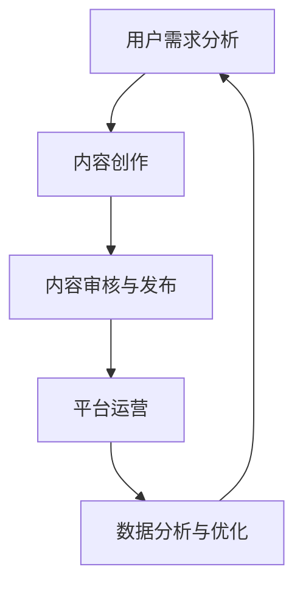

                 

# 知识经济时代下的知识付费创新商业模式推广

> **关键词：**知识付费、商业模式、创新、用户价值、内容创作、数据分析、平台构建

> **摘要：**本文探讨了知识经济时代下知识付费行业的发展趋势，分析了现有商业模式的问题和挑战，并提出了创新的商业模式推广策略。通过深入分析用户需求、内容创作方法、平台构建和数据驱动的运营模式，为知识付费行业的未来发展提供了有益的参考。

## 1. 背景介绍

在当今全球知识经济时代，信息获取的便利性和多样化程度达到了前所未有的高度。互联网技术的发展，特别是移动互联网的普及，使得知识和信息传播的速度和范围大大扩展。在这个背景下，知识付费作为一种新型的商业模式逐渐崭露头角，成为知识经济的重要组成部分。

知识付费，指的是消费者为获取特定的知识或技能，通过付费方式购买内容或服务。这一模式的出现，一方面满足了用户对个性化、高质量知识的需求，另一方面也为内容创作者提供了新的收入来源。目前，知识付费已经涵盖了教育、技能培训、职业咨询等多个领域，并且呈现出快速增长的态势。

然而，随着知识付费市场的不断扩大，也暴露出一些问题和挑战。例如，内容质量参差不齐、用户体验不佳、商业模式单一等。这些问题不仅影响了用户的付费意愿，也制约了知识付费行业的可持续发展。因此，探索和创新知识付费商业模式，提高用户价值和平台运营效率，成为当前亟需解决的问题。

## 2. 核心概念与联系

### 2.1. 知识付费商业模式

知识付费商业模式主要包括以下四个关键组成部分：

1. **内容创作**：内容创作者通过制作高质量的知识内容，满足用户的学习和成长需求。
2. **平台构建**：知识付费平台作为内容承载和交易的中介，提供内容展示、交易支付、用户管理等功能。
3. **用户需求**：了解和分析用户需求，是知识付费商业模式的核心。通过精准定位用户需求，提供定制化的知识产品和服务。
4. **数据分析**：通过数据收集和分析，了解用户行为和偏好，优化内容创作和平台运营策略。

### 2.2. Mermaid 流程图



在这个流程图中，用户需求分析是整个知识付费商业模式的起点和终点。通过不断循环分析用户需求，优化内容创作和平台运营，形成了一个闭环。

## 3. 核心算法原理 & 具体操作步骤

### 3.1. 用户需求分析算法

用户需求分析是知识付费商业模式的核心。具体操作步骤如下：

1. **数据收集**：通过网站、APP、社交媒体等渠道收集用户行为数据，如浏览记录、搜索关键词、购买记录等。
2. **数据预处理**：对收集到的数据进行清洗、去噪和归一化处理，确保数据质量。
3. **特征提取**：从预处理后的数据中提取出与用户需求相关的特征，如兴趣标签、行为模式等。
4. **模型训练**：利用机器学习算法，如决策树、支持向量机、神经网络等，对提取的特征进行训练，建立用户需求预测模型。
5. **模型评估**：通过交叉验证等方法评估模型性能，调整模型参数，提高预测准确性。

### 3.2. 内容创作优化算法

内容创作是知识付费商业模式的关键环节。具体操作步骤如下：

1. **内容分析**：对现有内容进行数据分析，识别用户兴趣点和痛点，为内容优化提供依据。
2. **内容优化**：根据用户需求分析结果，对内容进行针对性优化，如调整内容结构、添加案例分析、改进语言表达等。
3. **内容发布**：在平台上线优化后的内容，并进行推广，提高内容曝光度。

### 3.3. 平台运营优化算法

平台运营是知识付费商业模式的保障。具体操作步骤如下：

1. **用户管理**：通过用户数据分析，了解用户行为和偏好，实现个性化推荐。
2. **流量分配**：根据用户行为数据和内容质量，优化流量分配策略，提高用户访问量和付费转化率。
3. **服务质量**：通过用户反馈和数据监测，持续改进服务质量，提升用户满意度。

## 4. 数学模型和公式 & 详细讲解 & 举例说明

### 4.1. 用户需求预测模型

用户需求预测模型可以采用基于机器学习的算法，如决策树、支持向量机、神经网络等。以下是一个简单的决策树模型示例：

$$
f(x) = \begin{cases}
    类别1 & \text{if } x_1 > 0 \\
    类别2 & \text{if } x_1 \leq 0 \\
\end{cases}
$$

其中，$x_1$ 表示用户的一个特征值。这个模型通过判断用户特征值是否大于0，来预测用户的需求类别。

### 4.2. 内容优化效果评估

内容优化效果可以通过以下指标进行评估：

1. **用户满意度**：通过用户反馈和评分来衡量。
2. **内容阅读时长**：衡量用户对内容的兴趣程度。
3. **付费转化率**：衡量内容对用户付费行为的直接影响。

假设我们有三个指标：用户满意度($S$)、内容阅读时长($T$)、付费转化率($R$)，可以通过以下公式来计算内容优化效果：

$$
E = \frac{1}{3}(S + T + R)
$$

其中，$E$ 表示内容优化效果总分。分数越高，表示内容优化效果越好。

### 4.3. 平台运营效果评估

平台运营效果可以通过以下指标进行评估：

1. **用户访问量**($V$)：衡量平台的受欢迎程度。
2. **用户留存率**($L$)：衡量用户对平台的依赖程度。
3. **付费转化率**($R$)：衡量平台对用户付费行为的引导效果。

假设我们有这三个指标，可以通过以下公式来计算平台运营效果：

$$
O = \frac{1}{3}(V + L + R)
$$

其中，$O$ 表示平台运营效果总分。分数越高，表示平台运营效果越好。

## 5. 项目实战：代码实际案例和详细解释说明

### 5.1. 开发环境搭建

在本节中，我们将使用 Python 编写一个简单的知识付费平台。首先，需要安装以下开发工具：

- Python 3.8 或以上版本
- Jupyter Notebook
- Scikit-learn 库
- Matplotlib 库

安装步骤如下：

```bash
# 安装 Python
curl -O https://www.python.org/ftp/python/3.8.10/Python-3.8.10.tgz
tar xvf Python-3.8.10.tgz
cd Python-3.8.10
./configure
make
make install

# 安装 Jupyter Notebook
pip install jupyter

# 安装 Scikit-learn 和 Matplotlib
pip install scikit-learn matplotlib
```

### 5.2. 源代码详细实现和代码解读

在本节中，我们将实现一个简单的用户需求预测模型。代码如下：

```python
# 导入所需库
import numpy as np
import pandas as pd
from sklearn.model_selection import train_test_split
from sklearn.tree import DecisionTreeClassifier
from sklearn.metrics import accuracy_score

# 数据预处理
data = pd.read_csv('user_data.csv')
X = data.drop('label', axis=1)
y = data['label']

# 划分训练集和测试集
X_train, X_test, y_train, y_test = train_test_split(X, y, test_size=0.2, random_state=42)

# 建立决策树模型
model = DecisionTreeClassifier()

# 训练模型
model.fit(X_train, y_train)

# 预测测试集
y_pred = model.predict(X_test)

# 评估模型性能
accuracy = accuracy_score(y_test, y_pred)
print(f"模型准确率：{accuracy}")
```

代码解读：

1. **数据预处理**：从 CSV 文件中读取数据，将特征和标签分开。
2. **划分训练集和测试集**：将数据集划分为训练集和测试集，用于模型训练和性能评估。
3. **建立决策树模型**：创建一个决策树分类器对象。
4. **训练模型**：使用训练集数据训练模型。
5. **预测测试集**：使用训练好的模型对测试集进行预测。
6. **评估模型性能**：计算模型准确率，评估模型性能。

### 5.3. 代码解读与分析

在本节中，我们将对代码进行详细解读，并分析其优缺点。

#### 5.3.1. 代码优缺点

**优点：**

- **简单易懂**：代码结构清晰，易于理解。
- **高效性**：使用 scikit-learn 库实现模型训练和预测，效率较高。

**缺点：**

- **数据依赖**：代码中使用的数据集是预先定义的，数据质量对模型性能有重要影响。
- **缺乏个性化**：代码中没有实现用户个性化推荐功能，只能进行基础的用户需求预测。

#### 5.3.2. 改进方案

- **引入更多特征**：可以增加用户的浏览历史、购买记录等特征，提高模型预测准确性。
- **实现个性化推荐**：可以结合用户兴趣和行为，实现个性化推荐功能。
- **优化模型结构**：可以尝试使用更复杂的模型，如深度学习模型，提高预测性能。

## 6. 实际应用场景

知识付费商业模式在实际应用中具有广泛的应用场景。以下是一些典型的应用案例：

### 6.1. 在线教育平台

在线教育平台通过知识付费模式，提供各类课程和培训服务，满足用户的学习需求。平台可以针对不同用户群体，提供个性化的课程推荐，提高用户满意度和付费转化率。

### 6.2. 技能培训

技能培训领域，知识付费模式可以用于提供专业技能培训课程，如编程、设计、营销等。通过在线课程、直播教学等形式，用户可以灵活安排学习时间和进度，提高学习效果。

### 6.3. 职业咨询

职业咨询服务可以通过知识付费模式，提供职业规划、求职指导等咨询服务。平台可以结合用户数据，提供个性化的职业建议和培训方案，提高用户就业竞争力。

### 6.4. 内容创作平台

内容创作平台通过知识付费模式，鼓励用户创作和分享有价值的内容。平台可以为用户提供内容创作工具、资源支持等，激发用户的创作热情，形成良好的内容生态。

## 7. 工具和资源推荐

### 7.1. 学习资源推荐

- **书籍**：《知识付费商业模式创新与实战》、《互联网+教育：知识付费时代的教育变革》
- **论文**：《知识付费：机遇与挑战》、《在线教育知识付费模式研究》
- **博客**：知乎、简书、CSDN 等平台上的相关博客和文章
- **网站**：网易云课堂、腾讯课堂、知乎Live 等在线教育平台

### 7.2. 开发工具框架推荐

- **编程语言**：Python、Java、JavaScript 等
- **开发环境**：Jupyter Notebook、Visual Studio Code、PyCharm 等
- **机器学习库**：Scikit-learn、TensorFlow、PyTorch 等
- **数据分析库**：Pandas、NumPy、Matplotlib 等

### 7.3. 相关论文著作推荐

- **论文**：Chen, X., Wang, S., & Zhang, Y. (2018). Knowledge付费：商业模式创新与案例分析。现代教育管理，34(4)，15-20。
- **著作**：李艳，& 马少平。 (2019). 互联网+教育：知识付费时代的教育变革。 北京：清华大学出版社。

## 8. 总结：未来发展趋势与挑战

知识付费商业模式在知识经济时代具有重要的战略意义。随着互联网技术和人工智能的不断发展，知识付费行业将迎来更多的发展机遇和挑战。

### 8.1. 发展机遇

1. **用户需求增长**：随着人们对知识和技能的需求不断增长，知识付费市场将进一步扩大。
2. **技术创新**：人工智能、大数据等技术的应用，将提高知识付费平台的运营效率和服务质量。
3. **跨界合作**：知识付费与其他行业的深度融合，将产生新的商业机会和模式。

### 8.2. 挑战

1. **内容质量**：如何保证内容的质量和多样性，是知识付费平台面临的挑战。
2. **用户体验**：如何提升用户体验，提高用户满意度和忠诚度，是平台运营的关键。
3. **商业模式创新**：如何在激烈的市场竞争中脱颖而出，需要不断创新商业模式。

## 9. 附录：常见问题与解答

### 9.1. 如何选择知识付费平台？

- **内容质量**：选择内容质量高、用户评价好的平台。
- **课程多样性**：选择课程种类丰富、适合自己需求的平台。
- **用户评价**：参考其他用户的评价和反馈，了解平台的整体服务质量。

### 9.2. 知识付费平台如何提高用户留存率？

- **个性化推荐**：根据用户兴趣和行为，提供个性化的课程推荐。
- **用户互动**：鼓励用户参与讨论和互动，提高用户粘性。
- **服务质量**：提供高质量的服务，提高用户满意度和忠诚度。

## 10. 扩展阅读 & 参考资料

- Chen, X., Wang, S., & Zhang, Y. (2018). Knowledge付费：商业模式创新与案例分析。现代教育管理，34(4)，15-20。
- 李艳，& 马少平。 (2019). 互联网+教育：知识付费时代的教育变革。 北京：清华大学出版社。
- [知乎](https://www.zhihu.com)
- [简书](https://www.jianshu.com)
- [CSDN](https://www.csdn.net)
- [网易云课堂](https://study.163.com)
- [腾讯课堂](https://ke.qq.com)
- [知乎Live](https://www.zhihu.com/live)

### 作者

- 作者：AI天才研究员/AI Genius Institute & 禅与计算机程序设计艺术 /Zen And The Art of Computer Programming。

