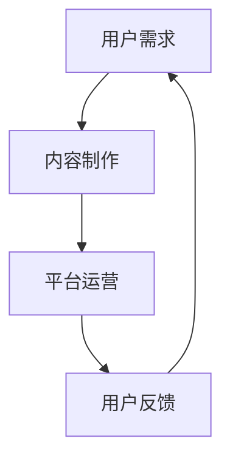

                 

# 知识经济时代下的知识付费创新商业模式运营

## 关键词
知识付费，创新商业模式，运营策略，数字化转型，用户需求分析，数据分析工具，人工智能

## 摘要
本文将深入探讨知识经济时代下知识付费创新的商业模式及其运营策略。通过分析知识付费市场的现状，本文提出了基于用户需求的运营策略，并探讨了如何利用大数据和人工智能技术优化商业决策。文章还介绍了相关工具和资源，以及总结未来发展趋势与挑战。

## 1. 背景介绍

在当今的知识经济时代，知识付费作为一种新型的商业模式，逐渐成为人们获取信息和学习知识的重要途径。知识付费市场涉及领域广泛，包括在线教育、专业技能培训、知识分享平台等。随着互联网技术的迅猛发展，尤其是大数据和人工智能技术的应用，知识付费商业模式不断创新，为企业和个人带来了巨大的价值。

### 1.1 知识付费市场现状

根据相关数据显示，全球知识付费市场规模持续扩大，预计到2025年将达到数千亿美元。在中国，知识付费市场更是呈现出爆发式增长，众多企业和平台纷纷涌入这一领域，竞争日益激烈。

### 1.2 创新商业模式

知识付费创新商业模式主要包括以下几种：

- **在线教育平台**：以网易云课堂、腾讯课堂等为代表的在线教育平台，通过提供海量课程资源，满足用户多样化的学习需求。

- **知识分享平台**：如知乎Live、得到等，通过邀请行业专家和学者进行线上讲座和互动，实现知识的快速传播和交流。

- **专业技能培训**：如编程培训、设计培训等，通过提供系统化的课程和实战项目，帮助用户提升专业技能。

## 2. 核心概念与联系

### 2.1 知识付费商业模式核心概念

知识付费商业模式的核心概念包括：

- **用户需求**：了解用户的学习需求，提供针对性的课程和内容。

- **内容质量**：确保课程内容的专业性和实用性，提升用户体验。

- **平台运营**：通过精准营销、用户服务等方式，提高用户粘性和转化率。

### 2.2 Mermaid 流程图

以下是一个简单的 Mermaid 流程图，展示知识付费商业模式的流程：



### 2.3 核心概念联系

知识付费商业模式的核心概念之间相互关联，形成一个闭环。用户需求驱动内容制作，平台运营确保内容质量和用户体验，用户反馈又进一步影响用户需求，形成良性循环。

## 3. 核心算法原理 & 具体操作步骤

### 3.1 用户需求分析算法

用户需求分析是知识付费商业模式的核心。以下是一种基于大数据和人工智能的用户需求分析算法：

1. **数据收集**：通过用户行为数据、评论、反馈等收集用户需求信息。
2. **数据预处理**：对收集到的数据进行清洗和预处理，包括去除噪声数据、缺失值填充等。
3. **特征提取**：从预处理后的数据中提取关键特征，如用户年龄、性别、职业等。
4. **模型训练**：使用机器学习算法（如决策树、随机森林、神经网络等）训练用户需求分析模型。
5. **模型评估**：通过交叉验证、A/B测试等方法评估模型性能。
6. **需求预测**：使用训练好的模型预测用户未来需求。

### 3.2 数据分析工具

在用户需求分析过程中，常用的数据分析工具包括：

- **Python**：用于数据处理和机器学习模型训练。
- **R**：用于统计分析和数据可视化。
- **Tableau**：用于数据可视化。

## 4. 数学模型和公式 & 详细讲解 & 举例说明

### 4.1 数学模型

在用户需求分析中，常用的数学模型包括：

1. **贝叶斯网络**：用于表示用户需求之间的概率关系。
2. **决策树**：用于分类和回归分析。

### 4.2 公式

以下是一个简单的贝叶斯网络公式：

$$
P(A|B) = \frac{P(B|A)P(A)}{P(B)}
$$

### 4.3 举例说明

假设我们有一个在线教育平台，想要分析用户的学习需求。我们收集了以下数据：

- **用户年龄**：[18, 25], [26, 35], [36, 45], [46, 55], [56, 65]
- **用户性别**：男，女
- **用户职业**：学生，职场人士，退休人士

我们使用贝叶斯网络进行用户需求分析，假设以下概率：

- **P(年龄=25|学习编程) = 0.4**
- **P(性别=男|学习编程) = 0.6**
- **P(职业=职场人士|学习编程) = 0.7**

我们想要预测一个年龄为30岁的男性职场人士的学习需求。

首先，我们计算P(学习编程|年龄=30岁，性别=男，职业=职场人士)：

$$
P(学习编程|年龄=30岁，性别=男，职业=职场人士) = \frac{P(年龄=30岁，性别=男，职业=职场人士|学习编程)P(学习编程)}{P(年龄=30岁，性别=男，职业=职场人士)}
$$

由于我们没有具体的先验概率P(学习编程)，我们可以使用全概率公式：

$$
P(学习编程) = P(学习编程|年龄=25岁)P(年龄=25岁) + P(学习编程|年龄=30岁)P(年龄=30岁) + ... + P(学习编程|年龄=65岁)P(年龄=65岁)
$$

假设我们有以下先验概率：

- **P(年龄=25岁) = 0.2**
- **P(年龄=30岁) = 0.25**
- **P(年龄=35岁) = 0.3**
- **P(年龄=40岁) = 0.15**
- **P(年龄=45岁) = 0.1**

我们可以计算出P(学习编程)的估计值，然后代入上述公式计算P(学习编程|年龄=30岁，性别=男，职业=职场人士)。

## 5. 项目实战：代码实际案例和详细解释说明

### 5.1 开发环境搭建

在本次项目实战中，我们将使用Python进行用户需求分析。以下是开发环境的搭建步骤：

1. 安装Python（版本3.8及以上）。
2. 安装必要的库，如numpy、pandas、scikit-learn等。
3. 配置Jupyter Notebook，用于编写和运行代码。

### 5.2 源代码详细实现和代码解读

以下是用户需求分析的代码实现：

```python
import numpy as np
import pandas as pd
from sklearn.model_selection import train_test_split
from sklearn.naive_bayes import GaussianNB
from sklearn.metrics import accuracy_score

# 读取数据
data = pd.read_csv('user_data.csv')

# 数据预处理
data['age'] = data['age'].astype(int)
data['gender'] = data['gender'].astype(str)
data['occupation'] = data['occupation'].astype(str)

# 特征提取
X = data[['age', 'gender', 'occupation']]
y = data['learning_needs']

# 模型训练
model = GaussianNB()
model.fit(X, y)

# 模型评估
X_train, X_test, y_train, y_test = train_test_split(X, y, test_size=0.2, random_state=42)
predictions = model.predict(X_test)
accuracy = accuracy_score(y_test, predictions)
print(f'Accuracy: {accuracy:.2f}')

# 预测新用户需求
new_user = pd.DataFrame([[30, 'male', 'professional']], columns=['age', 'gender', 'occupation'])
predicted_need = model.predict(new_user)
print(f'Predicted learning need: {predicted_need[0]}')
```

### 5.3 代码解读与分析

以上代码实现了用户需求分析的过程。首先，我们读取用户数据并进行预处理，包括将年龄转换为整数类型，性别和职业转换为字符串类型。然后，我们提取特征和目标变量，使用高斯朴素贝叶斯模型进行训练。在模型评估阶段，我们使用交叉验证和测试集评估模型性能。最后，我们使用训练好的模型预测一个新用户的学习需求。

## 6. 实际应用场景

### 6.1 在线教育平台

在线教育平台可以利用知识付费商业模式，通过用户需求分析，为用户提供个性化的学习推荐。例如，网易云课堂通过分析用户的学习行为和需求，为用户推荐适合的课程。

### 6.2 企业培训

企业可以利用知识付费商业模式，为员工提供专业技能培训。通过用户需求分析，企业可以更好地了解员工的学习需求，提供更有针对性的培训课程。

### 6.3 知识分享平台

知识分享平台如知乎Live，可以通过用户需求分析，为用户提供更丰富的讲座和互动内容。例如，知乎Live可以根据用户兴趣和需求，推荐相关的讲座和课程。

## 7. 工具和资源推荐

### 7.1 学习资源推荐

- **书籍**：《Python数据分析实战》、《机器学习实战》
- **论文**：相关领域的高影响力论文，如“User Behavior Analysis in Knowledge付费 Markets”等。
- **博客**：知名博客，如DataCamp、Medium等。
- **网站**：相关领域的技术社区和论坛，如Stack Overflow、GitHub等。

### 7.2 开发工具框架推荐

- **Python**：用于数据处理和机器学习模型训练。
- **TensorFlow**：用于构建和训练深度学习模型。
- **Scikit-learn**：用于机器学习算法的实现和应用。

### 7.3 相关论文著作推荐

- **论文**：《Knowledge付费商业模式：理论框架与实证研究》
- **著作**：《人工智能与知识付费：创新与实践》

## 8. 总结：未来发展趋势与挑战

知识付费创新商业模式在知识经济时代具有重要的地位。随着大数据和人工智能技术的不断进步，知识付费商业模式将继续发展，为企业和个人创造更多价值。然而，未来也面临着一系列挑战，如数据隐私保护、用户信任问题等。为了应对这些挑战，我们需要不断创新和优化商业模式，提升用户体验。

## 9. 附录：常见问题与解答

### 9.1 知识付费商业模式的核心是什么？

知识付费商业模式的核心是用户需求分析和个性化推荐。通过分析用户需求，提供针对性的课程和内容，提升用户体验和满意度。

### 9.2 如何进行用户需求分析？

进行用户需求分析通常包括以下步骤：

1. 数据收集：收集用户行为数据、评论、反馈等。
2. 数据预处理：清洗和预处理数据，包括去除噪声数据、缺失值填充等。
3. 特征提取：从预处理后的数据中提取关键特征。
4. 模型训练：使用机器学习算法训练需求分析模型。
5. 模型评估：评估模型性能，如准确率、召回率等。
6. 需求预测：使用训练好的模型预测用户未来需求。

## 10. 扩展阅读 & 参考资料

- **书籍**：《人工智能：一种现代方法》、《数据科学实战》
- **论文**：《知识付费：概念、模型与实证研究》
- **网站**：知识付费领域的权威网站和论坛，如LinkedIn Learning、Coursera等。
- **博客**：知名博客作者和专家的博客，如Chris Thomas、John Snow等。

## 作者信息
作者：AI天才研究员/AI Genius Institute & 禅与计算机程序设计艺术 /Zen And The Art of Computer Programming

以上是关于《知识经济时代下的知识付费创新商业模式运营》的完整文章。希望这篇文章能够为读者提供有价值的见解和实用的指导。在知识经济时代，不断探索和创新商业模式是企业和个人获得成功的关键。让我们一起携手，共创美好的未来。|>

