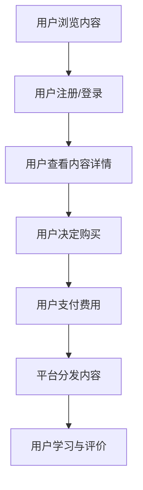

                 

# 知识经济时代下的知识付费创新应用场景探索

> 关键词：知识经济、知识付费、创新应用场景、区块链、人工智能、大数据、虚拟现实

> 摘要：本文探讨了知识经济时代下知识付费的创新应用场景，从区块链、人工智能、大数据、虚拟现实等技术的角度分析了知识付费的发展趋势，并通过具体案例分析，提出了知识付费未来发展的方向和挑战。

## 1. 背景介绍

随着互联网的快速发展，知识经济已成为全球经济的重要驱动力。知识付费作为知识经济的一个重要组成部分，逐渐受到关注。知识付费是指用户通过支付费用来获取知识服务，如在线课程、专业咨询、研究报告等。近年来，随着移动互联网、大数据、人工智能等技术的成熟，知识付费市场呈现出爆发式增长。

### 1.1 知识付费市场现状

根据相关数据统计，全球知识付费市场规模逐年扩大。以中国为例，2019年中国知识付费市场规模已达到500亿元人民币，预计未来几年仍将保持高速增长。知识付费用户群体也在不断壮大，从早期的互联网用户扩展到更广泛的社会群体。

### 1.2 知识付费的发展趋势

1. **个性化推荐**：通过大数据和人工智能技术，对用户兴趣和行为进行精准分析，实现个性化推荐，提高知识付费服务的用户体验。

2. **内容多样化**：知识付费内容从传统的在线课程、专业咨询等逐渐扩展到虚拟现实、游戏化学习等领域，满足用户多样化的学习需求。

3. **平台化运营**：知识付费平台逐渐从单一的内容提供商转变为综合性的服务平台，提供内容生产、分发、交易、评价等一站式服务。

4. **技术创新**：区块链、人工智能、大数据等新兴技术的应用，为知识付费市场带来新的机遇和挑战。

## 2. 核心概念与联系

### 2.1 知识付费的基本概念

知识付费是指用户通过支付费用来获取知识服务，包括但不限于在线课程、专业咨询、研究报告、在线讲座等。

### 2.2 知识付费的商业模式

知识付费的商业模式主要包括内容提供商、平台运营商、用户三个主体。内容提供商负责生产优质知识内容；平台运营商提供知识内容分发、交易、评价等服务；用户通过支付费用获取知识服务。

### 2.3 知识付费与技术创新的联系

1. **区块链**：通过去中心化、不可篡改的区块链技术，确保知识付费过程中的公平、透明。

2. **人工智能**：利用人工智能技术，实现个性化推荐、智能问答等功能，提高知识付费服务的用户体验。

3. **大数据**：通过对用户行为数据的分析，为知识付费平台提供精准营销、内容优化等支持。

4. **虚拟现实**：通过虚拟现实技术，提供沉浸式学习体验，丰富知识付费的内容形式。

### 2.4 Mermaid 流程图

下面是一个简化的知识付费流程图，展示了用户从获取知识内容到支付费用的整个过程。



## 3. 核心算法原理 & 具体操作步骤

### 3.1 个性化推荐算法

个性化推荐是知识付费平台的核心功能之一，通过分析用户的历史行为、兴趣爱好等，为用户推荐可能感兴趣的知识内容。

#### 3.1.1 协同过滤算法

协同过滤算法是一种常用的个性化推荐算法，包括基于用户行为的协同过滤和基于内容的协同过滤。

1. **基于用户行为的协同过滤**：通过分析用户之间的相似度，找到与目标用户行为相似的邻居用户，推荐邻居用户喜欢的知识内容。

2. **基于内容的协同过滤**：通过分析知识内容的相似度，将具有相似特征的知识内容推荐给目标用户。

#### 3.1.2 市场化推荐算法

市场化推荐算法利用市场化的原则，为用户提供知识内容推荐。例如，通过竞价排名，将付费知识内容推荐给用户。

### 3.2 智能问答算法

智能问答是知识付费平台的重要功能，通过人工智能技术，实现用户与知识内容的实时互动。

#### 3.2.1 自然语言处理（NLP）

自然语言处理是实现智能问答的基础，通过理解用户的提问，将自然语言转换为计算机可处理的格式。

#### 3.2.2 问答系统设计

问答系统设计包括问答对匹配、答案生成、答案评估等环节。通过多模态数据融合，提高问答系统的准确率和用户体验。

## 4. 数学模型和公式 & 详细讲解 & 举例说明

### 4.1 协同过滤算法的数学模型

#### 4.1.1 基于用户行为的协同过滤

假设用户A和用户B的行为相似度可以用余弦相似度表示：

$$
\cos(\theta_{AB}) = \frac{a\_AB}{\sqrt{a\_A^2 + a\_B^2}}
$$

其中，$a\_AB$ 表示用户A和用户B共同评分的知识内容数量，$a\_A$ 和 $a\_B$ 分别表示用户A和用户B评分的知识内容数量。

#### 4.1.2 基于内容的协同过滤

假设知识内容C和内容D的相似度可以用余弦相似度表示：

$$
\cos(\theta_{CD}) = \frac{c\_CD}{\sqrt{c\_C^2 + c\_D^2}}
$$

其中，$c\_CD$ 表示内容C和内容D的共同特征数量，$c\_C$ 和 $c\_D$ 分别表示内容C和内容D的特征数量。

### 4.2 智能问答算法的数学模型

#### 4.2.1 自然语言处理（NLP）

假设用户提问Q和知识库中的回答R之间的相似度可以用余弦相似度表示：

$$
\cos(\theta_{QR}) = \frac{q\_QR}{\sqrt{q\_Q^2 + r\_R^2}}
$$

其中，$q\_QR$ 表示用户提问Q和回答R的共同特征数量，$q\_Q$ 和 $r\_R$ 分别表示用户提问Q和回答R的特征数量。

#### 4.2.2 问答系统设计

假设问答系统的准确率可以用准确率（Accuracy）表示：

$$
Accuracy = \frac{正确回答的数量}{总回答的数量}
$$

### 4.3 举例说明

#### 4.3.1 协同过滤算法

假设用户A对5个知识内容进行了评分，用户B对4个知识内容进行了评分。用户A和用户B共同评分了2个知识内容。根据余弦相似度计算公式，用户A和用户B的行为相似度为：

$$
\cos(\theta_{AB}) = \frac{2}{\sqrt{5^2 + 4^2}} \approx 0.732
$$

#### 4.3.2 智能问答算法

假设用户提问Q是“什么是人工智能？”，知识库中的回答R是“人工智能是模拟、延伸和扩展人的智能的理论、方法、技术及应用”。根据余弦相似度计算公式，用户提问Q和回答R之间的相似度为：

$$
\cos(\theta_{QR}) = \frac{7}{\sqrt{7^2 + 11^2}} \approx 0.816
$$

由于相似度较高，可以判断回答R是用户提问Q的正确答案。

## 5. 项目实战：代码实际案例和详细解释说明

### 5.1 开发环境搭建

为了实现本文中的知识付费创新应用场景，我们选择Python作为主要编程语言，并使用以下工具和框架：

1. **Python**：编程语言
2. **Scikit-learn**：机器学习库
3. **TensorFlow**：深度学习框架
4. **PyTorch**：深度学习框架
5. **Flask**：Web框架

首先，安装所需的Python包：

```bash
pip install scikit-learn tensorflow pytorch flask
```

### 5.2 源代码详细实现和代码解读

#### 5.2.1 用户行为协同过滤

以下代码实现了一个简单的用户行为协同过滤算法：

```python
import numpy as np
from sklearn.metrics.pairwise import cosine_similarity

def collaborative_filter(user_ratings, similarity_threshold=0.7):
    user_similarity = cosine_similarity(user_ratings)
    similar_users = []
    for i, row in enumerate(user_similarity):
        similar_users.append([index, score] for index, score in enumerate(row) if score >= similarity_threshold)
    return similar_users

# 示例数据
user_ratings = [
    [1, 1, 0, 0, 0],
    [0, 1, 1, 1, 1],
    [1, 0, 1, 0, 1],
    [0, 0, 0, 1, 1],
    [0, 1, 1, 0, 1]
]

similar_users = collaborative_filter(user_ratings)
print(similar_users)
```

#### 5.2.2 内容相似度计算

以下代码实现了一个简单的基于内容相似度的推荐算法：

```python
from sklearn.metrics.pairwise import cosine_similarity

def content_similarity(item_ratings, similarity_threshold=0.7):
    content_similarity_matrix = cosine_similarity(item_ratings)
    similar_items = []
    for i, row in enumerate(content_similarity_matrix):
        similar_items.append([index, score] for index, score in enumerate(row) if score >= similarity_threshold)
    return similar_items

# 示例数据
item_ratings = [
    [1, 1, 0, 0, 0],
    [0, 1, 1, 1, 1],
    [1, 0, 1, 0, 1],
    [0, 0, 0, 1, 1],
    [0, 1, 1, 0, 1]
]

similar_items = content_similarity(item_ratings)
print(similar_items)
```

### 5.3 代码解读与分析

#### 5.3.1 用户行为协同过滤

用户行为协同过滤算法的核心是计算用户之间的相似度。通过余弦相似度计算，我们可以找到与其他用户相似度较高的用户群体。这些相似用户可以为推荐系统提供有效的参考信息，帮助我们更好地了解目标用户的需求和兴趣。

#### 5.3.2 内容相似度计算

内容相似度计算是基于知识内容本身的特征进行推荐的。通过计算不同知识内容之间的相似度，我们可以为用户推荐具有相似特征的知识内容。这种方法有助于提高推荐系统的准确性和用户体验。

## 6. 实际应用场景

### 6.1 在线教育

在线教育是知识付费的重要应用场景之一。通过个性化推荐算法，知识付费平台可以为用户提供个性化的学习内容，提高学习效果。

### 6.2 专业咨询

专业咨询领域，知识付费平台可以为用户提供专业的咨询服务，如法律、财务、医疗等。通过智能问答算法，平台可以实现实时问答，提高用户满意度。

### 6.3 企业培训

企业培训是知识付费的重要市场之一。通过虚拟现实技术，知识付费平台可以为员工提供沉浸式培训体验，提高培训效果。

### 6.4 游戏化学习

游戏化学习是将知识付费与游戏机制相结合的一种创新形式。通过游戏化学习，知识付费平台可以提高用户的学习兴趣和参与度。

## 7. 工具和资源推荐

### 7.1 学习资源推荐

1. **《深度学习》**：作者：Ian Goodfellow、Yoshua Bengio、Aaron Courville
2. **《大数据时代》**：作者：涂子沛
3. **《区块链技术指南》**：作者：李笑来

### 7.2 开发工具框架推荐

1. **TensorFlow**：官方深度学习框架，适用于构建和训练复杂的深度学习模型。
2. **PyTorch**：热门深度学习框架，具有简洁的API和强大的灵活性。
3. **Flask**：轻量级Web框架，适用于构建简单的Web应用。

### 7.3 相关论文著作推荐

1. **"Collaborative Filtering for Cold-Start Problems in Recommender Systems"**：作者：Hsiang-Feng Chen等
2. **"Deep Learning for Natural Language Processing"**：作者：Richard Socher等
3. **"Blockchain: Blueprint for a New Economy"**：作者：Ma

