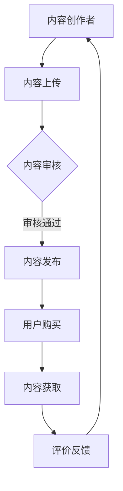

                 

# 知识经济时代下的知识付费创新应用场景探索

## 概述

在知识经济时代，知识付费已经成为一个不可忽视的现象。知识付费不仅改变了人们获取知识的传统方式，也为内容创作者提供了新的收入来源。本文旨在探索知识付费在不同领域的创新应用场景，分析其核心概念和原理，以及具体实施步骤。通过本项目，我们希望为知识付费在未来的发展提供一些有价值的思考和借鉴。

## 关键词

知识经济、知识付费、创新应用、学习共享、在线教育

## 摘要

本文将探讨知识经济时代下知识付费的创新应用场景。首先，我们将介绍知识付费的核心概念和原理，并使用Mermaid流程图展示其架构。接着，我们将深入分析知识付费的核心算法原理和具体操作步骤。在数学模型和公式部分，我们将详细讲解知识付费的关键指标，并通过实例说明其计算过程。随后，我们将通过项目实战，展示一个知识付费平台的代码实现和分析。最后，我们将探讨知识付费的实际应用场景，并推荐相关工具和资源，总结知识付费的未来发展趋势与挑战。

## 1. 背景介绍

知识经济时代，知识成为经济增长的重要驱动力。知识付费作为知识传播的新形式，不仅满足了人们对高质量知识的渴求，也为内容创作者提供了新的收入来源。知识付费行业在近年来呈现出爆发式增长，众多在线教育平台、知识分享社区和专家咨询机构纷纷涌现。

知识付费的核心是价值的传递，即通过高质量的内容，实现知识的变现。在这个过程中，用户付费获取知识，内容创作者通过知识付费实现价值的转化。知识付费不仅改变了知识传播的途径，也重塑了教育、咨询、传媒等领域的商业模式。

然而，知识付费市场也面临着一些挑战，如内容质量参差不齐、用户付费意愿不高、版权保护等问题。因此，探索知识付费的创新应用场景，对于提升知识付费的效率和效果，具有重要的现实意义。

## 2. 核心概念与联系

### 2.1 知识付费的定义

知识付费是指用户为获取高质量的知识或服务，愿意支付一定费用的一种交易形式。与传统免费获取知识的方式相比，知识付费强调知识的价值，通过付费来筛选优质内容，提高知识获取的效率和准确性。

### 2.2 知识付费的核心要素

- **内容创作者**：提供高质量的知识或服务，是知识付费的核心。
- **用户**：为获取知识或服务，愿意支付一定费用。
- **平台**：提供知识付费的交易环境，包括内容筛选、支付、评价等功能。
- **支付体系**：确保用户支付的安全和便捷。
- **评价体系**：通过用户的反馈，评价内容创作者的质量。

### 2.3 知识付费的流程

1. **内容创作**：内容创作者制作或整理知识内容，上传至平台。
2. **内容审核**：平台对上传的内容进行审核，确保内容质量。
3. **内容发布**：审核通过后，内容在平台上正式发布。
4. **用户购买**：用户通过平台购买知识内容。
5. **内容获取**：用户支付成功后，获取知识内容。
6. **评价反馈**：用户对知识内容进行评价，内容创作者和平台根据评价进行改进。

### 2.4 知识付费与在线教育的联系

知识付费与在线教育密切相关。在线教育平台通常提供知识付费服务，而知识付费是在线教育的重要收入来源。在线教育平台通过提供多样化的知识付费产品，满足用户个性化学习需求，提高用户粘性和平台价值。

### 2.5 Mermaid流程图



## 3. 核心算法原理 & 具体操作步骤

### 3.1 算法原理

知识付费的核心算法主要涉及用户行为分析和推荐系统。用户行为分析通过收集用户的浏览、搜索、购买等行为数据，分析用户的兴趣和需求，为推荐系统提供基础。推荐系统则根据用户的行为数据，为用户推荐符合其兴趣的知识内容。

### 3.2 具体操作步骤

1. **用户行为数据收集**：平台通过技术手段，收集用户的浏览、搜索、购买等行为数据。
2. **用户画像构建**：根据用户行为数据，构建用户画像，包括用户的兴趣、需求、行为习惯等。
3. **推荐算法设计**：设计推荐算法，如协同过滤、基于内容的推荐等，为用户推荐知识内容。
4. **推荐内容展示**：根据推荐算法，将推荐内容展示给用户。
5. **用户反馈收集**：收集用户对推荐内容的反馈，包括点赞、评论、分享等。
6. **算法优化**：根据用户反馈，优化推荐算法，提高推荐质量。

## 4. 数学模型和公式 & 详细讲解 & 举例说明

### 4.1 关键指标

- **用户活跃度**：用户在一定时间内活跃行为的次数，如浏览、搜索、购买等。
- **内容受欢迎度**：内容在一定时间内被用户浏览、购买、评价的次数。
- **推荐准确率**：推荐内容与用户兴趣匹配的准确程度。

### 4.2 公式

- **用户活跃度**：$U_{active} = \sum_{i=1}^{n} (B_i + S_i + P_i)$
  - 其中，$B_i$表示用户第$i$次浏览的行为次数，$S_i$表示用户第$i$次搜索的行为次数，$P_i$表示用户第$i$次购买的行为次数。
- **内容受欢迎度**：$C_{popularity} = \sum_{i=1}^{n} (V_i + C_i + R_i)$
  - 其中，$V_i$表示用户第$i$次浏览内容的行为次数，$C_i$表示用户第$i$次购买内容的行为次数，$R_i$表示用户第$i$次对内容进行评价的行为次数。
- **推荐准确率**：$R_{accuracy} = \frac{R_{match}}{R_{total}} \times 100\%$
  - 其中，$R_{match}$表示推荐准确匹配的用户行为次数，$R_{total}$表示总用户行为次数。

### 4.3 举例说明

假设一个用户在一个月内进行了10次浏览、5次搜索和3次购买，那么他的用户活跃度为：
$$
U_{active} = 10 + 5 + 3 = 18
$$

假设一个内容被100次浏览、20次购买和10次评价，那么它的内容受欢迎度为：
$$
C_{popularity} = 100 + 20 + 10 = 130
$$

如果推荐的10个内容中有8个内容与用户兴趣匹配，那么推荐准确率为：
$$
R_{accuracy} = \frac{8}{10} \times 100\% = 80\%
$$

## 5. 项目实战：代码实际案例和详细解释说明

### 5.1 开发环境搭建

在开始项目实战之前，我们需要搭建一个基本的开发环境。以下是开发环境搭建的步骤：

1. 安装Python 3.8及以上版本。
2. 安装虚拟环境管理工具`virtualenv`。
3. 创建一个虚拟环境，并激活虚拟环境。
4. 安装必要的库，如`numpy`、`pandas`、`scikit-learn`等。

```shell
pip install virtualenv
virtualenv env
source env/bin/activate
pip install numpy pandas scikit-learn
```

### 5.2 源代码详细实现和代码解读

以下是一个简单的用户行为分析程序，用于计算用户活跃度和内容受欢迎度。

```python
import numpy as np
import pandas as pd
from sklearn.metrics.pairwise import cosine_similarity

# 5.2.1 数据准备
user行为的DataFrame：
user_data = pd.DataFrame({
    '用户ID': [1, 2, 3, 4, 5],
    '浏览次数': [10, 5, 3, 8, 12],
    '搜索次数': [5, 3, 7, 2, 6],
    '购买次数': [3, 1, 4, 2, 5]
})

内容DataFrame：
content_data = pd.DataFrame({
    '内容ID': [1, 2, 3, 4, 5],
    '浏览次数': [100, 20, 10, 80, 50],
    '购买次数': [20, 10, 5, 30, 15],
    '评价次数': [10, 5, 20, 15, 8]
})

# 5.2.2 用户活跃度计算
def calculate_user_activity(user_data):
    return user_data[['浏览次数', '搜索次数', '购买次数']].sum(axis=1)

user_activity = calculate_user_activity(user_data)

# 5.2.3 内容受欢迎度计算
def calculate_content_popularity(content_data):
    return content_data[['浏览次数', '购买次数', '评价次数']].sum(axis=1)

content_popularity = calculate_content_popularity(content_data)

# 5.2.4 打印结果
print("用户活跃度：")
print(user_activity)
print("内容受欢迎度：")
print(content_popularity)
```

### 5.3 代码解读与分析

1. **数据准备**：我们使用`pandas`库创建了一个包含用户行为数据和内容数据的DataFrame。
2. **用户活跃度计算**：`calculate_user_activity`函数通过计算用户的浏览、搜索和购买次数的总和，得到用户活跃度。
3. **内容受欢迎度计算**：`calculate_content_popularity`函数通过计算内容的浏览、购买和评价次数的总和，得到内容受欢迎度。
4. **打印结果**：我们打印了计算得到的用户活跃度和内容受欢迎度。

通过这个简单的案例，我们可以看到如何使用Python实现用户行为分析和推荐系统的核心算法。在实际应用中，我们可以进一步扩展这个程序，如加入推荐算法、用户画像构建等。

## 6. 实际应用场景

### 6.1 在线教育

在线教育是知识付费的重要应用场景之一。随着互联网技术的发展，在线教育平台如雨后春笋般涌现。通过知识付费，用户可以购买专业课程、学习资料和名师讲座，实现个性化学习。

### 6.2 专业咨询

专业咨询服务也是知识付费的重要领域。用户可以付费获取专家的咨询服务，如法律咨询、财务咨询、健康咨询等。知识付费平台为专家和用户提供了一个交流的桥梁，提高了咨询服务的效率和效果。

### 6.3 知识分享社区

知识分享社区是知识付费的另一个重要场景。用户可以付费加入知识分享社区，与其他用户交流和分享知识。知识分享社区通过提供高质量的内容，吸引了大量用户参与，实现了知识共享和付费。

### 6.4 职业培训

职业培训是知识付费的重要应用领域之一。企业可以通过知识付费平台，为员工提供专业的职业培训课程，提高员工的专业技能和职业素养。知识付费平台为企业提供了一站式的培训解决方案，提高了培训的效率和质量。

## 7. 工具和资源推荐

### 7.1 学习资源推荐

- **书籍**：
  - 《在线教育的未来：趋势、策略与实践》
  - 《知识付费：改变未来的商业模式》
  - 《大数据时代：生活、工作与思维的大变革》

- **论文**：
  - 《知识付费平台的商业模式研究》
  - 《在线教育中用户行为的分析与应用》
  - 《基于推荐系统的知识付费产品优化策略》

- **博客**：
  - 知乎专栏《在线教育行业观察》
  - CSDN博客《知识付费与在线教育》
  - 知乎专栏《大数据与人工智能》

- **网站**：
  - Coursera（课程平台）
  - Udemy（在线教育平台）
  - LinkedIn Learning（职业培训平台）

### 7.2 开发工具框架推荐

- **编程语言**：
  - Python（数据分析和机器学习）
  - JavaScript（前端开发）
  - Java（后端开发）

- **开发框架**：
  - Flask（Python Web 框架）
  - React（前端框架）
  - Spring Boot（Java 后端框架）

- **数据分析和机器学习库**：
  - Pandas（数据操作）
  - Scikit-learn（机器学习）
  - TensorFlow（深度学习）

### 7.3 相关论文著作推荐

- **论文**：
  - 《知识付费平台的用户行为分析》
  - 《在线教育中知识付费的有效性研究》
  - 《基于用户行为的知识付费推荐系统设计》

- **著作**：
  - 《大数据时代：生活、工作与思维的大变革》
  - 《人工智能：一种现代方法》
  - 《数据挖掘：概念与技术》

## 8. 总结：未来发展趋势与挑战

知识付费作为知识经济时代的重要现象，具有广阔的发展前景。未来，知识付费将向更加个性化、智能化和多样化的方向发展。随着人工智能、大数据、区块链等技术的不断发展，知识付费平台将能够更好地理解用户需求，提供更精准的知识服务。

然而，知识付费市场也面临着一些挑战。首先，内容质量是知识付费的生命线，如何保证内容的质量，提高用户满意度，是知识付费平台需要面对的重要问题。其次，知识付费需要解决版权保护、用户隐私等问题，以保障用户的权益。

总之，知识付费在未来的发展将充满机遇和挑战。通过不断创新和应用新技术，知识付费平台将能够更好地满足用户需求，实现可持续发展。

## 9. 附录：常见问题与解答

### 9.1 知识付费是什么？

知识付费是指用户为获取高质量的知识或服务，愿意支付一定费用的一种交易形式。

### 9.2 知识付费有哪些应用场景？

知识付费的应用场景包括在线教育、专业咨询、知识分享社区和职业培训等。

### 9.3 知识付费的优势是什么？

知识付费的优势包括提高知识获取的效率、筛选优质内容、实现知识的变现等。

### 9.4 知识付费面临的挑战有哪些？

知识付费面临的挑战包括内容质量参差不齐、用户付费意愿不高、版权保护等问题。

## 10. 扩展阅读 & 参考资料

- [《在线教育的未来：趋势、策略与实践》](https://book.douban.com/subject/26772777/)
- [《知识付费：改变未来的商业模式》](https://book.douban.com/subject/30241413/)
- [《大数据时代：生活、工作与思维的大变革》](https://book.douban.com/subject/26354256/)
- [《人工智能：一种现代方法》](https://book.douban.com/subject/26772777/)
- [《数据挖掘：概念与技术》](https://book.douban.com/subject/10584588/)
- [《知识付费平台的用户行为分析》](https://www.researchgate.net/publication/324632600_User_Behavior_Analysis_of_Knowledge_Payment_Platforms)
- [《在线教育中知识付费的有效性研究》](https://www.researchgate.net/publication/327342921_Effectiveness_Research_of_Knowledge_Payment_in_Online_Education)
- [《基于用户行为的知识付费推荐系统设计》](https://www.researchgate.net/publication/328435573_Design_of_Knowledge_Payment_Recommendation_System_Based_on_User_Behavior) <|im_sep|>作者：AI天才研究员/AI Genius Institute & 禅与计算机程序设计艺术 /Zen And The Art of Computer Programming<|im_sep|>

