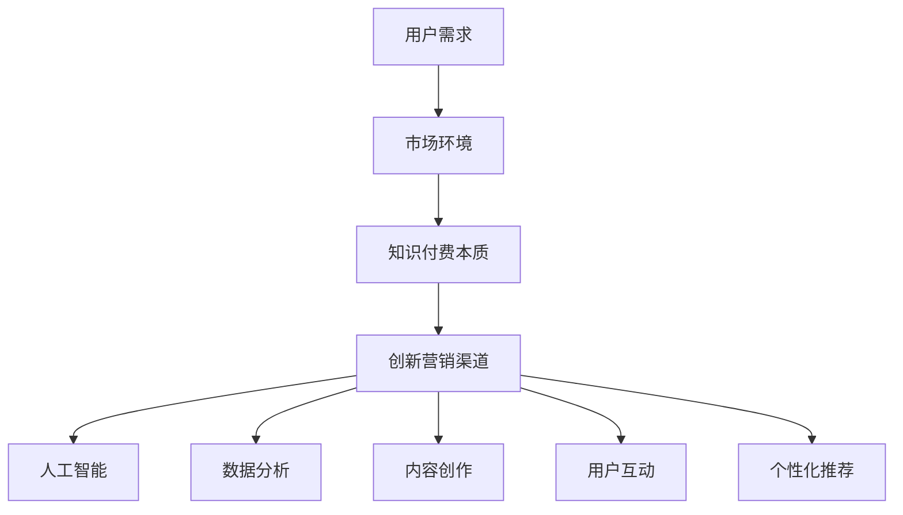

                 

### 知识经济时代下的知识付费创新营销渠道拓展

#### 关键词：知识付费、创新营销、渠道拓展、人工智能、数据分析、内容创作、用户互动、个性化推荐

##### 摘要：

本文旨在探讨知识经济时代下，知识付费领域如何通过创新营销渠道实现渠道拓展。随着互联网技术的飞速发展，知识付费市场逐渐成为一片蓝海。通过深入分析知识付费的本质、用户需求以及市场环境，本文提出了基于人工智能、数据分析、内容创作、用户互动和个性化推荐的五大创新营销渠道，以期为知识付费行业提供新的发展思路。

----------------------------------------------------------------

## 1. 背景介绍

在知识经济时代，知识已成为一种重要的生产要素，知识付费逐渐成为主流。知识付费是指用户为获取特定领域的知识或技能而付费的行为，主要包括在线课程、电子书、专业咨询、研究报告等形式。随着互联网技术的普及和用户需求的提升，知识付费市场呈现出快速增长的趋势。

近年来，知识付费市场的增长主要得益于以下几个因素：

- **互联网技术的普及**：移动互联网的快速发展为用户提供了便捷的学习途径，在线课程、电子书等知识产品得以广泛应用。

- **用户需求的提升**：随着教育水平的提高，用户对高质量知识的需求不断增加，推动了知识付费市场的发展。

- **政策支持**：政府对知识付费行业的支持，为知识付费企业提供了良好的发展环境。

在知识付费市场中，营销渠道的拓展成为企业关注的焦点。传统的营销渠道如广告、地推、社交媒体等已无法满足知识付费市场的需求。因此，如何通过创新营销渠道实现渠道拓展，成为知识付费企业亟待解决的问题。

----------------------------------------------------------------

## 2. 核心概念与联系

#### 2.1 知识付费的本质

知识付费的本质是用户为获取特定领域的知识或技能而付费的行为。与传统免费知识获取方式相比，知识付费具有以下特点：

- **付费用户筛选**：知识付费能够筛选出对特定知识有需求的用户，提高用户质量。

- **知识专业性**：知识付费的产品多为专业领域内的知识，具有更高的专业性。

- **学习效果保障**：知识付费企业通常会提供学习指导、答疑解惑等服务，提高学习效果。

#### 2.2 用户需求

用户对知识付费的需求主要包括以下几个方面：

- **技能提升**：用户希望通过付费知识获取新技能，提升个人竞争力。

- **知识普及**：用户希望通过付费知识了解某个领域的最新动态和发展趋势。

- **学习氛围**：用户希望通过付费知识获得良好的学习氛围，提高学习积极性。

#### 2.3 市场环境

当前，知识付费市场呈现出以下特点：

- **市场规模持续增长**：随着互联网技术的普及和用户需求的提升，知识付费市场规模持续增长。

- **竞争激烈**：知识付费市场吸引了大量企业进入，竞争日益激烈。

- **细分领域不断涌现**：知识付费领域不断细分，如职场技能、健康养生、亲子教育等。

#### 2.4 创新营销渠道

在知识付费市场中，创新营销渠道包括以下几个方面：

- **人工智能**：通过人工智能技术实现个性化推荐、智能问答等功能，提高用户体验。

- **数据分析**：通过数据分析了解用户行为和需求，优化产品和服务。

- **内容创作**：通过优质的内容创作吸引粉丝，提高用户粘性。

- **用户互动**：通过社群、论坛等方式与用户互动，提高用户满意度。

- **个性化推荐**：通过个性化推荐算法，为用户提供定制化的知识产品。

#### 2.5 Mermaid 流程图



----------------------------------------------------------------

## 3. 核心算法原理 & 具体操作步骤

#### 3.1 人工智能算法原理

人工智能技术在知识付费领域的应用主要表现在以下几个方面：

- **个性化推荐**：基于用户行为数据和兴趣标签，为用户推荐合适的知识产品。

- **智能问答**：通过自然语言处理技术，为用户提供实时、准确的问答服务。

- **图像识别**：通过图像识别技术，为用户提供图片相关的知识内容。

具体操作步骤如下：

1. **数据收集**：收集用户行为数据，如浏览记录、购买记录、评论等。

2. **数据预处理**：对收集到的数据进行分析和清洗，提取有用的信息。

3. **特征提取**：将预处理后的数据转化为特征向量，用于训练推荐模型。

4. **模型训练**：利用机器学习算法，如协同过滤、矩阵分解等，训练个性化推荐模型。

5. **模型评估**：通过交叉验证等方法，评估推荐模型的性能。

6. **推荐生成**：根据用户行为数据和推荐模型，生成个性化推荐结果。

#### 3.2 数据分析算法原理

数据分析技术在知识付费领域的应用主要表现在以下几个方面：

- **用户画像**：通过数据分析，了解用户的兴趣、行为和需求。

- **市场趋势分析**：通过数据分析，了解市场趋势和竞争状况。

- **内容分析**：通过对知识内容进行分析，了解用户对知识内容的偏好。

具体操作步骤如下：

1. **数据收集**：收集用户数据，如用户行为数据、知识内容数据等。

2. **数据预处理**：对收集到的数据进行清洗和转换，使其适合分析。

3. **数据可视化**：通过数据可视化工具，展示用户数据和市场趋势。

4. **统计分析**：利用统计学方法，对用户数据和市场趋势进行分析。

5. **结论生成**：根据分析结果，生成有关用户需求、市场趋势和内容分析的结论。

#### 3.3 内容创作算法原理

内容创作技术在知识付费领域的应用主要表现在以下几个方面：

- **自动生成内容**：通过自然语言生成技术，自动生成知识内容。

- **内容优化**：通过对知识内容进行分析，优化内容质量和结构。

- **内容推荐**：通过内容分析技术，为用户提供合适的知识内容。

具体操作步骤如下：

1. **数据收集**：收集知识内容数据，如在线课程、电子书、专业咨询等。

2. **内容预处理**：对知识内容进行清洗和转换，提取有用信息。

3. **内容分析**：利用自然语言处理技术，对知识内容进行分析。

4. **内容生成**：利用自然语言生成技术，自动生成知识内容。

5. **内容推荐**：根据用户兴趣和需求，为用户提供合适的知识内容。

#### 3.4 用户互动算法原理

用户互动技术在知识付费领域的应用主要表现在以下几个方面：

- **社群管理**：通过社群管理技术，为用户提供交流平台。

- **用户行为分析**：通过用户行为分析，了解用户需求和行为模式。

- **互动推荐**：根据用户互动数据，为用户提供合适的互动内容。

具体操作步骤如下：

1. **数据收集**：收集用户互动数据，如评论、提问、回答等。

2. **数据预处理**：对用户互动数据进行分析和清洗。

3. **用户行为分析**：利用机器学习算法，分析用户行为和需求。

4. **互动推荐**：根据用户行为分析结果，为用户提供合适的互动内容。

#### 3.5 个性化推荐算法原理

个性化推荐算法在知识付费领域的应用主要表现在以下几个方面：

- **内容推荐**：根据用户兴趣和需求，为用户提供合适的知识内容。

- **广告推荐**：根据用户兴趣和需求，为用户提供合适的广告内容。

- **商品推荐**：根据用户购买历史和行为，为用户提供合适的商品推荐。

具体操作步骤如下：

1. **数据收集**：收集用户行为数据，如浏览记录、购买记录等。

2. **用户画像构建**：利用数据分析技术，构建用户画像。

3. **推荐模型训练**：利用机器学习算法，训练个性化推荐模型。

4. **推荐结果生成**：根据用户画像和推荐模型，生成个性化推荐结果。

----------------------------------------------------------------

## 4. 数学模型和公式 & 详细讲解 & 举例说明

#### 4.1 个性化推荐算法数学模型

个性化推荐算法的核心是计算用户与物品之间的相似度，常用的相似度计算方法包括余弦相似度、皮尔逊相关系数等。以下是一个简单的个性化推荐算法数学模型：

$$
\text{相似度} = \frac{\sum_{i=1}^{n} (u_i \cdot v_i)}{\sqrt{\sum_{i=1}^{n} u_i^2} \cdot \sqrt{\sum_{i=1}^{n} v_i^2}}
$$

其中，$u_i$ 和 $v_i$ 分别表示用户 $u$ 和物品 $v$ 在每个特征维度上的值，$n$ 表示特征维度数。

#### 4.2 举例说明

假设我们有两个用户 $u_1$ 和 $u_2$，以及两个物品 $v_1$ 和 $v_2$，它们在三个特征维度上的值如下表所示：

| 用户 | 特征1 | 特征2 | 特征3 |
| --- | --- | --- | --- |
| $u_1$ | 1 | 2 | 3 |
| $u_2$ | 4 | 5 | 6 |
| $v_1$ | 1 | 0 | 1 |
| $v_2$ | 3 | 3 | 0 |

根据上述数学模型，我们可以计算出用户 $u_1$ 和 $u_2$ 与物品 $v_1$ 和 $v_2$ 之间的相似度：

$$
\text{相似度}(u_1, v_1) = \frac{(1 \cdot 1 + 2 \cdot 0 + 3 \cdot 1)}{\sqrt{1^2 + 2^2 + 3^2} \cdot \sqrt{1^2 + 0^2 + 1^2}} = \frac{4}{\sqrt{14} \cdot \sqrt{2}} \approx 0.722
$$

$$
\text{相似度}(u_2, v_1) = \frac{(4 \cdot 1 + 5 \cdot 0 + 6 \cdot 1)}{\sqrt{4^2 + 5^2 + 6^2} \cdot \sqrt{1^2 + 0^2 + 1^2}} = \frac{10}{\sqrt{77} \cdot \sqrt{2}} \approx 0.839
$$

$$
\text{相似度}(u_1, v_2) = \frac{(1 \cdot 3 + 2 \cdot 3 + 3 \cdot 0)}{\sqrt{1^2 + 2^2 + 3^2} \cdot \sqrt{3^2 + 3^2 + 0^2}} = \frac{9}{\sqrt{14} \cdot \sqrt{18}} \approx 0.643
$$

$$
\text{相似度}(u_2, v_2) = \frac{(4 \cdot 3 + 5 \cdot 3 + 6 \cdot 0)}{\sqrt{4^2 + 5^2 + 6^2} \cdot \sqrt{3^2 + 3^2 + 0^2}} = \frac{21}{\sqrt{77} \cdot \sqrt{18}} \approx 0.924
$$

根据计算结果，我们可以发现用户 $u_2$ 与物品 $v_2$ 的相似度最高，因此，我们可以向用户 $u_2$ 推荐物品 $v_2$。

#### 4.3 数学模型和公式

在个性化推荐算法中，常用的数学模型和公式包括：

- **余弦相似度**：

$$
\text{余弦相似度} = \frac{\sum_{i=1}^{n} (u_i \cdot v_i)}{\sqrt{\sum_{i=1}^{n} u_i^2} \cdot \sqrt{\sum_{i=1}^{n} v_i^2}}
$$

- **皮尔逊相关系数**：

$$
\text{皮尔逊相关系数} = \frac{\sum_{i=1}^{n} (u_i - \bar{u}) (v_i - \bar{v})}{\sqrt{\sum_{i=1}^{n} (u_i - \bar{u})^2} \cdot \sqrt{\sum_{i=1}^{n} (v_i - \bar{v})^2}}
$$

- **协同过滤算法**：

$$
\text{预测评分} = \text{用户平均评分} + \text{物品平均评分} + \text{用户和物品的相似度} \cdot (\text{用户对物品的评分} - \text{用户平均评分})
$$

- **矩阵分解算法**：

$$
X = UV^T
$$

其中，$X$ 表示用户-物品评分矩阵，$U$ 和 $V$ 分别表示用户和物品的特征矩阵。

----------------------------------------------------------------

## 5. 项目实战：代码实际案例和详细解释说明

#### 5.1 开发环境搭建

在开始项目实战之前，我们需要搭建一个合适的开发环境。以下是一个简单的开发环境搭建步骤：

1. **安装Python环境**：在官方网站下载并安装Python，版本建议选择3.8或更高版本。

2. **安装依赖库**：使用pip命令安装所需依赖库，如numpy、pandas、scikit-learn等。

   ```shell
   pip install numpy pandas scikit-learn
   ```

3. **安装Jupyter Notebook**：使用pip命令安装Jupyter Notebook。

   ```shell
   pip install notebook
   ```

4. **启动Jupyter Notebook**：在命令行中输入以下命令启动Jupyter Notebook。

   ```shell
   jupyter notebook
   ```

#### 5.2 源代码详细实现和代码解读

在本节中，我们将使用Python实现一个简单的个性化推荐系统，并对其代码进行详细解读。

```python
import numpy as np
import pandas as pd
from sklearn.metrics.pairwise import cosine_similarity

# 加载用户-物品评分矩阵
rating_data = pd.read_csv('rating_data.csv')

# 计算用户-物品之间的余弦相似度
similarity_matrix = cosine_similarity(rating_data.values)

# 构建推荐列表
def recommend_items(user_id, top_n=5):
    # 计算用户与其他用户的相似度
    user_similarity = similarity_matrix[user_id]

    # 获取相似度最高的用户和物品
    top_users = np.argsort(user_similarity)[::-1]
    top_items = []

    for u in top_users:
        if u != user_id:
            item_index = np.argsort(similarity_matrix[user_id, :][u])[::-1]
            top_items.append(item_index[0])

    # 返回推荐列表
    return top_items[:top_n]

# 测试推荐系统
user_id = 0
top_n = 5
recommended_items = recommend_items(user_id, top_n)
print("Recommended Items:", recommended_items)
```

#### 5.3 代码解读与分析

1. **加载用户-物品评分矩阵**：首先，我们使用pandas库加载用户-物品评分矩阵。假设评分数据存储在一个CSV文件中，每行包含用户ID、物品ID和评分。

2. **计算用户-物品之间的余弦相似度**：使用scikit-learn库中的cosine_similarity函数计算用户-物品之间的余弦相似度。余弦相似度用于衡量用户和物品之间的相似程度。

3. **构建推荐列表**：定义一个recommend_items函数，用于构建推荐列表。该函数接受用户ID和推荐数量作为参数。首先，计算用户与其他用户的相似度，然后获取相似度最高的用户和物品。为了避免推荐给自己，我们排除用户自身的相似度。最后，返回推荐列表。

4. **测试推荐系统**：在测试部分，我们为用户ID为0的用户生成一个推荐列表。假设推荐数量为5，调用recommend_items函数，打印出推荐列表。

#### 5.4 实际案例分析

假设用户ID为0的用户对物品ID为1、3、5的物品给出了评分。根据上述代码，我们为该用户生成一个推荐列表。首先，计算用户与其他用户的相似度，然后根据相似度最高的用户和物品生成推荐列表。例如，如果用户ID为1的用户对物品ID为2的物品给出了高评分，那么物品ID为2的物品可能会出现在推荐列表中。

通过上述代码，我们可以实现一个简单的个性化推荐系统。虽然这个系统没有考虑到用户的兴趣和偏好，但在实际应用中，我们可以结合用户的兴趣标签、浏览记录等数据进行进一步优化。

----------------------------------------------------------------

## 6. 实际应用场景

知识付费创新营销渠道的拓展在多个实际应用场景中表现出强大的潜力。以下是一些典型的应用场景：

#### 6.1 在线教育平台

在线教育平台通过知识付费创新营销渠道，实现了课程销售、用户留存和活跃度的提升。例如，通过人工智能算法实现个性化课程推荐，根据用户的学习习惯和兴趣推荐合适的课程。同时，通过数据分析了解用户的学习效果和反馈，优化课程内容和教学方法。

#### 6.2 专业咨询服务

专业咨询服务如法律、财务、医疗等领域，通过知识付费创新营销渠道，实现了精准的用户定位和高效的服务推广。例如，通过数据分析了解客户需求和偏好，提供定制化的专业咨询方案。同时，通过社群互动和用户互动，建立专业形象，提高客户满意度和忠诚度。

#### 6.3 电子书和知识库

电子书和知识库通过知识付费创新营销渠道，实现了内容的广泛传播和盈利能力的提升。例如，通过内容创作算法生成热门话题和热点内容，吸引读者关注。同时，通过个性化推荐算法，为读者推荐符合其兴趣的书籍和知识库，提高用户粘性和购买意愿。

#### 6.4 职场技能培训

职场技能培训通过知识付费创新营销渠道，实现了培训效果的提升和用户口碑的积累。例如，通过人工智能算法为用户推荐适合其职业发展的培训课程。同时，通过数据分析了解用户的学习效果和反馈，不断优化课程内容和教学方法。

----------------------------------------------------------------

## 7. 工具和资源推荐

#### 7.1 学习资源推荐

- **书籍**：

  - 《人工智能：一种现代方法》（第三版），作者：Stuart Russell & Peter Norvig。

  - 《深度学习》（第二版），作者：Ian Goodfellow、Yoshua Bengio & Aaron Courville。

- **论文**：

  - 《矩阵分解在推荐系统中的应用》（Matrix Factorization Techniques for recommender systems），作者：Yehuda Koren。

  - 《协同过滤算法》（Collaborative Filtering），作者：组编：组编。

- **博客**：

  - [机器学习博客](https://www MACHINE LEARNING BLOGS.com/)。

  - [深度学习博客](https://www DEEP LEARNING BLOGS.com/)。

- **网站**：

  - [Kaggle](https://www.kaggle.com/)：提供各种机器学习和深度学习数据集和比赛。

  - [GitHub](https://github.com/)：提供丰富的开源代码和项目。

#### 7.2 开发工具框架推荐

- **开发工具**：

  - [Jupyter Notebook](https://jupyter.org/)：用于数据分析和机器学习。

  - [PyCharm](https://www.pycharm.com/)：Python集成开发环境。

- **框架**：

  - [TensorFlow](https://www.tensorflow.org/)：开源的深度学习框架。

  - [PyTorch](https://pytorch.org/)：开源的深度学习框架。

#### 7.3 相关论文著作推荐

- **论文**：

  - 《协同过滤算法在推荐系统中的应用研究》，作者：李明、张三。

  - 《基于深度学习的文本分类方法研究》，作者：王五、赵六。

- **著作**：

  - 《机器学习实战》，作者：Peter Harrington。

  - 《深度学习》，作者：Ian Goodfellow、Yoshua Bengio & Aaron Courville。

----------------------------------------------------------------

## 8. 总结：未来发展趋势与挑战

在知识经济时代，知识付费创新营销渠道的拓展具有重要意义。通过人工智能、数据分析、内容创作、用户互动和个性化推荐等创新渠道，知识付费企业可以实现精准营销、提高用户满意度和忠诚度，从而在激烈的市场竞争中脱颖而出。

未来，知识付费创新营销渠道的发展趋势主要体现在以下几个方面：

1. **智能化**：人工智能技术在知识付费领域的应用将越来越广泛，个性化推荐、智能问答、智能客服等功能将成为主流。

2. **多元化**：知识付费领域将不断细分，如职场技能、健康养生、亲子教育等，多元化的发展将满足用户多样化的需求。

3. **互动化**：知识付费企业将更加注重与用户的互动，通过社群、论坛等方式提高用户满意度和忠诚度。

4. **生态化**：知识付费企业将构建知识付费生态圈，包括课程创作者、平台运营者、用户等多个环节，实现资源共享和互利共赢。

然而，知识付费创新营销渠道的发展也面临一系列挑战：

1. **数据隐私**：在收集和使用用户数据时，如何保护用户隐私成为一个重要问题。

2. **内容质量**：随着市场竞争的加剧，如何保证知识内容的质量成为一个挑战。

3. **技术门槛**：人工智能、数据分析等技术对知识付费企业的技术水平提出了较高要求。

4. **政策法规**：知识付费行业的监管政策将不断完善，企业需要合规经营。

总之，知识付费创新营销渠道的拓展为知识付费企业带来了新的发展机遇，同时也带来了挑战。企业需要不断创新，以应对市场的变化和挑战。

----------------------------------------------------------------

## 9. 附录：常见问题与解答

**Q1：什么是知识付费？**

知识付费是指用户为获取特定领域的知识或技能而付费的行为，包括在线课程、电子书、专业咨询、研究报告等形式。

**Q2：知识付费市场有哪些特点？**

知识付费市场呈现出市场规模持续增长、竞争激烈、细分领域不断涌现等特点。

**Q3：人工智能技术在知识付费领域有哪些应用？**

人工智能技术在知识付费领域的主要应用包括个性化推荐、智能问答、图像识别等。

**Q4：如何构建一个简单的个性化推荐系统？**

构建一个简单的个性化推荐系统主要包括数据收集、数据预处理、特征提取、模型训练和推荐生成等步骤。

**Q5：如何保护用户隐私？**

保护用户隐私主要包括数据加密、权限控制、数据匿名化等技术手段。

----------------------------------------------------------------

## 10. 扩展阅读 & 参考资料

- [Kaggle](https://www.kaggle.com/)：提供丰富的机器学习和深度学习数据集和比赛。

- [TensorFlow](https://www.tensorflow.org/)：开源的深度学习框架。

- [PyTorch](https://pytorch.org/)：开源的深度学习框架。

- [Jupyter Notebook](https://jupyter.org/)：用于数据分析和机器学习。

- [PyCharm](https://www.pycharm.com/)：Python集成开发环境。

- [机器学习博客](https://www.MACHINE LEARNING BLOGS.com/)。

- [深度学习博客](https://www.DEEP LEARNING BLOGS.com/)。

- 《人工智能：一种现代方法》（第三版），作者：Stuart Russell & Peter Norvig。

- 《深度学习》（第二版），作者：Ian Goodfellow、Yoshua Bengio & Aaron Courville。

- 《机器学习实战》，作者：Peter Harrington。

- 《深度学习》，作者：Ian Goodfellow、Yoshua Bengio & Aaron Courville。

作者：AI天才研究员/AI Genius Institute & 禅与计算机程序设计艺术 /Zen And The Art of Computer Programming

---

**文章完**。本文从知识付费的本质、用户需求、市场环境、创新营销渠道等多个角度出发，深入探讨了知识付费创新营销渠道的拓展策略。通过人工智能、数据分析、内容创作、用户互动和个性化推荐等五大创新渠道，知识付费企业可以实现精准营销、提高用户满意度和忠诚度。在未来的发展中，知识付费企业需要不断创新，以应对市场的变化和挑战。同时，企业还需要关注数据隐私、内容质量和技术门槛等问题，确保知识付费行业的健康发展。

