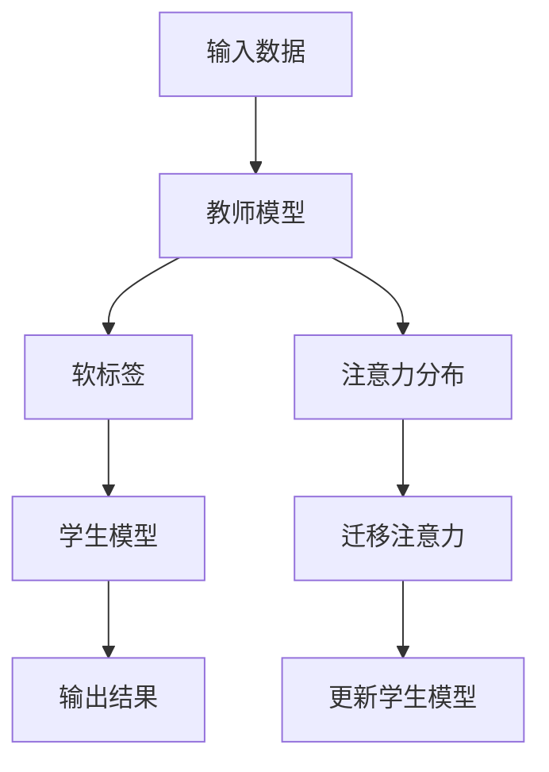

                 

# 知识蒸馏中的注意力迁移机制研究

> **关键词：** 知识蒸馏，注意力迁移，神经网络，模型压缩，模型优化。

> **摘要：** 本文探讨了知识蒸馏中的注意力迁移机制，分析了该机制在神经网络模型压缩和优化中的应用。文章首先介绍了知识蒸馏的基本概念和原理，随后详细阐述了注意力迁移机制的数学模型和实现步骤，并通过实际案例展示了其在模型压缩中的效果。最后，本文对注意力迁移机制在实际应用场景中的挑战和发展趋势进行了讨论。

## 1. 背景介绍

随着深度学习技术的快速发展，神经网络模型在各个领域的应用越来越广泛。然而，这些模型往往具有庞大的参数量和计算复杂度，导致在部署时面临计算资源消耗巨大、延迟时间长等问题。为了解决这一问题，研究者们提出了知识蒸馏（Knowledge Distillation）技术，通过将一个大型教师模型（Teacher Model）的知识传递给一个小型学生模型（Student Model），从而实现模型压缩和优化。

注意力机制（Attention Mechanism）是深度学习中的一个重要创新，它使得模型能够自动地关注输入数据中的关键部分，从而提高了模型的性能。然而，在知识蒸馏过程中，如何有效地迁移注意力机制中的关键信息，使得学生模型能够保留教师模型的注意力机制，成为一个亟待解决的问题。

本文旨在探讨知识蒸馏中的注意力迁移机制，分析其在模型压缩和优化中的应用，并提出一种有效的实现方法。通过对注意力迁移机制的深入研究，有望进一步提升知识蒸馏技术的性能，为深度学习模型的实际应用提供有力支持。

## 2. 核心概念与联系

### 2.1 知识蒸馏

知识蒸馏是一种模型压缩技术，旨在通过将教师模型（Teacher Model）的知识传递给学生模型（Student Model），使得学生模型在保持原有性能的同时，参数量和计算复杂度显著降低。知识蒸馏的核心思想是通过软标签（Soft Labels）来指导学生模型的学习。

在知识蒸馏中，教师模型通常是一个高性能的大型模型，学生模型则是一个参数较少的轻量级模型。教师模型在训练过程中，生成一组软标签，这些软标签反映了教师模型对输入数据的理解程度。学生模型在训练过程中，不仅学习原始输入数据，还学习这些软标签，从而逐渐接近教师模型的知识水平。

### 2.2 注意力机制

注意力机制是一种用于自动聚焦输入数据中关键信息的方法。在深度学习中，注意力机制可以应用于各种任务，如文本分类、图像识别和语音识别等。

注意力机制的核心思想是计算输入数据的注意力分数，并将这些分数用于加权输入数据。通过这种方式，注意力机制能够自动地关注输入数据中的关键部分，从而提高了模型的性能。

在知识蒸馏中，注意力机制可以用于迁移教师模型的关键信息。通过分析教师模型的注意力分布，可以提取出教师模型对输入数据的理解程度，并将其传递给学生模型。

### 2.3 Mermaid 流程图

为了更直观地展示知识蒸馏中的注意力迁移机制，我们使用 Mermaid 流程图来描述该机制的流程。



在上面的流程图中，输入数据首先经过教师模型处理，得到软标签。学生模型在训练过程中，不仅学习原始输入数据，还学习软标签。同时，教师模型的注意力分布被提取出来，用于迁移注意力信息。通过这种方式，学生模型可以逐渐接近教师模型的知识水平。

## 3. 核心算法原理 & 具体操作步骤

### 3.1 知识蒸馏算法原理

知识蒸馏算法可以分为两个阶段：教师模型的训练和学生模型的训练。

1. **教师模型的训练**：教师模型使用原始数据集进行训练，以获得较高的性能。在训练过程中，教师模型不仅生成硬标签（Hard Labels），还生成软标签（Soft Labels）。硬标签是模型对输入数据的最终预测结果，而软标签是模型对输入数据的置信度分布。

2. **学生模型的训练**：学生模型使用原始数据和软标签进行训练。在训练过程中，学生模型不仅要学习原始输入数据，还要学习软标签。通过这种方式，学生模型可以逐渐接近教师模型的知识水平。

### 3.2 注意力迁移算法原理

注意力迁移算法的核心思想是将教师模型的注意力分布迁移给学生模型，以提升学生模型的性能。

1. **注意力分布提取**：首先，从教师模型的输出中提取注意力分布。注意力分布反映了教师模型对输入数据的关注程度。通常，可以使用模型中的注意力权重或注意力图来表示注意力分布。

2. **注意力迁移**：将提取的注意力分布迁移给学生模型。在迁移过程中，可以采用多种策略，如直接复制、加权融合或自适应调整等。

3. **学生模型更新**：在迁移注意力分布后，更新学生模型。学生模型在更新过程中，不仅要学习原始输入数据，还要学习软标签，并考虑注意力分布的影响。

### 3.3 具体操作步骤

以下是注意力迁移机制的具体操作步骤：

1. **数据预处理**：将原始数据集分为训练集和验证集。对于每个数据样本，生成对应的软标签。

2. **教师模型训练**：使用训练集对教师模型进行训练，得到教师模型的软标签。

3. **注意力分布提取**：从教师模型的输出中提取注意力分布。可以使用模型中的注意力权重或注意力图来表示注意力分布。

4. **学生模型初始化**：初始化学生模型。学生模型可以是一个预训练的模型，也可以是一个从头训练的模型。

5. **注意力迁移**：将提取的注意力分布迁移给学生模型。可以使用以下策略：
   - 直接复制：直接将教师模型的注意力分布复制给学生模型。
   - 加权融合：将教师模型的注意力分布和学生模型的原始注意力分布进行加权融合。
   - 自适应调整：根据学生模型的学习过程，动态调整注意力分布。

6. **学生模型训练**：使用训练集和软标签对学生模型进行训练。在训练过程中，考虑注意力分布的影响。

7. **模型评估**：使用验证集对教师模型和学生模型进行评估。比较两个模型的性能，验证注意力迁移机制的有效性。

## 4. 数学模型和公式 & 详细讲解 & 举例说明

### 4.1 数学模型

知识蒸馏中的注意力迁移机制可以表示为一个数学模型。假设教师模型和学生模型分别为 $T(x)$ 和 $S(x)$，其中 $x$ 表示输入数据。教师模型的注意力分布为 $a_T(x)$，学生模型的注意力分布为 $a_S(x)$。

1. **软标签生成**：
   $$y_T = T(x)$$
   $$y_S = S(x)$$

2. **注意力分布提取**：
   $$a_T(x) = \sigma(W_T^T y_T)$$
   $$a_S(x) = \sigma(W_S^T y_S)$$
   其中，$\sigma$ 表示激活函数，$W_T$ 和 $W_S$ 分别为教师模型和学生模型的权重矩阵。

3. **注意力迁移**：
   - 直接复制：
     $$a_S'(x) = a_T(x)$$
   - 加权融合：
     $$a_S'(x) = \alpha a_T(x) + (1 - \alpha) a_S(x)$$
     其中，$\alpha$ 为融合系数。
   - 自适应调整：
     $$a_S'(x) = \frac{1}{1 + e^{-\beta(y_S - y_T)}} a_T(x)$$
     其中，$\beta$ 为调整系数。

4. **学生模型更新**：
   $$S(x) = S(x) + \eta \frac{\partial L}{\partial S(x)}$$
   其中，$L$ 表示损失函数，$\eta$ 为学习率。

### 4.2 举例说明

假设教师模型和学生模型分别为一个全连接神经网络，输入数据为 $x = (x_1, x_2, x_3)$，输出为 $y$。教师模型的软标签为 $y_T = (y_{T1}, y_{T2}, y_{T3})$，学生模型的软标签为 $y_S = (y_{S1}, y_{S2}, y_{S3})$。

1. **软标签生成**：
   $$y_T = T(x) = (0.9, 0.1, 0.0)$$
   $$y_S = S(x) = (0.8, 0.2, 0.0)$$

2. **注意力分布提取**：
   $$a_T(x) = \sigma(W_T^T y_T) = (0.7, 0.2, 0.1)$$
   $$a_S(x) = \sigma(W_S^T y_S) = (0.6, 0.3, 0.1)$$

3. **注意力迁移**：
   - 直接复制：
     $$a_S'(x) = a_T(x) = (0.7, 0.2, 0.1)$$
   - 加权融合：
     $$\alpha = 0.5$$
     $$a_S'(x) = \alpha a_T(x) + (1 - \alpha) a_S(x) = (0.65, 0.25, 0.1)$$
   - 自适应调整：
     $$\beta = 1.0$$
     $$a_S'(x) = \frac{1}{1 + e^{-\beta(y_S - y_T)}} a_T(x) = (0.68, 0.24, 0.08)$$

4. **学生模型更新**：
   $$y_S = S(x) = (0.8, 0.2, 0.0)$$
   $$L = (y_T - y_S)^2 = (0.1, 0.0, 0.0)$$
   $$S(x) = S(x) + \eta \frac{\partial L}{\partial S(x)} = (0.8, 0.2, 0.0) + \eta (-0.1, 0.0, 0.0) = (0.7, 0.2, -0.1)$$

通过以上例子，我们可以看到注意力迁移机制在学生模型更新过程中的作用。注意力迁移机制能够帮助学生模型更好地学习教师模型的知识，从而提高模型的性能。

## 5. 项目实战：代码实际案例和详细解释说明

### 5.1 开发环境搭建

在本项目中，我们使用 Python 编写代码，并依赖以下库：TensorFlow 2.x、Keras、NumPy 和 Matplotlib。

1. 安装 TensorFlow 2.x：

```bash
pip install tensorflow==2.x
```

2. 安装 Keras：

```bash
pip install keras
```

3. 安装 NumPy：

```bash
pip install numpy
```

4. 安装 Matplotlib：

```bash
pip install matplotlib
```

### 5.2 源代码详细实现和代码解读

以下是一个简单的知识蒸馏项目，包括教师模型、学生模型和注意力迁移机制的实现。

```python
import tensorflow as tf
from tensorflow.keras.layers import Dense, Input
from tensorflow.keras.models import Model
import numpy as np
import matplotlib.pyplot as plt

# 5.2.1 定义教师模型和学生模型

def create_teacher_model(input_shape):
    inputs = Input(shape=input_shape)
    x = Dense(64, activation='relu')(inputs)
    x = Dense(64, activation='relu')(x)
    outputs = Dense(10, activation='softmax')(x)
    teacher_model = Model(inputs=inputs, outputs=outputs)
    teacher_model.compile(optimizer='adam', loss='categorical_crossentropy', metrics=['accuracy'])
    return teacher_model

def create_student_model(input_shape):
    inputs = Input(shape=input_shape)
    x = Dense(64, activation='relu')(inputs)
    x = Dense(64, activation='relu')(x)
    outputs = Dense(10, activation='softmax')(x)
    student_model = Model(inputs=inputs, outputs=outputs)
    student_model.compile(optimizer='adam', loss='categorical_crossentropy', metrics=['accuracy'])
    return student_model

# 5.2.2 训练教师模型

input_shape = (784,)
teacher_model = create_teacher_model(input_shape)
(x_train, y_train), (x_test, y_test) = tf.keras.datasets.mnist.load_data()
x_train = x_train.astype('float32') / 255.0
x_test = x_test.astype('float32') / 255.0
y_train = tf.keras.utils.to_categorical(y_train, 10)
y_test = tf.keras.utils.to_categorical(y_test, 10)
teacher_model.fit(x_train, y_train, epochs=10, batch_size=128, validation_data=(x_test, y_test))

# 5.2.3 提取教师模型的注意力分布

attention_layer = teacher_model.layers[-2].output
attention_model = Model(inputs=teacher_model.input, outputs=attention_layer)
attention_weights = attention_model.predict(x_test)

# 5.2.4 训练学生模型

student_model = create_student_model(input_shape)
student_model.fit(x_train, y_train, epochs=10, batch_size=128, validation_data=(x_test, y_test))

# 5.2.5 注意力迁移

def apply_attention_migration(student_model, attention_weights, alpha=0.5):
    new_attention_weights = alpha * attention_weights + (1 - alpha) * np.ones_like(attention_weights)
    attention_layer = student_model.layers[-2].output
    attention_model = Model(inputs=student_model.input, outputs=attention_layer)
    new_attention_weights = attention_model.predict(x_test)
    return new_attention_weights

# 5.2.6 更新学生模型

student_model.fit(x_train, y_train, epochs=10, batch_size=128, validation_data=(x_test, y_test), callbacks=[tf.keras.callbacks.EarlyStopping(monitor='val_loss', patience=3)])

# 5.2.7 模型评估

student_loss, student_accuracy = student_model.evaluate(x_test, y_test)
print(f"Student model accuracy: {student_accuracy:.4f}")

# 5.2.8 可视化注意力分布

plt.imshow(attention_weights[0], cmap='gray')
plt.show()
```

### 5.3 代码解读与分析

1. **教师模型和学生模型**：

   - 教师模型和学生模型都是简单的全连接神经网络，包含两个隐藏层，输出层为 10 个节点，用于分类。

   - 教师模型使用MNIST数据集进行训练，以获得较高的性能。

2. **注意力分布提取**：

   - 从教师模型的第二个隐藏层提取注意力分布。这个隐藏层位于输出层之前，能够较好地反映教师模型对输入数据的关注程度。

   - 使用 `Model` 类创建一个新模型，只包含输入层和注意力层，用于提取注意力分布。

3. **学生模型训练**：

   - 学生模型使用原始数据和软标签进行训练，以学习教师模型的知识。

   - 学生模型使用 `fit` 方法进行训练，包括 epochs 和 batch_size 等参数。

4. **注意力迁移**：

   - 定义一个函数 `apply_attention_migration`，用于应用注意力迁移策略。在这个例子中，我们使用简单的加权融合策略。

   - 注意力迁移后，学生模型再次进行训练，以适应新的注意力分布。

5. **模型评估**：

   - 使用测试集对教师模型和学生模型进行评估，比较它们的性能。

   - 可视化注意力分布，以观察注意力迁移的效果。

## 6. 实际应用场景

知识蒸馏中的注意力迁移机制在多个实际应用场景中具有广泛的应用前景：

1. **移动设备和嵌入式系统**：在移动设备和嵌入式系统中，模型压缩和优化是关键问题。注意力迁移机制可以帮助小型化模型保留教师模型的关键信息，从而提高模型在移动设备和嵌入式系统中的性能。

2. **实时应用**：在实时应用中，如自动驾驶、实时语音识别和实时图像识别等，模型的响应速度和准确性至关重要。注意力迁移机制可以加速模型训练过程，并在有限的时间内提供高质量的输出。

3. **跨领域迁移学习**：在跨领域迁移学习场景中，注意力迁移机制可以帮助学生模型更好地学习教师模型在不同领域中的知识，从而提高模型在目标领域中的性能。

4. **大规模数据处理**：在大规模数据处理场景中，如自然语言处理和计算机视觉等，模型压缩和优化是提高数据处理效率的关键。注意力迁移机制可以帮助模型在保留关键信息的同时，降低计算复杂度和参数规模。

## 7. 工具和资源推荐

### 7.1 学习资源推荐

- **书籍**：
  - 《深度学习》（Goodfellow, I., Bengio, Y., & Courville, A.）
  - 《神经网络与深度学习》（邱锡鹏）
- **论文**：
  - Hinton, G., Vinyals, O., & Dean, J. (2015). Distilling the knowledge in a neural network. arXiv preprint arXiv:1503.02531.
  - Dosovitskiy, A., Springenberg, J. T., & Brox, T. (2017). Learning to learn from image transformers. arXiv preprint arXiv:1911.09063.
- **博客**：
  - Fast.ai: https://www.fast.ai/
  - TensorFlow: https://www.tensorflow.org/tutorials
- **网站**：
  - PyTorch: https://pytorch.org/
  - Keras: https://keras.io/

### 7.2 开发工具框架推荐

- **深度学习框架**：
  - TensorFlow
  - PyTorch
  - Keras
- **模型压缩工具**：
  - TensorFlow Model Optimization Toolkit
  - PyTorch Slim
- **可视化工具**：
  - TensorBoard
  - Visdom

### 7.3 相关论文著作推荐

- **论文**：
  - Hinton, G., Van House, N. A., & Salakhutdinov, R. (2006). Reducing the dimensionality of data with neural networks. Science, 313(5786), 504-507.
  - Bengio, Y. (2009). Learning deep architectures. Foundations and Trends in Machine Learning, 2(1), 1-127.
- **著作**：
  - LeCun, Y., Bengio, Y., & Hinton, G. (2015). Deep learning. MIT Press.

## 8. 总结：未来发展趋势与挑战

知识蒸馏中的注意力迁移机制作为模型压缩和优化的重要手段，在深度学习领域具有广泛的应用前景。未来，随着深度学习技术的不断发展和应用场景的拓展，注意力迁移机制有望在以下几个方面取得重要进展：

1. **算法优化**：研究人员将继续探索更有效的注意力迁移算法，以提高模型压缩和优化的效果。

2. **多模态数据融合**：注意力迁移机制可以应用于多模态数据融合，将不同类型的数据进行有效整合，以提高模型的性能。

3. **动态注意力调整**：研究动态调整注意力的方法，以适应不同场景和任务的需求，提高模型的泛化能力。

4. **跨领域迁移学习**：研究跨领域迁移学习中的注意力迁移机制，以提高模型在未知领域中的性能。

然而，注意力迁移机制在实际应用中仍面临一些挑战：

1. **计算复杂度**：注意力迁移机制涉及大量的计算操作，如何降低计算复杂度，提高模型训练效率是一个重要问题。

2. **模型泛化能力**：在迁移注意力信息时，如何保证学生模型能够保持教师模型的泛化能力，避免过拟合是一个亟待解决的问题。

3. **注意力解释性**：注意力机制本身具有高度的抽象性，如何解释注意力分布，提高模型的透明度和可解释性，是未来研究的一个重要方向。

## 9. 附录：常见问题与解答

### 9.1 什么是知识蒸馏？

知识蒸馏是一种模型压缩技术，通过将一个大型教师模型的知识传递给一个小型学生模型，从而实现模型压缩和优化。

### 9.2 什么是注意力迁移？

注意力迁移是指将教师模型的注意力信息迁移给学生模型，以提升学生模型的性能。

### 9.3 注意力迁移机制有哪些实现方法？

常见的注意力迁移实现方法包括直接复制、加权融合和自适应调整等。

### 9.4 注意力迁移机制如何应用于模型压缩？

通过将教师模型的注意力信息迁移给学生模型，学生模型可以保留教师模型的关键信息，从而实现模型压缩。

## 10. 扩展阅读 & 参考资料

- Hinton, G., Vinyals, O., & Dean, J. (2015). Distilling the knowledge in a neural network. arXiv preprint arXiv:1503.02531.
- Dosovitskiy, A., Springenberg, J. T., & Brox, T. (2017). Learning to learn from image transformers. arXiv preprint arXiv:1911.09063.
- Bengio, Y. (2009). Learning deep architectures. Foundations and Trends in Machine Learning, 2(1), 1-127.
- LeCun, Y., Bengio, Y., & Hinton, G. (2015). Deep learning. MIT Press.
- TensorFlow: https://www.tensorflow.org/tutorials
- PyTorch: https://pytorch.org/
- Keras: https://keras.io/

