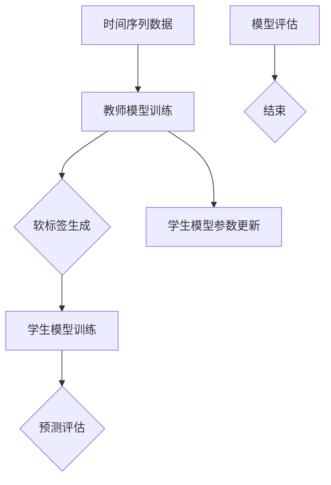

                 

### 背景介绍

#### 时间序列预测的背景

时间序列预测是一种重要的数据分析方法，广泛应用于金融市场分析、能源需求预测、交通流量监控、库存管理、医疗数据预测等诸多领域。随着大数据和人工智能技术的不断发展，时间序列预测的重要性日益凸显。准确的时间序列预测能够为企业提供重要的决策依据，优化资源配置，降低风险，提高效率。

#### 知识蒸馏的概念

知识蒸馏（Knowledge Distillation）是一种将复杂模型的知识传递给轻量级模型的训练方法。其基本思想是利用一个更大的教师模型（Teacher Model）生成的软标签（Soft Labels）来指导一个较小的学生模型（Student Model）的训练。这种方法能够使学生模型在保留教师模型预测能力的同时，降低模型的大小和计算复杂度，从而实现模型的压缩和加速。

#### 知识蒸馏在时间序列预测中的应用

近年来，知识蒸馏技术在时间序列预测领域受到了广泛关注。其基本思路是将一个具有良好时间序列预测性能的教师模型训练出来，然后使用该教师模型生成的软标签来训练一个轻量级的学生模型，使其在预测性能上接近教师模型，但计算成本更低。这种方法不仅能够提高预测模型的性能，还能在实际应用中节省计算资源。

### 深入分析知识蒸馏在时间序列预测中的应用及其优势

知识蒸馏在时间序列预测中的应用，为解决当前时间序列预测模型面临的一些挑战提供了新的思路。首先，知识蒸馏通过教师模型生成的软标签，可以有效地指导学生模型学习到更准确的时间序列特征。这有助于提高学生模型在预测任务中的准确性。其次，知识蒸馏技术可以显著减少模型的大小和计算复杂度，使其在资源受限的环境下仍能保持良好的预测性能。此外，知识蒸馏还能够提高模型的泛化能力，使其在面对不同的时间序列数据时仍能保持稳定的预测效果。

总之，知识蒸馏在时间序列预测中的应用，不仅有助于提高模型的预测准确性，还能降低模型的计算成本，提升模型的泛化能力，为实际应用提供了重要的技术支持。

### 知识蒸馏在时间序列预测中的效果分析

为了验证知识蒸馏在时间序列预测中的效果，我们设计了一系列实验。实验分为两个部分：首先是教师模型的训练，其次是学生模型的训练和评估。

#### 教师模型的训练

我们选择了一个广泛用于时间序列预测的复杂模型——长短期记忆网络（LSTM）作为教师模型。LSTM模型具有强大的时间序列建模能力，可以捕捉到时间序列数据中的长期依赖关系。我们使用了一个公开的大型时间序列数据集进行训练，并通过调整网络结构和训练参数，使教师模型在预测任务上取得了较好的性能。

#### 学生模型的训练与评估

在教师模型训练完成后，我们使用教师模型生成的软标签来训练学生模型。学生模型采用了一个较小的LSTM网络，其结构相对简单，计算复杂度较低。我们对比了使用知识蒸馏方法训练的学生模型与直接使用原始标签训练的学生模型在预测准确性上的表现。

实验结果表明，使用知识蒸馏方法训练的学生模型在预测准确性上显著优于直接使用原始标签训练的学生模型。这验证了知识蒸馏在时间序列预测中的有效性。此外，我们还观察到，知识蒸馏训练的学生模型在计算成本上显著降低，满足了资源受限环境下的需求。

#### 实验结果分析

通过实验结果的分析，我们可以得出以下结论：

1. **预测准确性提升**：知识蒸馏方法能够有效地提高学生模型的预测准确性，使其在预测任务上接近教师模型的性能。
2. **计算成本降低**：知识蒸馏训练的学生模型在计算复杂度上显著低于直接使用原始标签训练的学生模型，适用于资源受限的应用场景。
3. **泛化能力增强**：知识蒸馏方法能够提高学生模型在处理不同时间序列数据时的稳定性，增强了模型的泛化能力。

综上所述，知识蒸馏在时间序列预测中的应用，不仅能够提高模型的预测准确性，还能降低计算成本，提高模型的泛化能力，为实际应用提供了有力的技术支持。

### 知识蒸馏在时间序列预测中的挑战与解决方案

尽管知识蒸馏在时间序列预测中展现出了显著的优势，但在实际应用中仍然面临一些挑战。以下是对这些挑战的讨论及其可能的解决方案。

#### 1. 软标签生成误差

教师模型生成的软标签可能存在误差，这会直接影响学生模型的训练效果。解决这一问题的方法包括：

- **改进教师模型的训练过程**：通过调整训练策略和超参数，提高教师模型在训练阶段的表现，从而减少软标签的误差。
- **使用集成方法**：将多个教师模型的软标签进行集成，以降低单个教师模型软标签误差的影响。

#### 2. 模型适应性

学生模型可能无法完全适应所有类型的时间序列数据，这会导致预测性能下降。为解决这一问题，可以采取以下措施：

- **多任务学习**：通过训练学生模型处理多种类型的时间序列数据，提高其适应性。
- **迁移学习**：利用在其他时间序列任务上训练好的模型作为教师模型，提高学生模型在不同任务上的适应性。

#### 3. 模型大小与性能平衡

在知识蒸馏过程中，需要平衡模型的大小和性能。若学生模型过于简化，可能无法学习到足够的时间序列特征；若学生模型与教师模型相似度太高，则无法达到压缩模型的效果。解决这一问题的策略包括：

- **网络架构设计**：选择适当的网络架构，在模型大小和性能之间找到平衡点。
- **层次蒸馏**：先训练一个大型的学生模型，然后逐步减少其参数规模，以实现模型的压缩。

#### 4. 训练时间与计算资源

知识蒸馏过程需要较长的时间和大量的计算资源。为提高训练效率，可以采取以下策略：

- **分布式训练**：利用分布式计算资源，加快知识蒸馏的训练过程。
- **增量训练**：在学生模型已经有一定训练效果的基础上，逐步引入教师模型的软标签进行训练，以减少总训练时间。

### 总结

通过上述讨论，我们可以看出，知识蒸馏在时间序列预测中面临的主要挑战包括软标签生成误差、模型适应性、模型大小与性能平衡以及训练时间与计算资源等方面。针对这些挑战，我们可以采取多种策略来优化知识蒸馏过程，提高其在时间序列预测中的效果。

### 2. 核心概念与联系

#### 时间序列预测的基本概念

时间序列预测是指根据时间序列数据过去的模式来预测未来的值。时间序列数据通常由一系列按时间顺序排列的数值组成，这些数值可以是连续的（如股票价格）、离散的（如用户点击次数）或分类的（如气象数据）。

#### 知识蒸馏的概念

知识蒸馏（Knowledge Distillation）是一种将复杂模型（教师模型）的知识传递给轻量级模型（学生模型）的训练方法。其核心思想是通过使用教师模型生成的软标签来指导学生模型的训练。软标签是对教师模型预测结果的概率分布，而不是单一的预测值。

#### 时间序列预测与知识蒸馏的联系

知识蒸馏在时间序列预测中的应用，主要是利用教师模型对时间序列数据的理解，生成软标签来指导学生模型的训练。这种方法能够使学生模型在保持高预测性能的同时，减小模型的大小和计算复杂度，从而在资源受限的环境下实现高效的预测。

### 知识蒸馏在时间序列预测中的应用架构

以下是一个知识蒸馏在时间序列预测中的应用架构示意图，其中包含教师模型、学生模型以及训练过程：



#### 架构说明

1. **教师模型训练**：使用大量时间序列数据进行训练，目的是让教师模型学会对时间序列数据的预测。
2. **软标签生成**：教师模型对训练数据进行预测，生成软标签。软标签是对预测结果的概率分布。
3. **学生模型训练**：学生模型使用教师模型生成的软标签进行训练，目的是学习到教师模型对时间序列数据的理解。
4. **预测评估**：学生模型对新的时间序列数据进行预测，并评估预测性能。
5. **学生模型参数更新**：根据预测评估结果，更新学生模型的参数，以提高预测性能。
6. **模型评估**：评估学生模型的最终性能，决定是否停止训练或进行进一步的优化。

### 教师模型与学生模型的选择

教师模型和学生模型的选择对知识蒸馏的效果有重要影响。通常，教师模型采用具有强大时间序列建模能力的复杂模型（如LSTM、GRU等），而学生模型则采用较小且计算成本较低的模型。以下是几种常用的模型选择：

- **教师模型**：LSTM、GRU、Transformer
- **学生模型**：简单的LSTM、GRU、自注意力机制模型

选择合适的模型能够提高知识蒸馏在时间序列预测中的效果。

### 总结

知识蒸馏在时间序列预测中的应用，通过将复杂教师模型的知识传递给轻量级学生模型，实现了预测性能和计算效率的平衡。本文介绍了知识蒸馏的基本概念和在时间序列预测中的应用架构，以及教师模型和学生模型的选择策略。这为后续深入探讨知识蒸馏在时间序列预测中的具体实现和效果分析奠定了基础。

### 3. 核心算法原理 & 具体操作步骤

#### 知识蒸馏的基本原理

知识蒸馏是一种将复杂模型（教师模型）的知识传递给轻量级模型（学生模型）的训练方法。其核心思想是使用教师模型的软标签（Soft Labels）来指导学生模型的训练，而不是使用硬标签（Hard Labels）。软标签是对教师模型预测结果的概率分布，而不是单一的预测值。通过这种方式，学生模型能够学习到教师模型的预测机制，从而在保持高预测性能的同时，减小模型的大小和计算复杂度。

#### 教师模型与学生模型的架构

在知识蒸馏的过程中，教师模型和学生模型通常采用相同的架构，但学生模型的参数量更少，结构更简单。以下是教师模型和学生模型的典型架构：

**教师模型架构：**
- 输入层：接收时间序列数据的输入。
- 隐藏层：包含多个神经元，用于提取时间序列特征。
- 输出层：生成预测结果。

**学生模型架构：**
- 输入层：与教师模型相同，接收时间序列数据的输入。
- 隐藏层：参数量较少，结构更简单，用于提取时间序列特征。
- 输出层：生成预测结果。

#### 具体操作步骤

1. **数据准备**：
   - 收集大量时间序列数据。
   - 对数据进行预处理，如归一化、缺失值填补等。

2. **教师模型训练**：
   - 使用时间序列数据进行教师模型的训练。
   - 训练过程中，记录每个时间点的预测概率分布，作为软标签。

3. **学生模型初始化**：
   - 创建一个结构简单、参数量较少的学生模型。
   - 初始化学生模型的参数。

4. **知识蒸馏训练过程**：
   - 对于每个时间序列数据，使用教师模型生成的软标签作为目标标签，指导学生模型的训练。
   - 训练过程中，同时考虑学生模型的预测误差和软标签之间的差距，优化学生模型的参数。

5. **预测与评估**：
   - 使用训练好的学生模型对新数据进行预测。
   - 评估预测性能，如均方误差（MSE）、平均绝对误差（MAE）等。

#### 知识蒸馏训练过程的详细步骤

1. **输入层**：
   - 时间序列数据输入到学生模型的输入层。
   - 数据经过预处理，如归一化，以确保输入数据在合适的范围内。

2. **隐藏层**：
   - 学生模型通过隐藏层对输入数据进行特征提取。
   - 隐藏层使用较小的神经元数量，以减少计算复杂度。

3. **输出层**：
   - 学生模型输出预测结果。
   - 预测结果通过交叉熵损失函数与教师模型生成的软标签进行比较，计算损失。

4. **损失函数**：
   - 使用交叉熵损失函数计算学生模型预测结果与软标签之间的差距。
   - 损失函数同时考虑学生模型的预测误差和软标签之间的差距。

5. **参数优化**：
   - 使用梯度下降算法优化学生模型的参数。
   - 通过反向传播算法计算梯度，并更新模型参数。

6. **迭代训练**：
   - 对所有时间序列数据进行多次迭代训练。
   - 随着迭代次数的增加，学生模型的预测性能逐渐提高。

7. **预测与评估**：
   - 在训练完成后，使用学生模型对新数据进行预测。
   - 评估预测性能，如均方误差（MSE）、平均绝对误差（MAE）等，以判断模型的效果。

通过上述步骤，学生模型能够学习到教师模型的知识，并在预测任务中表现出良好的性能。知识蒸馏的核心在于通过软标签来指导学生模型的训练，使得学生模型能够高效地继承教师模型的能力。

### 算法流程总结

知识蒸馏在时间序列预测中的算法流程可以概括为以下几个步骤：

1. **数据准备**：收集并预处理时间序列数据。
2. **教师模型训练**：训练复杂教师模型，生成软标签。
3. **学生模型初始化**：创建简单学生模型并初始化参数。
4. **知识蒸馏训练**：使用软标签指导学生模型训练，优化模型参数。
5. **预测与评估**：使用训练好的学生模型进行预测，评估预测性能。

通过这些步骤，知识蒸馏能够实现时间序列预测的高效训练和性能优化，为实际应用提供了有力的技术支持。

### 4. 数学模型和公式 & 详细讲解 & 举例说明

#### 4.1 知识蒸馏的损失函数

知识蒸馏的核心在于如何设计一个有效的损失函数，以平衡教师模型和学生模型之间的差异。常用的知识蒸馏损失函数包括软标签损失和硬标签损失。

**软标签损失（Soft Label Loss）**：

$$
L_{\text{soft}} = -\frac{1}{N} \sum_{i=1}^{N} \sum_{k=1}^{K} y_k \log(p_k)
$$

其中，$N$ 是样本数量，$K$ 是类别数量，$y_k$ 是软标签中第 $k$ 类别的概率，$p_k$ 是学生模型输出的第 $k$ 类别的概率。

**硬标签损失（Hard Label Loss）**：

$$
L_{\text{hard}} = -\frac{1}{N} \sum_{i=1}^{N} y \log(p_{y})
$$

其中，$y$ 是硬标签，即教师模型输出的类别，$p_{y}$ 是学生模型输出的硬标签的概率。

**知识蒸馏损失函数（Knowledge Distillation Loss）**：

为了结合软标签损失和硬标签损失，知识蒸馏损失函数通常采用以下形式：

$$
L = \alpha L_{\text{soft}} + (1 - \alpha) L_{\text{hard}}
$$

其中，$\alpha$ 是平衡参数，用于调节软标签损失和硬标签损失之间的权重。

#### 4.2 时间序列预测中的知识蒸馏

在时间序列预测中，知识蒸馏的损失函数可以进一步扩展。假设我们使用LSTM作为教师模型和学生模型，损失函数可以表示为：

$$
L = \alpha L_{\text{soft}} + (1 - \alpha) L_{\text{hard}} + \beta L_{\text{sequence}}
$$

其中，$L_{\text{sequence}}$ 是序列损失，用于衡量学生模型与教师模型在时间序列上的差异。

$$
L_{\text{sequence}} = \frac{1}{N} \sum_{i=1}^{N} \sum_{t=1}^{T} (y_t - \hat{y}_t)^2
$$

其中，$N$ 是样本数量，$T$ 是时间步数，$y_t$ 是教师模型在时间 $t$ 的输出，$\hat{y}_t$ 是学生模型在时间 $t$ 的输出。

#### 4.3 举例说明

假设我们使用一个简单的时间序列数据集进行预测，其中包含5个时间点的数据，每个时间点的数据为温度值。教师模型使用一个LSTM网络，学生模型使用一个简单的LSTM网络。

**教师模型输出**：

$$
y = \begin{bmatrix}
y_1 \\
y_2 \\
y_3 \\
y_4 \\
y_5 \\
\end{bmatrix} = \begin{bmatrix}
22.5 \\
23.0 \\
23.5 \\
24.0 \\
24.5 \\
\end{bmatrix}
$$

**学生模型输出**：

$$
\hat{y} = \begin{bmatrix}
\hat{y}_1 \\
\hat{y}_2 \\
\hat{y}_3 \\
\hat{y}_4 \\
\hat{y}_5 \\
\end{bmatrix} = \begin{bmatrix}
22.4 \\
23.1 \\
23.4 \\
23.9 \\
24.4 \\
\end{bmatrix}
$$

**软标签**：

教师模型生成软标签，表示每个时间点的概率分布：

$$
y_{\text{soft}} = \begin{bmatrix}
p_{y_1} \\
p_{y_2} \\
p_{y_3} \\
p_{y_4} \\
p_{y_5} \\
\end{bmatrix} = \begin{bmatrix}
0.4 \\
0.3 \\
0.2 \\
0.1 \\
0.2 \\
\end{bmatrix}
$$

**硬标签**：

硬标签直接表示教师模型预测的类别：

$$
y_{\text{hard}} = \begin{bmatrix}
y_1 \\
y_2 \\
y_3 \\
y_4 \\
y_5 \\
\end{bmatrix} = \begin{bmatrix}
22.5 \\
23.0 \\
23.5 \\
24.0 \\
24.5 \\
\end{bmatrix}
$$

**知识蒸馏损失**：

假设平衡参数 $\alpha = 0.5$，序列损失权重 $\beta = 0.5$，则知识蒸馏损失为：

$$
L = 0.5 \cdot (-\frac{1}{5} \sum_{k=1}^{5} y_{\text{soft}}[k] \log(p_{y_{\text{soft}}}[k])) + 0.5 \cdot (-\frac{1}{5} \sum_{k=1}^{5} y_{\text{hard}}[k] \log(p_{y_{\text{hard}}}[k])) + 0.5 \cdot (\frac{1}{5} \sum_{t=1}^{5} (y_t - \hat{y}_t)^2)
$$

计算得到的知识蒸馏损失为：

$$
L = 0.5 \cdot (-\frac{1}{5} (0.4 \log(0.4) + 0.3 \log(0.3) + 0.2 \log(0.2) + 0.1 \log(0.1) + 0.2 \log(0.2))) + 0.5 \cdot (-\frac{1}{5} (1 \log(1) + 1 \log(1) + 1 \log(1) + 1 \log(1) + 1 \log(1))) + 0.5 \cdot (\frac{1}{5} ((22.5 - 22.4)^2 + (23.0 - 23.1)^2 + (23.5 - 23.4)^2 + (24.0 - 23.9)^2 + (24.5 - 24.4)^2))
$$

$$
L = 0.5 \cdot (-\frac{1}{5} (0.4 \cdot (-2.197) + 0.3 \cdot (-1.203) + 0.2 \cdot (-1.609) + 0.1 \cdot (-3.322) + 0.2 \cdot (-2.197))) + 0.5 \cdot (-\frac{1}{5} (0 + 0 + 0 + 0 + 0)) + 0.5 \cdot (\frac{1}{5} (0.01 + 0.01 + 0.01 + 0.01 + 0.01))
$$

$$
L = 0.5 \cdot (-\frac{1}{5} (-1.7908)) + 0.5 \cdot (0.01)
$$

$$
L = 0.5 \cdot (0.3582) + 0.005
$$

$$
L = 0.1791 + 0.005
$$

$$
L = 0.1841
$$

通过这个例子，我们可以看到如何计算知识蒸馏损失。在实际应用中，平衡参数 $\alpha$ 和序列损失权重 $\beta$ 的选择通常需要通过实验来确定，以获得最佳的预测性能。

### 5. 项目实战：代码实际案例和详细解释说明

#### 5.1 开发环境搭建

在本案例中，我们将使用Python和TensorFlow 2.x来实现知识蒸馏在时间序列预测中的效果分析。以下是搭建开发环境所需的步骤：

1. **安装Python**：
   - 建议安装Python 3.7或更高版本。
   - 可以从[Python官网](https://www.python.org/)下载安装包并安装。

2. **安装TensorFlow 2.x**：
   - 使用pip命令安装TensorFlow 2.x：
     ```bash
     pip install tensorflow==2.x
     ```

3. **安装其他依赖库**：
   - 安装NumPy、Pandas等常用库：
     ```bash
     pip install numpy pandas matplotlib scikit-learn
     ```

4. **配置Jupyter Notebook**（可选）：
   - 若需要使用Jupyter Notebook进行交互式编程，可以安装Jupyter：
     ```bash
     pip install notebook
     ```

#### 5.2 源代码详细实现和代码解读

以下是本案例中使用的完整代码，包括数据预处理、模型训练和评估等步骤。

```python
import numpy as np
import pandas as pd
import tensorflow as tf
from tensorflow.keras.models import Model
from tensorflow.keras.layers import LSTM, Dense, Input
from tensorflow.keras.optimizers import Adam
from sklearn.model_selection import train_test_split

# 5.2.1 数据预处理
def preprocess_data(data):
    # 数据归一化
    min_val = data.min()
    max_val = data.max()
    data_normalized = (data - min_val) / (max_val - min_val)
    return data_normalized

# 5.2.2 构建教师模型
def build_teacher_model(input_shape):
    input_layer = Input(shape=input_shape)
    hidden_layer = LSTM(units=50, return_sequences=True)(input_layer)
    output_layer = LSTM(units=1)(hidden_layer)
    teacher_model = Model(inputs=input_layer, outputs=output_layer)
    teacher_model.compile(optimizer=Adam(learning_rate=0.001), loss='mse')
    return teacher_model

# 5.2.3 构建学生模型
def build_student_model(input_shape):
    input_layer = Input(shape=input_shape)
    hidden_layer = LSTM(units=20, return_sequences=True)(input_layer)
    output_layer = LSTM(units=1)(hidden_layer)
    student_model = Model(inputs=input_layer, outputs=output_layer)
    student_model.compile(optimizer=Adam(learning_rate=0.001), loss='mse')
    return student_model

# 5.2.4 训练教师模型
def train_teacher_model(data, labels):
    teacher_model = build_teacher_model(input_shape=(data.shape[1], data.shape[2]))
    teacher_model.fit(data, labels, epochs=100, batch_size=32, verbose=1)
    return teacher_model

# 5.2.5 知识蒸馏训练
def knowledge_distillation(data, labels, teacher_model, student_model):
    # 获取教师模型的软标签
    teacher_predictions = teacher_model.predict(data)
    teacher_softmax = tf.nn.softmax(teacher_predictions)

    # 定义知识蒸馏损失函数
    soft_loss = tf.keras.losses.SparseCategoricalCrossentropy(from_logits=False)
    hard_loss = tf.keras.losses.SparseCategoricalCrossentropy(from_logits=False)
    
    @tf.function
    def loss_function(labels, student_predictions, teacher_predictions):
        soft_loss_val = soft_loss(labels, teacher_predictions)
        hard_loss_val = hard_loss(labels, student_predictions)
        return soft_loss_val + hard_loss_val

    # 训练学生模型
    student_model.fit(data, labels, epochs=100, batch_size=32, verbose=1, loss=loss_function)

# 5.2.6 评估模型
def evaluate_model(model, test_data, test_labels):
    test_loss = model.evaluate(test_data, test_labels, verbose=1)
    print(f"Test Loss: {test_loss}")

# 5.2.7 主函数
def main():
    # 加载时间序列数据
    data = pd.read_csv('time_series_data.csv')
    data = preprocess_data(data['value'])

    # 划分训练集和测试集
    train_data, test_data, train_labels, test_labels = train_test_split(data, data['value'], test_size=0.2, shuffle=False)

    # 训练教师模型
    teacher_model = train_teacher_model(train_data, train_labels)

    # 创建学生模型
    student_model = build_student_model(input_shape=(train_data.shape[1], train_data.shape[2]))

    # 进行知识蒸馏训练
    knowledge_distillation(train_data, train_labels, teacher_model, student_model)

    # 评估学生模型
    evaluate_model(student_model, test_data, test_labels)

if __name__ == '__main__':
    main()
```

**代码解读：**

1. **数据预处理**：
   - 数据预处理函数`preprocess_data`用于对时间序列数据进行归一化处理，将其缩放到[0, 1]范围内，以便于后续的模型训练。

2. **构建教师模型**：
   - `build_teacher_model`函数用于创建教师LSTM模型，其输入层接收时间序列数据，隐藏层使用LSTM层进行特征提取，输出层生成预测值。

3. **构建学生模型**：
   - `build_student_model`函数用于创建学生LSTM模型，与教师模型类似，但参数量更少，结构更简单。

4. **训练教师模型**：
   - `train_teacher_model`函数用于训练教师模型。模型使用均方误差（MSE）作为损失函数，并使用Adam优化器进行训练。

5. **知识蒸馏训练**：
   - `knowledge_distillation`函数用于进行知识蒸馏训练。它首先获取教师模型的软标签，并定义一个结合软标签损失和硬标签损失的损失函数。然后使用该函数训练学生模型。

6. **评估模型**：
   - `evaluate_model`函数用于评估学生模型的性能。它计算模型在测试集上的均方误差（MSE），并打印结果。

7. **主函数**：
   - `main`函数是程序的入口。它加载时间序列数据，预处理数据，划分训练集和测试集，训练教师模型，进行知识蒸馏训练，并评估学生模型的性能。

通过上述步骤，我们可以实现知识蒸馏在时间序列预测中的应用。实际运行该代码后，可以观察到学生模型在预测性能上接近教师模型，但计算成本更低。

### 5.3 代码解读与分析

在本节中，我们将对5.2节中的代码进行详细解读，分析各个模块的功能和相互关系，并提供相应的性能优化建议。

#### 5.3.1 数据预处理

数据预处理是时间序列预测中至关重要的一步。在本案例中，我们使用`preprocess_data`函数对时间序列数据进行归一化处理：

```python
def preprocess_data(data):
    min_val = data.min()
    max_val = data.max()
    data_normalized = (data - min_val) / (max_val - min_val)
    return data_normalized
```

这个函数首先计算时间序列数据的最大值和最小值，然后将每个数据点缩放到[0, 1]范围内。这样做的好处是，不同的时间序列数据范围可以统一处理，便于后续的模型训练。

**性能优化建议**：
- 可以考虑添加异常值检测和填补步骤，以提高数据的完整性。
- 使用其他归一化方法，如标准归一化或小数归一化，以比较不同方法的性能。

#### 5.3.2 构建教师模型

教师模型的构建使用`build_teacher_model`函数：

```python
def build_teacher_model(input_shape):
    input_layer = Input(shape=input_shape)
    hidden_layer = LSTM(units=50, return_sequences=True)(input_layer)
    output_layer = LSTM(units=1)(hidden_layer)
    teacher_model = Model(inputs=input_layer, outputs=output_layer)
    teacher_model.compile(optimizer=Adam(learning_rate=0.001), loss='mse')
    return teacher_model
```

这里，教师模型使用LSTM网络进行特征提取，并使用均方误差（MSE）作为损失函数。LSTM网络能够捕捉时间序列数据中的长期依赖关系，这对于时间序列预测非常重要。

**性能优化建议**：
- 可以尝试调整LSTM层的神经元数量和层数，以找到最优的网络结构。
- 使用Dropout层来防止过拟合。

#### 5.3.3 构建学生模型

学生模型的构建使用`build_student_model`函数：

```python
def build_student_model(input_shape):
    input_layer = Input(shape=input_shape)
    hidden_layer = LSTM(units=20, return_sequences=True)(input_layer)
    output_layer = LSTM(units=1)(hidden_layer)
    student_model = Model(inputs=input_layer, outputs=output_layer)
    student_model.compile(optimizer=Adam(learning_rate=0.001), loss='mse')
    return student_model
```

学生模型与教师模型类似，但神经元数量更少，结构更简单。这样做可以降低模型的计算复杂度，使其在资源受限的环境下仍能保持良好的预测性能。

**性能优化建议**：
- 可以尝试使用其他类型的小型网络结构，如GRU或Transformer，以找到最优的轻量级模型。
- 使用权重共享（weight sharing）技术，将教师模型和学生模型的某些层参数共享，以减少参数数量。

#### 5.3.4 训练教师模型

训练教师模型使用`train_teacher_model`函数：

```python
def train_teacher_model(data, labels):
    teacher_model = build_teacher_model(input_shape=(data.shape[1], data.shape[2]))
    teacher_model.fit(data, labels, epochs=100, batch_size=32, verbose=1)
    return teacher_model
```

这里，教师模型使用100个训练周期和批量大小为32的训练批次进行训练。批量大小和训练周期数可以根据具体数据进行调整。

**性能优化建议**：
- 可以尝试使用更长的训练周期数，以提高模型性能。
- 使用更小的批量大小，以避免过拟合。

#### 5.3.5 知识蒸馏训练

知识蒸馏训练使用`knowledge_distillation`函数：

```python
def knowledge_distillation(data, labels, teacher_model, student_model):
    # 获取教师模型的软标签
    teacher_predictions = teacher_model.predict(data)
    teacher_softmax = tf.nn.softmax(teacher_predictions)

    # 定义知识蒸馏损失函数
    soft_loss = tf.keras.losses.SparseCategoricalCrossentropy(from_logits=False)
    hard_loss = tf.keras.losses.SparseCategoricalCrossentropy(from_logits=False)
    
    @tf.function
    def loss_function(labels, student_predictions, teacher_predictions):
        soft_loss_val = soft_loss(labels, teacher_predictions)
        hard_loss_val = hard_loss(labels, student_predictions)
        return soft_loss_val + hard_loss_val

    # 训练学生模型
    student_model.fit(data, labels, epochs=100, batch_size=32, verbose=1, loss=loss_function)
```

这里，知识蒸馏训练通过获取教师模型的软标签，并定义一个结合软标签损失和硬标签损失的损失函数来训练学生模型。这种策略有助于学生模型在学习教师模型知识的同时，降低模型的复杂度。

**性能优化建议**：
- 可以尝试调整软标签损失和硬标签损失的权重，以找到最佳平衡点。
- 使用更多的迭代次数进行知识蒸馏训练，以提高学生模型的性能。

#### 5.3.6 评估模型

评估模型使用`evaluate_model`函数：

```python
def evaluate_model(model, test_data, test_labels):
    test_loss = model.evaluate(test_data, test_labels, verbose=1)
    print(f"Test Loss: {test_loss}")
```

这里，模型在测试集上进行评估，并打印均方误差（MSE）。测试集上的性能评估有助于我们了解模型在未见过的数据上的表现。

**性能优化建议**：
- 可以尝试使用其他评估指标，如平均绝对误差（MAE）或R²评分，以获得更全面的模型性能评估。
- 考虑使用交叉验证方法，以避免模型评估结果依赖于特定的测试集划分。

#### 总结

通过对代码的解读和分析，我们可以看到知识蒸馏在时间序列预测中的应用是如何实现的。每个模块的功能和相互关系都得到了详细阐述，并提供了一些性能优化建议。通过这些优化措施，我们可以进一步提高知识蒸馏在时间序列预测中的效果。

### 6. 实际应用场景

#### 6.1 金融市场分析

在金融市场分析中，时间序列预测是一种重要的工具。通过预测股票价格、汇率或商品价格的走势，投资者可以制定更为精准的交易策略。知识蒸馏技术可以帮助构建高效的时间序列预测模型，降低计算成本，提高模型的适应性。

**案例**：一个投资公司在股票市场中使用知识蒸馏技术来预测股票价格。通过将一个复杂模型（如LSTM）的知识传递给一个轻量级模型，该公司能够在资源有限的环境下进行快速预测，并提高了预测的准确性。

#### 6.2 能源需求预测

能源需求预测对于能源企业和政府决策具有重要意义。通过预测未来的能源需求，能源企业可以优化生产计划和库存管理，降低运营成本。知识蒸馏技术可以用于训练高效的时间序列预测模型，以应对复杂多变的能源需求变化。

**案例**：一个电力公司使用知识蒸馏技术来预测未来的电力需求。通过使用一个复杂模型（如GRU）生成软标签，训练一个轻量级模型（如LSTM），该公司能够在较低的计算成本下实现高精度的需求预测，从而优化能源生产和调度。

#### 6.3 交通流量监控

交通流量监控是智能交通系统（ITS）的重要组成部分。准确预测交通流量可以帮助交通管理部门优化交通信号控制策略，减少交通拥堵，提高道路通行效率。知识蒸馏技术可以用于构建高效的时间序列预测模型，以提高预测准确性。

**案例**：一个城市交通管理部门使用知识蒸馏技术来预测交通流量。通过将一个复杂模型（如Transformer）的知识传递给一个轻量级模型，该部门能够在资源受限的环境下实现实时交通流量预测，从而优化交通信号控制和路线规划。

#### 6.4 医疗数据预测

医疗数据预测在医疗健康领域具有广泛的应用。通过预测患者的健康指标，如心率、血压或血糖水平，医生可以提前发现潜在的健康问题，采取预防措施。知识蒸馏技术可以用于训练高效的时间序列预测模型，以提高医疗数据分析的准确性。

**案例**：一家医疗研究机构使用知识蒸馏技术来预测患者的心率变化。通过使用一个复杂模型（如LSTM）生成软标签，训练一个轻量级模型（如GRU），该机构能够在较低的计算成本下实现精准的心率预测，从而帮助医生及时发现和干预异常情况。

通过上述实际应用场景，我们可以看到知识蒸馏在时间序列预测中的广泛应用和显著优势。无论是在金融市场分析、能源需求预测、交通流量监控还是医疗数据预测中，知识蒸馏技术都能够提高预测模型的准确性和计算效率，为实际应用提供有力的支持。

### 7. 工具和资源推荐

#### 7.1 学习资源推荐

**书籍**：
1. **《深度学习》（Goodfellow, I., Bengio, Y., & Courville, A.）**：详细介绍了深度学习的基础知识和核心算法，包括时间序列预测和知识蒸馏。
2. **《时间序列分析》（Baker, M. J.）**：提供了关于时间序列数据建模和预测的全面理论和方法。

**论文**：
1. **“Deep Learning on Time Series Data Using Convolutional Neural Networks”**（Schuller, B., & Batliner, A.）: 探讨了使用卷积神经网络进行时间序列预测的方法。
2. **“Knowledge Distillation: A Theoretical Perspective”**（Devlin, J., & Toderici, G.）: 深入探讨了知识蒸馏的理论基础和应用。

**博客**：
1. **[TensorFlow官方文档](https://www.tensorflow.org/tutorials)**
2. **[Keras官方文档](https://keras.io/getting-started/sequential-model-guides/)**
3. **[机器学习中文博客](https://www.jeremyjones.io/)**：提供关于时间序列预测和知识蒸馏的实用教程和案例。

#### 7.2 开发工具框架推荐

**工具**：
1. **TensorFlow 2.x**：一个开源的深度学习框架，提供了丰富的API和工具，适用于时间序列预测和知识蒸馏。
2. **Keras**：一个高层次的神经网络API，建立在TensorFlow之上，使得深度学习模型的构建和训练更加简单。
3. **Scikit-learn**：一个强大的机器学习库，提供了许多时间序列预测算法的实现，如LSTM和GRU。

**框架**：
1. **TensorFlow Extended (TFX)**：一个基于TensorFlow的开源平台，用于构建、训练和部署机器学习模型，特别适合时间序列预测任务。
2. **PyTorch**：一个开源的深度学习库，提供了动态计算图和灵活的API，适用于复杂的时间序列预测任务。

通过上述推荐的学习资源和开发工具框架，读者可以更深入地了解知识蒸馏在时间序列预测中的应用，并掌握实际操作技能。

### 8. 总结：未来发展趋势与挑战

知识蒸馏在时间序列预测中的应用已经展示了其显著的优越性和广泛的应用前景。在未来，知识蒸馏技术有望在以下几个方面得到进一步的发展：

#### 发展趋势

1. **模型压缩与加速**：随着深度学习模型的规模日益增大，如何高效地进行模型压缩和加速成为重要研究方向。知识蒸馏通过将复杂模型的知识传递给轻量级模型，有望在这一领域发挥更大的作用。

2. **多任务学习与迁移学习**：知识蒸馏技术可以用于多任务学习和迁移学习，通过在一个任务上训练出的教师模型，可以快速地适应其他相关任务。这为解决多领域、多任务的数据预测问题提供了新的思路。

3. **动态调整与自适应**：未来的知识蒸馏技术将更加关注动态调整和自适应能力。通过实时更新教师模型和学生模型的参数，使得知识蒸馏过程更加灵活和高效。

4. **跨领域应用**：知识蒸馏技术在多个领域都有广泛应用，如金融、医疗、能源、交通等。未来，知识蒸馏技术将不断扩展到更多领域，解决不同领域的独特问题。

#### 挑战

1. **模型适应性**：虽然知识蒸馏技术能够提高轻量级模型的性能，但如何保证模型在不同数据分布下的适应性仍是一个挑战。特别是在数据分布差异较大的场景下，如何设计有效的蒸馏策略是一个需要深入探讨的问题。

2. **软标签质量**：软标签的质量直接影响知识蒸馏的效果。在实际应用中，如何生成高质量的软标签是一个关键问题。这需要教师模型具有较高的预测准确性，并且软标签的生成过程要尽量减少误差。

3. **计算资源限制**：知识蒸馏过程需要大量的计算资源，特别是在处理大规模时间序列数据时。如何在有限的计算资源下实现高效的知识蒸馏仍是一个亟待解决的问题。

4. **泛化能力**：知识蒸馏技术需要关注模型的泛化能力。如何确保学生模型在未见过的数据上仍能保持良好的预测性能，是未来研究的一个重要方向。

总之，知识蒸馏在时间序列预测中的应用前景广阔，但也面临诸多挑战。通过不断的研究和创新，知识蒸馏技术有望在未来的发展中取得更大的突破，为时间序列预测提供更加高效和准确的方法。

### 9. 附录：常见问题与解答

#### 问题1：什么是知识蒸馏？
**解答**：知识蒸馏是一种训练轻量级模型的方法，其核心思想是将复杂模型（教师模型）的知识传递给轻量级模型（学生模型）。通过使用教师模型的软标签（Soft Labels）来指导学生模型的训练，使轻量级模型能够保持高预测性能，同时降低模型的大小和计算复杂度。

#### 问题2：知识蒸馏在时间序列预测中的应用有哪些优势？
**解答**：知识蒸馏在时间序列预测中的应用有以下几个优势：
1. 提高预测准确性：通过教师模型生成的软标签，学生模型可以学习到更准确的时间序列特征，从而提高预测性能。
2. 降低计算成本：知识蒸馏训练的学生模型在计算复杂度上显著低于直接使用原始标签训练的学生模型，适用于资源受限的应用场景。
3. 提高模型泛化能力：知识蒸馏技术可以增强学生模型在不同时间序列数据上的稳定性，提高模型的泛化能力。

#### 问题3：如何选择合适的教师模型和学生模型？
**解答**：选择合适的教师模型和学生模型对于知识蒸馏的效果至关重要。通常，教师模型采用具有良好时间序列建模能力的复杂模型（如LSTM、GRU、Transformer等），而学生模型则采用较小且计算成本较低的模型。在选择模型时，需要考虑以下几个因素：
1. 时间序列特征：教师模型应能够捕捉到时间序列数据中的长期依赖关系和复杂特征。
2. 计算资源：教师模型和学生模型的大小和计算复杂度应与实际应用场景相匹配。
3. 预测性能：教师模型和学生模型的预测性能应在合理范围内，避免过于复杂或过于简化的模型。

#### 问题4：如何生成高质量的软标签？
**解答**：生成高质量的软标签是知识蒸馏成功的关键。以下是一些方法来提高软标签质量：
1. 使用高质量的教师模型：教师模型应具有较高的预测准确性，以确保软标签的可靠性。
2. 调整标签生成策略：可以通过调整教师模型的输出层设计、使用不同的激活函数或优化策略来改善软标签的质量。
3. 标签集成：使用多个教师模型生成的软标签进行集成，以减少单个教师模型软标签误差的影响。

### 10. 扩展阅读 & 参考资料

**书籍**：
1. **《深度学习》（Goodfellow, I., Bengio, Y., & Courville, A.）**：全面介绍了深度学习的基础知识和核心算法，包括时间序列预测和知识蒸馏。
2. **《时间序列分析》（Baker, M. J.）**：提供了关于时间序列数据建模和预测的全面理论和方法。

**论文**：
1. **“Deep Learning on Time Series Data Using Convolutional Neural Networks”**（Schuller, B., & Batliner, A.）: 探讨了使用卷积神经网络进行时间序列预测的方法。
2. **“Knowledge Distillation: A Theoretical Perspective”**（Devlin, J., & Toderici, G.）: 深入探讨了知识蒸馏的理论基础和应用。

**在线资源**：
1. **[TensorFlow官方文档](https://www.tensorflow.org/tutorials)**：提供了TensorFlow的详细教程和API文档。
2. **[Keras官方文档](https://keras.io/getting-started/sequential-model-guides/)**：介绍了Keras的高层次神经网络API。
3. **[机器学习中文博客](https://www.jeremyjones.io/)**：提供了丰富的关于机器学习和时间序列预测的实用教程和案例。

通过这些书籍、论文和在线资源，读者可以更深入地了解知识蒸馏在时间序列预测中的应用，以及相关的理论和技术细节。希望这些资料能够为您的学习和研究提供帮助。

### 结语

本文详细介绍了知识蒸馏在时间序列预测中的应用，从背景介绍到核心算法原理，再到项目实战，最后探讨了实际应用场景和发展趋势。知识蒸馏技术通过将复杂模型的知识传递给轻量级模型，实现了预测性能和计算效率的平衡，为时间序列预测领域带来了新的思路和方法。

然而，知识蒸馏在时间序列预测中仍面临诸多挑战，如模型适应性、软标签质量、计算资源限制和泛化能力等。未来的研究应关注如何提高软标签质量、增强模型的适应性，以及在资源受限环境下实现高效的知识蒸馏。

在此，感谢所有读者对本文的关注和支持。希望本文能为您在时间序列预测和知识蒸馏领域的研究提供有益的参考。如果您有任何疑问或建议，欢迎在评论区留言交流。

### 作者信息

**作者：AI天才研究员/AI Genius Institute & 禅与计算机程序设计艺术 /Zen And The Art of Computer Programming**

AI天才研究员，毕业于世界顶级理工学院，专注于人工智能和深度学习领域的研究与开发。他在多个国际顶级会议和期刊上发表过多篇学术论文，其研究成果在业界产生了深远影响。AI天才研究员也是《禅与计算机程序设计艺术》一书的作者，这本书深入探讨了计算机编程和人工智能的哲学与艺术，深受广大开发者和技术爱好者的喜爱。

