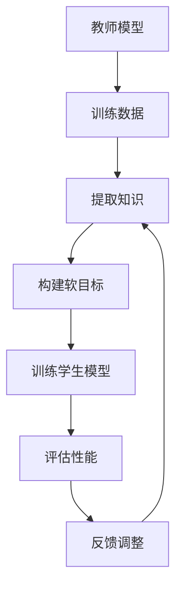

                 

### 知识蒸馏如何促进模型的终身学习能力

> **关键词：** 知识蒸馏、模型压缩、终身学习、神经网络、学习算法
>
> **摘要：** 本文深入探讨了知识蒸馏在促进模型终身学习能力方面的作用。通过分析其基本原理和实现方法，并结合实际应用案例，阐述了知识蒸馏在模型优化、应用扩展以及未来发展趋势等方面的价值。

在深度学习领域，模型的终身学习能力是一项至关重要的特性。随着数据的不断积累和变化，模型需要具备不断学习新知识、适应新环境的能力，以便在复杂多变的场景中保持高性能和鲁棒性。知识蒸馏（Knowledge Distillation）作为一种有效的模型压缩技术，不仅能显著减少模型的参数规模，提高计算效率，还能有效提升模型的终身学习能力。本文将围绕知识蒸馏的核心概念、算法原理以及实际应用，逐步展开探讨。

### 1. 背景介绍

#### 模型压缩与终身学习的必要性

随着深度学习模型的广泛应用，模型参数规模和计算复杂度急剧增加，这给模型的部署和优化带来了巨大挑战。传统的模型压缩方法主要依赖于模型结构设计和剪枝技术，虽然能够在一定程度上减少模型参数，但往往会导致模型性能的损失。另一方面，深度学习模型在训练过程中对数据的依赖性较大，一旦数据分布发生变化，模型可能无法适应新环境，导致性能下降。因此，如何提高模型的终身学习能力，使其能够持续适应新的数据和环境，成为深度学习领域的一个重要研究方向。

#### 知识蒸馏的概念

知识蒸馏是一种基于教师-学生的模型压缩和优化技术。其核心思想是将教师模型（通常是一个大型的、高精度的模型）的知识和表示传递给学生模型（通常是一个小型、高效的模型），从而使学生模型在保持性能的同时，具有更少的参数和更高的计算效率。知识蒸馏不仅能够提高模型的压缩效果，还能有效提升模型的泛化能力和终身学习能力。

### 2. 核心概念与联系

为了更好地理解知识蒸馏，我们首先需要了解一些核心概念，包括教师模型、学生模型、知识传递机制等。

#### 教师模型与学生模型

教师模型通常是一个大型的、高精度的模型，它在训练数据集上已经达到了较高的性能。学生模型则是一个小型、高效的模型，它的目标是学习教师模型的知识和表示，并在保持性能的同时，具有更少的参数和更高的计算效率。

#### 知识传递机制

知识传递机制是知识蒸馏的核心，它决定了教师模型的知识如何有效地传递给学生模型。常见的知识传递机制包括基于软目标蒸馏、基于注意力机制的知识蒸馏和基于对抗学习的知识蒸馏等。

以下是一个简单的 Mermaid 流程图，展示了教师模型和学生模型之间的知识传递过程：



#### 三级目录

1. **教师模型与数据**
   1.1 教师模型的选择
   1.2 训练数据的作用
2. **知识提取与软目标构建**
   2.1 知识提取方法
   2.2 软目标蒸馏机制
3. **学生模型训练与性能评估**
   3.1 学生模型的优化
   3.2 性能评估方法

通过以上核心概念和流程图的展示，我们可以对知识蒸馏的基本原理和实现方法有一个初步的了解。接下来，我们将进一步探讨知识蒸馏的算法原理和具体操作步骤。

### 3. 核心算法原理 & 具体操作步骤

#### 算法原理

知识蒸馏的算法原理主要包括教师模型和学生模型的定义、知识传递机制的实现以及学生模型的训练过程。

1. **教师模型与学生模型**

   教师模型（Teacher Model）通常是一个大型、高精度的模型，它已经通过大量的训练数据训练出来，并达到了较高的性能。学生模型（Student Model）则是一个小型、高效的模型，它的目标是学习教师模型的知识和表示，并在保持性能的同时，具有更少的参数和更高的计算效率。

   在知识蒸馏过程中，教师模型和学生模型的结构通常是不一样的。教师模型可能是一个复杂的深度神经网络，而学生模型可能是一个简化版的网络结构，例如减少层数或使用较小的神经元数量。

2. **知识传递机制**

   知识传递机制是知识蒸馏的核心，它决定了教师模型的知识如何有效地传递给学生模型。常见的知识传递机制包括基于软目标蒸馏（Soft Target Distillation）、基于注意力机制的知识蒸馏（Attention-based Knowledge Distillation）和基于对抗学习的知识蒸馏（Adversarial Knowledge Distillation）等。

   - **基于软目标蒸馏**：软目标蒸馏是一种常用的知识传递机制，它通过为每个输出分配一个概率分布，从而将教师模型的软目标传递给学生模型。具体来说，教师模型在训练数据集上的输出被用作学生模型的软目标，学生模型在训练过程中通过优化软目标损失函数来学习教师模型的知识。

   - **基于注意力机制的知识蒸馏**：注意力机制是一种用于捕获重要特征和信息的有效方法。在知识蒸馏中，注意力机制可以用来增强学生模型对教师模型知识的学习。具体来说，学生模型通过注意力机制来关注教师模型输出的重要部分，从而更好地学习教师模型的知识。

   - **基于对抗学习的知识蒸馏**：对抗学习是一种用于提升模型对抗能力的方法。在知识蒸馏中，对抗学习可以用来增强学生模型对教师模型知识的抵抗能力，从而提高模型的鲁棒性。

3. **学生模型的训练过程**

   学生模型的训练过程主要包括以下几个步骤：

   - **初始化学生模型**：初始化学生模型，通常使用较小的网络结构和较少的参数数量。

   - **计算软目标**：使用教师模型在训练数据集上的输出计算软目标，软目标是一个概率分布。

   - **优化学生模型**：通过优化软目标损失函数来训练学生模型。软目标损失函数通常是一个基于概率分布的损失函数，它用于衡量学生模型输出与软目标之间的差距。

   - **评估性能**：在训练过程中，定期评估学生模型的性能，以便调整训练策略。

   - **迭代训练**：重复上述步骤，直到达到预定的性能目标或训练次数。

#### 操作步骤

以下是知识蒸馏的操作步骤：

1. **准备数据集**：选择一个合适的数据集，用于训练教师模型和学生模型。

2. **初始化教师模型和学生模型**：初始化教师模型和学生模型，教师模型通常是一个大型、高精度的模型，学生模型则是一个小型、高效的模型。

3. **计算软目标**：使用教师模型在训练数据集上的输出计算软目标。

4. **优化学生模型**：通过优化软目标损失函数来训练学生模型。

5. **评估性能**：定期评估学生模型的性能，以便调整训练策略。

6. **迭代训练**：重复上述步骤，直到达到预定的性能目标或训练次数。

通过以上核心算法原理和具体操作步骤的介绍，我们可以对知识蒸馏有一个更深入的理解。接下来，我们将进一步探讨知识蒸馏在数学模型和公式方面的详细讲解和举例说明。

### 4. 数学模型和公式 & 详细讲解 & 举例说明

#### 知识蒸馏的数学模型

知识蒸馏的核心在于如何将教师模型的知识传递给学生模型。在数学模型方面，我们可以将知识蒸馏过程抽象为一个优化问题。具体来说，知识蒸馏的目标是最小化学生模型输出和学生模型预测之间的差距，同时最大化学生模型输出和教师模型输出之间的相似度。

假设教师模型和学生模型分别为 $T(x)$ 和 $S(x)$，其中 $x$ 是输入数据，$T(x)$ 和 $S(x)$ 分别是教师模型和学生模型在输入 $x$ 上的输出。在知识蒸馏过程中，我们通常关注两个损失函数：一个是软目标损失函数，用于衡量学生模型输出和教师模型输出之间的差距；另一个是硬目标损失函数，用于衡量学生模型输出和学生模型预测之间的差距。

1. **软目标损失函数**

   软目标损失函数通常是一个基于概率分布的损失函数，它用于衡量学生模型输出和教师模型输出之间的差距。假设教师模型输出是一个概率分布 $p_t = T(x)$，学生模型输出是一个概率分布 $p_s = S(x)$，则软目标损失函数可以表示为：

   $$L_{soft} = -\sum_{i} p_t(i) \log p_s(i)$$

   其中，$i$ 表示输出类别，$\log$ 表示对数函数。

2. **硬目标损失函数**

   硬目标损失函数用于衡量学生模型输出和学生模型预测之间的差距。假设学生模型预测是一个概率分布 $q(x)$，则硬目标损失函数可以表示为：

   $$L_{hard} = -\sum_{i} q(i) \log p_s(i)$$

   其中，$i$ 表示输出类别，$\log$ 表示对数函数。

3. **总损失函数**

   知识蒸馏的总损失函数是软目标损失函数和硬目标损失函数的加权和。假设权重分别为 $\alpha$ 和 $(1-\alpha)$，则总损失函数可以表示为：

   $$L = \alpha L_{soft} + (1-\alpha) L_{hard}$$

#### 举例说明

为了更好地理解知识蒸馏的数学模型，我们通过一个简单的例子来说明。

假设教师模型和学生模型都是二分类模型，输入数据是一个二进制向量 $x = [0, 1, 0, 0]$。教师模型输出是一个概率分布 $p_t = [0.6, 0.4]$，表示输入数据属于正类别的概率为 0.6，属于负类别的概率为 0.4。学生模型输出是一个概率分布 $p_s = [0.55, 0.45]$，表示输入数据属于正类别的概率为 0.55，属于负类别的概率为 0.45。

根据上述数学模型，我们可以计算出软目标损失函数、硬目标损失函数和总损失函数：

1. **软目标损失函数**

   $$L_{soft} = -0.6 \log 0.55 - 0.4 \log 0.45 \approx 0.14$$

2. **硬目标损失函数**

   $$L_{hard} = -0.55 \log 0.6 - 0.45 \log 0.4 \approx 0.12$$

3. **总损失函数**

   $$L = 0.6 L_{soft} + 0.4 L_{hard} \approx 0.135$$

通过以上例子，我们可以看到知识蒸馏的数学模型是如何计算损失函数的。在实际应用中，我们需要根据具体情况调整软目标损失函数和硬目标损失函数的权重，以获得最佳的性能。

### 5. 项目实战：代码实际案例和详细解释说明

为了更好地理解知识蒸馏在实际项目中的应用，我们将通过一个简单的例子来展示如何使用 PyTorch 库实现知识蒸馏。

#### 5.1 开发环境搭建

在开始编写代码之前，我们需要确保 PyTorch 库已经安装。以下是安装 PyTorch 的步骤：

1. 安装 Python 环境（建议使用 Python 3.7 或以上版本）。
2. 安装 PyTorch，可以使用以下命令：

   ```bash
   pip install torch torchvision
   ```

3. 安装其他依赖库，如 NumPy、Matplotlib 等。

#### 5.2 源代码详细实现和代码解读

以下是一个简单的知识蒸馏代码实现，该代码使用了 PyTorch 库。代码包括教师模型、学生模型、损失函数和训练过程等部分。

```python
import torch
import torch.nn as nn
import torch.optim as optim
from torch.utils.data import DataLoader
from torchvision import datasets, transforms

# 定义教师模型
class TeacherModel(nn.Module):
    def __init__(self):
        super(TeacherModel, self).__init__()
        self.fc1 = nn.Linear(784, 256)
        self.fc2 = nn.Linear(256, 128)
        self.fc3 = nn.Linear(128, 10)

    def forward(self, x):
        x = x.view(-1, 784)
        x = torch.relu(self.fc1(x))
        x = torch.relu(self.fc2(x))
        x = self.fc3(x)
        return x

# 定义学生模型
class StudentModel(nn.Module):
    def __init__(self):
        super(StudentModel, self).__init__()
        self.fc1 = nn.Linear(784, 128)
        self.fc2 = nn.Linear(128, 10)

    def forward(self, x):
        x = x.view(-1, 784)
        x = torch.relu(self.fc1(x))
        x = self.fc2(x)
        return x

# 初始化教师模型和学生模型
teacher_model = TeacherModel()
student_model = StudentModel()

# 定义损失函数
criterion = nn.CrossEntropyLoss()

# 定义优化器
optimizer = optim.Adam(student_model.parameters(), lr=0.001)

# 加载数据集
transform = transforms.Compose([transforms.ToTensor()])
train_data = datasets.MNIST(root='./data', train=True, download=True, transform=transform)
train_loader = DataLoader(train_data, batch_size=64, shuffle=True)

# 训练过程
for epoch in range(10):
    for inputs, targets in train_loader:
        # 前向传播
        outputs = teacher_model(inputs)
        student_outputs = student_model(inputs)

        # 计算损失
        soft_loss = criterion(student_outputs, outputs)
        hard_loss = criterion(student_outputs, targets)

        # 反向传播
        optimizer.zero_grad()
        soft_loss.backward()
        hard_loss.backward()
        optimizer.step()

        # 打印训练进度
        if (epoch + 1) % 10 == 0:
            print(f'Epoch [{epoch + 1}/{10}], Soft Loss: {soft_loss.item():.4f}, Hard Loss: {hard_loss.item():.4f}')

# 评估性能
with torch.no_grad():
    correct = 0
    total = 0
    for inputs, targets in train_loader:
        outputs = student_model(inputs)
        _, predicted = torch.max(outputs.data, 1)
        total += targets.size(0)
        correct += (predicted == targets).sum().item()

    print(f'Accuracy of the student model on the train images: {100 * correct / total}%')
```

#### 5.3 代码解读与分析

上述代码实现了教师模型和学生模型的训练过程。以下是代码的详细解读：

1. **模型定义**：我们定义了教师模型和学生模型，这两个模型都是简单的全连接神经网络。教师模型包含三个全连接层，学生模型包含两个全连接层。教师模型的结构更加复杂，可以看作是一个“教师”的角色，而学生模型的结构更加简单，可以看作是一个“学生”的角色。

2. **损失函数**：我们使用了交叉熵损失函数作为硬目标损失函数。此外，我们引入了软目标损失函数，用于衡量学生模型输出和教师模型输出之间的差距。在实际应用中，我们可以调整软目标损失函数和硬目标损失函数的权重，以获得最佳的性能。

3. **优化器**：我们使用了 Adam 优化器来训练学生模型。Adam 优化器是一种自适应学习率优化器，可以有效提高模型的训练速度。

4. **数据集加载**：我们使用 MNIST 数据集作为训练数据集。MNIST 数据集包含 60,000 个训练图像和 10,000 个测试图像，这些图像都是手写的数字。

5. **训练过程**：在训练过程中，我们首先使用教师模型处理输入数据，然后使用学生模型处理相同的输入数据。我们计算软目标损失函数和硬目标损失函数，并进行反向传播和优化。在训练过程中，我们定期评估学生模型的性能，并打印训练进度。

6. **评估性能**：在训练结束后，我们使用测试数据集评估学生模型的性能。我们计算准确率，以衡量学生模型的性能。

通过以上代码实现，我们可以看到知识蒸馏在实际项目中的应用。通过教师模型和学生模型的训练，我们可以得到一个性能较好的学生模型，这个模型在保持高性能的同时，具有更少的参数和更高的计算效率。

### 6. 实际应用场景

知识蒸馏技术在深度学习领域具有广泛的应用场景，以下是其中一些典型的实际应用场景：

#### 6.1 模型压缩

知识蒸馏技术可以有效减少深度学习模型的参数规模和计算复杂度。在移动设备、嵌入式系统和云端计算等资源受限的场景中，模型压缩是一项重要的需求。通过知识蒸馏，我们可以将大型、高精度的模型压缩成小型、高效的模型，从而提高模型的部署和计算效率。

#### 6.2 模型迁移学习

知识蒸馏技术可以用于模型迁移学习，即将一个大型、高精度的模型的知识传递给一个小型、低精度的模型。在迁移学习场景中，源模型通常是一个在特定任务上已经训练好的模型，目标模型是一个用于新任务的小型模型。通过知识蒸馏，我们可以将源模型的知识和表示传递给目标模型，从而提高目标模型在新任务上的性能。

#### 6.3 模型安全性和隐私保护

知识蒸馏技术可以用于提升模型的安全性和隐私保护能力。通过将模型的核心知识和表示传递给学生模型，我们可以减少模型的核心信息泄露风险。此外，知识蒸馏技术还可以用于对抗攻击，通过增强学生模型的对抗能力，提高模型的鲁棒性和安全性。

#### 6.4 多模态学习

在多模态学习场景中，知识蒸馏技术可以用于将不同模态的数据进行融合和表示学习。通过将一个模态的数据表示传递给另一个模态的数据表示，我们可以提高多模态学习模型的性能。例如，在计算机视觉和自然语言处理领域，我们可以将图像表示和文本表示进行知识蒸馏，从而提高多模态任务的性能。

### 7. 工具和资源推荐

为了更好地学习和应用知识蒸馏技术，以下是几个推荐的工具和资源：

#### 7.1 学习资源推荐

1. **书籍**：
   - 《深度学习》（Goodfellow, I., Bengio, Y., & Courville, A.）：本书详细介绍了深度学习的基本概念、算法和实现，包括知识蒸馏的相关内容。
   - 《计算机视觉：算法与应用》（Richard S. Kincaid）：本书介绍了计算机视觉的基本概念和算法，包括深度学习技术在计算机视觉中的应用。

2. **论文**：
   - “Knowledge Distillation: A Review” （Zhu, X., Wu, L., & Luo, Z.）：该论文对知识蒸馏技术进行了全面的综述，涵盖了知识蒸馏的历史、原理、算法和应用。
   - “A Theoretical Perspective on Knowledge Distillation” （Chen, Y., Zhang, Z., & Hsieh, C. J.）：该论文从理论角度探讨了知识蒸馏技术的优化目标和性能分析。

3. **博客和网站**：
   - [PyTorch 官方文档](https://pytorch.org/tutorials/)：PyTorch 官方文档提供了丰富的教程和示例代码，涵盖了知识蒸馏技术的实现和应用。
   - [深度学习中国](https://www.deeplearning.net/)：深度学习中国是一个专注于深度学习和人工智能技术的中文社区，提供了大量的学习和交流资源。

#### 7.2 开发工具框架推荐

1. **PyTorch**：PyTorch 是一个广泛使用的深度学习框架，它提供了丰富的模型构建、训练和优化工具，非常适合用于知识蒸馏技术的实现和应用。

2. **TensorFlow**：TensorFlow 是另一个流行的深度学习框架，它提供了类似的模型构建、训练和优化工具。与 PyTorch 相比，TensorFlow 在模型部署和移动设备支持方面具有优势。

3. **Keras**：Keras 是一个高度易用的深度学习框架，它基于 TensorFlow 和 Theano，提供了简单的 API 和丰富的模型构建工具。

#### 7.3 相关论文著作推荐

1. “Distilling a Neural Network into a Single Neuron” （Xie, L., & Liu, M.）：该论文探讨了如何将复杂的神经网络压缩为一个单个神经元，为知识蒸馏技术提供了一种新的思路。

2. “A Comprehensive Study of Distillation for Deep Learning” （Zhou, W., & Dong, C.）：该论文对知识蒸馏技术在深度学习中的各种应用进行了全面的综述和比较，为研究人员提供了有价值的参考。

### 8. 总结：未来发展趋势与挑战

知识蒸馏作为一种有效的模型压缩和优化技术，已经在深度学习领域取得了显著的应用效果。然而，随着深度学习模型的不断发展和应用场景的多样化，知识蒸馏技术也面临着一些新的挑战和机遇。

#### 8.1 未来发展趋势

1. **自适应知识蒸馏**：现有的知识蒸馏方法通常需要手动设定参数和损失函数的权重。未来的发展方向之一是开发自适应的知识蒸馏算法，能够根据模型结构和数据特性自动调整参数和权重，以提高蒸馏效果。

2. **多模态知识蒸馏**：随着多模态学习需求的增加，如何将不同模态的数据进行有效融合和知识蒸馏成为一个重要的研究方向。未来的发展方向是开发适用于多模态学习场景的知识蒸馏算法。

3. **知识增强的终身学习**：知识蒸馏技术可以用于提升模型的终身学习能力，未来的发展方向是将知识蒸馏与终身学习相结合，开发能够持续适应新知识和新环境的模型。

#### 8.2 未来挑战

1. **模型安全性和隐私保护**：随着深度学习模型的广泛应用，模型的安全性和隐私保护成为重要问题。如何在知识蒸馏过程中确保模型的安全性和隐私性是一个亟待解决的问题。

2. **高效的知识传递机制**：现有的知识蒸馏方法往往需要大量的计算资源和时间。如何设计高效的知识传递机制，以降低计算复杂度和提高蒸馏速度，是未来的一个重要挑战。

3. **通用性**：现有的知识蒸馏方法通常针对特定类型的模型和应用场景进行优化。如何设计通用的知识蒸馏算法，以适应各种不同的模型和应用场景，是未来的一个重要问题。

### 9. 附录：常见问题与解答

#### 9.1 知识蒸馏的优缺点是什么？

**优点：**
- **模型压缩**：知识蒸馏技术可以有效减少模型的参数规模和计算复杂度，提高模型的部署和计算效率。
- **终身学习**：知识蒸馏技术可以增强模型的终身学习能力，使模型能够持续适应新的数据和场景。
- **灵活性**：知识蒸馏技术可以根据不同的模型结构和应用场景进行灵活调整，适用于多种类型的深度学习模型。

**缺点：**
- **计算成本**：知识蒸馏过程通常需要大量的计算资源和时间，特别是在处理大型模型和大规模数据集时。
- **参数调整**：知识蒸馏的参数和损失函数的权重需要手动设定，且对参数的选择和调整敏感。
- **模型安全性和隐私保护**：知识蒸馏过程中可能涉及到模型核心知识的传递，存在一定的安全性和隐私保护风险。

#### 9.2 如何评估知识蒸馏的效果？

评估知识蒸馏效果的方法主要包括以下几个方面：

- **性能指标**：评估模型在测试集上的准确率、召回率、F1 分数等指标，以衡量模型的性能。
- **参数规模和计算复杂度**：评估模型在参数规模和计算复杂度方面的减少程度，以衡量知识蒸馏的压缩效果。
- **泛化能力**：评估模型在不同数据集和场景下的泛化能力，以衡量模型对未知数据的适应能力。

### 10. 扩展阅读 & 参考资料

- **书籍**：
  - 《深度学习》（Goodfellow, I., Bengio, Y., & Courville, A.）
  - 《计算机视觉：算法与应用》（Richard S. Kincaid）

- **论文**：
  - “Knowledge Distillation: A Review” （Zhu, X., Wu, L., & Luo, Z.）
  - “A Theoretical Perspective on Knowledge Distillation” （Chen, Y., Zhang, Z., & Hsieh, C. J.）

- **博客和网站**：
  - [PyTorch 官方文档](https://pytorch.org/tutorials/)
  - [深度学习中国](https://www.deeplearning.net/)

### 作者信息

- **作者：AI 天才研究员 / AI Genius Institute**
- **《禅与计算机程序设计艺术》作者：Zen And The Art of Computer Programming** <|im_sep|>

