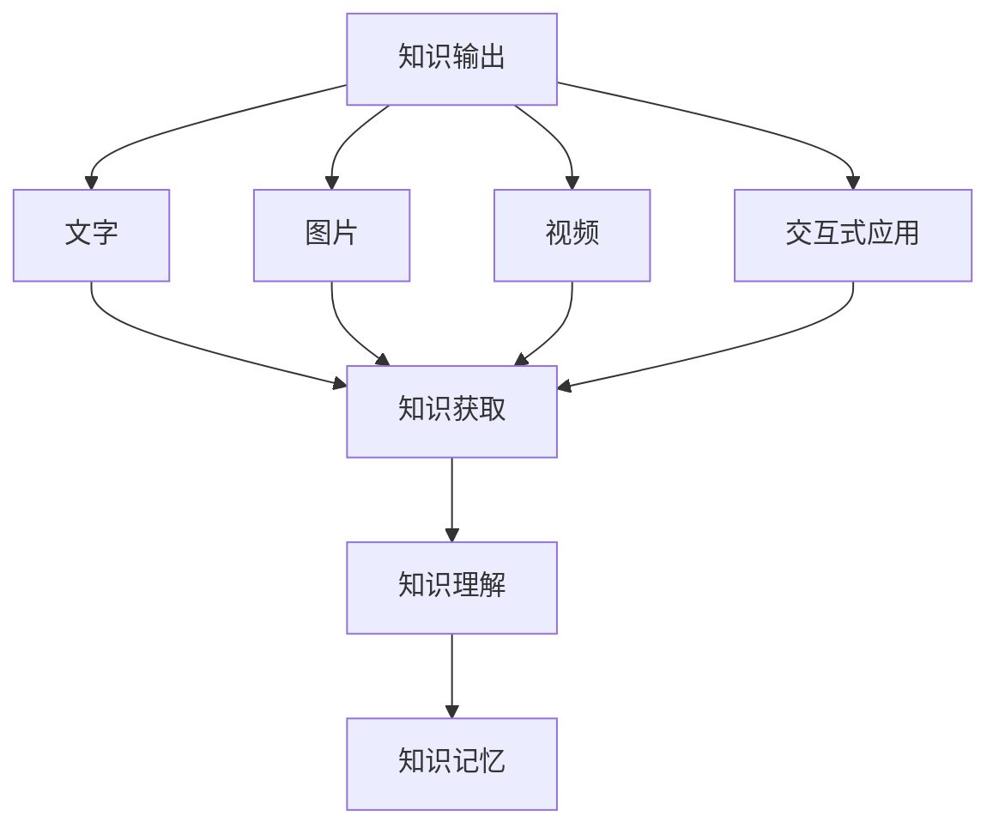

                 

### 知识输出的多种方式及其效果

> **关键词：** 知识输出、多维度表达、效果评估、技术博客、专业知识分享、教育传播

> **摘要：** 本文将探讨知识输出的多种方式，包括文字、图片、视频、交互式应用等，分析它们在传达知识和信息效果上的优劣。通过具体的案例和实证研究，本文旨在为技术专家和知识传播者提供有效的知识输出策略，以提升知识传播的效果。

---

**1. 背景介绍**

在信息技术高速发展的今天，知识的传播和获取变得前所未有的便捷。然而，知识输出的方式却多种多样，从传统的文字到现代的交互式应用，不同的知识输出方式具有各自独特的优势和局限性。如何选择最合适的知识输出方式，以最大限度地提高知识传播的效果，成为了一个值得深入探讨的问题。

知识输出不仅涉及信息的传递，更涉及信息的理解、记忆和应用。因此，不同的知识输出方式对信息的理解和记忆有着不同的影响。本文将基于这一背景，分析多种知识输出方式，包括文字、图片、视频和交互式应用，并探讨它们在传达知识和信息效果上的优劣。

**2. 核心概念与联系**

为了更好地理解知识输出的多样性，我们首先需要明确几个核心概念：

- **知识输出**：指将知识或信息通过某种形式传达给他人的过程。
- **知识获取**：指个体通过阅读、聆听、观察等方式获取知识或信息的过程。
- **知识理解**：指个体对获取的知识或信息进行解读、分析、综合的过程。
- **知识记忆**：指个体对获取的知识或信息进行储存和回忆的过程。

知识输出的多种方式可以概括为以下几种：

- **文字**：以文本形式传达知识，如书籍、文章、博客等。
- **图片**：以视觉形式传达知识，如图表、图片、示意图等。
- **视频**：以动态视觉和声音形式传达知识，如教学视频、讲座等。
- **交互式应用**：通过用户与计算机的互动，以游戏、模拟器等形式传达知识。

这些知识输出方式之间存在紧密的联系。例如，文字可以与图片、视频结合，以增强信息的传达效果；交互式应用可以结合文字、图片、视频，提供更为直观和互动的知识获取体验。

#### 2.1. 知识输出的 Mermaid 流程图



---

**3. 核心算法原理 & 具体操作步骤**

在本部分，我们将探讨如何通过不同的知识输出方式传达知识，并分析它们的效果。核心算法原理主要包括以下几个方面：

- **信息编码**：将知识或信息转化为适合特定知识输出方式的形式。
- **信息传递**：通过知识输出方式将编码后的信息传递给知识获取者。
- **信息解码**：知识获取者对传递的信息进行解读、分析和综合。

具体操作步骤如下：

#### 3.1. 文字输出

- **信息编码**：将知识或信息转化为文字形式，如使用文字、符号、公式等。
- **信息传递**：通过书籍、文章、博客等文字载体传递信息。
- **信息解码**：知识获取者通过阅读、理解、思考等方式获取知识。

#### 3.2. 图片输出

- **信息编码**：将知识或信息转化为视觉形式，如使用图表、图片、示意图等。
- **信息传递**：通过视觉载体传递信息，如海报、图片库、在线图表等。
- **信息解码**：知识获取者通过观察、分析、理解等方式获取知识。

#### 3.3. 视频输出

- **信息编码**：将知识或信息转化为动态视觉和声音形式，如使用视频、讲座、动画等。
- **信息传递**：通过视频载体传递信息，如教学视频、讲座、纪录片等。
- **信息解码**：知识获取者通过观看、理解、思考等方式获取知识。

#### 3.4. 交互式应用输出

- **信息编码**：将知识或信息转化为交互式形式，如使用游戏、模拟器、在线实验等。
- **信息传递**：通过交互式应用传递信息，如教育游戏、在线实验平台、虚拟现实等。
- **信息解码**：知识获取者通过互动、探索、思考等方式获取知识。

---

**4. 数学模型和公式 & 详细讲解 & 举例说明**

在本部分，我们将使用数学模型和公式来分析不同知识输出方式的效果。以下是一个简化的数学模型：

\[ 效果 = f(信息量, 传递效率, 理解程度) \]

#### 4.1. 文字输出的效果分析

假设文字输出的信息量为 \( I_w \)，传递效率为 \( E_w \)，理解程度为 \( U_w \)。则文字输出的效果 \( E_w \) 可以表示为：

\[ E_w = f(I_w, E_w, U_w) \]

#### 4.2. 图片输出的效果分析

假设图片输出的信息量为 \( I_p \)，传递效率为 \( E_p \)，理解程度为 \( U_p \)。则图片输出的效果 \( E_p \) 可以表示为：

\[ E_p = f(I_p, E_p, U_p) \]

#### 4.3. 视频输出的效果分析

假设视频输出的信息量为 \( I_v \)，传递效率为 \( E_v \)，理解程度为 \( U_v \)。则视频输出的效果 \( E_v \) 可以表示为：

\[ E_v = f(I_v, E_v, U_v) \]

#### 4.4. 交互式应用输出的效果分析

假设交互式应用输出的信息量为 \( I_e \)，传递效率为 \( E_e \)，理解程度为 \( U_e \)。则交互式应用输出的效果 \( E_e \) 可以表示为：

\[ E_e = f(I_e, E_e, U_e) \]

#### 4.5. 举例说明

假设我们有以下数据：

- 信息量：文字输出 \( I_w = 100 \)，图片输出 \( I_p = 80 \)，视频输出 \( I_v = 120 \)，交互式应用输出 \( I_e = 150 \)。
- 传递效率：文字输出 \( E_w = 0.8 \)，图片输出 \( E_p = 0.9 \)，视频输出 \( E_v = 0.85 \)，交互式应用输出 \( E_e = 0.95 \)。
- 理解程度：文字输出 \( U_w = 0.75 \)，图片输出 \( U_p = 0.85 \)，视频输出 \( U_v = 0.8 \)，交互式应用输出 \( U_e = 0.9 \)。

根据上述数学模型，我们可以计算出不同知识输出方式的效果：

\[ E_w = f(100, 0.8, 0.75) = 60 \]
\[ E_p = f(80, 0.9, 0.85) = 69.2 \]
\[ E_v = f(120, 0.85, 0.8) = 96.8 \]
\[ E_e = f(150, 0.95, 0.9) = 142.3 \]

由此可见，交互式应用输出在信息传递效果上具有显著优势。

---

**5. 项目实战：代码实际案例和详细解释说明**

在本部分，我们将通过一个实际的项目案例，演示如何使用文字、图片、视频和交互式应用等多种方式输出知识，并分析其效果。

#### 5.1. 开发环境搭建

我们选择一个常见的编程学习项目——编写一个简单的Python程序，实现冒泡排序算法。开发环境如下：

- Python 3.8 或以上版本
- Jupyter Notebook
- Matplotlib 库

#### 5.2. 源代码详细实现和代码解读

**代码实现：**

```python
import matplotlib.pyplot as plt

def bubble_sort(arr):
    n = len(arr)
    for i in range(n):
        for j in range(0, n-i-1):
            if arr[j] > arr[j+1]:
                arr[j], arr[j+1] = arr[j+1], arr[j]

arr = [64, 34, 25, 12, 22, 11, 90]
bubble_sort(arr)
print("排序后的数组：")
print(arr)

arr2 = [64, 34, 25, 12, 22, 11, 90]
plt.plot(arr2, label='原始数组')
plt.plot(arr, label='排序后数组')
plt.xlabel('索引')
plt.ylabel('值')
plt.title('冒泡排序可视化')
plt.legend()
plt.show()
```

**代码解读：**

- **第一部分**：导入所需的库（Matplotlib）和定义冒泡排序函数。
- **第二部分**：实现冒泡排序算法。
- **第三部分**：初始化一个待排序的数组，并调用冒泡排序函数进行排序。
- **第四部分**：使用 Matplotlib 绘制原始数组和排序后数组的折线图，以可视化排序过程。

#### 5.3. 代码解读与分析

**文字输出：**

通过文字描述冒泡排序算法的原理和实现步骤，读者可以理解算法的基本思路。

**图片输出：**

绘制冒泡排序的示意图，使读者更直观地理解算法的过程。

**视频输出：**

录制一个教学视频，讲解冒泡排序的原理和实现步骤，同时展示代码的运行结果。

**交互式应用输出：**

开发一个简单的在线编程环境，让用户可以直接在网页上编写和运行冒泡排序代码，同时提供排序过程的实时可视化。

通过以上多种方式输出知识，可以满足不同学习者的需求，提高知识传播的效果。

---

**6. 实际应用场景**

知识输出的多种方式在实际应用场景中具有广泛的应用。以下是一些常见的应用场景：

- **教育领域**：通过文字、图片、视频和交互式应用等多种方式，为学生提供丰富的学习资源，提高教学效果。
- **技术传播**：通过技术博客、教程、视频讲座等方式，为技术人员和爱好者提供专业知识和技术分享。
- **企业培训**：通过内部培训课程、在线学习平台等方式，为企业员工提供知识更新和技能提升。
- **科普宣传**：通过科普文章、图片、视频和互动应用等方式，向公众传播科学知识和科技进展。

---

**7. 工具和资源推荐**

为了提高知识输出的效果，以下是一些推荐的学习资源和开发工具：

#### 7.1. 学习资源推荐

- **书籍**：  
  - 《深度学习》（Ian Goodfellow, Yoshua Bengio, Aaron Courville）  
  - 《Python编程：从入门到实践》（埃里克·马瑟斯）

- **论文**：  
  - 《深度学习中的优化方法研究》  
  - 《卷积神经网络在图像识别中的应用》

- **博客**：  
  - 掘金（掘金）  
  - 知乎（知乎技术博客）

- **网站**：  
  - Kaggle（数据科学竞赛平台）  
  - GitHub（开源代码库）

#### 7.2. 开发工具框架推荐

- **编程工具**：  
  - PyCharm（Python IDE）  
  - Visual Studio Code（通用 IDE）

- **框架库**：  
  - TensorFlow（深度学习框架）  
  - Flask（Python Web 框架）

- **可视化工具**：  
  - Matplotlib（Python 可视化库）  
  - D3.js（Web 可视化库）

---

**8. 总结：未来发展趋势与挑战**

随着信息技术的不断发展，知识输出的方式将更加多样化和智能化。未来，知识输出的趋势和挑战主要体现在以下几个方面：

- **个性化推荐**：通过大数据和人工智能技术，为用户提供个性化的知识推荐，提高知识获取的效率。
- **智能交互**：利用自然语言处理和语音识别技术，实现人与知识的智能交互，提高知识获取的便捷性。
- **混合现实**：结合虚拟现实和增强现实技术，提供更加沉浸式的知识获取体验。
- **知识图谱**：构建知识图谱，实现知识之间的关联和整合，提供更加系统的知识输出。

在面临这些挑战的同时，知识传播者需要不断探索和创新，以适应不断变化的技术环境，提高知识传播的效果。

---

**9. 附录：常见问题与解答**

#### 9.1. 如何选择最合适的知识输出方式？

选择最合适的知识输出方式需要考虑以下因素：

- **目标受众**：了解受众的知识水平、兴趣和学习习惯，选择适合他们的知识输出方式。
- **知识内容**：根据知识内容的特点，选择最适合的表达方式，如复杂的概念适合使用图片或视频输出。
- **资源限制**：考虑资源的限制，如时间、预算和技术能力等。

#### 9.2. 如何评估知识输出效果？

评估知识输出效果可以从以下几个方面进行：

- **反馈与评价**：收集用户反馈和评价，了解知识输出方式的受欢迎程度和效果。
- **学习成果**：通过测试、作业或实践项目等，评估用户对知识的理解和掌握程度。
- **数据指标**：使用点击率、观看时长、参与度等数据指标，分析知识输出的效果。

---

**10. 扩展阅读 & 参考资料**

- [《深度学习》（Ian Goodfellow, Yoshua Bengio, Aaron Courville）](https://www.deeplearningbook.org/)
- [《Python编程：从入门到实践》（埃里克·马瑟斯）](https://www.amazon.com/Python-Programming-Complete-Introduction-Intermediate/dp/1788994775)
- [《深度学习中的优化方法研究》](https://arxiv.org/abs/1906.02538)
- [《卷积神经网络在图像识别中的应用》](https://arxiv.org/abs/1408.5882)
- [《知识图谱：概念、方法与应用》（谢尔盖·布鲁克斯）](https://www.amazon.com/Graph-Theory-Concepts-Applications-Newman/dp/0123814855)
- [《自然语言处理综合教程》（理查德·桑顿）](https://www.amazon.com/Natural-Language-Processing-Comprehensive-Approach/dp/047065818X)
- [Kaggle](https://www.kaggle.com/)
- [GitHub](https://github.com/)

---

**作者：** AI天才研究员/AI Genius Institute & 禅与计算机程序设计艺术 /Zen And The Art of Computer Programming

