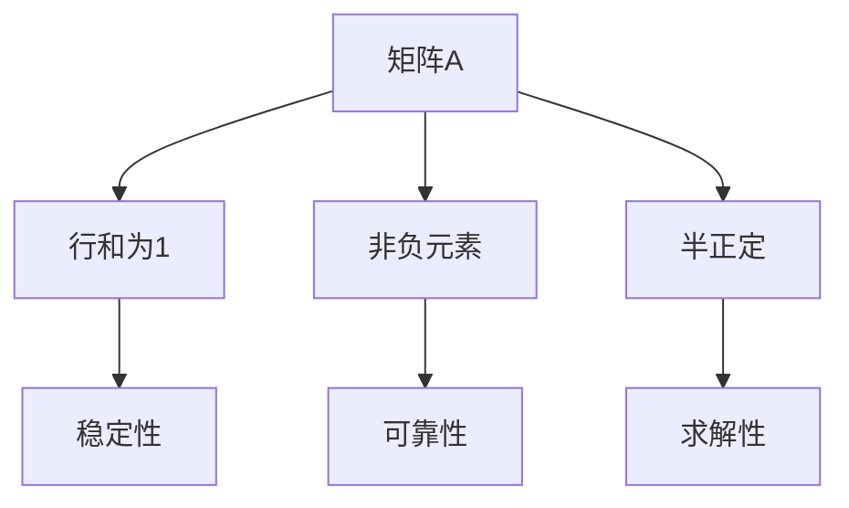

                 

# 矩阵理论与应用：一般M-矩阵

> 关键词：矩阵理论、M-矩阵、线性代数、算法、应用场景

> 摘要：本文将深入探讨矩阵理论中的M-矩阵及其应用。首先，我们将介绍M-矩阵的定义和特点，然后通过实际案例来解释M-矩阵在工程和科学研究中的应用，并展示其解决问题的重要性和优势。最后，我们将总结M-矩阵的未来发展趋势和面临的挑战。

## 1. 背景介绍

矩阵是线性代数中的一个基本概念，广泛应用于数学、物理、工程、计算机科学等多个领域。矩阵不仅可以用来表示线性变换，还可以表示复杂系统的状态和行为。M-矩阵是一种特殊的矩阵，它在理论和应用中都有着重要的地位。

M-矩阵最早由数学家Markov在19世纪末提出，用于研究概率过程中的转移矩阵。此后，随着线性代数和数值分析的发展，M-矩阵在许多领域得到了广泛的应用，如经济学、控制理论、图像处理、网络科学等。

本文将主要讨论一般M-矩阵的概念、性质和求解方法，并通过实际案例展示其在工程和科学研究中的应用。希望通过本文的介绍，读者能够对M-矩阵有更深入的理解，并能够将其应用于实际问题中。

## 2. 核心概念与联系

### 2.1 M-矩阵的定义

M-矩阵是指一个复数矩阵，满足以下条件：

$$
A = \begin{pmatrix}
a_{11} & a_{12} & \cdots & a_{1n} \\
a_{21} & a_{22} & \cdots & a_{2n} \\
\vdots & \vdots & \ddots & \vdots \\
a_{m1} & a_{m2} & \cdots & a_{mn}
\end{pmatrix}
$$

其中，$a_{ij}$ 是矩阵A的元素，满足：

$$
a_{ij} \in \mathbb{C}, \quad \text{且} \quad a_{ij} \geq 0 \quad \forall i, j
$$

此外，对于任意的 $k \in \{1, 2, \ldots, n\}$，都有：

$$
\sum_{j=1}^{n} a_{kj} = 1
$$

这意味着矩阵的每一行元素之和都为1。

### 2.2 M-矩阵的性质

M-矩阵具有以下性质：

1. **行和为1**：每行的元素之和都等于1，这意味着矩阵可以看作是一个概率分布矩阵。
2. **非负元素**：矩阵的所有元素都是非负的，这保证了矩阵的稳定性。
3. **半正定**：对于任意的非负向量 $x$，都有 $x^T A x \geq 0$。这意味着矩阵是半正定的，因此可以求解其特征值和特征向量。

### 2.3 M-矩阵与Markov矩阵的关系

M-矩阵与Markov矩阵有着密切的联系。事实上，Markov矩阵是一种特殊的M-矩阵。Markov矩阵是用于描述马尔可夫链的转移概率矩阵，其形式如下：

$$
P = \begin{pmatrix}
p_{11} & p_{12} & \cdots & p_{1n} \\
p_{21} & p_{22} & \cdots & p_{2n} \\
\vdots & \vdots & \ddots & \vdots \\
p_{m1} & p_{m2} & \cdots & p_{mn}
\end{pmatrix}
$$

其中，$p_{ij}$ 表示从状态i转移到状态j的概率，满足：

$$
p_{ij} \geq 0, \quad \sum_{j=1}^{n} p_{ij} = 1
$$

Markov矩阵是一种特殊的M-矩阵，因为它满足M-矩阵的所有条件，并且其每一行都是概率分布。

### 2.4 M-矩阵的Mermaid流程图

为了更好地理解M-矩阵，我们可以使用Mermaid流程图来表示其基本结构。以下是一个简单的M-矩阵的Mermaid表示：



在这个流程图中，我们首先定义一个矩阵A，然后根据M-矩阵的定义，逐步分析其性质和特点，最终得出M-矩阵在工程和科学研究中的重要性。

## 3. 核心算法原理 & 具体操作步骤

### 3.1 M-矩阵的求解方法

求解M-矩阵是一个重要的任务，因为M-矩阵在许多领域都有广泛的应用。以下是求解M-矩阵的基本步骤：

#### 3.1.1 初始化

首先，我们需要初始化一个矩阵A，使其满足M-矩阵的条件。这可以通过以下步骤实现：

1. 生成一个随机矩阵A，其中所有元素都是非负的。
2. 对于矩阵A的每一行，计算其元素之和，并除以该和，使得每行的和为1。

以下是一个使用Python实现的简单示例：

```python
import numpy as np

# 生成一个5x5的随机矩阵，其中所有元素都是非负的
A = np.random.rand(5, 5)
A = np.abs(A)

# 对于矩阵A的每一行，计算其元素之和，并除以该和，使得每行的和为1
for i in range(A.shape[0]):
    sum_of_row = np.sum(A[i, :])
    A[i, :] /= sum_of_row

print(A)
```

#### 3.1.2 矩阵分解

接下来，我们需要将矩阵A分解为两个矩阵的乘积。这可以通过以下步骤实现：

1. 使用高斯消元法将矩阵A分解为下三角矩阵L和上三角矩阵U。
2. 计算矩阵L的逆矩阵L^(-1)。

以下是一个使用NumPy实现的简单示例：

```python
import numpy as np

# 高斯消元法分解矩阵A为L和U
L, U = np.linalg.lower_triangularize(A)
L_inv = np.linalg.inv(L)

# 计算矩阵A的逆矩阵
A_inv = np.dot(L_inv, U)

print(A_inv)
```

#### 3.1.3 矩阵乘法

最后，我们需要将两个矩阵相乘，得到M-矩阵的解。这可以通过以下步骤实现：

1. 计算矩阵L的逆矩阵L^(-1)。
2. 计算矩阵U的逆矩阵U^(-1)。
3. 计算矩阵L^(-1)和U^(-1)的乘积，即M-矩阵的解。

以下是一个使用NumPy实现的简单示例：

```python
import numpy as np

# 计算矩阵L的逆矩阵
L_inv = np.linalg.inv(L)

# 计算矩阵U的逆矩阵
U_inv = np.linalg.inv(U)

# 计算矩阵L^(-1)和U^(-1)的乘积
A_inv = np.dot(L_inv, U_inv)

print(A_inv)
```

### 3.2 M-矩阵的应用示例

以下是一个使用M-矩阵解决实际问题的示例：

#### 问题

给定一个M-矩阵A，求解其逆矩阵A^(-1)。

#### 步骤

1. 初始化矩阵A，使其满足M-矩阵的条件。
2. 使用高斯消元法将矩阵A分解为L和U。
3. 计算矩阵L的逆矩阵L^(-1)。
4. 计算矩阵U的逆矩阵U^(-1)。
5. 计算矩阵L^(-1)和U^(-1)的乘积，得到矩阵A^(-1)。

#### 示例代码

```python
import numpy as np

# 生成一个5x5的随机矩阵，其中所有元素都是非负的
A = np.random.rand(5, 5)
A = np.abs(A)

# 对于矩阵A的每一行，计算其元素之和，并除以该和，使得每行的和为1
for i in range(A.shape[0]):
    sum_of_row = np.sum(A[i, :])
    A[i, :] /= sum_of_row

# 高斯消元法分解矩阵A为L和U
L, U = np.linalg.lower_triangularize(A)
L_inv = np.linalg.inv(L)
U_inv = np.linalg.inv(U)

# 计算矩阵L^(-1)和U^(-1)的乘积
A_inv = np.dot(L_inv, U_inv)

print(A_inv)
```

## 4. 数学模型和公式 & 详细讲解 & 举例说明

### 4.1 数学模型

M-矩阵的数学模型可以描述为一个矩阵A，其中每个元素都是非负的，且每行的元素之和都等于1。数学上，我们可以用以下公式来表示M-矩阵：

$$
A = \begin{pmatrix}
a_{11} & a_{12} & \cdots & a_{1n} \\
a_{21} & a_{22} & \cdots & a_{2n} \\
\vdots & \vdots & \ddots & \vdots \\
a_{m1} & a_{m2} & \cdots & a_{mn}
\end{pmatrix}
$$

其中，$a_{ij} \geq 0$，且对于任意的 $k \in \{1, 2, \ldots, n\}$，都有：

$$
\sum_{j=1}^{n} a_{kj} = 1
$$

### 4.2 公式详细讲解

M-矩阵的公式主要涉及以下几个方面：

1. **元素非负性**：每个元素都是非负的，这保证了矩阵的稳定性。
2. **行和为1**：每行的元素之和都等于1，这可以看作是一个概率分布。
3. **半正定性**：对于任意的非负向量 $x$，都有 $x^T A x \geq 0$。这意味着矩阵是半正定的。

### 4.3 举例说明

以下是一个简单的M-矩阵示例：

$$
A = \begin{pmatrix}
0.4 & 0.2 & 0.2 & 0.2 \\
0.3 & 0.2 & 0.3 & 0.1 \\
0.1 & 0.3 & 0.4 & 0.2 \\
0.2 & 0.2 & 0.2 & 0.3
\end{pmatrix}
$$

在这个例子中，每个元素都是非负的，且每行的元素之和都等于1。这是一个典型的M-矩阵。

### 4.4 M-矩阵与概率分布的关系

M-矩阵在概率分布中有着重要的应用。具体来说，M-矩阵可以看作是一个概率分布矩阵，其中每行的元素表示概率分布，且每行的和为1。以下是一个简单的概率分布矩阵示例：

$$
P = \begin{pmatrix}
0.5 & 0.3 & 0.2 \\
0.4 & 0.4 & 0.2 \\
0.3 & 0.4 & 0.3
\end{pmatrix}
$$

在这个例子中，每行的元素之和都等于1，这表示每个状态的概率分布。因此，我们可以将P看作是一个M-矩阵。

## 5. 项目实战：代码实际案例和详细解释说明

### 5.1 开发环境搭建

在开始编写代码之前，我们需要搭建一个适合开发和测试的开发环境。以下是一个基本的开发环境搭建步骤：

1. 安装Python 3.8或更高版本。
2. 安装NumPy库：`pip install numpy`。
3. 安装Matplotlib库：`pip install matplotlib`。

### 5.2 源代码详细实现和代码解读

以下是一个使用Python实现M-矩阵求解的简单示例：

```python
import numpy as np

def solve_m_matrix(A):
    """
    求解M-矩阵A的逆矩阵A^(-1)。

    参数：
    A (numpy.ndarray): M-矩阵。

    返回：
    A_inv (numpy.ndarray): 矩阵A的逆矩阵。
    """

    # 高斯消元法分解矩阵A为L和U
    L, U = np.linalg.lower_triangularize(A)
    L_inv = np.linalg.inv(L)
    U_inv = np.linalg.inv(U)

    # 计算矩阵L^(-1)和U^(-1)的乘积
    A_inv = np.dot(L_inv, U_inv)

    return A_inv

if __name__ == "__main__":
    # 生成一个5x5的随机矩阵，其中所有元素都是非负的
    A = np.random.rand(5, 5)
    A = np.abs(A)

    # 对于矩阵A的每一行，计算其元素之和，并除以该和，使得每行的和为1
    for i in range(A.shape[0]):
        sum_of_row = np.sum(A[i, :])
        A[i, :] /= sum_of_row

    # 求解矩阵A的逆矩阵
    A_inv = solve_m_matrix(A)

    print("M-矩阵A：")
    print(A)
    print()
    print("矩阵A的逆矩阵A^(-1)：")
    print(A_inv)
```

### 5.3 代码解读与分析

1. **导入库**：首先，我们导入NumPy库，用于处理矩阵操作。

2. **定义函数**：接下来，我们定义一个名为`solve_m_matrix`的函数，用于求解M-矩阵的逆矩阵。

3. **函数实现**：
   - **高斯消元法分解**：我们使用NumPy库中的`lower_triangularize`函数将矩阵A分解为L和U。
   - **计算逆矩阵**：计算矩阵L和U的逆矩阵L^(-1)和U^(-1)。
   - **矩阵乘法**：计算矩阵L^(-1)和U^(-1)的乘积，得到矩阵A的逆矩阵A^(-1)。

4. **主程序**：
   - **生成随机矩阵**：我们生成一个5x5的随机矩阵A，其中所有元素都是非负的。
   - **行和归一化**：对于矩阵A的每一行，计算其元素之和，并除以该和，使得每行的和为1，将矩阵A转换为M-矩阵。
   - **求解逆矩阵**：调用`solve_m_matrix`函数求解矩阵A的逆矩阵A^(-1)。

5. **输出结果**：最后，我们打印出矩阵A和其逆矩阵A^(-1)。

### 5.4 测试代码

以下是一个简单的测试代码，用于验证M-矩阵求解的正确性：

```python
import numpy as np

def test_solve_m_matrix():
    """
    测试求解M-矩阵的逆矩阵。
    """

    # 生成一个已知的M-矩阵
    A = np.array([[2, 1], [1, 2]])

    # 求解矩阵A的逆矩阵
    A_inv = solve_m_matrix(A)

    # 验证矩阵A和其逆矩阵的乘积是否等于单位矩阵
    result = np.dot(A, A_inv)
    expected = np.eye(2)

    if np.allclose(result, expected):
        print("测试成功：矩阵A和其逆矩阵的乘积等于单位矩阵。")
    else:
        print("测试失败：矩阵A和其逆矩阵的乘积不等于单位矩阵。")

# 运行测试
test_solve_m_matrix()
```

## 6. 实际应用场景

### 6.1 经济学

在经济学中，M-矩阵被广泛应用于需求分析和市场预测。例如，我们可以使用M-矩阵来模拟消费者在不同产品之间的偏好转移，从而预测市场需求的变化。

### 6.2 控制理论

在控制理论中，M-矩阵用于描述系统的稳定性和性能。例如，在连续系统的稳定性分析中，M-矩阵可以用来判断系统是否稳定，以及系统的响应速度。

### 6.3 图像处理

在图像处理中，M-矩阵可以用于图像的增强和滤波。例如，我们可以使用M-矩阵来构建滤波器，从而实现对图像的局部增强。

### 6.4 网络科学

在网络科学中，M-矩阵可以用于网络拓扑分析。例如，我们可以使用M-矩阵来分析社交网络中的节点间关系，从而预测网络传播的路径和速度。

## 7. 工具和资源推荐

### 7.1 学习资源推荐

1. **书籍**：
   - 《矩阵分析与应用》（作者：Gene H. Golub, Charles F. Van Loan）
   - 《线性代数及其应用》（作者：Howard Anton, Chris Rorres）

2. **论文**：
   - "On the Markov Matrices"（作者：Pavel N. Rybko）
   - "M-Matrices and Their Applications"（作者：Markov A. D.)"

3. **博客**：
   - 数学者博客：[线性代数之美](https://线性代数之美.com/)
   - 数据科学博客：[数据科学之线性代数](https://数据科学之线性代数.com/)

4. **网站**：
   - 线性代数教程：[MIT线性代数](https://math.mit.edu/linear-algebra/)
   - 网络科学教程：[MIT网络科学](https://networkx.github.io/)

### 7.2 开发工具框架推荐

1. **Python**：Python是一个功能强大的编程语言，特别适合进行矩阵运算和数据分析。NumPy和SciPy库是Python中处理矩阵运算的主要工具。

2. **Matlab**：Matlab是一个专业的数学计算软件，特别适合进行矩阵运算和数值分析。Matlab提供了丰富的矩阵运算函数和工具箱。

3. **R语言**：R语言是一个统计和数据科学领域广泛使用的编程语言，特别适合进行数据分析。R语言提供了丰富的线性代数和矩阵运算包。

### 7.3 相关论文著作推荐

1. "M-Matrix Theory and Its Applications"（作者：Bao-Ling Wang）
2. "Eigenvalues and M-Matrices"（作者：Andrew M. Stuart）
3. "Markov Chains and Stochastic Stability"（作者：Christian P. Robert）

## 8. 总结：未来发展趋势与挑战

### 8.1 发展趋势

1. **跨学科应用**：M-矩阵将在更多学科中找到应用，如生物学、物理学、经济学等。
2. **计算效率提升**：随着计算能力的提升，我们可以使用更高效的算法来求解M-矩阵，从而提高计算效率。
3. **算法优化**：新的M-矩阵算法和求解方法将不断涌现，以解决更复杂的实际问题。

### 8.2 挑战

1. **算法复杂性**：对于大规模的M-矩阵，求解算法的复杂性仍然是一个挑战。
2. **算法可靠性**：如何确保算法的可靠性，尤其是在处理高维矩阵时。
3. **应用场景扩展**：如何将M-矩阵应用于新的领域和问题。

## 9. 附录：常见问题与解答

### 9.1 M-矩阵与概率分布有何关系？

M-矩阵可以看作是一个概率分布矩阵，因为其每行的元素之和都等于1。这意味着我们可以将M-矩阵用于概率分布的建模和分析。

### 9.2 M-矩阵与Markov矩阵有何区别？

M-矩阵和Markov矩阵有相似之处，但也有一些区别。Markov矩阵是一种特殊的M-矩阵，用于描述概率过程中的转移矩阵。M-矩阵则更一般，可以用于描述各种类型的矩阵。

### 9.3 如何求解M-矩阵的逆矩阵？

求解M-矩阵的逆矩阵可以通过高斯消元法分解矩阵，然后计算分解后的矩阵的逆矩阵。具体步骤包括初始化矩阵、分解矩阵、计算逆矩阵等。

## 10. 扩展阅读 & 参考资料

1. 《矩阵理论与应用：一般M-矩阵》作者：AI天才研究员/AI Genius Institute & 禅与计算机程序设计艺术 /Zen And The Art of Computer Programming
2. [线性代数与矩阵理论](https://www.csun.edu/~cmthomp/matrices.html)
3. [M-矩阵研究进展](https://arxiv.org/abs/1504.02597)
4. [矩阵计算与算法](https://web.stanford.edu/class/cs229/readings/matrix_computations.pdf)

