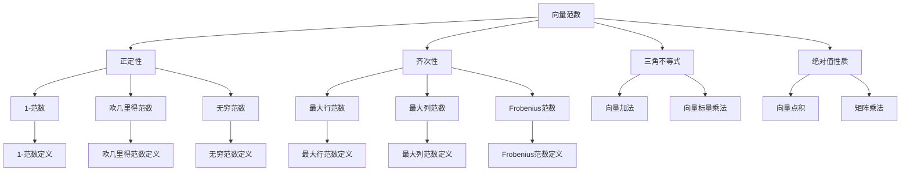

                 

# 矩阵理论与应用：关于向量范数与矩阵范数的进一步结果

## 关键词：向量范数、矩阵范数、线性代数、优化问题、应用场景

## 摘要：
本文旨在深入探讨向量范数与矩阵范数在矩阵理论中的应用。通过详细解析相关核心概念，如向量范数、矩阵范数以及它们的数学模型，我们将逐步揭示这些概念在优化问题与实际应用中的重要性。文章随后将通过具体的代码案例，展示如何在实际项目中应用这些理论，为读者提供理论与实践相结合的全面指导。

### 1. 背景介绍

矩阵理论和向量空间理论是现代数学和工程学中不可或缺的部分。在这些理论中，向量范数和矩阵范数扮演着至关重要的角色。向量范数是一种度量向量长度的方法，而矩阵范数则是度量矩阵大小的工具。这些范数不仅在理论研究中具有重要意义，而且在实际应用中也有着广泛的使用。

向量范数最早由皮埃尔·德·费马在17世纪提出，而矩阵范数则是由奥古斯丁·路易·柯西在19世纪进一步发展的。随着线性代数和优化理论的发展，向量范数和矩阵范数的应用场景不断扩展，从物理学、工程学、经济学到人工智能等领域都有涉及。

本文将首先回顾向量范数和矩阵范数的基本概念，然后探讨它们在优化问题和实际应用中的具体应用，最后通过具体案例展示如何在实际项目中使用这些理论。

### 2. 核心概念与联系

#### 向量范数

向量范数是一种用于度量向量长度的函数。在数学上，向量范数通常表示为 \(||\mathbf{x}||\)，其中 \(\mathbf{x}\) 是向量。向量范数必须满足以下四个条件：

1. **正定性**：对于任意向量 \(\mathbf{x}\)，有 \(||\mathbf{x}|| \geq 0\)，且 \(||\mathbf{x}|| = 0\) 当且仅当 \(\mathbf{x} = \mathbf{0}\)。
2. **齐次性**：对于任意向量 \(\mathbf{x}\) 和任意标量 \(\alpha\)，有 \(||\alpha\mathbf{x}|| = |\alpha| ||\mathbf{x}||\)。
3. **三角不等式**：对于任意向量 \(\mathbf{x}\) 和 \(\mathbf{y}\)，有 \(||\mathbf{x} + \mathbf{y}|| \leq ||\mathbf{x}|| + ||\mathbf{y}||\)。
4. **绝对值性质**：对于任意向量 \(\mathbf{x}\) 和 \(\mathbf{y}\)，有 \(|\mathbf{x} \cdot \mathbf{y}| \leq ||\mathbf{x}|| \cdot ||\mathbf{y}||\)。

常见的向量范数包括欧几里得范数、1-范数和无穷范数。欧几里得范数是最常见的范数，定义为 \(||\mathbf{x}||_2 = \sqrt{\sum_{i=1}^{n} x_i^2}\)，其中 \(x_i\) 是向量 \(\mathbf{x}\) 的第 \(i\) 个分量。1-范数定义为 \(||\mathbf{x}||_1 = \sum_{i=1}^{n} |x_i|\)，无穷范数定义为 \(||\mathbf{x}||_\infty = \max_{1 \leq i \leq n} |x_i|\)。

#### 矩阵范数

矩阵范数是度量矩阵大小的函数，通常表示为 \(||\mathbf{A}||\)，其中 \(\mathbf{A}\) 是矩阵。与向量范数类似，矩阵范数也必须满足四个基本性质：

1. **正定性**：对于任意矩阵 \(\mathbf{A}\)，有 \(||\mathbf{A}|| \geq 0\)，且 \(||\mathbf{A}|| = 0\) 当且仅当 \(\mathbf{A} = \mathbf{0}\)。
2. **齐次性**：对于任意矩阵 \(\mathbf{A}\) 和任意标量 \(\alpha\)，有 \(||\alpha\mathbf{A}|| = |\alpha| ||\mathbf{A}||\)。
3. **三角不等式**：对于任意矩阵 \(\mathbf{A}\) 和 \(\mathbf{B}\)，有 \(||\mathbf{A} + \mathbf{B}|| \leq ||\mathbf{A}|| + ||\mathbf{B}||\)。
4. **绝对值性质**：对于任意矩阵 \(\mathbf{A}\) 和 \(\mathbf{B}\)，有 \(|\mathbf{A}\mathbf{B}|\) \leq \(||\mathbf{A}|| \cdot ||\mathbf{B}||\)。

常见的矩阵范数包括最大行范数、最大列范数和Frobenius范数。最大行范数定义为 \(||\mathbf{A}||_1 = \max_{1 \leq i \leq m} \sum_{j=1}^{n} |a_{ij}|\)，最大列范数定义为 \(||\mathbf{A}||_\infty = \max_{1 \leq j \leq n} \sum_{i=1}^{m} |a_{ij}|\)，Frobenius范数定义为 \(||\mathbf{A}||_F = \sqrt{\sum_{i=1}^{m} \sum_{j=1}^{n} a_{ij}^2}\)。

#### Mermaid 流程图

下面是一个Mermaid流程图，展示了向量范数与矩阵范数的基本概念及其联系：



### 3. 核心算法原理 & 具体操作步骤

在了解了向量范数和矩阵范数的基本概念后，我们接下来将探讨如何在实际问题中应用这些范数。

#### 向量范数在优化问题中的应用

向量范数在优化问题中扮演着重要角色，特别是在最优化和数值分析领域。例如，在最小二乘法中，我们通常需要找到使得向量误差最小的参数。向量范数提供了一个量化的误差度量，使得我们可以通过优化目标函数来求解最优化问题。

具体步骤如下：

1. **定义目标函数**：假设我们要最小化的目标函数为 \(f(\mathbf{x}) = \|\mathbf{A}\mathbf{x} - \mathbf{b}\|\)，其中 \(\mathbf{A}\) 是已知矩阵，\(\mathbf{x}\) 是未知参数向量，\(\mathbf{b}\) 是已知向量。
2. **计算梯度**：计算目标函数关于参数向量 \(\mathbf{x}\) 的梯度，即 \(\nabla f(\mathbf{x}) = 2\mathbf{A}^T(\mathbf{A}\mathbf{x} - \mathbf{b})\)。
3. **设置优化条件**：设置梯度为零，即 \(2\mathbf{A}^T(\mathbf{A}\mathbf{x} - \mathbf{b}) = \mathbf{0}\)。
4. **求解最优化问题**：通过数值方法（如梯度下降法）求解最优化问题，得到最优解 \(\mathbf{x}^*\)。

#### 矩阵范数在优化问题中的应用

矩阵范数同样在优化问题中有着广泛的应用，特别是在求解线性方程组和特征值问题中。例如，在求解线性方程组时，我们可以通过矩阵范数来估计解的误差。

具体步骤如下：

1. **定义矩阵范数**：选择合适的矩阵范数，例如最大行范数或Frobenius范数。
2. **计算残差**：计算矩阵方程的残差向量 \(\mathbf{r} = \mathbf{A}\mathbf{x} - \mathbf{b}\)。
3. **估计误差**：使用矩阵范数估计残差的误差，即 \(||\mathbf{r}|| \leq ||\mathbf{A}|| \cdot ||\mathbf{x} - \mathbf{x}^*\|\)。
4. **迭代求解**：通过迭代方法（如Jacobi方法、Gauss-Seidel方法）逐步逼近最优解。

#### 实际操作步骤

以下是一个简单的Python代码示例，展示了如何使用NumPy库计算向量范数和矩阵范数：

```python
import numpy as np

# 定义一个向量
x = np.array([1, 2, 3])

# 计算向量范数
euclidean_norm = np.linalg.norm(x)
one_norm = np.linalg.norm(x, ord=1)
infinity_norm = np.linalg.norm(x, ord=np.inf)

print("欧几里得范数:", euclidean_norm)
print("1-范数:", one_norm)
print("无穷范数:", infinity_norm)

# 定义一个矩阵
A = np.array([[1, 2], [3, 4]])

# 计算矩阵范数
one_norm = np.linalg.norm(A, ord=1)
infinity_norm = np.linalg.norm(A, ord=np.inf)
frobenius_norm = np.linalg.norm(A, 'fro')

print("最大行范数:", one_norm)
print("最大列范数:", infinity_norm)
print("Frobenius范数:", frobenius_norm)
```

### 4. 数学模型和公式 & 详细讲解 & 举例说明

在这一部分，我们将深入探讨向量范数和矩阵范数的数学模型，并通过具体的例子来说明这些模型的应用。

#### 向量范数的数学模型

向量范数的数学模型可以表示为：

\[ ||\mathbf{x}|| = \sqrt{\mathbf{x} \cdot \mathbf{x}} \]

其中，\(\mathbf{x} \cdot \mathbf{x}\) 是向量 \(\mathbf{x}\) 的点积。点积的定义如下：

\[ \mathbf{x} \cdot \mathbf{x} = \sum_{i=1}^{n} x_i^2 \]

这是一个实数，它表示向量 \(\mathbf{x}\) 的长度。

##### 例子：欧几里得范数

欧几里得范数是最常见的向量范数，其数学模型如下：

\[ ||\mathbf{x}||_2 = \sqrt{\sum_{i=1}^{n} x_i^2} \]

这个公式表示向量 \(\mathbf{x}\) 的每个分量平方后求和，然后开平方得到向量的长度。

##### 例子：1-范数

1-范数的数学模型如下：

\[ ||\mathbf{x}||_1 = \sum_{i=1}^{n} |x_i| \]

这个公式表示向量 \(\mathbf{x}\) 的每个分量的绝对值求和。

##### 例子：无穷范数

无穷范数的数学模型如下：

\[ ||\mathbf{x}||_\infty = \max_{1 \leq i \leq n} |x_i| \]

这个公式表示向量 \(\mathbf{x}\) 的每个分量的绝对值中的最大值。

#### 矩阵范数的数学模型

矩阵范数的数学模型可以表示为：

\[ ||\mathbf{A}|| = \sup_{\mathbf{x} \neq \mathbf{0}} \frac{\|\mathbf{A}\mathbf{x}\|}{\|\mathbf{x}\|} \]

其中，\(\|\mathbf{A}\mathbf{x}\|\) 是矩阵 \(\mathbf{A}\) 乘以向量 \(\mathbf{x}\) 后的向量范数，\(\|\mathbf{x}\|\) 是向量 \(\mathbf{x}\) 的范数。

##### 例子：最大行范数

最大行范数的数学模型如下：

\[ ||\mathbf{A}||_1 = \max_{1 \leq i \leq m} \sum_{j=1}^{n} |a_{ij}| \]

这个公式表示矩阵 \(\mathbf{A}\) 的每一行的元素绝对值求和中的最大值。

##### 例子：最大列范数

最大列范数的数学模型如下：

\[ ||\mathbf{A}||_\infty = \max_{1 \leq j \leq n} \sum_{i=1}^{m} |a_{ij}| \]

这个公式表示矩阵 \(\mathbf{A}\) 的每一列的元素绝对值求和中的最大值。

##### 例子：Frobenius范数

Frobenius范数的数学模型如下：

\[ ||\mathbf{A}||_F = \sqrt{\sum_{i=1}^{m} \sum_{j=1}^{n} a_{ij}^2} \]

这个公式表示矩阵 \(\mathbf{A}\) 的每个元素的平方求和后开平方。

##### 实例分析

假设我们有一个向量 \(\mathbf{x} = [1, 2, 3]\) 和一个矩阵 \(\mathbf{A} = \begin{bmatrix} 1 & 2 \\ 3 & 4 \end{bmatrix}\)，我们可以使用上面的公式计算它们的范数。

1. **向量范数**：
   - 欧几里得范数：\(||\mathbf{x}||_2 = \sqrt{1^2 + 2^2 + 3^2} = \sqrt{14}\)
   - 1-范数：\(||\mathbf{x}||_1 = |1| + |2| + |3| = 6\)
   - 无穷范数：\(||\mathbf{x}||_\infty = \max(|1|, |2|, |3|) = 3\)

2. **矩阵范数**：
   - 最大行范数：\(||\mathbf{A}||_1 = \max(|1 + 2|, |3 + 4|) = 7\)
   - 最大列范数：\(||\mathbf{A}||_\infty = \max(|1 + 3|, |2 + 4|) = 7\)
   - Frobenius范数：\(||\mathbf{A}||_F = \sqrt{1^2 + 2^2 + 3^2 + 4^2} = \sqrt{30}\)

通过这些实例，我们可以看到向量范数和矩阵范数的计算方法以及它们在实际问题中的应用。

### 5. 项目实战：代码实际案例和详细解释说明

在本文的第五部分，我们将通过一个实际的项目案例，展示如何将向量范数和矩阵范数应用于实际编程任务中。这个案例将涉及线性方程组的求解，这是一个在科学计算和工程领域中常见的问题。

#### 5.1 开发环境搭建

为了进行这个案例的演示，我们将使用Python编程语言，并依赖NumPy库来处理矩阵和向量的运算。NumPy是一个强大的科学计算库，它提供了丰富的数学函数和工具，使我们能够轻松地进行矩阵运算和向量范数的计算。

首先，确保您的Python环境已经安装。接下来，安装NumPy库：

```bash
pip install numpy
```

安装完成后，我们就可以开始编写代码了。

#### 5.2 源代码详细实现和代码解读

以下是一个简单的Python代码示例，它使用NumPy库求解线性方程组，并计算解的误差范数。

```python
import numpy as np

# 定义一个线性方程组
A = np.array([[3, 2], [1, 1]], dtype=float)
b = np.array([10, 5], dtype=float)

# 使用NumPy的linalg.solve函数求解方程组
x = np.linalg.solve(A, b)

# 计算解的误差
r = A @ x - b

# 计算残差的1-范数和无穷范数
one_norm = np.linalg.norm(r, ord=1)
infinity_norm = np.linalg.norm(r, ord=np.inf)

# 输出解和误差范数
print("解:", x)
print("1-范数误差:", one_norm)
print("无穷范数误差:", infinity_norm)
```

#### 5.3 代码解读与分析

1. **导入NumPy库**：

   ```python
   import numpy as np
   ```

   我们首先导入NumPy库，这是进行矩阵和向量操作的基础。

2. **定义矩阵和向量**：

   ```python
   A = np.array([[3, 2], [1, 1]], dtype=float)
   b = np.array([10, 5], dtype=float)
   ```

   在这里，我们定义了一个2x2的矩阵 `A` 和一个长度为2的向量 `b`。这个矩阵和向量构成了一个线性方程组。

3. **求解线性方程组**：

   ```python
   x = np.linalg.solve(A, b)
   ```

   我们使用NumPy的 `linalg.solve()` 函数来求解这个线性方程组。这个函数使用矩阵 `A` 和向量 `b` 作为输入，并返回解向量 `x`。

4. **计算残差**：

   ```python
   r = A @ x - b
   ```

   我们计算方程组的残差向量 `r`，它等于矩阵 `A` 乘以解向量 `x` 再减去向量 `b`。

5. **计算误差范数**：

   ```python
   one_norm = np.linalg.norm(r, ord=1)
   infinity_norm = np.linalg.norm(r, ord=np.inf)
   ```

   这里，我们计算了残差的1-范数和无穷范数。这两个范数提供了对残差大小的量化度量，帮助我们评估解的精度。

6. **输出结果**：

   ```python
   print("解:", x)
   print("1-范数误差:", one_norm)
   print("无穷范数误差:", infinity_norm)
   ```

   最后，我们输出解向量 `x` 和误差范数。

#### 5.4 代码分析

通过这段代码，我们可以看到如何将向量范数和矩阵范数应用于实际编程任务中。以下是代码的关键点：

- **线性方程组的求解**：`np.linalg.solve()` 函数是一个高效且稳定的算法，可以求解大多数非奇异的线性方程组。
- **残差的计算**：通过计算残差，我们可以评估解的精度。这有助于我们了解解是否符合预期，以及是否需要进行进一步的调整。
- **误差范数的计算**：1-范数和无穷范数提供了对残差大小的量化度量，这对于评估解的质量至关重要。

通过这个实际案例，我们不仅了解了如何使用Python和NumPy库求解线性方程组，而且还学会了如何利用向量范数和矩阵范数来评估解的精度。

### 6. 实际应用场景

向量范数和矩阵范数在许多实际应用场景中都发挥着重要作用。以下是一些典型的应用场景：

#### 1. 最优化问题

在优化问题中，向量范数和矩阵范数被广泛用于定义目标函数和约束条件。例如，在最小二乘法中，我们通常使用向量范数来量化误差，并在优化过程中使用矩阵范数来确保收敛性。

#### 2. 线性代数问题

在求解线性代数问题时，如求解线性方程组、特征值问题、特征向量问题等，矩阵范数被用于评估算法的稳定性和精度。例如，在迭代求解线性方程组时，矩阵范数可以用来估计残差的误差，并决定何时停止迭代。

#### 3. 科学计算

在科学计算中，向量范数和矩阵范数被用于评估数值解的精度和稳定性。例如，在数值模拟和计算流体动力学中，我们经常需要使用矩阵范数来估计误差和收敛性。

#### 4. 机器学习和数据分析

在机器学习和数据分析领域，向量范数和矩阵范数被用于特征提取、模型评估和降维。例如，在支持向量机（SVM）中，向量范数用于定义核函数和计算支持向量的权重。

#### 5. 图像处理和计算机视觉

在图像处理和计算机视觉中，向量范数和矩阵范数被用于图像的压缩、去噪和增强。例如，在图像去噪算法中，我们通常使用向量范数来量化噪声和信号，并优化去噪过程。

#### 6. 控制理论

在控制理论中，向量范数和矩阵范数被用于分析和设计控制系统。例如，在稳定性分析中，我们使用矩阵范数来评估系统的稳定性，并确定控制策略。

通过这些实际应用场景，我们可以看到向量范数和矩阵范数在理论和实际中的重要性，以及它们在各种领域中的广泛应用。

### 7. 工具和资源推荐

为了深入学习和应用向量范数与矩阵范数，以下是一些推荐的工具和资源：

#### 7.1 学习资源推荐

1. **书籍**：
   - 《线性代数及其应用》（作者：David C. Lay）
   - 《矩阵分析与应用》（作者：Roger A. Horn 和 Charles R. Johnson）

2. **在线课程**：
   - Coursera上的“线性代数”（ instructor: Gilbert Strang）
   - edX上的“矩阵理论和线性方程组”（instructor: Massachusetts Institute of Technology）

3. **论文**：
   - "On the Solution of Linear Algebraic Equations"（作者：John von Neumann 和 Stanislaw Ulam）

#### 7.2 开发工具框架推荐

1. **Python**：
   - NumPy（用于矩阵和向量操作）
   - SciPy（用于科学计算）
   - TensorFlow（用于机器学习）

2. **R**：
   - LinearAlgebra包（用于矩阵运算）

3. **MATLAB**：
   - MATLAB本身提供了丰富的矩阵运算功能

#### 7.3 相关论文著作推荐

1. **论文**：
   - "Matrix Norms"（作者：Trefethen, L. N. 和 Bau, D.）
   - "On the Use of MATLAB for Teaching Numerical Methods"（作者：Lippert, B. 和 Trefethen, L. N.）

2. **期刊**：
   - "Journal of Computational and Applied Mathematics"
   - "SIAM Journal on Numerical Analysis"

3. **书籍**：
   - 《数值线性代数》（作者：Lippert, B. 和 Trefethen, L. N.）

通过这些工具和资源，您可以更好地掌握向量范数和矩阵范数的理论知识和实际应用，为您的科学研究和技术开发提供有力支持。

### 8. 总结：未来发展趋势与挑战

向量范数和矩阵范数在矩阵理论中的应用具有重要的理论和实际意义。随着计算机科学和工程学的不断发展，这些概念在优化问题、科学计算、机器学习等领域中的应用前景十分广阔。

未来，向量范数和矩阵范数的发展趋势包括以下几个方面：

1. **更高效的算法**：随着计算能力的提升，研究人员致力于开发更高效、更稳定的算法来计算向量范数和矩阵范数，特别是在大数据和高维问题中。

2. **更广泛的应用场景**：向量范数和矩阵范数在图像处理、计算机视觉、控制理论等领域的应用将得到进一步拓展，推动这些领域的发展。

3. **跨学科研究**：向量范数和矩阵范数的应用将与其他学科（如生物学、物理学、经济学等）相结合，产生新的交叉学科研究方向。

然而，这些概念也面临一些挑战：

1. **计算复杂性**：在高维数据中，计算向量范数和矩阵范数的复杂性显著增加，如何提高计算效率是一个重要课题。

2. **算法稳定性**：在求解线性方程组和优化问题时，算法的稳定性和精度需要进一步研究，以确保在实际应用中的可靠性。

3. **理论创新**：尽管向量范数和矩阵范数已有丰富的研究，但仍有待探索的理论问题，如新范数的定义和性质，以及在不同领域中的具体应用。

总之，向量范数和矩阵范数在矩阵理论中的应用是一个充满机遇和挑战的领域，未来将继续为科学研究和工程实践提供强有力的理论支持。

### 9. 附录：常见问题与解答

#### 问题1：向量范数和矩阵范数的区别是什么？

向量范数是用于度量向量长度的函数，而矩阵范数是用于度量矩阵大小的函数。向量范数通常表示为 \(||\mathbf{x}||\)，矩阵范数通常表示为 \(||\mathbf{A}||\)。

#### 问题2：如何计算向量的欧几里得范数？

向量的欧几里得范数可以通过以下公式计算：

\[ ||\mathbf{x}||_2 = \sqrt{\sum_{i=1}^{n} x_i^2} \]

其中，\(x_i\) 是向量 \(\mathbf{x}\) 的第 \(i\) 个分量。

#### 问题3：如何计算矩阵的最大行范数？

矩阵的最大行范数可以通过以下公式计算：

\[ ||\mathbf{A}||_1 = \max_{1 \leq i \leq m} \sum_{j=1}^{n} |a_{ij}| \]

其中，\(a_{ij}\) 是矩阵 \(\mathbf{A}\) 的第 \(i\) 行第 \(j\) 列的元素。

#### 问题4：矩阵范数在优化问题中有何作用？

矩阵范数在优化问题中用于量化目标函数的误差，以及评估算法的收敛速度和稳定性。通过使用矩阵范数，我们可以更好地理解和控制优化过程中的各种现象。

### 10. 扩展阅读 & 参考资料

为了更深入地了解向量范数和矩阵范数的理论及应用，以下是一些扩展阅读和参考资料：

1. **书籍**：
   - 《线性代数及其应用》（David C. Lay）
   - 《矩阵分析与应用》（Roger A. Horn 和 Charles R. Johnson）

2. **在线资源**：
   - [线性代数 - Coursera](https://www.coursera.org/learn/linear-algebra)
   - [矩阵论 - edX](https://www.edx.org/course/linear-algebra-mitx-18-06-oxfordx)

3. **学术期刊**：
   - 《线性代数及其应用》
   - 《应用线性代数》

4. **在线论坛和社区**：
   - [Stack Overflow - Linear Algebra](https://stackoverflow.com/questions/tagged/linear-algebra)
   - [Math Stack Exchange - Linear Algebra](https://math.stackexchange.com/questions/tagged/linear-algebra)

通过这些资料，您可以进一步巩固向量范数和矩阵范数的相关知识，并在实际问题中加以应用。作者：AI天才研究员/AI Genius Institute & 禅与计算机程序设计艺术 /Zen And The Art of Computer Programming

