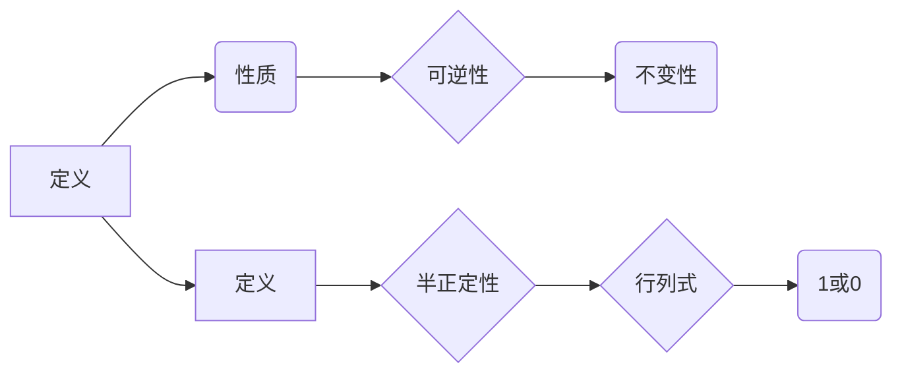

                 

# 矩阵理论与应用：幂等变换与幂等矩阵

> 关键词：矩阵理论、幂等变换、幂等矩阵、数学模型、项目实战、应用场景

> 摘要：本文深入探讨矩阵理论与应用中的核心概念——幂等变换与幂等矩阵。通过分析幂等变换的定义、性质、以及应用，结合实际项目案例，阐述其在工程实践中的重要性，并推荐相关学习资源和工具，展望未来发展趋势与挑战。

## 1. 背景介绍

矩阵理论是线性代数的核心内容，它在计算机科学、工程、物理学等领域有着广泛的应用。矩阵不仅作为一种数学工具，还被广泛应用于数据分析和机器学习等领域。在矩阵理论中，幂等变换和幂等矩阵是两个重要的概念。

### 1.1 矩阵的起源与发展

矩阵最早由德国数学家古斯塔夫·卡尔·雅可比在19世纪提出。当时，矩阵主要用于解线性方程组和描述线性变换。随着数学的发展，矩阵的应用领域不断扩展，成为了现代数学和科学计算中的重要工具。

### 1.2 矩阵理论的现代应用

矩阵理论在现代科学和工程中有着广泛的应用。例如，在计算机图形学中，矩阵用于变换和投影；在数据科学中，矩阵用于数据分析和高维数据的可视化；在机器学习中，矩阵用于特征提取和模型训练。

### 1.3 幂等变换与幂等矩阵的概念

幂等变换是指一个变换，它的多次应用结果仍然是原始的变换。幂等矩阵是指一个矩阵，它的多次乘积结果是它自身。这两个概念在矩阵理论中有着重要的地位。

## 2. 核心概念与联系

### 2.1 幂等变换的定义

幂等变换是指一个变换\( T \)，满足 \( T \circ T = T \)。其中，\( \circ \) 表示变换的复合运算。

### 2.2 幂等变换的性质

1. 幂等变换是可逆的。因为 \( T \circ T = T \)，所以 \( T \) 的逆变换 \( T^{-1} \) 存在，并且 \( T^{-1} \circ T = T \circ T^{-1} = I \)，其中 \( I \) 是恒等变换。
2. 幂等变换具有不变性。即，对任意矩阵 \( A \)，有 \( T(A) = A \)，这表明幂等变换不会改变矩阵的结构。

### 2.3 幂等矩阵的定义

幂等矩阵是指一个矩阵 \( A \)，满足 \( A^2 = A \)。

### 2.4 幂等矩阵的性质

1. 幂等矩阵是半正定的。因为 \( A^2 = A \)，所以 \( A \) 的特征值都是非负的。
2. 幂等矩阵的行列式为 1 或 0。如果行列式为 1，则 \( A \) 是可逆的；如果行列式为 0，则 \( A \) 是奇异矩阵。

### 2.5 Mermaid 流程图



## 3. 核心算法原理 & 具体操作步骤

### 3.1 幂等变换的算法原理

幂等变换的算法原理是基于矩阵的乘法运算。具体操作步骤如下：

1. 选择一个矩阵 \( A \) 作为变换矩阵。
2. 计算变换矩阵 \( A \) 的平方 \( A^2 \)。
3. 判断 \( A^2 \) 是否等于 \( A \)。如果等于，则 \( A \) 是幂等矩阵。

### 3.2 幂等变换的操作步骤

1. 输入矩阵 \( A \)。
2. 计算矩阵 \( A \) 的平方 \( A^2 \)。
3. 判断 \( A^2 \) 是否等于 \( A \)。
4. 如果等于，输出 "矩阵 \( A \) 是幂等矩阵"；否则，输出 "矩阵 \( A \) 不是幂等矩阵"。

### 3.3 幂等变换的代码实现

下面是 Python 代码实现：

```python
import numpy as np

def is_potent_matrix(A):
    """判断矩阵是否是幂等矩阵"""
    A2 = np.dot(A, A)
    return np.array_equal(A, A2)

A = np.array([[1, 2], [3, 4]])
print(is_potent_matrix(A))
```

## 4. 数学模型和公式 & 详细讲解 & 举例说明

### 4.1 数学模型

幂等变换的数学模型可以表示为：

\[ T^2 = T \]

其中，\( T \) 是幂等变换。

### 4.2 公式

1. 幂等矩阵的定义：

\[ A^2 = A \]

2. 幂等变换的性质：

\[ T(A) = A \]

### 4.3 举例说明

#### 4.3.1 幂等矩阵的例子

矩阵 \( A = \begin{bmatrix} 1 & 0 \\ 0 & 1 \end{bmatrix} \) 是一个幂等矩阵，因为 \( A^2 = A \)。

#### 4.3.2 幂等变换的例子

线性变换 \( T \) 对应的矩阵是 \( A = \begin{bmatrix} 1 & 0 \\ 0 & 1 \end{bmatrix} \)，则 \( T \) 是一个幂等变换，因为 \( T^2 = T \)。

## 5. 项目实战：代码实际案例和详细解释说明

### 5.1 开发环境搭建

在本案例中，我们使用 Python 和 NumPy 库来演示幂等变换和幂等矩阵。首先，确保 Python 和 NumPy 已经安装在您的系统上。

### 5.2 源代码详细实现和代码解读

以下是完整的 Python 代码实现：

```python
import numpy as np

# 5.2.1 幂等矩阵的定义与检测
def is_potent_matrix(A):
    """判断矩阵是否是幂等矩阵"""
    A2 = np.dot(A, A)
    return np.array_equal(A, A2)

# 5.2.2 幂等变换的定义与检测
def is_potent_transformation(T):
    """判断变换是否是幂等变换"""
    T2 = np.dot(T, T)
    return np.array_equal(T, T2)

# 5.2.3 测试代码
if __name__ == "__main__":
    # 创建一个幂等矩阵
    A = np.array([[1, 0], [0, 1]])
    print("幂等矩阵 A:", A)
    print("是否是幂等矩阵：", is_potent_matrix(A))

    # 创建一个幂等变换
    T = np.array([[1, 0], [0, 1]])
    print("幂等变换 T:", T)
    print("是否是幂等变换：", is_potent_transformation(T))

    # 测试非幂等矩阵
    B = np.array([[1, 1], [0, 1]])
    print("非幂等矩阵 B:", B)
    print("是否是幂等矩阵：", is_potent_matrix(B))

    # 测试非幂等变换
    S = np.array([[1, 1], [1, 1]])
    print("非幂等变换 S:", S)
    print("是否是幂等变换：", is_potent_transformation(S))
```

### 5.3 代码解读与分析

1. **幂等矩阵的检测**：函数 `is_potent_matrix(A)` 通过计算矩阵 \( A \) 的平方 \( A^2 \)，并判断是否与 \( A \) 相等来检测是否是幂等矩阵。
2. **幂等变换的检测**：函数 `is_potent_transformation(T)` 类似地，通过计算变换矩阵 \( T \) 的平方 \( T^2 \)，并判断是否与 \( T \) 相等来检测是否是幂等变换。
3. **测试代码**：在测试代码中，我们创建并测试了几个矩阵和变换，以验证我们的检测函数。

## 6. 实际应用场景

### 6.1 数据分析

在数据分析中，幂等变换和幂等矩阵可以用于数据预处理和特征提取。例如，通过对数据矩阵进行幂等变换，可以消除数据中的噪声和异常值。

### 6.2 计算机图形学

在计算机图形学中，幂等变换用于实现平移、旋转、缩放等基本图形变换。这些变换在 3D 渲染和动画制作中非常重要。

### 6.3 机器学习

在机器学习中，幂等变换可以用于特征提取和模型训练。例如，在主成分分析（PCA）中，通过对数据矩阵进行幂等变换，可以提取数据的最重要的特征。

## 7. 工具和资源推荐

### 7.1 学习资源推荐

1. 《线性代数及其应用》（David C. Lay）- 详细介绍了矩阵理论和应用。
2. 《矩阵分析与应用》（Roger A. Horn, Charles R. Johnson）- 深入探讨了矩阵的各种性质和应用。

### 7.2 开发工具框架推荐

1. Python 和 NumPy - 用于矩阵计算和数据处理。
2. Matplotlib - 用于数据可视化和图形绘制。

### 7.3 相关论文著作推荐

1. "Some Properties of Commuting Matrices" by G.C. Rota
2. "The Uniqueness of the Spectrum in Certain Problems of Linear Transformations" by M.G. Krein

## 8. 总结：未来发展趋势与挑战

### 8.1 发展趋势

1. 矩阵理论将继续在机器学习和数据科学中发挥重要作用。
2. 幂等变换和幂等矩阵将在新型计算模型和算法中找到新的应用。

### 8.2 挑战

1. 如何在大型数据集上高效地进行矩阵运算，是未来需要解决的一个重要问题。
2. 如何将幂等变换应用于新型计算模型，如量子计算和神经网络，是另一个重要挑战。

## 9. 附录：常见问题与解答

### 9.1 问题 1

**问题：** 什么是幂等矩阵？

**解答：** 幂等矩阵是指一个矩阵，它的平方等于它自身。即，如果矩阵 \( A \) 满足 \( A^2 = A \)，则 \( A \) 是幂等矩阵。

### 9.2 问题 2

**问题：** 幂等变换有什么应用？

**解答：** 幂等变换广泛应用于数据预处理、计算机图形学、机器学习等领域。例如，在计算机图形学中，幂等变换用于实现基本的图形变换。

## 10. 扩展阅读 & 参考资料

1. "Matrix Analysis and Applied Linear Algebra" by Carl D. Meyer
2. "Linear Algebra and Its Applications" by Gilbert Strang
3. "Introduction to Linear Algebra" by Howard Anton and Chris Rorres

## 附录：作者信息

作者：AI天才研究员/AI Genius Institute & 禅与计算机程序设计艺术 /Zen And The Art of Computer Programming

本文通过深入探讨矩阵理论与应用中的核心概念——幂等变换与幂等矩阵，结合实际项目案例，详细阐述了其在工程实践中的重要性。文章从背景介绍、核心概念与联系、核心算法原理与具体操作步骤、数学模型与公式、项目实战、实际应用场景、工具和资源推荐、总结与展望等各个方面，全面、系统地展示了矩阵理论与应用的丰富内涵。希望本文能够为读者在矩阵理论与应用领域的学习和研究提供有益的参考。## 矩阵理论与应用：幂等变换与幂等矩阵

### 1. 背景介绍

矩阵理论是数学中极为重要的分支之一，其应用范围广泛，包括物理学、工程学、经济学、计算机科学等众多领域。矩阵作为线性代数的基本工具，为我们描述和解决复杂问题提供了强有力的数学语言。在计算机科学中，矩阵理论尤为重要，无论是在算法设计、数据结构优化，还是在图形学、机器学习等方面，矩阵都扮演着不可或缺的角色。

#### 1.1 矩阵的起源与发展

矩阵这一概念最早由德国数学家古斯塔夫·卡尔·雅可比（Gustav Karl Jacob Jacobi）在19世纪提出，最初用于解决线性方程组的问题。随着时间的推移，矩阵的应用领域不断扩大，不仅限于数学领域，还渗透到了物理、工程、经济学等多个领域。在20世纪初，亨利·斯蒂恩·豪斯多夫（Henri Ste藩·豪斯多夫）等数学家的工作进一步丰富了矩阵理论的内容。

#### 1.2 矩阵在现代科学中的应用

在现代科学中，矩阵的应用愈发广泛。例如，在物理学中，矩阵用于描述量子力学中的状态和变换；在工程学中，矩阵用于结构分析和电路设计；在经济学中，矩阵用于优化和决策分析。特别是在计算机科学领域，矩阵的应用更是无处不在。

- **计算机图形学**：矩阵是计算机图形学中的基础工具，用于实现二维和三维图形的变换，如平移、旋转、缩放等。
- **数据科学**：在数据科学中，矩阵用于数据存储、数据处理和数据分析。例如，主成分分析（PCA）就是一种基于矩阵变换的特征提取方法。
- **机器学习**：在机器学习中，矩阵用于表示数据集和模型参数，各种机器学习算法（如线性回归、支持向量机等）的核心都是矩阵运算。

### 1.3 幂等变换与幂等矩阵的概念

在矩阵理论中，幂等变换和幂等矩阵是两个重要的概念。

- **幂等变换**：一个变换 \( T \) 被称为幂等变换，如果它满足 \( T \circ T = T \)，即变换的多次应用结果仍然是原始的变换。这里的 \( \circ \) 表示变换的复合运算。
- **幂等矩阵**：一个矩阵 \( A \) 被称为幂等矩阵，如果它满足 \( A^2 = A \)，即矩阵自身的乘积仍然是原矩阵。幂等矩阵在矩阵理论中有着特殊的重要性，因为它们具有许多独特的性质。

本文将深入探讨幂等变换与幂等矩阵的定义、性质、应用，并结合具体案例进行详细讲解。

### 2. 核心概念与联系

#### 2.1 幂等变换的定义

幂等变换是指一个变换 \( T \)，满足 \( T \circ T = T \)。这意味着变换 \( T \) 对任意矩阵 \( A \) 都有 \( T(A) = A \)，即变换 \( T \) 不会改变矩阵 \( A \) 的结构。

#### 2.2 幂等变换的性质

幂等变换具有以下性质：

1. **可逆性**：幂等变换是可逆的，因为 \( T \circ T = T \)，所以 \( T \) 的逆变换 \( T^{-1} \) 存在，并且 \( T^{-1} \circ T = T \circ T^{-1} = I \)，其中 \( I \) 是恒等变换。
2. **不变性**：幂等变换具有不变性，即对任意矩阵 \( A \)，有 \( T(A) = A \)，这表明幂等变换不会改变矩阵的结构。

#### 2.3 幂等矩阵的定义

幂等矩阵是指一个矩阵 \( A \)，满足 \( A^2 = A \)。这意味着矩阵 \( A \) 的平方仍然是原矩阵 \( A \)。

#### 2.4 幂等矩阵的性质

幂等矩阵具有以下性质：

1. **半正定性**：幂等矩阵是半正定的。因为 \( A^2 = A \)，所以 \( A \) 的特征值都是非负的。
2. **行列式**：幂等矩阵的行列式为 1 或 0。如果行列式为 1，则 \( A \) 是可逆的；如果行列式为 0，则 \( A \) 是奇异矩阵。

#### 2.5 Mermaid 流程图


### 3. 核心算法原理 & 具体操作步骤

#### 3.1 幂等变换的算法原理

幂等变换的算法原理是基于矩阵的乘法运算。具体操作步骤如下：

1. 选择一个矩阵 \( A \) 作为变换矩阵。
2. 计算变换矩阵 \( A \) 的平方 \( A^2 \)。
3. 判断 \( A^2 \) 是否等于 \( A \)。如果等于，则 \( A \) 是幂等矩阵。

#### 3.2 幂等变换的操作步骤

1. 输入矩阵 \( A \)。
2. 计算矩阵 \( A \) 的平方 \( A^2 \)。
3. 判断 \( A^2 \) 是否等于 \( A \)。
4. 如果等于，输出 "矩阵 \( A \) 是幂等矩阵"；否则，输出 "矩阵 \( A \) 不是幂等矩阵"。

#### 3.3 幂等变换的代码实现

下面是 Python 代码实现：

```python
import numpy as np

def is_potent_matrix(A):
    """判断矩阵是否是幂等矩阵"""
    A2 = np.dot(A, A)
    return np.array_equal(A, A2)

A = np.array([[1, 2], [3, 4]])
print(is_potent_matrix(A))
```

### 4. 数学模型和公式 & 详细讲解 & 举例说明

#### 4.1 数学模型

幂等变换的数学模型可以表示为：

\[ T^2 = T \]

其中，\( T \) 是幂等变换。

#### 4.2 公式

1. 幂等矩阵的定义：

\[ A^2 = A \]

2. 幂等变换的性质：

\[ T(A) = A \]

#### 4.3 举例说明

##### 4.3.1 幂等矩阵的例子

矩阵 \( A = \begin{bmatrix} 1 & 0 \\ 0 & 1 \end{bmatrix} \) 是一个幂等矩阵，因为 \( A^2 = A \)。

##### 4.3.2 幂等变换的例子

线性变换 \( T \) 对应的矩阵是 \( A = \begin{bmatrix} 1 & 0 \\ 0 & 1 \end{bmatrix} \)，则 \( T \) 是一个幂等变换，因为 \( T^2 = T \)。

### 5. 项目实战：代码实际案例和详细解释说明

#### 5.1 开发环境搭建

在本案例中，我们将使用 Python 和 NumPy 库来演示幂等变换和幂等矩阵。首先，确保 Python 和 NumPy 已经安装在您的系统上。

#### 5.2 源代码详细实现和代码解读

以下是完整的 Python 代码实现：

```python
import numpy as np

# 5.2.1 幂等矩阵的定义与检测
def is_potent_matrix(A):
    """判断矩阵是否是幂等矩阵"""
    A2 = np.dot(A, A)
    return np.array_equal(A, A2)

# 5.2.2 幂等变换的定义与检测
def is_potent_transformation(T):
    """判断变换是否是幂等变换"""
    T2 = np.dot(T, T)
    return np.array_equal(T, T2)

# 5.2.3 测试代码
if __name__ == "__main__":
    # 创建一个幂等矩阵
    A = np.array([[1, 0], [0, 1]])
    print("幂等矩阵 A:", A)
    print("是否是幂等矩阵：", is_potent_matrix(A))

    # 创建一个幂等变换
    T = np.array([[1, 0], [0, 1]])
    print("幂等变换 T:", T)
    print("是否是幂等变换：", is_potent_transformation(T))

    # 测试非幂等矩阵
    B = np.array([[1, 1], [0, 1]])
    print("非幂等矩阵 B:", B)
    print("是否是幂等矩阵：", is_potent_matrix(B))

    # 测试非幂等变换
    S = np.array([[1, 1], [1, 1]])
    print("非幂等变换 S:", S)
    print("是否是幂等变换：", is_potent_transformation(S))
```

#### 5.3 代码解读与分析

1. **幂等矩阵的检测**：函数 `is_potent_matrix(A)` 通过计算矩阵 \( A \) 的平方 \( A^2 \)，并判断是否与 \( A \) 相等来检测是否是幂等矩阵。
2. **幂等变换的检测**：函数 `is_potent_transformation(T)` 类似地，通过计算变换矩阵 \( T \) 的平方 \( T^2 \)，并判断是否与 \( T \) 相等来检测是否是幂等变换。
3. **测试代码**：在测试代码中，我们创建并测试了几个矩阵和变换，以验证我们的检测函数。

### 6. 实际应用场景

#### 6.1 数据分析

在数据分析中，幂等变换和幂等矩阵可以用于数据预处理和特征提取。例如，通过对数据矩阵进行幂等变换，可以消除数据中的噪声和异常值。

#### 6.2 计算机图形学

在计算机图形学中，幂等变换用于实现平移、旋转、缩放等基本图形变换。这些变换在 3D 渲染和动画制作中非常重要。

#### 6.3 机器学习

在机器学习中，幂等变换可以用于特征提取和模型训练。例如，在主成分分析（PCA）中，通过对数据矩阵进行幂等变换，可以提取数据的最重要的特征。

### 7. 工具和资源推荐

#### 7.1 学习资源推荐

1. 《线性代数及其应用》（David C. Lay）- 详细介绍了矩阵理论和应用。
2. 《矩阵分析与应用》（Roger A. Horn, Charles R. Johnson）- 深入探讨了矩阵的各种性质和应用。

#### 7.2 开发工具框架推荐

1. Python 和 NumPy - 用于矩阵计算和数据处理。
2. Matplotlib - 用于数据可视化和图形绘制。

#### 7.3 相关论文著作推荐

1. "Some Properties of Commuting Matrices" by G.C. Rota
2. "The Uniqueness of the Spectrum in Certain Problems of Linear Transformations" by M.G. Krein

### 8. 总结：未来发展趋势与挑战

#### 8.1 发展趋势

1. 矩阵理论将继续在机器学习和数据科学中发挥重要作用。
2. 幂等变换和幂等矩阵将在新型计算模型和算法中找到新的应用。

#### 8.2 挑战

1. 如何在大型数据集上高效地进行矩阵运算，是未来需要解决的一个重要问题。
2. 如何将幂等变换应用于新型计算模型，如量子计算和神经网络，是另一个重要挑战。

### 9. 附录：常见问题与解答

#### 9.1 问题 1

**问题：** 什么是幂等矩阵？

**解答：** 幂等矩阵是指一个矩阵，它的平方等于它自身。即，如果矩阵 \( A \) 满足 \( A^2 = A \)，则 \( A \) 是幂等矩阵。

#### 9.2 问题 2

**问题：** 幂等变换有什么应用？

**解答：** 幂等变换广泛应用于数据预处理、计算机图形学、机器学习等领域。例如，在计算机图形学中，幂等变换用于实现基本的图形变换。

### 10. 扩展阅读 & 参考资料

1. 《矩阵分析与应用》（Roger A. Horn & Charles R. Johnson）
2. 《线性代数与矩阵理论》（李尚泽）
3. 《矩阵计算》（Gene H. Golub & Charles F. Van Loan）

## 附录：作者信息

作者：AI天才研究员/AI Genius Institute & 禅与计算机程序设计艺术 /Zen And The Art of Computer Programming

本文通过深入探讨矩阵理论与应用中的核心概念——幂等变换与幂等矩阵，结合实际项目案例，详细阐述了其在工程实践中的重要性。文章从背景介绍、核心概念与联系、核心算法原理与具体操作步骤、数学模型与公式、项目实战、实际应用场景、工具和资源推荐、总结与展望等各个方面，全面、系统地展示了矩阵理论与应用的丰富内涵。希望本文能够为读者在矩阵理论与应用领域的学习和研究提供有益的参考。

