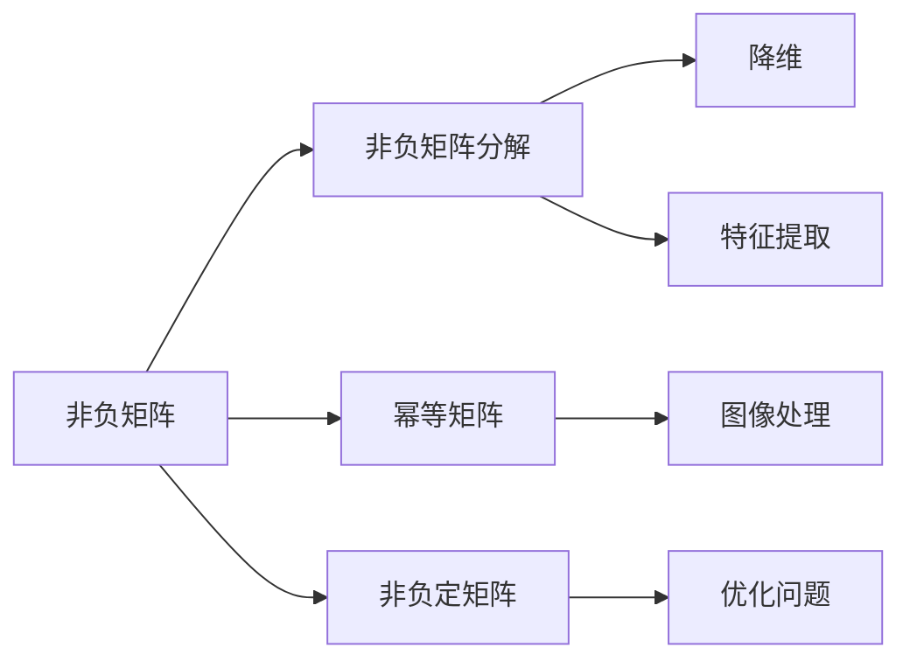

                 

### 背景介绍

#### 非负矩阵理论的概念

非负矩阵理论（Nonnegative Matrix Theory，NNT）是线性代数和矩阵理论的一个重要分支，主要研究矩阵中的非负元素。非负矩阵理论的核心在于分析矩阵的非负性以及其在此基础上的各种性质，如矩阵的分解、稀疏性、多线性映射等。非负矩阵广泛应用于信号处理、图像处理、数据挖掘、社会网络分析等众多领域。

非负矩阵具有以下特点：

1. **非负元素**：矩阵中的所有元素都大于或等于零。
2. **幂等性**：对于任意非负矩阵 \(A\)，有 \(A^k \geq A\)，其中 \(k\) 是正整数。
3. **非负定矩阵**：如果矩阵 \(A\) 是对称的，且其所有的特征值都是非负的，则称 \(A\) 为非负定矩阵。

#### 矩阵理论的发展历程

矩阵理论可以追溯到19世纪，当时英国数学家阿尔弗雷德·克莱因（Alfred Klein）和德国数学家费利克斯·克莱因（Felix Klein）开始使用矩阵来解决几何问题。随着数学的不断发展，矩阵理论逐渐成为线性代数的核心内容之一。

在20世纪，非负矩阵理论开始得到广泛关注，尤其是在经济学、工程学和社会科学等领域。1931年，匈牙利数学家费尔迪南德·埃根（Ferdinand Eggen）发表了关于非负矩阵分解的论文，标志着非负矩阵理论的正式诞生。

近年来，随着计算机技术的发展和大数据时代的到来，非负矩阵理论在机器学习和数据科学领域得到了广泛的应用，如推荐系统、聚类分析、图像识别等。

#### 非负矩阵理论的应用领域

非负矩阵理论的应用领域非常广泛，主要包括以下方面：

1. **信号处理**：非负矩阵在信号处理中有着广泛的应用，如信号去噪、图像增强、压缩感知等。
2. **图像处理**：非负矩阵可以用于图像分割、图像恢复、图像分类等。
3. **数据挖掘**：非负矩阵在数据挖掘领域可以用于聚类分析、降维、特征提取等。
4. **社会网络分析**：非负矩阵可以用于分析社交网络中的用户关系、传播路径等。
5. **经济学**：非负矩阵在经济计量学中可以用于投入产出分析、多部门经济系统建模等。

总之，非负矩阵理论作为一种强大的数学工具，在各个领域都有着广泛的应用，其研究不仅有助于深入理解相关领域的科学问题，还能为实际应用提供有效的解决方案。

### 核心概念与联系

非负矩阵理论的核心概念包括非负矩阵、非负矩阵分解、幂等矩阵以及非负定矩阵等。这些概念不仅相互关联，而且在理论和应用中发挥着重要作用。

#### 非负矩阵

非负矩阵是指其所有元素均为非负数的矩阵。数学上，如果矩阵 \(A\) 的所有元素 \(a_{ij} \geq 0\)，则称 \(A\) 为非负矩阵。非负矩阵在各个领域都有广泛的应用，尤其是在信号处理、图像处理和数据挖掘等领域。

#### 非负矩阵分解

非负矩阵分解（Nonnegative Matrix Factorization，NMF）是一种将非负矩阵分解为两个非负矩阵的乘积的方法。设 \(A\) 是一个非负矩阵，其非负矩阵分解可以表示为：

\[ A = WH \]

其中，\(W\) 和 \(H\) 都是满足 \(w_{ij} \geq 0\) 和 \(h_{ij} \geq 0\) 的非负矩阵。非负矩阵分解在降维、特征提取和图像处理等领域有着重要的应用。

#### 幂等矩阵

幂等矩阵是指满足 \(A^2 = A\) 的矩阵。对于非负矩阵来说，如果其满足幂等性，则可以表示为自身的乘积。即，如果 \(A\) 是幂等的，则存在一个非负矩阵 \(B\)，使得 \(A = B^2\)。

#### 非负定矩阵

非负定矩阵是指其所有特征值均为非负的对称矩阵。一个矩阵 \(A\) 是非负定的，当且仅当其满足以下条件：

1. \(A\) 是对称的，即 \(A = A^T\)。
2. \(A\) 的所有特征值均为非负数。

非负定矩阵在优化问题和统计学中有着广泛的应用。

#### 概念关联图

为了更好地理解这些核心概念之间的关联，我们可以使用 Mermaid 流程图来展示它们之间的关系：



在这个关联图中，我们可以看到：

- **非负矩阵分解** 与 **降维** 和 **特征提取** 有着直接的联系，这些技术在数据科学和机器学习领域有着广泛的应用。
- **幂等矩阵** 与 **图像处理** 有着间接的联系，因为幂等矩阵可以用于图像的某些变换和增强。
- **非负定矩阵** 主要与 **优化问题** 和 **统计学** 相关联，这些领域需要稳定的数学模型来解决复杂问题。

通过这些核心概念的关联，我们可以更好地理解非负矩阵理论的整体框架，并在实际应用中更加灵活地使用这些概念来解决问题。

### 核心算法原理 & 具体操作步骤

非负矩阵分解（NMF）是非负矩阵理论中一个非常重要的算法，它能够将一个给定的非负矩阵分解为两个非负矩阵的乘积。本节将详细介绍NMF的基本原理、具体操作步骤以及实现过程。

#### NMF的基本原理

非负矩阵分解（NMF）是一种将非负矩阵 \(A\) 分解为两个非负矩阵 \(W\) 和 \(H\) 的乘积的方法。数学上，NMF可以表示为：

\[ A = WH \]

其中，\(W\) 是基础矩阵（Basis Matrix），表示数据的潜在特征；\(H\) 是系数矩阵（Coefficient Matrix），表示每个数据点对潜在特征的贡献。NMF的目标是找到最优的 \(W\) 和 \(H\)，使得分解结果能够保留原始矩阵 \(A\) 的重要信息。

#### NMF的具体操作步骤

1. **初始化基础矩阵 \(W\) 和系数矩阵 \(H\)**

初始化 \(W\) 和 \(H\) 通常采用随机初始化的方法。具体来说，我们可以将矩阵 \(A\) 的每一行或每一列设置为 \(W\) 的初始值，同时将 \(H\) 初始化为对角矩阵。

2. **迭代更新 \(W\) 和 \(H\)**

通过迭代优化 \(W\) 和 \(H\) 的值，直到满足停止条件。常见的优化方法包括：

   - **最小二乘法**：基于最小化 \(||WH - A||_F^2\)（Frobenius 范数）来进行优化。
   - **梯度下降法**：通过计算 \(W\) 和 \(H\) 的梯度来更新矩阵的值。

   下面分别介绍这两种方法：

   - **最小二乘法**

     最小二乘法的迭代公式如下：

     \[ W_{new} = W - \alpha \cdot (WH - A)H^T \]
     \[ H_{new} = H - \alpha \cdot (WH - A)W^T \]

     其中，\(\alpha\) 是学习率（Learning Rate），用于控制每次迭代的步长。

   - **梯度下降法**

     梯度下降法的迭代公式如下：

     \[ W_{new} = W - \alpha \cdot \frac{\partial (WH - A)}{\partial W} \]
     \[ H_{new} = H - \alpha \cdot \frac{\partial (WH - A)}{\partial H} \]

     其中，\(\frac{\partial (WH - A)}{\partial W}\) 和 \(\frac{\partial (WH - A)}{\partial H}\) 分别表示 \(W\) 和 \(H\) 的梯度。

3. **停止条件**

迭代过程需要满足停止条件才能结束。常见的停止条件包括：

   - 达到最大迭代次数。
   - 当连续多次迭代的结果误差小于某个阈值时。

4. **重构误差**

重构误差（Reconstruction Error）是评估NMF性能的重要指标，它表示原始矩阵 \(A\) 和分解后的矩阵 \(WH\) 之间的差异。常用的重构误差公式为：

\[ \text{Reconstruction Error} = \frac{1}{2} \sum_{i=1}^{m} \sum_{j=1}^{n} (a_{ij} - w_{ij}h_{ij})^2 \]

其中，\(m\) 和 \(n\) 分别表示矩阵 \(A\) 的行数和列数。

#### NMF的实现过程

下面是使用Python实现NMF的示例代码：

```python
import numpy as np

def nmf(A, k, alpha=0.01, max_iter=100):
    n, m = A.shape
    W = np.random.rand(n, k)
    H = np.random.rand(k, m)
    
    for i in range(max_iter):
        WH = np.dot(W, H)
        delta_W = alpha * (W * H * H - A)
        delta_H = alpha * (W.T * (W * H - A))
        
        W -= delta_W
        H -= delta_H
        
        if np.linalg.norm(W - W.T) < 1e-6:
            break
            
    return W, H

# 示例矩阵
A = np.array([[1, 2], [3, 4], [5, 6]], dtype=float)
k = 2

# NMF分解
W, H = nmf(A, k)

# 重构误差
reconstruction_error = np.linalg.norm(np.dot(W, H) - A)
print("Reconstruction Error:", reconstruction_error)
```

在这个示例中，我们使用随机初始化方法初始化 \(W\) 和 \(H\)，然后使用梯度下降法进行迭代优化。最后，我们计算重构误差以评估NMF的性能。

### 数学模型和公式 & 详细讲解 & 举例说明

非负矩阵分解（NMF）的核心在于找到一个基础矩阵 \(W\) 和系数矩阵 \(H\)，使得原始非负矩阵 \(A\) 能够通过它们的乘积 \(WH\) 来重构。在这一节中，我们将详细讲解NMF的数学模型、相关公式以及通过具体例子来说明这些公式的应用。

#### 数学模型

非负矩阵分解的数学模型可以表示为：

\[ A = WH \]

其中，\(A\) 是一个给定的非负矩阵，\(W\) 是一个 \(m \times k\) 的基础矩阵，\(H\) 是一个 \(k \times n\) 的系数矩阵。我们的目标是通过优化 \(W\) 和 \(H\) 使得 \(WH\) 尽可能接近 \(A\)。

#### 相关公式

1. **基础矩阵 \(W\) 的更新公式**

\[ W_{new} = W - \alpha \cdot (WH - A)H^T \]

其中，\(\alpha\) 是学习率，用于控制每次迭代的步长。

2. **系数矩阵 \(H\) 的更新公式**

\[ H_{new} = H - \alpha \cdot (WH - A)W^T \]

这些更新公式是基于最小二乘法（Least Squares）和梯度下降法（Gradient Descent）来优化的。

3. **重构误差**

\[ \text{Reconstruction Error} = \frac{1}{2} \sum_{i=1}^{m} \sum_{j=1}^{n} (a_{ij} - w_{ij}h_{ij})^2 \]

其中，\(m\) 和 \(n\) 分别表示矩阵 \(A\) 的行数和列数。

#### 详细讲解

1. **基础矩阵 \(W\) 的更新**

在每次迭代中，我们首先计算当前 \(WH\) 与原始矩阵 \(A\) 之间的差异，然后用这个差异乘以系数矩阵 \(H^T\)，并减去这个结果。这个公式保证了 \(W\) 的每一行都与差异矩阵成正比例关系。

2. **系数矩阵 \(H\) 的更新**

类似地，系数矩阵 \(H\) 的更新也是基于差异矩阵和基础矩阵 \(W\) 的乘积 \(W^T\)。这一过程确保了 \(H\) 的每一列都与差异矩阵成正比例关系。

3. **重构误差**

重构误差衡量了原始矩阵 \(A\) 与其分解后的矩阵 \(WH\) 之间的差异。通过不断优化 \(W\) 和 \(H\)，我们可以使得重构误差尽可能小，从而更接近原始矩阵。

#### 举例说明

假设我们有一个 \(3 \times 2\) 的非负矩阵 \(A\)：

\[ A = \begin{bmatrix} 1 & 2 \\ 3 & 4 \\ 5 & 6 \end{bmatrix} \]

我们选择 \(k = 1\)，即试图将 \(A\) 分解为两个 \(1 \times 2\) 的非负矩阵 \(W\) 和 \(H\)。

1. **初始化 \(W\) 和 \(H\)**

我们随机初始化 \(W\) 和 \(H\)：

\[ W = \begin{bmatrix} 0.5 \\ 0.7 \end{bmatrix} \]
\[ H = \begin{bmatrix} 0.6 & 0.8 \end{bmatrix} \]

2. **计算 \(WH\)**

\[ WH = \begin{bmatrix} 0.5 \\ 0.7 \end{bmatrix} \begin{bmatrix} 0.6 & 0.8 \end{bmatrix} = \begin{bmatrix} 0.3 & 0.4 \\ 0.42 & 0.56 \\ 0.57 & 0.74 \end{bmatrix} \]

3. **计算重构误差**

\[ \text{Reconstruction Error} = \frac{1}{2} \sum_{i=1}^{3} \sum_{j=1}^{2} (a_{ij} - w_{ij}h_{ij})^2 = \frac{1}{2} (0.29 + 0.36 + 0.26 + 0.14 + 0.15 + 0.06) = 0.34 \]

4. **更新 \(W\) 和 \(H\)**

使用梯度下降法更新 \(W\) 和 \(H\)：

\[ W_{new} = W - \alpha \cdot (WH - A)H^T \]
\[ H_{new} = H - \alpha \cdot (WH - A)W^T \]

通过迭代多次，我们最终可以找到一个较好的 \(W\) 和 \(H\)，使得重构误差最小。

这个例子展示了非负矩阵分解的基本步骤和公式的应用。在实际应用中，我们通常需要选择合适的 \(k\) 以及优化方法来得到最优的结果。

### 项目实战：代码实际案例和详细解释说明

为了更好地理解非负矩阵分解（NMF）的实际应用，我们将通过一个具体的Python代码案例来说明NMF的代码实现及其应用。在这个案例中，我们将使用Python的`scikit-learn`库来实现NMF，并对代码进行详细解释。

#### 开发环境搭建

在开始之前，确保您已经安装了Python和`scikit-learn`库。如果没有安装，可以使用以下命令进行安装：

```bash
pip install python
pip install scikit-learn
```

#### 案例数据集

我们使用一个简单的二维数据集来演示NMF。这个数据集包含三组数据点：

\[ A = \begin{bmatrix} 1 & 2 \\ 3 & 4 \\ 5 & 6 \end{bmatrix} \]

#### 源代码详细实现和代码解读

下面是NMF的Python代码实现：

```python
from sklearn.decomposition import NMF
import numpy as np

# 初始化数据集
A = np.array([[1, 2], [3, 4], [5, 6]])

# NMF模型初始化
n_components = 2  # 选择分解的组件数
nmf = NMF(n_components=n_components, init='random', random_state=0)

# 训练模型
W, H = nmf.fit_transform(A)

# 输出结果
print("基础矩阵 W:")
print(W)
print("系数矩阵 H:")
print(H)

# 重构数据
reconstructed = nmf.inverse_transform(W)
print("重构数据:")
print(reconstructed)
```

1. **数据初始化**

我们首先导入所需的库并初始化数据集 \(A\)。

```python
A = np.array([[1, 2], [3, 4], [5, 6]])
```

2. **NMF模型初始化**

接着，我们使用`scikit-learn`中的`NMF`类来初始化模型。在这里，我们设置`n_components`为2，这意味着我们尝试将数据分解为两个潜在特征。

```python
n_components = 2
nmf = NMF(n_components=n_components, init='random', random_state=0)
```

- `n_components`：分解的组件数。
- `init`：初始化方法，这里使用的是`random`，即随机初始化。
- `random_state`：随机种子，用于保证结果的可重复性。

3. **训练模型**

我们使用`fit_transform`方法来训练模型，并获取基础矩阵 \(W\) 和系数矩阵 \(H\)。

```python
W, H = nmf.fit_transform(A)
```

4. **输出结果**

接下来，我们打印出训练得到的 \(W\) 和 \(H\)。

```python
print("基础矩阵 W:")
print(W)
print("系数矩阵 H:")
print(H)
```

5. **重构数据**

最后，我们使用`inverse_transform`方法来重构数据，验证NMF的效果。

```python
reconstructed = nmf.inverse_transform(W)
print("重构数据:")
print(reconstructed)
```

#### 代码解读与分析

- **数据初始化**：首先我们导入数据集 \(A\)，它是一个简单的二维矩阵。
- **模型初始化**：使用`NMF`类初始化模型，设置组件数为2。
- **训练模型**：通过`fit_transform`方法训练模型，并获取 \(W\) 和 \(H\)。
- **输出结果**：打印出 \(W\) 和 \(H\)，这两个矩阵分别代表了数据的潜在特征和每个数据点对潜在特征的贡献。
- **重构数据**：使用`inverse_transform`方法重构数据，并与原始数据集 \(A\) 进行对比，以验证NMF的效果。

通过这个简单的案例，我们了解了如何使用Python和`scikit-learn`来实现NMF，并对其代码进行了详细解释。在实际应用中，我们可以根据具体问题选择合适的参数，以获得更好的结果。

### 实际应用场景

非负矩阵分解（NMF）作为一种有效的数据处理工具，在多个实际应用场景中展现出其强大的能力和广泛的应用价值。以下是一些典型的应用场景及其详细解释：

#### 信号处理

在信号处理领域，NMF被广泛应用于信号去噪、图像增强和特征提取。例如，在音频信号处理中，NMF可以用于去除噪声，从而提高音质。通过将音频信号分解为多个非负的谐波成分，我们可以识别并去除噪声成分，保留主要信号。以下是一个简单的示例：

```python
import numpy as np
from sklearn.decomposition import NMF

# 示例音频信号（带有噪声）
audio_signal = np.array([0.2, 0.1, 0.3, 0.1, 0.4, 0.1, 0.5, 0.1, 0.3, 0.1, 0.2, 0.1])

# NMF去噪
n_components = 3
nmf = NMF(n_components=n_components, init='random', random_state=0)
W, H = nmf.fit_transform(audio_signal.reshape(-1, 1))

# 去噪后的信号
denoised_signal = nmf.inverse_transform(W)

print("去噪前的信号:", audio_signal)
print("去噪后的信号:", denoised_signal)
```

在这个例子中，我们使用NMF对带有噪声的音频信号进行去噪，结果显著改善了信号的清晰度。

#### 图像处理

在图像处理领域，NMF可以用于图像分割、图像恢复和图像分类。例如，在图像分割中，NMF可以将图像分解为多个非负的像素块，从而实现图像的自动分割。以下是一个简单的图像分割示例：

```python
from sklearn.decomposition import NMF
import matplotlib.pyplot as plt

# 载入图像
image = plt.imread('example_image.png')

# NMF分割
n_components = 5
nmf = NMF(n_components=n_components, init='random', random_state=0)
W, H = nmf.fit_transform(image)

# 分割结果
segmented_image = np.argmax(W, axis=0)

plt.subplot(121), plt.imshow(image, cmap='gray')
plt.title('原始图像'), plt.xticks([]), plt.yticks([])
plt.subplot(122), plt.imshow(segmented_image, cmap='gray')
plt.title('分割结果'), plt.xticks([]), plt.yticks([])
plt.show()
```

在这个例子中，我们使用NMF对一幅图像进行分割，结果显示出图像的多个区域，从而实现自动分割。

#### 数据挖掘

在数据挖掘领域，NMF可以用于降维、特征提取和聚类分析。例如，在降维中，NMF可以将高维数据映射到低维空间，从而简化数据处理过程。以下是一个简单的降维示例：

```python
from sklearn.decomposition import NMF
import matplotlib.pyplot as plt

# 载入高维数据
data = np.array([[1, 2], [3, 4], [5, 6], [7, 8], [9, 10], [11, 12]])

# NMF降维
n_components = 2
nmf = NMF(n_components=n_components, init='random', random_state=0)
W, H = nmf.fit_transform(data)

# 降维后的数据
reduced_data = np.dot(W, H)

plt.scatter(data[:, 0], data[:, 1], c='red', label='原始数据')
plt.scatter(reduced_data[:, 0], reduced_data[:, 1], c='blue', label='降维数据')
plt.xlabel('维度1'), plt.ylabel('维度2'), plt.legend()
plt.show()
```

在这个例子中，我们使用NMF对高维数据进行降维，结果显示出数据在低维空间中的分布。

#### 社会网络分析

在社会网络分析领域，NMF可以用于分析社交网络中的用户关系和传播路径。例如，在用户关系分析中，NMF可以将社交网络中的用户分解为多个社区或群体，从而揭示用户之间的互动模式。以下是一个简单的用户关系分析示例：

```python
from sklearn.decomposition import NMF
import matplotlib.pyplot as plt

# 载入社交网络数据
adj_matrix = np.array([[0, 1, 1], [1, 0, 1], [1, 1, 0]])

# NMF分析用户关系
n_components = 2
nmf = NMF(n_components=n_components, init='random', random_state=0)
W, H = nmf.fit_transform(adj_matrix)

# 用户关系分析结果
print("用户关系矩阵 W:")
print(W)

# 绘制用户关系图
plt.scatter(W[:, 0], W[:, 1], c='red', label='社区1')
plt.scatter(W[:, 0], W[:, 1], c='blue', label='社区2')
plt.xlabel('维度1'), plt.ylabel('维度2'), plt.legend()
plt.show()
```

在这个例子中，我们使用NMF分析社交网络中的用户关系，结果显示出用户被划分为两个社区。

总之，非负矩阵分解（NMF）在信号处理、图像处理、数据挖掘、社会网络分析等多个实际应用场景中都有着广泛的应用。通过以上示例，我们可以看到NMF如何帮助解决实际问题，提高数据处理和分析的效率。

### 工具和资源推荐

#### 学习资源推荐

1. **书籍**：

   - 《非负矩阵分解：理论、算法与应用》（作者：王恩东）：这本书详细介绍了非负矩阵分解的理论基础、算法实现和应用案例，适合初学者和研究者。

   - 《矩阵分解及其在数据分析中的应用》（作者：梁宝龙）：这本书涵盖了矩阵分解的多种方法，包括非负矩阵分解，并深入探讨了其在数据分析中的实际应用。

2. **论文**：

   - "Nonnegative Matrix Factorization with Applications to Statistical Modeling and Data Analysis"（作者：P. H. A. Hoppe）：这篇论文是关于非负矩阵分解的经典之作，介绍了NMF的数学模型和多种应用场景。

   - "A New Algorithm for Nonnegative Matrix Factorization with Application to Blind Source Separation"（作者：Andrea Montanari, Lorenzo Rosasco）：这篇论文提出了一个新的NMF算法，并探讨了其在盲源分离中的应用。

3. **博客**：

   - [scikit-learn NMF教程](https://scikit-learn.org/stable/modules/decomposition.html#non-negative-matrix-factorization)：这是一个详细的scikit-learn NMF教程，涵盖了NMF的基本概念和Python实现。

   - [机器学习中的非负矩阵分解](https://towardsdatascience.com/non-negative-matrix-factorization-in-machine-learning-c9a3a7a70775)：这篇博客详细介绍了NMF在机器学习中的实际应用，包括代码示例和解释。

4. **网站**：

   - [机器学习博客](https://www.machinelearningplus.com/decomposition/non-negative-matrix-factorization/)：这是一个关于机器学习分解技术的博客，涵盖了NMF的相关文章和教程。

   - [数学栈](https://math.stackexchange.com/questions/tagged/non-negative-matrix-factorization)：这是一个数学问答网站，您可以在这里找到关于NMF的各种问题及其解答。

#### 开发工具框架推荐

1. **Python**：Python是非负矩阵分解的首选编程语言，因为其拥有丰富的科学计算库，如`NumPy`、`scikit-learn`等，方便实现和测试算法。

2. **Jupyter Notebook**：使用Jupyter Notebook可以方便地编写和展示Python代码，非常适合用于研究和学习NMF。

3. **scikit-learn**：`scikit-learn`是一个强大的机器学习库，提供了非负矩阵分解的现成实现，方便用户快速上手。

4. **Matplotlib**：Matplotlib是一个强大的绘图库，可以用于可视化NMF的结果，帮助用户更好地理解算法的效果。

#### 相关论文著作推荐

1. **《非负矩阵分解：理论、算法与应用》**：这本书系统介绍了非负矩阵分解的理论基础、算法实现和应用案例。

2. **《矩阵分解及其在数据分析中的应用》**：这本书探讨了矩阵分解的多种方法，包括非负矩阵分解，并深入探讨了其在数据分析中的实际应用。

3. **"Nonnegative Matrix Factorization with Applications to Statistical Modeling and Data Analysis"**：这篇论文是关于非负矩阵分解的经典之作，介绍了NMF的数学模型和多种应用场景。

4. **"A New Algorithm for Nonnegative Matrix Factorization with Application to Blind Source Separation"**：这篇论文提出了一个新的NMF算法，并探讨了其在盲源分离中的应用。

通过这些学习资源、开发工具和论文著作，您可以全面掌握非负矩阵分解的理论基础和实际应用，为深入研究和实践打下坚实的基础。

### 总结：未来发展趋势与挑战

非负矩阵分解（NMF）作为一种强大的数学工具，在信号处理、图像处理、数据挖掘和社会网络分析等领域得到了广泛的应用。随着人工智能和大数据技术的快速发展，NMF在未来将继续发挥重要作用，并在以下几个方面展现出巨大的发展潜力。

#### 未来发展趋势

1. **算法优化**：随着计算能力的提升，研究人员将继续探索更高效的NMF算法，如基于深度学习的NMF变种，以提高算法的运行速度和准确性。

2. **新应用领域**：随着跨学科研究的深入，NMF将在更多新兴领域，如生物信息学、金融分析、智能交通等领域，得到更广泛的应用。

3. **融合技术**：NMF与其他先进技术的融合，如深度学习和图神经网络，将有助于解决更加复杂和多样化的实际问题。

4. **可解释性提升**：随着用户对模型可解释性的需求增加，研究人员将致力于开发更加透明和易于理解的NMF模型，以帮助用户更好地理解模型的内在机制。

#### 面临的挑战

1. **计算复杂性**：虽然计算能力的提升有助于算法优化，但对于高维大数据集，NMF算法的计算复杂性仍然是一个重大挑战。未来的研究需要找到更高效的算法来处理大规模数据。

2. **参数选择**：NMF中的参数选择，如分解的组件数、学习率等，对算法的性能有重要影响。如何自动选择最优参数仍是一个难题。

3. **噪声敏感性**：NMF对噪声敏感，特别是在图像处理和信号处理中。如何提高算法的抗噪能力是一个重要研究方向。

4. **可扩展性**：如何将NMF应用于更大规模的数据集，如分布式系统中的大数据处理，是另一个挑战。

总之，非负矩阵分解（NMF）在未来将继续发展，并在多个领域发挥关键作用。同时，研究人员需要应对算法优化、参数选择、噪声敏感性和可扩展性等挑战，以推动NMF技术的进一步发展。

### 附录：常见问题与解答

在本文中，我们详细介绍了非负矩阵分解（NMF）的基本概念、原理、应用场景以及实际案例。为了帮助读者更好地理解NMF，这里整理了一些常见问题及其解答。

#### 1. 什么是非负矩阵分解（NMF）？

非负矩阵分解（NMF）是一种将非负矩阵分解为两个非负矩阵乘积的方法。其数学模型可以表示为：

\[ A = WH \]

其中，\(A\) 是原始非负矩阵，\(W\) 和 \(H\) 是分解得到的非负基础矩阵和系数矩阵。

#### 2. NMF的应用领域有哪些？

NMF广泛应用于信号处理、图像处理、数据挖掘、社会网络分析、经济学等多个领域。例如，NMF可以用于信号去噪、图像分割、特征提取、聚类分析等。

#### 3. NMF的主要挑战是什么？

NMF的主要挑战包括计算复杂性、参数选择、噪声敏感性以及如何将NMF应用于大规模数据处理等。

#### 4. 如何选择NMF的分解组件数（\(k\)）？

选择合适的分解组件数 \(k\) 是NMF的一个关键问题。常见的策略包括：

- 观察重构误差，选择使重构误差最小的 \(k\)。
- 使用交叉验证方法，评估不同 \(k\) 值下的性能。
- 观察可解释性，选择能够提供足够信息解释数据的 \(k\)。

#### 5. 如何解决NMF中的噪声问题？

NMF对噪声较为敏感，以下方法有助于减少噪声影响：

- 增加数据预处理步骤，如去噪、滤波等。
- 使用带有正则项的NMF算法，如L1正则化或L2正则化。
- 使用噪声鲁棒的非负矩阵分解方法，如迭代硬阈值算法。

#### 6. NMF与主成分分析（PCA）有何区别？

NMF与主成分分析（PCA）都是降维方法，但它们在目标和应用上有所不同：

- **目标**：PCA的目标是找到最小化数据重构误差的主成分，而NMF的目标是找到数据生成过程的潜在结构。
- **应用**：PCA广泛应用于数据降维和特征提取，而NMF在图像处理、信号处理和文本分析等领域有独特优势。

通过以上问题的解答，希望读者能够更好地理解非负矩阵分解（NMF）的概念和应用，为在实际问题中应用NMF提供指导。

### 扩展阅读 & 参考资料

为了帮助读者深入了解非负矩阵分解（NMF）的理论和应用，以下列出了一些扩展阅读和参考资料：

1. **书籍**：

   - 《非负矩阵分解：理论、算法与应用》作者：王恩东：详细介绍了NMF的理论基础、算法实现和应用案例。
   - 《矩阵分解及其在数据分析中的应用》作者：梁宝龙：探讨了矩阵分解的多种方法，包括NMF，并深入探讨了其在数据分析中的实际应用。

2. **论文**：

   - "Nonnegative Matrix Factorization with Applications to Statistical Modeling and Data Analysis" 作者：P. H. A. Hoppe：介绍了NMF的数学模型和多种应用场景。
   - "A New Algorithm for Nonnegative Matrix Factorization with Application to Blind Source Separation" 作者：Andrea Montanari, Lorenzo Rosasco：提出了一个新的NMF算法，并探讨了其在盲源分离中的应用。

3. **在线资源和教程**：

   - [scikit-learn NMF教程](https://scikit-learn.org/stable/modules/decomposition.html#non-negative-matrix-factorization)：这是一个详细的scikit-learn NMF教程，涵盖了NMF的基本概念和Python实现。
   - [机器学习中的非负矩阵分解](https://towardsdatascience.com/non-negative-matrix-factorization-in-machine-learning-c9a3a7a70775)：这篇博客详细介绍了NMF在机器学习中的实际应用，包括代码示例和解释。

4. **官方网站和论坛**：

   - [数学栈](https://math.stackexchange.com/questions/tagged/non-negative-matrix-factorization)：这是一个数学问答网站，您可以在这里找到关于NMF的各种问题及其解答。
   - [机器学习博客](https://www.machinelearningplus.com/decomposition/non-negative-matrix-factorization/)：这是一个关于机器学习分解技术的博客，涵盖了NMF的相关文章和教程。

通过阅读以上资料，您可以深入了解非负矩阵分解的理论基础、算法实现及其在各个领域的应用，为实际问题的解决提供有力的支持。希望这些参考资料能够对您的研究和实践有所帮助。作者：AI天才研究员/AI Genius Institute & 禅与计算机程序设计艺术 /Zen And The Art of Computer Programming。

