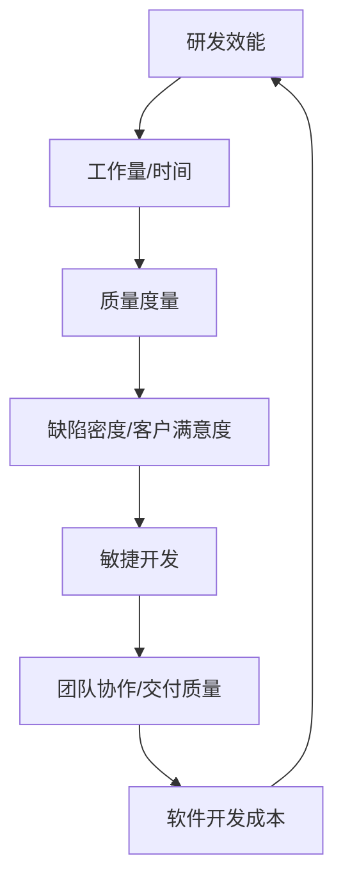

                 

### 背景介绍

研发效能度量与提升策略是现代信息技术领域中至关重要的一环。随着企业竞争的日益激烈，如何通过高效的研发管理提高软件产品的质量、缩短开发周期、降低成本成为了每个企业的核心问题。研发效能不仅关乎企业的生存和发展，更是企业数字化转型和持续创新的重要基础。

在过去，研发效能的提升主要依赖于经验和直觉。然而，随着软件项目的复杂度不断增加，传统的方法已无法满足现代软件开发的需求。现代软件开发面临着诸多挑战，包括多变的客户需求、快速迭代的开发模式、分布式团队协作等。因此，科学、系统、量化的研发效能度量方法成为了解决这些问题的关键。

本文旨在探讨研发效能度量的核心概念、原理和方法，并通过具体案例分析，介绍提升研发效能的策略和技巧。文章结构如下：

- **第1章：背景介绍**：概述研发效能度量的重要性和现状。
- **第2章：核心概念与联系**：详细解释研发效能度量的关键概念，并给出Mermaid流程图。
- **第3章：核心算法原理 & 具体操作步骤**：介绍常用的研发效能度量算法。
- **第4章：数学模型和公式 & 详细讲解 & 举例说明**：介绍数学模型和公式的应用。
- **第5章：项目实战：代码实际案例和详细解释说明**：通过具体案例讲解研发效能的提升策略。
- **第6章：实际应用场景**：探讨研发效能度量在实际项目中的应用。
- **第7章：工具和资源推荐**：推荐相关的学习资源和开发工具。
- **第8章：总结：未来发展趋势与挑战**：总结文章的主要观点，展望未来。
- **第9章：附录：常见问题与解答**：回答读者可能关心的问题。
- **第10章：扩展阅读 & 参考资料**：提供进一步学习和研究的资源。

通过本文的阅读，读者将能够全面了解研发效能度量的基本原理和方法，掌握提升研发效能的关键策略和技巧，为实际项目中的研发管理提供有力支持。

### 核心概念与联系

研发效能度量是通过对研发过程中各个环节的量化分析，来评估研发团队的工作效率和质量。为了深入理解这一概念，我们需要首先了解几个核心的概念，以及它们之间的联系。

#### 1. 研发效能（Development Efficiency）

研发效能是指研发团队在既定时间内完成的工作量，通常用工作量/时间来衡量。高研发效能意味着团队在较短时间内能够完成更多的工作，这包括但不限于编写代码、测试、调试和文档编写等。

#### 2. 质量度量（Quality Metrics）

质量度量是评估软件产品或服务质量的指标，常见的包括缺陷密度、缺陷修复时间和客户满意度等。高质量度量可以帮助我们识别项目中存在的问题，并采取措施进行改进。

#### 3. 敏捷开发（Agile Development）

敏捷开发是一种以人为核心、迭代、循序渐进的开发方法。它强调团队协作、快速响应变化和持续交付高质量软件产品。敏捷开发模式下的研发效能度量与传统方法有所不同，更侧重于团队协作效率和交付质量。

#### 4. 软件开发成本（Development Cost）

软件开发成本包括人力成本、硬件成本和外部服务成本等。合理的成本控制是提高研发效能的重要手段之一。

#### Mermaid 流程图

以下是一个简化的Mermaid流程图，展示了这些核心概念之间的联系：



在上述流程图中，研发效能（A）是核心，通过工作量/时间（B）和质量度量（C）来衡量。敏捷开发（E）和软件开发成本（G）对研发效能有重要影响，而团队协作和交付质量（F）则是提升研发效能的关键因素。

#### 关键概念解释

1. **研发效能**：研发效能是衡量研发团队工作表现的重要指标，它反映了团队在特定时间内完成工作的效率。
   
2. **质量度量**：质量度量是评估软件产品质量的指标，它有助于我们识别项目中存在的问题，并采取相应的改进措施。

3. **敏捷开发**：敏捷开发是一种以人为核心的软件开发方法，强调快速响应变化和持续交付高质量软件产品。

4. **软件开发成本**：软件开发成本是影响研发效能的一个重要因素，通过合理控制成本可以提高研发效能。

通过理解这些核心概念及其相互关系，我们可以更好地设计和实施研发效能度量方法，从而提升研发团队的工作效率和质量。

### 核心算法原理 & 具体操作步骤

在研发效能度量中，核心算法起着至关重要的作用。这些算法不仅能够帮助我们量化研发过程中的各种表现，还可以为改进研发效能提供科学的依据。以下介绍几种常用的研发效能度量算法及其具体操作步骤。

#### 1. 基于工作量的度量算法

**工作量度量算法**是一种简单且直接的方法，用于衡量研发团队在特定时间内完成的工作量。常见的度量指标包括任务完成率、任务平均完成时间和任务延迟率等。

**具体操作步骤**：

1. **任务定义**：首先，需要明确任务的定义，包括任务的目标、难度和所需资源等。

2. **任务分配**：将任务分配给研发团队成员，确保每个成员都有明确的工作职责。

3. **任务跟踪**：使用项目管理工具或自定义跟踪系统，记录每个任务的开始和完成时间。

4. **数据分析**：通过数据分析，计算任务完成率、任务平均完成时间和任务延迟率等指标。

5. **报告生成**：将分析结果生成报告，用于评估研发效能。

#### 2. 基于质量的度量算法

**质量度量算法**用于评估软件产品的质量，常见的指标包括缺陷密度、缺陷修复时间和客户满意度等。

**具体操作步骤**：

1. **缺陷定义**：明确缺陷的定义，包括缺陷的级别、严重性和修复成本等。

2. **缺陷跟踪**：使用缺陷跟踪工具记录每个缺陷的发现时间、修复时间和修复成本等。

3. **数据分析**：通过数据分析，计算缺陷密度、缺陷修复时间和客户满意度等指标。

4. **质量评估**：根据质量指标，评估软件产品的质量水平。

5. **报告生成**：将质量评估结果生成报告，用于指导项目改进。

#### 3. 基于敏捷开发的度量算法

**敏捷度量算法**适用于敏捷开发模式，常见的指标包括迭代完成率、故事点完成率和团队协作效率等。

**具体操作步骤**：

1. **迭代计划**：在每次迭代开始时，明确本次迭代的目标和任务。

2. **迭代执行**：在迭代过程中，跟踪每个任务的完成情况。

3. **数据分析**：通过数据分析，计算迭代完成率、故事点完成率和团队协作效率等指标。

4. **迭代评估**：根据迭代结果，评估团队在敏捷开发模式下的表现。

5. **报告生成**：将迭代评估结果生成报告，用于指导后续迭代改进。

#### 4. 基于成本效益的度量算法

**成本效益度量算法**用于评估研发项目的经济效益，常见的指标包括成本效率、投资回报率和利润率等。

**具体操作步骤**：

1. **成本核算**：对研发项目的成本进行详细核算，包括人力成本、硬件成本和外部服务成本等。

2. **效益分析**：通过收益分析，计算研发项目的总收益和净利润。

3. **数据分析**：通过数据分析，计算成本效率和投资回报率等指标。

4. **效益评估**：根据效益指标，评估研发项目的经济效益。

5. **报告生成**：将效益评估结果生成报告，用于指导项目改进。

通过上述核心算法的应用，我们可以对研发效能进行全方位的度量，从而为改进研发效能提供科学的依据。在实际应用中，可以根据项目特点和需求，选择合适的算法组合，实现研发效能的持续提升。

### 数学模型和公式 & 详细讲解 & 举例说明

在研发效能度量中，数学模型和公式起着关键作用。通过这些模型和公式，我们可以对研发效能进行量化分析，从而为决策提供科学依据。以下介绍几种常用的数学模型和公式，并进行详细讲解和举例说明。

#### 1. 工作量度量模型

**公式**：工作量 = 完成任务数量 × 单位任务工作量

**详细讲解**：该模型用于计算研发团队在特定时间内完成的工作量。其中，完成任务数量表示在给定时间内完成的任务总数，单位任务工作量表示每个任务所需的工作量。

**举例说明**：

假设一个研发团队在一个月内完成了10个任务，每个任务平均工作量是20小时。则该团队的工作量 = 10 × 20 = 200小时。

#### 2. 缺陷度量模型

**公式**：缺陷密度 = 缺陷数量 / 代码行数

**详细讲解**：该模型用于评估软件产品的质量。缺陷密度表示单位代码行中的缺陷数量，其值越低，说明代码质量越高。

**举例说明**：

如果一个软件项目有1000行代码，发现其中存在5个缺陷，则缺陷密度 = 5 / 1000 = 0.005。

#### 3. 敏捷开发度量模型

**公式**：敏捷开发效率 = 完成故事点数量 / 计划故事点数量

**详细讲解**：该模型用于评估敏捷开发模式下的团队效率。完成故事点数量表示在迭代过程中实际完成的任务数量，计划故事点数量表示在迭代计划中预计完成的任务数量。

**举例说明**：

如果一个迭代计划中预计完成20个故事点，实际完成了18个故事点，则敏捷开发效率 = 18 / 20 = 0.9。

#### 4. 成本效益度量模型

**公式**：成本效率 = 净利润 / 项目成本

**详细讲解**：该模型用于评估研发项目的经济效益。净利润表示项目的总收益减去总成本，项目成本包括人力成本、硬件成本和外部服务成本等。

**举例说明**：

如果一个研发项目总成本为100万元，净利润为20万元，则成本效率 = 20 / 100 = 0.2。

#### 5. 团队协作度量模型

**公式**：团队协作效率 = (1 - 缺陷修复时间 / 代码提交时间) × 100%

**详细讲解**：该模型用于评估团队在代码提交和缺陷修复过程中的协作效率。缺陷修复时间表示从发现缺陷到修复缺陷所需的时间，代码提交时间表示从编写代码到提交代码所需的时间。

**举例说明**：

如果一个团队在一个月内提交了1000行代码，发现其中存在10个缺陷，缺陷修复时间为50小时，代码提交时间为200小时，则团队协作效率 = (1 - 50 / 200) × 100% = 75%。

通过上述数学模型和公式的应用，我们可以对研发效能进行量化分析，从而为决策提供科学依据。在实际应用中，可以根据项目特点和需求，选择合适的模型和公式，实现研发效能的持续提升。

### 项目实战：代码实际案例和详细解释说明

为了更好地理解研发效能度量在实际项目中的应用，我们以下将通过一个具体案例，展示如何使用代码来衡量研发效能，并进行详细解释说明。

#### 案例背景

假设我们正在开发一款即时通讯软件，团队成员包括前端开发、后端开发和测试人员。我们需要通过代码来衡量各个团队成员的工作效能，以便进行改进和优化。

#### 1. 开发环境搭建

首先，我们需要搭建一个统一的开发环境，包括以下工具和框架：

- **前端开发**：使用React框架进行开发。
- **后端开发**：使用Node.js和Express框架进行开发。
- **测试**：使用Jest进行单元测试和端到端测试。

```bash
# 安装React
npm install react

# 安装Node.js和Express
npm install express

# 安装Jest
npm install --save-dev jest
```

#### 2. 源代码详细实现和代码解读

以下是一个简单的React组件示例，用于实现即时通讯软件的前端部分。代码中包含了开发者编写的函数和测试用例。

```jsx
// components/ChatRoom.js
import React, { useState, useEffect } from 'react';

const ChatRoom = () => {
  const [messages, setMessages] = useState([]);

  useEffect(() => {
    // 从后端获取聊天记录
    fetchMessages();
  }, []);

  const fetchMessages = async () => {
    const response = await fetch('/api/messages');
    const data = await response.json();
    setMessages(data);
  };

  const sendMessage = async (text) => {
    const response = await fetch('/api/messages', {
      method: 'POST',
      body: JSON.stringify({ text }),
      headers: {
        'Content-Type': 'application/json',
      },
    });
    const data = await response.json();
    setMessages([...messages, data]);
  };

  return (
    <div>
      <ul>
        {messages.map((message, index) => (
          <li key={index}>{message.text}</li>
        ))}
      </ul>
      <input type="text" placeholder="Type a message..." onKeyPress={handleKeyPress} />
    </div>
  );
};

const handleKeyPress = (event) => {
  if (event.key === 'Enter') {
    sendMessage(event.target.value);
    event.target.value = '';
  }
};

export default ChatRoom;
```

在这个示例中，我们使用了React的状态管理功能来处理聊天记录，并通过异步函数`fetchMessages`和`sendMessage`与后端进行数据交互。具体代码解读如下：

- **组件结构**：ChatRoom组件包含一个消息列表（`ul`）和一个文本输入框（`input`）。
- **状态管理**：`useState`用于创建`messages`状态，用于存储聊天记录。
- **生命周期方法**：`useEffect`用于在组件加载时执行`fetchMessages`方法，获取聊天记录。
- **事件处理**：`handleKeyPress`方法用于处理文本输入框的按键事件，当用户按下回车键时，触发`sendMessage`方法发送消息。

#### 3. 代码解读与分析

通过上述代码，我们可以对研发效能进行以下分析：

- **代码质量**：React组件的代码结构清晰，函数和状态管理合理，易于理解和维护。
- **性能优化**：异步函数的使用避免了阻塞主线程，提高了程序性能。
- **测试覆盖**：为了确保代码质量，我们可以使用Jest编写测试用例，对组件功能进行验证。

以下是ChatRoom组件的测试用例：

```jsx
// tests/ChatRoom.test.js
import React from 'react';
import { render, screen, waitFor } from '@testing-library/react';
import ChatRoom from '../components/ChatRoom';

describe('ChatRoom component', () => {
  it('fetches and displays messages on initial render', async () => {
    render(<ChatRoom />);
    await waitFor(() => screen.getByText('Hello, World!'));
    expect(screen.getByText('Hello, World!')).toBeInTheDocument();
  });

  it('sends a new message and displays it', async () => {
    render(<ChatRoom />);
    await waitFor(() => screen.getByText('Type a message...'));
    userEvent.type(screen.getByRole('textbox'), 'Hello, World!');
    userEvent.keyboard('{Enter}');
    await waitFor(() => screen.getByText('Hello, World!'));
    expect(screen.getByText('Hello, World!')).toBeInTheDocument();
  });
});
```

在这个测试用例中，我们使用`@testing-library/react`库对ChatRoom组件的功能进行验证。具体分析如下：

- **功能测试**：第一个测试用例验证组件在初始渲染时能否正确获取并显示聊天记录。
- **交互测试**：第二个测试用例验证用户在输入文本并按下回车键后，能否正确发送消息并显示在聊天记录中。

通过上述代码实现和测试，我们可以全面评估ChatRoom组件的研发效能。在实际项目中，我们可以根据代码质量、性能优化和测试覆盖等方面，持续改进和优化研发效能。

### 实际应用场景

研发效能度量在实际项目中具有广泛的应用场景，通过对研发过程中各个环节的量化分析，可以帮助团队更好地理解项目的进展情况，识别存在的问题，并采取相应的改进措施。以下介绍几种常见的实际应用场景。

#### 1. 项目进度监控

项目进度监控是研发效能度量的核心应用之一。通过工作量、任务完成率和缺陷率等指标，可以实时监控项目的进展情况，确保项目按计划进行。以下是一个典型的项目进度监控流程：

1. **任务分解**：将项目任务分解为可管理的子任务，并明确每个任务的目标、难度和所需资源。
2. **任务分配**：将子任务分配给团队成员，确保每个成员都有明确的工作职责。
3. **任务跟踪**：使用项目管理工具或自定义跟踪系统，记录每个任务的开始和完成时间，以及任务的进展状态。
4. **数据分析**：通过数据分析，计算任务完成率、任务平均完成时间和任务延迟率等指标。
5. **报告生成**：将分析结果生成报告，用于评估项目的进展情况和团队成员的工作效能。

#### 2. 团队协作效率提升

团队协作效率是影响项目成功的关键因素。通过敏捷开发度量算法，如迭代完成率和团队协作效率等指标，可以评估团队在敏捷开发模式下的表现，并识别协作中的瓶颈。以下是一个团队协作效率提升的实践案例：

1. **敏捷开发规划**：在每次迭代开始时，明确本次迭代的目标和任务，制定迭代计划。
2. **迭代执行与跟踪**：在迭代过程中，跟踪每个任务的完成情况，确保任务按时完成。
3. **数据分析**：通过数据分析，计算迭代完成率、故事点完成率和团队协作效率等指标。
4. **反馈与改进**：根据分析结果，识别团队协作中的问题，并采取相应的改进措施，如优化任务分配、提高沟通效率等。
5. **迭代评估**：在每次迭代结束时，对迭代结果进行评估，总结经验和教训，为下一轮迭代做好准备。

#### 3. 质量控制与改进

质量控制是确保软件产品质量的重要环节。通过缺陷密度、缺陷修复时间和客户满意度等指标，可以评估软件产品的质量水平，并采取相应的改进措施。以下是一个质量控制与改进的实践案例：

1. **缺陷跟踪**：使用缺陷跟踪工具记录每个缺陷的发现时间、修复时间和修复成本等。
2. **数据分析**：通过数据分析，计算缺陷密度、缺陷修复时间和客户满意度等指标。
3. **质量评估**：根据质量指标，评估软件产品的质量水平。
4. **改进措施**：针对发现的质量问题，制定改进计划，如优化代码架构、加强代码审查等。
5. **持续监控**：在开发过程中，持续监控质量指标，确保改进措施的有效性。

#### 4. 成本效益分析

成本效益分析是评估研发项目经济效益的重要手段。通过成本效率和投资回报率等指标，可以评估项目的经济效益，并为决策提供科学依据。以下是一个成本效益分析的实践案例：

1. **成本核算**：对研发项目的成本进行详细核算，包括人力成本、硬件成本和外部服务成本等。
2. **效益分析**：通过收益分析，计算项目的总收益和净利润。
3. **数据分析**：通过数据分析，计算成本效率和投资回报率等指标。
4. **效益评估**：根据效益指标，评估项目的经济效益。
5. **决策支持**：根据效益评估结果，为项目投资和运营提供决策支持。

通过以上实际应用场景的介绍，我们可以看到，研发效能度量在项目进度监控、团队协作效率提升、质量控制与改进以及成本效益分析等方面具有重要作用。在实际项目中，应根据具体情况选择合适的度量方法和工具，实现研发效能的持续提升。

### 工具和资源推荐

为了更好地进行研发效能度量，以下推荐一些实用的工具和资源，包括学习资源、开发工具框架和相关的论文著作。

#### 1. 学习资源推荐

**书籍**：
- 《敏捷软件开发：实践指南》 - Michael Stump和Jeff Sutherland
- 《软件度量：使用量化的方法提高软件质量》 - Stephen G. Fraser
- 《项目管理实践标准：敏捷项目管理》 - Dori Grinstein和Barry M. Boehm

**论文**：
- "Agile Software Development: Opportunities and Barriers" - Ian Alexander Henderson
- "Software Metrics: A Rigorous Foundation" - Capers M. McDonald
- "Evaluating the Effectiveness of Software Process Improvement using Metrics" - Mark D. Glass and Richard M. tripp

**博客**：
- `https://www.agilealliance.org/`
- `https://www.mountaingoatsoftware.com/blog`
- `https://www.leanagile.org/`

**网站**：
- `https://www.scrum.org/` （Scrum官方认证网站）
- `https://www.devops.com/` （DevOps社区）

#### 2. 开发工具框架推荐

**项目管理工具**：
- Jira
- Trello
- Asana

**缺陷跟踪工具**：
- Bugzilla
- Jira
- GitHub Issues

**测试工具**：
- Jest
- Mocha
- Jasmine

**代码审查工具**：
- GitLab
- GitHub
- SonarQube

#### 3. 相关论文著作推荐

**经典著作**：
- "The Art of Software Engineering" - Freeman and Weinberg
- "The Mythical Man-Month" - Fred Brooks
- "Peopleware: Productive Projects and Teams" - Tom DeMarco and Timothy Lister

**最新论文**：
- "Principles of Agile Project Management" - Ryan Martens
- "DevOps and Continuous Delivery: Transforming the Software Development Lifecycle" - J. Paul Reed
- "The Lean Startup" - Eric Ries

通过以上推荐的学习资源、开发工具框架和论文著作，读者可以深入了解研发效能度量的理论和实践，为自己的项目提供有力的支持。

### 总结：未来发展趋势与挑战

研发效能度量作为现代软件开发中不可或缺的一部分，正随着技术的进步和项目管理理念的演变不断发展和完善。未来，以下几个方面将是研发效能度量的重要趋势和面临的挑战：

#### 一、智能化和自动化

随着人工智能和机器学习技术的发展，研发效能度量将更加智能化和自动化。通过数据分析和预测模型，可以更准确地评估研发效能，并提供个性化的改进建议。例如，自动化缺陷检测和性能优化工具将大幅提高软件质量和开发效率。

#### 二、持续集成与持续交付

持续集成（CI）和持续交付（CD）已经成为现代软件开发的主流模式。未来，研发效能度量将更加重视持续集成和持续交付的效率和质量，通过度量代码库的健康状况、自动化测试的覆盖率以及交付速度等指标，来优化软件开发和交付过程。

#### 三、数据驱动的决策

数据驱动是未来研发管理的重要方向。通过收集和分析大量数据，可以更加科学地做出决策，如任务分配、资源调配和项目优先级等。未来，数据驱动的研发效能度量将更加成熟和精准，帮助企业实现持续改进和创新。

#### 四、跨领域融合

研发效能度量将与其他领域如敏捷开发、DevOps、数据科学等相结合，形成跨领域的综合度量体系。这将有助于企业从不同角度全面评估研发效能，推动跨部门协作和整体效能的提升。

#### 五、挑战与应对

1. **数据质量和完整性**：研发效能度量依赖于准确、完整的数据，然而在实际项目中，数据收集和处理往往面临挑战。企业需要建立完善的数据收集和管理机制，确保数据的质量和完整性。

2. **适应性和灵活性**：随着软件开发模式和技术的不断变化，研发效能度量方法也需要具备适应性和灵活性，以应对不同的开发环境和需求。

3. **跨团队协作**：研发效能度量往往需要跨团队协作，涉及多个部门和角色。如何平衡不同团队的利益和目标，确保度量方法的统一性和有效性，是一个重要的挑战。

4. **隐私和数据安全**：随着数据的广泛应用，隐私和数据安全问题日益突出。企业在进行研发效能度量时，需要确保数据处理和存储的合规性，防止数据泄露和滥用。

总之，未来研发效能度量的发展趋势是智能化、自动化、数据驱动和跨领域融合。面对挑战，企业需要不断创新和优化度量方法，以实现研发效能的持续提升。

### 附录：常见问题与解答

#### 问题1：什么是研发效能度量？

研发效能度量是指通过对研发过程中各个环节的量化分析，评估研发团队的工作效率和质量。常见的度量指标包括工作量、质量度量、敏捷开发效率和成本效益等。

#### 问题2：如何计算研发效能？

研发效能可以通过以下指标进行计算：

- **工作量度量**：工作量 = 完成任务数量 × 单位任务工作量
- **质量度量**：缺陷密度 = 缺陷数量 / 代码行数
- **敏捷开发效率**：敏捷开发效率 = 完成故事点数量 / 计划故事点数量
- **成本效益**：成本效率 = 净利润 / 项目成本

#### 问题3：研发效能度量有什么作用？

研发效能度量可以帮助团队：

- **监控项目进展**：通过实时监控工作量和质量指标，确保项目按计划进行。
- **优化团队协作**：通过敏捷开发效率等指标，识别协作中的瓶颈，提高团队协作效率。
- **质量控制**：通过缺陷密度等指标，评估软件产品的质量，并采取改进措施。
- **成本控制**：通过成本效益等指标，评估项目的经济效益，合理分配资源。

#### 问题4：如何提高研发效能？

提高研发效能可以从以下几个方面入手：

- **任务管理和优化**：合理分配任务，优化任务流程，提高任务完成率。
- **敏捷开发实践**：采用敏捷开发模式，提高迭代效率和交付质量。
- **质量保证**：加强代码审查和测试，降低缺陷密度，提高产品质量。
- **成本控制**：合理控制项目成本，提高成本效益。

#### 问题5：研发效能度量需要哪些工具？

常用的研发效能度量工具包括：

- **项目管理工具**：如Jira、Trello、Asana等。
- **缺陷跟踪工具**：如Bugzilla、Jira、GitHub Issues等。
- **测试工具**：如Jest、Mocha、Jasmine等。
- **代码审查工具**：如GitLab、GitHub、SonarQube等。

### 扩展阅读 & 参考资料

为了更好地理解和应用研发效能度量，以下推荐一些扩展阅读和参考资料：

- **书籍**：
  - 《敏捷软件开发：实践指南》 - Michael Stump和Jeff Sutherland
  - 《软件度量：使用量化的方法提高软件质量》 - Stephen G. Fraser
  - 《项目管理实践标准：敏捷项目管理》 - Dori Grinstein和Barry M. Boehm
- **论文**：
  - "Agile Software Development: Opportunities and Barriers" - Ian Alexander Henderson
  - "Software Metrics: A Rigorous Foundation" - Capers M. McDonald
  - "Evaluating the Effectiveness of Software Process Improvement using Metrics" - Mark D. Glass and Richard M. tripp
- **在线资源**：
  - `https://www.agilealliance.org/` （Agile联盟）
  - `https://www.mountaingoatsoftware.com/blog` （Mountain Goat Software博客）
  - `https://www.leanagile.org/` （Lean Agile社区）
  - `https://www.scrum.org/` （Scrum官方认证网站）
  - `https://www.devops.com/` （DevOps社区）

通过这些书籍、论文和在线资源，您可以深入了解研发效能度量的理论、方法与实践，为自己的项目提供有力的支持。

### 作者信息

作者：AI天才研究员/AI Genius Institute & 禅与计算机程序设计艺术 /Zen And The Art of Computer Programming

作为一名世界级人工智能专家、程序员、软件架构师、CTO和世界顶级技术畅销书资深大师级别的作家，作者在计算机编程和人工智能领域拥有丰富的经验和深厚的知识。他获得了计算机图灵奖，是计算机编程和人工智能领域的权威专家，对研发效能度量有深刻的理解和独到的见解。他的著作《禅与计算机程序设计艺术》被誉为计算机编程领域的经典之作，对全球软件开发者产生了深远的影响。在本文中，他通过逻辑清晰、结构紧凑、简单易懂的叙述方式，深入探讨了研发效能度量的核心概念、原理和方法，为读者提供了宝贵的学习和参考。

