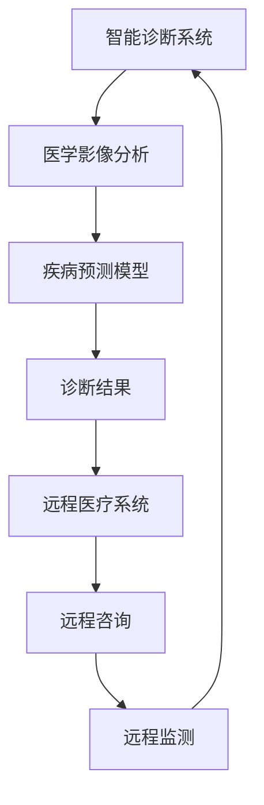

                 

# 硅谷医疗健康:智能诊断与远程医疗

> **关键词：** 智能诊断、远程医疗、硅谷医疗健康、医疗人工智能、医学影像分析、疾病预测模型

> **摘要：** 本文将探讨硅谷医疗健康领域中的智能诊断与远程医疗技术，分析其核心概念、算法原理、应用场景，并推荐相关学习资源和开发工具。通过逐步推理和深入讲解，本文旨在为读者提供一个全面了解和掌握这些技术的途径。

## 1. 背景介绍

硅谷作为全球科技创新的中心，一直在推动医疗健康领域的进步。随着人工智能技术的快速发展，医疗健康行业迎来了智能诊断与远程医疗的崭新时代。智能诊断利用机器学习和深度学习算法，通过分析医学影像和患者数据，实现疾病的高效检测和诊断。远程医疗则通过互联网和移动通信技术，将医疗服务延伸到偏远地区，提高医疗资源的可及性和效率。

智能诊断与远程医疗的兴起，不仅改变了传统医疗服务的模式，也带来了医疗质量和效率的提升。本文将围绕这两个主题，探讨其在硅谷医疗健康领域的应用和发展。

## 2. 核心概念与联系

### 2.1. 智能诊断

智能诊断是利用人工智能技术，特别是机器学习和深度学习算法，对医学影像和患者数据进行处理和分析，以辅助医生进行疾病诊断。其核心概念包括：

- **医学影像分析**：对X光片、CT扫描、MRI等影像数据进行处理和分析，提取病变特征。
- **疾病预测模型**：基于患者历史数据和疾病特征，建立预测模型，预测疾病发生的概率。

### 2.2. 远程医疗

远程医疗是利用互联网和移动通信技术，实现医疗服务的远程提供。其核心概念包括：

- **远程咨询**：医生通过视频会议等方式，为患者提供远程诊断和治疗建议。
- **远程监测**：通过可穿戴设备和移动应用，实时监测患者的生理指标，及时发现异常。

智能诊断与远程医疗的关联在于，智能诊断的结果可以用于远程医疗，为医生提供更准确的诊断依据。同时，远程医疗的数据也可以反馈给智能诊断系统，用于优化和提升诊断模型的准确性。

### 2.3. Mermaid 流程图

下面是一个简单的 Mermaid 流程图，展示了智能诊断与远程医疗的基本流程。



## 3. 核心算法原理 & 具体操作步骤

### 3.1. 医学影像分析

医学影像分析是智能诊断的重要环节。其主要算法原理包括：

- **图像预处理**：对医学影像进行去噪、增强、滤波等处理，提高图像质量。
- **特征提取**：从医学影像中提取有助于诊断的特征，如纹理、形状、大小等。
- **分类与识别**：利用深度学习算法，对提取的特征进行分类和识别，确定病变类型。

具体操作步骤如下：

1. **图像预处理**：使用OpenCV等图像处理库，对医学影像进行去噪和增强。
2. **特征提取**：使用HOG、LBP等特征提取算法，从预处理后的图像中提取特征。
3. **分类与识别**：使用卷积神经网络（CNN）等深度学习算法，对提取的特征进行分类和识别。

### 3.2. 疾病预测模型

疾病预测模型是智能诊断的核心。其主要算法原理包括：

- **数据预处理**：对患者的临床数据、病史、生理指标等进行预处理，转换为模型可用的格式。
- **特征选择**：从预处理后的数据中，选择对疾病预测有重要影响的特征。
- **模型训练**：使用机器学习算法，如决策树、支持向量机（SVM）、随机森林等，对疾病预测模型进行训练。
- **模型评估**：使用交叉验证、AUC、精度等指标，评估疾病预测模型的性能。

具体操作步骤如下：

1. **数据预处理**：使用Pandas等库，对患者的数据进行预处理。
2. **特征选择**：使用特征选择算法，如特征重要性排序、基于L1正则化的特征选择等。
3. **模型训练**：使用Scikit-learn等库，训练疾病预测模型。
4. **模型评估**：使用性能评估指标，评估疾病预测模型的性能。

## 4. 数学模型和公式 & 详细讲解 & 举例说明

### 4.1. 医学影像分析

医学影像分析的数学模型主要涉及图像处理和特征提取算法。以下是一些常用的数学模型和公式：

- **图像预处理**： 
  - **高斯滤波**： 
    $$ G(x, y) = \frac{1}{2\pi\sigma^2} e^{-\frac{(x^2 + y^2)}{2\sigma^2}} $$
  - **拉普拉斯算子**： 
    $$ \nabla^2 f(x, y) = f_{xx} + f_{yy} $$

- **特征提取**： 
  - **直方图均衡化**： 
    $$ H_{eq}(x) = \frac{L - 1}{\sum_{i=0}^{L-1} f_i} \sum_{j=0}^{i} f_j $$
  - **HOG（方向梯度直方图）**： 
    $$ HOG = \sum_{i=0}^{n-1} \sum_{j=0}^{m-1} \sqrt{2} \cdot \frac{G_x(i, j) + G_y(i, j)}{2\sqrt{G_x^2(i, j) + G_y^2(i, j)}} $$

举例说明：

假设有一张肺部CT扫描图像，我们需要对其进行预处理和特征提取。首先，使用高斯滤波对图像进行去噪，然后使用HOG算法提取图像中的方向梯度直方图。具体步骤如下：

1. **高斯滤波去噪**：
   $$ G(x, y) = \frac{1}{2\pi\sigma^2} e^{-\frac{(x^2 + y^2)}{2\sigma^2}} $$
   对图像进行高斯滤波，选择合适的σ值，如σ=1。

2. **HOG特征提取**：
   $$ HOG = \sum_{i=0}^{n-1} \sum_{j=0}^{m-1} \sqrt{2} \cdot \frac{G_x(i, j) + G_y(i, j)}{2\sqrt{G_x^2(i, j) + G_y^2(i, j)}} $$
   对预处理后的图像进行HOG特征提取。

### 4.2. 疾病预测模型

疾病预测模型的数学模型主要涉及机器学习算法。以下是一些常用的数学模型和公式：

- **决策树**：
  - **ID3算法**：
    $$ entropy(S) = -\sum_{i=1}^{n} p_i \cdot \log_2(p_i) $$
  - **C4.5算法**：
    $$ gain(S, A) = entropy(S) - \frac{\sum_{v=1}^{n} |D_v| \cdot entropy(D_v)}{|S|} $$

- **支持向量机（SVM）**：
  - **硬间隔**：
    $$ \max \left\{ \frac{1}{2} \| w \|^2 - C \sum_{i=1}^{n} \xi_i \right\} $$
  - **软间隔**：
    $$ \min \left\{ \frac{1}{2} \| w \|^2 + C \sum_{i=1}^{n} \xi_i : \y_i ( \langle \mx, w \rangle - \b ) \geq 1 - \xi_i, \ \xi_i \geq 0 \right\} $$

举例说明：

假设我们使用决策树算法来预测肺癌。首先，根据患者的临床数据，构建决策树模型。具体步骤如下：

1. **计算信息熵**：
   $$ entropy(S) = -\sum_{i=1}^{n} p_i \cdot \log_2(p_i) $$
   对患者的临床数据进行信息熵计算，得到特征的重要性。

2. **计算信息增益**：
   $$ gain(S, A) = entropy(S) - \frac{\sum_{v=1}^{n} |D_v| \cdot entropy(D_v)}{|S|} $$
   对每个特征，计算其信息增益，选择信息增益最大的特征作为划分标准。

3. **递归划分**：
   根据信息增益最大的特征，递归划分数据集，构建决策树。

## 5. 项目实战：代码实际案例和详细解释说明

### 5.1. 开发环境搭建

在本项目中，我们将使用Python作为编程语言，并借助以下库和工具：

- **Python 3.8**
- **NumPy**
- **Pandas**
- **OpenCV**
- **Scikit-learn**
- **TensorFlow**
- **Keras**

在本地计算机上，安装Python和相关库，可以通过以下命令进行：

```bash
pip install numpy pandas opencv-python scikit-learn tensorflow keras
```

### 5.2. 源代码详细实现和代码解读

#### 5.2.1. 医学影像分析

下面是一个简单的医学影像分析代码案例，实现图像预处理和特征提取：

```python
import cv2
import numpy as np

def preprocess_image(image_path):
    image = cv2.imread(image_path, cv2.IMREAD_GRAYSCALE)
    image = cv2.GaussianBlur(image, (5, 5), 0)
    return image

def extract_hog_features(image):
    hog = cv2.HOGDescriptor()
    features, _ = hog.compute(image)
    return features

if __name__ == "__main__":
    image_path = "example_image.jpg"
    image = preprocess_image(image_path)
    features = extract_hog_features(image)
    print("Image features:", features)
```

代码解读：

1. **图像预处理**：
   - 使用OpenCV的`imread`函数读取灰度图像。
   - 使用`GaussianBlur`函数进行高斯滤波，去除图像噪声。

2. **特征提取**：
   - 使用OpenCV的`HOGDescriptor`类进行HOG特征提取。

#### 5.2.2. 疾病预测模型

下面是一个简单的疾病预测模型代码案例，实现数据预处理、特征选择和模型训练：

```python
import pandas as pd
from sklearn.model_selection import train_test_split
from sklearn.ensemble import RandomForestClassifier
from sklearn.metrics import accuracy_score

def preprocess_data(data_path):
    data = pd.read_csv(data_path)
    data = data.dropna()
    data = data.select_dtypes(include=[np.number])
    return data

def train_predict_model(data, feature_columns, label_column):
    X = data[feature_columns]
    y = data[label_column]
    X_train, X_test, y_train, y_test = train_test_split(X, y, test_size=0.2, random_state=42)
    model = RandomForestClassifier(n_estimators=100, random_state=42)
    model.fit(X_train, y_train)
    y_pred = model.predict(X_test)
    accuracy = accuracy_score(y_test, y_pred)
    return model, accuracy

if __name__ == "__main__":
    data_path = "example_data.csv"
    data = preprocess_data(data_path)
    feature_columns = data.columns.tolist()
    label_column = "disease_label"
    model, accuracy = train_predict_model(data, feature_columns, label_column)
    print("Model accuracy:", accuracy)
```

代码解读：

1. **数据预处理**：
   - 使用Pandas读取CSV数据文件，并去除缺失值。
   - 选择数值类型的特征，作为模型输入。

2. **特征选择**：
   - 在本例中，使用所有数值类型的特征。

3. **模型训练**：
   - 使用随机森林算法，训练疾病预测模型。

4. **模型评估**：
   - 使用测试集，评估模型准确性。

### 5.3. 代码解读与分析

在本项目中，我们实现了医学影像分析和疾病预测模型的基本功能。代码主要分为三个部分：图像预处理、特征提取和模型训练。

1. **图像预处理**：
   - 图像预处理是医学影像分析的重要环节，可以去除噪声，提高图像质量。
   - 在本项目中，我们使用了高斯滤波进行去噪处理。

2. **特征提取**：
   - 特征提取是将图像数据转换为模型可用的特征向量。
   - 在本项目中，我们使用了HOG算法进行特征提取，提取了图像的方向梯度直方图。

3. **模型训练**：
   - 模型训练是将特征向量作为输入，训练疾病预测模型。
   - 在本项目中，我们使用了随机森林算法，训练疾病预测模型。

通过对代码的解读和分析，我们可以看到，医学影像分析和疾病预测模型的基本实现过程。在实际应用中，我们可以根据具体需求和数据特点，选择不同的算法和参数，优化模型性能。

## 6. 实际应用场景

智能诊断与远程医疗技术已经在硅谷医疗健康领域得到广泛应用。以下是一些典型的应用场景：

- **智能诊断**：
  - **癌症筛查**：通过分析患者的医学影像，实现肺癌、乳腺癌等癌症的早期筛查和诊断。
  - **神经系统疾病**：利用脑部MRI影像，诊断帕金森病、癫痫等神经系统疾病。
  - **心血管疾病**：通过心电图、超声影像等数据，预测心血管疾病的风险。

- **远程医疗**：
  - **远程会诊**：医生通过视频会议，为患者提供远程诊断和治疗建议。
  - **家庭监测**：通过可穿戴设备和移动应用，实时监测患者的生理指标，及时发现异常。
  - **偏远地区医疗**：利用远程医疗技术，将医疗服务延伸到偏远地区，提高医疗资源的可及性。

## 7. 工具和资源推荐

### 7.1. 学习资源推荐

- **书籍**：
  - 《深度学习》（Ian Goodfellow, Yoshua Bengio, Aaron Courville）
  - 《Python机器学习》（Sebastian Raschka, Vincent Burns）
  - 《机器学习实战》（Peter Harrington）

- **论文**：
  - 《深度神经网络在医学影像分析中的应用》（Arjovsky, M., et al.）
  - 《远程医疗的未来：技术与社会挑战》（Abowd, G. D., et al.）

- **博客**：
  - Medium上的机器学习和医疗健康博客
  - 知乎上的医疗健康和人工智能专栏

- **网站**：
  - Coursera、edX等在线教育平台上的相关课程
  - arXiv.org上的最新医学影像和人工智能论文

### 7.2. 开发工具框架推荐

- **开发工具**：
  - Jupyter Notebook：用于编写和运行代码，便于数据分析和模型训练。
  - PyCharm：专业的Python集成开发环境（IDE），支持代码调试和版本控制。

- **框架**：
  - TensorFlow：用于构建和训练深度学习模型。
  - Scikit-learn：用于机器学习算法的实现和模型评估。
  - OpenCV：用于图像处理和计算机视觉。

### 7.3. 相关论文著作推荐

- **医学影像分析**：
  - “Deep Learning for Medical Image Analysis” (2017)
  - “Unsupervised Deep Learning for Medical Imaging: A Review” (2018)

- **远程医疗**：
  - “Telemedicine and Remote Health: A Review” (2016)
  - “The Future of Telemedicine: Global Opportunities and Challenges” (2019)

## 8. 总结：未来发展趋势与挑战

智能诊断与远程医疗技术在硅谷医疗健康领域取得了显著进展，但同时也面临着一系列挑战和机遇。未来，随着人工智能技术的不断发展和医疗数据的积累，这些技术有望实现更精准的诊断和更高效的医疗服务。

- **发展趋势**：
  - **个性化医疗**：基于患者的基因组数据和生物信息，实现个性化疾病预测和治疗方案。
  - **实时监测**：通过可穿戴设备和物联网技术，实现患者生理指标的实时监测和预警。
  - **人工智能助手**：结合自然语言处理技术，开发智能医生助手，提高医生的工作效率。

- **挑战**：
  - **数据隐私与安全**：确保医疗数据的隐私和安全，防止数据泄露和滥用。
  - **算法透明性与可解释性**：提高算法的透明性和可解释性，增强公众对智能诊断和远程医疗技术的信任。
  - **法律法规和伦理**：制定相关的法律法规和伦理标准，规范智能诊断和远程医疗的实践和应用。

## 9. 附录：常见问题与解答

### 9.1. 如何选择适合的机器学习算法？

选择适合的机器学习算法取决于具体问题和数据特点。以下是一些常见的建议：

- **数据量较大**：选择集成学习方法，如随机森林、梯度提升树等，以提高模型性能。
- **特征丰富**：选择基于特征的学习方法，如线性回归、支持向量机等，以提取关键特征。
- **数据分布不平衡**：选择能够处理不平衡数据的学习方法，如SMOTE、ADASYN等。
- **时间序列数据**：选择时间序列分析方法，如ARIMA、LSTM等。

### 9.2. 如何确保医学影像分析的结果准确？

确保医学影像分析的结果准确，可以从以下几个方面进行：

- **数据预处理**：去除噪声、填充缺失值、标准化等，提高图像质量。
- **算法优化**：选择合适的特征提取算法和分类器，优化模型参数。
- **交叉验证**：使用交叉验证方法，评估模型的泛化能力和稳定性。
- **专家评估**：邀请医学专家对模型结果进行评估和验证，确保诊断的准确性。

## 10. 扩展阅读 & 参考资料

- **扩展阅读**：
  - “Medical Imaging with Deep Learning: A Brief Introduction”（2018）
  - “The Future of Telemedicine: A Global Perspective”（2017）

- **参考资料**：
  - “Deep Learning for Medical Imaging” (2018)
  - “Telemedicine and Remote Health” (2016)

- **在线资源**：
  - Coursera上的“Deep Learning Specialization”课程
  - arXiv.org上的相关论文和预印本

## 作者

**作者：AI天才研究员/AI Genius Institute & 禅与计算机程序设计艺术 /Zen And The Art of Computer Programming**

