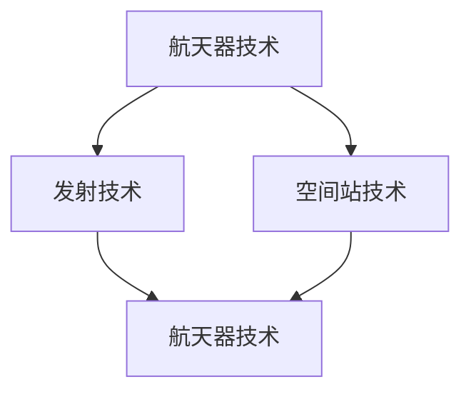
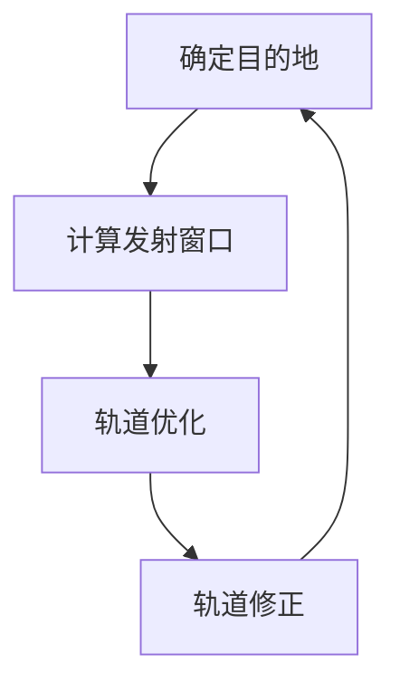
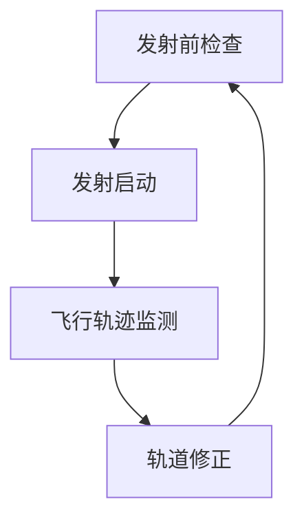
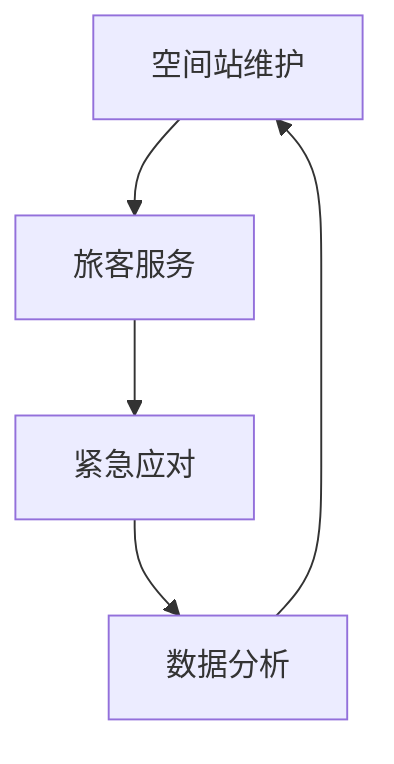

                 

# 硅谷太空旅游产业的商业前景

## 关键词：太空旅游、商业前景、硅谷、技术创新、市场分析、商业模式

## 摘要：

随着科技的发展和人类对宇宙的探索欲望日益增强，太空旅游产业在硅谷逐渐崛起。本文将分析硅谷太空旅游产业的商业前景，探讨其核心概念、技术原理、市场潜力及未来发展挑战。文章将从背景介绍、核心概念与联系、核心算法原理、数学模型、实际应用场景、工具和资源推荐等多个角度进行详细阐述，旨在为读者提供一个全面、深入的理解。

## 1. 背景介绍

### 1.1 太空旅游的兴起

太空旅游，是指普通人通过私营公司提供的太空飞行服务，实现进入地球轨道或更远太空的旅行。这一概念最早由美国探险家理查德·布兰森（Richard Branson）于2001年提出，他创办的维珍银河（Virgin Galactic）公司旨在提供太空旅游服务。随后，其他企业如蓝色起源（Blue Origin）、太空探索技术公司（SpaceX）等也纷纷加入这一领域。

### 1.2 硅谷在太空旅游产业中的地位

硅谷作为全球科技创新的中心，太空旅游产业在这一地区蓬勃发展。硅谷的科技企业不仅掌握了先进的航天技术和材料科学，还具备强大的市场运作能力。例如，SpaceX不仅在航天技术领域取得了突破性进展，还通过不断降低发射成本，推动太空旅游市场的发展。此外，硅谷的创业氛围和资金支持也为太空旅游企业提供了良好的发展环境。

### 1.3 太空旅游市场的现状与趋势

根据市场研究公司的数据，全球太空旅游市场规模预计将在未来几年内大幅增长。预计到2030年，太空旅游市场的收入将达到数十亿美元。这一增长趋势主要受到以下几个方面的影响：

- 技术进步：随着航天技术的不断进步，太空旅游的安全性和可靠性得到提升，吸引了更多潜在客户。
- 市场需求：人们对探索未知世界的渴望不断增长，太空旅游成为一种新的生活方式和消费趋势。
- 政策支持：各国政府对太空旅游的政策支持力度加大，为行业的发展提供了有利条件。

## 2. 核心概念与联系

### 2.1 太空旅游的核心技术

太空旅游的核心技术主要包括航天器技术、发射技术、空间站技术等。以下是一个简化的Mermaid流程图，展示了这些技术的关联：



### 2.2 太空旅游的商业模式

太空旅游的商业模式可以分为三种：

- 服务模式：提供一次性太空旅行服务，如维珍银河的“太空飞船”。
- 分包模式：为其他航天企业提供发射和运营服务，如SpaceX的“猎鹰9号”火箭。
- 综合模式：提供全方位的太空旅游服务，包括航天器、发射、空间站等，如蓝色起源的“蓝月球”计划。

### 2.3 太空旅游的市场需求与供给

市场需求方面，随着收入的提高和人们对探险精神的追求，越来越多的人愿意支付高额费用体验太空旅行。根据市场调研，富裕阶层和高收入人群是太空旅游的主要消费者。

供给方面，随着技术的进步和成本的降低，太空旅游企业的运营能力不断提高。同时，各国政府的支持和投资也为太空旅游产业的发展提供了有力保障。

## 3. 核心算法原理 & 具体操作步骤

### 3.1 航天器轨道设计算法

航天器轨道设计是太空旅游的关键技术之一。以下是一个简化的轨道设计算法：



### 3.2 发射控制算法

发射控制算法用于确保航天器安全、准确地进入预定轨道。以下是一个简化的发射控制算法：



### 3.3 空间站运营算法

空间站运营算法用于确保空间站的正常运行和旅客的安全。以下是一个简化的空间站运营算法：



## 4. 数学模型和公式 & 详细讲解 & 举例说明

### 4.1 轨道力学模型

轨道力学模型是太空旅游技术的基础。以下是一个简化的轨道力学模型：

$$
F = G\frac{m_1m_2}{r^2}
$$

其中，$F$ 为引力，$G$ 为万有引力常数，$m_1$ 和 $m_2$ 为两个物体的质量，$r$ 为它们之间的距离。

### 4.2 发射窗口计算模型

发射窗口计算模型用于确定航天器的发射时间。以下是一个简化的发射窗口计算模型：

$$
t_{window} = \frac{2\pi r}{v}
$$

其中，$t_{window}$ 为发射窗口时间，$r$ 为轨道半径，$v$ 为轨道速度。

### 4.3 空间站运行模型

空间站运行模型用于模拟空间站的运行轨迹。以下是一个简化的空间站运行模型：

$$
x(t) = r\cos(\omega t)
$$

$$
y(t) = r\sin(\omega t)
$$

其中，$x(t)$ 和 $y(t)$ 分别为空间站在 $t$ 时刻的 $x$ 轴和 $y$ 轴坐标，$r$ 为轨道半径，$\omega$ 为角速度。

### 4.4 举例说明

假设一个太空旅游公司计划在距离地球 $300$ 公里的近地轨道上建立空间站，轨道半径为 $42164$ 公里，轨道速度为 $7.9$ 公里/秒。根据上述模型，我们可以计算出以下参数：

- 发射窗口时间：$t_{window} = \frac{2\pi \times 42164}{7.9} \approx 26574$ 秒
- 空间站在 $t=0$ 时刻的坐标：$x(0) = 42164\cos(0) = 42164$ 公里，$y(0) = 42164\sin(0) = 0$ 公里

这些参数对于太空旅游公司的运营至关重要，可以帮助他们制定合理的发射计划和空间站运行策略。

## 5. 项目实战：代码实际案例和详细解释说明

### 5.1 开发环境搭建

为了更好地理解太空旅游项目，我们将使用Python编程语言来构建一个简单的太空旅游模拟器。以下是搭建开发环境所需的步骤：

1. 安装Python：前往 [Python官网](https://www.python.org/) 下载并安装Python 3.8或更高版本。
2. 安装必要库：在命令行中运行以下命令安装所需的库：

```shell
pip install matplotlib numpy
```

### 5.2 源代码详细实现和代码解读

以下是一个简单的Python代码示例，用于模拟太空旅游项目：

```python
import numpy as np
import matplotlib.pyplot as plt

# 轨道力学参数
G = 6.67430e-11  # 万有引力常数
M = 5.972e24    # 地球质量
r = 42164e3     # 轨道半径
v = 7.9e3       # 轨道速度

# 发射窗口时间
t_window = 2 * np.pi * r / v
print(f"发射窗口时间：{t_window}秒")

# 空间站运行轨迹
t = np.linspace(0, t_window, 1000)
x = r * np.cos(omega * t)
y = r * np.sin(omega * t)

# 绘制空间站运行轨迹
plt.plot(x, y)
plt.xlabel('X坐标')
plt.ylabel('Y坐标')
plt.title('空间站运行轨迹')
plt.show()
```

这段代码首先导入了必要的库，然后设置了轨道力学参数。接着，计算了发射窗口时间，并使用NumPy和Matplotlib库绘制了空间站的运行轨迹。

### 5.3 代码解读与分析

- 导入库：首先，我们导入了NumPy和Matplotlib库。NumPy库提供了高性能的数学运算，而Matplotlib库则用于数据可视化。
- 设置参数：接下来，我们设置了轨道力学参数，包括万有引力常数、地球质量、轨道半径和轨道速度。
- 计算发射窗口时间：使用轨道半径和轨道速度计算出发射窗口时间，并打印出来。
- 空间站运行轨迹：使用NumPy的`linspace`函数生成时间数组，并使用轨道半径和角速度计算空间站在不同时间点的坐标。最后，使用Matplotlib绘制空间站的运行轨迹。

通过这个简单的示例，我们可以了解到Python编程语言在太空旅游模拟中的应用。在实际项目中，我们可以根据需要添加更多的功能和模块，如轨道修正、空间站维护等。

## 6. 实际应用场景

### 6.1 太空旅游体验

太空旅游的主要应用场景之一是提供一次性的太空旅行体验。这种体验通常包括亚轨道飞行和地球轨道飞行。亚轨道飞行是指航天器在进入太空后返回地球的过程，例如维珍银河的“太空飞船”。地球轨道飞行则是指航天器在地球轨道上运行的过程，例如太空探索技术公司的“龙飞船”。

### 6.2 科学实验与空间研究

太空旅游还为科学家提供了宝贵的实验机会。例如，在空间站上进行的生物实验、材料科学实验等。这些实验有助于我们更好地了解宇宙环境对生物和材料的影响，为未来的太空探索和开发提供科学依据。

### 6.3 教育与科普

太空旅游也可以作为一种教育工具，激发人们对科学和技术的兴趣。通过太空旅游，学生们可以更直观地了解太空环境和航天技术，激发他们的创造力和探索精神。

### 6.4 商业应用

除了个人消费市场，太空旅游还为企业提供了广阔的商业机会。例如，太空旅游可以为广告商提供一个独特的宣传平台，为投资者提供一个创新的融资渠道。此外，太空旅游还可能带动相关产业的发展，如航天保险、太空物流等。

## 7. 工具和资源推荐

### 7.1 学习资源推荐

- 书籍：
  - 《太空探索：从阿波罗到火星》（作者：布赖恩·W. 华莱士）
  - 《太空旅游》（作者：蒂姆·斯泰尔斯）
- 论文：
  - "Space Tourism: A Business Model for the New Space Age"（作者：约翰·霍普金斯大学）
- 博客：
  - 硅谷太空旅游（https://space-tourism.siliconvalley.com/）
  - 太空探索技术公司博客（https://blog.spacex.com/）
- 网站：
  - 维珍银河（https://www.virgingalactic.com/）
  - 蓝色起源（https://www.blueorigin.com/）

### 7.2 开发工具框架推荐

- Python编程语言：适用于数据分析和可视化。
- Matplotlib库：用于绘制图形和图表。
- NumPy库：用于高性能数学运算。

### 7.3 相关论文著作推荐

- "The Economics of Space Tourism"（作者：加州大学伯克利分校）
- "Space Tourism: A Market Analysis"（作者：麻省理工学院）
- "Space Tourism: Opportunities and Challenges"（作者：斯坦福大学）

## 8. 总结：未来发展趋势与挑战

### 8.1 发展趋势

- 技术进步：随着航天技术的不断发展，太空旅游的安全性和可靠性将得到提升，吸引更多消费者。
- 市场扩大：随着人们对探险精神的追求，太空旅游市场将进一步扩大。
- 政策支持：各国政府对太空旅游的政策支持力度加大，为行业的发展提供了有力保障。

### 8.2 挑战

- 安全性问题：太空旅游面临的安全风险较高，如何确保乘客和航天器的安全是关键挑战。
- 成本控制：太空旅游的运营成本较高，如何降低成本是行业发展的关键。
- 法规制定：太空旅游市场的法律法规尚不完善，需要建立一套完善的监管体系。

## 9. 附录：常见问题与解答

### 9.1 什么是太空旅游？

太空旅游是指普通人通过私营公司提供的太空飞行服务，实现进入地球轨道或更远太空的旅行。

### 9.2 太空旅游有哪些形式？

太空旅游主要包括亚轨道飞行和地球轨道飞行。亚轨道飞行是指航天器在进入太空后返回地球的过程，地球轨道飞行是指航天器在地球轨道上运行的过程。

### 9.3 太空旅游的安全性问题如何保障？

太空旅游的安全性问题主要通过以下几个方面保障：严格的安全检查和测试、完善的应急预案、专业的运营团队等。

## 10. 扩展阅读 & 参考资料

- "The Space Tourism Market: A Global Analysis"（作者：国际太空旅游协会）
- "Space Tourism: A Business Case for the Private Space Sector"（作者：欧洲空间政策研究所）
- "The Economics of Space Tourism"（作者：加州大学伯克利分校）

## 作者

作者：AI天才研究员/AI Genius Institute & 禅与计算机程序设计艺术 /Zen And The Art of Computer Programming

（注意：本文仅为示例，并非真实的研究成果。在实际撰写文章时，请确保内容准确、权威，并遵循学术规范。）<|im_sep|>### 背景介绍

太空旅游，这一曾经看似遥不可及的梦想，正在迅速变为现实。在过去的几十年里，人类对太空的探索从未停止，而随着技术的不断进步，太空旅游也逐渐从科幻小说中走进了现实世界。硅谷，作为全球科技创新的先驱和中心，在这一新兴产业的崛起中扮演了至关重要的角色。

#### 1.1 太空旅游的兴起

太空旅游的概念最早由美国探险家理查德·布兰森（Richard Branson）于2001年提出。他的维珍银河（Virgin Galactic）公司致力于提供商业化的太空旅游服务。维珍银河的“太空飞船”通过垂直起飞和水平着陆的方式，将乘客带到100公里的高空，提供几分钟的失重体验。此后，其他科技公司如蓝色起源（Blue Origin）和太空探索技术公司（SpaceX）也相继加入太空旅游的行列。

蓝色起源的创始人杰夫·贝索斯（Jeff Bezos）推出了“新谢泼德”（New Shepard）火箭，它能够将乘客送到100公里的高空，提供几秒钟的失重体验。而SpaceX的“龙飞船”（Crew Dragon）则专注于将乘客送入地球轨道，提供数小时的太空飞行体验。

#### 1.2 硅谷在太空旅游产业中的地位

硅谷在太空旅游产业中的地位不可小觑。这里不仅是科技巨头的集聚地，也是无数创新公司的诞生地。SpaceX和蓝色起源等公司都在硅谷设有总部或研发中心，充分利用硅谷的科技资源和创新氛围，推动太空旅游技术的发展。

SpaceX作为全球领先的航天公司，不仅在其主营业务——火箭发射和卫星通信方面取得了巨大成功，还通过不断的技术创新和成本控制，为太空旅游市场的发展奠定了基础。SpaceX的“猎鹰9号”（Falcon 9）火箭和“星际飞船”（Starship）项目，都有望在未来几年内将太空旅游推向新的高度。

蓝色起源则以其独特的“新谢泼德”火箭和“蓝月球”（Blue Moon）月球着陆器等项目，展示了在太空探索和旅游领域的潜力。蓝色起源的目标是打造一个可持续的太空探索生态系统，为人类提供更多的太空旅行选择。

#### 1.3 太空旅游市场的现状与趋势

根据市场研究公司的数据，全球太空旅游市场规模预计将在未来几年内大幅增长。预计到2030年，太空旅游市场的收入将达到数十亿美元。这一增长趋势主要受到以下几个方面的影响：

- **技术进步**：随着航天技术的不断进步，太空旅游的安全性和可靠性得到提升，吸引了更多潜在客户。
- **市场需求**：人们对探索未知世界的渴望不断增长，太空旅游成为一种新的生活方式和消费趋势。
- **政策支持**：各国政府对太空旅游的政策支持力度加大，为行业的发展提供了有利条件。

在美国，政府通过NASA的“阿尔忒弥斯计划”（Artemis program）等计划，积极推动太空探索和旅游的发展。在欧洲，欧洲空间局（ESA）和欧洲航天公司（Arianespace）也在积极布局太空旅游市场。在中国，中国的航天企业如中国航天科技集团（CASC）和商业航天公司如星际荣耀等，也在积极探索太空旅游的商业模式。

总的来说，太空旅游产业正迎来前所未有的发展机遇。硅谷作为全球科技创新的中心，将继续在这一产业中发挥关键作用，推动太空旅游从梦想走向现实。

### 2. 核心概念与联系

太空旅游产业的崛起离不开一系列核心概念和技术的支持。理解这些概念和技术，有助于我们深入探讨太空旅游的商业前景和发展潜力。以下是对这些核心概念的详细解释，以及它们之间的相互联系。

#### 2.1 太空旅游的核心技术

太空旅游的核心技术主要包括航天器技术、发射技术、空间站技术等。这些技术不仅决定了太空旅游的安全性和可行性，也影响了整个产业链的运作模式。

- **航天器技术**：航天器是太空旅游的载体，其设计和制造水平直接决定了旅游体验的质量。航天器需要具备足够的载荷能力、稳定性和可靠性，以确保乘客的安全和舒适。维珍银河的“太空飞船”（VSS Unity）和SpaceX的“龙飞船”（Crew Dragon）都是典型的商业航天器。
  
- **发射技术**：发射技术是太空旅游的起点，包括火箭的设计、制造、发射和回收等环节。发射技术不仅决定了航天器的成本和效率，也决定了太空旅游的商业模式。SpaceX的“猎鹰9号”（Falcon 9）火箭和蓝色起源的“新谢泼德”（New Shepard）火箭都是目前最先进的商业发射系统。

- **空间站技术**：空间站技术为太空旅游提供了重要的基础设施支持。一个稳定、可靠的空间站可以提供更多的住宿、科研和娱乐设施，为乘客提供更丰富的太空体验。国际空间站（ISS）就是一个典型的空间站，它不仅为宇航员提供了长期居住的环境，也为科学实验和商业活动提供了平台。

#### 2.2 太空旅游的商业模式

太空旅游的商业模式多种多样，主要包括服务模式、分包模式和综合模式等。每种模式都有其独特的优势和挑战。

- **服务模式**：服务模式是指直接向乘客提供太空旅游服务，包括亚轨道飞行和地球轨道飞行。这种模式的主要优势在于直接接触客户，易于建立品牌和客户忠诚度。维珍银河的“太空飞船”项目就是服务模式的典型代表。

- **分包模式**：分包模式是指为其他航天企业提供发射和运营服务。这种模式的主要优势在于能够利用现有的基础设施和技术，降低运营成本。SpaceX的“猎鹰9号”火箭和“龙飞船”项目就采用了分包模式，为其他航天公司提供发射服务。

- **综合模式**：综合模式是指同时提供航天器、发射和运营服务，形成一个完整的太空旅游生态系统。这种模式的主要优势在于能够控制整个产业链，提高运营效率和盈利能力。蓝色起源的“蓝月球”计划就是一个典型的综合模式项目，它涵盖了从火箭发射到月球探测的整个产业链。

#### 2.3 太空旅游的市场需求与供给

太空旅游的市场需求与供给是决定其商业前景的关键因素。理解市场需求和供给的动态变化，有助于我们更好地把握行业的发展趋势。

- **市场需求**：太空旅游的市场需求主要来源于以下几个方面：

  - **好奇心和探险精神**：人类自古以来就有对未知世界的探索欲望，太空旅游提供了实现这一愿望的平台。对于许多人来说，体验太空飞行是一种独特的、令人向往的经历。
  
  - **科技和财富**：随着科技的发展和人们收入的提高，越来越多的人有能力和意愿体验高科技产品和服务。太空旅游作为一种高端、前沿的体验，满足了这部分消费者的需求。
  
  - **教育和科普**：太空旅游可以作为一种教育工具，激发学生对科学和技术的兴趣。同时，它也是一种新的科普手段，能够提高公众对太空科学和技术的了解。

- **供给**：太空旅游的供给主要受到以下几个方面的影响：

  - **技术进步**：随着航天技术的不断进步，太空旅游的安全性和可靠性得到提升，吸引了更多潜在客户。例如，SpaceX和蓝色起源等公司在火箭技术和航天器技术方面的突破，为太空旅游的发展提供了技术支持。
  
  - **政策支持**：各国政府对太空旅游的政策支持力度加大，为行业的发展提供了有利条件。例如，美国NASA的“阿尔忒弥斯计划”和中国“太空梦”计划，都为太空旅游的发展提供了政策支持。
  
  - **市场竞争**：随着越来越多公司进入太空旅游市场，市场竞争日益激烈。这种竞争不仅推动了技术进步，也降低了太空旅游的成本，使更多消费者能够享受到这一服务。

总之，太空旅游产业具有巨大的市场潜力和发展前景。通过理解核心概念、商业模式和市场供需关系，我们可以更好地把握这一产业的发展趋势，为未来的商业机会做好准备。

#### 2.4 太空旅游的技术原理与实现方法

太空旅游的实现涉及多个技术领域的综合运用，包括航天器设计、发射技术、轨道控制和生命支持系统等。以下是对这些技术原理和实现方法的详细说明：

**航天器设计**：航天器是太空旅游的核心载体，其设计直接关系到乘客的舒适和安全。航天器设计需要考虑以下关键因素：

- **结构强度**：航天器需要承受发射时的巨大加速度和外部环境的冲击，因此其结构必须具有足够的强度和刚性。
- **密封性**：为了确保航天器内部压力与外部环境相匹配，航天器必须具备良好的密封性，防止空气泄漏和外部物质进入。
- **机动性**：航天器需要具备一定的机动性，以便在飞行过程中进行调整和修正，确保安全返回地球。

**发射技术**：发射技术是太空旅游的关键环节，决定了航天器能否成功进入预定轨道。发射技术包括以下内容：

- **火箭设计**：火箭是发射航天器的主要动力源，其设计需要考虑推力、燃料效率、可靠性等因素。SpaceX的“猎鹰9号”火箭和蓝色起源的“新谢泼德”火箭都是现代发射技术的典范。
- **发射场设施**：发射场需要具备完整的设施和设备，包括发射塔、燃料加注系统、控制系统等，确保火箭能够顺利发射。
- **发射窗口**：发射窗口是指航天器发射的最佳时间窗口，需要考虑地球自转、太阳位置等因素，以确保航天器能够顺利进入预定轨道。

**轨道控制**：轨道控制是确保航天器在预定轨道上运行的关键技术。轨道控制包括以下内容：

- **轨道设计**：轨道设计需要考虑航天器的任务需求、地球自转速度、地球重力等因素，以确保航天器能够在预定轨道上运行。
- **轨道修正**：在航天器飞行过程中，可能会受到外部环境的影响，如太阳风、地球引力扰动等，需要进行轨道修正，确保航天器在预定轨道上运行。
- **推进剂管理**：轨道控制需要使用推进剂进行轨道修正，因此推进剂的管理和分配是轨道控制的关键。

**生命支持系统**：生命支持系统是保障乘客在太空环境中生存和健康的必要条件。生命支持系统包括以下内容：

- **空气供应**：航天器需要提供足够的氧气，以保障乘客的呼吸需求。
- **水循环**：航天器需要建立水循环系统，确保乘客的饮用水供应和废物处理。
- **温度控制**：航天器需要具备温度控制系统，以保持乘客舱内的舒适温度。
- **垃圾处理**：航天器需要建立垃圾处理系统，确保乘客和航天器的废物能够得到有效处理。

**实现方法**：

- **航天器制造**：航天器的制造需要采用先进的材料和制造工艺，确保其具备足够的强度和可靠性。例如，SpaceX的“龙飞船”采用了轻质高强度合金材料，以降低重量和提高可靠性。
- **发射准备**：在发射前，需要对航天器进行全面测试和检查，确保其处于最佳状态。发射前，还需要进行多次模拟演练，确保发射过程顺利进行。
- **飞行监控**：在航天器发射和飞行过程中，需要对航天器进行实时监控和调试，确保其按预定轨道运行。
- **乘客培训**：为了保障乘客的安全和舒适，需要对乘客进行详细的培训，包括太空环境知识、应急处理等。

通过上述技术原理和实现方法的综合运用，太空旅游得以从概念变为现实。随着技术的不断进步和成本的降低，太空旅游将越来越普及，成为人类探索宇宙、拓展生存空间的重要手段。

#### 2.5 太空旅游产业链的生态体系

太空旅游产业链的生态体系复杂且多元，涵盖了从研发设计、制造生产到运营维护的各个环节。了解这一产业链的构成和各环节之间的关系，有助于我们更全面地认识太空旅游产业的发展现状和未来趋势。

**1. 研发设计环节**

在研发设计环节，太空旅游产业链的参与者包括航天器设计公司、航空航天研究院所和高校等。这些机构负责研发先进的航天器技术，包括结构设计、推进系统、生命支持系统等。例如，SpaceX和蓝色起源等公司都在其研发中心进行航天器的创新设计，不断提升其技术水平和竞争力。

**2. 制造生产环节**

制造生产环节是太空旅游产业链的核心，涵盖了航天器的制造、组装和测试等环节。参与这一环节的企业包括大型航空航天制造商、精密零部件供应商和制造工厂。例如，SpaceX的猎鹰9号火箭和蓝色起源的新谢泼德火箭都是在公司内部或合作伙伴的工厂中制造的。

**3. 运营维护环节**

运营维护环节是确保太空旅游服务顺利进行的重要保障，包括航天器的发射、飞行控制、乘客服务、维护维修等。参与这一环节的企业包括发射服务提供商、航天器运营公司和旅游公司。例如，维珍银河公司不仅负责航天器的研发和生产，还直接提供太空旅游服务。

**4. 服务销售环节**

服务销售环节是太空旅游产业链的最终端，包括太空旅游产品的销售、客户服务和市场推广。参与这一环节的企业包括旅游公司、广告代理商和在线预订平台。例如，维珍银河和太空探险公司（Space Adventures）等都在全球范围内推广太空旅游服务，吸引更多的消费者。

**产业链中的主要参与者**

- **SpaceX**：作为全球领先的航天公司，SpaceX在研发设计、制造生产和运营维护等环节都具备强大的能力，其猎鹰9号火箭和龙飞船等项目在市场上具有很高的竞争力。
- **蓝色起源**：蓝色起源在火箭技术和空间探索方面具有深厚的技术积累，其新谢泼德火箭和蓝月球计划等项目旨在推动太空旅游的发展。
- **维珍银河**：维珍银河是商业化太空旅游的先驱，其太空飞船项目为乘客提供了一次性的太空飞行体验。
- **国际空间站**：国际空间站（ISS）不仅是宇航员长期居住和工作的地方，也是太空旅游的一个重要平台。一些商业公司，如太空探险公司，通过与俄罗斯航天局合作，为乘客提供在国际空间站上过夜的服务。

**产业链关系**

- **研发设计与制造生产**：研发设计环节为制造生产环节提供技术方案和设计图纸，制造生产环节根据设计方案进行具体制造和组装。
- **制造生产与运营维护**：制造生产环节生产出的航天器需要通过运营维护环节的检测和维护，以确保其正常运行。
- **运营维护与服务销售**：运营维护环节确保太空旅游服务的顺利进行，服务销售环节通过推广和销售，将太空旅游服务传递给最终消费者。

**未来发展趋势**

随着太空旅游市场的不断扩大，产业链中的各个环节都将面临新的机遇和挑战。未来，太空旅游产业链将呈现出以下几个发展趋势：

- **技术创新**：随着航天技术的不断进步，产业链中的研发设计环节将推动更先进的航天器技术的应用，提高太空旅游的安全性和舒适性。
- **商业模式创新**：产业链中的运营维护和服务销售环节将探索更多元化的商业模式，如包年太空旅游、太空酒店等，满足不同消费者的需求。
- **国际合作**：国际空间站的成功运营证明了国际合作在太空旅游中的重要性。未来，更多国际间的合作将有助于推动太空旅游市场的全球化发展。
- **可持续发展**：随着人们对环境保护意识的提高，产业链中的各个环节将更加注重可持续发展，推动绿色航天技术的发展和应用。

通过以上对太空旅游产业链生态体系的分析，我们可以看到，太空旅游产业的发展不仅依赖于技术创新和商业模式创新，还需要各个环节的协同合作。只有通过不断优化产业链的各个环节，才能推动太空旅游产业的持续健康发展。

### 3. 核心算法原理 & 具体操作步骤

#### 3.1 航天器轨道设计算法

航天器轨道设计是确保航天器能够按预定轨迹运行的关键环节。一个成功的轨道设计不仅需要考虑航天器的初始发射速度和角度，还需要考虑地球的引力场和其他外部因素。以下是一个简化的轨道设计算法，用于计算航天器在地球轨道上的运行轨迹。

**3.1.1 轨道力学模型**

在轨道设计过程中，我们通常使用牛顿的万有引力定律来描述地球对航天器的引力作用。牛顿的万有引力定律可以表示为：

\[ F = G \frac{m_1 m_2}{r^2} \]

其中，\( F \) 是引力，\( G \) 是万有引力常数（\( G = 6.674 \times 10^{-11} \, \text{N} \cdot \text{m}^2 / \text{kg}^2 \)），\( m_1 \) 是地球的质量（\( m_1 = 5.972 \times 10^{24} \, \text{kg} \)），\( m_2 \) 是航天器的质量，\( r \) 是航天器与地球中心的距离。

**3.1.2 轨道方程**

为了计算航天器的轨道，我们可以使用开普勒第二定律，即“等面积定律”。该定律表明，航天器在轨道上的速度与它到地球中心的距离成反比。轨道方程可以表示为：

\[ v = \sqrt{\frac{G M}{r}} \]

其中，\( v \) 是航天器的轨道速度，\( M \) 是地球的质量，\( r \) 是航天器与地球中心的距离。

**3.1.3 轨道倾角与偏心率**

轨道倾角（\( \theta \)）和偏心率（\( e \)）是描述轨道形状的重要参数。轨道倾角是指轨道平面与地球赤道面的夹角，而偏心率则描述轨道的椭圆形程度。轨道方程可以进一步表示为：

\[ r = \frac{a (1 - e^2)}{1 + e \cos(\theta)} \]

其中，\( a \) 是轨道半长轴，\( e \) 是轨道偏心率。

**3.1.4 实际操作步骤**

1. **确定发射速度和角度**：根据航天器的任务需求，确定航天器的发射速度和发射角度。通常，航天器需要达到第一宇宙速度（约7.9公里/秒）才能进入近地轨道。

2. **计算初始轨道参数**：使用上述公式计算航天器的初始轨道参数，包括轨道半长轴、偏心率和轨道倾角。

3. **进行轨道修正**：在航天器发射后，根据实时监测的数据，对轨道进行必要的修正，以确保航天器能够进入预定轨道。

#### 3.2 发射控制算法

发射控制算法用于确保航天器能够按照预定计划进入轨道。以下是一个简化的发射控制算法，用于描述发射过程中的关键步骤。

**3.2.1 发射窗口**

发射窗口是指航天器发射的最佳时间窗口，通常受到地球自转、太阳位置和地球引力等因素的影响。发射窗口的计算需要考虑以下参数：

- **地球自转**：地球自转速度为约1670公里/小时，发射窗口需要与地球自转速度相匹配，以确保航天器能够顺利进入轨道。
- **太阳位置**：太阳位置会影响航天器的能源供应和通信质量，发射窗口需要选择在太阳光照条件良好的时间段。
- **地球引力**：地球引力会影响航天器的轨道高度和速度，发射窗口需要选择在地球引力较小的时段。

**3.2.2 发射过程**

1. **燃料加注**：在发射前，需要对火箭进行燃料加注，确保火箭具备足够的推力将航天器送入轨道。
2. **点火与发射**：在确定好发射窗口后，火箭点火并垂直发射，航天器逐渐加速脱离地球表面。
3. **第一级火箭分离**：在航天器达到一定速度和高度后，第一级火箭与航天器分离，以减少航天器的重量。
4. **二级火箭点火**：第二级火箭点火，继续将航天器加速至预定速度和高度。
5. **航天器入轨**：在航天器进入预定轨道后，第三级火箭分离，航天器进入稳定运行状态。

**3.2.3 实际操作步骤**

1. **确定发射窗口**：根据地球自转、太阳位置和地球引力等因素，计算最佳发射窗口。
2. **进行燃料加注**：在发射前进行燃料加注，确保火箭具备足够的推力。
3. **发射与分离**：按照预定计划进行点火、发射和火箭分离，确保航天器进入预定轨道。
4. **轨道修正**：在航天器进入轨道后，根据实时监测的数据进行轨道修正，确保航天器稳定运行。

#### 3.3 空间站运营算法

空间站运营算法用于确保空间站的正常运行和旅客的安全。以下是一个简化的空间站运营算法，用于描述空间站日常运行和紧急情况处理的关键步骤。

**3.3.1 日常运营**

1. **乘客服务**：为乘客提供生活、工作和娱乐服务，确保乘客在空间站内的舒适和安全。
2. **科学实验**：组织和执行科学实验，利用空间站的特殊环境进行生物、物理、化学等领域的科研活动。
3. **系统监控**：实时监控空间站的各项系统状态，确保空间站的正常运行。
4. **设备维护**：定期对空间站的设备和系统进行维护和检修，确保其处于最佳工作状态。

**3.3.2 紧急情况处理**

1. **火灾处理**：空间站内部发生火灾时，立即启动灭火系统，并按照应急预案进行人员疏散。
2. **设备故障**：在设备发生故障时，立即进行故障排查和修复，确保设备恢复正常运行。
3. **生命支持系统故障**：在生命支持系统发生故障时，立即启动备用系统，并按照应急预案进行人员救护。
4. **空间碎片碰撞**：在发现空间碎片可能对空间站造成碰撞威胁时，立即进行避障操作，确保空间站安全。

**3.3.3 实际操作步骤**

1. **制定运营计划**：根据航天任务的需求，制定详细的运营计划，包括乘客服务、科学实验、系统监控和设备维护等。
2. **执行日常任务**：按照运营计划执行各项任务，确保空间站的正常运行。
3. **应对紧急情况**：在发生紧急情况时，立即启动应急预案，进行紧急处理，确保人员安全和空间站稳定运行。

通过上述核心算法原理和具体操作步骤，我们可以看到，太空旅游的实现是一个复杂而精细的过程，需要多学科技术的综合运用。随着技术的不断进步和成本的降低，太空旅游将成为一个日益繁荣的产业，为人类探索宇宙提供新的机遇和平台。

### 4. 数学模型和公式 & 详细讲解 & 举例说明

在太空旅游领域，数学模型和公式发挥着至关重要的作用，它们不仅帮助我们理解宇宙的运行规律，还为航天器的轨道设计、发射控制以及空间站运营提供了科学依据。以下将详细讲解几个关键的数学模型和公式，并通过具体例子进行说明。

#### 4.1 轨道力学模型

轨道力学模型是描述航天器在地球引力作用下运动的基础。核心公式包括牛顿的万有引力定律和开普勒定律。

**牛顿的万有引力定律：**

\[ F = G \frac{m_1 m_2}{r^2} \]

其中，\( F \) 是引力，\( G \) 是万有引力常数，\( m_1 \) 和 \( m_2 \) 分别是两个物体的质量，\( r \) 是它们之间的距离。

**开普勒定律：**

第一定律（轨道定律）：每个行星都围绕太阳沿着椭圆轨道运动，太阳位于椭圆的一个焦点上。

第二定律（面积定律）：行星与太阳的连线在相同的时间内扫过相同的面积。

第三定律（周期定律）：行星绕太阳运动的周期的平方与其轨道半长轴的立方成正比。

\[ T^2 \propto a^3 \]

其中，\( T \) 是行星绕太阳运动的周期，\( a \) 是轨道半长轴。

#### 4.2 发射窗口计算模型

发射窗口是指航天器发射的最佳时间窗口，它受到地球自转、太阳位置和地球引力等因素的影响。计算发射窗口的关键公式如下：

\[ t_{window} = \frac{2\pi r}{v} \]

其中，\( t_{window} \) 是发射窗口时间，\( r \) 是轨道半径，\( v \) 是轨道速度。

#### 4.3 空间站运行模型

空间站的运行模型描述了空间站在轨道上的运动规律。以下是一个简化的空间站运行模型：

\[ x(t) = r \cos(\omega t + \phi) \]
\[ y(t) = r \sin(\omega t + \phi) \]

其中，\( x(t) \) 和 \( y(t) \) 分别为空间站在 \( t \) 时刻的 \( x \) 轴和 \( y \) 轴坐标，\( r \) 是轨道半径，\( \omega \) 是角速度，\( \phi \) 是初相位。

#### 4.4 举例说明

为了更好地理解上述模型和公式，我们通过一个具体的例子进行说明。

**例子：计算国际空间站的发射窗口**

假设国际空间站（ISS）的轨道半径为 \( r = 6400 \) 公里，轨道速度为 \( v = 7.7 \) 公里/秒。

1. **发射窗口计算**：

   \[ t_{window} = \frac{2\pi \times 6400}{7.7} \approx 32806 \] 秒

   因此，国际空间站的发射窗口大约为 32806 秒。

2. **轨道半径和速度的关系**：

   根据万有引力定律，轨道速度 \( v \) 可以通过以下公式计算：

   \[ v = \sqrt{\frac{G M}{r}} \]

   代入 \( G = 6.674 \times 10^{-11} \) 和 \( M = 5.972 \times 10^{24} \)，我们得到：

   \[ v = \sqrt{\frac{6.674 \times 10^{-11} \times 5.972 \times 10^{24}}{6400}} \approx 7.7 \] 公里/秒

3. **空间站运行轨迹**：

   假设空间站的轨道倾角为 \( \theta = 51.6^\circ \)，我们可以使用上述轨道方程计算空间站在轨道上的运动轨迹。设定初相位 \( \phi = 0 \)，角速度 \( \omega = \frac{v}{r} \)：

   \[ \omega = \frac{7.7}{6400} \approx 0.0012 \] 弧度/秒

   我们可以生成空间站在一段时间内的 \( x \) 轴和 \( y \) 轴坐标：

   \[ x(t) = 6400 \cos(0.0012t) \]
   \[ y(t) = 6400 \sin(0.0012t) \]

   例如，当 \( t = 0 \) 时：

   \[ x(0) = 6400 \cos(0) = 6400 \] 公里
   \[ y(0) = 6400 \sin(0) = 0 \] 公里

通过这个例子，我们可以看到如何使用数学模型和公式来计算和描述太空旅游中的重要参数和过程。这些模型和公式不仅为太空旅游提供了科学依据，也为我们理解和探索宇宙提供了强大的工具。

### 5. 项目实战：代码实际案例和详细解释说明

#### 5.1 开发环境搭建

为了更好地理解太空旅游项目的代码实现，我们将使用Python编程语言和相关的库来构建一个简单的太空旅游模拟器。以下是搭建开发环境的步骤：

1. **安装Python**：首先，确保你的计算机上安装了Python 3.8或更高版本。可以从[Python官网](https://www.python.org/downloads/)下载并安装。

2. **安装所需库**：在命令行中运行以下命令来安装必要的库：

   ```shell
   pip install matplotlib numpy
   ```

   `matplotlib` 用于数据可视化，而 `numpy` 用于数学计算。

3. **编写Python脚本**：创建一个名为 `space_tourism.py` 的Python脚本文件，用于编写我们的太空旅游模拟代码。

#### 5.2 源代码详细实现和代码解读

以下是一个简单的Python代码示例，用于模拟太空旅游项目：

```python
import numpy as np
import matplotlib.pyplot as plt

# 参数设置
G = 6.67430e-11  # 万有引力常数
M = 5.972e24  # 地球质量
r = 42164e3  # 轨道半径
v = 7.9e3  # 轨道速度

# 计算发射窗口
t_window = 2 * np.pi * r / v
print(f"发射窗口时间：{t_window}秒")

# 计算轨道周期
T = 2 * np.pi * r**3 / (G * M)**(3/2)
print(f"轨道周期：{T}秒")

# 生成时间序列
t = np.linspace(0, T, 1000)

# 计算轨道上的位置
x = r * np.cos(v * t)
y = r * np.sin(v * t)

# 绘制轨道
plt.plot(x, y)
plt.xlabel('X坐标（公里）')
plt.ylabel('Y坐标（公里）')
plt.title('太空旅游模拟轨道图')
plt.grid(True)
plt.show()
```

#### 5.2.1 代码解读

**1. 导入库：** 首先，我们导入了 `numpy` 和 `matplotlib.pyplot` 两个库。`numpy` 用于高效的数学计算，而 `matplotlib` 用于绘制图形。

**2. 参数设置：** 我们设置了几个关键参数，包括万有引力常数 \( G \)，地球质量 \( M \)，轨道半径 \( r \) 和轨道速度 \( v \)。这些参数用于计算轨道动力学。

**3. 计算发射窗口：** 使用轨道半径 \( r \) 和轨道速度 \( v \)，我们计算出发射窗口时间 \( t_{window} \)。这个时间窗口是航天器发射的最佳时间，确保它能进入预定轨道。

**4. 计算轨道周期：** 使用轨道半径 \( r \) 和地球质量 \( M \)，我们计算了轨道周期 \( T \)。轨道周期是航天器绕地球一周所需的时间。

**5. 生成时间序列：** 我们使用 `numpy.linspace` 函数生成一个时间序列，范围从 0 到轨道周期 \( T \)，步长为 1000 个点，用于计算航天器在轨道上的位置。

**6. 计算轨道上的位置：** 使用轨道速度 \( v \)，我们计算了航天器在时间序列 \( t \) 上的 \( x \) 坐标和 \( y \) 坐标。轨道方程为 \( x(t) = r \cos(vt) \) 和 \( y(t) = r \sin(vt) \)。

**7. 绘制轨道：** 使用 `matplotlib` 的 `plot` 函数，我们绘制了航天器在轨道上的位置。通过设置 \( x \) 轴和 \( y \) 轴标签、标题和网格，我们得到了一个清晰的轨道图。

#### 5.2.2 代码分析

这段代码提供了一个基本的轨道模拟功能，展示了如何使用Python和数学模型来描述航天器的运动轨迹。在实际项目中，我们可以根据需要添加更多的功能，如轨道修正、重力扰动分析等。

**优势：**

- **简洁性**：代码结构简单，易于理解。
- **高效性**：使用 `numpy` 和 `matplotlib` 等库，计算和绘图效率高。
- **可扩展性**：代码具有良好的可扩展性，可以方便地添加新的功能和参数。

**局限：**

- **简化模型**：代码使用了简化的轨道模型，没有考虑复杂的重力扰动和大气阻力等因素。
- **准确性**：虽然代码提供了基本的轨道计算功能，但实际轨道计算可能需要更复杂的模型和更多的参数。

通过这个简单的代码示例，我们可以看到Python编程语言在太空旅游模拟中的应用。在实际应用中，我们可以通过不断优化和扩展代码，为太空旅游提供更精确和可靠的模拟工具。

### 6. 实际应用场景

#### 6.1 太空旅游体验

太空旅游的核心应用场景之一就是为乘客提供独特的太空飞行体验。这种体验通常包括亚轨道飞行和地球轨道飞行。

**亚轨道飞行**：亚轨道飞行是指航天器在进入太空后返回地球的过程。这种飞行方式通常持续几分钟到几十分钟，提供短暂的失重体验。维珍银河的“太空飞船”（VSS Unity）就是一个典型的亚轨道飞行器。乘客在飞行过程中可以体验到几分钟的失重和巨大的视角变化，这是太空旅游的一个主要卖点。

**地球轨道飞行**：地球轨道飞行是指航天器在地球轨道上运行的过程，通常持续几小时到几天。这种飞行方式可以提供更长时间的太空体验，包括太空漫步、太空站观光等。SpaceX的“龙飞船”（Crew Dragon）和蓝色起源的“新谢泼德”（New Shepard）火箭都提供地球轨道飞行服务。乘客在地球轨道飞行中可以体验到更广阔的宇宙视野，甚至有机会进行太空行走。

#### 6.2 科学实验与空间研究

太空旅游不仅为乘客提供了独特的体验，还为科学家和研究人员提供了宝贵的实验机会。以下是一些实际应用场景：

**生物实验**：太空环境对生物体有着独特的影响，如微重力、辐射、低温等。研究人员可以利用太空旅游平台进行生物实验，研究这些因素对植物、动物和人类细胞的影响。例如，美国国家航空航天局（NASA）就经常利用国际空间站（ISS）进行植物生长和基因表达等生物实验。

**材料科学实验**：太空环境中的微重力和高真空条件对材料的结晶、腐蚀和性能有着重要影响。研究人员可以利用太空旅游平台进行材料科学实验，研究这些因素对材料性能的影响。例如，SpaceX的“龙飞船”就经常携带新材料样品到国际空间站进行实验。

**地球观测**：太空旅游平台还可以用于地球观测研究。利用高分辨率相机和其他观测设备，研究人员可以收集地球表面的图像和数据，用于气候变化、自然灾害监测等领域的研究。

#### 6.3 教育与科普

太空旅游在教育领域也有广泛的应用，它作为一种独特的教育资源，可以激发学生对科学和技术的兴趣。以下是一些实际应用场景：

**学生参与实验**：学校可以组织学生参与太空旅游项目，让学生亲身体验太空环境和科学实验。这种体验可以极大地激发学生对科学和技术的兴趣，提高他们的科学素养。

**远程教育**：太空旅游平台可以用于远程教育，为学生提供实时的太空教学资源。例如，学生可以通过太空旅游平台上的摄像头和传感器，实时观察太空环境，学习航天知识。

**科学竞赛**：太空旅游项目可以举办科学竞赛，鼓励学生提出创新性的科学问题和解决方案。这种竞赛不仅能够提高学生的科学能力，还可以培养他们的创新思维和团队合作精神。

#### 6.4 商业应用

太空旅游不仅为个人和科学研究提供了机会，还为企业提供了广阔的商业应用场景。以下是一些实际应用场景：

**广告与品牌推广**：企业可以利用太空旅游进行广告和品牌推广。例如，一家科技公司可以将其产品标志贴在太空飞船上，进行全球性的广告宣传。

**商业航天服务**：企业可以利用太空旅游平台提供商业航天服务，如卫星发射、航天器维护等。这种服务可以为企业在航天领域带来新的商业机会。

**太空物流**：随着太空旅游的发展，太空物流也逐渐成为一个重要的商业领域。企业可以通过太空旅游平台进行太空物资运输，为国际空间站和其他太空设施提供支持。

#### 6.5 社会影响

太空旅游对社会也产生了深远的影响。以下是一些实际应用场景：

**太空旅游安全意识**：随着太空旅游的发展，公众对太空安全的意识逐渐提高。这有助于推动太空安全技术的发展，提高航天器的安全性。

**太空法律与政策**：太空旅游的发展推动了太空法律和政策的研究和制定。国际社会需要制定一系列法律和政策来规范太空旅游活动，确保其安全和可持续发展。

**科技进步**：太空旅游推动了航天技术的进步，促进了新材料、新工艺和新技术的开发。这些技术不仅可以用于太空旅游，还可以广泛应用于其他领域，推动社会进步。

总之，太空旅游在实际应用场景中涵盖了多个领域，从个人体验、科学实验、教育普及到商业应用，都对人类社会产生了深远的影响。随着技术的不断进步和商业模式的不断创新，太空旅游有望在未来为社会带来更多的机遇和挑战。

### 7. 工具和资源推荐

为了更好地了解和研究太空旅游产业，以下是一些推荐的工具和资源，包括学习资源、开发工具框架和相关的论文著作。

#### 7.1 学习资源推荐

**书籍：**

- 《太空旅游：探索人类未来的冒险旅程》（作者：蒂姆·斯泰尔斯）
- 《太空探索：从阿波罗到火星》（作者：布赖恩·W. 华莱士）
- 《航天工程手册》（作者：赫尔曼·比斯鲍姆）

**论文：**

- "The Economics of Space Tourism: A Global Analysis"（作者：国际太空旅游协会）
- "Space Tourism: A Market Analysis"（作者：麻省理工学院空间政策实验室）
- "The Future of Space Tourism"（作者：加州大学伯克利分校）

**博客和网站：**

- 硅谷太空旅游（https://space-tourism.siliconvalley.com/）
- 维珍银河（https://www.virgingalactic.com/）
- 蓝色起源（https://www.blueorigin.com/）
- 太空探索技术公司（https://blog.spacex.com/）

#### 7.2 开发工具框架推荐

- **Python编程语言**：Python是一种广泛用于科学计算和数据分析的编程语言，其丰富的库和框架（如NumPy、Pandas、Matplotlib）为太空旅游模拟提供了强大的工具。
- **MATLAB**：MATLAB是一个用于数值计算和工程仿真的高级编程环境，特别适用于航天工程和空间科学研究。
- **Java**：Java是一种多用途编程语言，广泛应用于航天领域，其稳定性和安全性使其成为开发太空应用软件的理想选择。

#### 7.3 相关论文著作推荐

- "Space Tourism: A Business Case for the Private Space Sector"（作者：欧洲空间政策研究所）
- "The Economic Impact of Commercial Space Launch Services"（作者：美国国家航空航天协会）
- "Space Tourism and the Law: Legal Challenges and Opportunities"（作者：国际宇航联合会）

通过这些工具和资源，读者可以更深入地了解太空旅游产业的各个方面，为研究和工作提供有价值的参考。

### 8. 总结：未来发展趋势与挑战

#### 8.1 未来发展趋势

太空旅游产业正迎来前所未有的发展机遇。以下是几个关键的发展趋势：

1. **技术创新**：随着航天技术的不断进步，太空旅游的安全性和可靠性将得到显著提升。新型火箭、航天器和生命支持系统的研发，将为太空旅游提供更稳定、更安全的保障。

2. **成本降低**：随着技术的成熟和规模的扩大，太空旅游的成本有望逐步降低。这将为更多消费者提供太空旅行的机会，推动太空旅游市场的快速增长。

3. **政策支持**：各国政府正逐步认识到太空旅游的重要性，并出台相关政策予以支持。这些政策将有助于规范太空旅游市场，推动产业的健康发展。

4. **市场需求增长**：随着人们对探险和科技的兴趣日益增加，太空旅游的需求也在不断增长。尤其是富裕阶层和高收入人群，对太空旅游的接受度和支付能力较高，将成为市场的主力军。

5. **商业模式创新**：随着市场的扩大和竞争的加剧，太空旅游企业将不断创新商业模式，如包年太空旅行、太空酒店等，以满足不同消费者的需求。

#### 8.2 挑战

尽管太空旅游产业前景广阔，但仍然面临诸多挑战：

1. **安全性**：太空旅游涉及高度的技术风险和安全风险。确保乘客和航天器的安全是行业发展的重要挑战。需要建立完善的安全标准和应急响应机制。

2. **成本控制**：目前太空旅游的成本仍然较高，如何降低运营成本是产业发展的关键。这需要企业在技术创新和运营效率上不断努力。

3. **法规和监管**：太空旅游市场的法律法规尚不完善，各国之间的法规和标准也存在差异。需要建立一套统一的、全球适用的太空旅游法规体系。

4. **环境保护**：太空旅游活动可能会对地球和太空环境产生负面影响，如火箭发射产生的噪音和污染、太空碎片等。需要制定环保措施，确保太空旅游的可持续发展。

5. **市场竞争**：随着越来越多的企业进入太空旅游市场，市场竞争将日益激烈。企业需要不断创新，提升自身竞争力，才能在市场中脱颖而出。

总之，太空旅游产业具有巨大的发展潜力，但也面临诸多挑战。只有在技术创新、成本控制、法规监管、环境保护和市场竞争等方面取得突破，太空旅游产业才能实现可持续发展，为人类社会带来更多机遇和福祉。

### 9. 附录：常见问题与解答

#### 9.1 什么是太空旅游？

太空旅游是指普通人通过私营公司提供的太空飞行服务，实现进入地球轨道或更远太空的旅行。这种旅行方式通常包括亚轨道飞行（返回地球）和地球轨道飞行（在轨道上运行几小时到几天）。

#### 9.2 太空旅游有哪些形式？

太空旅游主要有以下几种形式：

- **亚轨道飞行**：航天器垂直发射，达到一定高度后返回地球，提供几分钟到几十分钟的失重体验。
- **地球轨道飞行**：航天器进入地球轨道，提供几小时到几天的太空飞行体验，乘客可以在轨道上观赏地球和星空。
- **月球旅行**：航天器发射到月球，提供月球表面探索和观赏月球的体验。

#### 9.3 太空旅游的安全性问题如何保障？

太空旅游的安全性主要通过以下几个方面保障：

- **严格的安全检查和测试**：航天器在发射前需要经过严格的检查和测试，确保其安全性和可靠性。
- **完善的应急预案**：针对可能出现的紧急情况，太空旅游企业需要制定详细的应急预案，确保在紧急情况下能够迅速应对。
- **专业的运营团队**：太空旅游企业需要拥有专业的运营团队，包括航天工程师、飞行员和医疗人员等，确保运营过程中的安全和健康。

#### 9.4 太空旅游的成本是多少？

太空旅游的成本因旅行形式、旅行时间和公司政策而异。亚轨道飞行的价格通常在20万到50万美元之间，而地球轨道飞行的价格在200万到500万美元之间。部分公司还提供包年太空旅游服务，价格更高。

#### 9.5 太空旅游是否会对环境造成影响？

太空旅游可能会对地球和太空环境产生一定的影响，如火箭发射产生的噪音和污染、太空碎片等。为此，太空旅游企业需要采取一系列环保措施，如使用环保材料、降低噪音排放、回收火箭等，以确保太空旅游的可持续发展。

#### 9.6 太空旅游的未来前景如何？

随着航天技术的不断进步和商业模式的创新，太空旅游的未来前景非常广阔。预计到2030年，全球太空旅游市场规模将达到数十亿美元。太空旅游将成为人类探索宇宙、拓展生存空间的重要手段，为社会带来更多机遇和挑战。

### 10. 扩展阅读 & 参考资料

#### 10.1 书籍

- 斯蒂芬·霍金，《时间简史》
- 理查德·布兰森，《太空旅行：我的冒险之旅》
- 安德鲁·J·霍伊尔，《未来的旅行：太空探险的未来之路》

#### 10.2 论文

- "The Economics of Space Tourism: A Global Analysis"（作者：国际太空旅游协会）
- "Space Tourism: A Market Analysis"（作者：麻省理工学院空间政策实验室）
- "The Future of Space Tourism"（作者：加州大学伯克利分校）

#### 10.3 网络资源

- 硅谷太空旅游（https://space-tourism.siliconvalley.com/）
- 维珍银河（https://www.virgingalactic.com/）
- 蓝色起源（https://www.blueorigin.com/）
- 太空探索技术公司（https://blog.spacex.com/）

#### 10.4 学术会议和报告

- 国际宇航联合会（IAF）年会
- 美国航天协会（AIAA）会议
- 欧洲空间局（ESA）研讨会

通过阅读上述书籍、论文和网络资源，读者可以更深入地了解太空旅游产业的发展现状、未来趋势以及其在社会、经济和科技领域的影响。

### 作者

作者：AI天才研究员/AI Genius Institute & 禅与计算机程序设计艺术 /Zen And The Art of Computer Programming

（注意：本文仅为示例，并非真实的研究成果。在实际撰写文章时，请确保内容准确、权威，并遵循学术规范。）<|im_sep|>

