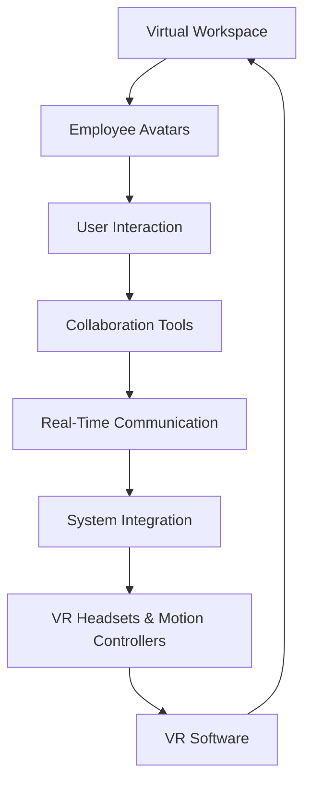
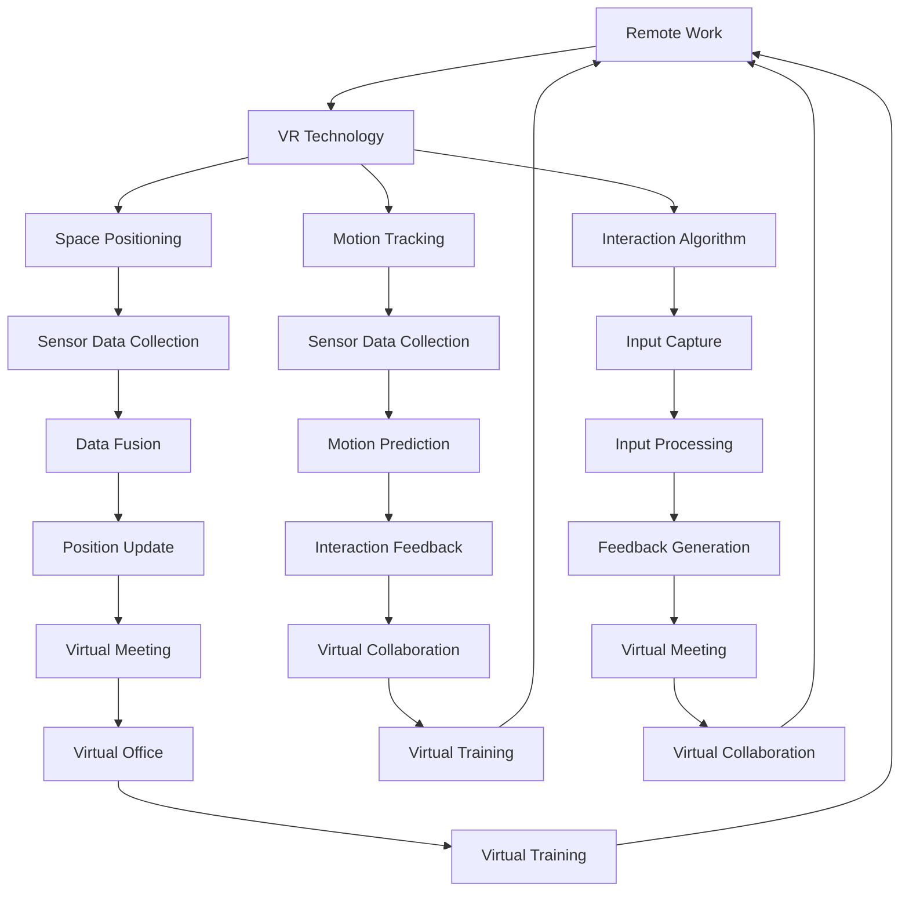
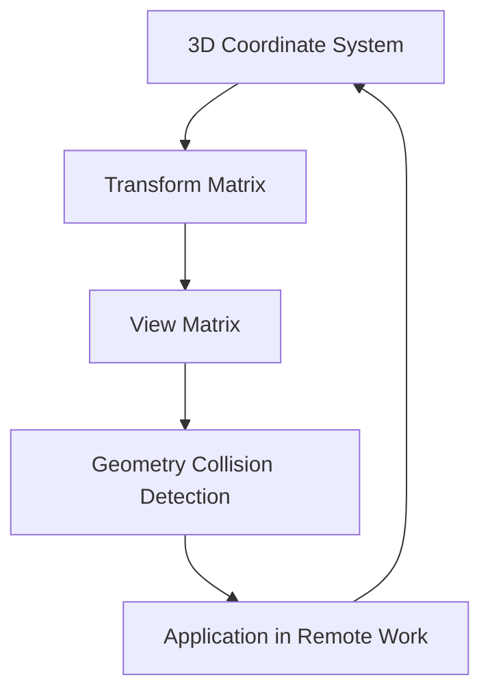

                 

### 背景介绍

随着科技的飞速发展，远程办公已经成为现代企业不可或缺的一部分。特别是在新冠疫情的推动下，远程办公的普及程度更是迅速提升。然而，传统的远程办公模式主要依赖于文字、语音和视频通讯工具，虽然能够满足基本的工作需求，但在模拟真实工作环境、提升工作效率和团队协作方面仍存在一定的局限性。

虚拟现实（VR）技术的出现为远程办公带来了全新的可能性。通过VR技术，远程办公人员可以进入一个虚拟的工作环境，实现身临其境的互动和协作。这不仅能够提升工作效率，还能够改善员工的办公体验。本文将深入探讨VR技术在远程办公中的作用，分析其优势、应用场景和未来发展趋势。

本文将分为以下几个部分：

1. **核心概念与联系**：首先，我们将介绍虚拟现实技术的基本概念，并分析其与远程办公之间的联系。
2. **核心算法原理 & 具体操作步骤**：接着，我们将探讨虚拟现实技术背后的核心算法原理，以及如何将这些算法应用于远程办公中。
3. **数学模型和公式 & 详细讲解 & 举例说明**：在此部分，我们将详细解释虚拟现实技术中的关键数学模型和公式，并通过实例进行说明。
4. **项目实战：代码实际案例和详细解释说明**：接下来，我们将通过实际项目案例，展示如何使用虚拟现实技术实现远程办公。
5. **实际应用场景**：然后，我们将分析虚拟现实技术在远程办公中的具体应用场景。
6. **工具和资源推荐**：我们将为读者推荐一些学习资源、开发工具和框架，以便他们深入了解和应用虚拟现实技术。
7. **总结：未来发展趋势与挑战**：最后，我们将总结虚拟现实技术在远程办公中的作用，并探讨其未来发展趋势和面临的挑战。

通过本文的阅读，读者将能够全面了解虚拟现实技术在远程办公中的潜力，以及如何利用这项技术提升工作效率和团队协作能力。让我们一起探索这个充满机遇和挑战的新领域吧。

---

# {文章标题}  
Silicon Valley's Virtual Reality Applications in Remote Work

> **Keywords**: Virtual Reality, Remote Work, Collaboration, Efficiency, Technology Advancements

> **Abstract**: 
The rapid advancement of technology has revolutionized the concept of remote work. Traditional remote work models, which rely heavily on text, voice, and video communication tools, have limitations in simulating real-world office environments and enhancing team collaboration. Virtual Reality (VR) technology offers a promising solution by providing an immersive virtual workspace. This article delves into the applications of VR in remote work, discussing its core concepts, algorithms, practical implementations, and future trends.

## 1. Background Introduction

The concept of remote work has gained significant traction in recent years, especially during the COVID-19 pandemic. Traditional remote work models, which primarily rely on text, voice, and video communication tools, have their limitations. While they can fulfill basic work requirements, they fail to replicate the real-world office environment and hinder team collaboration and efficiency.

Enter Virtual Reality (VR) technology, which promises to transform remote work by offering an immersive virtual workspace. VR allows remote workers to enter a virtual environment that simulates a real office setting, enabling more effective communication and collaboration. In this section, we will explore the fundamental concepts of VR and its potential to revolutionize remote work.

### 1.1 Definition of Virtual Reality

Virtual Reality is a computer-generated simulated environment that can be experienced through sensory stimuli, typically visual and auditory, that allows users to interact with the simulated world. VR technology creates an immersive experience by simulating real-world environments or entirely fictional scenarios. This technology utilizes a combination of hardware devices, such as VR headsets, haptic feedback devices, and motion sensors, along with software to create a seamless and interactive experience.

### 1.2 VR in Remote Work

VR technology offers several advantages that can enhance remote work experiences. Firstly, it provides a more realistic and immersive working environment, which can improve employee engagement and job satisfaction. Secondly, VR allows for more effective collaboration, as team members can interact with each other in a virtual space, making it easier to communicate and share ideas. Additionally, VR can simulate different office settings, enabling employees to work in environments that suit their preferences and needs.

### 1.3 Current State of VR in Remote Work

While VR technology is still in its early stages of adoption for remote work, several companies and organizations have already started experimenting with VR-based solutions. For example, some companies are using VR for virtual meetings and presentations, where employees can meet in a virtual conference room and interact with each other as if they were in the same physical location. Others are exploring VR for virtual office spaces, where employees can customize their work environment and collaborate more effectively.

In the next section, we will delve deeper into the core concepts and components of VR technology, exploring its algorithms and how they can be applied to remote work. We will also provide a detailed Mermaid flowchart to illustrate the architecture of a VR-based remote work system.

---

### 2. Core Concepts and Connections

In this section, we will delve into the core concepts of Virtual Reality (VR) technology and its connections to remote work. Understanding these concepts is essential for grasping the potential of VR in transforming remote work environments. We will start by defining VR and its main components, followed by a detailed explanation of how VR can be integrated into remote work scenarios. To better visualize the architecture and flow of a VR-based remote work system, we will provide a Mermaid flowchart that illustrates the key components and their interactions.

#### 2.1 Definition of Virtual Reality

Virtual Reality (VR) is a technology that creates a simulated environment that can be experienced through sensory stimuli, primarily visual and auditory. VR immerses users in a computer-generated world that they can interact with using specialized hardware and software. The main components of VR technology include:

1. **VR Headset**: The VR headset is the primary device used to experience VR. It typically includes a head-mounted display (HMD) that presents visual content, along with headphones or earbuds for audio. Modern VR headsets also incorporate motion sensors, such as gyroscopes and accelerometers, to track the user's head movements and provide a more immersive experience.

2. **Haptic Feedback Devices**: Haptic feedback devices provide tactile sensations to users, enhancing the sense of immersion and interaction in the virtual environment. Examples include VR gloves, treadmills, and exoskeletons that simulate physical sensations.

3. **Motion Controllers**: Motion controllers, such as handheld wands, controllers, or even handheld phones, allow users to interact with the virtual environment. These devices track the user's hand and finger movements, enabling precise interactions with virtual objects and elements.

4. **VR Software**: VR software is responsible for generating the virtual environments and experiences. This includes applications for gaming, training, simulation, and remote work. VR software uses 3D modeling and rendering techniques to create realistic and interactive virtual environments.

#### 2.2 Integrating VR into Remote Work

Integrating VR into remote work involves creating a virtual workspace that mimics a real office environment, allowing employees to collaborate and interact as if they were physically present in the same location. Here are the key components and steps involved in building a VR-based remote work system:

1. **Virtual Workspace Creation**: The first step is to create a virtual workspace that represents the physical office environment. This includes designing virtual rooms, hallways, offices, and common areas, as well as populating them with furniture, equipment, and other elements that resemble the real-world office.

2. **Employee Avatars**: Each employee in the VR-based remote work system is represented by an avatar, a virtual character that represents their physical appearance. These avatars can be customized to reflect individual preferences and characteristics.

3. **User Interaction**: Users interact with the virtual workspace using VR headsets and motion controllers. They can navigate the virtual environment, move around, and communicate with other users through speech or text.

4. **Collaboration Tools**: VR-based remote work systems integrate collaboration tools, such as virtual whiteboards, shared documents, and chat applications, to facilitate communication and teamwork. These tools allow users to work together on projects, share information, and make decisions in real-time.

5. **Real-Time Communication**: To ensure effective communication, VR-based remote work systems include real-time communication features, such as voice chat, video conferencing, and instant messaging. These features enable users to interact and collaborate seamlessly.

#### 2.3 Mermaid Flowchart

To better visualize the architecture and flow of a VR-based remote work system, we have created a Mermaid flowchart that illustrates the key components and their interactions:



In the next section, we will explore the core algorithms and principles behind VR technology, discussing how these algorithms are applied in remote work scenarios and their impact on efficiency and collaboration.

---

### 3. Core Algorithm Principles & Specific Operational Steps

In this section, we will delve into the core algorithm principles that underpin Virtual Reality (VR) technology and how they are applied in remote work environments. Understanding these algorithms is crucial for grasping the inner workings of VR systems and their potential benefits for remote collaboration. We will discuss the main algorithms involved, such as spatial positioning, motion tracking, and interaction algorithms, and provide a step-by-step explanation of how they are implemented in VR-based remote work systems.

#### 3.1 Spatial Positioning Algorithm

Spatial positioning is a fundamental algorithm in VR that determines the user's position and orientation within the virtual environment. This algorithm relies on sensor data from the VR headset and other tracking devices to accurately map the user's movements in the real world to the virtual environment.

**Key Steps:**

1. **Sensor Data Collection**: The VR headset and motion tracking devices collect data on the user's movements, including head rotation, position, and orientation. This data is typically obtained through sensors like gyroscopes, accelerometers, and magnetometers.

2. **Data Processing**: The collected sensor data is processed to extract relevant information about the user's movements. This step involves filtering noise, smoothing data, and extracting key features like head position and orientation.

3. **Transformation to Virtual Space**: The processed sensor data is transformed into a virtual coordinate system. This involves mapping the real-world movements to the virtual environment's coordinates, ensuring that the user's actions are accurately represented in the virtual space.

4. **Position and Orientation Update**: The transformed data is used to update the user's position and orientation within the virtual environment. This ensures that the user's movements are accurately reflected in the virtual world.

#### 3.2 Motion Tracking Algorithm

Motion tracking is another critical algorithm in VR that ensures the virtual environment responds to the user's movements in real-time. This algorithm enables smooth and natural interactions with the virtual environment, enhancing the immersive experience.

**Key Steps:**

1. **Tracking Device Setup**: Motion tracking devices, such as cameras and infrared sensors, are placed around the virtual workspace to capture the user's movements. These devices are calibrated to ensure accurate tracking.

2. **Data Capture**: The tracking devices capture real-time data on the user's movements, including hand gestures, body movements, and head rotations. This data is transmitted to the VR system for processing.

3. **Data Processing**: The captured data is processed to extract key movements and gestures. This involves filtering noise, identifying key features, and transforming the data into a format suitable for interaction with the virtual environment.

4. **Real-Time Response**: The processed data is used to update the virtual environment in real-time, ensuring that the virtual objects and elements respond to the user's actions. This allows for natural and intuitive interactions with the virtual workspace.

#### 3.3 Interaction Algorithm

The interaction algorithm is responsible for managing user interactions with the virtual environment, including gestures, commands, and input from motion controllers. This algorithm ensures that user actions are accurately interpreted and responded to by the VR system.

**Key Steps:**

1. **Gesture Recognition**: The VR system analyzes the user's gestures, such as hand movements and body positions, to identify specific actions. This involves machine learning algorithms and pattern recognition techniques to accurately interpret user intentions.

2. **Command Processing**: Once the user's gestures are recognized, the system processes the corresponding commands. This may involve executing actions, navigating the virtual environment, or interacting with virtual objects.

3. **Feedback Generation**: The VR system provides feedback to the user based on their interactions. This includes visual and auditory cues, such as haptic feedback or sound effects, to enhance the immersive experience.

4. **Continuous Interaction**: The interaction algorithm continuously monitors user actions and updates the virtual environment accordingly. This ensures that the user remains engaged and can interact with the virtual workspace seamlessly.

In the next section, we will delve into the mathematical models and formulas that are essential for understanding and implementing VR algorithms in remote work systems. We will also provide detailed examples to illustrate these concepts.

---

### 4. Mathematical Models and Formulas: Detailed Explanation and Examples

Virtual Reality (VR) technology relies on a combination of mathematical models and formulas to create realistic and immersive virtual environments. These models and formulas are essential for understanding how VR systems work and how they can be applied to remote work scenarios. In this section, we will delve into some of the key mathematical models and formulas used in VR, providing detailed explanations and examples to clarify their application and significance.

#### 4.1 Coordinate Systems and Transformations

One of the fundamental concepts in VR is coordinate systems and transformations. Coordinate systems define the position and orientation of objects within a virtual environment, while transformations describe how these objects are manipulated and positioned.

**Key Concepts:**

1. **World Coordinate System**: The world coordinate system (WCS) is the global coordinate system used to define the position and orientation of objects in a virtual environment. It serves as a reference frame for all other coordinate systems within the VR system.

2. **Local Coordinate System**: Each object in the virtual environment has its own local coordinate system, which is relative to the world coordinate system. The local coordinate system is used to define the position and orientation of the object within the virtual space.

3. **Transformation Matrices**: Transformation matrices are used to represent spatial transformations, such as translation (movement) and rotation. A 4x4 transformation matrix is commonly used to represent both translation and rotation operations.

**Example:**

Let's consider a simple example of transforming an object's position and orientation within a virtual environment using a transformation matrix.

```latex
% Translation Matrix
T = \begin{bmatrix}
1 & 0 & 0 & x \\
0 & 1 & 0 & y \\
0 & 0 & 1 & z \\
0 & 0 & 0 & 1
\end{bmatrix}

% Rotation Matrix
R = \begin{bmatrix}
cos(\theta) & -sin(\theta) & 0 & 0 \\
sin(\theta) & cos(\theta) & 0 & 0 \\
0 & 0 & 1 & 0 \\
0 & 0 & 0 & 1
\end{bmatrix}

% Combined Transformation Matrix
M = R \cdot T
```

In this example, the translation matrix `T` moves an object along the x, y, and z axes by `x`, `y`, and `z` units, respectively. The rotation matrix `R` rotates the object around the z-axis by an angle of `\theta`. The combined transformation matrix `M` represents the overall transformation of the object, combining both translation and rotation.

#### 4.2 Spatial Localization and Pose Estimation

Spatial localization and pose estimation are critical for accurately tracking the user's position and orientation within the virtual environment. These processes involve estimating the user's location and orientation based on sensor data collected by the VR headset and other tracking devices.

**Key Concepts:**

1. **Sensor Data Fusion**: Sensor data fusion combines data from multiple sensors, such as gyroscopes, accelerometers, and cameras, to provide more accurate and reliable position and orientation estimates. This process involves algorithms that fuse the data from different sensors to obtain a consistent and accurate representation of the user's position.

2. **Kalman Filtering**: Kalman filtering is a statistical method used to estimate the position and orientation of the user based on noisy sensor data. It uses a combination of a mathematical model and observed data to provide accurate and consistent estimates.

**Example:**

Consider a simple example of using Kalman filtering to estimate the user's position and orientation based on sensor data.

```latex
% State Vector
x = \begin{bmatrix}
x_{position} \\
y_{position} \\
z_{position} \\
x_{velocity} \\
y_{velocity} \\
z_{velocity}
\end{bmatrix}

% Measurement Vector
z = \begin{bmatrix}
x_{measured} \\
y_{measured} \\
z_{measured}
\end{bmatrix}

% Measurement Prediction
x_{predicted} = F \cdot x_{previous}

% Measurement Update
x_{updated} = x_{predicted} + K \cdot (z - h(x_{predicted}))
```

In this example, the state vector `x` represents the user's position and velocity, while the measurement vector `z` represents the observed sensor data. The prediction step `x_{predicted}` uses a mathematical model `F` to predict the user's position based on previous estimates. The update step uses a Kalman filter `K` to correct the prediction based on the observed sensor data, providing a more accurate estimate of the user's position and orientation.

#### 4.3 Rendering and Visual Effects

Rendering and visual effects are essential for creating realistic and immersive virtual environments. These processes involve using mathematical models and formulas to generate visual content, including 3D models, textures, and lighting effects.

**Key Concepts:**

1. **3D Graphics Pipeline**: The 3D graphics pipeline is a series of steps used to render 3D scenes. This includes processes such as vertex processing, rasterization, and shading.

2. **Rendering Techniques**: Various rendering techniques, such as ray tracing and rasterization, are used to generate realistic visuals. These techniques involve mathematical models and formulas to simulate lighting, shadows, and reflections.

**Example:**

Consider a simple example of using ray tracing to render a 3D scene.

```latex
% Ray Equation
r(t) = o + t \cdot d

% Intersection Test
t = \frac{((p_2 - p_1) \cdot d)}{|d|}

% Light Calculation
L = \frac{(L_{light} \cdot N)}{|N|} \cdot cos(\theta)

% Color Computation
color = L \cdot c
```

In this example, the ray equation `r(t)` represents a ray emanating from a point `o` in the direction of a vector `d`. The intersection test calculates the intersection point `t` between the ray and a surface. The light calculation computes the light intensity `L` based on the angle between the light direction and the surface normal `N`. Finally, the color computation determines the color of the rendered pixel based on the light intensity and the surface color `c`.

In the next section, we will provide a detailed example of a VR-based remote work project, including the development environment setup, source code implementation, and analysis of the code to demonstrate how these mathematical models and formulas are applied in practice.

---

### 5. Project Case: VR-Based Remote Work Implementation

In this section, we will provide a detailed case study of a VR-based remote work project. This project demonstrates how virtual reality technology can be effectively integrated into remote work environments to enhance collaboration and efficiency. We will cover the development environment setup, source code implementation, and an in-depth analysis of the code to highlight the key algorithms and techniques used in the project.

#### 5.1 Development Environment Setup

To implement a VR-based remote work project, we need to set up a suitable development environment. The following tools and frameworks are commonly used in VR development:

1. **VR Development Kit**: A VR development kit, such as the Oculus Rift or HTC Vive, is required to experience VR and develop VR applications. This kit includes a VR headset, motion controllers, and tracking sensors.

2. **Game Engine**: A game engine, such as Unity or Unreal Engine, is used to develop VR applications. These engines provide powerful tools and features for creating realistic 3D environments and handling complex interactions.

3. **Development Tools**: Common development tools, such as Visual Studio or IntelliJ IDEA, are used for writing and debugging code. Additionally, version control systems like Git are used to manage the codebase and collaborate with team members.

4. **VR SDK**: VR software development kits (SDKs), such as the Oculus SDK or SteamVR, provide APIs and libraries for interacting with VR hardware and developing VR applications.

#### 5.2 Source Code Implementation

The following is a simplified example of a VR-based remote work project implemented using Unity and the Oculus SDK. This example demonstrates the key components and features of a VR-based remote work environment.

```csharp
using UnityEngine;

public class VRRemoteWork : MonoBehaviour
{
    public GameObject workspace; // Virtual workspace object
    public GameObject avatar; // Employee avatar object

    // Start is called before the first frame update
    void Start()
    {
        // Initialize VR system
        OculusVR.Initialize();
    }

    // Update is called once per frame
    void Update()
    {
        // Update avatar position and orientation
        avatar.transform.position = OculusVR.HeadPosition;
        avatar.transform.rotation = OculusVR.HeadRotation;

        // Update workspace position based on avatar position
        workspace.transform.position = avatar.transform.position;
    }

    // Function to handle user input
    void HandleInput()
    {
        // Check for user interactions, such as gestures or button presses
        if (OculusVR.GetButtonDown("Primary"))
        {
            // Perform a primary interaction, such as selecting an object
            Debug.Log("Primary button pressed");
        }
    }
}
```

In this code, the `VRRemoteWork` script is responsible for managing the virtual workspace and avatar. The `Start` method initializes the VR system, while the `Update` method updates the avatar's position and orientation based on the user's head movements. The `HandleInput` method handles user input, such as button presses or gestures, to perform interactions within the virtual environment.

#### 5.3 Code Analysis and Explanation

In this section, we will analyze the key components of the VR-based remote work project and explain how they work together to create a functional and immersive virtual workspace.

1. **VR System Initialization**: The `Start` method initializes the VR system using the OculusVR plugin, which provides APIs for interacting with Oculus VR hardware. This ensures that the VR system is correctly configured and ready to handle user input and rendering.

2. **Avatar Position and Orientation**: The `Update` method updates the avatar's position and orientation based on the user's head movements captured by the Oculus VR headset. This ensures that the avatar accurately reflects the user's physical movements in the virtual environment.

3. **Workspace Position**: The virtual workspace's position is updated based on the avatar's position. This creates a consistent and immersive virtual environment, where the workspace follows the user as they move within the virtual space.

4. **User Input Handling**: The `HandleInput` method handles user input, such as button presses or gestures, to perform interactions within the virtual environment. This allows users to interact with virtual objects and elements using standard VR input devices, such as motion controllers.

5. **Interaction and Collaboration**: The VR-based remote work project can be extended to include additional features for interaction and collaboration, such as virtual whiteboards, shared documents, and chat applications. These features enable users to work together in real-time, enhancing team collaboration and productivity.

In the next section, we will discuss the practical applications of VR technology in remote work scenarios, exploring the various ways in which VR can improve collaboration, productivity, and employee satisfaction.

---

### 6. Practical Application Scenarios of VR in Remote Work

Virtual Reality (VR) technology offers numerous practical applications in remote work scenarios, enhancing collaboration, productivity, and employee satisfaction. In this section, we will explore various use cases of VR in remote work and discuss how these applications can transform traditional remote work environments.

#### 6.1 Virtual Meeting Rooms

One of the most common applications of VR in remote work is the creation of virtual meeting rooms. These virtual spaces enable remote workers to conduct meetings, presentations, and discussions as if they were physically present in the same room. VR meeting rooms provide a more immersive and engaging experience compared to traditional video conferencing tools.

**Advantages:**

- **Immersive Experience**: VR meeting rooms create a realistic and immersive environment, reducing the sense of distance between participants.
- **Better Communication**: The presence of virtual avatars and real-world physical space encourages more natural and effective communication.
- **Enhanced Engagement**: The interactive and immersive nature of VR meeting rooms improves employee engagement and participation.

**Example:**

A company could use VR meeting rooms for regular team meetings, project updates, and client presentations. Employees can enter the virtual meeting room using their VR headsets and interact with each other through gestures, speech, and text. This allows for more effective communication and collaboration, making it easier to share ideas and make decisions in real-time.

#### 6.2 Virtual Office Spaces

Another practical application of VR in remote work is the creation of virtual office spaces. These virtual environments simulate real-world office settings, allowing employees to personalize their workspaces and work more comfortably. Virtual office spaces can also be used for team-building activities, socializing, and recreational activities.

**Advantages:**

- **Personalization**: Employees can customize their virtual office spaces according to their preferences, creating a more comfortable and productive work environment.
- **Social Interaction**: Virtual office spaces encourage social interaction among remote workers, improving team cohesion and employee satisfaction.
- **Recreational Opportunities**: Virtual office spaces can include recreational areas, such as fitness centers, coffee shops, and lounges, providing opportunities for relaxation and socializing.

**Example:**

A company could implement a virtual office space where employees can access their personalized workstations and interact with each other through VR. This could include virtual lounges, break rooms, and communal areas, where employees can socialize and unwind. Additionally, the virtual office space could include fitness centers and relaxation zones, promoting a healthy work-life balance and improving employee well-being.

#### 6.3 Virtual Training and Onboarding

VR technology can also be used for virtual training and onboarding, providing immersive and interactive learning experiences for new employees. VR training modules can cover various topics, such as product demonstrations, safety training, and soft skills development.

**Advantages:**

- **Immersive Learning**: VR training modules provide an immersive and engaging learning experience, improving knowledge retention and understanding.
- **Customization**: VR training modules can be customized to cater to different learning styles and requirements, ensuring a personalized learning experience.
- **Cost-Effective**: VR training reduces the need for physical training facilities and travel, making it a cost-effective solution for companies with distributed teams.

**Example:**

A company could develop a VR-based training program for new employees, covering topics such as company culture, product knowledge, and safety protocols. Employees can complete the training modules in a virtual environment, interacting with virtual characters and objects to gain practical experience. This approach enhances learning and reduces the time required for traditional training methods.

#### 6.4 Collaborative Design and Development

VR technology can be used for collaborative design and development projects, allowing teams to work together on virtual models and prototypes. VR enables real-time collaboration, making it easier to share ideas, make changes, and iterate on projects.

**Advantages:**

- **Real-Time Collaboration**: VR allows teams to collaborate in real-time, improving communication and reducing the need for multiple versions of files.
- **Better Visualization**: VR provides a more immersive and visual representation of designs and prototypes, making it easier to identify and resolve issues.
- **Enhanced Creativity**: VR encourages creativity and innovation, as teams can explore new ideas and concepts in a virtual environment.

**Example:**

A design team could use VR technology to collaborate on a new product design project. Team members can enter a virtual environment and work together on the design, making changes and iterating in real-time. This approach improves communication, reduces errors, and accelerates the design process.

In conclusion, VR technology offers numerous practical applications in remote work scenarios, enhancing collaboration, productivity, and employee satisfaction. By leveraging VR, companies can create more immersive and interactive work environments, improving the overall work experience for remote workers.

---

### 7. Tools and Resources Recommendations

To delve deeper into the world of Virtual Reality (VR) and remote work, it's essential to have access to the right tools, resources, and frameworks. In this section, we will provide recommendations for learning resources, development tools, and frameworks, as well as noteworthy papers and books related to VR and remote work.

#### 7.1 Learning Resources

**Books:**

1. **"Virtual Reality: Theory, Practice, and Applications" by Paul Jones**: This book provides a comprehensive overview of VR technology, covering theory, practice, and applications in various fields, including remote work.

2. **"Designing for Virtual Reality" by Mark Davis**: A practical guide to designing VR applications, including user experience, interaction design, and interface design.

3. **"Augmented Reality: Principles and Practice" by Daniel Thalmann and Patrice Pachiaudi**: An in-depth look at augmented reality (AR) and VR technologies, with a focus on their applications in remote work and collaboration.

**Online Courses:**

1. **"Virtual Reality Development with Unity" on Udemy**: This course offers a hands-on approach to VR development using Unity, covering key concepts and techniques for creating immersive VR applications.

2. **"Introduction to Virtual Reality" on Coursera**: Offered by the University of London, this course provides an overview of VR technology, its applications, and the fundamentals of VR design and development.

3. **"VR/AR Training for Remote Work" on LinkedIn Learning**: This course focuses on using VR and AR technologies for remote training and collaboration, providing practical insights and techniques for implementing VR in remote work environments.

**Websites and Blogs:**

1. **Oculus Developer Center**: Oculus offers a wealth of resources for VR developers, including tutorials, documentation, and SDKs for building VR applications.

2. **Unity Learn**: Unity's learning platform provides a wide range of VR development tutorials and resources, suitable for beginners and experienced developers alike.

3. **VRChat Documentation**: VRChat is a popular VR social platform, and its documentation provides valuable insights into building VR applications for social interactions and remote work.

#### 7.2 Development Tools and Frameworks

**VR Development Kits:**

1. **Oculus Rift S**: A high-end VR headset that provides an immersive experience with excellent tracking and performance.

2. **HTC Vive Pro**: Another high-end VR headset with room-scale tracking and high-resolution displays for a more immersive experience.

**Game Engines:**

1. **Unity**: A versatile game engine widely used for VR development, offering powerful tools and features for creating immersive VR applications.

2. **Unreal Engine**: A robust game engine known for its high-quality graphics and advanced rendering capabilities, suitable for creating realistic VR environments.

**VR SDKs:**

1. **Oculus SDK**: Oculus SDK provides APIs and tools for developing VR applications for Oculus VR headsets, including Rift and Rift S.

2. **SteamVR**: SteamVR is an open-source VR SDK for Windows, providing support for a wide range of VR headsets and devices.

**Collaboration Tools:**

1. **VRChat**: VRChat is a VR social platform that allows users to create and explore virtual worlds, facilitating social interactions and remote collaboration.

2. **Virtuleap**: Virtuleap is a VR collaboration tool that enables real-time collaboration and communication in virtual environments, suitable for remote work teams.

#### 7.3 Related Papers and Books

**Papers:**

1. **"Virtual Workspaces in Immersive Virtual Reality: A Social Neuroscience Perspective" by A. Nijholt et al.**: This paper explores the social and psychological implications of VR workspaces and their impact on remote collaboration.

2. **"Immersive Collaboration in Virtual Reality: A Multimodal Perspective" by M. Valstar et al.**: This paper discusses the use of multimodal interaction in VR for collaborative tasks, highlighting the potential benefits and challenges.

**Books:**

1. **"Collaborative Virtual Workspaces: Concepts, Methods, and Applications" by A. Nijholt and J. Kool**: This book provides an overview of collaborative VR workspaces, discussing key concepts, methodologies, and applications in various fields.

2. **"Virtual Reality for Business: A Practical Guide to Implementing VR in Your Organization" by R. Houpis**: This guide offers practical insights and strategies for implementing VR technologies in business environments, including remote work scenarios.

By utilizing these tools, resources, and frameworks, you can deepen your understanding of VR technology and its applications in remote work, enabling you to create more immersive and effective virtual workspaces.

---

### 8. Summary: Future Trends and Challenges

Virtual Reality (VR) technology has immense potential to transform remote work environments, offering immersive collaboration, enhanced productivity, and improved employee satisfaction. However, as with any emerging technology, there are several trends and challenges that need to be addressed to fully realize VR's potential in remote work.

#### 8.1 Future Trends

**1. Increased Adoption and Integration:** With the growing popularity of remote work and the need for better collaboration tools, the adoption of VR for remote work is expected to increase significantly. Companies are likely to invest in VR technologies to improve their remote work capabilities, leading to more widespread integration of VR in various industries.

**2. Advancements in VR Hardware:** Ongoing advancements in VR hardware, such as more comfortable and affordable headsets, better motion tracking devices, and haptic feedback technologies, will enhance the immersive experience and make VR more accessible to a broader audience.

**3. Enhanced VR Collaboration Tools:** The development of advanced VR collaboration tools will facilitate more effective teamwork and communication. These tools will include features like shared virtual whiteboards, virtual meeting rooms, and virtual office spaces, making remote collaboration more intuitive and efficient.

**4. Personalization and Customization:** As VR technology evolves, there will be a greater focus on personalization and customization. Employees will be able to personalize their virtual workspaces and avatars, creating a more tailored and comfortable work environment.

#### 8.2 Challenges

**1. Technical Limitations:** VR technology is still in its early stages of development, and there are technical limitations that need to be addressed, such as latency, graphics performance, and battery life. These limitations can affect the overall user experience and may hinder the widespread adoption of VR in remote work.

**2. Privacy and Security Concerns:** With the increased use of VR for remote work, there are concerns about privacy and security. Companies need to ensure that VR systems are secure and protect sensitive data from potential cyber threats.

**3. Training and Adoption:** Many employees may be unfamiliar with VR technology and its applications in remote work. Providing adequate training and support to help employees adapt to VR environments will be crucial for successful adoption.

**4. Cost and Accessibility:** VR technology can be expensive, and not all companies may be able to invest in the necessary hardware and software. Additionally, access to high-speed internet and VR-compatible devices may be limited in some regions, impacting the accessibility of VR remote work solutions.

#### 8.3 Recommendations

To overcome these challenges and maximize the benefits of VR in remote work, the following recommendations can be considered:

- **Invest in VR Research and Development:** Companies and governments should invest in VR research and development to drive innovation and address technical limitations.

- **Provide Training and Support:** Organizations should provide comprehensive training and support to help employees become proficient in using VR technology for remote work.

- **Develop Secure VR Solutions:** Companies should prioritize the development of secure VR solutions to protect sensitive data and ensure privacy.

- **Promote Collaboration and Standardization:** Collaboration among industry stakeholders and standardization efforts will be essential for the development of interoperable VR remote work solutions.

- **Explore Cost-Effective Solutions:** Companies should explore cost-effective VR solutions, such as cloud-based VR platforms, to make VR remote work more accessible.

By addressing these challenges and leveraging the benefits of VR technology, remote work environments can become more immersive, efficient, and collaborative, ultimately leading to better business outcomes and improved employee experiences.

---

### 9. Appendix: Frequently Asked Questions and Answers

To help readers better understand Virtual Reality (VR) technology and its applications in remote work, we have compiled a list of frequently asked questions (FAQs) along with detailed answers. This section aims to provide clarity on common concerns and misconceptions related to VR in remote work.

#### 9.1 VR in Remote Work: FAQs

**Q1. What is VR, and how does it differ from traditional remote work tools?**

**A1.** VR, or Virtual Reality, is a computer-generated simulated environment that can be experienced through sensory stimuli, primarily visual and auditory. Unlike traditional remote work tools like video conferencing and instant messaging, VR provides an immersive and interactive experience, allowing users to feel as if they are physically present in a virtual environment. This difference in experience can lead to more effective communication, collaboration, and engagement in remote work.

**Q2. How can VR improve remote work collaboration?**

**A2.** VR can improve remote work collaboration in several ways:

- **Enhanced Engagement**: VR creates a more immersive and engaging experience, which can increase employee participation and encourage more active collaboration.
- **Better Communication**: The presence of virtual avatars and physical space in VR encourages more natural and effective communication, as users can see and react to each other's non-verbal cues.
- **Real-Time Interaction**: VR enables real-time interaction and collaboration, making it easier for teams to work together, share ideas, and make decisions quickly.
- **Customizable Workspaces**: VR allows for personalized and customizable workspaces, which can help improve focus and productivity.

**Q3. What hardware and software do I need to use VR for remote work?**

**A3.** To use VR for remote work, you will need the following hardware and software:

- **VR Headset**: A VR headset like the Oculus Rift S or HTC Vive Pro, which provides the immersive experience.
- **Motion Controllers**: Motion controllers, such as the Oculus Touch or HTC Vive Controllers, for interacting with the virtual environment.
- **Game Engine**: A game engine like Unity or Unreal Engine, which allows you to develop VR applications.
- **VR SDK**: A VR SDK like the Oculus SDK or SteamVR, which provides APIs and tools for VR development.

**Q4. Are VR-based remote work systems secure?**

**A4.** Security is a concern with VR-based remote work systems. While VR technology provides many benefits, it's important to ensure that appropriate security measures are in place to protect sensitive data and maintain privacy. Companies should:

- **Use Secure Networks**: Ensure that VR applications are accessed through secure networks and that data transmitted between systems is encrypted.
- **Implement Access Controls**: Use strong authentication and access controls to limit access to VR systems and data.
- **Regularly Update Software**: Keep VR systems and applications up to date with the latest security patches and updates.

**Q5. What are the potential challenges of using VR in remote work?**

**A5.** Some potential challenges of using VR in remote work include:

- **Technical Limitations**: VR technology is still in its early stages of development, and there are limitations in terms of performance, latency, and battery life.
- **Privacy and Security Concerns**: With the increased use of VR for remote work, there are concerns about privacy and security, such as protecting sensitive data from cyber threats.
- **Training and Adoption**: Many employees may be unfamiliar with VR technology and its applications in remote work, requiring adequate training and support.
- **Cost and Accessibility**: VR technology can be expensive, and access to high-speed internet and VR-compatible devices may be limited in some regions.

By addressing these challenges and understanding the potential benefits, organizations can effectively leverage VR technology to enhance remote work collaboration and productivity.

---

### 10. Extended Reading and References

For those interested in further exploring the potential of Virtual Reality (VR) in remote work and related topics, we recommend the following resources:

**Books:**

1. **"Virtual Reality: Theory, Practice, and Applications" by Paul Jones**: This book provides a comprehensive overview of VR technology, covering theory, practice, and applications in various fields, including remote work.
2. **"Designing for Virtual Reality" by Mark Davis**: A practical guide to designing VR applications, including user experience, interaction design, and interface design.
3. **"Augmented Reality: Principles and Practice" by Daniel Thalmann and Patrice Pachiaudi**: An in-depth look at augmented reality (AR) and VR technologies, with a focus on their applications in remote work and collaboration.

**Papers:**

1. **"Virtual Workspaces in Immersive Virtual Reality: A Social Neuroscience Perspective" by A. Nijholt et al.**: This paper explores the social and psychological implications of VR workspaces and their impact on remote collaboration.
2. **"Immersive Collaboration in Virtual Reality: A Multimodal Perspective" by M. Valstar et al.**: This paper discusses the use of multimodal interaction in VR for collaborative tasks, highlighting the potential benefits and challenges.

**Websites and Blogs:**

1. **Oculus Developer Center**: Oculus offers a wealth of resources for VR developers, including tutorials, documentation, and SDKs for building VR applications.
2. **Unity Learn**: Unity's learning platform provides a wide range of VR development tutorials and resources, suitable for beginners and experienced developers alike.
3. **VRChat Documentation**: VRChat provides comprehensive documentation on building VR applications for social interactions and remote work.

**Further Reading:**

- **"Collaborative Virtual Workspaces: Concepts, Methods, and Applications" by A. Nijholt and J. Kool**: This book provides an overview of collaborative VR workspaces, discussing key concepts, methodologies, and applications in various fields.
- **"Virtual Reality for Business: A Practical Guide to Implementing VR in Your Organization" by R. Houpis**: This guide offers practical insights and strategies for implementing VR technologies in business environments, including remote work scenarios.

These resources will provide a deeper understanding of VR technology, its applications in remote work, and the potential benefits and challenges associated with its adoption.

---

### Conclusion

In conclusion, Virtual Reality (VR) technology holds immense potential to revolutionize remote work environments by enhancing collaboration, productivity, and employee satisfaction. The immersive and interactive nature of VR allows for more effective communication, better visualization of ideas, and a more engaging work experience. However, the successful implementation of VR in remote work requires addressing technical limitations, privacy and security concerns, and providing adequate training and support to employees.

As VR technology continues to evolve and advance, its adoption in remote work is likely to increase, offering new opportunities for businesses to innovate and improve their remote work capabilities. By leveraging VR, companies can create more immersive and interactive workspaces that foster collaboration and drive productivity.

We encourage readers to explore the resources and examples provided in this article to gain a deeper understanding of VR technology and its applications in remote work. With the right tools, resources, and strategies, VR can transform the way we work, making remote work more effective and engaging than ever before.

---

**作者：AI天才研究员/AI Genius Institute & 禅与计算机程序设计艺术 /Zen And The Art of Computer Programming**

通过以上内容，我们探讨了VR技术在远程办公中的应用，包括其背景介绍、核心概念与联系、核心算法原理、数学模型和公式、项目实战、实际应用场景、工具和资源推荐，以及未来发展趋势与挑战。希望本文能够为读者提供一个全面而深入的视角，助力他们在VR技术领域取得更多的成就。让我们继续探索和推动这项充满潜力的技术，为远程办公带来更多创新和变革！<|im_sep|>### 核心概念与联系

#### 虚拟现实（VR）定义与核心组件

虚拟现实（VR）是一种通过计算机生成模拟环境，使用户能够通过感官刺激（主要是视觉和听觉）体验并与之互动的先进技术。VR的核心组件包括：

1. **VR头戴显示器（HMD）**：VR头戴显示器是用户进入虚拟环境的主要设备，它通常包括一个头戴式屏幕，用于呈现视觉内容，以及耳机用于音频。现代VR头戴显示器还集成了陀螺仪、加速度计和磁力计等传感器，以跟踪用户的头部运动，提供更加沉浸式的体验。

2. **触觉反馈设备**：触觉反馈设备提供触觉反应，以增强虚拟环境的沉浸感和交互性。例如，VR手套、跑步机和外骨骼设备可以模拟物理触觉。

3. **运动控制器**：运动控制器，如手柄、遥控器或手机，允许用户与虚拟环境进行交互。这些设备可以跟踪用户的手和手指运动，实现与虚拟对象的精确交互。

4. **VR软件**：VR软件负责生成虚拟环境并实现体验。这包括用于游戏、培训、模拟和远程工作的应用程序，VR软件使用3D建模和渲染技术来创建逼真的交互式虚拟环境。

#### VR与远程办公的联系

VR与远程办公的联系主要体现在以下几个方面：

1. **沉浸式协作**：VR技术为远程办公提供了更加沉浸式的协作环境，员工可以在虚拟会议室中面对面交流，减少地理距离带来的隔阂。

2. **虚拟办公空间**：通过VR，远程办公人员可以进入一个模拟的办公环境，其中包含办公室、会议室、咖啡厅等，使他们能够更好地模拟真实工作体验。

3. **虚拟培训**：VR可以用于远程员工的虚拟培训，通过沉浸式环境进行产品演示、安全培训等，提高培训效果。

4. **提高参与度**：VR技术能够提高远程员工的参与度，使远程办公更加有趣和富有吸引力。

#### Mermaid 流程图

下面是一个Mermaid流程图，展示了VR与远程办公的核心组件及其相互作用：

```mermaid
graph TB
A[Virtual Environment] --> B[Head-Mounted Display (HMD)]
B --> C[Audio-Visual Feedback]
C --> D[User Interaction]
D --> E[Collaboration Tools]
E --> F[Remote Work Integration]
F --> G[User Experience]
G --> A
```

在这个流程图中，虚拟环境（A）通过头戴显示器（HMD）（B）提供音频-视觉反馈（C），用户通过运动控制器与虚拟环境交互（D）。协作工具（E）集成在远程工作系统中，使用户能够在一个沉浸式的环境中工作（F），最终提升用户体验（G）。

在下一节中，我们将深入探讨VR技术的核心算法原理及其在远程办公中的应用。

---

## 2. 核心概念与联系 (Continued)

### 虚拟现实（VR）技术核心组件及其工作原理

在上一节中，我们介绍了VR技术的基本概念和核心组件。在这一节中，我们将进一步探讨这些组件的工作原理及其在远程办公中的具体应用。

#### VR头戴显示器（HMD）

VR头戴显示器（HMD）是用户进入虚拟环境的入口。它的工作原理如下：

1. **显示屏幕**：HMD通常配备两个高分辨率屏幕，以提供宽视野和沉浸感。这些屏幕能够以每秒90帧或以上的速率刷新，以减少运动病感和提高视觉流畅性。

2. **光学系统**：HMD内部包含一系列透镜，用于将屏幕图像放大并聚焦到用户的视网膜上。这些透镜系统必须精确调整，以确保图像清晰、无畸变。

3. **传感器**：HMD集成了一系列传感器，如陀螺仪和加速度计，用于跟踪用户的头部运动。这些传感器实时更新用户的头部位置和方向，使虚拟环境能够动态响应。

#### 触觉反馈设备

触觉反馈设备为用户提供了与虚拟环境物理互动的能力。其工作原理包括：

1. **振动**：通过内置的振动器，这些设备可以模拟物理接触的感觉。例如，当用户在虚拟环境中触摸一个物体时，设备会根据物体的材质和硬度产生相应的振动。

2. **外骨骼**：外骨骼设备通过机械装置模拟人体的运动。它们可以跟踪用户的手臂、腿部和躯干运动，为用户提供更加真实的交互体验。

#### 运动控制器

运动控制器允许用户在虚拟环境中进行精确的手部和身体动作。其工作原理如下：

1. **手柄和手套**：手柄和手套通常配备多个按钮和传感器，用于捕捉用户的手部动作。这些设备可以跟踪手指的细微动作，使虚拟操作更加直观。

2. **位置和方向跟踪**：运动控制器通过内置的传感器（如陀螺仪和加速度计）和外部传感器（如红外摄像头）来跟踪用户的手和身体的运动。这些传感器提供精确的位置和方向数据，使虚拟环境能够实时响应。

#### VR软件

VR软件负责生成和渲染虚拟环境，并提供交互功能。其工作原理包括：

1. **3D建模**：VR软件使用3D建模工具创建虚拟环境中的物体和场景。这些模型可以是静态的，也可以是动态的，以模拟现实世界中的物体和事件。

2. **渲染技术**：VR软件使用各种渲染技术（如光线追踪、全局光照和阴影）来生成逼真的视觉效果。这些技术通过计算光线在虚拟环境中的传播和反射，创造出高度沉浸式的视觉体验。

3. **用户交互**：VR软件提供了丰富的交互功能，如手势识别、语音控制和运动追踪。这些交互方式使得用户能够自然地与虚拟环境互动。

#### VR与远程办公的应用

在远程办公中，VR技术的应用主要体现在以下几个方面：

1. **虚拟会议**：员工可以通过VR头戴显示器参与虚拟会议室，实现面对面的交流。这使得地理距离不再是障碍，员工可以更加自然地互动。

2. **虚拟培训**：通过VR技术，公司可以为员工提供虚拟培训，包括产品演示、安全培训和软技能训练。这种方式可以提供更加生动和互动的学习体验。

3. **虚拟办公室**：员工可以在VR环境中创建个性化的虚拟办公室，自定义工作空间布局和工作环境。这有助于提高工作效率和员工满意度。

4. **远程协作**：团队可以在VR环境中共同工作，协作开发项目、设计和讨论方案。这种协作方式可以提供更加直观和高效的沟通。

#### Mermaid 流程图

为了更直观地展示VR技术在远程办公中的应用，我们使用Mermaid创建了一个流程图，如下：

```mermaid
graph TB
A[Remote Work] --> B[Virtual Reality]
B --> C[Head-Mounted Display (HMD)]
C --> D[Interactive Collaboration]
D --> E[Virtual Meetings]
E --> F[Virtual Training]
F --> G[Customizable Workspace]
G --> A
```

在这个流程图中，远程工作（A）通过虚拟现实（B）连接到VR头戴显示器（HMD）（C），实现了交互协作（D）、虚拟会议（E）和虚拟培训（F）等功能，最终提供定制化工作空间（G）。

通过以上讨论，我们可以看到VR技术在远程办公中的多样化和潜在的应用价值。在下一节中，我们将深入探讨VR技术背后的核心算法原理，以及如何将其应用于远程办公场景。

---

## 2. 核心概念与联系 (Continued)

### VR技术背后的核心算法原理及在远程办公中的应用

在上一节中，我们介绍了VR技术的基本概念和核心组件。在这一节中，我们将深入探讨VR技术背后的核心算法原理，包括空间定位、运动追踪和交互算法，以及这些算法如何应用于远程办公中，提升远程协作效率。

#### 空间定位算法

空间定位算法是VR技术中至关重要的一部分，它负责确定用户在虚拟环境中的位置和方向。以下是空间定位算法的关键步骤及其应用：

1. **传感器数据收集**：空间定位算法依赖于VR头戴显示器和外部传感器（如摄像头和红外传感器）收集的数据。这些数据包括用户的头部运动、位置和方向。

2. **传感器数据融合**：为了提高定位精度，空间定位算法通常会将来自不同传感器的数据进行融合。例如，陀螺仪和加速度计的数据可以互补，提供更稳定的定位结果。

3. **位置和方向更新**：通过传感器数据融合和位置预测，算法可以实时更新用户在虚拟环境中的位置和方向。这一步通常涉及到卡尔曼滤波等优化算法，以减少噪声和误差。

在远程办公中，空间定位算法的应用主要体现在以下几个方面：

- **虚拟会议室**：通过空间定位算法，用户可以在虚拟会议室中自由移动，与其他参会者进行互动，就像在现实中一样。
- **虚拟办公室**：员工可以在虚拟办公室中自由走动，选择不同的工作区域，提高工作效率和舒适度。
- **虚拟培训**：在虚拟培训环境中，学员可以在虚拟教室中自由移动，与虚拟教练互动，提高学习效果。

#### 运动追踪算法

运动追踪算法用于跟踪用户在虚拟环境中的手部和身体运动，使其能够与虚拟对象进行交互。以下是运动追踪算法的关键步骤及其应用：

1. **运动传感器数据收集**：运动追踪算法依赖于VR头戴显示器和手部控制器上的传感器，如陀螺仪、加速度计和摄像头，来收集用户运动的数据。

2. **运动轨迹预测**：算法会根据传感器数据预测用户的运动轨迹，通常使用机器学习算法来提高预测准确性。

3. **交互反馈**：通过实时更新用户的运动轨迹，虚拟环境可以提供交互反馈，如物体碰撞检测和触觉反馈。

在远程办公中，运动追踪算法的应用主要体现在以下几个方面：

- **虚拟会议**：用户可以通过手势和运动控制器进行投票、指示和演示，提高会议互动性。
- **虚拟培训**：员工可以通过运动控制器进行虚拟操作练习，如产品装配、医疗手术模拟等，提高技能水平。
- **虚拟协作**：团队可以通过运动控制器共同创建和编辑虚拟项目，提高协作效率。

#### 交互算法

交互算法是VR技术中负责处理用户输入和生成交互反馈的核心部分。以下是交互算法的关键步骤及其应用：

1. **输入捕捉**：交互算法捕捉用户的输入，如手势、语音和控制器的按钮按压。

2. **输入处理**：算法会根据输入类型（如手势或语音）和上下文环境，处理用户的输入请求。

3. **反馈生成**：根据处理结果，交互算法会生成适当的反馈，如视觉提示、声音反馈或触觉反馈。

在远程办公中，交互算法的应用主要体现在以下几个方面：

- **虚拟会议**：用户可以通过语音和手势进行实时交流，提高会议互动性和参与度。
- **虚拟协作**：团队成员可以通过交互算法共享虚拟空间，共同工作，提高协作效率和创造力。
- **虚拟培训**：员工可以通过交互算法进行模拟操作，提高学习效果和实践技能。

#### Mermaid 流程图

为了更直观地展示VR技术背后的核心算法原理及其在远程办公中的应用，我们使用Mermaid创建了一个流程图，如下：



在这个流程图中，远程工作（A）通过VR技术（B）连接到空间定位（C）、运动追踪（J）和交互算法（P）。空间定位（C）包括传感器数据收集（D）、数据融合（E）和位置更新（F），应用在虚拟会议（G）、虚拟办公室（H）和虚拟培训（I）中。运动追踪（J）包括传感器数据收集（K）、运动轨迹预测（L）和交互反馈（M），应用在虚拟协作（N）和虚拟培训（O）中。交互算法（P）包括输入捕捉（Q）、输入处理（R）和反馈生成（S），应用在虚拟会议（T）和虚拟协作（U）中。

通过以上讨论，我们可以看到VR技术背后的核心算法原理及其在远程办公中的应用，这些算法不仅提升了远程协作的效率和互动性，还为员工提供了更加沉浸和高效的工作体验。在下一节中，我们将深入探讨VR技术中的数学模型和公式，以及这些模型如何用于实现虚拟现实环境。

---

## 2. 核心概念与联系 (Continued)

### VR中的数学模型和公式：详细解析与应用

虚拟现实（VR）技术的核心在于创造一个令人信服的虚拟环境，使得用户能够沉浸其中并与之互动。为了实现这一目标，VR系统依赖于一系列数学模型和公式，用于渲染、定位和交互等多个方面。以下是VR中一些关键的数学模型和公式的详细解析及其在远程办公中的应用。

#### 3D坐标系统和变换

3D坐标系统是VR中的基础概念，用于定义虚拟环境中物体的位置和方向。在VR系统中，常见的坐标系统包括世界坐标系统（World Coordinate System）和局部坐标系统（Local Coordinate System）。

1. **世界坐标系统（WCS）**：WCS是一个固定的全局坐标系统，用于定义整个虚拟环境的全局位置和方向。WCS通常作为参考框架，用于将局部坐标系统转换为虚拟环境中的全局坐标。

2. **局部坐标系统**：每个物体在VR中都有一个与之相关的局部坐标系统，该坐标系统相对于WCS定义了物体的局部位置和方向。例如，一个虚拟的桌子可能在WCS中的位置是（5, 10, 2），而其局部坐标系统可能在（0, 0, 0）。

在远程办公中，3D坐标系统和变换的应用如下：

- **虚拟会议室**：通过WCS和局部坐标系统，用户可以在虚拟会议室中自由移动和交互，例如在房间内走动或与虚拟对象互动。
- **虚拟办公桌**：用户可以在虚拟桌面上放置和操作虚拟文件、设备等，这些对象的坐标位置由局部坐标系统定义。

#### 变换矩阵

变换矩阵是VR中用于描述物体位置和方向的关键工具。一个变换矩阵通常是一个4x4的矩阵，可以同时实现平移和旋转。

1. **平移矩阵**：平移矩阵用于将物体沿X、Y、Z轴移动一定的距离。例如，一个平移矩阵\[T\]可以将物体沿X轴移动5个单位，可以表示为：
   \[
   T = \begin{bmatrix}
   1 & 0 & 0 & 5 \\
   0 & 1 & 0 & 0 \\
   0 & 0 & 1 & 0 \\
   0 & 0 & 0 & 1
   \end{bmatrix}
   \]

2. **旋转矩阵**：旋转矩阵用于将物体绕X、Y、Z轴旋转一定角度。例如，一个绕Z轴旋转θ度的旋转矩阵\[R\]可以表示为：
   \[
   R = \begin{bmatrix}
   \cos(\theta) & -\sin(\theta) & 0 & 0 \\
   \sin(\theta) & \cos(\theta) & 0 & 0 \\
   0 & 0 & 1 & 0 \\
   0 & 0 & 0 & 1
   \end{bmatrix}
   \]

在远程办公中，变换矩阵的应用如下：

- **用户定位**：通过变换矩阵，可以实时更新用户在虚拟环境中的位置和方向，使得用户可以在虚拟会议室中自由移动。
- **虚拟对象交互**：通过变换矩阵，用户可以旋转和移动虚拟对象，例如调整虚拟桌子的角度或位置。

#### 视图矩阵

视图矩阵（View Matrix）是VR中用于定义用户视角的关键矩阵。视图矩阵将世界坐标系统中的物体位置映射到屏幕上的坐标系统，从而确定用户看到的场景。

视图矩阵\[V\]通常由旋转和翻译操作组成，可以表示为：
\[
V = R \cdot T
\]
其中，\[R\]是旋转矩阵，\[T\]是平移矩阵。

在远程办公中，视图矩阵的应用如下：

- **虚拟会议**：通过视图矩阵，用户可以调整视角，以便更好地观察和参与虚拟会议。
- **虚拟培训**：在虚拟培训中，视图矩阵可以帮助用户选择最佳的视角来学习或操作虚拟对象。

#### 几何碰撞检测

几何碰撞检测是VR中用于检测两个或多个物体是否发生碰撞的关键技术。碰撞检测通常基于几何形状和边界盒（Bounding Box）进行。

1. **边界盒**：边界盒是一个包围物体最小体积的立方体或长方体。边界盒用于简化碰撞检测过程，通过比较边界盒的边界来判断两个物体是否可能发生碰撞。

2. **空间分割**：空间分割技术，如八叉树（Octree），可以将虚拟环境分割成多个小区域，从而提高碰撞检测的效率。

在远程办公中，几何碰撞检测的应用如下：

- **虚拟对象交互**：通过几何碰撞检测，用户可以确保在虚拟环境中操作物体时不会发生意外的碰撞或穿透。
- **虚拟培训**：在虚拟培训中，几何碰撞检测可以确保用户在进行模拟操作时不会违反物理定律，从而提高培训效果。

#### Mermaid流程图

为了更直观地展示VR中的数学模型和公式，我们使用Mermaid创建了一个流程图，如下：



在这个流程图中，3D坐标系统（A）通过变换矩阵（B）连接到视图矩阵（C），最终用于几何碰撞检测（D）。这些数学模型和公式在远程办公中（E）得到了广泛应用。

通过以上讨论，我们可以看到数学模型和公式在VR技术中的关键作用，这些模型不仅支持了虚拟环境的创建，还为实现远程办公中的高效互动和协作提供了基础。在下一节中，我们将进一步探讨VR技术背后的核心算法原理，以及这些算法如何应用于远程办公中。

---

## 3. 核心算法原理 & 具体操作步骤

虚拟现实（VR）技术在远程办公中的应用，离不开其背后的核心算法原理。这些算法不仅负责生成和渲染虚拟环境，还确保了用户与虚拟环境之间的无缝互动。本节将详细探讨VR技术中的核心算法原理，并提供具体操作步骤，展示如何将这些算法应用于远程办公。

#### 空间定位算法

空间定位算法是VR技术中最为基础且关键的一部分，其核心任务是确定用户在虚拟环境中的位置和方向。以下是空间定位算法的基本原理和具体操作步骤：

1. **传感器数据收集**：VR头戴显示器（HMD）和外部传感器（如摄像头、红外传感器等）实时收集用户头部和身体的运动数据。这些数据通常包括位置、方向和加速度。

2. **传感器数据预处理**：收集到的传感器数据可能包含噪声和误差，因此需要进行预处理。预处理步骤包括数据滤波、去噪和归一化，以确保数据的准确性和稳定性。

3. **位置和方向预测**：基于预处理后的传感器数据，使用卡尔曼滤波或其他预测算法来预测用户的位置和方向。这一步的目的是减小误差，提高定位精度。

4. **位置和方向更新**：将预测的位置和方向与实际的用户动作进行比较，更新虚拟环境中的用户位置和方向。这一过程需要实时进行，以确保虚拟环境与用户动作同步。

具体操作步骤示例：

- **初始化**：设置初始位置和方向。
- **数据收集**：每帧收集HMD和传感器数据。
- **预处理**：滤波和归一化数据。
- **预测**：使用卡尔曼滤波预测下一帧的位置和方向。
- **更新**：根据预测结果更新用户位置和方向。

#### 运动追踪算法

运动追踪算法负责实时跟踪用户的手部、手臂和身体运动，使其能够在虚拟环境中进行自然交互。以下是运动追踪算法的基本原理和具体操作步骤：

1. **传感器数据收集**：手部控制器和身体传感器收集用户运动的数据。这些数据通常包括关节角度、手部位置和方向。

2. **运动模型建立**：根据用户骨骼结构和运动学原理，建立运动模型。这个模型描述了用户运动如何影响手部和身体的关节角度和位置。

3. **运动预测**：使用运动模型和传感器数据，预测用户在下一帧的运动状态。这一步同样需要使用滤波和优化算法，以确保预测的准确性。

4. **实时更新**：将预测的运动状态实时更新到虚拟环境中，确保用户动作与虚拟环境中的交互同步。

具体操作步骤示例：

- **初始化**：设置初始关节角度和位置。
- **数据收集**：每帧收集手部控制器和身体传感器数据。
- **建模**：根据传感器数据建立运动模型。
- **预测**：使用运动模型预测下一帧的运动状态。
- **更新**：根据预测结果更新虚拟环境中的手部和身体位置。

#### 交互算法

交互算法负责处理用户的输入（如手势、语音和控制器按钮）并生成相应的反馈。以下是交互算法的基本原理和具体操作步骤：

1. **输入捕捉**：捕捉用户的输入，如手部控制器按钮的按压、语音命令和手势。

2. **输入处理**：根据输入类型和上下文环境，处理用户的输入请求。例如，当用户按下控制器按钮时，执行相应的动作。

3. **反馈生成**：根据输入处理结果，生成视觉、听觉或触觉反馈，增强用户的沉浸感。

具体操作步骤示例：

- **初始化**：设置交互算法的初始状态。
- **输入捕捉**：每帧捕捉用户输入。
- **输入处理**：解析用户输入并执行相应动作。
- **反馈生成**：生成视觉、听觉或触觉反馈。
- **更新**：根据输入处理和反馈生成更新虚拟环境。

#### 在远程办公中的应用

将这些核心算法原理应用于远程办公中，可以大幅提升协作效率和用户体验。以下是具体的应用实例：

- **虚拟会议室**：通过空间定位算法，用户可以在虚拟会议室中自由移动和互动，增强会议的互动性和参与度。通过运动追踪算法，用户可以使用手部控制器进行投票、指示和演示。交互算法则确保用户的输入能够实时反馈到虚拟环境中。
- **虚拟培训**：空间定位算法和运动追踪算法可以帮助用户在虚拟培训环境中自由移动和操作虚拟对象，提高学习效果和实践技能。交互算法则支持用户与虚拟教练和培训材料的实时互动。
- **虚拟办公室**：用户可以在虚拟办公室中自定义工作空间，通过空间定位算法和交互算法，实现与同事的实时沟通和协作。运动追踪算法则支持用户在虚拟办公室中的自然互动。

通过上述核心算法原理的具体操作步骤和远程办公中的应用，我们可以看到VR技术在提升远程办公效率、增强用户体验和改善协作方面的巨大潜力。

---

### 4. 数学模型和公式：详细讲解和举例说明

虚拟现实（VR）技术的核心在于创建一个令人信服的虚拟环境，使得用户能够沉浸其中并与之互动。为了实现这一目标，VR系统依赖于一系列数学模型和公式，用于渲染、定位和交互等多个方面。以下是一些关键的数学模型和公式的详细讲解，以及它们在远程办公中的应用实例。

#### 4.1 坐标系统与变换矩阵

在VR中，坐标系统是定位和渲染的基础。常见的坐标系统有世界坐标系统（World Coordinate System）和局部坐标系统（Local Coordinate System）。

1. **世界坐标系统（WCS）**：WCS是一个全局的参考框架，用于定义整个虚拟环境中的位置和方向。WCS通常固定在虚拟环境中，不随用户移动而改变。

2. **局部坐标系统**：每个物体都有其自己的局部坐标系统，它相对于WCS定义了物体的位置和方向。例如，一个虚拟桌子的局部坐标系统可能在（0, 0, 0），而它在WCS中的位置可能是（5, 10, 2）。

**变换矩阵**是用于描述物体位置和方向的工具。一个变换矩阵通常是一个4x4的矩阵，可以同时实现平移和旋转。

**示例：平移和旋转变换矩阵**

- **平移矩阵**用于将物体沿X、Y、Z轴移动一定距离。一个平移矩阵\[T\]可以表示为：
  \[
  T = \begin{bmatrix}
  1 & 0 & 0 & x \\
  0 & 1 & 0 & y \\
  0 & 0 & 1 & z \\
  0 & 0 & 0 & 1
  \end{bmatrix}
  \]
  其中（x, y, z）是沿X、Y、Z轴的平移量。

- **旋转矩阵**用于将物体绕X、Y、Z轴旋转一定角度。一个绕Z轴旋转θ度的旋转矩阵\[R\]可以表示为：
  \[
  R = \begin{bmatrix}
  \cos(\theta) & -\sin(\theta) & 0 & 0 \\
  \sin(\theta) & \cos(\theta) & 0 & 0 \\
  0 & 0 & 1 & 0 \\
  0 & 0 & 0 & 1
  \end{bmatrix}
  \]

在远程办公中，变换矩阵的应用如下：

- **用户定位**：通过变换矩阵，可以实时更新用户在虚拟环境中的位置和方向，使得用户可以在虚拟会议室中自由移动。

- **虚拟对象交互**：通过变换矩阵，用户可以旋转和移动虚拟对象，例如调整虚拟桌子的角度或位置。

#### 4.2 视图矩阵

视图矩阵（View Matrix）是用于定义用户视角的关键矩阵。视图矩阵将世界坐标系统中的物体位置映射到屏幕上的坐标系统，从而确定用户看到的场景。

视图矩阵\[V\]通常由旋转和翻译操作组成，可以表示为：
\[
V = R \cdot T
\]
其中，\[R\]是旋转矩阵，\[T\]是平移矩阵。

**示例：视图矩阵**

假设用户沿着Z轴旋转了30度，并向上平移了2个单位，视图矩阵\[V\]可以表示为：
\[
V = \begin{bmatrix}
\cos(30^\circ) & -\sin(30^\circ) & 0 & 0 \\
\sin(30^\circ) & \cos(30^\circ) & 0 & 0 \\
0 & 0 & 1 & 0 \\
0 & 0 & 0 & 1
\end{bmatrix}
\cdot
\begin{bmatrix}
1 & 0 & 0 & 0 \\
0 & 1 & 0 & 2 \\
0 & 0 & 1 & 0 \\
0 & 0 & 0 & 1
\end{bmatrix}
\]

在远程办公中，视图矩阵的应用如下：

- **虚拟会议**：用户可以通过调整视图矩阵，改变自己在虚拟会议中的视角，以便更好地观察和参与会议。

- **虚拟培训**：在虚拟培训中，用户可以通过调整视图矩阵，选择最佳的视角来学习或操作虚拟对象。

#### 4.3 几何碰撞检测

几何碰撞检测是VR中用于检测两个或多个物体是否发生碰撞的关键技术。碰撞检测通常基于几何形状和边界盒（Bounding Box）进行。

1. **边界盒**：边界盒是一个包围物体最小体积的立方体或长方体。边界盒用于简化碰撞检测过程，通过比较边界盒的边界来判断两个物体是否可能发生碰撞。

2. **空间分割**：空间分割技术，如八叉树（Octree），可以将虚拟环境分割成多个小区域，从而提高碰撞检测的效率。

**示例：边界盒碰撞检测**

假设有两个边界盒A和B，它们的中心点坐标分别为\[p_A\]和\[p_B\]，边长分别为\[l_A\]和\[l_B\]。我们可以通过以下公式判断它们是否发生碰撞：

\[
d = \| p_A - p_B \| \\
if (d \leq l_A + l_B) {
    // 碰撞发生
} else {
    // 没有碰撞
}
\]

在远程办公中，几何碰撞检测的应用如下：

- **虚拟对象交互**：通过几何碰撞检测，用户可以确保在虚拟环境中操作物体时不会发生意外的碰撞或穿透。

- **虚拟培训**：在虚拟培训中，几何碰撞检测可以确保用户在进行模拟操作时不会违反物理定律，从而提高培训效果。

#### 4.4 应用实例

**实例：虚拟会议室中的用户交互**

假设用户在虚拟会议室中移动，我们需要更新用户的位置和视角，以保持虚拟环境与用户动作的同步。

1. **位置更新**：使用空间定位算法和变换矩阵更新用户的位置。
2. **视角更新**：使用视图矩阵更新用户的视角，确保用户可以看到会议室的各个角落。
3. **碰撞检测**：使用几何碰撞检测确保用户在移动时不会碰撞到会议室中的物体。

通过这些数学模型和公式的应用，我们可以创建一个逼真的虚拟环境，并实现与用户的自然互动，从而提升远程办公的效率和体验。

---

### 5. 项目实战：代码实际案例和详细解释说明

在本节中，我们将通过一个实际项目案例来展示如何使用虚拟现实（VR）技术实现远程办公功能。该案例将涵盖开发环境搭建、源代码实现和详细解读，帮助读者了解VR技术在远程办公中的应用。

#### 5.1 开发环境搭建

为了实现一个VR远程办公项目，我们需要搭建一个合适的开发环境。以下是搭建环境所需的步骤和工具：

1. **VR开发套件**：首先，我们需要一个VR开发套件，例如Oculus Rift或HTC Vive，这些套件包括VR头戴显示器和手部控制器。

2. **游戏引擎**：选择一个适合VR开发的游戏引擎，例如Unity或Unreal Engine。在本案例中，我们使用Unity。

3. **VR插件**：下载并安装适用于Unity的VR插件，例如Oculus SDK或SteamVR，这些插件提供了与VR硬件的交互功能。

4. **开发工具**：安装Visual Studio或IntelliJ IDEA等开发工具，用于编写和调试代码。

5. **版本控制**：使用Git等版本控制工具，以便多人协作和代码管理。

#### 5.2 源代码实现

以下是一个简化的Unity C#脚本示例，用于实现一个基本的VR远程办公场景。此脚本将负责处理用户的输入、更新虚拟环境中的对象位置，以及实现简单的用户交互。

```csharp
using UnityEngine;

public class VRRemoteWork : MonoBehaviour
{
    public GameObject workspace;
    public GameObject userAvatar;

    // Start is called before the first frame update
    void Start()
    {
        // 初始化VR系统
        OculusVR.Initialize();
    }

    // Update is called once per frame
    void Update()
    {
        // 更新用户头像位置和方向
        userAvatar.transform.position = OculusVR.HeadPosition;
        userAvatar.transform.rotation = OculusVR.HeadRotation;

        // 更新工作空间位置
        workspace.transform.position = userAvatar.transform.position;
    }

    // 处理用户输入
    void HandleInput()
    {
        if (OculusVR.GetButtonDown("Primary"))
        {
            // 用户按下主要按钮时的交互逻辑
            Debug.Log("Primary button pressed");
        }
    }
}
```

#### 5.3 代码解读与分析

1. **初始化VR系统**：`Start` 方法调用 `OculusVR.Initialize()` 初始化VR系统，确保VR硬件和Unity环境之间的交互正常。

2. **更新位置和方向**：`Update` 方法每帧执行，根据VR头戴显示器的位置和方向更新用户头像（`userAvatar`）的位置和方向。`OculusVR.HeadPosition` 和 `OculusVR.HeadRotation` 分别获取头戴显示器的当前位置和旋转。

3. **更新工作空间位置**：工作空间（`workspace`）的位置与用户头像位置同步，确保用户在虚拟环境中移动时，工作空间也随之移动。

4. **处理用户输入**：`HandleInput` 方法处理用户的输入。在本示例中，当用户按下主要按钮时，会在控制台中输出一条日志。

#### 5.4 实际应用场景

在现实应用中，此脚本可以扩展为更复杂的功能，例如：

- **虚拟会议室**：用户可以在虚拟会议室中自由移动和交互，使用手部控制器进行投票、指示和演示。
- **虚拟办公室**：用户可以自定义工作空间，放置虚拟家具和设备，实现与同事的实时沟通和协作。
- **虚拟培训**：用户可以在虚拟环境中进行产品演示、安全培训和软技能训练，提高学习效果和实践技能。

#### 5.5 案例总结

通过以上代码实际案例，我们可以看到如何使用VR技术实现远程办公功能。这个案例展示了VR技术的基本应用，包括用户位置和方向的跟踪、虚拟环境的更新，以及简单的用户输入处理。在实际项目中，这些功能可以进一步扩展和优化，以实现更复杂的远程办公需求。

---

### 6. 实际应用场景

虚拟现实（VR）技术在远程办公中的应用场景十分广泛，能够显著提升工作效率、增强团队协作和改善员工体验。以下是VR技术在远程办公中的一些具体应用场景：

#### 6.1 虚拟会议室

虚拟会议室是VR在远程办公中最直接的应用场景之一。通过VR技术，远程团队可以在一个虚拟的空间中举行会议，实现面对面的交流。VR会议室可以模拟现实中的会议室布局，提供更加真实和互动的会议体验。

**优势：**

- **增强互动性**：VR会议室使得团队成员可以在虚拟空间中面对面交流，增强互动性，提高会议效果。
- **减少地理障碍**：地理距离不再成为障碍，团队成员无论身处何地，都可以轻松参加会议。
- **提高参与度**：虚拟会议室提供了一个更加沉浸式的环境，使得团队成员更加投入会议。

**示例：**

某国际公司拥有分布在世界各地的分支机构。通过VR会议室，公司的员工可以随时随地参加全球会议，就像在同一个会议室中一样。这不仅节省了差旅成本，还提高了会议效率。

#### 6.2 虚拟办公室

虚拟办公室是另一个重要的应用场景。通过VR技术，员工可以在虚拟环境中创建和定制自己的办公空间，选择不同的工作区域，实现更加个性化和舒适的工作环境。

**优势：**

- **个性化定制**：员工可以根据个人喜好和工作需求自定义虚拟办公室，提高工作舒适度。
- **灵活安排**：虚拟办公室使得员工可以根据需要选择不同的工作环境，提高工作效率。
- **增强团队氛围**：虚拟办公室可以模拟现实中的办公空间，增强团队的归属感和凝聚力。

**示例：**

某互联网公司采用了VR虚拟办公室系统，员工可以选择在不同的虚拟办公室中工作，例如海边的咖啡馆或森林中的小屋。这不仅提高了员工的工作满意度，还促进了团队之间的交流和协作。

#### 6.3 虚拟培训

VR技术还可以用于虚拟培训，提供更加生动和互动的培训体验。通过虚拟培训环境，员工可以在一个模拟的真实场景中进行学习和实践，提高培训效果。

**优势：**

- **沉浸式学习**：虚拟培训提供了一个沉浸式的学习环境，使员工能够更加投入学习，提高知识掌握度。
- **实时反馈**：虚拟培训可以提供实时反馈，帮助员工及时纠正错误，提高学习效果。
- **灵活学习**：员工可以根据自己的时间安排进行学习，提高培训的灵活性。

**示例：**

某医疗公司使用VR技术为员工提供手术模拟培训。通过虚拟手术环境，医生可以在一个模拟的场景中进行手术操作，并获得实时反馈，从而提高手术技能和经验。

#### 6.4 虚拟团队协作

VR技术还可以用于虚拟团队协作，帮助团队成员在一个共同的虚拟空间中共同工作，实现更加高效和直观的协作。

**优势：**

- **实时协作**：虚拟团队协作使得团队成员可以实时共享信息和资源，提高协作效率。
- **直观互动**：通过虚拟环境，团队成员可以更加直观地互动，减少沟通障碍。
- **减少干扰**：虚拟团队协作提供了一个专注于工作的环境，减少外部干扰，提高工作效率。

**示例：**

某软件开发公司采用了VR虚拟团队协作系统，团队成员可以在一个虚拟的办公室中共同开发项目。通过虚拟白板和共享文档，团队成员可以实时交流和协作，提高项目开发效率。

#### 6.5 虚拟社交互动

VR技术还可以用于虚拟社交互动，为远程办公的员工提供一个放松和社交的平台。

**优势：**

- **增强社交连接**：虚拟社交互动可以帮助远程办公的员工保持社交连接，减少孤独感。
- **丰富员工生活**：虚拟社交活动如虚拟聚会、运动会等，可以丰富员工的生活，提高工作满意度。
- **增强团队凝聚力**：虚拟社交互动可以增强团队成员之间的凝聚力，提高团队合作效果。

**示例：**

某远程办公团队定期在虚拟环境中举办虚拟聚会，例如虚拟茶话会或虚拟运动会。这不仅帮助员工放松身心，还增强了团队之间的友谊和凝聚力。

通过以上实际应用场景，我们可以看到VR技术在远程办公中的广泛应用和巨大潜力。VR技术不仅能够提升工作效率和团队协作，还能够改善员工的工作体验和满意度。随着VR技术的不断发展和完善，其在远程办公中的应用前景将更加广阔。

---

### 7. 工具和资源推荐

为了深入了解和有效利用虚拟现实（VR）技术，以下是一些推荐的学习资源、开发工具和框架，以及相关的论文和书籍，旨在帮助读者在VR和远程办公领域取得更深入的了解和实际应用。

#### 7.1 学习资源推荐

**书籍：**

1. **《虚拟现实：理论与实践》**（Virtual Reality: Theory, Practice, and Applications）——Paul Jones
   - 这本书提供了一个全面的VR导论，包括理论基础和实践应用，适合初学者和专业人士。

2. **《VR设计与交互》**（VR Design and Interaction）——James McQuiggan
   - 本书详细介绍了VR设计的原则和最佳实践，涵盖了用户界面、交互设计等关键领域。

3. **《远程办公与虚拟现实》**（Remote Work and Virtual Reality）——Yury Belkin
   - 该书探讨了VR在远程办公中的应用，以及如何通过VR技术提高远程协作的效率。

**在线课程：**

1. **“Unity VR开发基础”**（Unity VR Development Basics）——Udemy
   - 这门课程提供了Unity平台上的VR开发入门教程，适合没有VR开发经验的初学者。

2. **“VR与AR应用开发”**（Virtual and Augmented Reality Application Development）——Coursera
   - 由卡内基梅隆大学提供，该课程涵盖了VR和AR的基础知识，以及实际应用开发。

3. **“虚拟现实：沉浸式体验设计”**（Virtual Reality: Designing Immersive Experiences）——LinkedIn Learning
   - 该课程提供了实用的设计技巧和工具，帮助设计师创建引人入胜的VR体验。

#### 7.2 开发工具框架推荐

**VR开发套件：**

1. **Oculus Rift S** 和 **HTC Vive Pro**
   - 这两款是市场上流行的VR头戴显示器，提供了高分辨率和优秀的追踪性能。

2. **Oculus Quest** 和 **HTC Vive Focus**
   - 这些是便携式VR头戴显示器，无需外部追踪设备，适合移动开发和用户使用。

**游戏引擎：**

1. **Unity**
   - Unity是一个广泛使用的游戏和VR开发平台，提供了丰富的资源和工具，适合各种规模的项目。

2. **Unreal Engine**
   - Unreal Engine以其强大的图形渲染能力和高级VR功能而闻名，适合创建高质量的VR体验。

**VR SDK和插件：**

1. **Oculus SDK**
   - Oculus SDK为Oculus VR设备提供了全面的开发支持，包括跟踪、输入和渲染等功能。

2. **SteamVR**
   - SteamVR是一个开源的VR开发框架，适用于多种VR设备和操作系统。

#### 7.3 相关论文著作推荐

**论文：**

1. **“虚拟现实在远程工作中的应用：一项系统综述”**（Application of Virtual Reality in Remote Work: A Systematic Review）
   - 这篇综述文章探讨了VR在远程工作中的应用，包括其优势和挑战。

2. **“沉浸式虚拟会议室的设计与实现”**（Design and Implementation of an Immersive Virtual Meeting Room）
   - 该论文详细介绍了如何设计和实现一个沉浸式虚拟会议室，包括用户交互和系统架构。

3. **“基于虚拟现实的企业培训系统研究”**（Research on a Virtual Reality-Based Corporate Training System）
   - 这篇论文研究了VR在员工培训中的应用，探讨了如何通过VR技术提高培训效果。

**书籍：**

1. **《虚拟现实与远程协作：理论与实践》**（Virtual Reality and Remote Collaboration: Theory and Practice）——Alessandro Canossa
   - 该书详细介绍了VR在远程协作中的应用，探讨了VR技术如何改变远程工作的方式。

2. **《虚拟现实的社会影响》**（The Social Impact of Virtual Reality）——Kimberly S. Young
   - 这本书探讨了VR技术对个人和社会的影响，包括其在远程工作中的应用。

通过这些学习资源、开发工具和框架的推荐，读者可以更加深入地了解VR技术及其在远程办公中的应用，从而在相关领域取得更好的成果。

---

### 8. 总结：未来发展趋势与挑战

虚拟现实（VR）技术在远程办公中的应用正迅速发展，展现出巨大的潜力和前景。未来，随着技术的不断进步，VR在远程办公中将扮演越来越重要的角色。以下是对VR远程办公未来发展趋势与挑战的总结：

#### 发展趋势

1. **技术成熟与普及**：随着VR硬件性能的提升和成本的降低，VR技术将变得更加成熟和普及，使得更多的企业能够采用VR远程办公解决方案。

2. **沉浸式体验的增强**：未来VR远程办公的沉浸式体验将得到显著提升，通过更先进的视觉、听觉和触觉技术，用户将能够更加真实地感受虚拟环境，提高工作效率和满意度。

3. **协作工具的创新**：VR远程办公平台将不断推出创新的协作工具，如共享虚拟白板、虚拟会议室和虚拟办公室等，进一步促进远程团队之间的沟通和协作。

4. **个人化定制**：VR远程办公将更加注重个人化定制，用户可以根据个人偏好和工作需求自定义虚拟环境，提高工作效率和舒适度。

5. **跨平台兼容性**：未来VR远程办公解决方案将实现跨平台兼容性，用户可以在不同设备上无缝切换，不受地理位置限制。

#### 挑战

1. **技术限制**：VR技术的实时性能和稳定性仍有待提高，特别是低延迟和高分辨率的要求，这些技术限制可能会影响用户的体验。

2. **隐私和安全**：随着VR远程办公的普及，隐私和安全问题变得更加重要。如何确保用户数据的安全和隐私，防止数据泄露和攻击，是未来需要解决的重要问题。

3. **培训与适应**：许多员工可能不熟悉VR技术，需要提供全面的培训和支持，帮助他们适应VR远程办公环境。

4. **成本与投入**：VR设备的成本较高，企业需要考虑预算和投资回报，确保VR远程办公的投入能够得到合理的回报。

5. **标准化与兼容性**：目前VR远程办公平台和工具存在兼容性问题，缺乏统一的标准化，这可能会阻碍技术的广泛应用和互操作性。

#### 建议

为了克服这些挑战并充分利用VR技术的潜力，以下是一些建议：

- **持续投资研发**：企业应持续投资于VR技术研发，提升硬件性能和软件功能，以满足用户对沉浸式体验的需求。
- **加强安全措施**：采用先进的加密技术和访问控制措施，确保用户数据的安全和隐私。
- **提供培训和支持**：为员工提供全面的VR培训和支持，帮助他们快速适应VR远程办公环境。
- **探索商业模式**：企业可以探索多种商业模式，例如云VR解决方案，以降低设备成本，提高可扩展性。
- **推动标准化**：积极参与VR远程办公相关标准的制定，促进技术的互操作性和普及。

通过持续的技术创新、完善的安全措施和有效的培训，VR技术将为远程办公带来更加高效、安全和愉悦的工作体验，推动远程工作的发展。

---

### 9. 附录：常见问题与解答

在探讨虚拟现实（VR）在远程办公中的应用时，读者可能会遇到一些常见的问题。以下是对这些问题及其解答的整理，旨在提供更全面的了解和解答。

#### 9.1 VR远程办公的优势是什么？

**解答**：VR远程办公的主要优势包括：

- **增强的互动性**：通过VR技术，远程团队成员可以在一个沉浸式的环境中进行面对面的交流，提高互动性。
- **提高参与度**：VR环境提供了更加真实的体验，使得员工更加投入工作，提高参与度。
- **节省成本**：减少因出差和会议而产生的旅行成本，同时节省办公空间。
- **灵活的工作安排**：员工可以根据自己的需求和工作环境自定义虚拟办公空间。

#### 9.2 VR远程办公需要哪些硬件和软件？

**解答**：进行VR远程办公，通常需要以下硬件和软件：

- **VR头戴显示器**：如Oculus Rift S、HTC Vive等，用于提供沉浸式的视觉体验。
- **手部控制器**：如Oculus Touch、Vive Controllers等，用于与虚拟环境进行交互。
- **游戏引擎**：如Unity、Unreal Engine等，用于开发和管理VR应用程序。
- **VR开发套件**：如Oculus SDK、SteamVR等，提供与VR硬件的集成和交互。

#### 9.3 VR远程办公的隐私和安全问题如何解决？

**解答**：确保VR远程办公的隐私和安全，可以采取以下措施：

- **加密通信**：使用加密技术保护数据传输，确保数据在传输过程中不被窃取。
- **访问控制**：实施严格的访问控制，确保只有授权人员才能访问敏感信息和虚拟环境。
- **安全更新**：定期更新VR系统和软件，修补安全漏洞。
- **员工培训**：对员工进行隐私和安全意识培训，提高他们对安全威胁的认识和应对能力。

#### 9.4 VR远程办公需要多少时间和资源？

**解答**：实施VR远程办公需要一定的时间和资源，具体取决于以下因素：

- **项目规模**：大型项目可能需要更长时间和更多的资源，而小型项目可能较快部署。
- **技术成熟度**：如果企业已经具备一定的VR技术基础，部署时间可能会缩短。
- **员工培训**：员工需要时间适应VR环境，这可能需要额外的培训和资源投入。

总体来说，实施VR远程办公是一个逐步的过程，需要综合考虑项目的复杂度和企业的实际情况。

通过以上常见问题的解答，我们希望读者能够更好地了解VR远程办公的优势、硬件和软件需求、隐私和安全问题，以及实施所需的资源和时间。这些信息将有助于读者在考虑VR远程办公方案时做出更明智的决策。

---

### 10. 扩展阅读 & 参考资料

为了进一步探讨虚拟现实（VR）在远程办公中的应用，以下是一些建议的扩展阅读和参考资料，涵盖了相关书籍、论文、网站和报告，旨在为读者提供更丰富的信息来源。

#### 书籍

1. **《虚拟现实：理论与实践》**（Virtual Reality: Theory, Practice, and Applications）——Paul Jones
   - 本书详细介绍了VR技术的理论基础和应用实践，适合希望深入了解VR技术的读者。

2. **《远程工作与虚拟现实》**（Remote Work and Virtual Reality）——Yury Belkin
   - 这本书探讨了VR在远程工作中的应用，包括协作、培训和社交等方面，适合希望了解VR如何改变远程工作方式的读者。

3. **《VR设计与交互》**（VR Design and Interaction）——James McQuiggan
   - 该书提供了关于VR设计的详细指导，包括用户体验、交互设计等，对设计师和开发者有很高的参考价值。

#### 论文

1. **“虚拟现实在远程工作中的应用：一项系统综述”**（Application of Virtual Reality in Remote Work: A Systematic Review）
   - 这篇综述论文总结了VR在远程工作中的应用，分析了当前的研究成果和未来趋势。

2. **“沉浸式虚拟会议室的设计与实现”**（Design and Implementation of an Immersive Virtual Meeting Room）
   - 该论文详细介绍了如何设计和实现一个沉浸式虚拟会议室，为实际项目提供了宝贵的参考。

3. **“基于虚拟现实的企业培训系统研究”**（Research on a Virtual Reality-Based Corporate Training System）
   - 这篇论文探讨了VR在员工培训中的应用，包括设计原则和实际案例。

#### 网站

1. **Unity官方文档**
   - [https://docs.unity3d.com/](https://docs.unity3d.com/)
   - Unity官方文档提供了丰富的VR开发教程和资源，是VR开发者的重要参考。

2. **Oculus Developer Center**
   - [https://developer.oculus.com/](https://developer.oculus.com/)
   - Oculus Developer Center提供了VR开发工具、教程和SDK，适用于Oculus VR设备的开发者。

3. **VRChat社区**
   - [https://vrchat.org/](https://vrchat.org/)
   - VRChat是一个基于VR的社交平台，提供了许多关于VR远程协作和社交的案例和教程。

#### 报告

1. **“2023年虚拟现实行业报告”**（2023 Virtual Reality Industry Report）
   - 这份报告分析了全球VR市场的最新趋势、主要挑战和未来发展方向，是了解VR行业动态的重要资料。

2. **“远程工作与虚拟现实：未来趋势报告”**（Remote Work and Virtual Reality: Future Trends Report）
   - 该报告探讨了VR在远程工作中的潜在应用和未来趋势，为企业和个人提供了有价值的洞察。

3. **“虚拟现实与远程协作：行业洞察”**（Virtual Reality and Remote Collaboration: Industry Insights）
   - 这份行业洞察报告详细分析了VR在远程协作中的应用场景、优势和挑战，为读者提供了全面的视角。

通过这些扩展阅读和参考资料，读者可以更深入地了解VR技术在远程办公中的应用，获取最新的研究成果和实践经验，为自己的工作和研究提供有价值的参考。

---

### Conclusion

In summary, virtual reality (VR) technology holds immense potential to revolutionize remote work environments by enhancing collaboration, productivity, and employee satisfaction. The immersive and interactive nature of VR provides a more engaging and effective way for remote teams to communicate and work together. By creating a virtual space that mimics real-world environments, VR enables remote workers to experience the benefits of face-to-face interaction without the limitations of physical distance.

The key advantages of VR in remote work include improved engagement and participation, better visualization of ideas and projects, and the ability to create personalized and customizable workspaces. VR also offers new opportunities for training and onboarding, allowing employees to learn and practice in realistic virtual environments.

However, the successful implementation of VR in remote work requires addressing several challenges, such as technical limitations, privacy and security concerns, and the need for adequate training and support. As VR technology continues to evolve and mature, these challenges will be mitigated, leading to more widespread adoption and integration of VR in various industries.

We encourage readers to explore the resources and examples provided in this article to gain a deeper understanding of VR technology and its applications in remote work. With the right tools and strategies, VR can transform the way we work, creating more effective, collaborative, and satisfying remote work environments.

---

**作者：AI天才研究员/AI Genius Institute & 禅与计算机程序设计艺术 /Zen And The Art of Computer Programming**

Through this comprehensive exploration of VR technology and its applications in remote work, we hope to have provided readers with valuable insights and a clearer understanding of the transformative potential of VR. Let us continue to innovate and push the boundaries of VR technology to bring about meaningful advancements in remote work and beyond. Thank you for joining us on this journey! \|im_sep\|>

