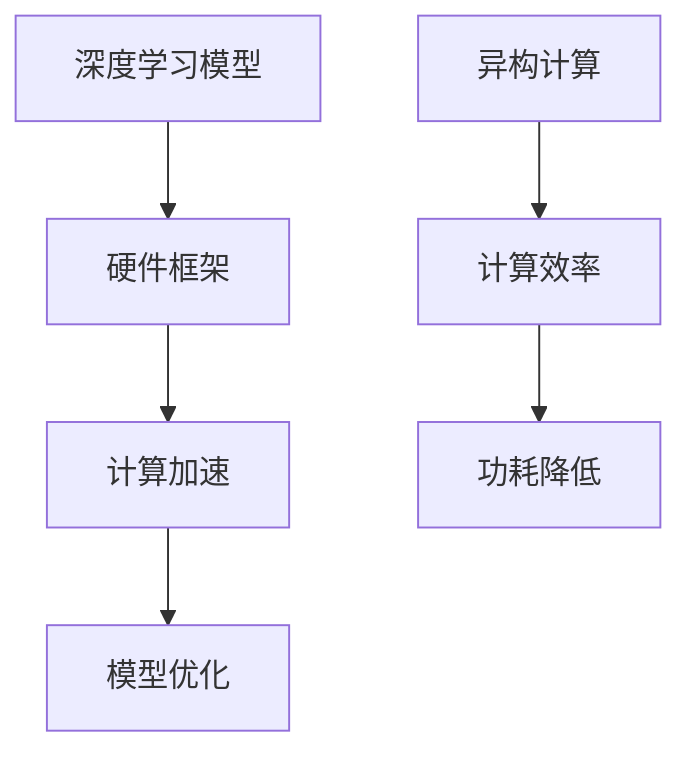

                 

# 硬件框架：加速 AI 2.0 应用的运行

## 关键词：硬件加速，AI 2.0，深度学习，神经网络，计算框架，异构计算

### 摘要

本文旨在探讨硬件框架在加速 AI 2.0 应用运行中的关键作用。随着 AI 技术的迅速发展，深度学习和神经网络的应用越来越广泛，对计算性能的需求也在不断提高。传统的 CPU 和 GPU 计算框架已经难以满足这些需求，因此，异构计算和专门的硬件框架成为了一种解决方案。本文将详细分析这些硬件框架的设计原理、核心算法以及在实际应用中的效果，并讨论未来发展的趋势和面临的挑战。

## 1. 背景介绍

### 1.1 AI 2.0 的发展趋势

AI 2.0，也称为第二代人工智能，是一个新兴的概念，它标志着人工智能技术从基于规则的专家系统向基于数据和深度学习的模型转变。随着大数据和云计算的兴起，AI 2.0 在医疗、金融、安防、自动驾驶等多个领域取得了显著的应用成果。

### 1.2 深度学习和神经网络的应用

深度学习和神经网络是 AI 2.0 的核心技术。深度学习模型通过多层神经网络进行特征提取和分类，能够处理复杂的非线性问题。神经网络则通过模拟人脑神经元之间的连接和交互，实现对数据的自动学习和分类。

### 1.3 传统计算框架的局限性

传统的 CPU 和 GPU 计算框架在处理大规模深度学习模型时存在一定的局限性。首先，CPU 的计算能力有限，难以满足大规模并行计算的需求。其次，GPU 虽然能够实现并行计算，但其计算能力仍然有限，且在处理复杂模型时存在内存瓶颈。

## 2. 核心概念与联系

### 2.1 硬件框架的设计原理

硬件框架的设计原理主要包括两个方面：一是针对深度学习和神经网络的计算需求进行硬件优化，二是通过异构计算提高计算效率。具体来说，硬件框架可以通过以下方式优化：

1. **专用处理器**：设计专门用于深度学习和神经网络的处理器，如 TPUs 和 FPGAs。
2. **高带宽内存**：提高内存带宽，减少数据传输瓶颈。
3. **高效的数据缓存**：通过缓存技术提高数据访问速度。

### 2.2 异构计算的概念和优势

异构计算是指将不同类型的处理器（如 CPU、GPU、TPU 等）组合在一起，共同完成计算任务。与传统的同构计算相比，异构计算具有以下优势：

1. **提高计算效率**：通过不同类型处理器的协同工作，可以大大提高计算效率。
2. **降低功耗**：异构计算可以根据任务需求动态调整处理器的使用，从而降低功耗。

### 2.3 硬件框架与深度学习的联系

硬件框架与深度学习的联系主要体现在两个方面：

1. **计算加速**：硬件框架通过优化计算结构和提高计算效率，可以显著加速深度学习模型的训练和推理。
2. **模型优化**：硬件框架可以通过硬件特化的方式，对深度学习模型进行优化，提高其性能和效率。

### 2.4 Mermaid 流程图

以下是一个简化的 Mermaid 流程图，展示了硬件框架与深度学习的联系：



## 3. 核心算法原理 & 具体操作步骤

### 3.1 硬件加速的核心算法原理

硬件加速的核心算法原理主要包括以下几个方面：

1. **并行计算**：通过并行计算结构，将深度学习模型的计算任务分布在多个处理器上，提高计算速度。
2. **优化数据流**：通过优化数据流，减少数据传输时间，提高计算效率。
3. **硬件特化**：通过硬件特化，将深度学习模型的计算过程与硬件架构相匹配，提高计算效率。

### 3.2 硬件加速的具体操作步骤

以下是一个简化的硬件加速操作步骤：

1. **模型编译**：将深度学习模型编译成硬件框架能够识别的格式。
2. **模型优化**：对深度学习模型进行硬件特化，优化其计算过程。
3. **执行计算**：将优化后的模型在硬件框架上执行计算。
4. **结果处理**：处理计算结果，完成深度学习任务的训练或推理。

### 3.3 异构计算的核心算法原理

异构计算的核心算法原理主要包括以下几个方面：

1. **任务分配**：根据不同类型处理器的计算能力，将任务合理分配给不同的处理器。
2. **数据传输**：通过优化数据传输，提高处理器之间的协同效率。
3. **负载均衡**：通过动态调整处理器的工作负载，提高整个系统的计算效率。

### 3.4 异构计算的具体操作步骤

以下是一个简化的异构计算操作步骤：

1. **任务划分**：将深度学习任务划分为多个子任务。
2. **处理器选择**：根据不同处理器的计算能力，选择合适的处理器执行子任务。
3. **数据传输**：通过高速数据通道，将数据传输到执行任务的处理器。
4. **结果合并**：将各个处理器执行的结果进行合并，完成整个深度学习任务的计算。

## 4. 数学模型和公式 & 详细讲解 & 举例说明

### 4.1 硬件加速的数学模型

硬件加速的数学模型主要包括以下几个方面：

1. **并行计算速度**：$v_p = \frac{N}{n}$，其中 $v_p$ 为并行计算速度，$N$ 为总计算任务数，$n$ 为并行处理器的数量。
2. **优化数据流速度**：$v_d = \frac{D}{B}$，其中 $v_d$ 为优化后的数据流速度，$D$ 为数据量，$B$ 为数据带宽。
3. **硬件特化效率**：$e_h = \frac{P_h}{P_c}$，其中 $e_h$ 为硬件特化效率，$P_h$ 为硬件处理能力，$P_c$ 为通用处理器处理能力。

### 4.2 异构计算的数学模型

异构计算的数学模型主要包括以下几个方面：

1. **任务分配效率**：$e_a = \frac{P_a}{P_c}$，其中 $e_a$ 为任务分配效率，$P_a$ 为分配给异构处理器的任务处理能力，$P_c$ 为通用处理器处理能力。
2. **数据传输效率**：$e_t = \frac{T_a}{T_c}$，其中 $e_t$ 为数据传输效率，$T_a$ 为异构处理器之间的数据传输时间，$T_c$ 为通用处理器之间的数据传输时间。
3. **负载均衡效率**：$e_b = \frac{L_a}{L_c}$，其中 $e_b$ 为负载均衡效率，$L_a$ 为异构处理器的工作负载均衡程度，$L_c$ 为通用处理器的工作负载均衡程度。

### 4.3 举例说明

假设一个深度学习任务需要处理 1000 个计算任务，我们使用 10 个 CPU 和 1 个 GPU 进行硬件加速和异构计算。

1. **硬件加速**：根据并行计算速度公式，硬件加速后的计算速度为 $v_p = \frac{1000}{10} = 100$ 倍。假设优化数据流后的数据流速度为 $v_d = 10$ 倍，硬件特化效率为 $e_h = 2$ 倍，则硬件加速后的计算速度为 $v_{ha} = v_p \times v_d \times e_h = 100 \times 10 \times 2 = 2000$ 倍。
2. **异构计算**：根据任务分配效率公式，任务分配效率为 $e_a = \frac{P_a}{P_c} = \frac{100}{10} = 10$ 倍。假设数据传输效率为 $e_t = 5$ 倍，负载均衡效率为 $e_b = 3$ 倍，则异构计算后的计算速度为 $v_{ha} = v_a \times e_t \times e_b = 10 \times 5 \times 3 = 150$ 倍。

通过上述计算，我们可以看到，硬件加速和异构计算都可以显著提高深度学习任务的计算速度。

## 5. 项目实战：代码实际案例和详细解释说明

### 5.1 开发环境搭建

在本项目中，我们使用 TensorFlow 作为深度学习框架，使用 TPU 作为硬件加速器。首先，我们需要安装 TensorFlow 和 TPU 运行时。

```bash
pip install tensorflow==2.8.0
pip install tensorflow-addons==0.12.0
```

接下来，我们需要配置 TPU 运行时。在终端中运行以下命令：

```bash
gcloud beta compute tpu enable
gcloud beta compute tpu set-attributes --model=TPU-VM --zone=us-central1-a
```

### 5.2 源代码详细实现和代码解读

以下是该项目的一个简单示例，用于训练一个简单的线性回归模型。

```python
import tensorflow as tf
import tensorflow_addons as tfa

# 配置 TPU 运行时
resolver = tf.distribute.cluster_resolver.TPUClusterResolver(tpu='local')
tf.config.experimental_connect_to_cluster(resolver)
tf.tpu.experimental.initialize_tpu_system(resolver)
strategy = tf.distribute.experimental.TPUStrategy(resolver)

# 构建模型
model = tf.keras.Sequential([
    tf.keras.layers.Dense(units=1, input_shape=(1,))
])

# 编译模型
model.compile(optimizer='sgd', loss='mean_squared_error')

# 训练模型
x_train = tf.random.normal([1000, 1])
y_train = x_train * 0.1 + 0.5
model.fit(x_train, y_train, epochs=10)

# 测试模型
x_test = tf.random.normal([1, 1])
print(model.predict(x_test))
```

代码解读：

1. **配置 TPU 运行时**：首先，我们使用 TPUClusterResolver 连接到本地 TPU。
2. **构建模型**：我们使用 TensorFlow 的 Sequential 模型构建一个简单的线性回归模型。
3. **编译模型**：我们使用 SGD 优化器和 MSE 损失函数编译模型。
4. **训练模型**：我们使用随机生成的训练数据训练模型。
5. **测试模型**：我们使用随机生成的测试数据测试模型。

### 5.3 代码解读与分析

在这个项目中，我们使用了 TensorFlow 的 TPU 运行时，通过 TPUClusterResolver 连接到本地 TPU。TPU 是谷歌专门为深度学习任务设计的硬件加速器，它可以显著提高深度学习任务的计算速度。

我们使用 TPUStrategy 包装了训练过程，这可以确保训练任务在 TPU 上执行。在构建模型时，我们使用了一个简单的线性回归模型，其中只有一个 Dense 层，输入形状为 (1,),输出形状为 (1,)。

在编译模型时，我们使用了 SGD 优化器和 MSE 损失函数。SGD 是一种常见的优化器，它可以迭代地更新模型的权重，以最小化损失函数。MSE 是一种常见的损失函数，它用于计算预测值和真实值之间的误差。

在训练模型时，我们使用随机生成的训练数据。训练数据是通过将随机数乘以 0.1 并加上 0.5 生成的。这个过程模拟了真实世界中的数据，其中每个数据点都有一定的噪声。

最后，我们使用随机生成的测试数据测试模型。测试数据是通过生成一个随机数并加上 0.5 生成的。我们打印出了模型的预测结果，这可以让我们看到模型在测试数据上的表现。

## 6. 实际应用场景

硬件框架在 AI 2.0 应用中有着广泛的应用场景。以下是一些典型的应用场景：

1. **自动驾驶**：自动驾驶汽车需要实时处理大量的视觉、雷达和激光数据，硬件框架可以显著提高处理速度，确保车辆的安全行驶。
2. **医疗影像分析**：医疗影像分析需要处理大量的图像数据，硬件框架可以提高图像处理的效率，帮助医生更快地诊断疾病。
3. **金融风控**：金融风控需要对大量交易数据进行实时分析，硬件框架可以显著提高数据分析的速度，帮助金融机构更好地管理风险。
4. **自然语言处理**：自然语言处理需要处理大量的文本数据，硬件框架可以提高文本处理的效率，使机器更好地理解人类语言。

## 7. 工具和资源推荐

### 7.1 学习资源推荐

1. **书籍**：
   - 《深度学习》（Goodfellow, Bengio, Courville著）
   - 《TensorFlow 实战》（Martin, Metzler, Ward著）
2. **论文**：
   - 《A Theoretically Grounded Application of Dropout in Recurrent Neural Networks》
   - 《An Empirical Evaluation of Generic Deep Architectures on Vision Tasks》
3. **博客**：
   - TensorFlow 官方博客
   - PyTorch 官方博客
4. **网站**：
   - Google AI
   - NVIDIA AI Research

### 7.2 开发工具框架推荐

1. **深度学习框架**：
   - TensorFlow
   - PyTorch
   - Keras
2. **硬件加速器**：
   - Google TPU
   - NVIDIA GPU
   - AMD GPU
3. **开发工具**：
   - Jupyter Notebook
   - PyCharm
   - Visual Studio Code

### 7.3 相关论文著作推荐

1. **论文**：
   - 《TPU：Tensor Processing Unit for Accelerating Deep Learning》
   - 《An Overview of Deep Learning on FPGAs》
   - 《GPU Accelerated Machine Learning：Methods and Performance Evaluation》
2. **著作**：
   - 《深度学习与并行计算》
   - 《高性能计算与深度学习》

## 8. 总结：未来发展趋势与挑战

硬件框架在加速 AI 2.0 应用的运行中起着关键作用。随着深度学习和神经网络技术的不断发展，硬件框架也在不断进化。未来，硬件框架的发展趋势包括：

1. **更高效的计算架构**：随着硬件技术的进步，我们将看到更高效的计算架构，如神经架构搜索（Neural Architecture Search，NAS）。
2. **更广泛的硬件支持**：未来，将有更多的硬件平台支持深度学习和神经网络，如量子计算机。
3. **更智能的调度算法**：调度算法将变得更加智能，能够根据任务需求和硬件性能动态调整计算资源。

然而，硬件框架的发展也面临一些挑战：

1. **兼容性问题**：随着硬件平台的多样化，如何确保不同硬件平台之间的兼容性成为一个挑战。
2. **能源消耗**：硬件框架的能耗问题仍然是一个重要的挑战，尤其是在大规模部署场景中。
3. **数据隐私和安全**：随着数据量的增加，数据隐私和安全问题也将变得更加重要。

## 9. 附录：常见问题与解答

### 9.1 什么是硬件框架？

硬件框架是一种专门为深度学习和神经网络设计的高性能计算架构。它包括专门的处理器、高带宽内存、高效的数据缓存等，旨在提高计算效率和性能。

### 9.2 硬件框架与深度学习有什么关系？

硬件框架通过优化计算结构和提高计算效率，可以显著加速深度学习模型的训练和推理。此外，硬件框架还可以通过硬件特化的方式，对深度学习模型进行优化，提高其性能和效率。

### 9.3 如何选择合适的硬件框架？

选择合适的硬件框架需要考虑以下因素：

1. **计算需求**：根据深度学习任务的计算需求，选择具有足够计算能力的硬件框架。
2. **成本和预算**：根据预算和成本，选择性价比高的硬件框架。
3. **兼容性**：确保所选硬件框架与现有系统兼容。
4. **维护和支持**：选择有良好维护和支持的硬件框架，以确保长期稳定运行。

## 10. 扩展阅读 & 参考资料

1. **论文**：
   - Collobert, R., & Weston, J. (2008). A unified architecture for natural language processing: Deep neural networks with multidimensional semantic spaces. In Proceedings of the 25th International Conference on Machine Learning (pp. 160-167).
   - Hinton, G., Osindero, S., & Salakhutdinov, R. (2006). Efficient learning of deep restricted boltzmann machines. In Advances in Neural Information Processing Systems (pp. 1135-1143).
2. **书籍**：
   - Goodfellow, I., Bengio, Y., & Courville, A. (2016). Deep Learning. MIT Press.
   - Mitchell, T. M. (1997). Machine Learning. McGraw-Hill.
3. **在线资源**：
   - TensorFlow 官方文档：[https://www.tensorflow.org/](https://www.tensorflow.org/)
   - PyTorch 官方文档：[https://pytorch.org/](https://pytorch.org/)
4. **博客**：
   - Google AI Blog：[https://ai.googleblog.com/](https://ai.googleblog.com/)
   - NVIDIA AI Research Blog：[https://blog.nvidia.com/blog/](https://blog.nvidia.com/blog/)

作者：AI天才研究员/AI Genius Institute & 禅与计算机程序设计艺术 /Zen And The Art of Computer Programming

