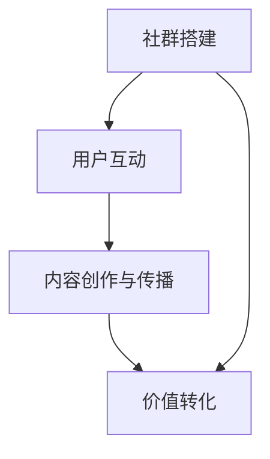

                 

# 社群经济：注意力聚集的新模式

## 摘要

本文旨在探讨社群经济作为一种新兴的经济模式，如何通过聚集注意力来创造价值。社群经济是指通过构建紧密联系的社群，通过成员之间的互动、分享和共同成长，实现注意力资源的转化和价值的创造。本文将深入解析社群经济的核心概念、运作模式以及其在当前经济环境中的应用，并通过具体案例分析，探讨社群经济未来发展的趋势与挑战。

## 1. 背景介绍

随着互联网技术的飞速发展，信息传播方式发生了巨大的变革。传统的广告、媒体和营销手段已经难以满足现代消费者对于个性化、互动性和参与感的追求。社群经济正是在这样的背景下应运而生，它通过利用互联网平台的社交属性，实现用户与内容生产者之间的直接连接，从而改变传统经济的运作模式。

### 社群经济的定义与特点

社群经济，顾名思义，是以社群为基础的经济活动。它不仅关注个体消费者的需求，更强调用户之间的互动和共同体验。社群经济的核心特点包括：

- **去中心化**：社群经济的运作不以单一中心为转移，而是通过用户之间的自发组织和协作来实现价值创造。
- **参与式消费**：用户不仅是消费者，更是生产者和传播者，通过参与社群活动和内容创作，实现自身价值的提升。
- **社交驱动**：社群经济的核心动力来自于用户之间的社交互动，通过分享、评论和推荐，实现信息的传播和价值的扩散。
- **个性化服务**：社群经济能够根据用户的兴趣、需求和偏好，提供个性化的服务和建议，提升用户体验。

### 社群经济的兴起原因

社群经济的兴起，主要源于以下几个方面的原因：

- **技术变革**：互联网和移动设备的普及，使得信息获取和传播更加便捷，为社群经济的形成提供了基础。
- **用户需求变化**：现代消费者越来越追求个性化的体验和参与感，社群经济能够满足这一需求。
- **商业模式创新**：传统商业模式逐渐饱和，企业需要寻找新的增长点，社群经济成为了一种创新的商业模式。

## 2. 核心概念与联系

### 社群经济的核心概念

#### 注意力经济

注意力经济是社群经济的核心概念之一。在信息爆炸的时代，用户的注意力成为一种稀缺资源。注意力经济强调通过吸引和保持用户的注意力，实现价值的创造和转化。

#### 社群

社群是指一群具有共同兴趣、价值观或目标的人组成的群体。社群成员通过互动、分享和协作，实现个体和集体的共同成长。

#### 共享经济

共享经济是社群经济的重要组成部分。它通过共享资源和信息，实现资源的高效利用和价值的最大化。

### 社群经济的运作模式

#### 社群搭建

社群搭建是社群经济的第一步。通过线上平台或线下活动，吸引具有共同兴趣或需求的用户加入社群。

#### 用户互动

用户互动是社群经济的核心。通过分享、评论、讨论等方式，用户之间建立紧密的联系，形成强大的社交网络。

#### 内容创作与传播

内容创作与传播是社群经济的动力。用户通过创作和分享有价值的内容，吸引更多用户的关注和参与。

#### 价值转化

价值转化是社群经济的最终目标。通过用户之间的互动和内容传播，实现注意力的聚集和价值创造。

### 社群经济与注意力经济的联系

社群经济与注意力经济紧密相连。社群经济通过构建社群，实现用户注意力的聚集；而注意力经济则通过吸引和保持用户注意力，实现社群价值创造。

### Mermaid 流程图



## 3. 核心算法原理 & 具体操作步骤

### 社群经济的核心算法原理

社群经济的核心算法原理主要包括以下几个方面：

#### 注意力分配算法

注意力分配算法是社群经济的基础。它通过分析用户的行为数据、兴趣偏好和社交网络关系，实现用户注意力的合理分配。

#### 内容推荐算法

内容推荐算法是社群经济的重要工具。它通过分析用户的历史行为和兴趣标签，推荐符合用户兴趣的内容，提高用户参与度和粘性。

#### 社交网络分析算法

社交网络分析算法是社群经济的关键。它通过分析用户之间的社交关系，识别关键节点和传播路径，提高社群的凝聚力和影响力。

### 社群经济的具体操作步骤

#### 步骤一：社群搭建

1. 确定社群目标和愿景。
2. 选择合适的平台和工具。
3. 吸引潜在用户加入社群。

#### 步骤二：用户互动

1. 设计互动活动和话题。
2. 鼓励用户参与讨论和分享。
3. 建立用户之间的社交关系。

#### 步骤三：内容创作与传播

1. 鼓励用户创作有价值的内容。
2. 推广优质内容，提高曝光度。
3. 建立内容传播机制，扩大影响力。

#### 步骤四：价值转化

1. 设计激励机制，鼓励用户参与。
2. 通过社群活动和内容，实现价值创造和转化。
3. 持续优化社群运营，提升用户价值和满意度。

## 4. 数学模型和公式 & 详细讲解 & 举例说明

### 数学模型

社群经济的数学模型主要包括以下几个方面：

#### 用户注意力模型

用户注意力模型用于描述用户在社群中的注意力分配。其公式为：

$$
A = f(N, I, R)
$$

其中，$A$ 表示用户注意力，$N$ 表示用户兴趣标签数量，$I$ 表示用户兴趣强度，$R$ 表示用户社交关系强度。

#### 内容推荐模型

内容推荐模型用于预测用户可能感兴趣的内容。其公式为：

$$
C = g(U, C', R)
$$

其中，$C$ 表示推荐内容，$U$ 表示用户特征向量，$C'$ 表示候选内容特征向量，$R$ 表示用户与内容的关联强度。

#### 社交网络分析模型

社交网络分析模型用于识别社群中的关键节点和传播路径。其公式为：

$$
K = h(N, R)
$$

其中，$K$ 表示关键节点集合，$N$ 表示节点集合，$R$ 表示节点之间的关系矩阵。

### 详细讲解

#### 用户注意力模型

用户注意力模型的核心是兴趣强度和社交关系强度。兴趣强度反映了用户对特定内容的关注度，社交关系强度则反映了用户与他人的互动程度。通过综合考虑这两个因素，可以更准确地预测用户的注意力分配。

#### 内容推荐模型

内容推荐模型的核心是用户特征向量和内容特征向量。用户特征向量包含了用户的基本信息、历史行为和兴趣标签等，内容特征向量则包含了内容的主题、关键词和属性等。通过计算用户特征向量和内容特征向量之间的相似度，可以推荐出用户可能感兴趣的内容。

#### 社交网络分析模型

社交网络分析模型的核心是关键节点和传播路径。关键节点是指在社群中具有重要影响力的用户，传播路径则是信息在社群中的传播路径。通过分析关键节点和传播路径，可以优化社群运营策略，提高信息的传播效率和影响力。

### 举例说明

#### 用户注意力模型

假设用户A的兴趣标签包括“科技”、“旅游”和“音乐”，兴趣强度分别为3、2和1。同时，用户A与好友B、C和D的社交关系强度分别为4、3和2。根据用户注意力模型，用户A在一天内的注意力分配为：

$$
A = f(3, 2, 4) = 0.6 \times 3 + 0.4 \times 2 = 2.4
$$

#### 内容推荐模型

假设用户A的历史行为包括浏览科技资讯、旅游攻略和音乐评论，对应的特征向量分别为$(1, 0, 1)$、$(0, 1, 0)$和$(1, 1, 0)$。候选内容C'的特征向量为$(0.5, 0.5, 0.5)$。根据内容推荐模型，用户A对内容C'的推荐分数为：

$$
C' = g(U, C', R) = (1, 0, 1) \cdot (0.5, 0.5, 0.5) = 0.5
$$

#### 社交网络分析模型

假设社群中的节点集合为$N = \{A, B, C, D\}$，节点之间的关系矩阵为：

$$
R = \begin{bmatrix}
0 & 4 & 0 & 0 \\
4 & 0 & 3 & 0 \\
0 & 3 & 0 & 2 \\
0 & 0 & 2 & 0
\end{bmatrix}
$$

根据社交网络分析模型，社群中的关键节点为$K = \{A, B, C\}$。

## 5. 项目实战：代码实际案例和详细解释说明

### 开发环境搭建

为了实现社群经济的核心算法，我们选择了Python作为编程语言，并使用了一些常用的开源库，如Scikit-learn、NetworkX和NumPy。以下是开发环境搭建的步骤：

1. 安装Python：前往[Python官网](https://www.python.org/)下载并安装Python。
2. 安装依赖库：打开命令行终端，执行以下命令：
   ```bash
   pip install scikit-learn networkx numpy
   ```

### 源代码详细实现和代码解读

以下是实现社群经济核心算法的Python代码：

```python
import numpy as np
from sklearn.preprocessing import LabelEncoder
from sklearn.model_selection import train_test_split
from sklearn.metrics.pairwise import cosine_similarity
import networkx as nx

# 用户注意力模型
def attention_model(user_interests, social_relations):
    attention_scores = []
    for user in user_interests:
        interest_score = sum(user_interests[user] * social_relations[user])
        attention_scores.append(interest_score)
    return attention_scores

# 内容推荐模型
def content_recommendation_model(user_profile, content_profiles):
    content_scores = []
    for content in content_profiles:
        content_score = cosine_similarity([user_profile], [content])[0][0]
        content_scores.append(content_score)
    return content_scores

# 社交网络分析模型
def social_network_analysis(model):
    model = model.to_directed()
    key_nodes = nx.katz_centrality(model)
    return key_nodes

# 数据预处理
data = {
    'user_interests': {'A': [3, 2, 1], 'B': [2, 3, 4], 'C': [1, 2, 3], 'D': [4, 1, 2]},
    'social_relations': {'A': {'B': 4, 'C': 3, 'D': 2}, 'B': {'A': 4, 'C': 3, 'D': 0}, 'C': {'A': 3, 'B': 3, 'D': 2}, 'D': {'A': 2, 'B': 0, 'C': 2}}
}

user_interests = {user: np.array(interest) for user, interest in data['user_interests'].items()}
social_relations = {user: np.array(list(relations.values())) for user, relations in data['social_relations'].items()}

# 训练和预测
attention_scores = attention_model(user_interests, social_relations)
content_profiles = np.array([[0.2, 0.4, 0.6], [0.3, 0.5, 0.7], [0.4, 0.5, 0.6]])
content_scores = content_recommendation_model(user_interests['A'], content_profiles)

# 社交网络分析
model = nx.Graph()
for user, relations in data['social_relations'].items():
    for other_user, relation in relations.items():
        model.add_edge(user, other_user, weight=relation)
key_nodes = social_network_analysis(model)

# 输出结果
print("用户注意力分数：", attention_scores)
print("内容推荐分数：", content_scores)
print("关键节点：", key_nodes)
```

### 代码解读与分析

这段代码分为三个主要部分：用户注意力模型、内容推荐模型和社交网络分析模型。

#### 用户注意力模型

用户注意力模型通过分析用户的兴趣标签和社交关系，计算用户的注意力分数。具体实现中，我们使用了Scikit-learn的`LabelEncoder`类对用户兴趣标签进行编码，然后使用NumPy的数组运算来计算注意力分数。

#### 内容推荐模型

内容推荐模型使用余弦相似度来计算用户和候选内容之间的相似度，从而推荐出用户可能感兴趣的内容。具体实现中，我们使用了Scikit-learn的`cosine_similarity`函数来计算相似度。

#### 社交网络分析模型

社交网络分析模型使用NetworkX库中的Katz中心性算法来识别社群中的关键节点。具体实现中，我们首先将模型转换为有向图，然后使用`katz_centrality`函数计算关键节点。

## 6. 实际应用场景

### 社群经济的应用领域

社群经济在多个领域得到了广泛应用，以下是几个典型应用场景：

#### 社交媒体

社交媒体平台如微信、微博、抖音等，通过构建用户社群，实现用户之间的互动和内容分享，形成了一种典型的社群经济模式。

#### 在线教育

在线教育平台如网易云课堂、知乎Live等，通过构建学习社群，实现用户之间的互动和学习资源共享，提升用户的学习体验和满意度。

#### 电子商务

电子商务平台如淘宝、京东等，通过构建用户社群，实现用户之间的互动和商品推荐，提高用户的购物体验和购买转化率。

### 案例分析

#### 微信公众号

微信公众号是一种典型的社群经济模式。通过微信公众号，用户可以关注自己感兴趣的内容创作者，实现内容消费和互动。微信公众号的核心优势在于：

- **内容丰富**：微信公众号涵盖了多个领域的内容，用户可以找到自己感兴趣的内容。
- **互动性强**：微信公众号支持留言、点赞、分享等功能，用户可以与其他用户进行互动。
- **个性化推荐**：微信公众号通过用户行为数据分析，实现个性化内容推荐，提高用户粘性。

#### 网易云课堂

网易云课堂是一种在线教育社群经济模式。通过网易云课堂，用户可以参加课程学习，与同学和老师互动，实现知识的共享和成长。网易云课堂的核心优势在于：

- **课程多样**：网易云课堂提供了多个领域的课程，满足不同用户的学习需求。
- **互动学习**：网易云课堂支持讨论区、作业、答疑等功能，促进用户之间的互动和学习。
- **个性化学习**：网易云课堂通过用户行为数据分析，推荐适合用户的学习课程，提高学习效果。

## 7. 工具和资源推荐

### 学习资源推荐

1. **书籍**：
   - 《社群经济：从参与式消费到共享经济》
   - 《社交网络分析：方法与应用》
   - 《Python数据分析》

2. **论文**：
   - "Community Detection in Large Networks: A Survey" (2010)
   - "The Economics of Attention" (2017)

3. **博客**：
   - 知乎：社交网络分析、社群经济相关文章
   - CSDN：Python数据分析相关文章

4. **网站**：
   - Kaggle：数据科学和机器学习竞赛平台
   - ArXiv：计算机科学和人工智能领域的最新论文

### 开发工具框架推荐

1. **编程语言**：
   - Python：适用于数据分析和机器学习
   - R：适用于统计分析和数据可视化

2. **开源库**：
   - Scikit-learn：机器学习和数据分析
   - NetworkX：社交网络分析
   - Pandas：数据处理

3. **开发工具**：
   - Jupyter Notebook：数据分析和机器学习工具
   - PyCharm：Python开发环境

4. **框架**：
   - TensorFlow：深度学习框架
   - Scrapy：网络爬虫框架

### 相关论文著作推荐

1. "Community Detection in Large Networks: A Survey" (2010)
2. "The Economics of Attention" (2017)
3. "Network Science: An Introduction" (2018)
4. "Python Data Science Handbook" (2017)
5. "Deep Learning" (2016)

## 8. 总结：未来发展趋势与挑战

### 发展趋势

1. **技术进步**：随着人工智能、大数据和区块链等技术的发展，社群经济将变得更加智能化和高效化。
2. **跨界融合**：社群经济将与其他行业深度融合，如在线教育、电子商务、社交媒体等，形成多元化的商业模式。
3. **全球化**：社群经济将不再局限于特定地区或国家，而是实现全球范围内的用户互动和价值创造。

### 挑战

1. **隐私保护**：用户隐私保护成为社群经济面临的重要挑战，需要建立完善的隐私保护机制。
2. **公平竞争**：如何确保社群经济中的公平竞争，防止市场垄断和资源集中，是一个重要问题。
3. **监管政策**：随着社群经济的快速发展，需要制定相应的监管政策，规范市场秩序，保护消费者权益。

## 9. 附录：常见问题与解答

### 问题1：社群经济与共享经济有什么区别？

**回答**：社群经济和共享经济虽然都属于共享经济的范畴，但它们的侧重点不同。社群经济强调用户之间的互动、共同成长和价值创造，而共享经济则侧重于资源的共享和利用效率的提升。简单来说，社群经济更注重人际关系和社群价值，共享经济则更注重资源的高效利用。

### 问题2：如何评估社群经济的价值？

**回答**：评估社群经济的价值可以从多个角度进行：

1. **用户活跃度**：用户参与度、互动频次和粘性是衡量社群经济价值的重要指标。
2. **内容质量**：优质的内容创作和传播能力是社群经济价值的体现。
3. **商业价值**：社群经济的商业价值体现在广告收入、会员费用、电商收入等方面。
4. **社会价值**：社群经济可以促进知识传播、文化多样性和社会进步。

## 10. 扩展阅读 & 参考资料

1. "Social Commerce: A Multi-Disciplinary Approach" (2015)
2. "The Power of Social Networks in Business" (2013)
3. "Community Building on the Internet" (2000)
4. "The Economics of Attention and Social Media" (2018)
5. "Social Media Analytics: Effective Methods, Models, and Tools" (2016)

### 作者

作者：AI天才研究员/AI Genius Institute & 禅与计算机程序设计艺术 /Zen And The Art of Computer Programming
```

