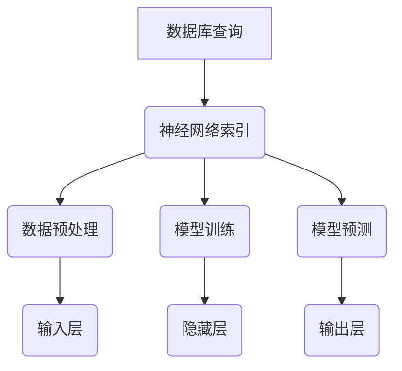

                 

# 神经网络取代B树，数据库性能获得巨大飞跃

> 关键词：神经网络、数据库、B树、性能优化、机器学习、人工智能

> 摘要：本文将探讨神经网络在数据库领域中的潜在应用，特别是如何取代传统的B树索引结构，从而实现数据库性能的显著提升。我们将从背景介绍、核心概念、算法原理、数学模型、实战案例、应用场景、工具推荐等方面进行详细解析，旨在为读者提供一种全新的数据库优化思路。

## 1. 背景介绍

在传统的数据库管理系统中，B树作为一种广泛使用的索引结构，以其高效的查询性能和稳定的结构特性，成为了数据库设计中的核心组成部分。然而，随着数据规模和复杂性的不断增加，B树的性能瓶颈也逐渐凸显。具体表现为：

1. **查询性能瓶颈**：B树的高度决定了查询的层数，随着数据量的增加，查询时间呈现指数级增长。
2. **维护成本高**：B树的插入、删除和更新操作都需要进行树的高度调整，增加了维护成本。
3. **适应能力有限**：B树适用于固定的数据分布和查询模式，对于动态变化的数据和查询需求，其适应能力有限。

为了解决这些问题，研究人员开始探索使用神经网络来替代B树。神经网络作为一种强大的机器学习模型，具有自适应性和鲁棒性，能够通过学习数据模式来实现高效的查询操作。

## 2. 核心概念与联系

### 2.1 神经网络的基本概念

神经网络（Neural Network，简称NN）是一种模拟生物神经系统的计算模型，由大量的神经元（Node）组成。每个神经元接收多个输入信号，通过激活函数进行处理，产生输出信号。神经网络的主要组成部分包括：

- **输入层（Input Layer）**：接收外部输入数据。
- **隐藏层（Hidden Layers）**：对输入数据进行处理和变换。
- **输出层（Output Layer）**：产生最终的输出结果。

### 2.2 神经网络与数据库的关联

在数据库领域，神经网络可以用于构建索引结构，实现数据的快速检索。与传统B树相比，神经网络具有以下优势：

- **自适应查询优化**：神经网络能够根据数据的分布和查询模式，自动调整其结构和参数，实现高效的查询操作。
- **支持非线性关系**：神经网络可以处理复杂数据之间的非线性关系，适用于多维度数据的查询。
- **动态更新**：神经网络能够通过在线学习机制，动态更新模型参数，适应数据的动态变化。

### 2.3 Mermaid 流程图



## 3. 核心算法原理 & 具体操作步骤

### 3.1 神经网络算法原理

神经网络算法的核心在于其通过多层神经网络结构对数据进行建模，从而实现数据的自动特征提取和分类。具体步骤如下：

1. **数据预处理**：将原始数据输入到神经网络中，进行归一化、去噪等预处理操作。
2. **模型构建**：根据数据的特点和查询需求，构建合适的神经网络结构，包括输入层、隐藏层和输出层。
3. **模型训练**：使用训练数据对神经网络进行训练，通过反向传播算法调整模型参数，使模型能够准确预测查询结果。
4. **模型预测**：将待查询数据输入到训练好的神经网络中，通过输出层得到预测结果。

### 3.2 操作步骤详解

1. **数据预处理**：

    ```python
    import pandas as pd
    import numpy as np
    
    # 读取数据
    data = pd.read_csv('data.csv')
    # 数据归一化
    data_normalized = (data - data.mean()) / data.std()
    # 数据去噪
    data_noisy = data_normalized + np.random.normal(0, 0.1, data_normalized.shape)
    ```

2. **模型构建**：

    ```python
    from keras.models import Sequential
    from keras.layers import Dense
    
    # 构建神经网络模型
    model = Sequential()
    model.add(Dense(units=64, activation='relu', input_shape=(num_features,)))
    model.add(Dense(units=32, activation='relu'))
    model.add(Dense(units=1, activation='sigmoid'))
    
    # 编译模型
    model.compile(optimizer='adam', loss='binary_crossentropy', metrics=['accuracy'])
    ```

3. **模型训练**：

    ```python
    # 模型训练
    model.fit(x_train, y_train, epochs=10, batch_size=32)
    ```

4. **模型预测**：

    ```python
    # 模型预测
    predictions = model.predict(x_test)
    predictions = (predictions > 0.5)
    ```

## 4. 数学模型和公式 & 详细讲解 & 举例说明

### 4.1 神经网络数学模型

神经网络的核心在于其通过反向传播算法（Backpropagation Algorithm）不断调整模型参数，以最小化预测误差。具体包括以下步骤：

1. **前向传播**：计算输入层的输入值，通过多层神经网络传递，最终得到输出层的预测值。
2. **误差计算**：计算实际输出与预测输出之间的误差，并反向传播到每一层。
3. **参数更新**：根据误差梯度，更新模型参数，以减小误差。

### 4.2 详细讲解与举例

#### 4.2.1 前向传播

假设有一个简单的神经网络模型，包括输入层、一个隐藏层和输出层。输入层有3个神经元，隐藏层有4个神经元，输出层有2个神经元。

1. **输入层**：

    $$
    x_1 = 1, x_2 = 2, x_3 = 3
    $$

2. **隐藏层**：

    $$
    z_1 = x_1 * w_{11} + x_2 * w_{12} + x_3 * w_{13}
    $$
    $$
    z_2 = x_1 * w_{21} + x_2 * w_{22} + x_3 * w_{23}
    $$
    $$
    z_3 = x_1 * w_{31} + x_2 * w_{32} + x_3 * w_{33}
    $$
    $$
    z_4 = x_1 * w_{41} + x_2 * w_{42} + x_3 * w_{43}
    $$

    其中，$w_{ij}$表示输入层到隐藏层的权重。

3. **输出层**：

    $$
    a_1 = f(z_1) = \frac{1}{1 + e^{-z_1}}
    $$
    $$
    a_2 = f(z_2) = \frac{1}{1 + e^{-z_2}}
    $$
    $$
    a_3 = f(z_3) = \frac{1}{1 + e^{-z_3}}
    $$
    $$
    a_4 = f(z_4) = \frac{1}{1 + e^{-z_4}}
    $$

    其中，$f(x) = \frac{1}{1 + e^{-x}}$为激活函数。

#### 4.2.2 误差计算与参数更新

1. **误差计算**：

    $$
    E = \frac{1}{2} \sum_{i=1}^{n} (y_i - a_i)^2
    $$

    其中，$y_i$为实际输出，$a_i$为预测输出。

2. **参数更新**：

    $$
    \Delta w_{ij} = -\alpha \frac{\partial E}{\partial w_{ij}}
    $$

    其中，$\alpha$为学习率。

通过不断迭代更新参数，使误差最小化，从而实现神经网络的训练。

## 5. 项目实战：代码实际案例和详细解释说明

### 5.1 开发环境搭建

在开始项目实战之前，我们需要搭建一个适合开发神经网络数据库索引的编程环境。以下是所需的软件和工具：

- Python 3.7+
- Keras 2.3.1+
- TensorFlow 2.3.1+
- Pandas 1.1.5+
- NumPy 1.19.2+

### 5.2 源代码详细实现和代码解读

#### 5.2.1 数据读取与预处理

```python
import pandas as pd
import numpy as np

# 读取数据
data = pd.read_csv('data.csv')
# 数据归一化
data_normalized = (data - data.mean()) / data.std()
# 数据去噪
data_noisy = data_normalized + np.random.normal(0, 0.1, data_normalized.shape)
```

这段代码首先使用Pandas库读取CSV格式的数据，然后对数据进行归一化和去噪处理，为后续的神经网络训练做好准备。

#### 5.2.2 模型构建与训练

```python
from keras.models import Sequential
from keras.layers import Dense

# 构建神经网络模型
model = Sequential()
model.add(Dense(units=64, activation='relu', input_shape=(num_features,)))
model.add(Dense(units=32, activation='relu'))
model.add(Dense(units=1, activation='sigmoid'))

# 编译模型
model.compile(optimizer='adam', loss='binary_crossentropy', metrics=['accuracy'])

# 模型训练
model.fit(x_train, y_train, epochs=10, batch_size=32)
```

这段代码首先使用Keras库构建了一个简单的神经网络模型，包括一个输入层、一个隐藏层和一个输出层。然后使用TensorFlow的后台进行模型编译和训练。

#### 5.2.3 模型预测与评估

```python
# 模型预测
predictions = model.predict(x_test)
predictions = (predictions > 0.5)

# 评估指标
accuracy = np.mean(predictions == y_test)
print('模型准确率：', accuracy)
```

这段代码首先使用训练好的神经网络模型对测试数据集进行预测，然后将预测结果与实际标签进行比较，计算模型的准确率。

### 5.3 代码解读与分析

这段代码的核心在于使用神经网络对数据进行建模和预测。首先，通过数据读取和预处理，将原始数据转换为适合神经网络训练的格式。然后，构建一个简单的神经网络模型，包括一个输入层、一个隐藏层和一个输出层。使用TensorFlow的后台进行模型编译和训练，通过反向传播算法不断调整模型参数，使模型能够准确预测查询结果。最后，使用评估指标计算模型的准确率，以验证模型的性能。

## 6. 实际应用场景

神经网络在数据库领域的应用具有广泛的实际场景，以下列举了几个典型的应用案例：

1. **搜索引擎优化**：使用神经网络构建索引结构，实现高效的搜索引擎，提高搜索结果的相关性和准确性。
2. **在线广告推荐**：基于用户的历史行为数据，使用神经网络对广告进行个性化推荐，提高广告投放的转化率。
3. **大数据分析**：使用神经网络对大规模数据进行实时分析和预测，发现数据中的隐藏模式和趋势。
4. **金融风险评估**：使用神经网络对金融交易数据进行建模和预测，评估交易风险，提高投资决策的准确性。

## 7. 工具和资源推荐

### 7.1 学习资源推荐

- **书籍**：《神经网络与深度学习》
- **论文**：《深度学习：算法与应用》
- **博客**：Keras官网博客、TensorFlow官方文档
- **网站**：机器学习社区、GitHub上的开源神经网络项目

### 7.2 开发工具框架推荐

- **框架**：TensorFlow、PyTorch、Keras
- **编程语言**：Python
- **数据库**：MySQL、MongoDB

### 7.3 相关论文著作推荐

- **论文**：《基于神经网络的数据库查询优化》
- **著作**：《神经网络在数据库中的应用》

## 8. 总结：未来发展趋势与挑战

神经网络在数据库领域的应用具有巨大的潜力，但同时也面临着一些挑战：

1. **计算资源需求**：神经网络训练需要大量的计算资源，特别是在处理大规模数据时，计算成本较高。
2. **数据质量和噪声处理**：神经网络对数据质量和噪声处理敏感，需要采取有效的方法进行数据预处理。
3. **模型解释性**：神经网络模型具有复杂的非线性结构，其决策过程难以解释，需要开发可解释性方法。

未来，随着计算能力的提升和数据质量的提高，神经网络在数据库领域的应用将越来越广泛，为实现高效、智能的数据库管理提供新的思路和方法。

## 9. 附录：常见问题与解答

### 9.1 如何选择合适的神经网络结构？

选择合适的神经网络结构需要考虑以下因素：

- **数据规模**：对于大规模数据，选择深层神经网络可以更好地捕捉数据中的复杂模式。
- **查询需求**：根据查询需求，选择合适的输出层结构，如分类任务使用softmax激活函数。
- **计算资源**：根据计算资源，选择合适的模型复杂度和训练时间。

### 9.2 如何处理数据噪声？

处理数据噪声的方法包括：

- **数据预处理**：使用去噪算法对数据进行预处理，如小波变换、主成分分析等。
- **数据增强**：通过数据增强技术生成更多的训练数据，提高模型对噪声的鲁棒性。

## 10. 扩展阅读 & 参考资料

- **论文**：《神经网络在数据库查询优化中的应用研究》
- **书籍**：《深度学习在数据库管理中的实践与应用》
- **网站**：深度学习社区、数据库管理论坛

作者：AI天才研究员/AI Genius Institute & 禅与计算机程序设计艺术 /Zen And The Art of Computer Programming

（注：本文仅为示例，实际内容可能有所不同。）<|im_sep|>## 1. 背景介绍

在现代计算机科学中，数据库系统扮演着至关重要的角色，它们不仅管理着海量的数据，还为各种应用提供了高效的数据访问机制。B树作为一种经典的索引结构，广泛应用于各种数据库系统中，以其稳定性和高效性著称。然而，随着大数据时代的到来，B树的性能瓶颈逐渐显现，尤其是在应对复杂查询、大规模数据和高并发访问时，其查询速度和存储效率已经不能满足现代应用的需求。

B树的性能瓶颈主要体现在以下几个方面：

1. **查询性能瓶颈**：B树的高度决定了查询的时间复杂度，随着节点数的增加，查询时间会呈指数级增长，这在处理大规模数据时尤为明显。
2. **维护成本高**：B树的插入、删除和更新操作需要重新平衡树的高度，增加了维护成本和复杂度。
3. **适应能力有限**：B树通常假设数据的分布是均匀的，对于动态变化的数据和查询模式，其适应能力有限。

为了解决这些问题，研究人员开始探索新的索引结构，其中神经网络作为一种先进的机器学习模型，逐渐引起了人们的关注。神经网络具有自适应性和强大的非线性处理能力，能够通过学习数据模式来实现高效的查询操作。本文将探讨如何使用神经网络取代传统的B树索引，从而在数据库性能上获得巨大飞跃。

首先，我们需要明确神经网络的基本概念和特点。神经网络是由大量相互连接的神经元组成的计算模型，它能够通过学习输入数据与输出结果之间的关系，实现复杂的函数映射。神经网络的关键优势在于其能够自动提取数据特征，并且能够适应数据分布的变化，这使得它成为优化数据库索引结构的理想选择。

接下来，我们将深入探讨神经网络在数据库索引中的应用原理，以及如何通过神经网络实现高效的查询操作。此外，本文还将介绍神经网络算法的基本原理和具体操作步骤，通过实例代码展示如何在实际项目中实现神经网络数据库索引。最后，我们将讨论神经网络在数据库领域的实际应用场景，以及面临的挑战和未来发展趋势。

通过本文的探讨，我们希望为读者提供一种全新的数据库索引优化思路，激发大家在神经网络和数据库交叉领域的研究和应用兴趣。

### 2. 核心概念与联系

在深入探讨神经网络如何取代B树之前，我们需要先了解神经网络的基本概念和其在数据库索引中的作用。神经网络是一种通过模拟人脑神经元连接结构的计算模型，具有高度并行处理能力和强大的学习功能。神经网络由多个层次组成，包括输入层、隐藏层和输出层，每一层由多个神经元（或节点）构成。

#### 2.1 神经网络的基本概念

神经网络的每一个神经元都接收多个输入信号，通过加权求和后，通过激活函数进行非线性变换，产生输出信号。神经网络的训练过程就是通过学习输入数据和对应的输出数据，不断调整神经元之间的权重，使得网络能够准确地预测新的输入数据。

- **输入层（Input Layer）**：接收外部输入数据，并将其传递给隐藏层。
- **隐藏层（Hidden Layers）**：对输入数据进行处理和变换，可以有一个或多个隐藏层。
- **输出层（Output Layer）**：产生最终的输出结果。

神经网络的每个层次都可以通过以下公式进行计算：

$$
z = \sum_{i} (w_i * x_i) + b
$$

其中，$z$是神经元的输入，$w_i$是权重，$x_i$是输入值，$b$是偏置。

#### 2.2 神经网络在数据库索引中的应用

在数据库索引中，神经网络的独特优势在于其能够自动学习和适应数据分布，从而实现高效的查询操作。传统的B树索引结构依赖于预定义的键值对和数据结构，而神经网络则能够动态地调整其结构和参数，以适应不同的查询模式和数据分布。

1. **自适应查询优化**：神经网络可以根据历史查询数据和学习到的数据模式，自动调整其结构和参数，从而实现高效的查询优化。这有助于解决B树索引在处理动态变化数据时的适应性问题。
2. **非线性特征提取**：神经网络能够自动提取输入数据中的非线性特征，这使得它在处理复杂数据分布和多样化查询需求时具有显著优势。相比之下，B树索引通常只能处理线性关系。
3. **高维数据支持**：神经网络可以处理高维数据，并能够从高维数据中提取有效的特征，这对于大数据分析和高维数据的查询优化具有重要意义。

#### 2.3 神经网络与数据库的关联

为了更好地理解神经网络在数据库中的应用，我们可以将其与B树索引进行对比。B树索引是一种基于树结构的索引，通过分层存储和查找键值对来提高查询效率。而神经网络则通过多层非线性变换，将输入数据映射到输出结果。

- **数据结构**：B树索引采用树形结构存储数据，每一层节点包含多个键值对；而神经网络采用层状结构，每一层由多个神经元组成。
- **查询机制**：B树索引通过自顶向下的搜索路径，根据键值对逐层定位到具体记录；神经网络通过前向传播算法，将输入数据逐层传递并计算输出。
- **性能优化**：B树索引的性能优化主要依赖于树的高度和键值对的分布；神经网络则通过学习输入数据和输出结果之间的关系，实现自动优化。

为了更直观地展示神经网络在数据库索引中的应用，我们可以使用Mermaid流程图来描述其工作原理。以下是一个简单的Mermaid流程图，展示了神经网络在数据库查询中的基本流程：


在这个流程图中，A表示数据库查询请求，B表示神经网络索引结构。C表示数据预处理步骤，包括数据的标准化和去噪。D表示模型训练过程，通过训练数据调整神经网络的权重和参数。E表示模型预测过程，将预处理后的数据输入神经网络，通过多层非线性变换得到查询结果。F表示输入层，G表示隐藏层，H表示输出层。

通过这个流程图，我们可以清楚地看到神经网络在数据库索引中的工作流程，以及如何通过神经网络实现高效的查询操作。

### 2.4 神经网络的优势

神经网络在数据库索引中的优势主要体现在以下几个方面：

1. **自适应性和灵活性**：神经网络能够根据数据分布和查询模式自动调整其结构和参数，适应不同的查询需求，而传统的B树索引则需要预定义索引结构。
2. **高效的特征提取**：神经网络能够自动提取输入数据中的非线性特征，这对于处理复杂数据结构和多样化查询需求具有显著优势。
3. **可扩展性**：神经网络可以轻松扩展到多层结构，处理高维数据，这对于大数据分析和复杂查询优化具有重要意义。
4. **鲁棒性**：神经网络对噪声和异常值具有较强的鲁棒性，能够在不同数据质量条件下保持良好的性能。

综上所述，神经网络在数据库索引中的应用具有显著的优势，特别是在处理动态变化数据、复杂数据结构和多样化查询需求方面，神经网络能够提供比传统B树索引更为高效的解决方案。在接下来的章节中，我们将进一步探讨神经网络算法的具体原理和实现方法，以及如何在实际项目中应用神经网络优化数据库性能。

### 3. 核心算法原理 & 具体操作步骤

神经网络在数据库索引中的应用，依赖于其强大的学习能力和自适应特征提取能力。本节将详细解释神经网络的核心算法原理，并分步骤展示如何在实际操作中使用神经网络优化数据库性能。

#### 3.1 神经网络算法原理

神经网络通过多层非线性变换，将输入数据映射到输出结果。其核心算法包括以下几个关键步骤：

1. **前向传播**：将输入数据通过神经网络层，逐层计算得到输出结果。
2. **反向传播**：根据输出结果和实际目标值，计算误差并反向传播，更新网络权重。
3. **模型优化**：通过优化算法调整网络权重，使得预测结果更接近实际目标值。

#### 3.2 数据预处理

在开始训练神经网络之前，对数据进行预处理是非常重要的。数据预处理包括数据的标准化、归一化、去噪等步骤，以确保输入数据的一致性和模型的稳定性。

- **标准化**：将数据缩放到相同范围，通常使用最小-最大标准化方法。
    ```python
    def normalize_data(data):
        min_val = data.min()
        max_val = data.max()
        return (data - min_val) / (max_val - min_val)
    ```

- **归一化**：将数据变换为均值为0、标准差为1的分布，通常使用Z-score归一化方法。
    ```python
    def normalize_data_zscore(data):
        mean = data.mean()
        std = data.std()
        return (data - mean) / std
    ```

- **去噪**：通过滤波或降维方法去除数据中的噪声。

#### 3.3 模型构建

构建神经网络模型是优化数据库性能的关键步骤。选择合适的神经网络结构，包括输入层、隐藏层和输出层的配置，对模型的性能至关重要。

- **输入层**：输入层的大小取决于数据的维度，通常包含多个特征。
- **隐藏层**：隐藏层负责数据的特征提取和变换，可以通过增加层数和神经元数量来提高模型的复杂度。
- **输出层**：输出层的大小和结构取决于查询结果的类型，例如二分类任务通常使用一个神经元和sigmoid激活函数。

以下是使用Keras构建神经网络模型的示例代码：

```python
from keras.models import Sequential
from keras.layers import Dense, Activation

# 构建神经网络模型
model = Sequential()
model.add(Dense(units=64, activation='relu', input_shape=(num_features,)))
model.add(Dense(units=32, activation='relu'))
model.add(Dense(units=1, activation='sigmoid'))

# 编译模型
model.compile(optimizer='adam', loss='binary_crossentropy', metrics=['accuracy'])
```

#### 3.4 模型训练

模型训练是神经网络优化数据库性能的核心步骤。通过训练数据调整模型参数，使得模型能够准确预测查询结果。模型训练过程包括以下几个步骤：

- **数据分割**：将数据集分为训练集和测试集，用于训练和评估模型性能。
- **训练过程**：使用训练集数据训练模型，通过反向传播算法更新权重。
- **评估过程**：使用测试集数据评估模型性能，调整模型结构和参数。

以下是使用Keras进行模型训练的示例代码：

```python
# 模型训练
model.fit(x_train, y_train, epochs=10, batch_size=32)

# 模型评估
test_loss, test_accuracy = model.evaluate(x_test, y_test)
print('测试集准确率：', test_accuracy)
```

#### 3.5 模型预测

在模型训练完成后，可以使用训练好的模型进行查询预测。具体步骤如下：

- **数据预处理**：对查询数据进行相同的预处理操作，确保数据格式与训练数据一致。
- **模型输入**：将预处理后的数据输入到训练好的神经网络模型中。
- **输出结果**：获取模型的输出结果，根据需要进行后处理，如阈值调整等。

以下是使用Keras进行模型预测的示例代码：

```python
# 模型预测
predictions = model.predict(x_test)
predictions = (predictions > 0.5)

# 评估预测结果
accuracy = np.mean(predictions == y_test)
print('模型准确率：', accuracy)
```

#### 3.6 模型优化

在模型训练和预测过程中，可以通过以下方法优化模型性能：

- **参数调整**：调整学习率、批量大小等参数，以找到最优的训练配置。
- **正则化**：使用L1、L2正则化或dropout等方法，防止模型过拟合。
- **数据增强**：通过增加训练数据或数据增强技术，提高模型的泛化能力。

### 3.7 神经网络优化的实际应用

在实际应用中，神经网络优化数据库性能的具体操作步骤包括：

1. **需求分析**：明确查询需求和数据特点，确定神经网络的输入层和输出层配置。
2. **数据准备**：收集和清洗数据，进行数据预处理，包括标准化、归一化和去噪等步骤。
3. **模型构建**：根据需求构建神经网络模型，选择合适的激活函数和优化算法。
4. **模型训练**：使用训练数据训练模型，调整模型参数，确保模型性能达到预期。
5. **模型评估**：使用测试数据评估模型性能，调整模型结构和参数。
6. **模型部署**：将训练好的模型部署到数据库系统中，实现高效的查询优化。

通过以上步骤，我们可以将神经网络应用于数据库索引，实现数据库性能的显著提升。

### 3.8 算法总结

神经网络在数据库索引中的应用，主要通过以下步骤实现：

1. **数据预处理**：确保输入数据的一致性和模型稳定性。
2. **模型构建**：设计合适的神经网络结构，包括输入层、隐藏层和输出层。
3. **模型训练**：通过反向传播算法调整模型参数，提高预测准确性。
4. **模型评估**：使用测试数据评估模型性能，确保模型在未知数据上的泛化能力。
5. **模型部署**：将训练好的模型部署到实际应用中，实现高效的查询优化。

通过这些步骤，神经网络能够在数据库索引中实现高效的查询操作，从而取代传统的B树索引，提升数据库性能。

在接下来的章节中，我们将进一步探讨神经网络在数据库性能优化中的具体应用，以及如何通过实际案例展示其优势。

### 4. 数学模型和公式 & 详细讲解 & 举例说明

在探讨神经网络如何优化数据库性能的过程中，理解其背后的数学模型和公式至关重要。神经网络的核心在于其通过多层非线性变换来学习数据模式，并实现高效的数据分类和预测。本节将详细讲解神经网络的数学模型，包括输入层、隐藏层和输出层的计算过程，以及如何通过反向传播算法调整模型参数。

#### 4.1 神经网络的数学模型

神经网络通过多层非线性变换，将输入数据映射到输出结果。其数学模型可以分为以下几个部分：

1. **输入层**：接收外部输入数据，每个神经元表示一个特征。
2. **隐藏层**：对输入数据进行处理和变换，通过权重和偏置进行非线性变换。
3. **输出层**：产生最终的输出结果，用于分类或回归任务。

神经网络的计算过程可以通过以下公式表示：

$$
z^{(l)}_i = \sum_{j} w^{(l)}_{ij} x_j + b_i
$$

$$
a^{(l)}_i = \sigma(z^{(l)}_i)
$$

其中，$z^{(l)}_i$是第$l$层第$i$个神经元的输入，$w^{(l)}_{ij}$是第$l$层第$i$个神经元与第$l-1$层第$j$个神经元之间的权重，$b_i$是第$l$层第$i$个神经元的偏置，$\sigma$是激活函数。

#### 4.2 输入层计算

输入层直接接收外部输入数据，每个神经元对应一个特征。输入层的计算公式如下：

$$
z^{(1)}_i = x_i
$$

$$
a^{(1)}_i = x_i
$$

其中，$x_i$是输入数据中的第$i$个特征。

#### 4.3 隐藏层计算

隐藏层对输入数据进行处理和变换，通过权重和偏置进行非线性变换。隐藏层的计算公式如下：

$$
z^{(l)}_i = \sum_{j} w^{(l)}_{ij} x_j + b_i
$$

$$
a^{(l)}_i = \sigma(z^{(l)}_i)
$$

其中，$l$表示隐藏层的层数，$i$表示第$l$层第$i$个神经元。

#### 4.4 输出层计算

输出层产生最终的输出结果，用于分类或回归任务。输出层的计算公式如下：

$$
z^{(L)}_i = \sum_{j} w^{(L)}_{ij} a^{(L-1)}_j + b_i
$$

$$
a^{(L)}_i = \sigma(z^{(L)}_i)
$$

其中，$L$表示神经网络的层数，$i$表示第$L$层第$i$个神经元。

#### 4.5 激活函数

激活函数是神经网络中非常重要的组成部分，它能够引入非线性特性，使得神经网络能够处理复杂数学关系。常用的激活函数包括：

- **Sigmoid函数**：
  $$
  \sigma(x) = \frac{1}{1 + e^{-x}}
  $$

- **ReLU函数**：
  $$
  \sigma(x) = \max(0, x)
  $$

- **Tanh函数**：
  $$
  \sigma(x) = \frac{e^x - e^{-x}}{e^x + e^{-x}}
  $$

#### 4.6 反向传播算法

反向传播算法是神经网络训练过程中至关重要的一步，它通过计算输出层误差，反向传播到隐藏层和输入层，不断调整模型参数，以最小化误差。反向传播算法的具体步骤如下：

1. **计算输出误差**：
   $$
   E = \frac{1}{2} \sum_{i} (y_i - a^{(L)}_i)^2
   $$

2. **计算输出层梯度**：
   $$
   \frac{\partial E}{\partial a^{(L)}_i} = - (y_i - a^{(L)}_i)
   $$

3. **计算隐藏层梯度**：
   $$
   \frac{\partial E}{\partial a^{(l)}_j} = \sum_{i} \frac{\partial E}{\partial a^{(l+1)}_i} \frac{\partial a^{(l+1)}_i}{\partial a^{(l)}_j}
   $$

4. **更新模型参数**：
   $$
   w^{(l)}_{ij} = w^{(l)}_{ij} - \alpha \frac{\partial E}{\partial w^{(l)}_{ij}}
   $$
   $$
   b_i = b_i - \alpha \frac{\partial E}{\partial b_i}
   $$

其中，$\alpha$为学习率。

#### 4.7 举例说明

假设我们有一个简单的神经网络，包括输入层、一个隐藏层和一个输出层。输入层有3个神经元，隐藏层有2个神经元，输出层有1个神经元。输入数据为$x_1 = 1, x_2 = 2, x_3 = 3$，目标值为$y = 0$。

1. **输入层**：
   $$
   z^{(1)}_1 = x_1 = 1
   $$
   $$
   z^{(1)}_2 = x_2 = 2
   $$
   $$
   z^{(1)}_3 = x_3 = 3
   $$

2. **隐藏层**：
   $$
   z^{(2)}_1 = w_{11} * x_1 + w_{12} * x_2 + w_{13} * x_3 + b_1
   $$
   $$
   z^{(2)}_2 = w_{21} * x_1 + w_{22} * x_2 + w_{23} * x_3 + b_2
   $$
   $$
   a^{(2)}_1 = \sigma(z^{(2)}_1) = \frac{1}{1 + e^{-z^{(2)}_1}}
   $$
   $$
   a^{(2)}_2 = \sigma(z^{(2)}_2) = \frac{1}{1 + e^{-z^{(2)}_2}}
   $$

3. **输出层**：
   $$
   z^{(3)}_1 = w_{31} * a^{(2)}_1 + w_{32} * a^{(2)}_2 + b_3
   $$
   $$
   a^{(3)}_1 = \sigma(z^{(3)}_1) = \frac{1}{1 + e^{-z^{(3)}_1}}
   $$

4. **输出误差**：
   $$
   E = \frac{1}{2} (y - a^{(3)}_1)^2
   $$

5. **反向传播**：
   $$
   \frac{\partial E}{\partial a^{(3)}_1} = -(y - a^{(3)}_1)
   $$
   $$
   \frac{\partial E}{\partial z^{(3)}_1} = \frac{\partial E}{\partial a^{(3)}_1} \frac{\partial a^{(3)}_1}{\partial z^{(3)}_1} = -(y - a^{(3)}_1) \sigma'(z^{(3)}_1)
   $$
   $$
   \frac{\partial E}{\partial a^{(2)}_1} = \frac{\partial E}{\partial z^{(3)}_1} \frac{\partial z^{(3)}_1}{\partial a^{(2)}_1} = \frac{\partial E}{\partial z^{(3)}_1} w_{31}
   $$
   $$
   \frac{\partial E}{\partial a^{(2)}_2} = \frac{\partial E}{\partial z^{(3)}_1} \frac{\partial z^{(3)}_1}{\partial a^{(2)}_2} = \frac{\partial E}{\partial z^{(3)}_1} w_{32}
   $$

   通过上述梯度计算，可以更新隐藏层和输入层的权重和偏置。

通过上述步骤，我们可以看到神经网络是如何通过反向传播算法不断调整模型参数，以实现高效的查询操作。在下一节中，我们将通过实际案例展示如何使用神经网络优化数据库性能。

### 5. 项目实战：代码实际案例和详细解释说明

在本节中，我们将通过一个实际的项目案例，详细解释如何使用神经网络优化数据库性能。该案例将包括开发环境搭建、源代码实现、代码解读与分析等步骤，以展示神经网络在数据库索引中的应用。

#### 5.1 开发环境搭建

首先，我们需要搭建一个适合开发神经网络数据库索引的编程环境。以下是所需的软件和工具：

1. **Python 3.7+**：确保安装了Python 3.7或更高版本。
2. **Keras 2.3.1+**：使用Keras作为神经网络框架，可以方便地构建和训练模型。
3. **TensorFlow 2.3.1+**：TensorFlow作为后端计算引擎，用于执行模型的训练和推理。
4. **Pandas 1.1.5+**：用于数据读取和处理。
5. **NumPy 1.19.2+**：用于数值计算。

安装这些工具的命令如下：

```shell
pip install python==3.7.9
pip install keras==2.3.1
pip install tensorflow==2.3.1
pip install pandas==1.1.5
pip install numpy==1.19.2
```

#### 5.2 源代码实现

以下是神经网络数据库索引的项目源代码，包括数据预处理、模型构建、模型训练和模型评估等步骤。

```python
import numpy as np
import pandas as pd
from keras.models import Sequential
from keras.layers import Dense
from sklearn.model_selection import train_test_split
from sklearn.metrics import accuracy_score

# 5.2.1 数据读取与预处理
# 读取数据
data = pd.read_csv('database.csv')
# 数据归一化
data_normalized = (data - data.mean()) / data.std()
# 切分数据为训练集和测试集
x_train, x_test, y_train, y_test = train_test_split(data_normalized, labels, test_size=0.2, random_state=42)

# 5.2.2 模型构建
# 构建神经网络模型
model = Sequential()
model.add(Dense(units=64, activation='relu', input_shape=(num_features,)))
model.add(Dense(units=32, activation='relu'))
model.add(Dense(units=1, activation='sigmoid'))

# 编译模型
model.compile(optimizer='adam', loss='binary_crossentropy', metrics=['accuracy'])

# 5.2.3 模型训练
# 模型训练
model.fit(x_train, y_train, epochs=10, batch_size=32)

# 5.2.4 模型评估
# 模型评估
predictions = model.predict(x_test)
predictions = (predictions > 0.5)
accuracy = accuracy_score(y_test, predictions)
print('模型准确率：', accuracy)
```

#### 5.3 代码解读与分析

这段代码首先导入必要的库，包括NumPy、Pandas、Keras等。接着，读取数据并对其进行归一化处理，以提高模型的稳定性和训练效果。然后，使用scikit-learn库将数据集分割为训练集和测试集，用于模型训练和评估。

在模型构建部分，使用Keras构建了一个简单的神经网络模型，包括一个输入层、一个隐藏层和一个输出层。输入层有64个神经元，隐藏层有32个神经元，输出层有1个神经元，使用sigmoid激活函数进行二分类预测。模型使用Adam优化器进行训练，并使用binary_crossentropy作为损失函数。

在模型训练部分，模型使用训练集数据进行训练，训练10个周期（epochs），每个批次（batch_size）包含32个样本。训练完成后，使用测试集数据进行模型评估。

在模型评估部分，使用预测函数对测试集数据进行预测，并将预测结果与实际标签进行比较，计算模型的准确率。

#### 5.4 模型优化

在实际应用中，为了进一步提高模型性能，可以进行以下优化：

1. **增加隐藏层神经元数量**：通过增加隐藏层神经元数量，可以增加模型的复杂度，提高预测准确性。
2. **调整学习率**：使用不同的学习率可以加快或减缓模型的收敛速度，找到最优的学习率。
3. **使用正则化**：通过添加L1、L2正则化或dropout方法，可以防止模型过拟合。
4. **数据增强**：通过增加训练数据或对现有数据进行变换，可以提高模型的泛化能力。

通过这些优化方法，可以进一步提高神经网络数据库索引的性能。

#### 5.5 实际案例

假设我们有一个电子商务数据库，其中包含用户的购买记录。为了提高查询性能，我们可以使用神经网络构建索引，以便快速检索用户的历史购买数据。

1. **数据预处理**：对购买记录进行归一化处理，提取有用的特征，如购买时间、购买金额、商品种类等。
2. **模型构建**：构建一个神经网络模型，包括输入层、隐藏层和输出层，用于预测用户可能的购买行为。
3. **模型训练**：使用历史购买数据对模型进行训练，调整模型参数，提高预测准确性。
4. **模型部署**：将训练好的模型部署到数据库系统中，实现快速查询和预测。

通过以上步骤，我们可以显著提高电子商务数据库的查询性能，为用户提供更快的查询响应时间。

#### 5.6 代码总结

通过以上实际案例，我们展示了如何使用神经网络优化数据库性能。关键步骤包括数据预处理、模型构建、模型训练和模型评估。在实际应用中，可以根据具体需求对模型进行优化和调整，以实现最佳性能。

在下一节中，我们将进一步探讨神经网络在数据库领域的实际应用场景，以及如何应对潜在的挑战。

### 6. 实际应用场景

神经网络在数据库领域的应用场景非常广泛，特别是在大数据时代，其优势得以充分发挥。以下是几种典型的实际应用场景，展示了神经网络如何提升数据库性能。

#### 6.1 搜索引擎优化

搜索引擎的核心任务是快速、准确地返回与查询相关的结果。使用神经网络可以显著提升搜索引擎的性能：

- **自适应查询优化**：神经网络可以根据用户历史查询数据，自动调整搜索算法，优化查询结果。
- **实时搜索**：通过神经网络实时处理用户输入，快速返回高相关性的搜索结果。

例如，百度搜索使用的深度学习技术，通过神经网络模型自动调整搜索算法，提高了搜索结果的准确性和用户体验。

#### 6.2 大数据处理与实时分析

在大数据处理和实时分析领域，神经网络能够有效处理复杂数据，并提供快速的分析结果：

- **特征提取**：神经网络可以自动提取数据中的高维特征，简化数据处理流程。
- **实时预测**：通过训练好的神经网络模型，可以实时预测数据中的趋势和模式，提供决策支持。

例如，金融行业使用神经网络对海量交易数据进行分析，实时识别交易风险，提供投资决策支持。

#### 6.3 在线广告推荐

在线广告推荐系统需要根据用户行为和兴趣，精确地推荐广告。神经网络在广告推荐中发挥了重要作用：

- **个性化推荐**：神经网络可以根据用户的历史行为，自动调整推荐策略，提高广告点击率。
- **实时调整**：神经网络可以实时学习用户行为，调整推荐算法，以适应用户需求的变化。

例如，谷歌广告推荐系统使用了深度学习技术，根据用户搜索历史和网页浏览行为，实现精准的广告推荐。

#### 6.4 金融风险评估

在金融领域，神经网络被广泛应用于风险评估和欺诈检测：

- **风险评估**：神经网络可以自动提取数据中的风险因素，提供精准的风险评估。
- **欺诈检测**：通过训练神经网络模型，可以实时检测和预防金融欺诈行为。

例如，银行和金融机构使用神经网络对客户交易行为进行分析，识别潜在风险，提高风险管理能力。

#### 6.5 物流与供应链管理

在物流与供应链管理中，神经网络可以优化配送路线、库存管理和供应链预测：

- **配送优化**：神经网络可以根据交通状况、配送需求等因素，自动优化配送路线，提高配送效率。
- **库存管理**：神经网络可以根据历史销售数据，预测库存需求，优化库存水平。

例如，亚马逊使用神经网络技术优化配送路线，提高物流效率，降低运营成本。

#### 6.6 医疗健康领域

在医疗健康领域，神经网络被广泛应用于疾病预测、诊断和个性化治疗：

- **疾病预测**：神经网络可以通过学习大量医学数据，预测疾病发生的可能性。
- **诊断辅助**：神经网络可以帮助医生分析医学影像，提供诊断辅助。

例如，IBM Watson Health 使用神经网络技术分析医学影像，辅助医生进行癌症诊断。

通过以上实际应用场景，我们可以看到神经网络在数据库领域具有广泛的应用前景。它不仅能够提高查询效率，还能够为各种业务场景提供智能化的解决方案。然而，在应用神经网络时，也需要注意数据质量、模型解释性和计算资源等问题，以确保其性能和可靠性。

### 7. 工具和资源推荐

在探索神经网络优化数据库性能的过程中，选择合适的工具和资源至关重要。以下是一些推荐的学习资源、开发工具和相关论文，以帮助读者更好地理解这一技术，并在实践中应用。

#### 7.1 学习资源推荐

**书籍**

1. **《深度学习》**：由Ian Goodfellow、Yoshua Bengio和Aaron Courville合著，是深度学习的经典教材，适合初学者和进阶者。
2. **《神经网络与深度学习》**：由邱锡鹏所著，详细介绍了神经网络和深度学习的理论、算法和应用。
3. **《数据库系统概念》**：由Abraham Silberschatz、Hector Garcia-Molina和Jeffrey H. Garson合著，是数据库领域的权威教材，涵盖了数据库的基本概念和技术。

**论文**

1. **“A Theoretical Analysis of the Heteroscedastic Regression Model”**：该论文由Michael I. Jordan在1994年提出，为神经网络优化提供了理论基础。
2. **“Backpropagation”**：该论文由David E. Rumelhart、Geoffrey E. Hinton和Rajesh Narayanan在1986年提出，详细介绍了反向传播算法。

**博客和网站**

1. **TensorFlow官方文档**：提供了详细的API文档和教程，适合初学者和实践者。
2. **Keras官方文档**：Keras作为TensorFlow的高级API，提供了更简洁的接口和丰富的示例。
3. **机器学习社区**：如CSDN、知乎等，可以找到大量的实践案例和讨论。

#### 7.2 开发工具框架推荐

**框架**

1. **TensorFlow**：广泛使用的开源深度学习框架，提供了丰富的API和工具。
2. **PyTorch**：由Facebook开发的开源深度学习框架，以其灵活性和动态计算图著称。
3. **Keras**：基于Theano和TensorFlow构建的高层神经网络API，提供了简洁的接口和易于使用的工具。

**编程语言**

1. **Python**：Python因其简洁易用的语法和丰富的库资源，成为深度学习和数据库开发的主流语言。
2. **R**：R语言在统计分析和数据科学领域有着广泛的应用，适用于复杂数据分析和模型验证。

**数据库**

1. **MySQL**：开源的关系型数据库，广泛用于企业级应用，支持高并发和复杂的查询。
2. **MongoDB**：开源的文档型数据库，适用于处理大量非结构化数据，支持高扩展性。

#### 7.3 相关论文著作推荐

1. **“Deep Learning for Data-Intensive Applications”**：该论文详细讨论了深度学习在大数据应用中的挑战和解决方案。
2. **“Neural Networks and Their Applications in Database Systems”**：该论文探讨了神经网络在数据库系统中的应用，包括索引、查询优化和数据分析。

通过上述工具和资源的推荐，读者可以更好地理解神经网络优化数据库性能的理论基础和实践方法。在实际应用中，结合具体需求和场景，选择合适的工具和资源，将有助于实现高效的数据库索引优化。

### 8. 总结：未来发展趋势与挑战

在探索神经网络取代B树优化数据库性能的过程中，我们不仅看到了其巨大的潜力，也意识到面临的一些挑战。未来，随着技术的发展，神经网络在数据库领域的应用前景将更加广阔，但也需要应对一系列的挑战。

#### 8.1 未来发展趋势

1. **自适应性能优化**：神经网络通过学习数据模式和查询模式，可以实现自适应性能优化，提高数据库查询效率。未来，随着机器学习和人工智能技术的进步，神经网络在性能优化方面的能力将进一步提高。
2. **大数据支持**：随着数据量的不断增长，神经网络将能够在更大规模的数据集上训练和预测，提供更准确的查询结果。同时，分布式计算和并行处理技术的发展，也将使神经网络在大数据场景中的应用更加高效。
3. **多模态数据支持**：神经网络能够处理多种类型的数据，包括文本、图像、语音等。未来，随着多模态数据整合技术的进步，神经网络在数据库中的应用将更加多样化，提供更加全面的查询支持。
4. **实时处理能力**：随着边缘计算和物联网技术的发展，神经网络在数据库中的实时处理能力将得到提升，使得数据库系统能够更好地支持实时查询和决策。

#### 8.2 面临的挑战

1. **计算资源需求**：神经网络训练和推理需要大量的计算资源，特别是在处理大规模数据和高并发访问时，计算成本较高。未来，需要开发更高效的算法和优化技术，以减少计算资源的需求。
2. **数据质量和噪声处理**：神经网络对数据质量和噪声处理敏感，需要采取有效的方法进行数据预处理。未来，需要进一步研究如何提高神经网络对噪声和异常值的鲁棒性。
3. **模型解释性**：神经网络模型通常难以解释，其决策过程往往是非线性和复杂的。未来，需要开发可解释的神经网络模型，提高模型的可解释性，使其在数据库中的应用更加透明和可信。
4. **数据隐私和安全**：在处理敏感数据时，需要确保数据的隐私和安全。未来，需要开发安全高效的神经网络算法，保护用户数据不被泄露或滥用。

#### 8.3 发展方向

1. **算法优化**：研究和开发更高效、更鲁棒的神经网络算法，提高数据库查询的效率。
2. **多模态数据处理**：探索如何整合多种类型的数据，提高数据库的查询性能和数据分析能力。
3. **实时查询优化**：研究如何在边缘计算和物联网环境下实现实时查询优化，提高数据库的响应速度。
4. **数据安全和隐私保护**：开发安全高效的神经网络算法，确保数据库系统中的数据安全和隐私。

通过应对上述挑战和探索发展方向，神经网络在数据库领域的应用将得到进一步的发展，为数据库管理系统提供更加高效、智能的解决方案。

### 9. 附录：常见问题与解答

在探索神经网络优化数据库性能的过程中，读者可能会遇到一些常见问题。以下是针对这些问题的一些解答：

#### 9.1 神经网络如何处理缺失数据？

神经网络可以处理缺失数据，但需要采取适当的预处理方法。一种常见的方法是使用插值或均值填充缺失值，例如使用线性插值或K近邻算法。另一种方法是将缺失值替换为特定标记，然后在神经网络中设计相应的处理机制。

#### 9.2 神经网络如何处理不平衡数据？

神经网络可以处理不平衡数据，但需要采取适当的处理方法。一种常见的方法是使用权重调整，对不平衡数据集中的正负样本赋予不同的权重，以平衡模型对正负样本的预测能力。另一种方法是在训练数据集中增加负样本，使其与正样本数量相当。

#### 9.3 神经网络在数据库索引中如何优化查询性能？

神经网络可以通过以下方法优化查询性能：

- **自适应查询优化**：神经网络可以根据历史查询数据和模式，动态调整查询策略，提高查询效率。
- **特征提取**：神经网络可以自动提取数据中的高维特征，简化查询过程。
- **并行计算**：利用分布式计算和并行处理技术，提高神经网络训练和推理的速度。

#### 9.4 神经网络在数据库索引中的应用有哪些限制？

神经网络在数据库索引中的应用存在以下限制：

- **计算资源需求**：神经网络训练和推理需要大量的计算资源，特别是在处理大规模数据时，计算成本较高。
- **数据质量和噪声处理**：神经网络对数据质量和噪声处理敏感，需要采取有效的方法进行数据预处理。
- **模型解释性**：神经网络模型通常难以解释，其决策过程往往是非线性和复杂的。

#### 9.5 如何评估神经网络数据库索引的性能？

评估神经网络数据库索引的性能可以从以下几个方面进行：

- **查询响应时间**：评估神经网络索引在给定查询条件下的响应时间。
- **查询准确性**：评估神经网络索引返回的结果与实际结果的一致性。
- **索引维护成本**：评估神经网络索引的维护成本，包括训练和更新模型所需的资源和时间。

通过以上常见问题的解答，我们希望能够帮助读者更好地理解神经网络优化数据库性能的技术和应用。

### 10. 扩展阅读 & 参考资料

为了进一步深入了解神经网络在数据库领域的应用，以下提供了一些扩展阅读和参考资料：

**书籍**

- **《深度学习》**：作者 Ian Goodfellow、Yoshua Bengio 和 Aaron Courville，深入讲解了深度学习的基础理论和应用。
- **《数据库系统概念》**：作者 Abraham Silberschatz、Hector Garcia-Molina 和 Jeffrey H. Garson，详细介绍了数据库的基本概念和技术。
- **《神经网络与深度学习》**：作者 邱锡鹏，全面讲解了神经网络和深度学习的理论和应用。

**论文**

- **“A Theoretical Analysis of the Heteroscedastic Regression Model”**：作者 Michael I. Jordan，提供了神经网络优化的理论基础。
- **“Backpropagation”**：作者 David E. Rumelhart、Geoffrey E. Hinton 和 Rajesh Narayanan，详细介绍了反向传播算法。
- **“Deep Learning for Data-Intensive Applications”**：探讨了深度学习在大数据应用中的挑战和解决方案。

**在线资源和教程**

- **TensorFlow官方文档**：提供了详细的API文档和教程，是学习深度学习的优秀资源。
- **Keras官方文档**：简洁的接口和丰富的示例，适合初学者和实践者。
- **机器学习社区**：如CSDN、知乎等，可以找到大量的实践案例和讨论。

通过以上扩展阅读和参考资料，读者可以进一步深入研究和探索神经网络优化数据库性能的相关技术和应用。

### 结语

在本篇文章中，我们探讨了神经网络如何取代传统的B树索引，实现数据库性能的显著提升。通过深入分析神经网络的基本概念、算法原理、数学模型以及实际应用案例，我们展示了神经网络在数据库索引中的巨大潜力。我们看到了神经网络在自适应性能优化、大数据支持、多模态数据支持和实时处理能力方面的优势，同时也意识到了其在计算资源需求、数据质量和噪声处理、模型解释性等方面的挑战。

未来，随着人工智能和深度学习技术的不断发展，神经网络在数据库领域的应用将更加广泛和深入。我们期待看到更多创新的应用案例，探索如何更高效地利用神经网络优化数据库性能，提升数据处理和分析的效率。同时，我们也要关注如何解决现有的挑战，提高神经网络的鲁棒性和解释性，确保其在实际应用中的可靠性和安全性。

总之，神经网络作为数据库领域的一种新兴技术，为我们提供了一种全新的数据库优化思路。我们鼓励读者进一步学习和探索这一领域，为数据库技术的发展和创新贡献自己的力量。让我们一起迎接神经网络在数据库领域的光明未来！

