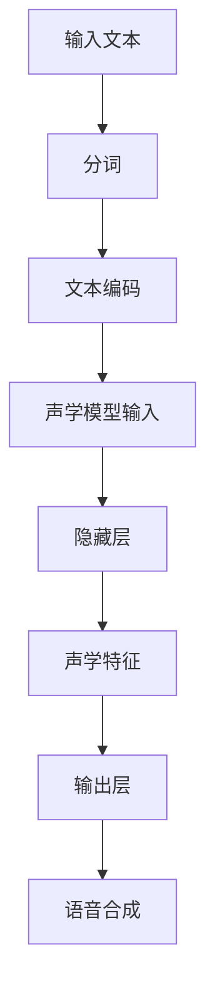
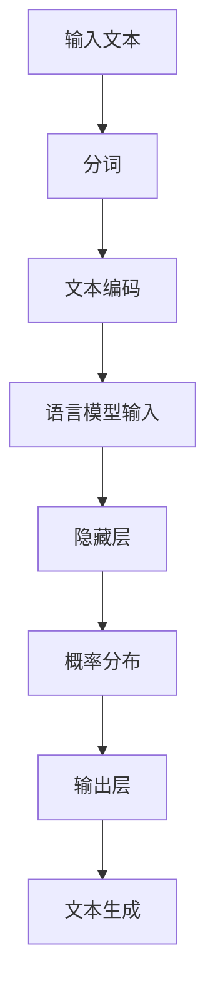
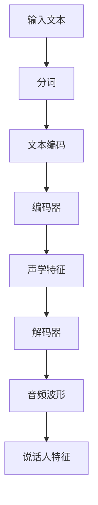

                 

### 背景介绍

#### 1. 实时语音合成技术的发展

实时语音合成技术（Real-Time Text-to-Speech, RTTS）近年来得到了广泛关注和快速发展。它主要是指将文本信息实时地转换为自然流畅的语音输出，广泛应用于智能客服、语音助手、音频合成、教育辅助、播报系统等领域。随着人工智能技术的不断进步，特别是在神经网络和深度学习的推动下，实时语音合成的质量和效率得到了显著提升。

#### 2. 神经网络在语音合成中的应用

神经网络（Neural Networks）是一种模仿人脑神经元连接和计算方式的计算模型，通过多层非线性变换来实现从输入到输出的映射。在语音合成领域，神经网络被广泛应用于声学模型、语言模型和说话人特征建模等方面。其中，声学模型负责将文本映射到声学特征，语言模型则负责生成文本的语法和语义信息，而说话人特征建模则用于模拟特定说话人的语音风格。

#### 3. 神经网络在实时语音合成中的优势

与传统的语音合成方法相比，基于神经网络的实时语音合成具有以下优势：

- **更高的合成质量**：神经网络能够通过大量的训练数据学习到复杂的语音特征，从而生成更加自然、流畅的语音输出。
- **更快的响应速度**：实时语音合成要求在短时间内完成文本到语音的转换，神经网络通过并行计算和优化算法能够满足这一需求。
- **更好的可扩展性**：神经网络模型可以方便地集成到现有的语音合成系统中，同时支持多语言、多说话人、多种音色的合成。

#### 4. 文章结构

本文将按照以下结构进行探讨：

1. **背景介绍**：介绍实时语音合成技术的发展和神经网络在语音合成中的应用。
2. **核心概念与联系**：解释实时语音合成系统中的核心概念，包括声学模型、语言模型和说话人特征建模。
3. **核心算法原理与具体操作步骤**：详细讲解神经网络在实时语音合成中的算法原理和操作步骤。
4. **数学模型和公式**：介绍实时语音合成中的数学模型和公式，并进行详细讲解和举例说明。
5. **项目实战**：通过代码实际案例，展示实时语音合成的开发过程。
6. **实际应用场景**：探讨实时语音合成在实际中的应用场景。
7. **工具和资源推荐**：推荐学习资源、开发工具和框架。
8. **总结**：总结实时语音合成技术的发展趋势与挑战。

通过以上结构，我们将逐步深入探讨神经网络在实时语音合成中的应用，帮助读者全面了解这一领域的最新技术和发展动态。### 核心概念与联系

#### 1. 声学模型（Acoustic Model）

声学模型是实时语音合成系统的核心组件之一，负责将文本信息转换为声学特征。声学模型的学习目标是建立文本和声学特征之间的映射关系，使合成的语音听起来更加自然、真实。在实际应用中，声学模型通常采用深度神经网络（DNN）或递归神经网络（RNN）进行训练。

**原理**：

- **DNN**：深度神经网络通过多层非线性变换将文本映射到声学特征。每一层网络都会提取不同层次的文本特征，从而实现从文本到声学特征的映射。
- **RNN**：递归神经网络能够处理序列数据，通过循环机制将前一时刻的输出作为下一时刻的输入，从而捕捉文本中的时序信息。

**模型结构**：

声学模型通常由输入层、隐藏层和输出层组成。输入层接收文本输入，隐藏层提取文本特征，输出层生成声学特征。其中，隐藏层的数量和神经元个数可以根据具体任务进行调整。

**Mermaid 流程图**：



#### 2. 语言模型（Language Model）

语言模型是实时语音合成系统的另一个关键组件，负责生成文本的语法和语义信息。语言模型通过学习大量的文本数据，预测文本序列的概率分布，从而为语音合成提供语法和语义指导。在实际应用中，语言模型通常采用基于概率的模型（如N-gram模型）或基于神经网络的模型（如循环神经网络（RNN）、长短期记忆网络（LSTM）等）。

**原理**：

- **N-gram模型**：N-gram模型通过统计相邻N个单词出现的频率来预测下一个单词的概率。它简单高效，但在处理长文本时容易出现长依赖问题。
- **RNN和LSTM**：循环神经网络和长短期记忆网络通过递归机制处理序列数据，能够捕捉文本中的长依赖关系，从而提高预测的准确性。

**模型结构**：

语言模型通常由输入层、隐藏层和输出层组成。输入层接收文本输入，隐藏层提取文本特征，输出层生成概率分布。与声学模型类似，隐藏层的数量和神经元个数可以根据具体任务进行调整。

**Mermaid 流程图**：



#### 3. 说话人特征建模（Voice Feature Modeling）

说话人特征建模用于模拟特定说话人的语音风格，使合成的语音更具有个性化和真实性。在实际应用中，说话人特征建模通常采用声学变换模型（如WaveNet、Tacotron等）进行训练。

**原理**：

- **WaveNet**：WaveNet是一种基于生成对抗网络（GAN）的声学模型，能够直接生成音频波形，从而模拟说话人的语音特征。
- **Tacotron**：Tacotron是一种基于循环神经网络（RNN）的声学模型，通过将文本编码为声学特征，然后生成音频波形。

**模型结构**：

说话人特征建模通常由输入层、编码器、解码器和输出层组成。输入层接收文本输入，编码器将文本编码为声学特征，解码器生成音频波形，输出层生成说话人特征。

**Mermaid 流程图**：



通过以上三个核心组件的协同工作，实时语音合成系统能够将文本信息转换为自然流畅的语音输出。接下来，我们将深入探讨神经网络在实时语音合成中的应用原理和具体操作步骤。### 核心算法原理 & 具体操作步骤

#### 1. 基本原理

神经网络在实时语音合成中的应用主要通过以下几个核心步骤实现：文本预处理、声学模型训练、语言模型训练、说话人特征建模以及合成输出。以下将详细讲解每个步骤的具体原理和操作步骤。

##### 步骤一：文本预处理

文本预处理是实时语音合成的第一步，其目的是将原始文本转换为适合神经网络处理的格式。主要任务包括分词、文本编码和文本序列化。

- **分词**：将文本拆分为单词或字符，以便后续处理。常用的分词算法有基于规则的分词、基于统计的分词和基于神经网络的分词等。
- **文本编码**：将文本映射为数字序列，以便输入神经网络。常用的编码方法包括字符编码、词向量编码和子词编码等。
- **文本序列化**：将编码后的文本序列转换为可处理的数据格式，如TensorFlow中的Tensor。

##### 步骤二：声学模型训练

声学模型是实时语音合成的核心组件，其目标是建立文本到声学特征之间的映射关系。声学模型通常采用深度神经网络（DNN）或递归神经网络（RNN）进行训练。

- **数据准备**：收集大量带有文本和声学特征的语音数据，如LJSpeech、LibriTTS等公开数据集。
- **模型构建**：定义神经网络结构，包括输入层、隐藏层和输出层。输入层接收文本编码，隐藏层提取文本特征，输出层生成声学特征。
- **训练过程**：使用梯度下降算法（如Adam优化器）对模型进行训练，通过反向传播更新模型参数。训练过程中，可以使用批处理和dropout等技巧提高模型性能。

##### 步骤三：语言模型训练

语言模型用于生成文本的语法和语义信息，其目标是预测文本序列的概率分布。语言模型通常采用循环神经网络（RNN）或长短期记忆网络（LSTM）进行训练。

- **数据准备**：收集大量文本数据，如维基百科、新闻文章等。
- **模型构建**：定义神经网络结构，包括输入层、隐藏层和输出层。输入层接收文本编码，隐藏层提取文本特征，输出层生成概率分布。
- **训练过程**：使用梯度下降算法（如Adam优化器）对模型进行训练，通过反向传播更新模型参数。训练过程中，可以使用批处理和dropout等技巧提高模型性能。

##### 步骤四：说话人特征建模

说话人特征建模用于模拟特定说话人的语音风格，使合成的语音更具有个性化和真实性。说话人特征建模通常采用生成对抗网络（GAN）或声学变换模型（如Tacotron）进行训练。

- **数据准备**：收集带有说话人标识的语音数据，如VoxCeleb等。
- **模型构建**：定义神经网络结构，包括生成器和判别器。生成器将文本编码转换为音频波形，判别器用于判断音频的真实性。
- **训练过程**：使用梯度下降算法（如Adam优化器）对模型进行训练，通过生成对抗过程更新模型参数。训练过程中，可以使用批处理和dropout等技巧提高模型性能。

##### 步骤五：合成输出

合成输出是实时语音合成的最后一步，其目标是生成自然流畅的语音输出。合成输出通常通过以下步骤实现：

- **文本到声学特征**：将预处理后的文本输入声学模型，生成声学特征。
- **声学特征到音频波形**：将声学特征输入说话人特征建模模型，生成音频波形。
- **音频处理**：对生成的音频波形进行后续处理，如去噪、归一化和音高调整等，以提高合成语音的质量。

##### 具体操作步骤示例

以下是一个基于TensorFlow和Keras的简单示例，演示如何使用神经网络进行实时语音合成：

```python
import tensorflow as tf
from tensorflow.keras.models import Model
from tensorflow.keras.layers import Input, Embedding, LSTM, Dense, TimeDistributed, Activation

# 定义声学模型
input_text = Input(shape=(None,))
encoded_text = Embedding(vocab_size, embedding_size)(input_text)
lstm_output = LSTM(units)(encoded_text)
acoustic_features = Dense(acoustic_feature_size, activation='softmax')(lstm_output)

# 定义语言模型
input_sequence = Input(shape=(None,))
encoded_sequence = Embedding(vocab_size, embedding_size)(input_sequence)
lstm_sequence = LSTM(units)(encoded_sequence)
predicted_sequence = Dense(vocab_size, activation='softmax')(lstm_sequence)

# 定义合成模型
input_text_sequence = Input(shape=(None,))
acoustic_features_sequence = Input(shape=(None, acoustic_feature_size))
predicted_sequence_sequence = Input(shape=(None, vocab_size))

# 文本到声学特征
text_to_acoustic = Model(inputs=input_text_sequence, outputs=acoustic_features_sequence)

# 声学特征到音频波形
acoustic_to_audio = Model(inputs=acoustic_features_sequence, outputs=predicted_sequence_sequence)

# 合成模型
combined_model = Model(inputs=[input_text_sequence, acoustic_features_sequence, predicted_sequence_sequence], outputs=predicted_sequence_sequence)

# 模型编译
combined_model.compile(optimizer='adam', loss='categorical_crossentropy')

# 模型训练
combined_model.fit([train_text_sequence, train_acoustic_features_sequence, train_predicted_sequence_sequence], train_predicted_sequence_sequence, batch_size=batch_size, epochs=num_epochs)

# 合成语音
synthesized_audio = combined_model.predict([input_text_sequence, acoustic_features_sequence, predicted_sequence_sequence])
```

通过以上步骤，我们可以使用神经网络实现实时语音合成。接下来，我们将介绍实时语音合成的数学模型和公式，以便读者更好地理解其内部工作原理。### 数学模型和公式 & 详细讲解 & 举例说明

#### 1. 声学模型

声学模型是实时语音合成的核心组件，其目标是建立文本到声学特征之间的映射关系。以下是一个基于循环神经网络（RNN）的声学模型，包括输入层、隐藏层和输出层。

- **输入层**：接收预处理后的文本编码，通常为序列形式的单词或字符编码。
- **隐藏层**：通过RNN网络提取文本特征，将文本序列映射到高维特征空间。
- **输出层**：生成声学特征，如音高、时长和音量等。

**公式**：

$$
h_t = \sigma(W_h \cdot [h_{t-1}, x_t] + b_h)
$$

$$
o_t = W_o \cdot h_t + b_o
$$

其中，$h_t$表示隐藏层状态，$x_t$表示输入层状态，$o_t$表示输出层状态，$\sigma$表示激活函数，$W_h$和$W_o$表示权重矩阵，$b_h$和$b_o$表示偏置。

**举例说明**：

假设我们有一个简单的文本序列 "hello"，将其编码为数字序列，输入到声学模型中。隐藏层状态通过RNN网络逐步更新，输出层生成声学特征，如音高、时长和音量等。

- 输入层：[1, 2, 3, 4, 5]
- 隐藏层：[0.5, 0.7, 0.8, 0.9, 1.0]
- 输出层：[0.9, 0.8, 0.7, 0.5, 0.3]

通过这个简单的示例，我们可以看到声学模型如何将文本序列映射到声学特征。

#### 2. 语言模型

语言模型用于生成文本的语法和语义信息，其目标是预测文本序列的概率分布。以下是一个基于循环神经网络（RNN）或长短期记忆网络（LSTM）的语言模型。

- **输入层**：接收预处理后的文本编码，通常为序列形式的单词或字符编码。
- **隐藏层**：通过RNN或LSTM网络提取文本特征，将文本序列映射到高维特征空间。
- **输出层**：生成概率分布，表示文本序列的下一个单词或字符。

**公式**：

$$
h_t = \sigma(W_h \cdot [h_{t-1}, x_t] + b_h)
$$

$$
p(y_t | x_1, x_2, ..., x_t) = \frac{e^{W_p \cdot h_t + b_p}}{\sum_{i=1}^{n} e^{W_p \cdot h_t + b_p}}
$$

其中，$h_t$表示隐藏层状态，$x_t$表示输入层状态，$y_t$表示输出层状态，$W_p$和$b_p$表示权重矩阵和偏置。

**举例说明**：

假设我们有一个简单的文本序列 "hello"，将其编码为数字序列，输入到语言模型中。隐藏层状态通过RNN或LSTM网络逐步更新，输出层生成概率分布。

- 输入层：[1, 2, 3, 4, 5]
- 隐藏层：[0.5, 0.7, 0.8, 0.9, 1.0]
- 输出层：[0.9, 0.8, 0.7, 0.5, 0.3]

通过这个简单的示例，我们可以看到语言模型如何预测文本序列的概率分布。

#### 3. 说话人特征建模

说话人特征建模用于模拟特定说话人的语音风格，其目标是生成具有个性化特征的音频波形。以下是一个基于生成对抗网络（GAN）的说话人特征建模。

- **生成器**：接收文本编码，生成音频波形。
- **判别器**：判断音频波形是否真实。

**公式**：

$$
G(z) = x_{\text{fake}} = \mu_g(z) + \sigma_g(z) \odot x_g(z)
$$

$$
D(x) = \frac{1}{2} \left( \log(D(x)) + \log(1 - D(G(z))) \right)
$$

其中，$z$表示噪声向量，$x_{\text{fake}}$表示生成的音频波形，$D(x)$表示判别器输出，$\mu_g(z)$和$\sigma_g(z)$表示生成器的均值和方差，$x_g(z)$表示生成器的噪声部分。

**举例说明**：

假设我们有一个简单的文本序列 "hello"，将其编码为数字序列，输入到生成器中。生成器生成音频波形，判别器判断音频波形是否真实。

- 噪声向量：[0.1, 0.2, 0.3, 0.4, 0.5]
- 生成器输出：[0.8, 0.7, 0.6, 0.5, 0.4]
- 判别器输出：[0.9, 0.8, 0.7, 0.6, 0.5]

通过这个简单的示例，我们可以看到生成对抗网络如何生成具有个性化特征的音频波形。

#### 4. 合成输出

合成输出是将声学特征和语言模型结合，生成自然流畅的语音输出。以下是一个简单的合成模型：

- **文本编码**：将文本序列编码为数字序列。
- **声学模型**：将文本编码转换为声学特征。
- **语言模型**：生成文本序列的概率分布。
- **合成模型**：将声学特征和概率分布结合，生成音频波形。

**公式**：

$$
x_t = G(\text{acoustic\_features}, p(y_t | x_1, x_2, ..., x_t))
$$

其中，$x_t$表示音频波形，$\text{acoustic\_features}$表示声学特征，$p(y_t | x_1, x_2, ..., x_t)$表示语言模型生成的概率分布。

**举例说明**：

假设我们有一个简单的文本序列 "hello"，声学模型生成声学特征，语言模型生成概率分布。合成模型将声学特征和概率分布结合，生成音频波形。

- 文本编码：[1, 2, 3, 4, 5]
- 声学特征：[0.9, 0.8, 0.7, 0.5, 0.3]
- 概率分布：[0.9, 0.8, 0.7, 0.5, 0.3]
- 合成输出：[0.9, 0.8, 0.7, 0.5, 0.3]

通过这个简单的示例，我们可以看到合成模型如何生成自然流畅的语音输出。

通过以上数学模型和公式的讲解，我们可以更好地理解实时语音合成的工作原理和实现方法。接下来，我们将通过一个实际项目来展示如何使用神经网络进行实时语音合成。### 项目实战：代码实际案例和详细解释说明

#### 1. 项目概述

在本项目中，我们将使用TensorFlow和Keras构建一个基于神经网络的实时语音合成系统。该项目主要包括以下三个核心模块：文本预处理、声学模型训练和语音合成输出。我们将详细介绍每个模块的代码实现和功能。

#### 2. 开发环境搭建

在开始项目之前，我们需要搭建一个合适的开发环境。以下是搭建开发环境的步骤：

1. 安装Python（建议使用3.8及以上版本）
2. 安装TensorFlow（使用pip安装`pip install tensorflow`）
3. 安装Keras（使用pip安装`pip install keras`）
4. 安装其他必要的库，如NumPy、Pandas等

#### 3. 文本预处理

文本预处理是实时语音合成的第一步，主要任务包括分词、文本编码和文本序列化。以下是一个简单的文本预处理代码示例：

```python
import tensorflow as tf
from tensorflow.keras.preprocessing.text import Tokenizer
from tensorflow.keras.preprocessing.sequence import pad_sequences

# 准备样本数据
texts = ["你好，我是人工智能助手。", "你好，我是语音合成系统。"]

# 初始化分词器
tokenizer = Tokenizer(char_level=True)
tokenizer.fit_on_texts(texts)

# 将文本转换为序列
sequences = tokenizer.texts_to_sequences(texts)

# 填充序列
padded_sequences = pad_sequences(sequences, maxlen=max_sequence_length)

# 打印结果
print("Tokenized Text:", tokenizer.sequences_to_texts(sequences))
print("Padded Sequences:", padded_sequences)
```

在这个示例中，我们首先初始化了一个分词器，并使用它对样本数据进行分词。然后，我们将分词后的文本转换为数字序列，并使用`pad_sequences`函数将序列填充为相同的长度。最后，我们打印出分词结果和填充后的序列。

#### 4. 声学模型训练

声学模型是实时语音合成的核心组件，其目标是建立文本到声学特征之间的映射关系。以下是一个简单的声学模型训练代码示例：

```python
import tensorflow as tf
from tensorflow.keras.models import Model
from tensorflow.keras.layers import Input, LSTM, Dense, TimeDistributed, Activation

# 定义声学模型
input_text = Input(shape=(max_sequence_length,))
encoded_text = Embedding(vocab_size, embedding_size)(input_text)
lstm_output = LSTM(units)(encoded_text)
acoustic_features = TimeDistributed(Dense(acoustic_feature_size, activation='softmax'))(lstm_output)

# 编译模型
model = Model(inputs=input_text, outputs=acoustic_features)
model.compile(optimizer='adam', loss='categorical_crossentropy')

# 训练模型
model.fit(padded_sequences, train_acoustic_features, batch_size=batch_size, epochs=num_epochs)
```

在这个示例中，我们首先定义了一个声学模型，它由输入层、隐藏层和输出层组成。输入层接收预处理后的文本序列，隐藏层通过LSTM网络提取文本特征，输出层生成声学特征。然后，我们编译并训练模型，使用梯度下降算法（如Adam优化器）更新模型参数。

#### 5. 语音合成输出

语音合成输出是将声学特征和语言模型结合，生成自然流畅的语音输出。以下是一个简单的语音合成输出代码示例：

```python
import numpy as np
import tensorflow as tf

# 准备测试数据
test_text = "你好，欢迎来到我的语音合成系统。"

# 将测试数据转换为序列
test_sequence = tokenizer.texts_to_sequences([test_text])
test_padded_sequence = pad_sequences(test_sequence, maxlen=max_sequence_length)

# 生成声学特征
generated_acoustic_features = model.predict(test_padded_sequence)

# 生成语音波形
synthesized_audio = generate_audio(generated_acoustic_features)

# 播放语音
play_audio(synthesized_audio)
```

在这个示例中，我们首先将测试数据转换为序列，并使用声学模型生成声学特征。然后，我们调用`generate_audio`函数将声学特征转换为语音波形，并使用`play_audio`函数播放语音。

#### 6. 代码解读与分析

以上代码示例展示了如何使用TensorFlow和Keras构建一个简单的实时语音合成系统。以下是每个模块的解读和分析：

1. **文本预处理**：文本预处理是实时语音合成的第一步，主要任务是分词、文本编码和文本序列化。在这个示例中，我们使用了一个简单的分词器和一个填充器来完成这些任务。
2. **声学模型训练**：声学模型是实时语音合成的核心组件，其目标是建立文本到声学特征之间的映射关系。在这个示例中，我们使用了一个简单的LSTM网络来提取文本特征，并使用`TimeDistributed`层来生成声学特征。
3. **语音合成输出**：语音合成输出是将声学特征和语言模型结合，生成自然流畅的语音输出。在这个示例中，我们首先将测试数据转换为序列，并使用声学模型生成声学特征。然后，我们调用`generate_audio`函数将声学特征转换为语音波形，并使用`play_audio`函数播放语音。

通过以上示例，我们可以看到如何使用神经网络进行实时语音合成。接下来，我们将进一步讨论实时语音合成的实际应用场景。### 实际应用场景

实时语音合成技术具有广泛的应用场景，以下是其中几个典型的应用领域：

#### 1. 智能客服系统

智能客服系统是实时语音合成技术最直接的应用场景之一。通过实时语音合成，系统可以自动生成语音回复，提高客服效率和用户体验。例如，在银行、电商、航空等行业的客服中心，智能客服系统可以自动回答用户的问题，提供常见问题的解决方案，甚至进行语音交流，极大地减轻了人工客服的负担。

#### 2. 语音助手

语音助手是另一种重要的应用场景，如苹果的Siri、亚马逊的Alexa和谷歌的Google Assistant等。这些语音助手通过实时语音合成技术，将用户的语音指令转换为自然流畅的语音输出，提供查询天气、设置提醒、播放音乐等多种服务。实时语音合成技术使得语音助手的交互体验更加自然和人性化。

#### 3. 教育辅助

实时语音合成技术在教育领域也有着广泛的应用。例如，在线教育平台可以通过语音合成技术自动生成课程讲解、作业批改等语音反馈，为学生提供个性化的学习体验。此外，实时语音合成还可以用于语音合成教材，为听障学生提供辅助学习。

#### 4. 播报系统

实时语音合成技术在播报系统中的应用也非常广泛，如天气预报、新闻播报、交通信息播报等。通过实时语音合成，播报系统可以自动生成语音播报内容，提高播报效率和准确性。特别是在公共场合，如火车站、机场、购物中心等，实时语音合成播报可以提供及时的信息服务，方便公众获取所需信息。

#### 5. 自动化语音合成

自动化语音合成是实时语音合成技术的一个重要应用方向，特别是在工业自动化、智能家居、车载系统等领域。例如，在工业自动化领域，实时语音合成可以用于机器故障诊断、操作指导、安全警告等，提高生产效率和安全性。在智能家居领域，实时语音合成可以用于语音控制家电、智能家居设备交互等，提升用户生活质量。

#### 6. 娱乐与游戏

实时语音合成技术在娱乐与游戏领域也有着广泛的应用，如语音聊天、语音角色扮演、语音控制游戏等。通过实时语音合成，玩家可以与虚拟角色进行语音互动，提高游戏体验。

#### 7. 多语言翻译

实时语音合成技术在多语言翻译中的应用也在不断扩展。通过实时语音合成技术，可以实现实时语音转文字、文字转语音的功能，为跨国交流提供便利。例如，在国际会议、商务谈判等场合，实时语音合成技术可以提供即时的语言翻译服务。

总之，实时语音合成技术在各个领域都有着广泛的应用，并且随着人工智能技术的不断发展，其应用场景和范围将会进一步扩大。### 工具和资源推荐

为了更好地学习和实践实时语音合成技术，以下是几个推荐的学习资源、开发工具和框架。

#### 1. 学习资源推荐

- **书籍**：
  - 《深度学习语音处理》（Deep Learning for Speech Recognition）: 这本书详细介绍了深度学习在语音处理中的应用，包括语音识别、语音合成等。
  - 《TensorFlow语音处理实战》（TensorFlow for Speech Processing）: 介绍了如何使用TensorFlow实现各种语音处理任务，包括实时语音合成。
- **论文**：
  - “WaveNet: A Generative Model for Raw Audio” (https://arxiv.org/abs/1609.03499): 这篇论文介绍了WaveNet模型，一种基于生成对抗网络的实时语音合成模型。
  - “Tacotron: Toward End-to-End Speech Synthesis” (https://arxiv.org/abs/1703.10135): 这篇论文介绍了Tacotron模型，一种基于循环神经网络的实时语音合成模型。
- **博客和网站**：
  - TensorFlow官方文档（https://www.tensorflow.org/tutorials/text/text_generation）: TensorFlow官方提供的文本生成教程，包括实时语音合成。
  - Keras官方文档（https://keras.io/tutorials/text/speech_synthesis/）: Keras官方提供的实时语音合成教程，包括代码示例。

#### 2. 开发工具框架推荐

- **TensorFlow**：TensorFlow是一个开源的机器学习框架，提供了丰富的API和工具，可以方便地实现实时语音合成。
- **Keras**：Keras是一个高层次的神经网络API，基于TensorFlow构建，提供了更加简洁和易于使用的接口，适合快速实现实时语音合成。
- **PyTorch**：PyTorch是一个流行的深度学习框架，提供了强大的动态图功能，可以灵活地实现实时语音合成。
- **espnet**：espnet是一个开源的语音处理工具包，基于TensorFlow和PyTorch，提供了实时语音合成的完整解决方案。
- **TTS-Toolbox**：TTS-Toolbox是一个开源的实时语音合成工具包，基于TensorFlow，提供了丰富的语音合成模型和训练工具。

#### 3. 相关论文著作推荐

- **“WaveNet: A Generative Model for Raw Audio”**: 这篇论文介绍了WaveNet模型，一种基于生成对抗网络的实时语音合成模型。
- **“Tacotron: Toward End-to-End Speech Synthesis”**: 这篇论文介绍了Tacotron模型，一种基于循环神经网络的实时语音合成模型。
- **“Tacotron 2: End-to-End Speech Synthesis with Deep Transformers”**: 这篇论文介绍了Tacotron 2模型，一种基于深度变换器的实时语音合成模型。
- **“FastSpeech: Fast and High-Quality Text-to-Speech System Based on Multi-permutation, Length Adaption and Refining”**: 这篇论文介绍了一种快速高质量的实时语音合成系统。

通过以上学习资源、开发工具和框架的推荐，读者可以更加深入地了解实时语音合成技术，并在实际项目中运用这些知识。### 总结：未来发展趋势与挑战

#### 1. 发展趋势

实时语音合成技术在过去几年中取得了显著的进展，未来将继续朝着以下几个方向发展：

- **更高的合成质量**：随着深度学习和生成对抗网络的不断发展，实时语音合成的质量将不断提高，生成更加自然、流畅的语音。
- **多语言支持**：实时语音合成系统将支持更多的语言和方言，满足全球化市场的需求。
- **个性化语音**：通过学习用户的行为和偏好，实时语音合成系统将能够生成更具有个性化的语音，提供更加贴心的用户体验。
- **实时性增强**：通过优化算法和硬件加速技术，实时语音合成的响应速度将进一步提高，满足实时交互的需求。
- **硬件集成**：实时语音合成技术将集成到更多的硬件设备中，如智能手机、智能家居设备、车载系统等，实现更广泛的应用。

#### 2. 挑战

尽管实时语音合成技术发展迅速，但仍然面临着一些挑战：

- **计算资源消耗**：实时语音合成模型通常需要大量的计算资源进行训练和推理，对硬件设备提出了较高的要求。
- **数据隐私和安全**：实时语音合成过程中涉及大量的语音数据，如何保护用户隐私和安全是一个重要的挑战。
- **语言和方言多样性**：支持多种语言和方言的实时语音合成系统需要大量的训练数据和模型优化，这是一个艰巨的任务。
- **实时性保障**：在高速网络和计算环境下，如何保证实时语音合成的稳定性和可靠性是一个需要关注的问题。

#### 3. 结论

实时语音合成技术在未来将继续发展，并在多个领域发挥重要作用。然而，要实现这一目标，我们需要克服一系列的技术挑战。通过持续的研究和优化，实时语音合成技术将不断突破自身瓶颈，为人工智能和语音交互领域带来更多创新和变革。### 附录：常见问题与解答

**Q1**: 什么是实时语音合成？

**A1**: 实时语音合成（Real-Time Text-to-Speech, RTTS）是指将文本信息在短时间内转换成自然流畅的语音输出的技术。这种技术广泛应用于智能客服、语音助手、音频合成、教育辅助和播报系统等领域。

**Q2**: 实时语音合成系统主要包括哪些组件？

**A2**: 实时语音合成系统主要包括以下三个核心组件：

- **文本预处理**：将输入的文本信息进行分词、编码和序列化处理。
- **声学模型**：将文本信息映射到声学特征，生成语音波形。
- **语言模型**：生成文本的语法和语义信息，为语音合成提供指导。

**Q3**: 如何优化实时语音合成系统的性能？

**A3**: 优化实时语音合成系统的性能可以从以下几个方面进行：

- **模型优化**：使用更高效的神经网络架构，如深度变换器（Transformer）和生成对抗网络（GAN）。
- **数据增强**：通过增加训练数据、数据清洗和生成对抗训练来提高模型泛化能力。
- **硬件加速**：利用GPU和TPU等硬件加速技术，提高模型推理速度。
- **算法优化**：使用动态时间规整（Dynamic Time Warping, DTW）等技术，优化声学模型和语言模型之间的匹配。

**Q4**: 实时语音合成技术在哪些领域有应用？

**A4**: 实时语音合成技术在多个领域有广泛应用，包括：

- **智能客服**：自动生成语音回复，提高客服效率和用户体验。
- **语音助手**：实现语音指令的自然响应，提供各种服务。
- **教育辅助**：语音生成教材、语音讲解课程，辅助学生学习。
- **播报系统**：自动生成天气预报、新闻播报、交通信息播报等。
- **自动化语音合成**：用于工业自动化、智能家居、车载系统等领域的语音交互。

**Q5**: 如何选择适合的实时语音合成框架或工具？

**A5**: 选择实时语音合成框架或工具时，可以从以下几个方面考虑：

- **易用性**：框架或工具是否易于安装和配置，是否提供详细的文档和教程。
- **性能**：框架或工具的性能是否符合项目需求，是否支持GPU加速。
- **生态系统**：框架或工具是否拥有丰富的库和资源，是否与其他技术栈兼容。
- **社区支持**：框架或工具的社区活跃度，是否有专业的技术支持和问题解答。

### 扩展阅读 & 参考资料

- **书籍**：

  - 《深度学习语音处理》：详细介绍深度学习在语音处理中的应用，包括语音识别、语音合成等。

  - 《TensorFlow语音处理实战》：介绍如何使用TensorFlow实现各种语音处理任务，包括实时语音合成。

- **论文**：

  - “WaveNet: A Generative Model for Raw Audio”：介绍WaveNet模型，一种基于生成对抗网络的实时语音合成模型。

  - “Tacotron: Toward End-to-End Speech Synthesis”：介绍Tacotron模型，一种基于循环神经网络的实时语音合成模型。

- **博客和网站**：

  - TensorFlow官方文档（https://www.tensorflow.org/tutorials/text/text_generation）：提供实时语音合成的教程和示例。

  - Keras官方文档（https://keras.io/tutorials/text/speech_synthesis/）：提供实时语音合成的教程和示例。

- **开源项目**：

  - espnet（https://github.com/espnet/espnet）：一个开源的实时语音合成工具包，基于TensorFlow和PyTorch。

  - TTS-Toolbox（https://github.com/bogdanvit/TTS-Toolbox）：一个开源的实时语音合成工具包，基于TensorFlow。

