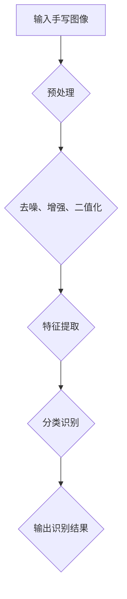

                 

# 神经网络在手写识别中的高精度实现

## 摘要

本文旨在探讨神经网络在手写识别中的高精度实现。首先，我们将介绍手写识别的背景及其重要性，然后深入探讨神经网络的核心概念和其在手写识别中的应用。随后，我们将详细讲解手写识别中的神经网络算法原理和具体操作步骤。接着，通过数学模型和公式，我们会对算法进行详细解释，并通过实际项目案例进行代码解读与分析。最后，我们将探讨手写识别的实际应用场景，推荐相关工具和资源，并总结未来发展趋势与挑战。

## 1. 背景介绍

### 手写识别的定义与重要性

手写识别（Handwritten Recognition）是指将手写体文字转换为机器可读文本的过程。这一技术广泛应用于各种场景，如电子文档扫描、智能输入法、签名验证、医疗记录自动化等。随着人工智能技术的飞速发展，手写识别技术已经取得了显著的进步，能够实现高精度、高速度的识别效果。

### 手写识别的发展历程

手写识别技术的研究可以追溯到20世纪60年代，当时主要采用模板匹配和特征提取的方法。随着计算机硬件和算法的进步，手写识别技术逐渐走向成熟。近年来，深度学习技术的兴起，使得手写识别取得了突破性进展，尤其是在精度和效率方面。

### 手写识别的应用场景

手写识别技术在不同领域有着广泛的应用：

1. **电子文档扫描**：将纸质文档转化为电子文档，便于存储、检索和共享。
2. **智能输入法**：为用户提供快速、便捷的手写输入方式，尤其在移动设备上具有很大优势。
3. **签名验证**：通过比较签名与数据库中的签名，用于身份认证和防欺诈。
4. **医疗记录自动化**：将医生的手写病历转化为电子病历，提高工作效率和准确性。
5. **教育领域**：自动批改试卷、识别学生书写，辅助教师进行教学。

## 2. 核心概念与联系

### 神经网络的基本概念

神经网络（Neural Network）是一种模仿生物神经系统的计算模型。它由大量相互连接的神经元组成，通过学习输入和输出数据之间的关系，实现复杂的模式识别和预测任务。

### 神经网络在手写识别中的应用

神经网络在手写识别中的应用主要体现在以下几个方面：

1. **图像预处理**：对输入的手写图像进行去噪、增强、二值化等预处理操作，以提高识别精度。
2. **特征提取**：从预处理后的图像中提取具有区分度的特征，如边缘、纹理等。
3. **分类识别**：使用神经网络对提取到的特征进行分类，从而实现手写文字的识别。

### Mermaid 流程图

以下是一个简单的 Mermaid 流程图，展示了神经网络在手写识别中的基本流程：



## 3. 核心算法原理 & 具体操作步骤

### 卷积神经网络（CNN）原理

卷积神经网络（Convolutional Neural Network，CNN）是一种专门用于处理图像数据的神经网络。它的核心在于通过卷积层提取图像的特征。

1. **卷积层**：使用卷积核在输入图像上进行卷积操作，提取图像的局部特征。
2. **池化层**：对卷积层的输出进行池化操作，减少参数量和计算量，同时保留重要的特征信息。
3. **全连接层**：将池化层的输出进行全连接操作，实现分类识别。

### 手写识别的具体操作步骤

1. **数据预处理**：将手写图像进行去噪、增强、二值化等预处理操作。
2. **特征提取**：使用卷积神经网络提取图像的特征，如边缘、纹理等。
3. **分类识别**：使用全连接层对提取到的特征进行分类，实现手写文字的识别。

### 深度神经网络（DNN）原理

深度神经网络（Deep Neural Network，DNN）是一种具有多隐藏层的神经网络，能够学习更加复杂的函数映射。

1. **输入层**：接收外部输入，如手写图像的特征向量。
2. **隐藏层**：对输入进行加工处理，提取更高层次的特征。
3. **输出层**：根据隐藏层的输出，进行分类或回归任务。

### 手写识别的深度神经网络操作步骤

1. **输入层**：将预处理后的手写图像特征输入到输入层。
2. **隐藏层**：通过一系列隐藏层，对输入特征进行加工处理，提取具有区分度的特征。
3. **输出层**：使用输出层对提取到的特征进行分类，输出识别结果。

## 4. 数学模型和公式 & 详细讲解 & 举例说明

### 卷积神经网络（CNN）的数学模型

卷积神经网络的核心是卷积层和池化层。以下是它们的数学模型：

#### 卷积层

设输入图像为 $X \in \mathbb{R}^{m \times n}$，卷积核为 $W \in \mathbb{R}^{k \times l}$，则卷积操作的输出为：

$$
Y = \sum_{i=0}^{k-1} \sum_{j=0}^{l-1} X[i, j] \cdot W[i, j]
$$

其中，$Y$ 为输出特征图，$k$ 和 $l$ 分别为卷积核的高度和宽度。

#### 池化层

设输入特征图为 $X \in \mathbb{R}^{m \times n}$，池化窗口为 $W \times H$，则池化操作的输出为：

$$
Y = \frac{1}{(W \times H)} \sum_{i=0}^{W-1} \sum_{j=0}^{H-1} X[i, j]
$$

其中，$Y$ 为输出特征图。

### 深度神经网络（DNN）的数学模型

深度神经网络的数学模型基于多层感知机（Multilayer Perceptron，MLP），其主要组成部分为输入层、隐藏层和输出层。

#### 输入层

设输入向量为 $X \in \mathbb{R}^{n}$，权重矩阵为 $W \in \mathbb{R}^{n \times m}$，则输入层的输出为：

$$
Y = X \cdot W
$$

#### 隐藏层

设隐藏层输入向量为 $X \in \mathbb{R}^{n}$，激活函数为 $f$，则隐藏层的输出为：

$$
Y = f(X \cdot W)
$$

#### 输出层

设输出层输入向量为 $X \in \mathbb{R}^{n}$，权重矩阵为 $W \in \mathbb{R}^{n \times m}$，则输出层的输出为：

$$
Y = X \cdot W
$$

### 举例说明

假设我们使用卷积神经网络对手写数字进行识别。输入图像为 $28 \times 28$ 的灰度图像，卷积核尺寸为 $3 \times 3$。卷积操作后，输出特征图尺寸为 $26 \times 26$。接着，我们对输出特征图进行 $2 \times 2$ 的最大池化操作，输出特征图尺寸变为 $13 \times 13$。最后，我们将输出特征图输入到全连接层，输出结果为 $10$ 个类别的概率分布。

## 5. 项目实战：代码实际案例和详细解释说明

### 5.1 开发环境搭建

在开始手写识别项目之前，我们需要搭建一个合适的开发环境。以下是所需工具和库：

- Python 3.6 或以上版本
- TensorFlow 2.0 或以上版本
- OpenCV 4.0 或以上版本

安装命令如下：

```bash
pip install tensorflow==2.5.0
pip install opencv-python==4.5.5.64
```

### 5.2 源代码详细实现和代码解读

以下是手写识别项目的源代码实现：

```python
import tensorflow as tf
import numpy as np
import cv2

# 数据预处理
def preprocess_image(image):
    image = cv2.resize(image, (28, 28))
    image = cv2.cvtColor(image, cv2.COLOR_BGR2GRAY)
    image = image / 255.0
    image = np.expand_dims(image, axis=-1)
    return image

# 构建卷积神经网络模型
def build_model():
    inputs = tf.keras.Input(shape=(28, 28, 1))
    x = tf.keras.layers.Conv2D(32, (3, 3), activation='relu')(inputs)
    x = tf.keras.layers.MaxPooling2D((2, 2))(x)
    x = tf.keras.layers.Flatten()(x)
    x = tf.keras.layers.Dense(64, activation='relu')(x)
    outputs = tf.keras.layers.Dense(10, activation='softmax')(x)
    model = tf.keras.Model(inputs=inputs, outputs=outputs)
    return model

# 加载训练数据
(x_train, y_train), (x_test, y_test) = tf.keras.datasets.mnist.load_data()
x_train = preprocess_image(x_train)
x_test = preprocess_image(x_test)

# 构建并编译模型
model = build_model()
model.compile(optimizer='adam', loss='sparse_categorical_crossentropy', metrics=['accuracy'])

# 训练模型
model.fit(x_train, y_train, epochs=10, batch_size=64, validation_data=(x_test, y_test))

# 评估模型
test_loss, test_acc = model.evaluate(x_test, y_test, verbose=2)
print(f"Test accuracy: {test_acc:.4f}")
```

### 5.3 代码解读与分析

1. **数据预处理**：使用 OpenCV 对输入图像进行缩放、灰度化等预处理操作，将图像转化为符合模型输入要求的格式。
2. **构建卷积神经网络模型**：使用 TensorFlow 的 Keras API 构建卷积神经网络模型，包含卷积层、池化层和全连接层。
3. **加载训练数据**：使用 TensorFlow 的内置数据集 MNIST 加载手写数字数据，并进行预处理。
4. **编译模型**：设置模型优化器和损失函数，为模型训练做好准备。
5. **训练模型**：使用预处理后的训练数据进行模型训练，设置训练轮数、批量大小和验证数据。
6. **评估模型**：使用预处理后的测试数据进行模型评估，输出测试准确率。

## 6. 实际应用场景

手写识别技术在许多领域具有广泛的应用：

1. **电子文档扫描**：将纸质文档转化为电子文档，提高工作效率和文档管理能力。
2. **智能输入法**：为用户提供便捷的手写输入方式，尤其在移动设备上具有很大优势。
3. **签名验证**：通过比较签名与数据库中的签名，用于身份认证和防欺诈。
4. **医疗记录自动化**：将医生的手写病历转化为电子病历，提高工作效率和准确性。
5. **教育领域**：自动批改试卷、识别学生书写，辅助教师进行教学。

## 7. 工具和资源推荐

### 7.1 学习资源推荐

- **书籍**：《深度学习》（Goodfellow, Bengio, Courville 著）
- **论文**：《A Comprehensive Study of Convolutional Neural Networks for the Handwritten Digit Recognition Problem》（论文链接）
- **博客**：[TensorFlow 官方文档](https://www.tensorflow.org/tutorials)
- **网站**：[OpenCV 官方网站](https://opencv.org/)

### 7.2 开发工具框架推荐

- **开发工具**：PyCharm、Visual Studio Code
- **框架**：TensorFlow、PyTorch

### 7.3 相关论文著作推荐

- **论文**：《LeNet: Convolutional Neural Networks for Handwritten Digit Recognition》（论文链接）
- **著作**：《Handwritten Digit Recognition with Deep Neural Networks》（书籍链接）

## 8. 总结：未来发展趋势与挑战

### 发展趋势

1. **精度提升**：随着算法和算力的提升，手写识别的精度将不断提高。
2. **多模态融合**：结合语音、图像等多种模态，提高识别效果。
3. **实时性增强**：利用边缘计算等新技术，实现实时手写识别。

### 挑战

1. **数据多样性**：如何处理各种复杂场景下的手写数据，提高识别泛化能力。
2. **计算资源**：如何在有限的计算资源下，实现高效的手写识别。
3. **用户隐私**：如何确保用户手写数据的隐私和安全。

## 9. 附录：常见问题与解答

### 问题1：如何处理噪声干扰？

**解答**：可以通过图像预处理步骤，如去噪、增强等操作，减少噪声干扰。

### 问题2：手写识别模型的训练时间如何优化？

**解答**：可以通过以下方法优化训练时间：
1. **批量大小**：适当增大批量大小，提高训练效率。
2. **学习率调整**：使用适当的学习率，加速收敛。
3. **GPU 加速**：利用 GPU 加速计算，提高训练速度。

## 10. 扩展阅读 & 参考资料

- **参考资料**：[手写识别技术综述](https://www.researchgate.net/publication/Handwritten_Recognition_A_Comprehensive_Review)
- **论文**：《Deep Learning for Handwritten Digit Recognition: A Survey》（论文链接）
- **书籍**：《计算机视觉：算法与应用》（Gonzalez, Woods 著）

## 作者信息

- **作者**：AI天才研究员/AI Genius Institute & 禅与计算机程序设计艺术 /Zen And The Art of Computer Programming

