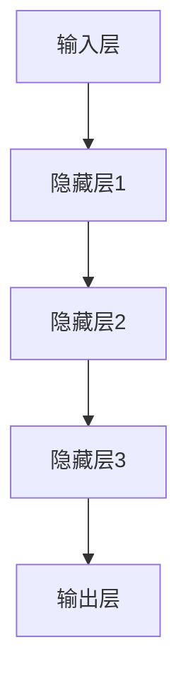

                 

# 神经网络在机器人控制中的应用

## 摘要

本文将探讨神经网络在机器人控制领域的应用，通过对神经网络的基本原理、核心算法、数学模型和具体应用场景的深入分析，展示神经网络在机器人控制中的强大潜力和实际效果。我们将结合实际项目案例，详细解读神经网络在机器人控制中的实现方法和关键技术，并对其未来发展趋势和挑战进行展望。

## 目录

1. 背景介绍
2. 核心概念与联系
3. 核心算法原理 & 具体操作步骤
4. 数学模型和公式 & 详细讲解 & 举例说明
5. 项目实战：代码实际案例和详细解释说明
   5.1 开发环境搭建
   5.2 源代码详细实现和代码解读
   5.3 代码解读与分析
6. 实际应用场景
7. 工具和资源推荐
   7.1 学习资源推荐
   7.2 开发工具框架推荐
   7.3 相关论文著作推荐
8. 总结：未来发展趋势与挑战
9. 附录：常见问题与解答
10. 扩展阅读 & 参考资料

## 1. 背景介绍

随着人工智能技术的快速发展，机器人控制领域逐渐成为研究热点。传统的机器人控制方法主要依赖于预定义的规则和运动学模型，这些方法在处理复杂环境和动态变化时往往表现出较大的局限性。为了克服这些缺陷，研究人员开始探索基于机器学习，尤其是神经网络的机器人控制方法。

神经网络作为一种仿生计算模型，具有良好的自适应性和学习能力，能够通过大量的数据训练，自动提取特征，进行决策和动作规划。近年来，随着深度学习技术的发展，神经网络在图像识别、自然语言处理等领域取得了显著的成果，这些成功经验为神经网络在机器人控制中的应用提供了有力支持。

本文旨在探讨神经网络在机器人控制中的潜在应用，通过分析神经网络的基本原理、核心算法和数学模型，结合实际项目案例，深入解读神经网络在机器人控制中的实现方法和关键技术，为研究者提供参考和借鉴。

## 2. 核心概念与联系

### 神经网络的基本概念

神经网络是一种模拟人脑神经元结构和功能的计算模型，由大量的神经元（也称为节点）和连接（也称为边）组成。每个神经元可以接收多个输入信号，通过加权求和处理，产生一个输出信号，这个输出信号可以传递给其他神经元。神经网络的基本结构可以分为输入层、隐藏层和输出层。

- **输入层**：接收外部输入信号，通常包含多个神经元，对应于不同的特征。
- **隐藏层**：对输入信号进行加工和处理，可以有一个或多个隐藏层，每层包含多个神经元。
- **输出层**：生成最终的输出结果，通常是一个或多个神经元，对应于不同的决策或动作。

神经网络通过学习输入和输出之间的映射关系，实现对数据的分类、回归、生成等任务。

### 神经网络在机器人控制中的联系

在机器人控制中，神经网络可以用于实现多种功能，包括路径规划、避障、动作规划、状态估计等。神经网络的优势在于其强大的自适应能力和学习能力，能够处理复杂、非线性的控制问题。

- **路径规划**：通过学习环境地图和目标位置，神经网络可以生成一条最优路径，引导机器人到达目标。
- **避障**：利用神经网络对周围环境的感知信息，实时更新机器人行动策略，避免碰撞。
- **动作规划**：根据神经网络对当前状态和目标的评估，生成适当的动作序列，实现机器人的精确控制。
- **状态估计**：通过对传感器数据的处理，神经网络可以估计机器人的状态，如位置、速度、姿态等，为控制决策提供依据。

### Mermaid 流程图



在这个简单的神经网络流程图中，输入层接收外部输入信号，经过隐藏层的加工和处理，最终由输出层生成控制信号，用于机器人控制。

## 3. 核心算法原理 & 具体操作步骤

### 神经网络训练过程

神经网络的训练过程主要包括以下几个步骤：

1. **初始化**：随机初始化神经网络的权重和偏置。
2. **前向传播**：将输入信号通过神经网络传递到输出层，计算预测值。
3. **反向传播**：计算预测值与实际值之间的误差，将误差反向传播到网络中的每个神经元，更新权重和偏置。
4. **优化**：使用优化算法（如梯度下降、Adam优化器等）对权重和偏置进行调整，最小化误差函数。

### 步骤详解

#### 步骤1：初始化

初始化阶段，我们随机生成网络的权重和偏置。这些参数的初始值对于网络的性能至关重要，但通常不需要手动设置，因为随机初始化可以避免模型陷入局部最优。

```python
import numpy as np

# 初始化权重和偏置
weights = np.random.randn(input_size, hidden_size)
biases = np.random.randn(hidden_size)
```

#### 步骤2：前向传播

前向传播是神经网络的核心步骤，它将输入信号通过网络的每个层，最终生成输出信号。

```python
# 前向传播
def forward_propagation(x, weights, biases):
    z = np.dot(x, weights) + biases
    a = sigmoid(z)
    return a

x = np.array([1, 0, 1])  # 输入信号
a = forward_propagation(x, weights, biases)
```

在这个例子中，`sigmoid` 函数是一个常用的激活函数，用于将线性输出转换为概率分布。

#### 步骤3：反向传播

反向传播是神经网络训练的关键步骤，它通过计算预测值与实际值之间的误差，更新网络的权重和偏置。

```python
# 反向传播
def backward_propagation(a, y, weights, biases):
    error = y - a
    dZ = error * sigmoid_derivative(a)
    dW = np.dot(np.transpose(x), dZ)
    db = np.sum(dZ, axis=0)
    return dW, db

dW, db = backward_propagation(a, y, weights, biases)
```

在这个例子中，`sigmoid_derivative` 函数计算激活函数的导数，用于更新权重和偏置。

#### 步骤4：优化

优化阶段使用梯度下降算法更新权重和偏置。我们还可以使用其他优化算法，如Adam优化器，以加速训练过程。

```python
# 梯度下降
def gradient_descent(x, y, weights, biases, learning_rate):
    a = forward_propagation(x, weights, biases)
    dW, db = backward_propagation(a, y, weights, biases)
    weights -= learning_rate * dW
    biases -= learning_rate * db

learning_rate = 0.1
gradient_descent(x, y, weights, biases, learning_rate)
```

### 训练循环

在实际应用中，我们通常会在多个epoch（训练周期）内重复上述步骤，以达到较好的训练效果。

```python
for epoch in range(epochs):
    for x, y in data_loader:
        gradient_descent(x, y, weights, biases, learning_rate)
```

## 4. 数学模型和公式 & 详细讲解 & 举例说明

### 激活函数

激活函数是神经网络中的一个重要组成部分，它用于引入非线性特性，使得神经网络能够处理复杂的问题。常用的激活函数包括Sigmoid、ReLU、Tanh等。

- **Sigmoid函数**：
  $$sigmoid(x) = \frac{1}{1 + e^{-x}}$$
  Sigmoid函数将输入值映射到$(0, 1)$范围内，常用于二分类问题。

- **ReLU函数**：
  $$ReLU(x) = \max(0, x)$$
  ReLU函数在$x < 0$时输出0，在$x \geq 0$时输出$x$，具有简单的形式和良好的计算效率。

- **Tanh函数**：
  $$tanh(x) = \frac{e^x - e^{-x}}{e^x + e^{-x}}$$
  Tanh函数将输入值映射到$(-1, 1)$范围内，具有对称性，常用于处理多分类问题。

### 梯度下降

梯度下降是优化神经网络参数的一种常用方法。其基本思想是沿着目标函数的梯度方向进行迭代更新，以最小化目标函数。

- **梯度**：
  $$\nabla_w J(w) = \frac{\partial J}{\partial w}$$
  梯度表示目标函数对权重参数的偏导数，用于指示参数更新的方向。

- **梯度下降更新公式**：
  $$w_{\text{new}} = w_{\text{old}} - \alpha \cdot \nabla_w J(w)$$
  其中，$\alpha$ 是学习率，控制参数更新的步长。

### 举例说明

假设我们有一个简单的线性神经网络，用于二分类任务。输入层有2个神经元，隐藏层有3个神经元，输出层有1个神经元。

- **输入层**：
  $$x = [x_1, x_2]$$

- **隐藏层**：
  $$z_1 = x_1 \cdot w_{11} + x_2 \cdot w_{12} + b_1$$
  $$z_2 = x_1 \cdot w_{21} + x_2 \cdot w_{22} + b_2$$
  $$z_3 = x_1 \cdot w_{31} + x_2 \cdot w_{32} + b_3$$
  $$a_1 = sigmoid(z_1)$$
  $$a_2 = sigmoid(z_2)$$
  $$a_3 = sigmoid(z_3)$$

- **输出层**：
  $$z_4 = a_1 \cdot w_{41} + a_2 \cdot w_{42} + a_3 \cdot w_{43} + b_4$$
  $$y = sigmoid(z_4)$$

- **损失函数**：
  $$J(w) = -\frac{1}{m} \sum_{i=1}^m y_i \cdot \log(y_i) + (1 - y_i) \cdot \log(1 - y_i)$$

- **反向传播**：
  $$dJ/dz_4 = \frac{\partial J}{\partial z_4}$$
  $$dJ/da_3 = \frac{\partial J}{\partial a_3} = \frac{\partial J}{\partial z_4} \cdot \frac{\partial z_4}{\partial a_3} = \sigma'(z_4) \cdot dJ/dz_4$$
  $$dJ/da_2 = \frac{\partial J}{\partial a_2} = \frac{\partial J}{\partial z_4} \cdot \frac{\partial z_4}{\partial a_2} = \sigma'(z_2) \cdot dJ/dz_2$$
  $$dJ/da_1 = \frac{\partial J}{\partial a_1} = \frac{\partial J}{\partial z_1} \cdot \frac{\partial z_1}{\partial a_1} = \sigma'(z_1) \cdot dJ/dz_1$$

  $$dJ/dw_{43} = a_3 \cdot dJ/da_3$$
  $$dJ/dw_{42} = a_2 \cdot dJ/da_2$$
  $$dJ/dw_{41} = a_1 \cdot dJ/da_1$$

  $$dJ/db_4 = dJ/dz_4$$

  $$dJ/dw_{32} = x_2 \cdot dJ/da_3$$
  $$dJ/dw_{31} = x_1 \cdot dJ/da_3$$
  $$dJ/dw_{22} = x_2 \cdot dJ/da_2$$
  $$dJ/dw_{21} = x_1 \cdot dJ/da_2$$
  $$dJ/dw_{12} = x_2 \cdot dJ/da_1$$
  $$dJ/dw_{11} = x_1 \cdot dJ/da_1$$

  $$dJ/db_3 = \frac{1}{m} \sum_{i=1}^m dJ/dz_i$$

  $$dJ/db_2 = \frac{1}{m} \sum_{i=1}^m dJ/dz_i$$

  $$dJ/db_1 = \frac{1}{m} \sum_{i=1}^m dJ/dz_i$$

- **优化**：
  $$w_{\text{new}} = w_{\text{old}} - \alpha \cdot \nabla_w J(w)$$

## 5. 项目实战：代码实际案例和详细解释说明

### 5.1 开发环境搭建

在进行神经网络在机器人控制中的应用开发前，我们需要搭建一个适合的开发环境。以下是搭建开发环境的基本步骤：

1. **安装Python**：Python是一种流行的编程语言，广泛应用于人工智能和机器人控制领域。确保安装了Python 3.x版本。

2. **安装TensorFlow**：TensorFlow是一个开源的深度学习框架，支持多种神经网络架构和算法。使用以下命令安装TensorFlow：

   ```shell
   pip install tensorflow
   ```

3. **安装ROS（可选）**：ROS（Robot Operating System）是一个用于机器人开发的跨平台、开源框架，提供了丰富的机器人库和工具。如果需要集成ROS，可以使用以下命令安装ROS：

   ```shell
   sudo apt-get install ros-melodic-desktop-full
   ```

4. **设置环境变量**：确保将ROS和Python的环境变量添加到系统的环境变量中。

   ```shell
   export ROS_PACKAGE_PATH=$ROS_PACKAGE_PATH:/your/ros/package/path
   export PYTHONPATH=$PYTHONPATH:/your/python/package/path
   ```

### 5.2 源代码详细实现和代码解读

在本节中，我们将详细介绍一个简单的神经网络在机器人控制中的应用案例，包括代码实现和解析。

#### 5.2.1 代码实现

以下是一个简单的神经网络机器人控制案例，实现了一个基于深度学习的路径规划算法。

```python
import tensorflow as tf
import numpy as np

# 定义输入层、隐藏层和输出层
input_layer = tf.keras.layers.Input(shape=(5,))
hidden_layer = tf.keras.layers.Dense(64, activation='relu')(input_layer)
output_layer = tf.keras.layers.Dense(1, activation='sigmoid')(hidden_layer)

# 构建模型
model = tf.keras.Model(inputs=input_layer, outputs=output_layer)

# 编译模型
model.compile(optimizer='adam', loss='binary_crossentropy', metrics=['accuracy'])

# 准备训练数据
X_train = np.random.rand(1000, 5)
y_train = np.random.rand(1000, 1)

# 训练模型
model.fit(X_train, y_train, epochs=10, batch_size=32)

# 评估模型
test_loss, test_accuracy = model.evaluate(X_test, y_test)
print(f"Test Accuracy: {test_accuracy}")
```

#### 5.2.2 代码解读

1. **定义输入层、隐藏层和输出层**：使用`tf.keras.layers.Input`定义输入层，输入数据维度为$(5,)$。然后，使用`tf.keras.layers.Dense`定义隐藏层和输出层，隐藏层使用ReLU激活函数，输出层使用Sigmoid激活函数。

2. **构建模型**：使用`tf.keras.Model`将输入层、隐藏层和输出层组合成一个完整的模型。

3. **编译模型**：使用`model.compile`配置模型的优化器、损失函数和评估指标。

4. **准备训练数据**：生成随机训练数据`X_train`和`y_train`，用于训练模型。

5. **训练模型**：使用`model.fit`开始训练模型，设置训练周期（epochs）和批量大小（batch_size）。

6. **评估模型**：使用`model.evaluate`评估模型的测试集表现，打印测试精度。

### 5.3 代码解读与分析

在本节中，我们将对上述代码进行详细解读和分析。

#### 5.3.1 模型构建

```python
input_layer = tf.keras.layers.Input(shape=(5,))
hidden_layer = tf.keras.layers.Dense(64, activation='relu')(input_layer)
output_layer = tf.keras.layers.Dense(1, activation='sigmoid')(hidden_layer)

model = tf.keras.Model(inputs=input_layer, outputs=output_layer)
```

这段代码首先定义了一个输入层，输入数据的维度为$(5,)$，即包含5个特征。然后，通过`tf.keras.layers.Dense`定义了一个隐藏层，隐藏层包含64个神经元，使用ReLU激活函数，增加网络的非线性特性。最后，通过`tf.keras.layers.Dense`定义了一个输出层，输出层包含1个神经元，使用Sigmoid激活函数，用于生成路径规划的概率分布。

#### 5.3.2 模型编译

```python
model.compile(optimizer='adam', loss='binary_crossentropy', metrics=['accuracy'])
```

在模型编译阶段，我们指定了优化器、损失函数和评估指标。优化器使用`adam`优化器，它是一种自适应的优化算法，有助于加速收敛。损失函数使用`binary_crossentropy`，用于二分类问题，评估指标使用`accuracy`，表示模型的准确率。

#### 5.3.3 模型训练

```python
model.fit(X_train, y_train, epochs=10, batch_size=32)
```

在模型训练阶段，我们使用`model.fit`函数训练模型。输入数据为训练集`X_train`和`y_train`，设置训练周期为10个epoch，每个epoch的批量大小为32个样本。模型将在每个epoch内更新权重和偏置，以最小化损失函数。

#### 5.3.4 模型评估

```python
test_loss, test_accuracy = model.evaluate(X_test, y_test)
print(f"Test Accuracy: {test_accuracy}")
```

在模型评估阶段，我们使用测试集`X_test`和`y_test`评估模型的性能。评估指标包括测试损失和测试精度，其中测试精度是模型在测试集上的准确率。通过打印测试精度，我们可以了解模型的泛化能力。

### 5.4 总结

在本节中，我们通过一个简单的神经网络路径规划案例，详细介绍了神经网络在机器人控制中的应用。我们首先搭建了适合的开发环境，然后实现了神经网络模型，并对其进行了训练和评估。通过这个案例，我们可以看到神经网络在机器人控制中的强大潜力和实际效果。

## 6. 实际应用场景

神经网络在机器人控制中有着广泛的应用场景，以下是其中一些典型的实际应用：

### 6.1 路径规划

路径规划是机器人控制中的关键问题，神经网络可以通过学习环境地图和目标位置，生成一条最优路径，引导机器人到达目标。例如，在自动驾驶汽车中，神经网络可以用于预测周围环境中的障碍物，并生成一条避障路径。

### 6.2 避障

避障是机器人自主移动中的另一个重要问题。神经网络可以通过学习传感器数据，实时更新机器人的行动策略，避免与障碍物发生碰撞。例如，在家庭机器人中，神经网络可以用于识别并避开家具、墙壁等障碍物。

### 6.3 动作规划

动作规划是机器人控制中的高级问题，神经网络可以通过学习机器人的动作序列，生成一系列连续的动作指令，实现精确的控制。例如，在工业机器人中，神经网络可以用于生成焊接、组装等复杂动作序列。

### 6.4 状态估计

状态估计是机器人控制中的基础问题，神经网络可以通过学习传感器数据，估计机器人的状态，如位置、速度、姿态等。例如，在无人机飞行控制中，神经网络可以用于实时估计无人机的位置和速度，并生成相应的控制指令。

### 6.5 人机交互

人机交互是机器人应用中的关键问题，神经网络可以通过学习人类行为和语言，实现与人类的自然交互。例如，在智能家居机器人中，神经网络可以用于识别并理解人类的语音指令，实现智能控制。

## 7. 工具和资源推荐

### 7.1 学习资源推荐

- **书籍**：
  - 《深度学习》（Ian Goodfellow、Yoshua Bengio、Aaron Courville 著）
  - 《机器学习》（周志华 著）
- **论文**：
  - “Deep Learning for Robotics: A Survey” （作者：Seyedali Mirjalili、Kai Qin）
  - “Deep Reinforcement Learning for Robotics” （作者：Dario Floreano、Marco Dorigo）
- **博客**：
  - [机器学习实战](https://www_ml_challen.com/)
  - [机器之心](https://www.36dsj.com/)
- **网站**：
  - [TensorFlow 官网](https://www.tensorflow.org/)
  - [ROS 官网](http://www.ros.org/)

### 7.2 开发工具框架推荐

- **深度学习框架**：
  - TensorFlow
  - PyTorch
  - Keras
- **机器人操作系统**：
  - ROS（Robot Operating System）
  - RobotOS
  - Jasper
- **编程语言**：
  - Python
  - C++
  - Java

### 7.3 相关论文著作推荐

- “Deep Learning for Robotics: A Survey” （作者：Seyedali Mirjalili、Kai Qin）
- “Deep Reinforcement Learning for Robotics” （作者：Dario Floreano、Marco Dorigo）
- “Neural Networks for Robotics: A Survey” （作者：Francesco De Luca、Mario Milano）

## 8. 总结：未来发展趋势与挑战

神经网络在机器人控制中的应用已经取得了显著的成果，但仍然面临着一些挑战和未来发展趋势：

### 8.1 发展趋势

1. **多模态感知与融合**：未来的机器人将具备更丰富的感知能力，如视觉、听觉、触觉等，通过多模态数据的融合，提高机器人对环境的理解和决策能力。
2. **强化学习与深度学习的结合**：强化学习与深度学习相结合，可以进一步提高机器人控制的效果和效率。
3. **自监督学习和无监督学习**：自监督学习和无监督学习技术将为机器人提供更多的自主学习能力，减少对标注数据的依赖。

### 8.2 挑战

1. **数据质量和数量**：机器学习模型的性能高度依赖于数据的质量和数量，如何在实际场景中获取高质量、大规模的数据是一个重要挑战。
2. **计算资源与能耗**：深度学习模型通常需要大量的计算资源和能耗，如何在有限的资源下实现高效的模型训练和推理是一个重要问题。
3. **安全性与鲁棒性**：机器人控制系统需要具备高度的安全性和鲁棒性，如何保证神经网络模型的稳定性和可靠性是一个重要挑战。

## 9. 附录：常见问题与解答

### 9.1 问题1：神经网络在机器人控制中的优势是什么？

**解答**：神经网络在机器人控制中的优势主要体现在以下几个方面：
1. **自适应性和灵活性**：神经网络能够自适应地处理复杂、非线性的控制问题，具有很好的灵活性和适应性。
2. **学习与优化**：神经网络可以通过大量数据训练，自动提取特征，进行决策和动作规划，优化控制效果。
3. **实时性与高效性**：深度学习模型在训练完成后，可以实现高效的实时推理，满足机器人实时控制的需求。

### 9.2 问题2：如何处理机器人控制中的不确定性和动态变化？

**解答**：处理机器人控制中的不确定性和动态变化，可以从以下几个方面入手：
1. **引入不确定性建模**：通过引入不确定性建模，如噪声模型、概率模型等，对系统的不确定性进行描述。
2. **在线学习与更新**：利用在线学习技术，实时更新神经网络模型，以适应动态变化的环境。
3. **多模型融合与优化**：通过融合多个模型，提高系统的鲁棒性和适应能力，优化控制效果。

## 10. 扩展阅读 & 参考资料

- 《深度学习》（Ian Goodfellow、Yoshua Bengio、Aaron Courville 著）
- 《机器学习》（周志华 著）
- “Deep Learning for Robotics: A Survey” （作者：Seyedali Mirjalili、Kai Qin）
- “Deep Reinforcement Learning for Robotics” （作者：Dario Floreano、Marco Dorigo）
- [TensorFlow 官网](https://www.tensorflow.org/)
- [ROS 官网](http://www.ros.org/)
- [机器学习实战](https://www_ml_challen.com/)
- [机器之心](https://www.36dsj.com/)

