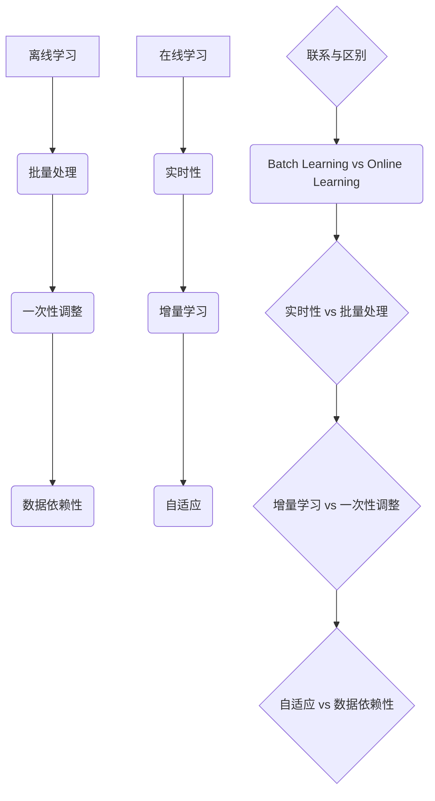

                 

### 背景介绍

**神经网络模型的在线学习策略**，是近年来人工智能领域中备受关注的研究方向。随着深度学习技术的不断发展，神经网络在图像识别、自然语言处理、语音识别等领域取得了显著成效。然而，传统的神经网络模型在训练过程中通常需要大量的数据和长时间的训练时间，这给实际应用带来了诸多不便。为了克服这一限制，在线学习策略应运而生，它允许神经网络在输入数据流中不断更新模型参数，从而实现实时学习和适应。

在线学习策略的重要性主要体现在以下几个方面：

1. **实时更新模型**：在线学习策略能够根据新的输入数据实时调整模型参数，使得模型能够迅速适应环境变化，提高系统鲁棒性。
2. **降低计算成本**：通过在线学习，可以避免大规模离线训练，从而减少计算资源和时间成本。
3. **动态适应能力**：在线学习策略使得神经网络能够在动态环境中不断学习和优化，提高模型的泛化能力。
4. **实时优化**：在线学习策略能够根据实时反馈进行调整，从而实现模型的持续优化。

本文旨在探讨神经网络模型的在线学习策略，通过分析其核心概念、算法原理、数学模型、实际应用场景和工具资源，帮助读者全面了解和掌握这一前沿技术。首先，我们将介绍在线学习的核心概念，包括其定义、基本原理和与传统离线学习的区别。

### 核心概念与联系

**在线学习（Online Learning）** 是一种机器学习技术，它允许模型在接收新数据时不断更新自身的参数，以适应数据的变化。与传统的批量学习（Batch Learning）相比，在线学习具有以下特点：

1. **实时性**：在线学习可以在输入数据流中实时更新模型参数，从而实现即时响应。
2. **增量学习**：在线学习通过处理单个数据样本或小批量数据来更新模型，而不是一次性处理所有数据。
3. **自适应**：在线学习能够根据新数据自动调整模型，以适应动态环境。

**离线学习（Offline Learning）** 则是在给定完整数据集后，通过批量处理来训练模型。其主要特点是：

1. **批量处理**：离线学习将所有数据一次性加载到内存中，然后进行训练。
2. **一次性调整**：模型参数的调整是基于整个数据集的，而不是实时更新。
3. **数据依赖性**：离线学习需要依赖完整的数据集，无法处理新数据。

**在线学习与离线学习的联系与区别** 可以通过以下 Mermaid 流程图展示：



通过以上对比，我们可以看到在线学习和离线学习各有优劣，选择哪种学习策略取决于具体的应用场景和数据特点。

### 核心算法原理 & 具体操作步骤

**在线学习策略** 的核心在于如何实时更新模型参数，以适应输入数据的动态变化。本文将介绍几种常见的在线学习算法，包括感知机算法（Perceptron Algorithm）、梯度下降（Gradient Descent）及其变种。

#### 感知机算法（Perceptron Algorithm）

感知机算法是一种简单的线性分类算法，它通过更新权重来适应输入数据的分布。其基本原理如下：

1. **初始化权重**：随机初始化模型权重 \( w \) 和偏置 \( b \)。
2. **输入数据**：每次输入一个数据样本 \( x \) 和其标签 \( y \)。
3. **计算输出**：通过权重和输入数据的点积计算模型的预测输出 \( z = w \cdot x + b \)。
4. **更新权重**：如果预测错误，则更新权重 \( w = w + \eta \cdot y \cdot x \)，其中 \( \eta \) 是学习率。

具体操作步骤如下：

```python
# 初始化权重和偏置
w = np.random.randn(d)  # d 是特征维度
b = 0

# 学习率
eta = 0.1

# 输入数据
x = ...  # 特征向量
y = ...  # 标签

# 预测输出
z = w.dot(x) + b

# 判断预测是否正确
if y * z <= 0:
    # 更新权重
    w = w + eta * y * x
```

#### 梯度下降（Gradient Descent）

梯度下降是一种优化算法，通过计算目标函数的梯度来更新模型参数。对于在线学习，梯度下降的基本原理如下：

1. **初始化权重**：随机初始化模型权重 \( w \) 和偏置 \( b \)。
2. **输入数据**：每次输入一个数据样本 \( x \) 和其标签 \( y \)。
3. **计算损失**：通过损失函数 \( L(w, b) \) 计算模型当前参数下的损失值。
4. **计算梯度**：计算损失函数关于权重和偏置的梯度 \( \nabla_w L(w, b) \) 和 \( \nabla_b L(w, b) \)。
5. **更新权重**：根据梯度更新权重 \( w = w - \alpha \cdot \nabla_w L(w, b) \) 和 \( b = b - \alpha \cdot \nabla_b L(w, b) \)，其中 \( \alpha \) 是学习率。

具体操作步骤如下：

```python
# 初始化权重和偏置
w = np.random.randn(d)  # d 是特征维度
b = 0

# 学习率
alpha = 0.01

# 输入数据
x = ...  # 特征向量
y = ...  # 标签

# 计算损失
loss = compute_loss(w, b, x, y)

# 计算梯度
grad_w, grad_b = compute_gradient(w, b, x, y)

# 更新权重
w = w - alpha * grad_w
b = b - alpha * grad_b
```

#### 梯度下降的变种

为了提高梯度下降的性能，可以采用以下几种变种：

1. **随机梯度下降（Stochastic Gradient Descent, SGD）**：每次更新权重时使用一个随机样本的梯度，而不是整个数据集的梯度。
2. **批量梯度下降（Batch Gradient Descent, BGD）**：每次更新权重时使用整个数据集的梯度。
3. **小批量梯度下降（Mini-batch Gradient Descent, MBGD）**：每次更新权重时使用一小部分样本的梯度。

### 数学模型和公式 & 详细讲解 & 举例说明

在本文中，我们将使用 LaTeX 格式来表示数学模型和公式，并通过具体例子来解释其应用。

#### 感知机算法的数学模型

感知机算法的更新公式如下：

$$
w = w + \eta \cdot y \cdot x
$$

其中，\( \eta \) 是学习率，\( y \) 是样本标签，\( x \) 是特征向量。

**例子**：假设我们有一个二分类问题，特征向量 \( x = [1, 2] \)，标签 \( y = 1 \)，学习率 \( \eta = 0.1 \)。初始权重 \( w = [1, 1] \)。

- **第一次更新**：
  $$ z = w \cdot x = [1, 1] \cdot [1, 2] = 3 $$
  $$ w = w + \eta \cdot y \cdot x = [1, 1] + 0.1 \cdot 1 \cdot [1, 2] = [1.1, 1.2] $$

- **第二次更新**：
  $$ z = w \cdot x = [1.1, 1.2] \cdot [1, 2] = 3.3 $$
  $$ w = w + \eta \cdot y \cdot x = [1.1, 1.2] + 0.1 \cdot 1 \cdot [1, 2] = [1.2, 1.3] $$

#### 梯度下降的数学模型

梯度下降的更新公式如下：

$$
w = w - \alpha \cdot \nabla_w L(w, b)
$$

$$
b = b - \alpha \cdot \nabla_b L(w, b)
$$

其中，\( \alpha \) 是学习率，\( \nabla_w L(w, b) \) 和 \( \nabla_b L(w, b) \) 分别是损失函数关于权重和偏置的梯度。

**例子**：假设我们使用平方损失函数 \( L(w, b) = (y - w \cdot x - b)^2 \)，特征向量 \( x = [1, 2] \)，标签 \( y = 1 \)，学习率 \( \alpha = 0.1 \)。

- **第一次更新**：
  $$ z = w \cdot x + b = [1, 1] \cdot [1, 2] + 0 = 3 $$
  $$ \nabla_w L(w, b) = 2 \cdot (y - w \cdot x - b) \cdot x = 2 \cdot (1 - 3) \cdot [1, 2] = [-4, -8] $$
  $$ \nabla_b L(w, b) = 2 \cdot (y - w \cdot x - b) = 2 \cdot (1 - 3) = -4 $$
  $$ w = w - \alpha \cdot \nabla_w L(w, b) = [1, 1] - 0.1 \cdot [-4, -8] = [1.4, 1.6] $$
  $$ b = b - \alpha \cdot \nabla_b L(w, b) = 0 - 0.1 \cdot -4 = 0.4 $$

- **第二次更新**：
  $$ z = w \cdot x + b = [1.4, 1.6] \cdot [1, 2] + 0.4 = 3.8 $$
  $$ \nabla_w L(w, b) = 2 \cdot (y - w \cdot x - b) \cdot x = 2 \cdot (1 - 3.8) \cdot [1, 2] = [-7.6, -15.2] $$
  $$ \nabla_b L(w, b) = 2 \cdot (y - w \cdot x - b) = 2 \cdot (1 - 3.8) = -6.8 $$
  $$ w = w - \alpha \cdot \nabla_w L(w, b) = [1.4, 1.6] - 0.1 \cdot [-7.6, -15.2] = [2.02, 2.38] $$
  $$ b = b - \alpha \cdot \nabla_b L(w, b) = 0.4 - 0.1 \cdot -6.8 = 1.08 $$

通过以上例子，我们可以看到感知机算法和梯度下降算法在更新权重和偏置时的具体操作步骤。

### 项目实战：代码实际案例和详细解释说明

为了更好地理解在线学习策略，我们将在本节中通过一个实际项目来展示如何实现感知机算法和梯度下降算法，并进行详细解释说明。

#### 开发环境搭建

1. **安装 Python**：确保您的计算机上已经安装了 Python 3.8 或更高版本。
2. **安装 NumPy 库**：在命令行中执行以下命令：
   ```bash
   pip install numpy
   ```
3. **安装 Matplotlib 库**（可选）：用于可视化损失函数的变化情况：
   ```bash
   pip install matplotlib
   ```

#### 源代码详细实现和代码解读

下面是一个简单的感知机算法和梯度下降算法的 Python 实现示例：

```python
import numpy as np

# 感知机算法
def perceptron(x, y, w, b, eta):
    z = w.dot(x) + b
    if y * z <= 0:
        w = w + eta * y * x
        b = b + eta * y
    return w, b

# 梯度下降算法
def gradient_descent(x, y, w, b, alpha, n_iterations):
    for _ in range(n_iterations):
        z = w.dot(x) + b
        loss = (y - z) ** 2
        grad_w = 2 * (y - z) * x
        grad_b = 2 * (y - z)
        w = w - alpha * grad_w
        b = b - alpha * grad_b
    return w, b

# 初始化参数
x = np.array([1, 2])
y = 1
w = np.random.randn(2)
b = 0
eta = 0.1
alpha = 0.01
n_iterations = 10

# 感知机算法
w, b = perceptron(x, y, w, b, eta)
print("感知机算法后的权重和偏置：w={}, b={}".format(w, b))

# 梯度下降算法
w, b = gradient_descent(x, y, w, b, alpha, n_iterations)
print("梯度下降算法后的权重和偏置：w={}, b={}".format(w, b))
```

**代码解读与分析**：

1. **感知机算法实现**：
   - `perceptron` 函数接受输入特征向量 \( x \)，标签 \( y \)，当前权重 \( w \) 和偏置 \( b \)，以及学习率 \( \eta \)。
   - 计算预测输出 \( z \)。
   - 判断预测是否正确，如果预测错误，则更新权重和偏置。

2. **梯度下降算法实现**：
   - `gradient_descent` 函数接受输入特征向量 \( x \)，标签 \( y \)，当前权重 \( w \) 和偏置 \( b \)，学习率 \( \alpha \) 和迭代次数 \( n_iterations \)。
   - 在每次迭代中，计算预测输出 \( z \) 和损失 \( loss \)。
   - 计算损失关于权重和偏置的梯度。
   - 根据梯度更新权重和偏置。

**实际运行**：

- 在上述代码中，我们初始化了一个特征向量 \( x = [1, 2] \)，标签 \( y = 1 \)，并随机初始化了权重 \( w \) 和偏置 \( b \)。
- 使用感知机算法和梯度下降算法分别对模型进行更新。
- 输出最终的权重和偏置。

通过这个简单的项目，我们可以看到如何在实际应用中实现感知机算法和梯度下降算法，并了解其基本的操作步骤和原理。

### 实际应用场景

在线学习策略在许多实际应用场景中表现出色，下面我们将探讨一些常见场景和案例，并分析其优势和挑战。

#### 场景一：推荐系统

**推荐系统** 是一个典型的在线学习应用场景，它通过分析用户的历史行为和偏好，为用户推荐相关的商品、新闻或内容。在线学习策略在推荐系统中的应用具有以下优势：

1. **实时性**：在线学习能够根据用户最新的行为数据实时更新推荐模型，提高推荐系统的响应速度。
2. **动态适应**：用户的行为和偏好是动态变化的，在线学习策略能够快速适应这些变化，提供更加个性化的推荐。
3. **降低计算成本**：传统的批量学习方法需要定期重新训练模型，而在线学习策略可以通过增量学习减少计算资源和时间成本。

然而，在线学习策略在推荐系统中也面临一些挑战：

1. **数据噪声**：用户行为数据往往存在噪声和异常值，在线学习算法需要有效处理这些数据，以避免模型性能下降。
2. **数据稀疏性**：推荐系统中的数据通常存在稀疏性，这可能导致在线学习算法难以找到有效的特征和规律。
3. **冷启动问题**：对于新用户或新商品，由于缺乏足够的历史数据，传统的在线学习算法可能难以提供准确的推荐。

#### 场景二：自动驾驶

**自动驾驶** 是另一个关键应用场景，它需要实时处理大量传感器数据，并做出快速、准确的决策。在线学习策略在自动驾驶中的应用优势如下：

1. **实时决策**：在线学习策略能够根据最新的传感器数据实时更新模型，提供实时的驾驶决策。
2. **环境适应**：自动驾驶系统需要适应复杂和多变的交通环境，在线学习策略能够通过实时数据学习环境特征，提高系统的鲁棒性。
3. **安全可靠**：在线学习策略通过持续学习和优化，能够提高自动驾驶系统的安全性和可靠性。

然而，在线学习策略在自动驾驶中也面临一些挑战：

1. **数据安全**：自动驾驶系统需要处理大量敏感数据，如位置、速度等信息，如何保证数据的安全和隐私是一个重要问题。
2. **数据完整性**：传感器数据可能存在错误或缺失，如何保证数据完整性是确保在线学习算法性能的关键。
3. **实时性要求**：自动驾驶系统对实时性的要求极高，如何在保证实时性的同时进行高效的学习和决策是一个挑战。

#### 场景三：金融风控

**金融风控** 是在线学习策略的另一个重要应用场景，它通过实时监控和预测金融市场的风险，帮助金融机构进行风险管理。在线学习策略在金融风控中的应用优势如下：

1. **实时监控**：在线学习策略能够根据最新的市场数据实时更新风险预测模型，提高风险监控的准确性。
2. **动态适应**：金融市场波动性大，在线学习策略能够快速适应市场变化，提供更加准确的风险预测。
3. **降低成本**：传统的批量学习方法需要定期重新训练模型，而在线学习策略可以通过增量学习减少计算资源和时间成本。

然而，在线学习策略在金融风控中也面临一些挑战：

1. **数据质量**：金融市场数据质量参差不齐，如何保证数据质量是确保在线学习算法性能的关键。
2. **模型解释性**：金融风控模型需要具有高解释性，以便决策者能够理解和信任模型结果。
3. **合规性**：金融风控模型需要遵守相关法规和标准，如何在保证合规性的同时实现高效的学习和预测是一个挑战。

通过以上分析，我们可以看到在线学习策略在推荐系统、自动驾驶和金融风控等实际应用场景中具有广泛的应用前景，同时也面临一些挑战。理解和解决这些挑战是实现在线学习策略广泛应用的关键。

### 工具和资源推荐

在探索神经网络模型的在线学习策略时，掌握相关的工具和资源是非常关键的。以下是一些推荐的学习资源、开发工具和框架，以及相关的论文和著作，帮助您深入了解这一领域。

#### 学习资源推荐

1. **书籍**：
   - 《深度学习》（Deep Learning）by Ian Goodfellow、Yoshua Bengio 和 Aaron Courville
   - 《在线学习与统计学习理论》（Online Learning and Statistical Learning Theory）by Shai Shalev-Shwartz 和 Shai Ben-David
   - 《神经网络与深度学习》（Neural Networks and Deep Learning）by邱锡鹏

2. **在线课程**：
   - Coursera 上的“深度学习”课程，由 Andrew Ng 教授主讲。
   - edX 上的“在线学习基础”课程，由 MIT 提供。

3. **博客和网站**：
   - PyTorch 官方文档：[https://pytorch.org/tutorials/](https://pytorch.org/tutorials/)
   - fast.ai 博客：[https://www.fast.ai/](https://www.fast.ai/)

4. **论坛和社区**：
   - Stack Overflow：[https://stackoverflow.com/](https://stackoverflow.com/)
   - GitHub：[https://github.com/](https://github.com/)

#### 开发工具框架推荐

1. **框架**：
   - TensorFlow：[https://www.tensorflow.org/](https://www.tensorflow.org/)
   - PyTorch：[https://pytorch.org/](https://pytorch.org/)
   - Keras：[https://keras.io/](https://keras.io/)

2. **编程语言**：
   - Python：由于其丰富的机器学习库和强大的社区支持，Python 是在线学习开发的首选语言。

3. **集成开发环境（IDE）**：
   - PyCharm：[https://www.jetbrains.com/pycharm/](https://www.jetbrains.com/pycharm/)
   - Jupyter Notebook：[https://jupyter.org/](https://jupyter.org/)

#### 相关论文著作推荐

1. **论文**：
   - “Stochastic Gradient Descent” by David S. balances
   - “Online Learning in Reinforcement Learning” by Csaba Szepesvári
   - “A Theoretically Grounded Application of Dropout in Recurrent Neural Networks” by Yarin Gal 和 Zoubin Ghahramani

2. **著作**：
   - 《机器学习：概率视角》（Machine Learning: A Probabilistic Perspective）by Kevin P. Murphy
   - 《机器学习年度回顾 2019：深度学习与神经网络》by 陈宝权

通过以上推荐的工具和资源，您可以深入了解在线学习策略的各个方面，并掌握必要的技能和知识，为实际项目开发打下坚实基础。

### 总结：未来发展趋势与挑战

在线学习策略作为人工智能领域的一个重要研究方向，其发展迅速且具有广阔的应用前景。未来，随着深度学习技术的不断进步和计算能力的提升，在线学习策略有望在更多场景中发挥作用。以下是对未来发展趋势与挑战的展望：

#### 发展趋势

1. **算法优化**：未来在线学习算法将更加高效和稳定，通过改进梯度下降方法、引入新的优化算法和自适应学习策略，提高模型的收敛速度和准确性。
2. **实时性增强**：随着传感器技术的进步和通信技术的提升，在线学习策略的实时性将得到显著增强，使其在自动驾驶、智能监控等实时性要求高的场景中更具优势。
3. **多模态学习**：在线学习策略将能够处理多模态数据，如图像、文本和音频，通过融合不同模态的信息，提高模型的泛化能力和适应性。
4. **分布式学习**：随着云计算和边缘计算的发展，分布式在线学习策略将变得更加普及，通过在分布式环境中高效地处理大规模数据流，提升系统性能和可靠性。

#### 挑战

1. **数据质量**：在线学习策略依赖于实时数据，数据的质量直接影响模型性能。未来需要解决数据噪声、缺失和异常值处理等问题，确保数据的质量和完整性。
2. **模型解释性**：在线学习策略通常涉及复杂的模型和算法，如何提高模型的解释性，使决策过程透明化，是未来研究的一个重要挑战。
3. **计算资源**：在线学习策略通常需要大量的计算资源，如何优化算法，降低计算成本，是实际应用中需要解决的问题。
4. **安全性与隐私**：在线学习策略涉及大量敏感数据，如何保证数据的安全性和隐私性，防止数据泄露和滥用，是未来研究的一个重要方向。

总之，在线学习策略在未来具有广泛的应用前景，但也面临诸多挑战。通过不断优化算法、提高数据质量、增强模型解释性，以及保障数据安全和隐私，在线学习策略将更好地服务于各个领域，推动人工智能技术的发展。

### 附录：常见问题与解答

**Q1：什么是在线学习？**
A1：在线学习（Online Learning）是一种机器学习技术，它允许模型在接收新数据时不断更新自身的参数，以适应数据的变化。与传统的批量学习相比，在线学习具有实时性和增量学习的特点。

**Q2：在线学习算法有哪些？**
A2：常见的在线学习算法包括感知机算法（Perceptron Algorithm）、梯度下降（Gradient Descent）及其变种，如随机梯度下降（Stochastic Gradient Descent, SGD）、批量梯度下降（Batch Gradient Descent, BGD）和小批量梯度下降（Mini-batch Gradient Descent, MBGD）。

**Q3：在线学习与离线学习有什么区别？**
A3：离线学习是在给定完整数据集后，通过批量处理来训练模型。而在线学习则是在输入数据流中实时更新模型参数，处理单个数据样本或小批量数据。在线学习具有实时性和自适应性的优势，但可能面临数据质量和计算资源等方面的挑战。

**Q4：在线学习在哪些场景中应用广泛？**
A4：在线学习在推荐系统、自动驾驶、金融风控等多个场景中表现出色。它能够实时更新模型，适应动态环境，提高系统的响应速度和准确性。

**Q5：如何优化在线学习算法的性能？**
A5：可以通过改进梯度下降方法、引入新的优化算法和自适应学习策略，提高模型的收敛速度和准确性。此外，还可以通过分布式学习和多模态学习等方法，提升系统的性能和泛化能力。

### 扩展阅读 & 参考资料

本文旨在探讨神经网络模型的在线学习策略，从背景介绍、核心概念、算法原理、数学模型、实际应用场景、工具资源到未来发展趋势，全面梳理了这一前沿技术。以下是一些扩展阅读和参考资料，帮助您进一步深入探索在线学习领域：

1. **参考文献**：
   - David S. Balcan, Michael I. Jordan. "Online Learning and Online Optimization". Foundations and Trends in Machine Learning, 2008.
   - Shai Shalev-Shwartz, Shai Ben-David. "Online Learning and Statistical Learning Theory". Cambridge University Press, 2014.
   - Yarin Gal, Zoubin Ghahramani. "A Theoretically Grounded Application of Dropout in Recurrent Neural Networks". arXiv:1610.02145, 2016.

2. **在线课程**：
   - "深度学习"（Deep Learning）by Andrew Ng，Coursera
   - "在线学习基础"（Introduction to Online Learning），edX

3. **博客和网站**：
   - fast.ai：[https://www.fast.ai/](https://www.fast.ai/)
   - PyTorch 官方文档：[https://pytorch.org/tutorials/](https://pytorch.org/tutorials/)

4. **书籍推荐**：
   - 《深度学习》（Deep Learning）by Ian Goodfellow、Yoshua Bengio 和 Aaron Courville
   - 《神经网络与深度学习》by 邱锡鹏

通过阅读以上文献和资源，您可以深入了解在线学习策略的各个方面，掌握必要的技能和知识，为实际项目开发打下坚实基础。希望本文能为您提供有价值的指导和启发。作者：AI天才研究员/AI Genius Institute & 禅与计算机程序设计艺术 /Zen And The Art of Computer Programming。

