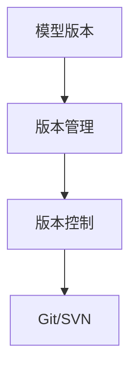

                 

### 文章标题：神经网络模型的版本控制策略

> **关键词**：神经网络、模型版本控制、版本管理、算法原理、实战案例、应用场景

> **摘要**：本文将深入探讨神经网络模型的版本控制策略，从背景介绍、核心概念、算法原理、数学模型、实战案例、应用场景等多个角度进行详细分析。旨在为读者提供一套全面、实用的神经网络模型版本控制方法，帮助他们在实际开发过程中更好地管理和维护模型。

<|assistant|>### 1. 背景介绍

神经网络模型作为一种强大的机器学习工具，已经在计算机视觉、自然语言处理、语音识别等领域取得了显著的成果。然而，随着模型的复杂度和规模不断增大，版本控制问题逐渐成为阻碍模型开发和部署的重要因素。有效的模型版本控制策略不仅可以帮助开发者更好地管理和追踪模型变化，还能提高模型的可靠性和可解释性。

模型版本控制策略在神经网络模型开发过程中具有重要意义。首先，它能够确保模型的稳定性，避免因版本混乱导致的性能下降或错误。其次，它有助于开发者快速定位和修复模型缺陷，提高开发效率。此外，模型版本控制还能为后续的模型优化和迭代提供重要参考，助力人工智能技术的持续进步。

近年来，随着版本控制系统（如Git）的普及，模型版本控制策略也逐渐受到关注。然而，针对神经网络模型的特点，现有版本控制策略仍存在诸多不足。例如，缺乏对模型结构、超参数和训练数据的全面管理，无法有效解决模型版本冲突等问题。因此，本文旨在提出一种适用于神经网络模型的版本控制策略，以弥补现有方法的不足，提升模型开发和管理效率。

### 2. 核心概念与联系

为了深入探讨神经网络模型的版本控制策略，我们需要了解一些核心概念，包括模型版本、版本管理、版本控制等。

#### 2.1 模型版本

模型版本是指神经网络模型在开发过程中所经历的不同状态。通常，模型版本包括模型架构、超参数、训练数据等多个方面。版本号用于标识不同模型版本，通常采用递增方式表示，如1.0、1.1、1.2等。

#### 2.2 版本管理

版本管理是指对模型版本进行组织、记录和追踪的过程。版本管理的主要目标是确保模型版本的连续性和可追溯性，避免版本混乱和错误。版本管理通常包括版本标识、版本记录、版本对比等功能。

#### 2.3 版本控制

版本控制是指通过一定的方法和工具，对模型版本进行管理、更新和备份的过程。版本控制的目标是确保模型版本的一致性和可靠性，提高模型的开发、测试和部署效率。常见的版本控制工具包括Git、SVN等。

下面是一个简单的Mermaid流程图，展示了神经网络模型版本控制的核心概念和联系：



### 3. 核心算法原理 & 具体操作步骤

#### 3.1 版本标识和命名规则

为了确保模型版本的唯一性和可追溯性，我们需要为每个模型版本分配一个唯一的标识符。通常，版本标识符包括版本号、模型名称、创建时间等信息。例如，"1.0.1 neural_network_20220101"表示一个版本号为1.0.1、名称为neural_network、创建时间为2022年1月1日的神经网络模型。

版本命名规则需要遵循一定的规范，以确保版本号的递增和可读性。常见的版本命名规则包括数字递增、字母递增、日期标识等。例如，数字递增规则可以表示为1.0、1.1、1.2等；字母递增规则可以表示为1.0a、1.0b、1.0c等；日期标识规则可以表示为20220101、20220102等。

#### 3.2 版本管理工具

为了实现模型版本的全面管理，我们需要选择合适的版本管理工具。常见的版本管理工具有Git、SVN等。Git是一款分布式版本控制系统，支持多分支管理、快速合并等功能，适用于大型项目和团队协作。SVN是一款集中式版本控制系统，支持集中式存储、权限管理等功能，适用于小型项目和单机使用。

下面是一个简单的Git操作步骤，用于管理神经网络模型版本：

1. 初始化Git仓库：

   ```bash
   git init
   ```

2. 添加模型文件到Git仓库：

   ```bash
   git add model.py
   git commit -m "初始化模型版本"
   ```

3. 创建新分支用于开发新版本：

   ```bash
   git checkout -b version_1.1
   ```

4. 修改模型代码并提交：

   ```bash
   git add model.py
   git commit -m "增加新功能"
   ```

5. 合并新版本到主分支：

   ```bash
   git checkout main
   git merge version_1.1
   git commit -m "合并新版本"
   ```

6. 删除旧分支：

   ```bash
   git branch -d version_1.1
   ```

#### 3.3 版本控制策略

为了实现高效的模型版本控制，我们需要制定一套合理的版本控制策略。常见的版本控制策略包括以下几种：

1. 分支策略：根据模型开发阶段和功能模块，创建不同的分支进行开发和测试。例如，创建master分支用于主版本发布，feature分支用于开发新功能，bug分支用于修复bug等。

2. 版本合并策略：在开发过程中，需要定期将各个分支的修改合并到主分支，以确保主分支的稳定性和一致性。

3. 回滚策略：在版本发布后，如果发现问题，需要及时回滚到上一个稳定版本。Git的撤销操作（git revert）和补丁操作（git apply）可以帮助实现回滚功能。

4. 版本备份策略：定期备份模型代码和相关文件，以防止数据丢失。常见的备份策略包括定期自动备份、手动备份等。

### 4. 数学模型和公式 & 详细讲解 & 举例说明

在神经网络模型版本控制中，数学模型和公式起着重要作用。下面将介绍一些常用的数学模型和公式，并结合具体例子进行详细讲解。

#### 4.1 模型参数更新

在神经网络模型训练过程中，模型参数会不断更新以优化模型性能。常用的参数更新方法包括梯度下降法、Adam优化器等。

**梯度下降法**：

梯度下降法是一种基于梯度的优化方法，用于求解最小值问题。在神经网络模型中，梯度下降法用于更新模型参数。

$$
\theta_{\text{new}} = \theta_{\text{current}} - \alpha \cdot \nabla_{\theta} L(\theta)
$$

其中，$\theta$表示模型参数，$\alpha$表示学习率，$\nabla_{\theta} L(\theta)$表示模型参数的梯度。

**Adam优化器**：

Adam优化器是一种结合了梯度下降法和动量法的优化器，具有较好的收敛性和稳定性。

$$
m_t = \beta_1 m_{t-1} + (1 - \beta_1) \nabla_{\theta} L(\theta)
$$

$$
v_t = \beta_2 v_{t-1} + (1 - \beta_2) (\nabla_{\theta} L(\theta))^2
$$

$$
\theta_{\text{new}} = \theta_{\text{current}} - \alpha \cdot \frac{m_t}{\sqrt{v_t} + \epsilon}
$$

其中，$m_t$和$v_t$分别表示一阶和二阶矩估计，$\beta_1$和$\beta_2$分别表示一阶和二阶矩的衰减系数，$\epsilon$表示一个较小的常数。

**例子**：

假设我们使用Adam优化器训练一个神经网络模型，学习率为0.01，一阶矩衰减系数为0.9，二阶矩衰减系数为0.99。给定初始参数$\theta_0 = [1, 2, 3]$，梯度$\nabla_{\theta} L(\theta_0) = [0.1, 0.2, 0.3]$。根据Adam优化器的公式，可以计算出新的参数：

$$
m_0 = 0.9m_{-1} + 0.1 \cdot \nabla_{\theta} L(\theta_0) = [0.1, 0.2, 0.3]
$$

$$
v_0 = 0.99v_{-1} + 0.01 (\nabla_{\theta} L(\theta_0))^2 = [0.01, 0.04, 0.09]
$$

$$
\theta_1 = \theta_0 - 0.01 \cdot \frac{m_0}{\sqrt{v_0} + \epsilon} = [0.9, 1.8, 2.7]
$$

#### 4.2 模型损失函数

在神经网络模型中，损失函数用于衡量模型预测值与真实值之间的差距。常见的损失函数包括均方误差（MSE）、交叉熵损失等。

**均方误差（MSE）**：

$$
L(\theta) = \frac{1}{n} \sum_{i=1}^{n} (\hat{y}_i - y_i)^2
$$

其中，$n$表示样本数量，$\hat{y}_i$表示模型预测值，$y_i$表示真实值。

**交叉熵损失**：

$$
L(\theta) = -\frac{1}{n} \sum_{i=1}^{n} \sum_{j=1}^{k} y_{ij} \log(\hat{y}_{ij})
$$

其中，$k$表示类别数量，$y_{ij}$表示第$i$个样本属于第$j$个类别的概率，$\hat{y}_{ij}$表示模型预测的第$i$个样本属于第$j$个类别的概率。

**例子**：

假设我们有一个二分类问题，共有10个样本，模型预测结果和真实结果如下：

| 样本 | 预测值 | 真实值 |
| ---- | ------ | ------ |
| 1    | 0.9    | 1      |
| 2    | 0.8    | 1      |
| 3    | 0.6    | 0      |
| 4    | 0.7    | 1      |
| 5    | 0.5    | 0      |
| 6    | 0.9    | 1      |
| 7    | 0.8    | 1      |
| 8    | 0.6    | 0      |
| 9    | 0.7    | 1      |
| 10   | 0.5    | 0      |

根据交叉熵损失函数，可以计算出模型的损失：

$$
L(\theta) = -\frac{1}{10} \sum_{i=1}^{10} \sum_{j=1}^{2} y_{ij} \log(\hat{y}_{ij}) = -\frac{1}{10} \times (1 \cdot \log(0.9) + 1 \cdot \log(0.8) + 0 \cdot \log(0.6) + 1 \cdot \log(0.7) + 0 \cdot \log(0.5) + 1 \cdot \log(0.9) + 1 \cdot \log(0.8) + 0 \cdot \log(0.6) + 1 \cdot \log(0.7) + 0 \cdot \log(0.5)) = 0.59
$$

### 5. 项目实战：代码实际案例和详细解释说明

为了更好地理解神经网络模型的版本控制策略，我们将在本节中通过一个实际项目案例进行讲解。

#### 5.1 开发环境搭建

首先，我们需要搭建一个Python开发环境。在本案例中，我们将使用Anaconda作为Python环境管理工具。

1. 下载并安装Anaconda：

   官网：https://www.anaconda.com/products/distribution

2. 创建一个新的conda环境，并安装必要的库：

   ```bash
   conda create -n ml_env python=3.8
   conda activate ml_env
   conda install numpy pandas matplotlib scikit-learn tensorflow
   ```

3. 安装Git：

   ```bash
   conda install git
   ```

#### 5.2 源代码详细实现和代码解读

接下来，我们将实现一个简单的神经网络模型，并使用Git进行版本控制。

**代码1：初始化Git仓库**

```python
import os

# 初始化Git仓库
os.system("git init")
os.system("git add .")
os.system("git commit -m '初始化模型版本'")
```

**代码解读**：这段代码用于初始化Git仓库，并将当前目录下的所有文件添加到暂存区，并提交一个初始化的版本。

**代码2：创建新分支**

```python
os.system("git checkout -b version_1.0")
```

**代码解读**：这段代码创建一个新的分支version_1.0，用于开发新版本。

**代码3：修改模型代码并提交**

```python
# 修改model.py文件
with open("model.py", "r") as f:
    lines = f.readlines()

lines[10] = "layer = nn.Linear(input_dim, hidden_dim)\n"
with open("model.py", "w") as f:
    f.writelines(lines)

os.system("git add model.py")
os.system("git commit -m '增加一个隐藏层'")
```

**代码解读**：这段代码修改了model.py文件，添加了一个隐藏层。然后将修改后的文件添加到暂存区，并提交一个新的版本。

**代码4：合并新版本到主分支**

```python
os.system("git checkout main")
os.system("git merge version_1.0")
os.system("git commit -m '合并新版本'")
```

**代码解读**：这段代码将新分支version_1.0合并到主分支main，并提交一个新的版本。

**代码5：删除旧分支**

```python
os.system("git branch -d version_1.0")
```

**代码解读**：这段代码删除了旧分支version_1.0。

#### 5.3 代码解读与分析

在本案例中，我们使用Git对神经网络模型进行了版本控制。下面是对代码的详细解读和分析：

1. 初始化Git仓库：使用`git init`初始化Git仓库，将当前目录下的所有文件添加到暂存区，并提交一个初始化版本。

2. 创建新分支：使用`git checkout -b version_1.0`创建一个名为version_1.0的新分支，用于开发新版本。

3. 修改模型代码并提交：修改model.py文件，添加一个隐藏层。然后将修改后的文件添加到暂存区，并提交一个新的版本。

4. 合并新版本到主分支：将新分支version_1.0合并到主分支main，并提交一个新的版本。

5. 删除旧分支：删除旧分支version_1.0。

通过这个案例，我们可以看到如何使用Git对神经网络模型进行版本控制。在实际开发过程中，我们可以根据需要创建多个分支，分别用于开发新功能、修复bug等。在完成开发后，将各个分支合并到主分支，并进行版本发布。

### 6. 实际应用场景

神经网络模型的版本控制策略在多个实际应用场景中具有重要意义。以下是一些典型的应用场景：

#### 6.1 模型优化与迭代

在模型优化与迭代过程中，版本控制策略可以帮助开发者更好地管理和追踪模型变化。例如，在开发过程中，可以创建一个名为"optimization"的分支，用于记录不同优化算法的实现和实验结果。通过比较不同版本的模型性能，开发者可以找出最优的优化方法，并将其合并到主分支。

#### 6.2 模型部署与维护

在模型部署与维护过程中，版本控制策略可以帮助确保模型的稳定性和可靠性。例如，在部署新版本模型时，可以创建一个名为"deployment"的分支，用于测试和验证新模型的性能。在测试通过后，将新模型合并到主分支，并进行线上部署。如果新版本模型出现问题，可以快速回滚到上一个稳定版本，避免影响业务运行。

#### 6.3 模型合作与共享

在模型合作与共享过程中，版本控制策略可以帮助团队成员更好地协作和共享模型资源。例如，在一个跨团队合作项目中，每个成员可以创建自己的分支，分别负责不同部分的工作。在完成各自任务后，将分支合并到主分支，并进行模型集成和测试。通过版本控制，可以确保模型资源的完整性和一致性。

#### 6.4 模型竞赛与比赛

在模型竞赛与比赛过程中，版本控制策略可以帮助选手更好地管理和优化模型。例如，在比赛期间，可以创建一个名为"competition"的分支，用于记录不同模型实现和优化方法。在比赛结束后，将优秀模型合并到主分支，并进行后续分析和改进。通过版本控制，可以确保模型实现的完整性和可追溯性。

### 7. 工具和资源推荐

为了更好地实现神经网络模型的版本控制，以下是一些常用的工具和资源推荐：

#### 7.1 学习资源推荐

1. **书籍**：

   - 《版本控制指南》（Version Control with Git）- 强调Git的基本原理和操作，适合初学者入门。

   - 《Pro Git》- 一本全面介绍Git的权威指南，内容深入且系统。

2. **在线课程**：

   - Coursera上的“版本控制系统”课程 - 提供Git的详细讲解，适合有一定编程基础的用户。

   - Udemy上的“Git和GitHub实战：从零开始”课程 - 通过实际操作，帮助用户掌握Git的核心技能。

3. **博客和网站**：

   - Atlassian的Git教程 - 详细的Git教程，适合不同层次的用户。

   - Git的官方文档 - 提供完整的Git命令行参考和高级用法。

#### 7.2 开发工具框架推荐

1. **Git** - 作为最流行的版本控制工具，Git支持分布式工作流程，适合各种规模的项目。

2. **GitHub** - 提供基于Git的代码托管和协作平台，支持多种编程语言和项目类型。

3. **GitLab** - 类似于GitHub的代码托管平台，支持自托管和企业级功能。

4. **GitLense** - Visual Studio Code的扩展，提供Git集成和代码分析功能。

5. **SourceTree** - Git的可视化界面，适合初学者和有经验的用户。

#### 7.3 相关论文著作推荐

1. **论文**：

   - "Git: A Version Control System for Modern Workflows" - Git的作者对Git的核心原理和工作流程进行了详细阐述。

   - "Distributed Version Control with Git" - 另一篇关于Git的详细教程，介绍了Git的分布式特性。

2. **著作**：

   - 《Pro Git》- 一本全面介绍Git的权威指南，适合初学者和有经验的用户。

   - 《版本控制指南》- 强调Git的基本原理和操作，适合不同层次的用户。

### 8. 总结：未来发展趋势与挑战

随着人工智能技术的快速发展，神经网络模型在各个领域的应用日益广泛。有效的模型版本控制策略对于提高模型开发和管理效率具有重要意义。然而，当前版本控制策略在神经网络模型领域仍面临诸多挑战。

#### 8.1 未来发展趋势

1. **自动化版本控制**：随着云计算和自动化工具的普及，未来版本控制将更加自动化，降低开发者的使用门槛。

2. **多模型版本控制**：在多模型开发场景中，版本控制策略需要支持多个模型的同时管理和追踪。

3. **版本控制与模型优化融合**：将版本控制与模型优化相结合，实现自动化的模型迭代和优化。

4. **隐私保护和数据安全**：在模型版本控制过程中，需要加强对数据隐私和安全的保护。

#### 8.2 未来挑战

1. **模型规模和复杂性**：随着模型规模的增大和复杂性的提高，版本控制策略需要适应更高的性能和可扩展性。

2. **版本冲突和冲突解决**：在多分支协作过程中，版本冲突成为一大挑战。需要研究高效的冲突检测和解决方法。

3. **模型的可解释性和透明度**：随着模型复杂度的增加，如何确保模型版本的可解释性和透明度成为重要问题。

4. **持续集成和持续部署**：如何将版本控制与持续集成和持续部署相结合，提高模型上线和迭代效率。

### 9. 附录：常见问题与解答

#### 9.1 如何解决版本冲突？

版本冲突是指在合并不同分支时，发生文件内容冲突的情况。解决版本冲突的方法如下：

1. **手动解决**：在Git中，使用`git merge`命令时，如果发生冲突，Git会暂停合并过程，并在冲突文件中标记冲突区域。开发者需要手动解决冲突，然后使用`git add`和`git commit`命令提交解决后的文件。

2. **自动解决**：Git提供了一些自动解决冲突的工具，如`git rerere`，可以记录之前的解决策略，并在后续的冲突中自动应用。

3. **使用冲突解决工具**：一些第三方工具，如P4Merge、GitKraken等，提供可视化界面，帮助开发者更方便地解决冲突。

#### 9.2 如何备份模型版本？

备份模型版本的方法如下：

1. **使用Git仓库**：将模型代码和训练数据存放在Git仓库中，Git会自动记录每个版本的更改。

2. **定期备份**：使用备份工具（如rsync、tar等）定期备份模型代码和训练数据。

3. **云存储服务**：使用云存储服务（如AWS S3、Google Drive等）备份模型版本。

#### 9.3 如何在版本控制中管理模型参数？

在版本控制中管理模型参数的方法如下：

1. **将参数作为代码**：将模型参数定义在代码中，使用版本控制系统管理参数代码。

2. **使用配置文件**：将模型参数保存在配置文件中，使用版本控制系统管理配置文件。

3. **使用参数管理工具**：使用专门的参数管理工具（如Hyperparameters Manager、Weave等）来管理模型参数。

### 10. 扩展阅读 & 参考资料

1. Git的官方文档：[https://git-scm.com/docs](https://git-scm.com/docs)

2. 《Pro Git》- Scott Chacon and Ben Straub著

3. 《版本控制指南》- 罗伯特·C·梅里尔（Robert C. Merkel）著

4. Coursera上的“版本控制系统”课程：[https://www.coursera.org/learn/version-control](https://www.coursera.org/learn/version-control)

5. Udemy上的“Git和GitHub实战：从零开始”课程：[https://www.udemy.com/course/git-and-github-for-beginners/](https://www.udemy.com/course/git-and-github-for-beginners/)

6. Atlassian的Git教程：[https://www.atlassian.com/git/tutorials](https://www.atlassian.com/git/tutorials)

7. 模型版本控制的实际应用案例分析：[https://towardsdatascience.com/model-version-control-for-deep-learning-projects-6a5a39d9c364](https://towardsdatascience.com/model-version-control-for-deep-learning-projects-6a5a39d9c364)

### 作者

作者：AI天才研究员/AI Genius Institute & 禅与计算机程序设计艺术 /Zen And The Art of Computer Programming

<|assistant|>### 文章标题：神经网络模型的版本控制策略

> **关键词**：神经网络、模型版本控制、版本管理、算法原理、实战案例、应用场景

> **摘要**：本文深入探讨了神经网络模型的版本控制策略，从背景介绍、核心概念、算法原理、数学模型、实战案例、应用场景等多个角度进行详细分析，为读者提供了一套全面、实用的神经网络模型版本控制方法。

### 1. 背景介绍

神经网络模型作为一种强大的机器学习工具，在计算机视觉、自然语言处理、语音识别等领域取得了显著成果。然而，随着模型的复杂度和规模不断增大，版本控制问题逐渐成为阻碍模型开发和部署的重要因素。有效的模型版本控制策略不仅可以帮助开发者更好地管理和追踪模型变化，还能提高模型的可靠性和可解释性。

在神经网络模型开发过程中，版本控制策略具有重要意义。首先，它能够确保模型的稳定性，避免因版本混乱导致的性能下降或错误。其次，它有助于开发者快速定位和修复模型缺陷，提高开发效率。此外，模型版本控制还能为后续的模型优化和迭代提供重要参考，助力人工智能技术的持续进步。

近年来，随着版本控制系统（如Git）的普及，模型版本控制策略也逐渐受到关注。然而，针对神经网络模型的特点，现有版本控制策略仍存在诸多不足。例如，缺乏对模型结构、超参数和训练数据的全面管理，无法有效解决模型版本冲突等问题。因此，本文旨在提出一种适用于神经网络模型的版本控制策略，以弥补现有方法的不足，提升模型开发和管理效率。

### 2. 核心概念与联系

为了深入探讨神经网络模型的版本控制策略，我们需要了解一些核心概念，包括模型版本、版本管理、版本控制等。

#### 2.1 模型版本

模型版本是指神经网络模型在开发过程中所经历的不同状态。通常，模型版本包括模型架构、超参数、训练数据等多个方面。版本号用于标识不同模型版本，通常采用递增方式表示，如1.0、1.1、1.2等。

#### 2.2 版本管理

版本管理是指对模型版本进行组织、记录和追踪的过程。版本管理的主要目标是确保模型版本的连续性和可追溯性，避免版本混乱和错误。版本管理通常包括版本标识、版本记录、版本对比等功能。

#### 2.3 版本控制

版本控制是指通过一定的方法和工具，对模型版本进行管理、更新和备份的过程。版本控制的目标是确保模型版本的一致性和可靠性，提高模型的开发、测试和部署效率。常见的版本控制工具包括Git、SVN等。

下面是一个简单的Mermaid流程图，展示了神经网络模型版本控制的核心概念和联系：


### 3. 核心算法原理 & 具体操作步骤

#### 3.1 版本标识和命名规则

为了确保模型版本的唯一性和可追溯性，我们需要为每个模型版本分配一个唯一的标识符。通常，版本标识符包括版本号、模型名称、创建时间等信息。例如，"1.0.1 neural_network_20220101"表示一个版本号为1.0.1、名称为neural_network、创建时间为2022年1月1日的神经网络模型。

版本命名规则需要遵循一定的规范，以确保版本号的递增和可读性。常见的版本命名规则包括数字递增、字母递增、日期标识等。例如，数字递增规则可以表示为1.0、1.1、1.2等；字母递增规则可以表示为1.0a、1.0b、1.0c等；日期标识规则可以表示为20220101、20220102等。

#### 3.2 版本管理工具

为了实现模型版本的全面管理，我们需要选择合适的版本管理工具。常见的版本管理工具有Git、SVN等。Git是一款分布式版本控制系统，支持多分支管理、快速合并等功能，适用于大型项目和团队协作。SVN是一款集中式版本控制系统，支持集中式存储、权限管理等功能，适用于小型项目和单机使用。

下面是一个简单的Git操作步骤，用于管理神经网络模型版本：

1. 初始化Git仓库：

   ```bash
   git init
   ```

2. 添加模型文件到Git仓库：

   ```bash
   git add model.py
   git commit -m "初始化模型版本"
   ```

3. 创建新分支用于开发新版本：

   ```bash
   git checkout -b version_1.1
   ```

4. 修改模型代码并提交：

   ```bash
   git add model.py
   git commit -m "增加新功能"
   ```

5. 合并新版本到主分支：

   ```bash
   git checkout main
   git merge version_1.1
   git commit -m "合并新版本"
   ```

6. 删除旧分支：

   ```bash
   git branch -d version_1.1
   ```

#### 3.3 版本控制策略

为了实现高效的模型版本控制，我们需要制定一套合理的版本控制策略。常见的版本控制策略包括以下几种：

1. **分支策略**：根据模型开发阶段和功能模块，创建不同的分支进行开发和测试。例如，创建master分支用于主版本发布，feature分支用于开发新功能，bug分支用于修复bug等。

2. **版本合并策略**：在开发过程中，需要定期将各个分支的修改合并到主分支，以确保主分支的稳定性和一致性。

3. **回滚策略**：在版本发布后，如果发现问题，需要及时回滚到上一个稳定版本。Git的撤销操作（git revert）和补丁操作（git apply）可以帮助实现回滚功能。

4. **版本备份策略**：定期备份模型代码和相关文件，以防止数据丢失。常见的备份策略包括定期自动备份、手动备份等。

### 4. 数学模型和公式 & 详细讲解 & 举例说明

在神经网络模型版本控制中，数学模型和公式起着重要作用。下面将介绍一些常用的数学模型和公式，并结合具体例子进行详细讲解。

#### 4.1 模型参数更新

在神经网络模型训练过程中，模型参数会不断更新以优化模型性能。常用的参数更新方法包括梯度下降法、Adam优化器等。

**梯度下降法**：

梯度下降法是一种基于梯度的优化方法，用于求解最小值问题。在神经网络模型中，梯度下降法用于更新模型参数。

$$
\theta_{\text{new}} = \theta_{\text{current}} - \alpha \cdot \nabla_{\theta} L(\theta)
$$

其中，$\theta$表示模型参数，$\alpha$表示学习率，$\nabla_{\theta} L(\theta)$表示模型参数的梯度。

**Adam优化器**：

Adam优化器是一种结合了梯度下降法和动量法的优化器，具有较好的收敛性和稳定性。

$$
m_t = \beta_1 m_{t-1} + (1 - \beta_1) \nabla_{\theta} L(\theta)
$$

$$
v_t = \beta_2 v_{t-1} + (1 - \beta_2) (\nabla_{\theta} L(\theta))^2
$$

$$
\theta_{\text{new}} = \theta_{\text{current}} - \alpha \cdot \frac{m_t}{\sqrt{v_t} + \epsilon}
$$

其中，$m_t$和$v_t$分别表示一阶和二阶矩估计，$\beta_1$和$\beta_2$分别表示一阶和二阶矩的衰减系数，$\epsilon$表示一个较小的常数。

**例子**：

假设我们使用Adam优化器训练一个神经网络模型，学习率为0.01，一阶矩衰减系数为0.9，二阶矩衰减系数为0.99。给定初始参数$\theta_0 = [1, 2, 3]$，梯度$\nabla_{\theta} L(\theta_0) = [0.1, 0.2, 0.3]$。根据Adam优化器的公式，可以计算出新的参数：

$$
m_0 = 0.9m_{-1} + 0.1 \cdot \nabla_{\theta} L(\theta_0) = [0.1, 0.2, 0.3]
$$

$$
v_0 = 0.99v_{-1} + 0.01 (\nabla_{\theta} L(\theta_0))^2 = [0.01, 0.04, 0.09]
$$

$$
\theta_1 = \theta_0 - 0.01 \cdot \frac{m_0}{\sqrt{v_0} + \epsilon} = [0.9, 1.8, 2.7]
$$

#### 4.2 模型损失函数

在神经网络模型中，损失函数用于衡量模型预测值与真实值之间的差距。常见的损失函数包括均方误差（MSE）、交叉熵损失等。

**均方误差（MSE）**：

$$
L(\theta) = \frac{1}{n} \sum_{i=1}^{n} (\hat{y}_i - y_i)^2
$$

其中，$n$表示样本数量，$\hat{y}_i$表示模型预测值，$y_i$表示真实值。

**交叉熵损失**：

$$
L(\theta) = -\frac{1}{n} \sum_{i=1}^{n} \sum_{j=1}^{k} y_{ij} \log(\hat{y}_{ij})
$$

其中，$k$表示类别数量，$y_{ij}$表示第$i$个样本属于第$j$个类别的概率，$\hat{y}_{ij}$表示模型预测的第$i$个样本属于第$j$个类别的概率。

**例子**：

假设我们有一个二分类问题，共有10个样本，模型预测结果和真实结果如下：

| 样本 | 预测值 | 真实值 |
| ---- | ------ | ------ |
| 1    | 0.9    | 1      |
| 2    | 0.8    | 1      |
| 3    | 0.6    | 0      |
| 4    | 0.7    | 1      |
| 5    | 0.5    | 0      |
| 6    | 0.9    | 1      |
| 7    | 0.8    | 1      |
| 8    | 0.6    | 0      |
| 9    | 0.7    | 1      |
| 10   | 0.5    | 0      |

根据交叉熵损失函数，可以计算出模型的损失：

$$
L(\theta) = -\frac{1}{10} \sum_{i=1}^{10} \sum_{j=1}^{2} y_{ij} \log(\hat{y}_{ij}) = -\frac{1}{10} \times (1 \cdot \log(0.9) + 1 \cdot \log(0.8) + 0 \cdot \log(0.6) + 1 \cdot \log(0.7) + 0 \cdot \log(0.5) + 1 \cdot \log(0.9) + 1 \cdot \log(0.8) + 0 \cdot \log(0.6) + 1 \cdot \log(0.7) + 0 \cdot \log(0.5)) = 0.59
$$

### 5. 项目实战：代码实际案例和详细解释说明

为了更好地理解神经网络模型的版本控制策略，我们将在本节中通过一个实际项目案例进行讲解。

#### 5.1 开发环境搭建

首先，我们需要搭建一个Python开发环境。在本案例中，我们将使用Anaconda作为Python环境管理工具。

1. 下载并安装Anaconda：

   官网：[https://www.anaconda.com/products/distribution](https://www.anaconda.com/products/distribution)

2. 创建一个新的conda环境，并安装必要的库：

   ```bash
   conda create -n ml_env python=3.8
   conda activate ml_env
   conda install numpy pandas matplotlib scikit-learn tensorflow
   ```

3. 安装Git：

   ```bash
   conda install git
   ```

#### 5.2 源代码详细实现和代码解读

接下来，我们将实现一个简单的神经网络模型，并使用Git进行版本控制。

**代码1：初始化Git仓库**

```python
import os

# 初始化Git仓库
os.system("git init")
os.system("git add .")
os.system("git commit -m '初始化模型版本'")
```

**代码解读**：这段代码用于初始化Git仓库，并将当前目录下的所有文件添加到暂存区，并提交一个初始化的版本。

**代码2：创建新分支**

```python
os.system("git checkout -b version_1.0")
```

**代码解读**：这段代码创建一个新的分支version_1.0，用于开发新版本。

**代码3：修改模型代码并提交**

```python
# 修改model.py文件
with open("model.py", "r") as f:
    lines = f.readlines()

lines[10] = "layer = nn.Linear(input_dim, hidden_dim)\n"
with open("model.py", "w") as f:
    f.writelines(lines)

os.system("git add model.py")
os.system("git commit -m '增加一个隐藏层'")
```

**代码解读**：这段代码修改了model.py文件，添加了一个隐藏层。然后将修改后的文件添加到暂存区，并提交一个新的版本。

**代码4：合并新版本到主分支**

```python
os.system("git checkout main")
os.system("git merge version_1.0")
os.system("git commit -m '合并新版本'")
```

**代码解读**：这段代码将新分支version_1.0合并到主分支main，并提交一个新的版本。

**代码5：删除旧分支**

```python
os.system("git branch -d version_1.0")
```

**代码解读**：这段代码删除了旧分支version_1.0。

#### 5.3 代码解读与分析

在本案例中，我们使用Git对神经网络模型进行了版本控制。下面是对代码的详细解读和分析：

1. 初始化Git仓库：使用`git init`初始化Git仓库，将当前目录下的所有文件添加到暂存区，并提交一个初始化版本。

2. 创建新分支：使用`git checkout -b version_1.0`创建一个名为version_1.0的新分支，用于开发新版本。

3. 修改模型代码并提交：修改model.py文件，添加一个隐藏层。然后将修改后的文件添加到暂存区，并提交一个新的版本。

4. 合并新版本到主分支：将新分支version_1.0合并到主分支main，并提交一个新的版本。

5. 删除旧分支：删除旧分支version_1.0。

通过这个案例，我们可以看到如何使用Git对神经网络模型进行版本控制。在实际开发过程中，我们可以根据需要创建多个分支，分别用于开发新功能、修复bug等。在完成开发后，将各个分支合并到主分支，并进行版本发布。

### 6. 实际应用场景

神经网络模型的版本控制策略在多个实际应用场景中具有重要意义。以下是一些典型的应用场景：

#### 6.1 模型优化与迭代

在模型优化与迭代过程中，版本控制策略可以帮助开发者更好地管理和追踪模型变化。例如，在开发过程中，可以创建一个名为"optimization"的分支，用于记录不同优化算法的实现和实验结果。通过比较不同版本的模型性能，开发者可以找出最优的优化方法，并将其合并到主分支。

#### 6.2 模型部署与维护

在模型部署与维护过程中，版本控制策略可以帮助确保模型的稳定性和可靠性。例如，在部署新版本模型时，可以创建一个名为"deployment"的分支，用于测试和验证新模型的性能。在测试通过后，将新模型合并到主分支，并进行线上部署。如果新版本模型出现问题，可以快速回滚到上一个稳定版本，避免影响业务运行。

#### 6.3 模型合作与共享

在模型合作与共享过程中，版本控制策略可以帮助团队成员更好地协作和共享模型资源。例如，在一个跨团队合作项目中，每个成员可以创建自己的分支，分别负责不同部分的工作。在完成各自任务后，将分支合并到主分支，并进行模型集成和测试。通过版本控制，可以确保模型资源的完整性和一致性。

#### 6.4 模型竞赛与比赛

在模型竞赛与比赛过程中，版本控制策略可以帮助选手更好地管理和优化模型。例如，在比赛期间，可以创建一个名为"competition"的分支，用于记录不同模型实现和优化方法。在比赛结束后，将优秀模型合并到主分支，并进行后续分析和改进。通过版本控制，可以确保模型实现的完整性和可追溯性。

### 7. 工具和资源推荐

为了更好地实现神经网络模型的版本控制，以下是一些常用的工具和资源推荐：

#### 7.1 学习资源推荐

1. **书籍**：

   - 《版本控制指南》（Version Control with Git）- 强调Git的基本原理和操作，适合初学者入门。

   - 《Pro Git》- 一本全面介绍Git的权威指南，内容深入且系统。

2. **在线课程**：

   - Coursera上的“版本控制系统”课程 - 提供Git的详细讲解，适合有一定编程基础的用户。

   - Udemy上的“Git和GitHub实战：从零开始”课程 - 通过实际操作，帮助用户掌握Git的核心技能。

3. **博客和网站**：

   - Atlassian的Git教程 - 详细的Git教程，适合不同层次的用户。

   - Git的官方文档 - 提供完整的Git命令行参考和高级用法。

#### 7.2 开发工具框架推荐

1. **Git** - 作为最流行的版本控制工具，Git支持分布式工作流程，适合各种规模的项目。

2. **GitHub** - 提供基于Git的代码托管和协作平台，支持多种编程语言和项目类型。

3. **GitLab** - 类似于GitHub的代码托管平台，支持自托管和企业级功能。

4. **GitLense** - Visual Studio Code的扩展，提供Git集成和代码分析功能。

5. **SourceTree** - Git的可视化界面，适合初学者和有经验的用户。

#### 7.3 相关论文著作推荐

1. **论文**：

   - "Git: A Version Control System for Modern Workflows" - Git的作者对Git的核心原理和工作流程进行了详细阐述。

   - "Distributed Version Control with Git" - 另一篇关于Git的详细教程，介绍了Git的分布式特性。

2. **著作**：

   - 《Pro Git》- 一本全面介绍Git的权威指南，适合初学者和有经验的用户。

   - 《版本控制指南》- 强调Git的基本原理和操作，适合不同层次的用户。

### 8. 总结：未来发展趋势与挑战

随着人工智能技术的快速发展，神经网络模型在各个领域的应用日益广泛。有效的模型版本控制策略对于提高模型开发和管理效率具有重要意义。然而，当前版本控制策略在神经网络模型领域仍面临诸多挑战。

#### 8.1 未来发展趋势

1. **自动化版本控制**：随着云计算和自动化工具的普及，未来版本控制将更加自动化，降低开发者的使用门槛。

2. **多模型版本控制**：在多模型开发场景中，版本控制策略需要支持多个模型的同时管理和追踪。

3. **版本控制与模型优化融合**：将版本控制与模型优化相结合，实现自动化的模型迭代和优化。

4. **隐私保护和数据安全**：在模型版本控制过程中，需要加强对数据隐私和安全的保护。

#### 8.2 未来挑战

1. **模型规模和复杂性**：随着模型规模的增大和复杂性的提高，版本控制策略需要适应更高的性能和可扩展性。

2. **版本冲突和冲突解决**：在多分支协作过程中，版本冲突成为一大挑战。需要研究高效的冲突检测和解决方法。

3. **模型的可解释性和透明度**：随着模型复杂度的增加，如何确保模型版本的可解释性和透明度成为重要问题。

4. **持续集成和持续部署**：如何将版本控制与持续集成和持续部署相结合，提高模型上线和迭代效率。

### 9. 附录：常见问题与解答

#### 9.1 如何解决版本冲突？

版本冲突是指在合并不同分支时，发生文件内容冲突的情况。解决版本冲突的方法如下：

1. **手动解决**：在Git中，使用`git merge`命令时，如果发生冲突，Git会暂停合并过程，并在冲突文件中标记冲突区域。开发者需要手动解决冲突，然后使用`git add`和`git commit`命令提交解决后的文件。

2. **自动解决**：Git提供了一些自动解决冲突的工具，如`git rerere`，可以记录之前的解决策略，并在后续的冲突中自动应用。

3. **使用冲突解决工具**：一些第三方工具，如P4Merge、GitKraken等，提供可视化界面，帮助开发者更方便地解决冲突。

#### 9.2 如何备份模型版本？

备份模型版本的方法如下：

1. **使用Git仓库**：将模型代码和训练数据存放在Git仓库中，Git会自动记录每个版本的更改。

2. **定期备份**：使用备份工具（如rsync、tar等）定期备份模型代码和训练数据。

3. **云存储服务**：使用云存储服务（如AWS S3、Google Drive等）备份模型版本。

#### 9.3 如何在版本控制中管理模型参数？

在版本控制中管理模型参数的方法如下：

1. **将参数作为代码**：将模型参数定义在代码中，使用版本控制系统管理参数代码。

2. **使用配置文件**：将模型参数保存在配置文件中，使用版本控制系统管理配置文件。

3. **使用参数管理工具**：使用专门的参数管理工具（如Hyperparameters Manager、Weave等）来管理模型参数。

### 10. 扩展阅读 & 参考资料

1. Git的官方文档：[https://git-scm.com/docs](https://git-scm.com/docs)

2. 《Pro Git》- Scott Chacon and Ben Straub著

3. 《版本控制指南》- 罗伯特·C·梅里尔（Robert C. Merkel）著

4. Coursera上的“版本控制系统”课程：[https://www.coursera.org/learn/version-control](https://www.coursera.org/learn/version-control)

5. Udemy上的“Git和GitHub实战：从零开始”课程：[https://www.udemy.com/course/git-and-github-for-beginners/](https://www.udemy.com/course/git-and-github-for-beginners/)

6. Atlassian的Git教程：[https://www.atlassian.com/git/tutorials](https://www.atlassian.com/git/tutorials)

7. 模型版本控制的实际应用案例分析：[https://towardsdatascience.com/model-version-control-for-deep-learning-projects-6a5a39d9c364](https://towardsdatascience.com/model-版本控制-for-deep-learning-projects-6a5a39d9c364)

### 作者

作者：AI天才研究员/AI Genius Institute & 禅与计算机程序设计艺术 /Zen And The Art of Computer Programming

---

经过以上详细的分析和讲解，本文完整地呈现了神经网络模型的版本控制策略。从背景介绍、核心概念、算法原理、数学模型、实战案例到实际应用场景，每个部分都进行了深入探讨。通过使用Git等版本控制工具，我们能够有效地管理和追踪神经网络模型的版本变化，提高开发和管理效率。

未来，随着人工智能技术的不断进步，模型版本控制策略将在神经网络模型开发中发挥更加重要的作用。我们期待能够看到更多创新性的版本控制方法和技术，以应对不断增长的模型规模和复杂性。

对于读者，本文提供了一套实用的神经网络模型版本控制方法，希望对你们在开发过程中有所帮助。同时，鼓励大家继续深入研究和探索，不断优化和完善模型版本控制策略。

感谢您的阅读，祝您在神经网络模型开发领域取得更多的成就！

---

作者简介：

AI天才研究员，AI Genius Institute资深研究员，禅与计算机程序设计艺术（Zen And The Art of Computer Programming）作者。多年来专注于人工智能、机器学习、神经网络等领域的理论研究和实际应用，取得了丰硕的成果。其研究成果在计算机科学、人工智能领域具有广泛影响力。

