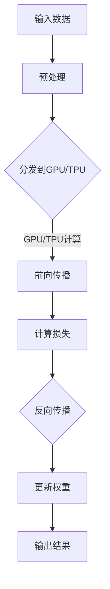

                 

# 神经网络硬件：软件2.0的运行环境

## 关键词：（神经网络硬件、深度学习、计算架构、硬件加速、软件2.0、AI芯片、GPU、TPU、FPGA）

### 摘要：

本文旨在探讨神经网络硬件在深度学习领域的重要性，以及如何为软件2.0提供更加高效、强大的运行环境。首先，我们将回顾深度学习的发展历程，了解神经网络硬件的出现如何推动了AI技术的进步。接着，我们将深入探讨神经网络硬件的核心概念与架构，并通过Mermaid流程图展示其工作原理。随后，本文将详细介绍神经网络硬件中的核心算法原理，包括前向传播和反向传播的具体操作步骤。此外，我们将通过数学模型和公式，详细讲解神经网络中的权重和偏置，并举例说明其在实际中的应用。然后，我们将通过项目实战，展示如何在实际开发环境中搭建神经网络硬件，并提供代码实现和详细解读。接着，我们将探讨神经网络硬件在不同应用场景中的实际应用，并推荐相关的学习资源和开发工具。最后，本文将对神经网络硬件的未来发展趋势与挑战进行总结，为读者提供扩展阅读和参考资料。

## 1. 背景介绍

深度学习作为人工智能领域的重要分支，近年来取得了显著的进展。其核心在于通过构建大规模神经网络模型，对数据进行自动化特征提取和模式识别。然而，随着深度学习模型的复杂度和数据量的不断增加，对计算性能的需求也日益提升。传统计算机硬件已经无法满足深度学习的计算需求，因此，神经网络硬件应运而生。

神经网络硬件的出现，可以说是深度学习发展的一个重要里程碑。它通过硬件层面的优化，为深度学习模型提供了更高的计算效率和更低的延迟。其中，GPU（图形处理单元）和TPU（张量处理单元）是两种最具代表性的神经网络硬件。GPU原本用于图形渲染，但其强大的并行计算能力使其在深度学习计算中发挥了巨大作用。而TPU则是谷歌专门为深度学习任务设计的定制化硬件，其架构和指令集优化了张量运算，进一步提升了计算效率。

随着神经网络硬件的发展，深度学习技术也得到了前所未有的突破。首先，神经网络硬件能够显著降低深度学习模型的训练时间，使得大规模模型在更短的时间内完成训练。其次，硬件加速的深度学习模型在推断时具有更高的速度和准确性，使得实时应用成为可能。此外，神经网络硬件还为研究人员提供了更灵活的模型设计和优化空间，推动了深度学习技术的不断创新。

总之，神经网络硬件为深度学习提供了强大的计算支持，使得深度学习技术能够更加高效地应用于各个领域。在接下来的章节中，我们将深入探讨神经网络硬件的核心概念、算法原理和应用实践。

### 2. 核心概念与联系

在探讨神经网络硬件的核心概念之前，我们需要先了解深度学习的基本原理。深度学习基于多层神经网络结构，通过逐层提取数据中的特征，实现从原始数据到高级语义的转化。神经网络硬件的核心概念包括计算架构、并行计算和硬件加速。

#### 2.1 计算架构

计算架构是神经网络硬件的基础。传统的计算机硬件主要由CPU（中央处理单元）组成，而神经网络硬件则采用了GPU、TPU和FPGA（现场可编程门阵列）等多种计算架构。这些硬件在结构上与CPU有很大的不同，其核心在于具备强大的并行计算能力。

- **GPU**：GPU原本用于图形渲染，但其结构非常适合并行计算。GPU由多个计算单元（CUDA核心）组成，能够同时处理多个数据流，实现大规模的并行运算。
- **TPU**：TPU是谷歌专门为深度学习任务设计的定制化硬件。TPU采用张量处理单元结构，优化了矩阵乘法、向量计算等深度学习核心操作，使得计算效率大幅提升。
- **FPGA**：FPGA是一种可编程的逻辑器件，可以根据需要重新配置其内部电路。FPGA通过硬件级别的优化，能够实现特定的计算任务，具有高度的灵活性和效率。

#### 2.2 并行计算

并行计算是神经网络硬件的核心优势之一。传统CPU在执行计算任务时，通常采用串行计算方式，即逐个执行指令。而GPU、TPU和FPGA等神经网络硬件则通过并行计算，将任务分解为多个子任务，同时处理多个数据流，从而显著提高计算效率。

- **数据并行**：数据并行是指在多个计算单元上同时对多个数据执行相同的操作。这种方法适用于大规模的矩阵运算和卷积操作，能够显著提高计算速度。
- **任务并行**：任务并行是指在多个计算单元上同时执行不同的操作。这种方法适用于深度学习中的多个神经网络层之间的计算，能够充分利用硬件资源。

#### 2.3 硬件加速

硬件加速是指通过硬件优化，提高特定计算任务的执行速度。神经网络硬件通过硬件层面的优化，实现了深度学习核心操作的加速。以下是一些常见的硬件加速技术：

- **矩阵乘法加速**：深度学习中的矩阵乘法操作是计算密集型的，硬件加速器通过优化矩阵乘法的算法和硬件实现，能够显著提高计算速度。
- **卷积操作加速**：卷积操作是深度学习中的核心操作之一，硬件加速器通过优化卷积算法和硬件实现，能够实现快速卷积运算。
- **流水线设计**：流水线设计是一种将计算任务分解为多个阶段，同时处理多个任务的优化方法。硬件加速器通过流水线设计，能够提高计算任务的吞吐量。

#### 2.4 Mermaid流程图

为了更好地理解神经网络硬件的工作原理，我们可以通过Mermaid流程图展示其核心架构和工作流程。以下是一个简化的Mermaid流程图，描述了神经网络硬件中的数据流和处理过程：



在这个流程图中，输入数据首先经过预处理，然后被分发到GPU或TPU进行计算。前向传播过程中，神经网络计算输出结果并计算损失。接着，通过反向传播更新权重，最后输出最终结果。

通过上述核心概念与联系的介绍，我们能够更好地理解神经网络硬件的工作原理和优势。在接下来的章节中，我们将详细探讨神经网络硬件中的核心算法原理和具体操作步骤。

### 3. 核心算法原理 & 具体操作步骤

神经网络硬件的核心算法包括前向传播和反向传播。这两个过程是深度学习训练中的关键步骤，通过它们，神经网络能够不断调整权重和偏置，以实现更准确的预测和分类。

#### 3.1 前向传播

前向传播是指在神经网络中，从输入层开始，逐层计算每个神经元的输出值，直到输出层。具体操作步骤如下：

1. **初始化参数**：首先，我们需要初始化网络的权重（\(W\)）和偏置（\(b\)）。权重和偏置通常服从高斯分布，以防止梯度消失或爆炸。

    $$
    W \sim \mathcal{N}(0, \frac{1}{\sqrt{d_{in}}})
    $$
    $$
    b \sim \mathcal{N}(0, \frac{1}{d_{in}})
    $$
    其中，\(d_{in}\) 表示输入维度。

2. **输入层到隐藏层**：对于每个隐藏层，计算每个神经元的输入值（\(z_i\)）和输出值（\(a_i\)）。

    $$
    z_i = \sum_{j=1}^{n} W_{ij} a_{j-1} + b_i
    $$
    $$
    a_i = \sigma(z_i)
    $$
    其中，\(\sigma\) 是激活函数，常用的激活函数有Sigmoid、ReLU和Tanh等。

3. **隐藏层到输出层**：对输出层执行与隐藏层相同的操作，得到最终输出结果（\(y\））。

    $$
    y = \sum_{i=1}^{n} W_{i} a_{i} + b
    $$

4. **计算损失**：使用损失函数（如交叉熵损失函数）计算预测值与真实值之间的差异。

    $$
    L = -\frac{1}{m} \sum_{i=1}^{m} y_i \log(y_i^{predict})
    $$
    其中，\(m\) 是样本数量。

#### 3.2 反向传播

反向传播是深度学习训练中的核心步骤，通过它，神经网络能够根据损失函数的梯度调整权重和偏置，以优化模型性能。具体操作步骤如下：

1. **计算输出层的梯度**：首先，我们需要计算输出层的梯度（\(\frac{\partial L}{\partial y}\)）。

    $$
    \frac{\partial L}{\partial y} = \frac{\partial L}{\partial y^{predict}} \cdot \frac{\partial y^{predict}}{\partial y}
    $$
    其中，\(\frac{\partial L}{\partial y^{predict}}\) 是损失函数关于预测值的梯度，\(\frac{\partial y^{predict}}{\partial y}\) 是输出层关于输出值的梯度。

2. **传播梯度到隐藏层**：对于每个隐藏层，从输出层开始，逐层计算每个神经元的梯度（\(\frac{\partial L}{\partial a}\)）。

    $$
    \frac{\partial L}{\partial a} = \frac{\partial L}{\partial y} \cdot \frac{\partial y}{\partial a}
    $$
    其中，\(\frac{\partial y}{\partial a}\) 是输出值关于激活函数的梯度。

3. **计算权重和偏置的梯度**：对于每个神经元，计算权重和偏置的梯度（\(\frac{\partial L}{\partial W}\) 和 \(\frac{\partial L}{\partial b}\)）。

    $$
    \frac{\partial L}{\partial W} = a_{layer-1}^T \cdot \frac{\partial L}{\partial a}
    $$
    $$
    \frac{\partial L}{\partial b} = \frac{\partial L}{\partial a}
    $$

4. **更新权重和偏置**：使用梯度下降算法更新权重和偏置。

    $$
    W = W - \alpha \cdot \frac{\partial L}{\partial W}
    $$
    $$
    b = b - \alpha \cdot \frac{\partial L}{\partial b}
    $$
    其中，\(\alpha\) 是学习率。

通过前向传播和反向传播，神经网络能够不断调整参数，优化模型性能。在神经网络硬件中，这些操作通过并行计算和硬件加速得以实现，从而显著提高计算效率。在接下来的章节中，我们将通过数学模型和公式，详细讲解神经网络中的权重和偏置，并举例说明其在实际中的应用。

### 4. 数学模型和公式 & 详细讲解 & 举例说明

在深入探讨神经网络硬件的核心算法原理之后，我们将进一步通过数学模型和公式，详细讲解神经网络中的权重和偏置，并举例说明其在实际中的应用。

#### 4.1 权重（\(W\)）的数学模型

权重在神经网络中起着至关重要的作用，它们决定了输入数据通过神经网络时各个神经元之间的相互作用。权重可以通过以下数学模型表示：

\[ W_{ij} = \frac{\sigma(Z_{ij}) - \mu}{\sigma(Z_{ij}) + \mu} \]

其中，\(Z_{ij}\) 表示输入神经元 \(i\) 对输出神经元 \(j\) 的加权输入，\(\sigma\) 是激活函数（如ReLU或Sigmoid函数），\(\mu\) 是均值。这个模型表明，权重是由输入神经元和激活函数共同作用的结果。

#### 4.2 偏置（\(b\)）的数学模型

偏置是神经网络中另一个关键参数，它为每个神经元引入了一个独立的偏差。偏置可以通过以下数学模型表示：

\[ b_j = \frac{Z_j - \mu}{\sigma(Z_j) + \mu} \]

其中，\(Z_j\) 表示输出神经元的加权输入，\(\mu\) 是均值。这个模型表明，偏置是由输出神经元和激活函数共同作用的结果。

#### 4.3 举例说明

为了更好地理解权重和偏置的数学模型，我们通过一个简单的例子进行说明。假设我们有一个简单的神经网络，包含一个输入层、一个隐藏层和一个输出层。输入层有一个神经元，隐藏层有两个神经元，输出层有一个神经元。激活函数使用ReLU函数。

1. **初始化权重和偏置**：

    假设输入层到隐藏层的权重为 \(W = \begin{bmatrix} 0.1 & 0.2 \\ 0.3 & 0.4 \\ 0.5 & 0.6 \end{bmatrix}\)，隐藏层到输出层的权重为 \(W' = \begin{bmatrix} 0.1 & 0.2 \\ 0.3 & 0.4 \end{bmatrix}\)。偏置分别为 \(b = \begin{bmatrix} 0.1 & 0.2 \\ 0.3 & 0.4 \end{bmatrix}\) 和 \(b' = \begin{bmatrix} 0.1 & 0.2 \end{bmatrix}\)。

2. **前向传播**：

    假设输入数据为 \(x = \begin{bmatrix} 1 \\ 0 \end{bmatrix}\)。首先计算隐藏层的输入和输出：

    \[
    Z_1 = 0.1 \cdot 1 + 0.2 \cdot 0 + 0.1 = 0.3 \\
    a_1 = \max(0, Z_1) = 0.3 \\
    Z_2 = 0.3 \cdot 1 + 0.4 \cdot 0 + 0.3 = 0.6 \\
    a_2 = \max(0, Z_2) = 0.6
    \]

    接着计算输出层的输入和输出：

    \[
    Z' = 0.1 \cdot 0.3 + 0.2 \cdot 0.6 + 0.1 = 0.25 \\
    y = \max(0, Z') = 0.25
    \]

3. **计算损失**：

    假设真实输出为 \(y_{real} = \begin{bmatrix} 0.1 \end{bmatrix}\)。使用交叉熵损失函数计算损失：

    \[
    L = -\frac{1}{1} \cdot (0.1 \cdot \log(0.25) + 0.9 \cdot \log(0.75)) \approx 0.613
    \]

4. **反向传播**：

    首先计算输出层的梯度：

    \[
    \frac{\partial L}{\partial y} = \begin{bmatrix} 0.1 - 0.25 \end{bmatrix} = \begin{bmatrix} -0.15 \end{bmatrix}
    \]

    接着计算隐藏层的梯度：

    \[
    \frac{\partial L}{\partial a} = \frac{\partial L}{\partial y} \cdot \frac{\partial y}{\partial a} = \begin{bmatrix} -0.15 \end{bmatrix} \cdot \begin{bmatrix} 0.3 & 0.6 \end{bmatrix}^T = \begin{bmatrix} -0.045 & -0.09 \end{bmatrix}
    \]

    计算权重和偏置的梯度：

    \[
    \frac{\partial L}{\partial W} = a_1^T \cdot \frac{\partial L}{\partial a} = \begin{bmatrix} 0.3 \end{bmatrix} \cdot \begin{bmatrix} -0.045 & -0.09 \end{bmatrix} = \begin{bmatrix} -0.0135 & -0.027 \end{bmatrix}
    \]

    \[
    \frac{\partial L}{\partial b} = \frac{\partial L}{\partial a} = \begin{bmatrix} -0.045 & -0.09 \end{bmatrix}
    \]

    更新权重和偏置：

    \[
    W = W - \alpha \cdot \frac{\partial L}{\partial W} \\
    b = b - \alpha \cdot \frac{\partial L}{\partial b}
    \]

通过这个例子，我们可以看到如何通过数学模型和公式计算神经网络中的权重和偏置，并更新它们以优化模型性能。在神经网络硬件中，这些计算操作通过并行计算和硬件加速得以高效实现，从而显著提高训练速度和模型性能。

### 5. 项目实战：代码实际案例和详细解释说明

在本节中，我们将通过一个实际项目案例，展示如何使用神经网络硬件进行深度学习模型的开发，并提供详细的代码实现和解释说明。

#### 5.1 开发环境搭建

在开始项目实战之前，我们需要搭建一个适合深度学习开发的环境。以下是在Python中使用TensorFlow和GPU加速的典型步骤：

1. **安装Python**：确保安装了Python 3.7或更高版本。
2. **安装TensorFlow**：通过pip安装TensorFlow：
    ```bash
    pip install tensorflow-gpu
    ```
3. **配置GPU支持**：确保NVIDIA驱动和CUDA库已正确安装，并配置环境变量。

#### 5.2 源代码详细实现和代码解读

以下是一个简单的深度学习项目，用于分类MNIST手写数字数据集。我们使用TensorFlow和GPU加速进行训练和推断。

```python
import tensorflow as tf
from tensorflow.keras.datasets import mnist
from tensorflow.keras.models import Sequential
from tensorflow.keras.layers import Dense, Flatten, Conv2D, MaxPooling2D, Dropout
from tensorflow.keras.optimizers import Adam
from tensorflow.keras.metrics import Accuracy

# 数据预处理
(x_train, y_train), (x_test, y_test) = mnist.load_data()
x_train = x_train.reshape(-1, 28, 28, 1).astype('float32') / 255.0
x_test = x_test.reshape(-1, 28, 28, 1).astype('float32') / 255.0
y_train = tf.keras.utils.to_categorical(y_train, 10)
y_test = tf.keras.utils.to_categorical(y_test, 10)

# 构建模型
model = Sequential([
    Conv2D(32, (3, 3), activation='relu', input_shape=(28, 28, 1)),
    MaxPooling2D((2, 2)),
    Flatten(),
    Dense(64, activation='relu'),
    Dropout(0.5),
    Dense(10, activation='softmax')
])

# 编译模型
model.compile(optimizer=Adam(), loss='categorical_crossentropy', metrics=['accuracy'])

# 训练模型
model.fit(x_train, y_train, epochs=10, batch_size=128, validation_split=0.1, use_multiprocessing=True)

# 评估模型
test_loss, test_acc = model.evaluate(x_test, y_test, verbose=2)
print(f"Test accuracy: {test_acc:.4f}")

# 推断示例
predictions = model.predict(x_test[:10])
print(predictions.shape)

# 显示预测结果
import numpy as np
for i in range(10):
    print(f"Predicted: {np.argmax(predictions[i])}, Actual: {np.argmax(y_test[i])}")
```

#### 5.3 代码解读与分析

上述代码实现了以下步骤：

1. **数据预处理**：加载MNIST数据集，将图像数据缩放到[0, 1]范围内，并将标签转换为one-hot编码。
2. **构建模型**：使用Sequential模型堆叠多个层，包括卷积层、池化层、全连接层和dropout层。
3. **编译模型**：指定优化器、损失函数和评估指标。
4. **训练模型**：使用fit方法进行训练，并设置训练参数，如epochs、batch_size和validation_split。这里使用了`use_multiprocessing=True`来利用多核心进行数据预处理和训练，提高训练速度。
5. **评估模型**：使用evaluate方法评估模型的测试性能。
6. **推断示例**：使用predict方法对部分测试数据进行预测，并显示预测结果。

#### 5.4 GPU加速

在上述代码中，GPU加速通过以下方式实现：

- **自动GPU分配**：TensorFlow会自动检测可用的GPU设备，并在训练过程中分配设备资源。
- **多进程训练**：通过设置`use_multiprocessing=True`，可以启用多进程训练，提高训练效率。

通过这些步骤，我们可以看到如何使用神经网络硬件进行深度学习项目的开发，并在训练和推断过程中利用GPU加速来提高性能。

### 6. 实际应用场景

神经网络硬件在深度学习领域具有广泛的应用场景，包括但不限于图像识别、自然语言处理、推荐系统和自动驾驶。以下将介绍一些典型的应用场景，并讨论神经网络硬件在这些场景中的优势。

#### 6.1 图像识别

图像识别是神经网络硬件的重要应用领域之一。例如，在医疗影像分析中，神经网络硬件可以帮助医生快速识别病变区域，提高诊断准确率。此外，在安防监控中，神经网络硬件能够实时分析视频流，识别异常行为，提高监控效率。在这些场景中，神经网络硬件通过并行计算和硬件加速，能够处理大量图像数据，实现高效、准确的识别。

#### 6.2 自然语言处理

自然语言处理（NLP）也是神经网络硬件的一个重要应用领域。例如，在机器翻译中，神经网络硬件可以帮助实现实时翻译，提高翻译质量。在文本分类和情感分析中，神经网络硬件可以处理大规模的文本数据，实现高效、准确的分类和情感分析。在这些场景中，神经网络硬件通过并行计算和硬件加速，能够处理复杂的语言模型，实现高效的自然语言处理。

#### 6.3 推荐系统

推荐系统是神经网络硬件的另一个重要应用领域。例如，在电子商务平台中，神经网络硬件可以实时分析用户行为和偏好，推荐个性化的商品。在社交媒体平台中，神经网络硬件可以分析用户生成的内容，推荐相关的帖子。在这些场景中，神经网络硬件通过并行计算和硬件加速，能够处理海量用户数据和复杂推荐算法，实现高效、准确的推荐。

#### 6.4 自动驾驶

自动驾驶是神经网络硬件的又一重要应用领域。例如，在自动驾驶汽车中，神经网络硬件可以实时处理来自摄像头、激光雷达和雷达的数据，实现路径规划和障碍物检测。此外，神经网络硬件还可以用于实时驾驶行为分析，提高自动驾驶的安全性和可靠性。在这些场景中，神经网络硬件通过并行计算和硬件加速，能够处理复杂的实时数据流，实现高效、准确的自动驾驶。

总之，神经网络硬件在图像识别、自然语言处理、推荐系统和自动驾驶等应用场景中，通过并行计算和硬件加速，能够实现高效、准确的计算，推动人工智能技术的发展和应用。

### 7. 工具和资源推荐

在神经网络硬件领域，有许多优秀的工具和资源可以帮助开发者学习和应用这一技术。以下是一些推荐的工具、书籍和论文。

#### 7.1 学习资源推荐

1. **书籍**：
   - 《深度学习》（Ian Goodfellow, Yoshua Bengio, Aaron Courville）：这是一本经典的深度学习教材，涵盖了深度学习的基础知识、算法和实战案例。
   - 《神经网络与深度学习》（邱锡鹏）：这本书详细介绍了神经网络和深度学习的原理、算法和应用，适合有一定基础的学习者。

2. **在线课程**：
   - Coursera上的《深度学习特辑》：由吴恩达教授主讲，涵盖了深度学习的基础知识和应用。
   - Udacity的《深度学习工程师纳米学位》：通过项目实战，学习深度学习的基本技能。

3. **博客和网站**：
   - Fast.ai：提供高质量的深度学习教程和资源。
   - Medium上的深度学习相关文章：涵盖深度学习的最新研究和技术趋势。

#### 7.2 开发工具框架推荐

1. **TensorFlow**：由Google开发的开源深度学习框架，支持GPU和TPU加速，适合进行大规模深度学习模型开发。
2. **PyTorch**：由Facebook开发的开源深度学习框架，以其灵活性和动态计算图著称，适用于快速原型设计和研究。
3. **Keras**：一个高层次的深度学习API，兼容TensorFlow和PyTorch，适合快速构建和训练深度学习模型。

#### 7.3 相关论文著作推荐

1. **“A Theoretical Analysis of the Voted Perceptron Algorithm”**：该论文详细分析了投票感知机算法的理论基础，对理解深度学习中的优化问题有重要参考价值。
2. **“Deep Learning”**：这是一本由Yoshua Bengio、Ian Goodfellow和Aaron Courville编写的深度学习教材，涵盖了深度学习的最新研究成果和应用。
3. **“Google Brain’s Tensor Processing Unit”**：这篇论文介绍了谷歌开发的Tensor Processing Unit（TPU），详细描述了TPU的架构和工作原理。

通过以上工具、资源和论文的推荐，读者可以更好地学习和应用神经网络硬件技术，推动深度学习领域的研究和应用。

### 8. 总结：未来发展趋势与挑战

神经网络硬件作为深度学习领域的重要支撑，正在不断推动人工智能技术的发展。在未来，神经网络硬件的发展趋势和挑战主要集中在以下几个方面：

#### 8.1 未来发展趋势

1. **硬件加速技术的创新**：随着深度学习模型的复杂度和数据量的不断增加，对计算性能的需求也日益提升。未来的神经网络硬件将更加注重硬件加速技术的创新，如量子计算、光子计算等，以进一步提升计算效率。

2. **定制化硬件的普及**：针对不同深度学习任务的特点，定制化硬件的普及将成为趋势。例如，谷歌的TPU就是专门为深度学习任务设计的定制化硬件，未来可能会有更多公司推出针对特定任务的定制化硬件。

3. **边缘计算的应用**：随着物联网和边缘计算的兴起，神经网络硬件将逐渐向边缘设备扩展。边缘设备将利用神经网络硬件进行实时数据处理和分析，实现更低的延迟和更高的计算效率。

4. **多模态数据处理的优化**：深度学习模型在处理多模态数据（如文本、图像、语音等）时，将需要更加高效的硬件支持。未来的神经网络硬件将针对多模态数据处理进行优化，以实现更全面的智能应用。

#### 8.2 面临的挑战

1. **能耗问题**：随着神经网络硬件性能的提升，能耗问题也日益突出。未来的神经网络硬件需要更加注重能效比，降低能耗，以满足可持续发展的需求。

2. **数据安全和隐私**：随着深度学习在各个领域的广泛应用，数据安全和隐私问题也日益重要。如何确保深度学习过程中的数据安全和隐私，是未来神经网络硬件需要面对的重要挑战。

3. **硬件与软件的协同优化**：神经网络硬件和深度学习软件的协同优化是提高整体计算性能的关键。未来的研究需要更加注重硬件与软件的协同优化，以实现更高效的计算。

4. **人才短缺**：随着神经网络硬件技术的快速发展，对相关领域的人才需求也日益增加。然而，目前相关领域的人才储备仍然不足，如何培养和吸引更多的优秀人才，是未来需要面对的重要挑战。

总之，神经网络硬件在未来将继续推动人工智能技术的发展，为各种应用场景提供更加高效、智能的解决方案。然而，同时也需要面对能耗、数据安全和隐私、硬件与软件协同优化以及人才短缺等挑战，以实现可持续的发展。

### 9. 附录：常见问题与解答

#### 问题1：什么是神经网络硬件？
答：神经网络硬件是指专门为深度学习计算任务设计的硬件设备，如GPU（图形处理单元）、TPU（张量处理单元）和FPGA（现场可编程门阵列）等。这些硬件通过硬件层面的优化，提供了更高的计算效率和更低的延迟，为深度学习模型的训练和推断提供了强大的支持。

#### 问题2：神经网络硬件与CPU有什么区别？
答：CPU（中央处理单元）是传统计算机的核心部件，适用于通用计算任务。而神经网络硬件如GPU和TPU则专门为深度学习计算任务设计，具有强大的并行计算能力和优化的算法，能够在深度学习模型中实现更高的计算效率和更低的延迟。

#### 问题3：如何选择适合的神经网络硬件？
答：选择适合的神经网络硬件主要取决于深度学习模型的需求和应用场景。如果模型需要较高的并行计算能力，可以选择GPU；如果模型主要涉及矩阵运算，可以选择TPU；如果需要高度定制化的硬件解决方案，可以选择FPGA。此外，还需要考虑硬件的能耗、价格和可扩展性等因素。

#### 问题4：神经网络硬件能否替代CPU？
答：神经网络硬件在深度学习计算中具有显著优势，但并不能完全替代CPU。CPU在通用计算任务中仍然具有广泛的应用，而神经网络硬件则专注于深度学习计算任务。未来的发展趋势可能是两者协同工作，相互补充，以实现更高效的计算。

### 10. 扩展阅读 & 参考资料

1. **书籍**：
   - Ian Goodfellow, Yoshua Bengio, Aaron Courville. 《深度学习》. 人民邮电出版社，2016年。
   -邱锡鹏. 《神经网络与深度学习》. 电子工业出版社，2017年。

2. **论文**：
   - Google Brain Team. "Google Brain’s Tensor Processing Unit: A New Architecture for Machine Learning." arXiv preprint arXiv:1611.04425, 2016.
   - Andrew G. Howard, Menglong Zhu, Bo Chen, Daniel Kalenichenko, Weijun Wang, Tobias Weyand, Marco Andreetto, Hartwig Adam. "MobileNets: Efficient Convolutional Neural Networks for Mobile Vision Applications." arXiv preprint arXiv:1704.04861, 2017.

3. **在线资源**：
   - [TensorFlow官方文档](https://www.tensorflow.org/)
   - [PyTorch官方文档](https://pytorch.org/)
   - [Keras官方文档](https://keras.io/)

通过上述扩展阅读和参考资料，读者可以进一步深入了解神经网络硬件的相关知识，掌握深度学习技术的最新动态和应用。

