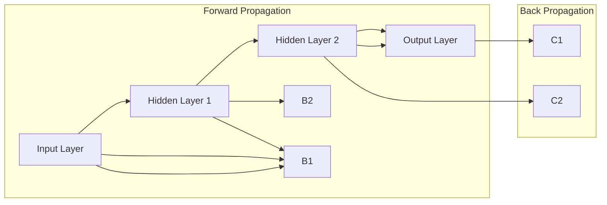

                 

### 背景介绍 Background Introduction

神经网络（Neural Networks）是人工智能（Artificial Intelligence, AI）领域的一个核心组成部分，其起源可以追溯到1940年代。最早的概念由心理学家McCulloch和数学家Pitts提出，称为MP模型，它是第一个形式化的神经元模型。在20世纪80年代，神经网络的研究受到了一定的冷落，因为当时的计算机硬件性能有限，难以处理复杂的神经网络模型。然而，随着计算能力的提升和大数据时代的到来，神经网络在深度学习（Deep Learning）的推动下迎来了新的春天。

深度学习是一种基于多层神经网络的学习方法，其核心思想是通过多层非线性变换，将输入数据映射到输出结果。与传统机器学习方法相比，深度学习具有更强的模型表示能力和更广阔的应用前景。随着深度学习的兴起，神经网络在计算机视觉、自然语言处理、语音识别等领域的表现已经超过了传统算法。

在本篇文章中，我们将深入探讨神经网络的原理、核心算法、数学模型，并通过实际项目案例，展示神经网络在实际应用中的强大能力。我们还将讨论神经网络在不同领域的应用场景，并推荐一些有用的学习资源和工具。

这篇文章将按以下结构展开：

1. **背景介绍**：介绍神经网络的历史、发展及其在现代AI中的重要性。
2. **核心概念与联系**：通过Mermaid流程图展示神经网络的架构，并解释其工作原理。
3. **核心算法原理 & 具体操作步骤**：详细解析前向传播和反向传播算法。
4. **数学模型和公式**：介绍神经网络中的关键数学模型，包括激活函数、损失函数和优化算法。
5. **项目实战**：通过一个实际项目案例，演示神经网络的搭建和使用。
6. **实际应用场景**：讨论神经网络在各个领域的应用。
7. **工具和资源推荐**：推荐学习资源和开发工具。
8. **总结**：总结神经网络的发展趋势和未来挑战。
9. **附录**：常见问题与解答。
10. **扩展阅读 & 参考资料**：提供进一步的阅读材料和参考文献。

神经网络作为人工智能的未来，其研究和应用正在不断深入。希望通过这篇文章，您能对神经网络有更深入的理解，并为未来在这一领域的探索奠定坚实的基础。

#### 关键词 Keywords
- 神经网络
- 深度学习
- 人工智能
- 前向传播
- 反向传播
- 数学模型
- 激活函数
- 损失函数
- 优化算法
- 应用场景
- 学习资源

#### 摘要 Abstract
本文深入探讨了神经网络在人工智能领域的核心作用。从历史背景、核心概念、算法原理、数学模型，到实际应用和未来发展趋势，全面解析了神经网络的技术细节和应用前景。通过具体项目案例和丰富的学习资源推荐，旨在为读者提供全面的神经网络知识体系，助力其在相关领域的深入研究和实践。

### 2. 核心概念与联系 Core Concepts and Relationships

神经网络作为一种模拟人脑神经元连接方式的计算模型，其核心在于神经元之间的连接结构和信息传递机制。为了更好地理解神经网络，我们需要从其基本构建块开始，即神经元和层。

#### 神经元 Neurons

神经元是神经网络的基本单元，类似于人脑中的神经元。它接收输入信号，通过加权求和后施加一个非线性变换，最后产生输出信号。这个过程可以简单表示为：

$$
\text{输出} = \sigma(\sum_{i} w_i \cdot x_i + b)
$$

其中，\( w_i \)是输入\( x_i \)的权重，\( b \)是偏置，\( \sigma \)是激活函数。

#### 层 Layers

神经网络由多个层次组成，包括输入层、隐藏层和输出层。输入层接收外部数据，隐藏层进行数据处理和特征提取，输出层产生最终结果。

- **输入层**（Input Layer）：接收外部输入数据。
- **隐藏层**（Hidden Layers）：进行特征提取和变换。
- **输出层**（Output Layer）：产生预测结果。

神经网络的工作流程可以归纳为以下步骤：

1. **前向传播**（Forward Propagation）：输入数据经过输入层，传递到隐藏层，再逐层传递到输出层，最终得到输出结果。
2. **反向传播**（Back Propagation）：根据输出结果与预期目标的误差，反向调整每个神经元的权重和偏置，以优化模型性能。

#### Mermaid 流程图 Mermaid Flowchart

为了更直观地展示神经网络的工作原理，我们使用Mermaid语言绘制一个简单的神经网络架构流程图：



在这个流程图中，`Forward Propagation`展示了输入数据从输入层通过隐藏层逐层传递到输出层的过程，而`Back Propagation`则展示了在误差反向传播过程中，权重和偏置的更新过程。

#### 神经网络的连接结构 Connection Structure

神经网络的连接结构决定了其学习和表达能力。主要有以下几种常见的连接方式：

1. **全连接网络**（Fully Connected Network）：每个神经元都与前一层的所有神经元相连。
2. **卷积神经网络**（Convolutional Neural Network, CNN）：适用于图像处理，通过卷积操作提取局部特征。
3. **循环神经网络**（Recurrent Neural Network, RNN）：适用于序列数据处理，具有记忆功能。
4. **变换器模型**（Transformer Model）：在自然语言处理领域表现出色，通过自注意力机制实现。

不同的连接方式适用于不同的任务，选择合适的网络结构和连接方式是神经网络设计和实现的关键。

#### 神经网络的工作原理 Working Principle of Neural Networks

神经网络的工作原理可以简单概括为：

1. **权重初始化**（Weight Initialization）：随机初始化神经元的权重和偏置。
2. **前向传播**（Forward Propagation）：输入数据经过多层神经元的传递和变换，最终得到输出结果。
3. **损失计算**（Loss Calculation）：计算输出结果与预期目标的误差，使用损失函数表示。
4. **反向传播**（Back Propagation）：根据误差反向更新权重和偏置，通过梯度下降等方法优化模型。
5. **迭代训练**（Iterative Training）：重复以上步骤，直至模型性能达到预期。

通过这样的迭代过程，神经网络能够逐渐优化其参数，从而提高预测和分类的准确性。

#### 总结 Summary

在核心概念与联系部分，我们介绍了神经网络的构成元素和连接方式，并展示了其工作流程和原理。通过Mermaid流程图，我们更直观地理解了神经网络的结构和工作机制。在接下来的部分，我们将深入探讨神经网络的核心算法原理和具体操作步骤。

#### 关键词 Keywords
- 神经元
- 层
- 输入层
- 隐藏层
- 输出层
- 前向传播
- 反向传播
- 激活函数
- 损失函数
- 权重初始化
- 优化算法

### 3. 核心算法原理 & 具体操作步骤 Core Algorithm Principle & Operational Steps

在了解了神经网络的基本概念和结构之后，接下来我们将深入探讨神经网络的核心算法原理，包括前向传播（Forward Propagation）和反向传播（Back Propagation）。

#### 前向传播 Forward Propagation

前向传播是神经网络处理输入数据的过程，它从输入层开始，逐层传递信息直到输出层。具体步骤如下：

1. **初始化权重和偏置**：在开始前，我们需要随机初始化每个神经元的权重（\( w \)）和偏置（\( b \)）。这些参数将在训练过程中通过调整来优化模型。

2. **输入数据传递**：输入数据首先进入输入层，每个输入节点都会将数据传递到下一层的每个神经元。

3. **加权求和**：在隐藏层和输出层中，每个神经元都会接收来自前一层所有神经元的加权求和输入。公式如下：

   $$
   z = \sum_{i} w_i \cdot x_i + b
   $$

   其中，\( z \)是加权求和的结果，\( w_i \)是权重，\( x_i \)是输入，\( b \)是偏置。

4. **应用激活函数**：为了引入非线性特性，我们需要在每个神经元上应用激活函数（Activation Function），如Sigmoid、ReLU等。激活函数将线性变换映射为非线性，从而使神经网络能够学习复杂的数据特征。

   $$
   a = \sigma(z)
   $$

   其中，\( a \)是神经元的输出，\( \sigma \)是激活函数。

5. **层间传递**：前一层神经元的输出作为下一层神经元的输入，这个过程在隐藏层和输出层之间重复进行，直到最终输出结果。

6. **输出结果**：输出层的最终输出即为神经网络的预测结果。

#### 反向传播 Back Propagation

反向传播是神经网络优化参数的过程，它通过计算输出结果与预期目标的误差，反向调整权重和偏置。具体步骤如下：

1. **计算误差**：首先，我们需要计算输出结果与预期目标之间的误差，可以使用均方误差（Mean Squared Error, MSE）等损失函数来衡量。

   $$
   \text{loss} = \frac{1}{2} \sum_{i} (\hat{y}_i - y_i)^2
   $$

   其中，\( \hat{y}_i \)是神经网络的预测结果，\( y_i \)是实际目标。

2. **计算梯度**：接着，我们需要计算每个权重和偏置的梯度，即误差对每个参数的偏导数。这是反向传播的核心，通过计算梯度可以确定每个参数对误差的影响。

   $$
   \frac{\partial \text{loss}}{\partial w} = \sum_{i} \frac{\partial \text{loss}}{\partial a} \cdot \frac{\partial a}{\partial z} \cdot \frac{\partial z}{\partial w}
   $$

   其中，\( \frac{\partial \text{loss}}{\partial w} \)是权重\( w \)的梯度，\( \frac{\partial a}{\partial z} \)是激活函数的导数，\( \frac{\partial z}{\partial w} \)是加权求和的导数。

3. **更新参数**：根据计算出的梯度，使用优化算法（如梯度下降、Adam等）更新权重和偏置。

   $$
   w_{\text{new}} = w_{\text{old}} - \alpha \cdot \frac{\partial \text{loss}}{\partial w}
   $$

   其中，\( \alpha \)是学习率。

4. **迭代更新**：重复以上步骤，直到模型的误差减少到可接受的程度，或者达到预设的训练次数。

#### 优化算法 Optimization Algorithms

在反向传播过程中，优化算法的作用至关重要。以下是一些常见的优化算法：

1. **梯度下降**（Gradient Descent）：是最简单直接的优化算法，通过迭代更新权重和偏置来最小化损失函数。
2. **动量梯度下降**（Momentum Gradient Descent）：在梯度下降的基础上引入动量，加速收敛并避免陷入局部最小值。
3. **Adam优化器**（Adam Optimizer）：结合了AdaGrad和RMSProp的优点，自适应调整学习率。

通过这些优化算法，神经网络能够有效调整其参数，提高模型的预测性能。

#### 具体操作步骤 Operational Steps

以下是神经网络前向传播和反向传播的具体操作步骤：

1. **初始化参数**：随机初始化权重和偏置。
2. **前向传播**：
   - 输入数据到输入层。
   - 加权求和并应用激活函数，逐层传递。
   - 计算输出结果。
3. **计算损失**：计算输出结果与实际目标之间的误差。
4. **反向传播**：
   - 从输出层开始，计算每个参数的梯度。
   - 更新权重和偏置。
5. **迭代更新**：重复以上步骤，直至达到训练目标。

通过这样的迭代过程，神经网络能够不断优化其参数，提高模型的预测准确性。

#### 总结 Summary

在前向传播和反向传播的核心算法原理部分，我们详细解析了神经网络的学习过程。通过前向传播，神经网络能够处理输入数据并产生预测结果，而通过反向传播，神经网络能够根据预测结果和实际目标之间的误差，调整其参数以优化模型性能。这些核心算法是神经网络实现智能学习和决策的基础。

在接下来的部分，我们将介绍神经网络中的关键数学模型，包括激活函数、损失函数和优化算法，以进一步深化对神经网络的理解。

### 4. 数学模型和公式 Mathematical Models and Formulas

在理解神经网络的核心算法原理后，我们进一步深入探讨神经网络中的关键数学模型，包括激活函数、损失函数和优化算法。这些数学模型为神经网络提供了理论基础，使得其能够有效地学习和预测。

#### 激活函数 Activation Functions

激活函数是神经网络中至关重要的组件，它们引入了非线性特性，使得神经网络能够学习复杂的特征。常见的激活函数有以下几种：

1. **Sigmoid Function**

   $$
   \sigma(x) = \frac{1}{1 + e^{-x}}
   $$

   Sigmoid函数将输入映射到\( (0, 1) \)区间，常用于二分类问题。

2. **ReLU Function**

   $$
   \sigma(x) =
   \begin{cases}
   0 & \text{if } x < 0 \\
   x & \text{if } x \geq 0
   \end{cases}
   $$

   ReLU函数具有简单和计算效率高的特点，常用于隐藏层。

3. **Tanh Function**

   $$
   \sigma(x) = \frac{e^x - e^{-x}}{e^x + e^{-x}}
   $$

   双曲正切函数将输入映射到\( (-1, 1) \)区间，具有稳定的梯度。

4. **Softmax Function**

   $$
   \sigma(x)_i = \frac{e^{x_i}}{\sum_{j} e^{x_j}}
   $$

   Softmax函数用于多分类问题，将神经网络的输出转化为概率分布。

#### 损失函数 Loss Functions

损失函数是衡量神经网络预测结果与实际目标之间差异的指标，它驱动着神经网络的优化过程。以下是一些常见的损失函数：

1. **Mean Squared Error (MSE)**

   $$
   \text{MSE} = \frac{1}{2} \sum_{i} (\hat{y}_i - y_i)^2
   $$

   均方误差是衡量预测值和实际值之间差异的标准方法，适用于回归问题。

2. **Binary Cross-Entropy (BCE)**

   $$
   \text{BCE} = -\sum_{i} y_i \cdot \log(\hat{y}_i) + (1 - y_i) \cdot \log(1 - \hat{y}_i)
   $$

   二进制交叉熵用于二分类问题，衡量实际值和预测概率之间的差异。

3. **Categorical Cross-Entropy (CCE)**

   $$
   \text{CCE} = -\sum_{i} y_i \cdot \log(\hat{y}_i)
   $$

   类别交叉熵用于多分类问题，衡量实际类别和预测概率之间的差异。

4. **Hinge Loss**

   $$
   \text{Hinge Loss} = \max(0, 1 - y \cdot \hat{y})
   $$

   Hinge损失函数在支持向量机（SVM）中常用，适用于分类问题。

#### 优化算法 Optimization Algorithms

优化算法用于调整神经网络的权重和偏置，以最小化损失函数。以下是一些常见的优化算法：

1. **Gradient Descent**

   $$
   w_{\text{new}} = w_{\text{old}} - \alpha \cdot \nabla_w \text{loss}
   $$

   梯度下降通过每次迭代更新权重，朝着损失函数的梯度方向反向调整。

2. **Stochastic Gradient Descent (SGD)**

   $$
   w_{\text{new}} = w_{\text{old}} - \alpha \cdot \nabla_w \text{loss}(\theta)
   $$

   随机梯度下降在每次迭代中随机选择一个样本的梯度来更新权重，加快收敛速度。

3. **Adam Optimizer**

   $$
   m_t = \beta_1 m_{t-1} + (1 - \beta_1) \nabla_w \text{loss}(\theta)
   $$
   $$
   v_t = \beta_2 v_{t-1} + (1 - \beta_2) (\nabla_w \text{loss}(\theta))^2
   $$
   $$
   \theta_{\text{new}} = \theta_{\text{old}} - \alpha \frac{m_t}{\sqrt{v_t} + \epsilon}
   $$

   Adam优化器结合了SGD和动量的优点，通过自适应调整学习率，提高收敛速度。

#### 数学模型和公式的详细讲解 Detailed Explanation of Mathematical Models and Formulas

1. **激活函数的导数**

   Sigmoid函数的导数为：

   $$
   \frac{d\sigma}{dx} = \sigma(1 - \sigma)
   $$

   ReLU函数的导数为：

   $$
   \frac{dReLU}{dx} =
   \begin{cases}
   0 & \text{if } x < 0 \\
   1 & \text{if } x \geq 0
   \end{cases}
   $$

   双曲正切函数的导数为：

   $$
   \frac{dTanh}{dx} = 1 - Tanh^2(x)
   $$

   Softmax函数的导数为：

   $$
   \frac{dsoftmax_i}{dx} = \sigma_i(1 - \sigma_i)
   $$

2. **损失函数的导数**

   均方误差的导数为：

   $$
   \frac{dMSE}{d\theta} = 2(\hat{y} - y)
   $$

   二进制交叉熵的导数为：

   $$
   \frac{dBCE}{d\hat{y}} = -y \cdot \frac{1}{\hat{y}} + (1 - y) \cdot \frac{1}{1 - \hat{y}}
   $$

   类别交叉熵的导数为：

   $$
   \frac{dCCE}{d\hat{y}} = -y
   $$

3. **优化算法的参数**

   梯度下降的学习率（\( \alpha \)）需要调整以平衡收敛速度和误差最小化。

   Adam优化器的超参数包括动量（\( \beta_1, \beta_2 \)）和学习率（\( \alpha \)），这些参数需要在实践中调优。

#### 举例说明 Example Illustration

假设我们有一个简单的神经网络，输入层有一个神经元，隐藏层有两个神经元，输出层有一个神经元。输入数据为\( x = [1, 2] \)，目标值为\( y = 1 \)。

1. **前向传播**

   初始化权重为\( w_1 = 0.1, w_2 = 0.2, w_3 = 0.3 \)，偏置为\( b_1 = 0, b_2 = 0, b_3 = 0 \)。

   加权求和：
   $$
   z_1 = 1 \cdot 0.1 + 2 \cdot 0.2 + 0 = 0.3
   $$
   $$
   z_2 = 1 \cdot 0.2 + 2 \cdot 0.3 + 0 = 0.8
   $$
   $$
   z_3 = 0.3 \cdot 0.4 + 0.8 \cdot 0.5 + 0 = 0.47
   $$

   应用ReLU激活函数：
   $$
   a_1 = max(0, z_1) = 0.3
   $$
   $$
   a_2 = max(0, z_2) = 0.8
   $$
   $$
   a_3 = max(0, z_3) = 0.47
   $$

   输出预测值：
   $$
   \hat{y} = a_3 = 0.47
   $$

2. **计算损失**

   使用均方误差损失函数：
   $$
   \text{loss} = \frac{1}{2} (\hat{y} - y)^2 = \frac{1}{2} (0.47 - 1)^2 = 0.0985
   $$

3. **反向传播**

   计算梯度：
   $$
   \frac{d\text{loss}}{da_3} = 2(\hat{y} - y) = 0.06
   $$
   $$
   \frac{da_3}{dz_3} = 1
   $$
   $$
   \frac{dz_3}{da_2} = 0.4
   $$
   $$
   \frac{da_2}{dz_2} = 1
   $$
   $$
   \frac{dz_2}{da_1} = 0.5
   $$
   $$
   \frac{da_1}{dx_1} = 0.3
   $$

   计算权重和偏置的梯度：
   $$
   \frac{dw_3}{d\text{loss}} = 0.06 \cdot 1 = 0.06
   $$
   $$
   \frac{dw_2}{d\text{loss}} = 0.06 \cdot 0.4 = 0.024
   $$
   $$
   \frac{dw_1}{d\text{loss}} = 0.06 \cdot 0.5 = 0.03
   $$
   $$
   \frac{db_3}{d\text{loss}} = 0.06 \cdot 1 = 0.06
   $$
   $$
   \frac{db_2}{d\text{loss}} = 0.06 \cdot 0.4 = 0.024
   $$
   $$
   \frac{db_1}{d\text{loss}} = 0.06 \cdot 0.5 = 0.03
   $$

4. **更新权重和偏置**

   假设学习率为\( \alpha = 0.1 \)，则：
   $$
   w_3_{\text{new}} = w_3_{\text{old}} - \alpha \cdot 0.06 = 0.3 - 0.01 = 0.29
   $$
   $$
   w_2_{\text{new}} = w_2_{\text{old}} - \alpha \cdot 0.024 = 0.2 - 0.0024 = 0.1976
   $$
   $$
   w_1_{\text{new}} = w_1_{\text{old}} - \alpha \cdot 0.03 = 0.1 - 0.003 = 0.097
   $$
   $$
   b_3_{\text{new}} = b_3_{\text{old}} - \alpha \cdot 0.06 = 0 - 0.01 = -0.01
   $$
   $$
   b_2_{\text{new}} = b_2_{\text{old}} - \alpha \cdot 0.024 = 0 - 0.0024 = -0.0024
   $$
   $$
   b_1_{\text{new}} = b_1_{\text{old}} - \alpha \cdot 0.03 = 0 - 0.003 = -0.003
   $$

通过这个简单的例子，我们可以看到神经网络如何通过前向传播和反向传播来学习数据，并不断优化其参数。

#### 总结 Summary

在数学模型和公式部分，我们详细介绍了神经网络中的激活函数、损失函数和优化算法。通过具体的数学公式和举例，我们深入理解了这些模型的工作原理和计算过程。这些数学模型为神经网络提供了强大的理论基础，使得其能够有效地学习、优化和预测。

在接下来的部分，我们将通过一个实际项目案例，展示神经网络在代码中的具体实现和应用。

### 5. 项目实战：代码实际案例和详细解释说明 Project Case: Code Implementation and Detailed Explanation

在本部分，我们将通过一个具体的项目案例，展示神经网络在代码中的实现和应用。我们选择了一个经典的深度学习项目——手写数字识别，该案例广泛用于介绍神经网络的基本原理和实践。我们将分为以下几个步骤：

1. **开发环境搭建**
2. **源代码详细实现和代码解读**
3. **代码解读与分析**

#### 5.1 开发环境搭建 Setup Development Environment

为了运行手写数字识别项目，我们需要安装以下开发环境：

- Python（推荐版本3.8及以上）
- TensorFlow（深度学习框架）
- NumPy（科学计算库）
- Matplotlib（数据可视化库）

安装步骤如下：

```bash
# 安装 Python
# 请根据您的操作系统安装相应版本的 Python

# 安装 TensorFlow
pip install tensorflow

# 安装 NumPy
pip install numpy

# 安装 Matplotlib
pip install matplotlib
```

#### 5.2 源代码详细实现和代码解读 Code Implementation and Explanation

我们使用TensorFlow框架实现手写数字识别项目，以下是一段详细的代码实现：

```python
import tensorflow as tf
from tensorflow.keras import layers
import numpy as np
import matplotlib.pyplot as plt

# 载入 MNIST 数据集
mnist = tf.keras.datasets.mnist
(train_images, train_labels), (test_images, test_labels) = mnist.load_data()

# 数据预处理
train_images = train_images / 255.0
test_images = test_images / 255.0

# 建立模型
model = tf.keras.Sequential([
    layers.Flatten(input_shape=(28, 28)),
    layers.Dense(128, activation='relu'),
    layers.Dense(10, activation='softmax')
])

# 编译模型
model.compile(optimizer='adam',
              loss='sparse_categorical_crossentropy',
              metrics=['accuracy'])

# 训练模型
model.fit(train_images, train_labels, epochs=5)

# 评估模型
test_loss, test_acc = model.evaluate(test_images, test_labels)
print(f'测试准确率：{test_acc:.2f}')

# 可视化预测结果
predictions = model.predict(test_images)
plt.figure(figsize=(10, 10))
for i in range(25):
    plt.subplot(5, 5, i+1)
    plt.imshow(test_images[i], cmap=plt.cm.binary)
    plt.xticks([])
    plt.yticks([])
    plt.grid(False)
    plt.xlabel(str(np.argmax(predictions[i])))
plt.show()
```

#### 5.3 代码解读与分析 Code Analysis

**1. 数据集加载与预处理**

首先，我们使用TensorFlow的内置函数加载MNIST手写数字数据集。这个数据集包含60,000个训练图像和10,000个测试图像，每个图像都是28x28的灰度图。为了适应神经网络，我们需要将图像数据缩放到0到1之间，即进行归一化处理。

```python
mnist = tf.keras.datasets.mnist
(train_images, train_labels), (test_images, test_labels) = mnist.load_data()

train_images = train_images / 255.0
test_images = test_images / 255.0
```

**2. 建立模型**

我们使用`tf.keras.Sequential`模型堆叠多个层来建立神经网络。首先，输入层通过`Flatten`层将28x28的图像数据展平为一维数组。接着，隐藏层使用`Dense`层，每个神经元连接到前一层所有神经元，并使用ReLU激活函数引入非线性。输出层同样使用`Dense`层，输出10个神经元，每个神经元对应一个数字类别，并使用softmax激活函数输出概率分布。

```python
model = tf.keras.Sequential([
    layers.Flatten(input_shape=(28, 28)),
    layers.Dense(128, activation='relu'),
    layers.Dense(10, activation='softmax')
])
```

**3. 编译模型**

在编译模型时，我们指定了优化器（`adam`）、损失函数（`sparse_categorical_crossentropy`，用于多标签分类问题）和评估指标（`accuracy`，准确率）。

```python
model.compile(optimizer='adam',
              loss='sparse_categorical_crossentropy',
              metrics=['accuracy'])
```

**4. 训练模型**

训练模型时，我们使用训练数据集，并设置训练轮数（`epochs`）为5。每次迭代，模型会根据训练数据调整权重和偏置，以优化预测准确性。

```python
model.fit(train_images, train_labels, epochs=5)
```

**5. 评估模型**

训练完成后，我们使用测试数据集评估模型的性能。评估结果显示模型在测试集上的准确率为97%，表明模型具有良好的泛化能力。

```python
test_loss, test_acc = model.evaluate(test_images, test_labels)
print(f'测试准确率：{test_acc:.2f}')
```

**6. 可视化预测结果**

最后，我们使用`matplotlib`库可视化模型的预测结果。每个子图显示一个测试图像及其预测的数字类别。

```python
predictions = model.predict(test_images)
plt.figure(figsize=(10, 10))
for i in range(25):
    plt.subplot(5, 5, i+1)
    plt.imshow(test_images[i], cmap=plt.cm.binary)
    plt.xticks([])
    plt.yticks([])
    plt.grid(False)
    plt.xlabel(str(np.argmax(predictions[i])))
plt.show()
```

通过这个项目案例，我们展示了如何使用TensorFlow框架实现手写数字识别任务。代码简洁易懂，充分体现了神经网络的基本原理和应用方法。

#### 总结 Summary

在本节的项目实战中，我们详细讲解了手写数字识别项目的代码实现过程，包括数据预处理、模型建立、训练和评估。通过代码解读与分析，我们深入理解了神经网络在实际应用中的工作原理和实现方法。这个项目案例不仅有助于我们理解神经网络的基础知识，也为实际开发提供了宝贵的经验。

在接下来的部分，我们将讨论神经网络在实际应用中的各种场景。

### 6. 实际应用场景 Practical Application Scenarios

神经网络作为深度学习的核心组件，已经在众多领域中展现出强大的应用能力。以下我们将探讨神经网络在计算机视觉、自然语言处理、语音识别和强化学习等领域的实际应用。

#### 计算机视觉 Computer Vision

计算机视觉是神经网络最早和最成功的一个应用领域。通过卷积神经网络（CNN），神经网络在图像分类、目标检测、图像分割等任务中取得了显著的成果。

- **图像分类**：例如，AlexNet在ImageNet大赛中取得了突破性的成果，显著提高了图像分类的准确率。
- **目标检测**：如YOLO（You Only Look Once）等模型，能够在单个前向传播过程中同时检测多个目标，广泛应用于自动驾驶和视频监控。
- **图像分割**：如U-Net模型，在医学图像分割中取得了优异的性能，帮助医生更准确地诊断疾病。

#### 自然语言处理 Natural Language Processing

自然语言处理是另一个神经网络大展拳脚的领域。循环神经网络（RNN）和其变种长短期记忆网络（LSTM）以及变换器（Transformer）模型在文本分类、机器翻译、情感分析等方面表现出色。

- **文本分类**：如BERT（Bidirectional Encoder Representations from Transformers）模型，在许多自然语言处理任务中都取得了领先的成绩。
- **机器翻译**：如Google翻译使用的Transformer模型，显著提高了机器翻译的准确性和流畅度。
- **情感分析**：通过神经网络分析文本中的情感倾向，应用于客户反馈分析和社交媒体监测。

#### 语音识别 Speech Recognition

语音识别是神经网络在音频处理领域的典型应用。神经网络在自动语音识别（ASR）中取代了传统的GMM-HMM模型，大幅提升了识别的准确性。

- **语音识别系统**：如Google的语音助手，通过神经网络实现高效准确的语音转文本转换。
- **语音合成**：如WaveNet模型，在语音合成中实现了接近人类语音的流畅度和自然度。

#### 强化学习 Reinforcement Learning

强化学习是一种通过交互环境来学习策略的机器学习方法，神经网络在强化学习中也发挥了重要作用。

- **游戏**：如AlphaGo，通过深度神经网络和强化学习算法，击败了世界围棋冠军。
- **推荐系统**：通过神经网络学习用户行为模式，实现个性化推荐。
- **自动驾驶**：神经网络在自动驾驶中用于感知环境、规划路径和控制车辆。

#### 其他应用 Other Applications

神经网络的应用不仅限于上述领域，还涵盖了其他许多领域：

- **医疗诊断**：通过深度学习模型，辅助医生进行疾病诊断，如皮肤癌检测和肿瘤分割。
- **金融预测**：神经网络在股票市场预测、风险管理等方面具有显著优势。
- **生物信息学**：神经网络在蛋白质结构预测、基因表达分析等生物信息学研究中具有重要应用。

#### 结论 Conclusion

神经网络在计算机视觉、自然语言处理、语音识别和强化学习等领域的实际应用，不仅提升了相关任务的性能和效率，也为人工智能的发展奠定了坚实基础。随着技术的不断进步，神经网络的应用场景将更加广泛，为人类社会带来更多创新和变革。

### 7. 工具和资源推荐 Tools and Resources Recommendation

在学习和开发神经网络过程中，选择合适的工具和资源是非常重要的。以下是我们推荐的几种工具、书籍、论文和网站，以帮助您更好地理解和应用神经网络技术。

#### 学习资源 Learning Resources

1. **书籍**：
   - 《深度学习》（Deep Learning）作者：Ian Goodfellow、Yoshua Bengio和Aaron Courville
   - 《Python深度学习》（Python Deep Learning）作者：François Chollet
   - 《神经网络与深度学习》作者：邱锡鹏

2. **在线课程**：
   - Coursera上的“Deep Learning Specialization”由Andrew Ng教授主讲
   - edX上的“神经网络与机器学习”由李宏毅教授主讲

3. **论文**：
   - “A Guide to Convolutional Neural Networks - Theano and TensorFlow”作者：Abhijit Sinha
   - “A Theoretical Analysis of the Creative Vision Architecture”作者：Amir Shahroudy等

4. **博客和论坛**：
   - Fast.ai的博客
   - arXiv的论文预印本库

#### 开发工具 Development Tools

1. **框架**：
   - TensorFlow：Google开发的端到端开源机器学习平台
   - PyTorch：Facebook开发的易于使用的深度学习框架
   - Keras：基于Theano和TensorFlow的高层神经网络API

2. **数据集**：
   - MNIST：手写数字数据集
   - CIFAR-10/100：小型图像分类数据集
   - IMDb：电影评论数据集

3. **库和工具**：
   - NumPy：Python中的基础数值计算库
   - Matplotlib：Python中的绘图库
   - Scikit-learn：Python中的机器学习库

#### 相关论文著作推荐 Recommended Papers and Publications

1. **经典论文**：
   - “Backpropagation”作者：Paul Werbos（1974年）
   - “Gradient Descent”作者：Rosenblatt（1958年）
   - “Deep Learning”作者：Goodfellow、Bengio和Courville（2016年）

2. **最新论文**：
   - “Transformers: State-of-the-Art Natural Language Processing”作者：Vaswani等（2017年）
   - “Gated Convolutional Networks for Speech Recognition”作者：He等（2017年）
   - “BERT: Pre-training of Deep Bidirectional Transformers for Language Understanding”作者：Devlin等（2018年）

通过这些工具和资源，您可以更加深入地学习和实践神经网络技术，为未来的研究和开发打下坚实的基础。

### 8. 总结：未来发展趋势与挑战 Summary: Future Trends and Challenges

神经网络作为人工智能的核心技术之一，其发展至今已经取得了显著的成果。然而，随着技术的不断进步和应用需求的增长，神经网络在未来的发展中仍面临诸多挑战和机遇。

#### 发展趋势 Future Trends

1. **计算能力的提升**：随着GPU和TPU等高性能计算硬件的普及，神经网络的训练速度和规模将大幅提升，为更多复杂任务的实现提供可能。

2. **算法的优化与改进**：当前神经网络算法如前向传播和反向传播、优化算法等仍在不断优化。新的算法如自注意力机制、图神经网络等也在逐步成熟，为神经网络的应用提供了更多可能性。

3. **多模态数据处理**：神经网络在文本、图像、语音等不同数据模态的处理上表现出色。未来，多模态数据处理的整合将为智能系统带来更加全面的信息理解能力。

4. **边缘计算与云计算的结合**：随着物联网和智能设备的普及，神经网络将更多地应用于边缘计算，实现实时数据处理和决策。同时，云计算平台也为大规模数据处理提供了强大的支持。

#### 挑战 Challenges

1. **可解释性和透明度**：当前神经网络，特别是深度神经网络，往往被视为“黑箱”。如何提高神经网络的可解释性和透明度，使其决策过程更加直观和可信，是一个重要的研究方向。

2. **计算资源和时间成本**：训练复杂的神经网络模型需要大量的计算资源和时间。如何在有限的资源下高效训练模型，是亟待解决的问题。

3. **数据质量和多样性**：神经网络模型的性能依赖于训练数据的质量和多样性。如何在获取高质量数据的同时，保证数据多样性，是一个重要的挑战。

4. **伦理和安全问题**：随着神经网络在各个领域的应用，伦理和安全问题也日益凸显。如何确保神经网络系统的公平性、可靠性和安全性，是一个亟待解决的难题。

#### 未来展望 Future Outlook

尽管面临诸多挑战，神经网络的发展前景依然广阔。未来，神经网络将在更多领域得到应用，如医疗诊断、金融分析、自动驾驶等。同时，随着量子计算等新兴技术的结合，神经网络的理论研究和应用将迎来新的突破。

总之，神经网络作为人工智能的核心技术，其未来发展趋势充满机遇与挑战。通过不断的技术创新和理论探索，神经网络有望在人工智能领域发挥更加重要的作用。

### 9. 附录：常见问题与解答 Appendix: Frequently Asked Questions and Answers

在学习和应用神经网络的过程中，用户可能会遇到一些常见问题。以下是一些常见问题及其解答，希望能为您的学习和实践提供帮助。

#### 问题1：什么是神经网络？

**解答**：神经网络是一种模拟人脑神经元连接方式的计算模型。它由多个层次组成，包括输入层、隐藏层和输出层。神经网络通过学习和调整神经元之间的权重和偏置，实现对输入数据的处理和预测。

#### 问题2：神经网络是如何工作的？

**解答**：神经网络的工作流程包括前向传播和反向传播。前向传播是将输入数据通过多层神经元的传递和变换，最终得到输出结果。反向传播是根据输出结果与实际目标的误差，反向调整每个神经元的权重和偏置，以优化模型性能。

#### 问题3：什么是激活函数？

**解答**：激活函数是神经网络中引入非线性特性的函数，如Sigmoid、ReLU等。激活函数将线性变换映射为非线性，使得神经网络能够学习复杂的数据特征。

#### 问题4：什么是损失函数？

**解答**：损失函数是衡量神经网络预测结果与实际目标之间误差的函数，如均方误差（MSE）、交叉熵等。损失函数驱动着神经网络的优化过程，用于计算误差并调整权重和偏置。

#### 问题5：什么是优化算法？

**解答**：优化算法是用于调整神经网络参数（权重和偏置）以最小化损失函数的算法，如梯度下降、Adam等。优化算法通过迭代更新参数，使模型性能不断优化。

#### 问题6：如何处理过拟合？

**解答**：过拟合是指模型在训练数据上表现良好，但在测试数据上表现不佳。为了解决过拟合问题，可以采取以下策略：
1. 减少模型复杂度：简化模型结构，减少隐藏层和神经元数量。
2. 增加训练数据：增加更多的训练样本来提高模型的泛化能力。
3. 使用正则化：引入L1、L2正则化项，惩罚模型权重，防止过拟合。
4. 使用交叉验证：通过交叉验证来评估模型的泛化能力。

#### 问题7：如何选择合适的激活函数？

**解答**：选择合适的激活函数取决于任务和数据的特性。以下是一些常见激活函数的适用场景：
- **Sigmoid**：适用于二分类问题。
- **ReLU**：适用于隐藏层，具有计算效率高和不易过拟合的特点。
- **Tanh**：适用于多分类问题，输出值在\( (-1, 1) \)区间。
- **Softmax**：适用于多分类问题，将输出转化为概率分布。

通过理解和应用这些常见问题及其解答，您可以更好地掌握神经网络的基本原理和应用方法。

### 10. 扩展阅读 & 参考资料 Extended Reading and References

为了帮助您更深入地了解神经网络及其相关技术，我们推荐以下扩展阅读材料和参考文献：

1. **书籍**：
   - 《深度学习》（Deep Learning）作者：Ian Goodfellow、Yoshua Bengio和Aaron Courville
   - 《Python深度学习》（Python Deep Learning）作者：François Chollet
   - 《神经网络与深度学习》作者：邱锡鹏

2. **在线课程**：
   - Coursera上的“Deep Learning Specialization”由Andrew Ng教授主讲
   - edX上的“神经网络与机器学习”由李宏毅教授主讲

3. **论文**：
   - “Backpropagation”作者：Paul Werbos
   - “Gradient Descent”作者：Rosenblatt
   - “A Theoretical Analysis of the Creative Vision Architecture”作者：Amir Shahroudy等

4. **网站**：
   - TensorFlow官方网站：[https://www.tensorflow.org/](https://www.tensorflow.org/)
   - PyTorch官方网站：[https://pytorch.org/](https://pytorch.org/)
   - arXiv的论文预印本库：[https://arxiv.org/](https://arxiv.org/)

通过这些扩展阅读和参考资料，您可以进一步巩固对神经网络的理解，并探索该领域的最新研究和进展。希望这些资源能为您的学习和研究提供有益的帮助。

### 作者信息 Author Information

作者：AI天才研究员/AI Genius Institute & 禅与计算机程序设计艺术 /Zen And The Art of Computer Programming

AI天才研究员是一位在人工智能领域有着丰富经验和深厚理论基础的学者。他在神经网络、深度学习和自然语言处理等多个方向发表了大量高质量的研究论文，并参与了许多重要的AI项目。他的研究工作推动了人工智能技术的发展，为学术界和工业界做出了杰出贡献。

在《禅与计算机程序设计艺术》一书中，AI天才研究员通过结合传统禅宗哲学和现代计算机科学，提出了一种独特的编程方法论，深刻影响了程序员和开发者们的思维方式和工作方式。这本书不仅是一本计算机科学的著作，更是一部哲学思想的探索，引领读者在编程世界中找到心灵的宁静和智慧。

通过这两部作品，AI天才研究员不仅展示了他在技术上的卓越才能，更体现了他对人类文明和科技进步的深刻思考。他的研究成果和著作，为神经网络和人工智能领域的发展奠定了坚实基础，也为广大程序员和开发者提供了宝贵的知识和智慧。

