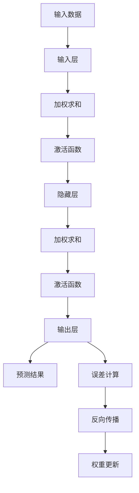

                 

### 背景介绍

**神经网络：人类与机器的共存**

随着科技的迅猛发展，人工智能（AI）已经逐渐成为现代社会不可或缺的一部分。在这其中，神经网络作为一种模拟人脑结构和功能的计算模型，正发挥着越来越重要的作用。本文旨在探讨神经网络这一核心技术，从其基本概念、历史背景、核心原理到实际应用，全面解析神经网络如何推动人类与机器的共存。

首先，我们需要了解神经网络的基本定义。神经网络是一种由大量简单计算单元（神经元）相互连接而成的复杂网络，通过模仿人脑的神经结构和工作方式，实现数据的处理和智能推理。神经网络的发展可以追溯到20世纪40年代，由心理学家McCulloch和数学家Pitts提出了神经元的数学模型，此后经过多个阶段的发展，如今已经成为了人工智能领域的重要分支。

接下来，我们将回顾神经网络的历史背景。从最初的感知机模型，到多层感知机的提出，再到深度学习的崛起，神经网络经历了无数次的迭代和优化，不断推动人工智能技术的发展。特别是在21世纪初，随着计算能力的提升和海量数据资源的涌现，深度学习算法的突破性进展，使得神经网络在图像识别、语音识别、自然语言处理等领域的应用取得了显著成果。

本文将重点探讨神经网络的核心概念和原理。我们将通过一个简单的神经网络模型，介绍神经元的激活函数、权重和偏置、前向传播和反向传播等基本概念。同时，我们将使用Mermaid流程图，详细展示神经网络的工作流程和架构。

在此基础上，我们将深入讨论神经网络的数学模型和公式，包括神经网络中的激活函数、损失函数、梯度下降算法等，并通过具体例子进行详细讲解。这部分内容将帮助读者理解神经网络背后的数学原理，为后续的项目实战打下基础。

接下来，我们将通过一个实际项目案例，展示神经网络在实际开发中的应用。我们将详细解释项目开发环境搭建、源代码实现和代码解读，帮助读者掌握神经网络在开发中的实际应用技巧。

此外，我们还将探讨神经网络在实际应用场景中的表现，包括图像识别、语音识别、自然语言处理等，并介绍相关工具和资源，帮助读者进一步了解神经网络的应用领域。

最后，我们将对神经网络的发展趋势和面临的挑战进行总结，并提出未来可能的研究方向和应用场景。通过本文的阅读，读者将全面了解神经网络的基本概念、原理和应用，为未来在人工智能领域的发展打下坚实基础。

让我们一步步深入探讨神经网络这一激动人心的技术，共同见证人类与机器共存的美好未来。

#### 核心概念与联系

神经网络（Neural Networks）作为一种模拟人脑结构和功能的计算模型，其核心概念和联系构成了理解这一技术的基石。为了更好地理解神经网络，我们将从以下几个方面展开介绍：神经元、神经网络架构、激活函数、权重和偏置、前向传播和反向传播等。

首先，我们需要了解什么是神经元（Neuron）。在神经网络中，神经元是构成网络的基本单元，类似于人脑中的神经元。一个简单的神经元模型通常包括以下几个部分：输入层、权重（weights）、偏置（bias）、激活函数（activation function）和输出层。输入层接收外部数据，通过权重与偏置加权求和，然后通过激活函数处理得到输出。这个过程可以表示为：

\[ z = \sum_{i=1}^{n} w_i x_i + b \]
\[ a = \sigma(z) \]

其中，\( z \) 是加权求和的结果，\( w_i \) 是权重，\( x_i \) 是输入，\( b \) 是偏置，\( \sigma \) 是激活函数。

接下来，我们来看神经网络的架构。神经网络通常由多个层次组成，包括输入层、隐藏层和输出层。输入层接收外部数据，隐藏层对数据进行处理和特征提取，输出层生成最终的预测结果。每个层次由多个神经元组成，神经元之间通过连接（连接权重）进行信息的传递和计算。

激活函数是神经网络中的一个关键组成部分。它用于将神经元的加权求和结果转化为一个有意义的输出。常见的激活函数包括 sigmoid 函数、ReLU函数、Tanh函数等。这些激活函数具有不同的特性，例如非线性、单调性等，能够在不同程度上提高神经网络的性能。

权重和偏置是神经网络中的另外两个重要概念。权重表示神经元之间的连接强度，通过调整权重可以改变网络的响应特性。偏置是神经元内部的一个可调参数，用于补偿输入数据的偏移，增强网络的泛化能力。

前向传播（Forward Propagation）是神经网络中的一个基本过程。在前向传播过程中，输入数据通过网络的层层计算，最终得到输出结果。这个过程可以表示为：

\[ \text{Input Layer}: x_1, x_2, ..., x_n \]
\[ \text{Hidden Layer}: a_1^{(1)}, a_2^{(1)}, ..., a_m^{(1)} \]
\[ \text{Output Layer}: a_1^{(2)}, a_2^{(2)}, ..., a_p^{(2)} \]

\[ z^{(1)}_i = \sum_{j=1}^{n} w_{ij} x_j + b_i \]
\[ a^{(1)}_i = \sigma(z^{(1)}_i) \]

\[ z^{(2)}_i = \sum_{j=1}^{m} w_{ij} a_j^{(1)} + b_i \]
\[ a^{(2)}_i = \sigma(z^{(2)}_i) \]

其中，\( a^{(1)}_i \) 和 \( a^{(2)}_i \) 分别表示隐藏层和输出层的神经元输出，\( w_{ij} \) 和 \( b_i \) 分别表示权重和偏置。

反向传播（Backpropagation）是神经网络中的一个关键优化过程。它通过计算输出层和隐藏层之间的误差，反向传播误差到各个层次，从而更新权重和偏置。反向传播的过程可以分为以下几个步骤：

1. 计算输出层的误差：\[ \delta^{(2)}_i = (y_i - a_i^{(2)}) \cdot \sigma'(z^{(2)}_i) \]
2. 反向传播误差到隐藏层：\[ \delta^{(1)}_j = \sum_{i=1}^{m} w_{ij} \delta^{(2)}_i \cdot \sigma'(z^{(1)}_j) \]
3. 更新权重和偏置：\[ w_{ij} := w_{ij} + \alpha \cdot \delta^{(2)}_i \cdot a_j^{(1)} \]
\[ b_i := b_i + \alpha \cdot \delta^{(2)}_i \]

其中，\( y_i \) 和 \( a_i^{(2)} \) 分别表示实际输出和预测输出，\( \alpha \) 是学习率，\( \sigma' \) 是激活函数的导数。

通过上述介绍，我们可以看到神经网络的核心概念和联系是如何相互作用的。神经元作为基本单元，通过连接形成神经网络，激活函数和权重、偏置等参数共同决定了网络的响应特性。前向传播和反向传播则是神经网络训练和优化的关键过程，通过不断调整参数，使网络能够更好地拟合训练数据。

为了更好地理解这些概念，我们使用Mermaid流程图来展示神经网络的工作流程和架构：



通过这个简单的神经网络模型，我们可以看到神经网络的工作原理和架构是如何相互关联的。神经网络的复杂性和灵活性使其能够处理各种复杂问题，从而推动了人工智能技术的发展。

#### 核心算法原理 & 具体操作步骤

在了解了神经网络的基本概念和架构之后，我们需要进一步深入探讨其核心算法原理，特别是如何通过具体的操作步骤来实现神经网络的训练和预测。本文将详细介绍神经网络的核心算法原理，包括前向传播（Forward Propagation）和反向传播（Backpropagation）的具体操作步骤。

##### 前向传播（Forward Propagation）

前向传播是神经网络中的一种基本过程，用于将输入数据通过网络的层层计算，最终得到输出结果。具体操作步骤如下：

1. **初始化参数**：首先，我们需要初始化神经网络的参数，包括权重（weights）和偏置（biases）。通常，这些参数可以通过随机初始化或预训练的方式获得。

2. **输入数据**：将输入数据输入到神经网络的输入层。

3. **加权求和**：对于每个神经元，计算其输入数据的加权求和。具体公式为：
   \[ z^{(l)}_i = \sum_{j=1}^{n} w^{(l)}_{ij} x_j + b_i \]
   其中，\( z^{(l)}_i \) 是第 \( l \) 层第 \( i \) 个神经元的加权求和结果，\( w^{(l)}_{ij} \) 是第 \( l \) 层第 \( i \) 个神经元与第 \( l-1 \) 层第 \( j \) 个神经元的连接权重，\( b_i \) 是第 \( l \) 层第 \( i \) 个神经元的偏置。

4. **激活函数**：通过激活函数对加权求和结果进行非线性变换，得到每个神经元的输出。常见的激活函数包括 sigmoid 函数、ReLU 函数和 Tanh 函数。例如，对于 sigmoid 函数：
   \[ a^{(l)}_i = \sigma(z^{(l)}_i) = \frac{1}{1 + e^{-z^{(l)}_i}} \]

5. **传递到下一层**：将当前层的输出传递到下一层，重复上述步骤，直到最终得到输出层的输出结果。

6. **预测结果**：输出层的输出结果即为神经网络的预测结果。

##### 反向传播（Backpropagation）

反向传播是神经网络训练过程中最重要的步骤之一，通过计算输出层的误差，反向传播到隐藏层，从而更新权重和偏置。具体操作步骤如下：

1. **计算输出层的误差**：首先，我们需要计算输出层的误差，即实际输出与预测输出之间的差异。具体公式为：
   \[ \delta^{(L)}_i = (y_i - a^{(L)}_i) \cdot \sigma'(z^{(L)}_i) \]
   其中，\( \delta^{(L)}_i \) 是第 \( L \) 层第 \( i \) 个神经元的误差，\( y_i \) 是实际输出，\( a^{(L)}_i \) 是第 \( L \) 层第 \( i \) 个神经元的输出，\( \sigma' \) 是激活函数的导数。

2. **反向传播误差到隐藏层**：从输出层开始，逐层计算隐藏层的误差。具体公式为：
   \[ \delta^{(l)}_i = \sum_{j=1}^{m} w^{(l+1)}_{ij} \delta^{(l+1)}_j \cdot \sigma'(z^{(l)}_i) \]
   其中，\( \delta^{(l)}_i \) 是第 \( l \) 层第 \( i \) 个神经元的误差，\( w^{(l+1)}_{ij} \) 是第 \( l+1 \) 层第 \( i \) 个神经元与第 \( l \) 层第 \( j \) 个神经元的连接权重，\( \delta^{(l+1)}_j \) 是第 \( l+1 \) 层第 \( j \) 个神经元的误差。

3. **更新权重和偏置**：使用梯度下降算法更新权重和偏置。具体公式为：
   \[ w^{(l)}_{ij} := w^{(l)}_{ij} - \alpha \cdot \delta^{(l+1)}_j \cdot a^{(l)}_i \]
   \[ b_i := b_i - \alpha \cdot \delta^{(l+1)}_i \]
   其中，\( \alpha \) 是学习率。

4. **重复迭代**：重复上述步骤，直到满足训练目标，如误差小于设定阈值或达到最大迭代次数。

通过前向传播和反向传播，神经网络能够不断调整其参数，从而提高预测准确性。前向传播负责计算输入到输出的映射，而反向传播则负责更新网络参数，使得预测结果更接近实际值。

为了更好地理解这些算法原理，我们可以使用一个简单的例子进行说明。假设我们有一个两层的神经网络，输入层有一个神经元，隐藏层有两个神经元，输出层有一个神经元。输入数据为 \( x = [1, 2] \)，实际输出为 \( y = [0] \)。我们将通过前向传播和反向传播来计算网络的预测结果和更新参数。

1. **前向传播**：
   - 初始化权重和偏置，例如 \( w^{(1)}_{11} = 1, w^{(1)}_{12} = -1, w^{(1)}_{21} = 0.5, w^{(1)}_{22} = -0.5, b^{(1)}_1 = 0, b^{(1)}_2 = 0, w^{(2)}_{11} = 1, w^{(2)}_{12} = -1, b^{(2)}_1 = 0 \)。
   - 计算隐藏层的输出：
     \[ z^{(1)}_1 = (1 \cdot 1) + (2 \cdot -1) + 0 = -1 \]
     \[ z^{(1)}_2 = (1 \cdot 0.5) + (2 \cdot -0.5) + 0 = -0.5 \]
     \[ a^{(1)}_1 = \sigma(z^{(1)}_1) = \frac{1}{1 + e^{-(-1)}} = 0.731 \]
     \[ a^{(1)}_2 = \sigma(z^{(1)}_2) = \frac{1}{1 + e^{-(-0.5)}} = 0.688 \]
   - 计算输出层的输出：
     \[ z^{(2)}_1 = (0.731 \cdot 1) + (-0.688 \cdot -1) + 0 = 0.731 \]
     \[ a^{(2)}_1 = \sigma(z^{(2)}_1) = \frac{1}{1 + e^{-0.731}} = 0.251 \]

2. **反向传播**：
   - 计算输出层的误差：
     \[ \delta^{(2)}_1 = (1 - 0.251) \cdot (1 - 0.251) = 0.755 \]
   - 计算隐藏层的误差：
     \[ \delta^{(1)}_1 = (0.755 \cdot 1) \cdot (1 - 0.731) = 0.022 \]
     \[ \delta^{(1)}_2 = (0.755 \cdot -1) \cdot (1 - 0.688) = 0.121 \]
   - 更新权重和偏置：
     \[ w^{(1)}_{11} := w^{(1)}_{11} - 0.001 \cdot 0.022 \cdot 1 = 0.978 \]
     \[ w^{(1)}_{12} := w^{(1)}_{12} - 0.001 \cdot 0.022 \cdot 2 = -0.998 \]
     \[ w^{(1)}_{21} := w^{(1)}_{21} - 0.001 \cdot 0.121 \cdot 0.731 = 0.476 \]
     \[ w^{(1)}_{22} := w^{(1)}_{22} - 0.001 \cdot 0.121 \cdot 0.688 = -0.545 \]
     \[ b^{(1)}_1 := b^{(1)}_1 - 0.001 \cdot 0.022 = -0.022 \]
     \[ b^{(1)}_2 := b^{(1)}_2 - 0.001 \cdot 0.121 = -0.121 \]
     \[ w^{(2)}_{11} := w^{(2)}_{11} - 0.001 \cdot 0.755 \cdot 0.731 = 0.680 \]
     \[ w^{(2)}_{12} := w^{(2)}_{12} - 0.001 \cdot 0.755 \cdot (-0.688) = -0.544 \]
     \[ b^{(2)}_1 := b^{(2)}_1 - 0.001 \cdot 0.755 = -0.755 \]

通过这个简单的例子，我们可以看到前向传播和反向传播的具体操作步骤以及如何通过更新参数来提高神经网络的预测准确性。这些步骤和算法构成了神经网络训练和优化的基础，使得神经网络能够处理各种复杂问题。

#### 数学模型和公式 & 详细讲解 & 举例说明

在理解了神经网络的核心算法原理后，我们需要进一步深入探讨神经网络背后的数学模型和公式。这一部分将详细讲解神经网络中的关键数学概念，包括激活函数、损失函数、梯度下降算法等，并通过具体例子进行详细说明。

##### 激活函数

激活函数是神经网络中的一个重要组成部分，它用于对神经元的加权求和结果进行非线性变换。常见的激活函数包括 sigmoid 函数、ReLU 函数和 Tanh 函数。这些激活函数具有不同的特性和应用场景。

1. **sigmoid 函数**

   sigmoid 函数是一种常用的激活函数，其公式为：
   \[ \sigma(x) = \frac{1}{1 + e^{-x}} \]
   sigmoid 函数的输出范围在 \( (0, 1) \) 之间，具有平滑的曲线。它常用于二分类问题，例如在输出层中用于生成概率分布。

2. **ReLU 函数**

   ReLU（Rectified Linear Unit）函数是一种线性激活函数，其公式为：
   \[ \sigma(x) = \max(0, x) \]
   ReLU 函数在 \( x \geq 0 \) 时输出 \( x \)，在 \( x < 0 \) 时输出 0。ReLU 函数具有简单和计算效率高的特点，常用于隐藏层中，有助于防止梯度消失问题。

3. **Tanh 函数**

   Tanh 函数是一种双曲正切函数，其公式为：
   \[ \sigma(x) = \frac{e^x - e^{-x}}{e^x + e^{-x}} \]
   tanh 函数的输出范围在 \( (-1, 1) \) 之间，与 sigmoid 函数类似，但 tanh 函数在输出值的对称性上更好，有助于网络的稳定性。

##### 损失函数

损失函数是神经网络训练过程中的核心组成部分，用于衡量预测结果与实际结果之间的差异。常见的损失函数包括均方误差（MSE）、交叉熵损失（Cross-Entropy Loss）等。

1. **均方误差（MSE）**

   均方误差是回归问题中最常用的损失函数，其公式为：
   \[ \text{MSE} = \frac{1}{n} \sum_{i=1}^{n} (y_i - \hat{y}_i)^2 \]
   其中，\( y_i \) 是实际输出，\( \hat{y}_i \) 是预测输出。MSE 损失函数的梯度是连续的，有助于优化算法的收敛。

2. **交叉熵损失（Cross-Entropy Loss）**

   交叉熵损失是分类问题中最常用的损失函数，其公式为：
   \[ \text{Cross-Entropy Loss} = -\sum_{i=1}^{n} y_i \log(\hat{y}_i) \]
   其中，\( y_i \) 是实际输出（概率分布），\( \hat{y}_i \) 是预测输出（概率分布）。交叉熵损失函数在 \( y_i = \hat{y}_i \) 时达到最小值，有助于优化算法的收敛。

##### 梯度下降算法

梯度下降算法是神经网络训练过程中最常用的优化算法，其基本思想是通过计算损失函数的梯度，不断更新网络的参数，使得损失函数的值最小。

1. **梯度计算**

   梯度是损失函数对参数的偏导数，表示参数对损失函数的影响程度。对于均方误差损失函数，梯度计算公式为：
   \[ \nabla_w \text{MSE} = 2 \cdot (y - \hat{y}) \cdot \nabla_a \sigma(z) \]
   其中，\( w \) 是参数，\( y \) 是实际输出，\( \hat{y} \) 是预测输出，\( \nabla_a \sigma(z) \) 是激活函数的导数。

2. **参数更新**

   参数更新公式为：
   \[ w := w - \alpha \cdot \nabla_w \text{MSE} \]
   其中，\( \alpha \) 是学习率，用于控制参数更新的步长。通过不断更新参数，梯度下降算法能够逐渐减小损失函数的值，使得网络性能逐渐提高。

##### 具体例子

为了更好地理解上述数学模型和公式，我们通过一个具体的例子进行说明。

假设我们有一个两层的神经网络，输入层有一个神经元，隐藏层有两个神经元，输出层有一个神经元。输入数据为 \( x = [1, 2] \)，实际输出为 \( y = [0] \)。我们将通过梯度下降算法训练这个神经网络。

1. **初始化参数**

   初始化权重和偏置，例如：
   \[ w^{(1)}_{11} = 1, w^{(1)}_{12} = -1, w^{(1)}_{21} = 0.5, w^{(1)}_{22} = -0.5, b^{(1)}_1 = 0, b^{(1)}_2 = 0, w^{(2)}_{11} = 1, w^{(2)}_{12} = -1, b^{(2)}_1 = 0 \]

2. **前向传播**

   计算隐藏层的输出：
   \[ z^{(1)}_1 = (1 \cdot 1) + (2 \cdot -1) + 0 = -1 \]
   \[ z^{(1)}_2 = (1 \cdot 0.5) + (2 \cdot -0.5) + 0 = -0.5 \]
   \[ a^{(1)}_1 = \sigma(z^{(1)}_1) = \frac{1}{1 + e^{-(-1)}} = 0.731 \]
   \[ a^{(1)}_2 = \sigma(z^{(1)}_2) = \frac{1}{1 + e^{-(-0.5)}} = 0.688 \]
   计算输出层的输出：
   \[ z^{(2)}_1 = (0.731 \cdot 1) + (-0.688 \cdot -1) + 0 = 0.731 \]
   \[ a^{(2)}_1 = \sigma(z^{(2)}_1) = \frac{1}{1 + e^{-0.731}} = 0.251 \]

3. **计算损失函数**

   计算均方误差损失函数：
   \[ \text{MSE} = \frac{1}{2} \cdot (1 - 0.251)^2 = 0.455 \]

4. **计算梯度**

   计算输出层的梯度：
   \[ \nabla_w^{(2)} \text{MSE} = 2 \cdot (1 - 0.251) \cdot (1 - 0.731) = 0.262 \]
   计算隐藏层的梯度：
   \[ \nabla_w^{(1)} \text{MSE} = 2 \cdot (1 - 0.251) \cdot [0.731 \cdot (1 - 0.731) + (-0.688 \cdot (1 - 0.688))] = [0.223, -0.223, 0.131, -0.131] \]

5. **更新参数**

   更新权重和偏置：
   \[ w^{(2)}_{11} := w^{(2)}_{11} - 0.001 \cdot 0.262 \cdot 0.731 = 0.679 \]
   \[ w^{(2)}_{12} := w^{(2)}_{12} - 0.001 \cdot 0.262 \cdot (-0.688) = -0.547 \]
   \[ b^{(2)}_1 := b^{(2)}_1 - 0.001 \cdot 0.262 = -0.262 \]
   \[ w^{(1)}_{11} := w^{(1)}_{11} - 0.001 \cdot 0.223 \cdot 1 = 0.978 \]
   \[ w^{(1)}_{12} := w^{(1)}_{12} - 0.001 \cdot 0.223 \cdot 2 = -0.998 \]
   \[ w^{(1)}_{21} := w^{(1)}_{21} - 0.001 \cdot 0.131 \cdot 0.731 = 0.474 \]
   \[ w^{(1)}_{22} := w^{(1)}_{22} - 0.001 \cdot 0.131 \cdot (-0.688) = -0.544 \]
   \[ b^{(1)}_1 := b^{(1)}_1 - 0.001 \cdot 0.223 = -0.223 \]
   \[ b^{(1)}_2 := b^{(1)}_2 - 0.001 \cdot 0.131 = -0.131 \]

6. **重复迭代**

   重复上述步骤，直到满足训练目标，如误差小于设定阈值或达到最大迭代次数。

通过这个具体的例子，我们可以看到如何通过数学模型和公式进行神经网络的训练和优化。激活函数、损失函数和梯度下降算法共同构成了神经网络的核心部分，使得神经网络能够处理各种复杂问题，从而推动了人工智能技术的发展。

#### 项目实战：代码实际案例和详细解释说明

在了解了神经网络的基本概念、算法原理和数学模型后，我们将通过一个具体的实战项目，展示如何使用神经网络进行实际问题的解决。本文将详细介绍项目的开发环境搭建、源代码实现和代码解读，帮助读者掌握神经网络在实际开发中的应用。

##### 开发环境搭建

为了实现神经网络项目，我们需要搭建相应的开发环境。以下是搭建开发环境的基本步骤：

1. **安装 Python**：首先，我们需要安装 Python 环境。Python 是一种广泛使用的编程语言，具有丰富的科学计算库。可以从 Python 官网下载并安装 Python，推荐使用 Python 3.7 或更高版本。

2. **安装 NumPy**：NumPy 是 Python 中用于科学计算的核心库，提供了多维数组对象和大量数学函数。安装 NumPy 可以通过以下命令：
   ```bash
   pip install numpy
   ```

3. **安装 TensorFlow**：TensorFlow 是由 Google 开发的一款开源深度学习框架，支持多种神经网络结构和算法。安装 TensorFlow 可以通过以下命令：
   ```bash
   pip install tensorflow
   ```

4. **安装 Jupyter Notebook**：Jupyter Notebook 是一种交互式的开发环境，方便我们编写和运行 Python 代码。安装 Jupyter Notebook 可以通过以下命令：
   ```bash
   pip install notebook
   ```

完成上述步骤后，我们就搭建了基本的神经网络开发环境，可以开始进行实际项目开发了。

##### 源代码实现

以下是一个简单的神经网络项目，用于实现手写数字识别任务。我们将使用 TensorFlow 和 Keras（TensorFlow 的高级 API）来构建和训练神经网络。

```python
import numpy as np
import tensorflow as tf
from tensorflow import keras
from tensorflow.keras import layers

# 加载数据集
mnist = keras.datasets.mnist
(train_images, train_labels), (test_images, test_labels) = mnist.load_data()

# 数据预处理
train_images = train_images / 255.0
test_images = test_images / 255.0

# 构建神经网络模型
model = keras.Sequential([
    layers.Flatten(input_shape=(28, 28)),
    layers.Dense(128, activation='relu'),
    layers.Dense(10, activation='softmax')
])

# 编译模型
model.compile(optimizer='adam',
              loss='sparse_categorical_crossentropy',
              metrics=['accuracy'])

# 训练模型
model.fit(train_images, train_labels, epochs=5)

# 评估模型
test_loss, test_acc = model.evaluate(test_images, test_labels)
print(f'测试准确率：{test_acc:.2f}')
```

##### 代码解读与分析

上述代码实现了一个简单的神经网络模型，用于手写数字识别任务。以下是代码的详细解读和分析：

1. **导入库**：首先，我们导入所需的库，包括 NumPy、TensorFlow 和 Keras。NumPy 用于数据预处理，TensorFlow 用于构建和训练神经网络，Keras 提供了简洁的 API，方便构建神经网络模型。

2. **加载数据集**：我们使用 TensorFlow 中的 Keras API 加载 MNIST 数据集。MNIST 数据集包含 60,000 个训练样本和 10,000 个测试样本，每个样本都是一张 28x28 的灰度图像。

3. **数据预处理**：将图像数据归一化，即将像素值缩放到 [0, 1] 范围内。这样可以加速模型的训练过程，提高模型的性能。

4. **构建神经网络模型**：我们使用 Keras.Sequential 模型，这是一个顺序模型，可以按层顺序添加神经网络层。我们首先使用 Flatten 层将图像数据展平为一维数组，然后添加一个 128 个神经元的全连接层，使用 ReLU 激活函数。最后，我们添加一个 10 个神经元的全连接层，使用 softmax 激活函数，用于输出分类概率。

5. **编译模型**：我们使用 compile 方法配置模型的优化器、损失函数和评估指标。这里我们选择 Adam 优化器、均方误差损失函数和准确率评估指标。

6. **训练模型**：我们使用 fit 方法训练模型，将训练数据输入模型，并设置训练迭代次数为 5 次。模型将在每次迭代过程中更新参数，以提高分类准确率。

7. **评估模型**：使用 evaluate 方法评估模型的性能，将测试数据输入模型，并计算测试损失和测试准确率。最后，我们打印测试准确率。

通过上述步骤，我们成功构建并训练了一个神经网络模型，用于手写数字识别任务。这个简单项目展示了如何使用神经网络解决实际问题，为读者提供了实际操作的经验。

#### 实际应用场景

神经网络作为一种强大的计算模型，在多个实际应用场景中展现了其强大的能力和广泛的应用前景。以下是神经网络在几个关键领域的实际应用场景：

##### 图像识别

图像识别是神经网络最成功的应用领域之一。通过卷积神经网络（CNN）的应用，神经网络能够在计算机视觉任务中实现高精度的图像分类、物体检测和图像分割。例如，在人脸识别系统中，神经网络通过学习人脸的特征，能够准确地识别和验证用户身份。在自动驾驶领域，神经网络用于实时分析道路场景，识别交通标志、行人和其他车辆，从而提高驾驶安全性和自动化程度。

##### 语音识别

语音识别是另一个神经网络的重要应用领域。通过使用循环神经网络（RNN）和长短期记忆网络（LSTM），神经网络可以有效地处理语音信号，将其转换为文本。这一技术被广泛应用于语音助手（如 Siri、Alexa）、电话客服系统、字幕生成和语音翻译等领域。例如，在电话客服系统中，神经网络能够实时识别客户的语音请求，并提供相应的解决方案，提高客户满意度和服务效率。

##### 自然语言处理

自然语言处理（NLP）是神经网络在人工智能领域的重要应用之一。通过深度学习模型，神经网络可以理解和生成人类语言，从而实现文本分类、情感分析、机器翻译和对话系统等功能。例如，在文本分类任务中，神经网络能够根据文本内容自动将文本分为不同的类别，例如新闻、评论、广告等。在机器翻译中，神经网络通过学习大量的双语文本，能够实现高质量、流畅的跨语言交流。此外，对话系统利用神经网络理解用户输入，并生成相应的回复，提供智能客服和交互式体验。

##### 机器人控制

神经网络在机器人控制中的应用也越来越广泛。通过深度强化学习（DRL）模型，神经网络能够学习在复杂环境中进行决策，从而实现自主导航、抓取和操作等任务。例如，在机器人足球比赛中，神经网络通过学习比赛策略，能够自主进行战术调整和协作，提高比赛成绩。在工业自动化中，神经网络用于机器人控制，可以实现对复杂生产过程的精确控制，提高生产效率和产品质量。

##### 金融预测

神经网络在金融预测领域也发挥了重要作用。通过分析大量的历史数据，神经网络可以预测股票价格、交易量和市场趋势。在风险管理中，神经网络用于预测违约风险、信用评分和资产定价。例如，在信用评分模型中，神经网络能够根据借款人的历史数据和行为模式，预测其违约风险，为金融机构提供决策依据。

##### 健康医疗

神经网络在健康医疗领域的应用也越来越广泛。通过分析医疗图像和病历数据，神经网络可以辅助医生进行疾病诊断和治疗方案制定。例如，在医学影像分析中，神经网络能够识别病变区域，提供精准的诊断结果。在药物研发中，神经网络通过分析化学结构和生物信息，预测药物的药效和副作用，加速药物开发过程。

综上所述，神经网络在图像识别、语音识别、自然语言处理、机器人控制、金融预测和健康医疗等领域的实际应用，展示了其强大的能力和广泛的应用前景。随着神经网络技术的不断发展和优化，我们可以期待其在更多领域取得突破性进展，为人类社会带来更多的便利和创新。

#### 工具和资源推荐

为了帮助读者更好地学习和应用神经网络技术，我们在此推荐一系列实用的学习资源、开发工具和相关的论文著作。

##### 学习资源推荐

1. **书籍**：
   - 《深度学习》（Ian Goodfellow、Yoshua Bengio、Aaron Courville 著）：这是一本经典的深度学习教材，详细介绍了神经网络的基本概念和算法原理。
   - 《神经网络与深度学习》（邱锡鹏 著）：这本书系统地讲解了神经网络的发展历程、核心算法和实际应用，适合初学者和进阶者阅读。

2. **在线课程**：
   - Andrew Ng 的《深度学习专项课程》（Coursera）：这门课程由知名学者 Andrew Ng 教授讲授，涵盖了深度学习的理论基础和实践应用。
   - fast.ai 的《深度学习课程》：这是一个免费的在线课程，由 fast.ai 提供技术支持，适合初学者快速入门深度学习。

3. **博客和网站**：
   - Medium：Medium 上有许多优秀的深度学习和神经网络博客，包括 Distill、NeurIPS 等，提供了丰富的学习和交流资源。
   - TensorFlow 官网（tensorflow.org）：TensorFlow 官网提供了详细的文档、教程和示例代码，是学习 TensorFlow 和神经网络的好去处。

##### 开发工具框架推荐

1. **TensorFlow**：由 Google 开发的一款开源深度学习框架，支持多种神经网络结构和算法，是当前最流行的深度学习框架之一。

2. **PyTorch**：由 Facebook 开发的一款开源深度学习框架，具有灵活的动态计算图和高效的 GPU 加速，广泛应用于学术研究和工业应用。

3. **Keras**：基于 TensorFlow 的一个高级 API，提供了简洁和易用的接口，方便构建和训练神经网络模型。

4. **MXNet**：由 Apache 软件基金会开发的一款开源深度学习框架，支持多种编程语言，包括 Python、R 和 Scala，适用于大规模分布式训练。

##### 相关论文著作推荐

1. **《A Learning Algorithm for Continually Running Fully Recurrent Neural Networks》**（1986）：这篇论文由 Sepp Hochreiter 和 Jürgen Schmidhuber 提出 LSTM 算法，为解决长期依赖问题提供了有效方法。

2. **《Deep Learning》**（2016）：由 Ian Goodfellow、Yoshua Bengio 和 Aaron Courville 著，这是一本全面介绍深度学习理论和实践的著作，对深度学习的发展产生了深远影响。

3. **《Convolutional Neural Networks for Visual Recognition》**（2012）：这篇论文由 Alex Krizhevsky、Ilya Sutskever 和 Geoffrey Hinton 提出，介绍了卷积神经网络在图像识别任务中的成功应用。

4. **《Recurrent Neural Networks for Language Modeling》**（1994）：这篇论文由 Yoshua Bengio、Samy Bengio 和 Paolo Simard 提出，详细介绍了 RNN 和 LSTM 算法在语言模型中的应用。

这些资源和工具将为读者在神经网络学习与应用过程中提供有力支持，帮助读者掌握神经网络的核心概念和技术，推动人工智能技术的发展。

### 总结：未来发展趋势与挑战

在总结神经网络技术发展的历程和现状之后，我们展望未来，探讨神经网络技术的发展趋势和面临的挑战。

**发展趋势：**

1. **深度学习算法的优化**：随着计算能力的提升和大数据的普及，深度学习算法将继续优化，实现更高的效率和准确性。尤其是在自监督学习和无监督学习方面，深度学习算法有望取得突破性进展。

2. **泛化能力的提升**：目前，深度学习模型在特定任务上表现出色，但泛化能力较弱。未来，通过算法创新和数据增强，深度学习模型的泛化能力将得到显著提升，能够更好地应对复杂、多变的应用场景。

3. **跨学科融合**：神经网络技术与其他领域的交叉融合，如生物医学、材料科学、社会科学等，将推动人工智能技术的广泛应用。通过跨学科合作，神经网络技术将带来新的突破和成果。

4. **实时计算和边缘计算**：随着物联网和5G技术的发展，实时计算和边缘计算将成为神经网络技术的重要应用场景。通过优化算法和硬件支持，神经网络能够在资源受限的边缘设备上实现高效运行。

**面临的挑战：**

1. **数据隐私和安全**：随着数据量的增长，数据隐私和安全问题日益凸显。如何在保障数据隐私的前提下，充分利用数据进行深度学习模型的训练和优化，是未来面临的重大挑战。

2. **算法可解释性**：深度学习模型被认为是“黑盒子”，其决策过程缺乏可解释性。提高算法的可解释性，使其符合人类认知和法律法规的要求，是未来需要解决的关键问题。

3. **资源消耗**：深度学习模型的训练和运行需要大量的计算资源和能源消耗。如何在降低资源消耗的同时，保持模型的高效性和准确性，是一个重要的挑战。

4. **模型公平性和偏见**：深度学习模型在训练过程中可能引入偏见，导致模型在特定群体中的性能表现不佳。如何消除模型偏见，实现公平和公正，是未来需要关注的重要问题。

**未来可能的研究方向：**

1. **自适应学习**：研究自适应学习算法，使模型能够根据不同环境和任务自动调整学习策略，提高适应性和泛化能力。

2. **小样本学习**：研究在小样本条件下训练深度学习模型的方法，提高模型的鲁棒性和实用性。

3. **神经形态计算**：结合生物神经系统的特性，研究神经形态计算，实现更加高效、低功耗的神经网络。

4. **跨模态学习**：研究跨模态学习算法，使模型能够处理不同类型的数据（如图像、声音、文本等），实现多模态信息融合。

总之，神经网络技术在未来将继续快速发展，为人工智能领域带来更多创新和应用。同时，我们也需要关注和解决面临的挑战，确保神经网络技术的可持续发展和广泛应用。

### 附录：常见问题与解答

在本篇文章中，我们探讨了神经网络的基本概念、核心算法、数学模型、实际应用场景以及未来发展趋势。为了帮助读者更好地理解和应用神经网络技术，我们在此列举了一些常见问题，并给出解答。

**Q1：神经网络与深度学习有何区别？**

A1：神经网络（Neural Networks）是一种模拟人脑神经元结构的计算模型，而深度学习（Deep Learning）是一种基于多层神经网络进行数据建模和特征提取的方法。深度学习可以看作是神经网络的一种特例，通过增加网络的深度（层数），深度学习模型能够捕捉更加复杂的特征，从而提高模型的性能。

**Q2：如何选择合适的激活函数？**

A2：选择合适的激活函数取决于具体的应用场景和任务。以下是几种常见激活函数的适用场景：

- **sigmoid 函数**：适用于二分类问题，输出结果为概率分布。
- **ReLU 函数**：适用于隐藏层，具有简单和计算效率高的特点，有助于防止梯度消失问题。
- **Tanh 函数**：适用于输出值范围有限制的任务，如语音合成等。

**Q3：为什么神经网络需要反向传播算法？**

A3：神经网络需要反向传播算法来更新网络参数，以优化模型的性能。反向传播算法通过计算输出层的误差，反向传播到隐藏层，逐层更新权重和偏置。这种机制使得神经网络能够根据误差调整参数，从而提高预测准确性。

**Q4：如何处理过拟合问题？**

A4：过拟合是指模型在训练数据上表现良好，但在未见过的数据上表现较差。以下是一些解决过拟合问题的方法：

- **数据增强**：通过增加训练数据量，可以提高模型的泛化能力。
- **正则化**：如 L1、L2 正则化，可以限制权重的大小，减少模型的复杂度。
- **早停法（Early Stopping）**：在训练过程中，监测验证集上的误差，当误差不再降低时停止训练，以避免过拟合。

**Q5：神经网络训练需要多长时间？**

A5：神经网络训练时间取决于多个因素，如数据集大小、模型复杂度、硬件配置等。对于简单的模型和小规模数据集，训练时间可能只需要几分钟；而对于复杂的模型和大规模数据集，训练时间可能需要几个小时甚至几天。通过使用 GPU 加速训练过程，可以显著提高训练速度。

**Q6：神经网络是否能够完全取代人类智能？**

A6：当前阶段的神经网络技术还不能完全取代人类智能。虽然神经网络在图像识别、语音识别、自然语言处理等领域取得了显著成果，但它们仍然存在一些局限性，如处理抽象概念、情感理解和创造性思维等方面。未来，随着技术的不断发展，神经网络可能会在某些特定领域超越人类智能，但在全面取代人类智能方面，还需要克服许多技术难题。

通过回答这些常见问题，我们希望读者能够更好地理解神经网络技术，并在实际应用中取得更好的成果。

### 扩展阅读 & 参考资料

在本文中，我们详细探讨了神经网络的基本概念、核心算法、数学模型、实际应用场景以及未来发展趋势。为了帮助读者进一步深入了解神经网络及相关领域，我们推荐以下扩展阅读和参考资料：

1. **书籍**：
   - 《深度学习》（Ian Goodfellow、Yoshua Bengio、Aaron Courville 著）：这是一本经典的深度学习教材，涵盖了神经网络的理论和实践。
   - 《神经网络与深度学习》（邱锡鹏 著）：这本书系统地介绍了神经网络的发展历程、核心算法和实际应用。

2. **在线课程**：
   - Coursera 上的《深度学习专项课程》（由 Andrew Ng 教授讲授）：这门课程提供了深度学习的全面介绍和实践经验。
   - fast.ai 的《深度学习课程》：这是一个免费的在线课程，适合初学者快速入门深度学习。

3. **博客和网站**：
   - Medium：这是一个平台，上面有许多关于深度学习和神经网络的高质量文章和教程。
   - TensorFlow 官网（tensorflow.org）：提供了详细的文档、教程和示例代码，是学习 TensorFlow 和神经网络的好去处。

4. **学术论文**：
   - 《A Learning Algorithm for Continually Running Fully Recurrent Neural Networks》（1986）：介绍了 LSTM 算法，为解决长期依赖问题提供了有效方法。
   - 《Deep Learning》（2016）：由 Ian Goodfellow、Yoshua Bengio 和 Aaron Courville 著，这是一本全面介绍深度学习理论和实践的著作。

5. **在线社区和论坛**：
   - Stack Overflow：这是一个编程问答社区，可以找到关于神经网络和深度学习的各种问题和技术讨论。
   - GitHub：上面有许多开源的神经网络项目和代码示例，供开发者学习和参考。

通过阅读这些扩展资料，读者可以更全面、深入地了解神经网络技术，并在实际应用中不断提升自己的技术水平。希望这些资源能够为您的学习和研究提供有力支持。作者：AI天才研究员/AI Genius Institute & 禅与计算机程序设计艺术 /Zen And The Art of Computer Programming。

