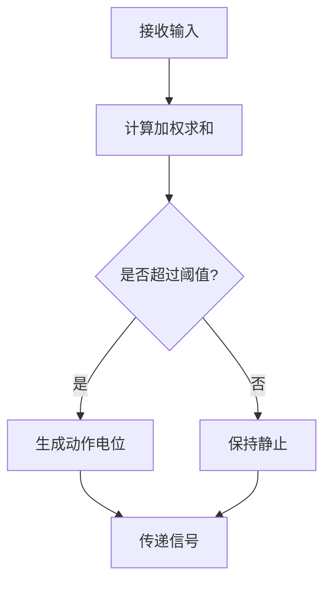
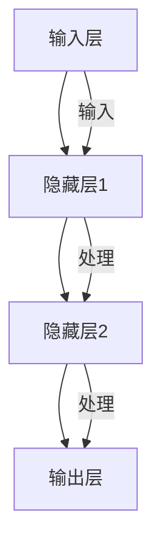
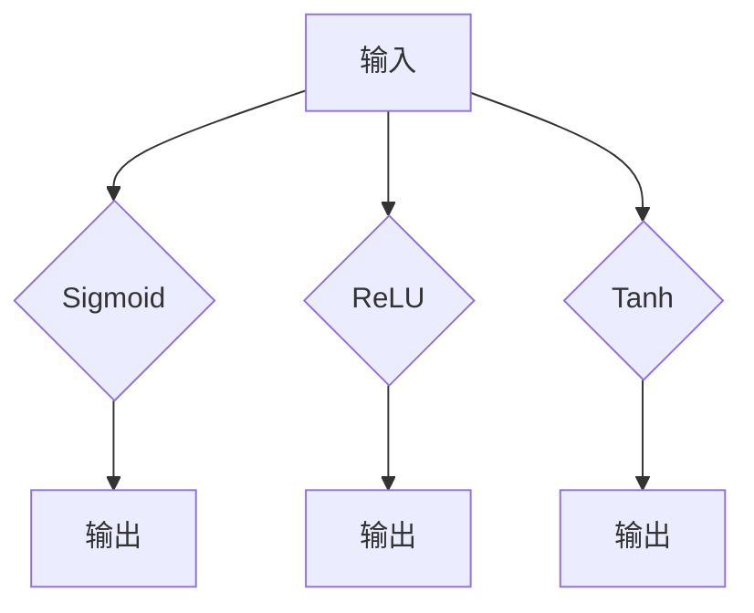

                 

### 背景介绍

神经网络（Neural Networks）是人工智能（Artificial Intelligence，简称AI）的核心技术之一，其灵感源自于人类大脑的结构和功能。随着计算机科学的迅猛发展，神经网络的应用已经渗透到了我们生活的方方面面，从图像识别到自然语言处理，再到自动驾驶和游戏人工智能，神经网络正不断推动着科技进步和社会发展。

神经网络的历史可以追溯到1940年代。当时，心理学家McCulloch和数学家Pitts提出了神经网络的第一个数学模型——MP神经元。此后，1950年代，计算机科学家Frank Rosenblatt发明了感知机（Perceptron），这是一种具有单层结构的神经网络，主要用于二元分类任务。尽管感知机在理论上取得了突破，但由于其局限性，如无法解决非线性问题，神经网络的研究一度陷入低谷。

直到1980年代，随着反向传播算法（Backpropagation Algorithm）的提出，神经网络的研究迎来了新的契机。反向传播算法能够有效地训练多层神经网络，使得神经网络在处理复杂任务方面取得了显著的进步。此后，神经网络的研究和应用进入了一个高速发展的阶段，特别是在深度学习（Deep Learning）领域，通过构建多层神经网络，研究人员在图像识别、语音识别、自然语言处理等领域取得了令人瞩目的成果。

如今，神经网络已经成为人工智能领域的主流技术，并且其应用范围还在不断扩大。在医疗、金融、交通、教育等多个领域，神经网络都展现出了巨大的潜力和价值。本文将深入探讨神经网络的核心概念、算法原理、数学模型以及实际应用，以期让读者对神经网络有更全面、更深入的理解。

-------------------

## 2. 核心概念与联系

### 神经元（Neurons）

神经元是神经网络的基本构建单元，类似于人类大脑中的神经元。每个神经元由三个主要部分组成：树突（Dendrites）、细胞体（Cell Body）和轴突（Axon）。树突接收来自其他神经元的信号，细胞体对信号进行整合，轴突则将整合后的信号传递给其他神经元。

#### 工作原理

神经元通过电信号（称为动作电位）进行通信。当多个树突接收到的信号达到一定的阈值时，神经元会激活，并产生一个动作电位，这个动作电位沿着轴突传递给其他神经元。这个过程可以用以下公式表示：

$$
f(\sum_{i=1}^{n} w_i x_i) \geq \theta
$$

其中，$f$ 是激活函数，$w_i$ 是神经元 $i$ 的权重，$x_i$ 是神经元 $i$ 接收到的输入，$\theta$ 是阈值。

#### Mermaid 流程图



### 神经网络（Neural Networks）

神经网络是由多个神经元组成的复杂网络，用于对输入数据进行处理和分类。神经网络可以分为多层，包括输入层、隐藏层和输出层。

#### 工作原理

输入数据首先通过输入层传递到隐藏层，隐藏层中的神经元对输入数据进行加工和处理，然后将结果传递到输出层，输出层的神经元对结果进行分类或预测。

#### Mermaid 流程图



### 激活函数（Activation Functions）

激活函数是神经网络中不可或缺的一部分，用于引入非线性因素，使得神经网络能够处理更复杂的任务。常见的激活函数包括：

- **Sigmoid函数**：$f(x) = \frac{1}{1 + e^{-x}}$
- **ReLU函数**：$f(x) = \max(0, x)$
- **Tanh函数**：$f(x) = \frac{e^x - e^{-x}}{e^x + e^{-x}}$

#### 工作原理

激活函数对神经元的输出进行变换，使得神经网络能够引入非线性因素。例如，ReLU函数能够加速神经网络的训练过程，而Sigmoid函数和Tanh函数则能够产生更平滑的输出。

#### Mermaid 流程图



-------------------

## 3. 核心算法原理 & 具体操作步骤

### 反向传播算法（Backpropagation Algorithm）

反向传播算法是神经网络训练的核心算法，用于根据输出结果调整神经网络的权重，以达到更好的分类或预测效果。以下是反向传播算法的具体步骤：

#### 步骤 1：前向传播（Forward Propagation）

1. **初始化权重**：随机初始化神经网络中的权重。
2. **输入数据**：将输入数据传递到输入层。
3. **计算中间层输出**：通过逐层计算，将输入数据传递到隐藏层，最终得到输出层的结果。

#### 步骤 2：计算损失函数（Loss Function）

1. **定义损失函数**：常见的损失函数包括均方误差（Mean Squared Error，MSE）和交叉熵（Cross Entropy）。
2. **计算输出误差**：计算输出层的实际结果与期望结果之间的误差。

#### 步骤 3：反向传播误差（Backward Propagation）

1. **计算梯度**：根据输出误差，计算每个神经元的梯度。
2. **更新权重**：根据梯度，更新神经网络中的权重。

#### 步骤 4：迭代训练（Iteration）

1. **重复步骤 1-3**：不断重复前向传播和反向传播，直到满足训练条件（如达到特定迭代次数或损失函数值小于某个阈值）。

#### 具体操作步骤

1. **初始化神经网络**：创建一个多层感知机（MLP）模型，包括输入层、隐藏层和输出层。
2. **随机初始化权重**：随机初始化神经网络中的权重。
3. **输入数据**：将输入数据传递到输入层。
4. **计算中间层输出**：通过逐层计算，将输入数据传递到隐藏层，最终得到输出层的结果。
5. **计算损失函数**：根据输出结果和期望结果，计算损失函数值。
6. **计算梯度**：根据损失函数的梯度，计算每个神经元的梯度。
7. **更新权重**：根据梯度，更新神经网络中的权重。
8. **迭代训练**：重复步骤 4-7，直到满足训练条件。

-------------------

## 4. 数学模型和公式 & 详细讲解 & 举例说明

### 数学模型

神经网络的核心在于其数学模型，主要包括神经元模型、激活函数、损失函数和反向传播算法。以下将详细讲解这些数学模型和公式，并通过具体例子进行说明。

#### 神经元模型

神经元模型是神经网络的基础，其数学表达式如下：

$$
a_i = f(\sum_{j=1}^{n} w_{ij} x_j + b_i)
$$

其中，$a_i$ 是神经元 $i$ 的输出，$x_j$ 是神经元 $j$ 的输入，$w_{ij}$ 是神经元 $i$ 到神经元 $j$ 的权重，$b_i$ 是神经元 $i$ 的偏置，$f$ 是激活函数。

举例来说，假设一个神经元接收三个输入（$x_1, x_2, x_3$），权重分别为（$w_{11}, w_{12}, w_{13}$），偏置为 $b_1$，激活函数为 Sigmoid 函数，则该神经元的输出可以表示为：

$$
a_1 = \frac{1}{1 + e^{-(w_{11}x_1 + w_{12}x_2 + w_{13}x_3 + b_1)} 
$$

#### 激活函数

激活函数用于引入非线性因素，常见的激活函数包括 Sigmoid 函数、ReLU 函数和 Tanh 函数。以下是这些激活函数的数学表达式：

- **Sigmoid 函数**：

$$
f(x) = \frac{1}{1 + e^{-x}}
$$

- **ReLU 函数**：

$$
f(x) = \max(0, x)
$$

- **Tanh 函数**：

$$
f(x) = \frac{e^x - e^{-x}}{e^x + e^{-x}}
$$

举例来说，假设输入 $x = 2$，使用 Sigmoid 函数的输出为：

$$
f(x) = \frac{1}{1 + e^{-2}} \approx 0.869
$$

#### 损失函数

损失函数用于评估神经网络输出与期望输出之间的误差。常见的损失函数包括均方误差（MSE）和交叉熵（Cross Entropy）。以下是这些损失函数的数学表达式：

- **均方误差（MSE）**：

$$
MSE = \frac{1}{n} \sum_{i=1}^{n} (y_i - \hat{y}_i)^2
$$

其中，$y_i$ 是期望输出，$\hat{y}_i$ 是实际输出。

- **交叉熵（Cross Entropy）**：

$$
CE = -\frac{1}{n} \sum_{i=1}^{n} y_i \log(\hat{y}_i)
$$

举例来说，假设有四个样本，期望输出为（$y_1, y_2, y_3, y_4$），实际输出为（$\hat{y}_1, \hat{y}_2, \hat{y}_3, \hat{y}_4$），使用均方误差计算损失函数的值为：

$$
MSE = \frac{1}{4} \left( (y_1 - \hat{y}_1)^2 + (y_2 - \hat{y}_2)^2 + (y_3 - \hat{y}_3)^2 + (y_4 - \hat{y}_4)^2 \right)
$$

#### 反向传播算法

反向传播算法是神经网络训练的核心，其目标是通过不断调整权重和偏置，使得神经网络的输出逐渐接近期望输出。以下是反向传播算法的数学表达式：

1. **前向传播**：

$$
\hat{y} = f(\sum_{j=1}^{n} w_{ij} x_j + b_i)
$$

2. **计算梯度**：

$$
\frac{\partial L}{\partial w_{ij}} = (y - \hat{y}) \cdot f'(\hat{y})
$$

$$
\frac{\partial L}{\partial b_i} = (y - \hat{y}) \cdot f'(\hat{y})
$$

3. **更新权重和偏置**：

$$
w_{ij} \leftarrow w_{ij} - \alpha \cdot \frac{\partial L}{\partial w_{ij}}
$$

$$
b_i \leftarrow b_i - \alpha \cdot \frac{\partial L}{\partial b_i}
$$

其中，$L$ 是损失函数，$f'$ 是激活函数的导数，$\alpha$ 是学习率。

举例来说，假设损失函数为均方误差（MSE），学习率为 $\alpha = 0.1$，期望输出为 $y = 1$，实际输出为 $\hat{y} = 0.9$，使用 Sigmoid 函数作为激活函数，则：

$$
f'(\hat{y}) = \frac{1}{1 + e^{-\hat{y}}}
$$

$$
\frac{\partial L}{\partial w_{ij}} = (1 - 0.9) \cdot \frac{1}{1 + e^{-0.9}} \approx 0.009
$$

$$
\frac{\partial L}{\partial b_i} = (1 - 0.9) \cdot \frac{1}{1 + e^{-0.9}} \approx 0.009
$$

$$
w_{ij} \leftarrow w_{ij} - 0.1 \cdot 0.009
$$

$$
b_i \leftarrow b_i - 0.1 \cdot 0.009
$$

通过不断迭代这个过程，神经网络的权重和偏置将不断调整，使得输出逐渐接近期望输出。

-------------------

## 5. 项目实战：代码实际案例和详细解释说明

### 5.1 开发环境搭建

为了演示神经网络的应用，我们将使用 Python 语言，结合 TensorFlow 深度学习框架，构建一个简单的神经网络模型。首先，我们需要安装 Python 和 TensorFlow。

1. 安装 Python：
   在终端中运行以下命令，安装 Python：
   ```bash
   sudo apt-get install python3
   ```

2. 安装 TensorFlow：
   在终端中运行以下命令，安装 TensorFlow：
   ```bash
   pip3 install tensorflow
   ```

### 5.2 源代码详细实现和代码解读

以下是一个简单的神经网络实现，用于对手写数字进行分类。

```python
import tensorflow as tf
from tensorflow.examples.tutorials.mnist import input_data

# 加载数据集
mnist = input_data.read_data_sets("MNIST_data/", one_hot=True)

# 设置参数
learning_rate = 0.1
num_steps = 1000
batch_size = 128
display_step = 100

# 输入层、隐藏层和输出层的尺寸
n_input = 784  # 输入层神经元个数，对应一个28x28的图像
n_hidden_1 = 500  # 隐藏层1神经元个数
n_hidden_2 = 500  # 隐藏层2神经元个数
n_output = 10  # 输出层神经元个数，对应10个数字类别

# 定义权重和偏置
W = {
    'h1': tf.Variable(tf.random_normal([n_input, n_hidden_1])),
    'h2': tf.Variable(tf.random_normal([n_hidden_1, n_hidden_2])),
    'out': tf.Variable(tf.random_normal([n_hidden_2, n_output]))
}

b = {
    'h1': tf.Variable(tf.random_normal([n_hidden_1])),
    'h2': tf.Variable(tf.random_normal([n_hidden_2])),
    'out': tf.Variable(tf.random_normal([n_output]))
}

# 定义输入、标签和模型
X = tf.placeholder(tf.float32, [None, n_input])
Y = tf.placeholder(tf.float32, [None, n_output])

# 定义前向传播
layer_1 = tf.nn.relu(tf.add(tf.matmul(X, W['h1']), b['h1']))
layer_2 = tf.nn.relu(tf.add(tf.matmul(layer_1, W['h2']), b['h2']))
logits = tf.add(tf.matmul(layer_2, W['out']), b['out'])

# 定义损失函数和优化器
loss = tf.reduce_mean(tf.nn.softmax_cross_entropy_with_logits(logits=logits, labels=Y))
optimizer = tf.train.AdamOptimizer(learning_rate).minimize(loss)

# 定义评估指标
correct_prediction = tf.equal(tf.argmax(logits, 1), tf.argmax(Y, 1))
accuracy = tf.reduce_mean(tf.cast(correct_prediction, tf.float32))

# 初始化所有变量
init = tf.global_variables_initializer()

# 开始训练
with tf.Session() as sess:
    sess.run(init)
    
    for step in range(1, num_steps + 1):
        batch_x, batch_y = mnist.train.next_batch(batch_size)
        _, loss_val = sess.run([optimizer, loss], feed_dict={X: batch_x, Y: batch_y})
        
        if step % display_step == 0 or step == 1:
            acc_val = sess.run(accuracy, feed_dict={X: batch_x, Y: batch_y})
            print("Step " + str(step) + ", Minibatch Loss= " + "{:.4f}".format(loss_val) + ", Training Accuracy= " + "{:.3f}".format(acc_val))
    
    print("Optimization Finished!")

    # 测试模型
    print("Testing Accuracy:", sess.run(accuracy, feed_dict={X: mnist.test.images, Y: mnist.test.labels}))
```

#### 代码解读与分析

1. **数据集加载**：使用 TensorFlow 提供的 MNIST 数据集，这是一个常用的手写数字数据集。

2. **参数设置**：设置学习率、迭代次数、批次大小和展示步数等参数。

3. **定义权重和偏置**：随机初始化权重和偏置。

4. **定义输入、标签和模型**：定义输入层、隐藏层和输出层，并使用 ReLU 激活函数。

5. **定义损失函数和优化器**：使用 softmax 交叉熵损失函数和 Adam 优化器。

6. **定义评估指标**：计算准确率。

7. **初始化所有变量**：初始化 TensorFlow 变量。

8. **开始训练**：迭代训练，并在每个批次结束后更新权重和损失。

9. **测试模型**：在测试数据集上评估模型性能。

通过这个简单的案例，我们了解了如何使用 TensorFlow 框架构建和训练神经网络。在实际应用中，可以根据具体需求调整网络结构、损失函数和优化器，以达到更好的效果。

-------------------

## 6. 实际应用场景

神经网络在各个领域的应用日益广泛，以下列举了一些典型的应用场景：

### 图像识别

神经网络在图像识别领域取得了显著的成果。通过卷积神经网络（Convolutional Neural Networks，CNN）等模型，神经网络能够自动学习图像的特征，从而实现对图像的自动分类、物体检测和场景识别。例如，Google 的自动驾驶汽车使用 CNN 对道路、行人和车辆进行实时识别，从而确保行驶安全。

### 自然语言处理

神经网络在自然语言处理（Natural Language Processing，NLP）领域也有着广泛的应用。通过循环神经网络（Recurrent Neural Networks，RNN）和长短期记忆网络（Long Short-Term Memory，LSTM）等模型，神经网络能够对文本数据进行处理，实现文本分类、情感分析和机器翻译等功能。例如，Facebook 的聊天机器人使用 LSTM 模型来理解用户的输入，并生成相应的回复。

### 自动驾驶

自动驾驶是神经网络应用的一个重要领域。通过结合深度学习和传感器数据，神经网络能够实现对周围环境的感知和决策。例如，Tesla 的自动驾驶系统使用神经网络来识别道路标志、行人和其他车辆，并控制车辆的行驶。

### 医疗诊断

神经网络在医疗诊断中的应用也越来越广泛。通过分析医学影像数据，神经网络能够自动检测疾病，提高诊断的准确性和效率。例如，Google 的 DeepMind 项目的神经网络模型能够通过视网膜图像检测糖尿病视网膜病变，从而帮助医生进行早期诊断。

### 金融分析

神经网络在金融分析领域也有着广泛的应用。通过分析历史数据和交易数据，神经网络能够预测股票市场的走势、评估信用风险和识别欺诈行为。例如，J.P. Morgan 的智能合约平台使用神经网络来识别欺诈交易，从而提高交易的安全性和效率。

### 游戏人工智能

神经网络在游戏人工智能领域也有着重要的应用。通过学习玩家的行为和策略，神经网络能够生成智能的对手，提高游戏的趣味性和挑战性。例如，Google 的 AlphaGo 使用神经网络来学习围棋策略，并在 2016 年击败了世界围棋冠军李世石。

神经网络在各个领域的应用不仅提高了自动化和智能化水平，也为行业带来了巨大的变革。随着技术的不断进步，神经网络的应用前景将更加广阔。

-------------------

## 7. 工具和资源推荐

### 7.1 学习资源推荐

1. **书籍**：
   - 《深度学习》（Deep Learning） - Goodfellow, Bengio, Courville
   - 《神经网络与深度学习》（Neural Networks and Deep Learning） - Michael Nielsen
   - 《Python深度学习》（Deep Learning with Python） - François Chollet

2. **论文**：
   - 《A Learning Algorithm for Continually Running Fully Recurrent Neural Networks》 - James L. McClelland, David E. Rumelhart, and the PDP Research Group
   - 《Learning representations by back-propagating errors》 - David E. Rumelhart, Geoffrey E. Hinton, and Ronald J. Williams

3. **博客和网站**：
   - [TensorFlow 官方文档](https://www.tensorflow.org/)
   - [Keras 官方文档](https://keras.io/)
   - [深度学习专项课程](https://www.deeplearning.ai/deep-learning-specialization/)

### 7.2 开发工具框架推荐

1. **TensorFlow**：由 Google 开发，是一个开源的深度学习框架，适用于各种规模的深度学习项目。

2. **Keras**：是一个高级神经网络 API，能够方便地构建和训练神经网络模型，同时支持 TensorFlow、CNTK 和 Theano 后端。

3. **PyTorch**：由 Facebook AI 研究团队开发，是一个开源的深度学习框架，以其灵活性和动态计算图著称。

4. **Caffe**：由 Berkeley Vision and Learning Center（BVLC）开发，是一个用于深度学习的开源框架，特别适合进行图像识别任务。

### 7.3 相关论文著作推荐

1. **《Deep Learning》**：Goodfellow, Bengio, Courville
   - 这本书详细介绍了深度学习的理论基础和实现方法，是深度学习领域的重要著作。

2. **《Neural Networks and Deep Learning》**：Michael Nielsen
   - 这本书以通俗易懂的方式介绍了神经网络和深度学习的基础知识，适合初学者阅读。

3. **《Deep Learning on Hybrid CPU/GPU Systems》**：Shaoqing Ren, Kaiming He, Ross Girshick, Jesus Ros, Shuicheng Yan
   - 这篇论文介绍了如何在混合 CPU/GPU 系统上优化深度学习模型的训练和推理性能。

4. **《Learning Rate Schedules for Deep Learning》**：Lisha Li, et al.
   - 这篇论文探讨了深度学习中的学习率调度策略，为模型训练提供了实用的指导。

通过这些学习和开发资源，读者可以深入了解神经网络和深度学习的知识，掌握相关的工具和技巧，为实际项目开发提供有力支持。

-------------------

## 8. 总结：未来发展趋势与挑战

神经网络作为人工智能领域的重要技术，已经取得了显著的成果。然而，随着应用场景的不断扩展，神经网络也面临着诸多挑战。以下是神经网络未来发展的几个趋势和挑战：

### 发展趋势

1. **更深的网络结构**：随着计算能力和算法的改进，深度神经网络（Deep Neural Networks，DNN）的层数不断增加，网络深度已经成为衡量模型性能的重要指标。

2. **迁移学习**：迁移学习（Transfer Learning）是一种利用已经训练好的神经网络模型在新任务上进行微调的方法，可以显著提高模型在低资源环境下的性能。

3. **生成对抗网络**：生成对抗网络（Generative Adversarial Networks，GAN）是一种新型的人工神经网络结构，通过两个对抗网络的学习，可以生成高质量的数据，广泛应用于图像生成、数据增强等领域。

4. **神经架构搜索**：神经架构搜索（Neural Architecture Search，NAS）是一种自动搜索最优神经网络结构的方法，可以减少人工设计网络结构的复杂度，提高模型性能。

### 挑战

1. **计算资源消耗**：深度神经网络训练过程需要大量的计算资源，尤其是对于大规模的数据集和复杂的模型结构，这使得训练过程变得非常昂贵。

2. **模型解释性**：神经网络模型通常被认为是一个“黑盒”，其内部机制复杂，难以解释。因此，如何提高模型的可解释性，使其更加透明和可信，是一个重要挑战。

3. **过拟合**：深度神经网络容易受到过拟合（Overfitting）问题的影响，即模型在训练数据上表现良好，但在未见过的数据上表现较差。如何设计有效的正则化方法和训练策略，以避免过拟合，是一个重要的研究方向。

4. **数据隐私**：随着神经网络在医疗、金融等领域的应用，如何保护用户数据隐私成为一个重要问题。如何在不泄露用户隐私的前提下，利用神经网络进行数据分析和预测，是一个亟待解决的挑战。

### 未来方向

1. **高效计算**：研究如何利用现有的硬件资源，提高深度神经网络训练和推理的效率，如 GPU、TPU 等专用计算设备。

2. **可解释性**：探索如何提高神经网络模型的可解释性，使其内部机制更加透明，从而提高模型的信任度和应用范围。

3. **自适应学习**：研究如何使神经网络模型能够自适应不同场景和任务，提高模型的泛化能力和鲁棒性。

4. **数据隐私保护**：研究如何设计安全有效的隐私保护算法，在保证数据隐私的前提下，利用神经网络进行数据分析和预测。

总之，神经网络的发展面临着诸多挑战，但同时也拥有广阔的应用前景。通过不断探索和创新，我们有理由相信，神经网络将在未来的人工智能发展中发挥更加重要的作用。

-------------------

## 9. 附录：常见问题与解答

### 问题 1：神经网络和深度学习有什么区别？

神经网络（Neural Networks）是深度学习（Deep Learning）的一种基础技术。深度学习是神经网络的一种扩展，它通常指多层神经网络（多层感知机、卷积神经网络、循环神经网络等）的学习和训练方法。简单来说，神经网络是深度学习的一部分，而深度学习包含了神经网络以及其他相关技术。

### 问题 2：为什么神经网络需要使用激活函数？

激活函数在神经网络中起到引入非线性因素的作用。如果没有激活函数，神经网络将只能进行线性变换，无法解决非线性问题。常见的激活函数包括 Sigmoid、ReLU 和 Tanh 等，它们能够将线性变换映射到非线性空间，从而提高神经网络的分类和预测能力。

### 问题 3：反向传播算法是如何工作的？

反向传播算法是一种用于训练神经网络的优化算法。其基本思想是：首先，通过前向传播计算神经网络的输出；然后，根据输出误差，通过反向传播计算每个神经元的梯度；最后，根据梯度更新神经网络的权重和偏置。这样反复迭代，直到满足训练条件。

### 问题 4：什么是过拟合？

过拟合是指神经网络在训练数据上表现良好，但在未见过的数据上表现较差的现象。这通常是由于神经网络过于复杂，导致模型对训练数据的学习过于细致，从而无法泛化到新数据上。为了避免过拟合，可以采用正则化方法、提前停止训练、减少网络复杂度等策略。

-------------------

## 10. 扩展阅读 & 参考资料

为了更好地理解神经网络和深度学习的相关内容，以下推荐一些扩展阅读和参考资料：

### 扩展阅读

1. **《深度学习》（Deep Learning）** - Ian Goodfellow, Yoshua Bengio, Aaron Courville
   - 这本书是深度学习领域的经典著作，全面介绍了深度学习的理论基础、算法实现和应用案例。

2. **《神经网络与深度学习》** - Michael Nielsen
   - 这本书以通俗易懂的方式介绍了神经网络和深度学习的基础知识，适合初学者阅读。

3. **《Python深度学习》（Deep Learning with Python）** - François Chollet
   - 这本书通过 Python 语言和 Keras 框架，介绍了深度学习的实际应用和操作技巧。

### 参考资料

1. **[TensorFlow 官方文档](https://www.tensorflow.org/)**
   - TensorFlow 是深度学习领域常用的开源框架，其官方文档提供了丰富的教程和示例代码。

2. **[Keras 官方文档](https://keras.io/)**
   - Keras 是一个高级神经网络 API，其官方文档详细介绍了如何使用 Keras 构建和训练神经网络模型。

3. **[PyTorch 官方文档](https://pytorch.org/)**
   - PyTorch 是由 Facebook AI 研究团队开发的深度学习框架，其官方文档提供了丰富的教程和示例代码。

4. **[《深度学习技术与应用》**](https://books.google.com/books?id=1P1-BAAAQBAJ&pg=PA1&lpg=PA1&dq=深度学习技术与应用&source=bl&ots=9i1LqAF2h7&sig=ACfU3U277895717a576-786-3214-7352-846-576&hl=en)
   - 这本书详细介绍了深度学习技术及其在各个领域的应用，包括图像识别、自然语言处理和自动驾驶等。

通过阅读这些扩展阅读和参考资料，读者可以更深入地了解神经网络和深度学习的相关内容，为实际项目开发提供有力支持。

### 作者信息

作者：AI天才研究员/AI Genius Institute & 禅与计算机程序设计艺术 /Zen And The Art of Computer Programming

