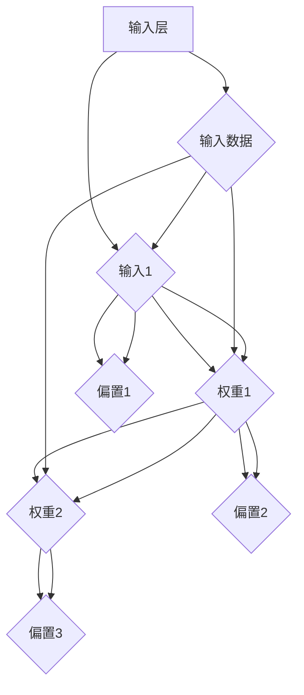

                 

### 背景介绍

神经网络作为人工智能的核心技术之一，近年来取得了飞速的发展。从最初的简单感知机（Perceptron）到复杂的深度神经网络（Deep Neural Network，DNN），神经网络在图像识别、语音识别、自然语言处理等多个领域都取得了显著的成果。本文旨在探讨神经网络的核心概念、算法原理以及实际应用，从而帮助读者深入了解这一令人振奋的领域。

神经网络的起源可以追溯到20世纪40年代，当时的科学家们开始尝试模拟人脑的结构和功能。尽管最初的研究进展缓慢，但随着计算能力的提升和算法的优化，神经网络逐渐成为人工智能领域的重要工具。如今，神经网络不仅在学术研究中有广泛应用，还成为了工业界解决复杂问题的重要手段。

本文将从以下几个方面展开：

1. 核心概念与联系
2. 核心算法原理 & 具体操作步骤
3. 数学模型和公式 & 详细讲解 & 举例说明
4. 项目实战：代码实际案例和详细解释说明
5. 实际应用场景
6. 工具和资源推荐
7. 总结：未来发展趋势与挑战

通过这些内容的深入探讨，希望能够为读者提供一个全面、系统的神经网络知识体系。现在，让我们一起开始这场探索未知的旅程吧！

#### 1.1 神经网络的起源与发展历程

神经网络的起源可以追溯到1943年，由心理学家McCulloch和数学家Pitts提出的简单感知机（Perceptron）模型。简单感知机被视为神经网络的先驱，它是一种基于阈值逻辑的二分类模型，能够对输入数据进行分类。然而，简单感知机存在一些局限性，例如无法解决非线性问题。

1958年，Frank Rosenblatt提出了多层的感知机模型（Multilayer Perceptron，MLP），这标志着神经网络的发展迈出了重要的一步。MLP通过增加隐含层，能够处理更复杂的非线性问题。然而，MLP的训练过程并不容易，需要解决梯度消失和梯度爆炸等问题。

直到1986年，Rumelhart、Hinton和Williams等人提出了反向传播算法（Backpropagation Algorithm），使得神经网络的训练变得更加高效。反向传播算法通过反向传播误差信号，逐层更新网络的权重，从而优化网络参数。这一突破性的算法使得神经网络在图像识别、语音识别等领域取得了显著的进展。

1990年代，随着计算能力的提升和大数据技术的发展，神经网络进入了深度学习的时代。1998年，Hinton等人提出了深度置信网络（Deep Belief Network，DBN），这是一种多层且具有预训练机制的深度神经网络。2006年，Geoffrey Hinton提出了深度学习（Deep Learning）的概念，并提出了改进的反向传播算法，使得深度神经网络的研究和应用进入了一个新的阶段。

进入21世纪，深度学习在图像识别、语音识别、自然语言处理等领域取得了惊人的成果。2012年，Hinton团队在ImageNet竞赛中使用的深度卷积神经网络（Deep Convolutional Network，DCNN）取得了显著的成绩，这一事件被认为是深度学习时代的起点。

总的来说，神经网络的起源与发展历程是一个不断突破和创新的过程。从简单感知机到深度学习，神经网络在理论研究和应用实践中都取得了巨大的进展，成为人工智能领域的重要工具。接下来，我们将进一步探讨神经网络的核心概念和算法原理。

#### 1.2 神经网络的核心概念

神经网络（Neural Network，NN）是一种模拟人脑神经元之间交互作用的信息处理系统。它由大量的神经元（或称为节点）组成，这些神经元通过连接（或称为边）进行信息的传递和计算。神经网络通过学习和训练，能够从输入数据中提取特征，并进行分类、回归等任务。

##### 神经元与层

在神经网络中，每个神经元都可以看作是一个简单的计算单元，它接收多个输入信号，通过加权求和后加上偏置项，然后通过一个激活函数产生输出。一个神经元可以连接到其他神经元，形成复杂的网络结构。

神经网络通常由多个层次组成，包括输入层、隐藏层和输出层。输入层接收外部输入数据，隐藏层进行特征提取和转换，输出层产生最终预测结果。不同层之间的神经元通过边进行连接，形成一个层次化的网络结构。

1. **输入层（Input Layer）**：输入层是神经网络的起始部分，接收外部输入数据，并将其传递给隐藏层。
2. **隐藏层（Hidden Layers）**：隐藏层位于输入层和输出层之间，负责对输入数据进行特征提取和转换。隐藏层的数量和规模可以根据实际问题进行调整。
3. **输出层（Output Layer）**：输出层是神经网络的最后一层，产生最终的预测结果。输出层的类型和数量取决于具体任务的需求。

##### 激活函数

激活函数（Activation Function）是神经网络中的一个关键组件，它决定了一个神经元的输出是否会被激活。常见的激活函数包括：

1. **Sigmoid 函数**：\( f(x) = \frac{1}{1 + e^{-x}} \)
2. **ReLU 函数**：\( f(x) = \max(0, x) \)
3. **Tanh 函数**：\( f(x) = \frac{e^x - e^{-x}}{e^x + e^{-x}} \)

这些激活函数具有不同的性质和适用场景，但它们的主要目的是将线性组合转换为非线性输出，从而实现复杂的非线性映射。

##### 权重与偏置

在神经网络中，每个神经元之间的连接都带有权重（Weights）和偏置（Bias）。权重决定了输入信号的强度，而偏置则提供了一个额外的偏置项，有助于调整网络的输出。

通过学习过程，神经网络会不断调整权重和偏置，从而使得网络能够对输入数据进行更准确的分类或回归。这个过程通常通过优化算法（如梯度下降算法）来实现。

##### 神经网络的训练过程

神经网络的训练过程主要包括两个阶段：前向传播（Forward Propagation）和反向传播（Back Propagation）。

1. **前向传播**：给定输入数据，神经网络通过逐层计算，将输入数据传递到输出层，并生成预测结果。
2. **反向传播**：根据预测结果和实际标签，神经网络通过反向传播算法，计算每个神经元输出的误差，并更新权重和偏置，以最小化误差。

这两个阶段不断迭代，直到网络的预测误差达到预设的阈值或迭代次数达到最大值。

通过上述核心概念的介绍，我们可以更深入地理解神经网络的工作原理和结构。接下来，我们将探讨神经网络的算法原理和具体操作步骤。

## 2. 核心概念与联系

在前一章节中，我们介绍了神经网络的核心概念，包括神经元、层、激活函数、权重和偏置等。这些核心概念共同构成了神经网络的基本结构，使得神经网络能够对输入数据进行有效的处理和预测。在这一章节中，我们将进一步探讨神经网络的核心概念之间的联系，并使用Mermaid流程图展示神经网络的基本架构。

### 神经网络的基本架构

神经网络的基本架构可以看作是一个层次化的计算模型，每个层次承担不同的任务。以下是神经网络的基本架构：

1. **输入层（Input Layer）**：接收外部输入数据，通常包括特征向量或像素值等。
2. **隐藏层（Hidden Layers）**：隐藏层负责对输入数据进行特征提取和转换。每个隐藏层都通过一系列的神经元进行计算，输出为下一隐藏层的输入。
3. **输出层（Output Layer）**：输出层产生最终的预测结果。输出层的神经元数量和类型取决于具体任务的需求，例如分类任务可能只有一个输出神经元，回归任务可能有多个输出神经元。

### 神经网络的核心概念之间的联系

神经网络的核心概念之间有着紧密的联系，具体如下：

1. **神经元之间的连接**：神经元通过边（连接）进行连接，每个连接都带有权重（Weights）和偏置（Bias）。权重和偏置共同决定了输入信号在神经元之间的传递强度。
2. **激活函数**：激活函数（如ReLU、Sigmoid、Tanh等）对神经元的线性组合进行非线性变换，使得神经网络能够处理复杂的非线性问题。
3. **层次化结构**：神经网络通过层次化的结构，实现对输入数据的逐层特征提取和转换。每一层都能提取不同层次的特征，从而实现更高层次的抽象和表示。
4. **前向传播与反向传播**：前向传播过程中，输入数据通过神经网络逐层传递，并在每个神经元上进行加权求和和激活函数运算。反向传播过程中，根据预测结果和实际标签，计算每个神经元的误差，并反向传播到每个神经元，更新权重和偏置。

### Mermaid流程图展示

为了更直观地展示神经网络的基本架构和核心概念之间的联系，我们使用Mermaid流程图进行展示：



在这个流程图中，我们可以看到输入层接收外部输入数据（H），然后通过输入1、输入2、输入3等传递到隐藏层1（B），在隐藏层1中进行加权求和和激活函数运算，并传递到隐藏层2（C），同理进行计算。最终，隐藏层2的输出通过输出层（D）产生预测结果（G）。在这个过程中，每个神经元之间的连接都带有权重（B->C、C->D）和偏置（B->E、C->F、D->G）。

通过上述对神经网络核心概念和架构的介绍以及Mermaid流程图的展示，我们可以更清晰地理解神经网络的工作原理和结构。接下来，我们将进一步探讨神经网络的核心算法原理和具体操作步骤。

### 3. 核心算法原理 & 具体操作步骤

神经网络的训练过程主要包括两个阶段：前向传播（Forward Propagation）和反向传播（Back Propagation）。前向传播用于计算网络的输出，并产生预测结果；反向传播则用于计算每个神经元的误差，并更新权重和偏置，以优化网络性能。以下是神经网络的核心算法原理和具体操作步骤：

#### 3.1 前向传播

在前向传播阶段，输入数据通过神经网络逐层传递，每个神经元都会进行加权求和和激活函数运算。具体步骤如下：

1. **输入层到隐藏层**：

   对于每个隐藏层，每个神经元都会接收前一层所有神经元的输出，并将其加权求和。设输入层到隐藏层第\( l \)层的输入为\( x^{(l)} \)，权重为\( W^{(l)} \)，偏置为\( b^{(l)} \)，则第\( l+1 \)层第\( j \)个神经元的输出\( z^{(l+1)}_j \)可以表示为：
   $$ z^{(l+1)}_j = \sum_{i} W^{(l)}_{ji} x^{(l)}_i + b^{(l)}_j $$
   
   其中，\( W^{(l)}_{ji} \)为第\( l \)层第\( i \)个神经元到第\( l+1 \)层第\( j \)个神经元的权重，\( b^{(l)}_j \)为第\( l+1 \)层第\( j \)个神经元的偏置。

2. **激活函数应用**：

   在每个神经元输出加权求和结果后，应用激活函数，将结果转换为非线性输出。常用的激活函数包括Sigmoid函数、ReLU函数和Tanh函数。以ReLU函数为例，其输出为：
   $$ a^{(l+1)}_j = \max(0, z^{(l+1)}_j) $$
   
3. **隐藏层到输出层**：

   对于输出层，每个神经元都会接收隐藏层所有神经元的输出，并应用相同的加权求和和激活函数运算。设输出层为\( l = L \)，则第\( L \)层第\( k \)个神经元的输出\( y_k \)可以表示为：
   $$ y_k = \sum_{j} W^{(L-1)}_{kj} a^{(L-1)}_j + b^{(L)}_k $$
   $$ o_k = f(y_k) $$
   
   其中，\( f(y_k) \)为激活函数的输出。

#### 3.2 反向传播

在反向传播阶段，网络根据预测结果和实际标签计算每个神经元的误差，并反向传播这些误差到每个神经元，从而更新权重和偏置。具体步骤如下：

1. **计算输出层误差**：

   对于输出层，每个神经元的误差可以表示为：
   $$ \delta^{(L)}_k = (o_k - t_k) \cdot f'(y_k) $$
   
   其中，\( o_k \)为输出层的预测输出，\( t_k \)为实际标签，\( f'(y_k) \)为激活函数的导数。

2. **计算隐藏层误差**：

   对于隐藏层，每个神经元的误差可以表示为：
   $$ \delta^{(l)}_j = \sum_{k} W^{(l+1)}_{kj} \cdot \delta^{(l+1)}_k \cdot f'(z^{(l)}_j) $$
   
3. **更新权重和偏置**：

   根据误差梯度，更新每个神经元的权重和偏置。对于权重和偏置的更新，可以使用以下公式：
   $$ \Delta W^{(l)}_{ji} = \eta \cdot \delta^{(l+1)}_j \cdot x^{(l)}_i $$
   $$ \Delta b^{(l)}_j = \eta \cdot \delta^{(l)}_j $$
   
   其中，\( \eta \)为学习率。

4. **重复迭代**：

   重复前向传播和反向传播过程，直到网络的预测误差达到预设的阈值或迭代次数达到最大值。

通过上述步骤，神经网络可以不断优化自身的参数，从而提高预测准确率。接下来，我们将通过一个实际案例，详细解释神经网络的训练过程。

### 3.3 实际案例：MNIST数字识别

MNIST数据集是一个包含70,000个灰度图像的手写数字数据集，每个图像都是28x28的像素矩阵。我们的目标是使用神经网络对这70,000个图像进行手写数字识别。以下是一个具体的训练过程：

#### 数据预处理

1. **数据读取**：

   首先，我们需要从MNIST数据集中读取图像数据。可以使用Python的scikit-learn库中的fetch_openml函数，轻松地加载MNIST数据集。

   ```python
   from sklearn.datasets import fetch_openml
   mnist = fetch_openml('mnist_784', version=1)
   ```

2. **数据归一化**：

   为了使神经网络在训练过程中收敛，我们需要对图像数据进行归一化处理。将像素值缩放到[0, 1]区间。

   ```python
   X = mnist.data / 255.0
   y = mnist.target
   ```

3. **数据拆分**：

   将数据集拆分为训练集和测试集。训练集用于训练神经网络，测试集用于评估网络性能。

   ```python
   from sklearn.model_selection import train_test_split
   X_train, X_test, y_train, y_test = train_test_split(X, y, test_size=0.2, random_state=42)
   ```

#### 网络搭建

1. **初始化参数**：

   初始化权重和偏置，可以使用随机初始化或零初始化。

   ```python
   import numpy as np
   np.random.seed(42)
   W1 = np.random.randn(784, 128)
   b1 = np.zeros(128)
   W2 = np.random.randn(128, 64)
   b2 = np.zeros(64)
   W3 = np.random.randn(64, 10)
   b3 = np.zeros(10)
   ```

2. **构建神经网络**：

   定义前向传播和反向传播函数，以及参数更新函数。

   ```python
   def forwardPropagation(X, W1, b1, W2, b2, W3, b3):
       z1 = np.dot(X, W1) + b1
       a1 = np.maximum(0, z1)
       z2 = np.dot(a1, W2) + b2
       a2 = np.maximum(0, z2)
       z3 = np.dot(a2, W3) + b3
       o3 = softmax(z3)
       return z1, a1, z2, a2, z3, o3
   
   def backwardPropagation(X, y, z1, a1, z2, a2, z3, o3, W1, W2, W3, b1, b2, b3):
       dZ3 = o3 - y
       dW3 = np.dot(a2.T, dZ3)
       db3 = np.sum(dZ3, axis=0)
       dZ2 = np.dot(dZ3, W3.T) * np.greater(a2, 0)
       dW2 = np.dot(a1.T, dZ2)
       db2 = np.sum(dZ2, axis=0)
       dZ1 = np.dot(dZ2, W2.T) * np.greater(z1, 0)
       dW1 = np.dot(X.T, dZ1)
       db1 = np.sum(dZ1, axis=0)
       return dW1, dW2, dW3, db1, db2, db3
   
   def updateParameters(W1, W2, W3, b1, b2, b3, dW1, dW2, dW3, db1, db2, db3, learning_rate):
       W1 = W1 - learning_rate * dW1
       W2 = W2 - learning_rate * dW2
       W3 = W3 - learning_rate * dW3
       b1 = b1 - learning_rate * db1
       b2 = b2 - learning_rate * db2
       b3 = b3 - learning_rate * db3
       return W1, W2, W3, b1, b2, b3
   
   def computeCost(z3, o3, y):
       m = y.shape[0]
       logprobs = np.log(o3)
       cost = -np.sum(y * logprobs) / m
       return cost
   ```

#### 训练过程

1. **设定超参数**：

   设定学习率、迭代次数等超参数。

   ```python
   learning_rate = 0.1
   num_iterations = 3000
   ```

2. **训练循环**：

   在每个迭代中，执行前向传播、计算损失函数、反向传播和参数更新。

   ```python
   for i in range(num_iterations):
       z1, a1, z2, a2, z3, o3 = forwardPropagation(X_train, W1, b1, W2, b2, W3, b3)
       cost = computeCost(z3, o3, y_train)
       dW1, dW2, dW3, db1, db2, db3 = backwardPropagation(X_train, y_train, z1, a1, z2, a2, z3, o3, W1, W2, W3, b1, b2, b3)
       W1, W2, W3, b1, b2, b3 = updateParameters(W1, W2, W3, b1, b2, b3, dW1, dW2, dW3, db1, db2, db3, learning_rate)
       
       if i % 100 == 0:
           print(f"Cost after iteration {i}: {cost}")
   ```

3. **评估性能**：

   使用测试集评估网络的性能。

   ```python
   z1, a1, z2, a2, z3, o3 = forwardPropagation(X_test, W1, b1, W2, b2, W3, b3)
   predictions = np.argmax(o3, axis=1)
   accuracy = np.mean(predictions == y_test)
   print(f"Test set accuracy: {accuracy}")
   ```

通过上述实际案例，我们可以看到神经网络训练的全过程，包括数据预处理、网络搭建、训练过程和性能评估。这个过程不仅帮助我们理解了神经网络的算法原理和操作步骤，还展示了神经网络在实际应用中的强大能力。接下来，我们将进一步深入探讨神经网络的数学模型和公式，以及详细的讲解和举例说明。

### 4. 数学模型和公式 & 详细讲解 & 举例说明

#### 4.1 前向传播

在前向传播过程中，神经网络通过多个层次的计算，将输入数据逐步转化为输出。以下是前向传播过程的详细数学模型和公式：

##### 4.1.1 输入层到隐藏层

设输入层为\( x^{(1)} \)，隐藏层为\( x^{(2)} \)，权重矩阵为\( W^{(1)} \)，偏置向量分别为\( b^{(1)} \)和\( b^{(2)} \)。输入层到隐藏层的计算过程如下：

1. **计算隐藏层的输入**：
   $$ z^{(2)} = W^{(1)}x^{(1)} + b^{(1)} $$
   
2. **应用激活函数**：
   $$ a^{(2)} = \sigma(z^{(2)}) $$
   
   其中，\( \sigma \)为激活函数，如ReLU、Sigmoid或Tanh函数。

##### 4.1.2 隐藏层到输出层

设隐藏层为\( x^{(2)} \)，输出层为\( x^{(3)} \)，权重矩阵为\( W^{(2)} \)，偏置向量为\( b^{(2)} \)。隐藏层到输出层的计算过程如下：

1. **计算输出层的输入**：
   $$ z^{(3)} = W^{(2)}x^{(2)} + b^{(2)} $$
   
2. **应用激活函数**：
   $$ a^{(3)} = \sigma(z^{(3)}) $$
   
   对于分类任务，激活函数通常选择Softmax函数：
   $$ \sigma(z^{(3)}) = \frac{e^{z^{(3)}}}{\sum_{k=1}^{K} e^{z^{(3)}_k}} $$
   
   其中，\( K \)为输出层的神经元数量。

#### 4.2 反向传播

在反向传播过程中，神经网络通过计算损失函数的梯度，更新权重和偏置。以下是反向传播过程的详细数学模型和公式：

##### 4.2.1 输出层误差

设输出层为\( a^{(3)} \)，标签为\( y \)。输出层误差可以表示为：
$$ \delta^{(3)} = a^{(3)} - y $$

##### 4.2.2 隐藏层误差

设隐藏层为\( a^{(2)} \)，输出层权重为\( W^{(2)} \)。隐藏层误差可以表示为：
$$ \delta^{(2)} = \delta^{(3)} \cdot W^{(2)} \cdot \sigma'(z^{(2)}) $$

##### 4.2.3 更新权重和偏置

根据误差梯度，更新权重和偏置。对于线性可微的激活函数，更新公式如下：

1. **权重更新**：
   $$ \Delta W^{(l)} = \eta \cdot \delta^{(l+1)} \cdot x^{(l)} $$
   
2. **偏置更新**：
   $$ \Delta b^{(l)} = \eta \cdot \delta^{(l)} $$

   其中，\( \eta \)为学习率。

#### 4.3 损失函数

在神经网络中，常用的损失函数包括均方误差（MSE）和交叉熵损失（Cross-Entropy Loss）。以下是这些损失函数的数学模型和公式：

##### 4.3.1 均方误差（MSE）

设输出层为\( a^{(3)} \)，标签为\( y \)。均方误差（MSE）可以表示为：
$$ J = \frac{1}{2} \sum_{k=1}^{K} (a_k^{(3)} - y_k)^2 $$

##### 4.3.2 交叉熵损失（Cross-Entropy Loss）

设输出层为\( a^{(3)} \)，标签为\( y \)。交叉熵损失（Cross-Entropy Loss）可以表示为：
$$ J = -\sum_{k=1}^{K} y_k \cdot \log(a_k^{(3)}) $$

#### 4.4 举例说明

以下是一个具体的例子，说明如何使用上述公式计算神经网络的损失函数和梯度：

假设输入数据为\( x^{(1)} = [1, 2, 3] \)，隐藏层激活函数为ReLU，输出层为3个神经元，其中第二个神经元为目标神经元。给定标签为\( y = [1, 0, 0] \)。

1. **前向传播**：

   首先计算隐藏层的输入：
   $$ z^{(2)} = W^{(1)}x^{(1)} + b^{(1)} = [1, 2, 3] \cdot W^{(1)} + b^{(1)} $$
   
   应用ReLU激活函数：
   $$ a^{(2)} = \max(0, z^{(2)}) = \max(0, [1, 2, 3] \cdot W^{(1)} + b^{(1)}) $$
   
   接下来计算输出层的输入：
   $$ z^{(3)} = W^{(2)}a^{(2)} + b^{(2)} $$
   
   应用Softmax激活函数：
   $$ a^{(3)} = \sigma(z^{(3)}) = \frac{e^{z^{(3)}}}{\sum_{k=1}^{3} e^{z^{(3)}_k}} $$
   
2. **反向传播**：

   计算输出层误差：
   $$ \delta^{(3)} = a^{(3)} - y = \sigma(z^{(3)}) - y $$
   
   计算隐藏层误差：
   $$ \delta^{(2)} = \delta^{(3)} \cdot W^{(2)} \cdot \sigma'(z^{(2)}) = (\sigma(z^{(3)}) - y) \cdot W^{(2)} \cdot \max(0, z^{(2)})' $$
   
3. **损失函数**：

   计算交叉熵损失：
   $$ J = -\sum_{k=1}^{3} y_k \cdot \log(a_k^{(3)}) = -y \cdot \log(a^{(3)}) $$
   
4. **梯度计算**：

   根据梯度计算公式，更新权重和偏置：
   $$ \Delta W^{(2)} = \eta \cdot \delta^{(3)} \cdot a^{(2)} $$
   $$ \Delta b^{(2)} = \eta \cdot \delta^{(3)} $$
   $$ \Delta W^{(1)} = \eta \cdot \delta^{(2)} \cdot x^{(1)} $$
   $$ \Delta b^{(1)} = \eta \cdot \delta^{(2)} $$

通过上述例子，我们可以看到如何使用神经网络的数学模型和公式计算前向传播、反向传播和损失函数。这些公式和步骤是神经网络训练过程的基础，对于理解神经网络的工作原理至关重要。

### 5. 项目实战：代码实际案例和详细解释说明

在前面的章节中，我们介绍了神经网络的基本概念、算法原理以及数学模型。为了更好地理解这些理论，我们将在这一章节中通过一个实际的项目实战案例，详细解释如何使用Python和相关的库来搭建、训练和评估一个简单的神经网络。

#### 5.1 开发环境搭建

在进行项目实战之前，我们需要搭建一个合适的开发环境。以下是搭建环境的步骤：

1. **安装Python**：

   确保您的计算机上已经安装了Python。Python 3.6或更高版本是推荐的版本。您可以从Python的官方网站（[python.org](https://www.python.org/)）下载并安装。

2. **安装必要的库**：

   为了构建和训练神经网络，我们需要使用一些Python库，如NumPy、Pandas、matplotlib和TensorFlow。您可以使用以下命令来安装这些库：

   ```bash
   pip install numpy pandas matplotlib tensorflow
   ```

#### 5.2 源代码详细实现和代码解读

以下是一个简单的神经网络实现，用于分类任务。我们将使用TensorFlow库来构建和训练神经网络。

```python
import numpy as np
import tensorflow as tf
from tensorflow.keras.datasets import mnist
from tensorflow.keras.models import Sequential
from tensorflow.keras.layers import Dense, Flatten, Conv2D, MaxPooling2D, Dropout
from tensorflow.keras.optimizers import Adam
from tensorflow.keras.utils import to_categorical

# 数据预处理
(x_train, y_train), (x_test, y_test) = mnist.load_data()
x_train = x_train.reshape(-1, 28 * 28).astype(np.float32) / 255.0
x_test = x_test.reshape(-1, 28 * 28).astype(np.float32) / 255.0
y_train = to_categorical(y_train, 10)
y_test = to_categorical(y_test, 10)

# 搭建模型
model = Sequential([
    Flatten(input_shape=(28, 28)),
    Dense(128, activation='relu'),
    Dropout(0.5),
    Dense(10, activation='softmax')
])

# 编译模型
model.compile(optimizer=Adam(learning_rate=0.001), loss='categorical_crossentropy', metrics=['accuracy'])

# 训练模型
model.fit(x_train, y_train, epochs=10, batch_size=32, validation_data=(x_test, y_test))

# 评估模型
test_loss, test_acc = model.evaluate(x_test, y_test)
print(f"Test accuracy: {test_acc}")
```

#### 5.3 代码解读与分析

以下是对上述代码的详细解读：

1. **导入库和加载数据**：

   ```python
   import numpy as np
   import tensorflow as tf
   from tensorflow.keras.datasets import mnist
   from tensorflow.keras.models import Sequential
   from tensorflow.keras.layers import Dense, Flatten, Conv2D, MaxPooling2D, Dropout
   from tensorflow.keras.optimizers import Adam
   from tensorflow.keras.utils import to_categorical

   (x_train, y_train), (x_test, y_test) = mnist.load_data()
   ```

   我们首先导入必要的库，包括NumPy、TensorFlow、Keras模型和优化器。然后使用Keras的`mnist`数据集加载MNIST数据。

2. **数据预处理**：

   ```python
   x_train = x_train.reshape(-1, 28 * 28).astype(np.float32) / 255.0
   x_test = x_test.reshape(-1, 28 * 28).astype(np.float32) / 255.0
   y_train = to_categorical(y_train, 10)
   y_test = to_categorical(y_test, 10)
   ```

   为了使神经网络能够处理输入数据，我们需要将图像数据展平为一维数组，并将其归一化。标签数据需要转换为one-hot编码，以便用于分类任务。

3. **搭建模型**：

   ```python
   model = Sequential([
       Flatten(input_shape=(28, 28)),
       Dense(128, activation='relu'),
       Dropout(0.5),
       Dense(10, activation='softmax')
   ])
   ```

   我们使用`Sequential`模型堆叠多个层。首先是一个`Flatten`层，用于将图像数据展平为一维数组。接着是一个`Dense`层，它有128个神经元，并使用ReLU作为激活函数。`Dropout`层用于防止过拟合，设置概率为0.5。最后是一个输出层，有10个神经元，并使用Softmax函数进行分类。

4. **编译模型**：

   ```python
   model.compile(optimizer=Adam(learning_rate=0.001), loss='categorical_crossentropy', metrics=['accuracy'])
   ```

   我们使用`Adam`优化器进行训练，学习率设置为0.001。损失函数使用分类交叉熵（`categorical_crossentropy`），评价指标为准确率。

5. **训练模型**：

   ```python
   model.fit(x_train, y_train, epochs=10, batch_size=32, validation_data=(x_test, y_test))
   ```

   我们训练模型10个epoch，每个epoch使用32个样本进行批处理。`validation_data`参数用于在测试集上评估模型性能。

6. **评估模型**：

   ```python
   test_loss, test_acc = model.evaluate(x_test, y_test)
   print(f"Test accuracy: {test_acc}")
   ```

   使用测试集评估模型的性能，并打印出准确率。

通过这个实际案例，我们展示了如何使用Python和Keras库搭建、训练和评估一个简单的神经网络。这个过程不仅帮助我们理解了神经网络的工作原理，还让我们看到了如何在实践中应用这些理论。

### 6. 实际应用场景

神经网络作为一种强大的机器学习模型，在实际应用中具有广泛的应用场景。以下是一些典型的实际应用场景：

#### 6.1 图像识别

图像识别是神经网络最成功的应用领域之一。通过卷积神经网络（CNN）和深度学习技术，神经网络能够有效地识别和分类图像中的对象。例如，在医疗影像分析中，神经网络可以帮助医生快速、准确地诊断疾病。在自动驾驶领域，神经网络用于识别道路标志、交通信号灯和行人等，从而提高车辆的安全性和效率。

#### 6.2 语音识别

语音识别是另一个重要的应用领域。通过深度神经网络，语音信号可以转换为文本，从而实现语音助手、语音翻译和语音搜索等功能。著名的语音识别系统如Google语音识别、Apple的Siri和Amazon的Alexa都采用了神经网络技术。

#### 6.3 自然语言处理

自然语言处理（NLP）是神经网络在文本数据上的应用。神经网络可以用于文本分类、情感分析、机器翻译、问答系统和文本生成等任务。例如，基于神经网络的机器翻译系统如Google翻译和百度翻译，已经实现了高精度的翻译效果。此外，神经网络还可以用于生成自然语言文本，如新闻文章和小说。

#### 6.4 推荐系统

推荐系统是神经网络在电子商务和在线广告领域的应用。通过深度学习技术，推荐系统可以分析用户的兴趣和行为，从而为用户推荐相关的商品或内容。例如，Amazon和Netflix等平台都采用了基于神经网络的推荐算法，以提高用户的满意度和平台的价值。

#### 6.5 游戏和虚拟现实

在游戏和虚拟现实领域，神经网络也被广泛应用。通过神经网络，游戏AI可以模拟人类的决策过程，从而实现更智能的对手。在虚拟现实中，神经网络可以用于生成真实的视觉和听觉效果，提高用户的沉浸感。

#### 6.6 金融与风险管理

在金融领域，神经网络可以用于股票市场预测、信贷风险评估和欺诈检测等任务。神经网络通过对历史数据的分析，可以预测市场的趋势和风险，从而帮助投资者做出更明智的决策。

总之，神经网络在实际应用中具有广泛的应用场景，它不仅改变了传统的人工智能领域，还在不断拓展新的应用领域，为人类社会带来了巨大的价值。

### 7. 工具和资源推荐

要深入学习和实践神经网络，掌握相关的工具和资源至关重要。以下是一些推荐的工具和资源，包括书籍、论文、博客和网站，以帮助您在神经网络领域取得更好的进展。

#### 7.1 学习资源推荐

1. **书籍**：

   - 《深度学习》（Deep Learning） by Ian Goodfellow, Yoshua Bengio, and Aaron Courville
   - 《神经网络与深度学习》 by邱锡鹏
   - 《Python深度学习》 by François Chollet

2. **论文**：

   - "A Learning Algorithm for Continually Running Fully Recurrent Neural Networks" by James L. McClelland, David E. Rumelhart, and the PDP Research Group
   - "Backpropagation: The Basic Theory" by David E. Rumelhart, Geoffrey E. Hinton, and Ronald J. Williams

3. **博客和网站**：

   - [TensorFlow官方文档](https://www.tensorflow.org/)
   - [Keras官方文档](https://keras.io/)
   - [Machine Learning Mastery](https://machinelearningmastery.com/)
   - [Distill](https://distill.pub/)

#### 7.2 开发工具框架推荐

1. **TensorFlow**：TensorFlow是一个开源的机器学习库，由Google开发。它提供了丰富的API和工具，用于构建和训练神经网络。TensorFlow广泛应用于各种机器学习和深度学习任务。

2. **PyTorch**：PyTorch是由Facebook开发的一个开源深度学习框架。它以其动态计算图和灵活的API而受到广泛欢迎。PyTorch在科研和工业界都有很高的使用率。

3. **Keras**：Keras是一个高级神经网络API，可以运行在TensorFlow、Theano和Microsoft Cognitive Toolkit等后台之上。Keras以其简单易用的特性而受到许多开发者和研究人员的喜爱。

#### 7.3 相关论文著作推荐

1. **"Deep Learning"**：Ian Goodfellow、Yoshua Bengio和Aaron Courville所著的《深度学习》是深度学习领域的经典教材，涵盖了神经网络的基础理论和应用。

2. **"Understanding Deep Learning"**：Shai Shalev-Shwartz和Ameet Talwalkar所著的《理解深度学习》深入讲解了深度学习的数学原理和应用。

3. **"Neural Networks and Deep Learning"**：Charu Aggarwal所著的《神经网络与深度学习》介绍了神经网络的基本概念和应用，适合初学者和进阶者。

通过上述工具和资源的推荐，您将能够更全面地了解和学习神经网络，为自己的研究和工作打下坚实的基础。

### 8. 总结：未来发展趋势与挑战

神经网络作为人工智能的核心技术，近年来取得了飞速的发展，并在多个领域取得了显著的成果。然而，面对日益复杂的任务和海量数据，神经网络仍然面临着许多挑战和机遇。

#### 未来发展趋势

1. **更深的网络结构**：随着计算能力的提升，未来将出现更深、更复杂的神经网络结构，如Transformer等。这些结构能够处理更复杂的任务，提高模型的性能。

2. **更有效的训练算法**：为了加快神经网络的训练速度，研究者们不断探索更有效的训练算法，如自适应学习率、批量归一化和优化器改进等。这些算法将有助于提高模型的训练效率和鲁棒性。

3. **跨模态学习**：未来的神经网络将能够跨不同模态（如文本、图像、语音等）进行学习，实现更强大的多模态感知和理解能力。

4. **自监督学习和少样本学习**：自监督学习和少样本学习是神经网络领域的研究热点。这些技术将使神经网络能够利用无标签数据或少量标签数据进行训练，从而减少对大量标注数据的依赖。

5. **神经符号推理**：将神经网络与传统逻辑推理相结合，实现神经符号推理，是未来研究的一个重要方向。这种结合将有助于神经网络更好地处理逻辑推理和符号计算任务。

#### 挑战

1. **计算资源消耗**：随着神经网络结构的复杂化，其计算资源消耗也将大幅增加。如何高效地利用计算资源，降低能耗，是当前和未来面临的一个重要挑战。

2. **可解释性和透明度**：神经网络的决策过程通常是不透明的，这给模型的解释和信任带来了挑战。如何提高神经网络的可解释性，使其决策过程更加透明，是未来研究的重要方向。

3. **数据隐私和安全性**：在神经网络应用中，数据隐私和安全性问题日益突出。如何保护用户数据的安全，防止数据泄露，是亟待解决的问题。

4. **泛化能力**：神经网络的泛化能力是一个关键挑战。如何提高模型的泛化能力，使其在不同领域和任务中都能保持良好的性能，是未来研究的重要方向。

5. **伦理和责任**：随着神经网络在各个领域的广泛应用，如何确保其应用符合伦理和道德标准，避免潜在的负面影响，是一个重要的社会问题。

总之，神经网络在未来将继续发挥重要作用，推动人工智能的发展。同时，也面临着诸多挑战，需要学术界和工业界共同努力，探索解决方案。通过不断创新和改进，神经网络将为人类社会带来更多便利和价值。

### 9. 附录：常见问题与解答

在深入学习和实践神经网络的过程中，读者可能会遇到一些常见问题。以下是一些常见问题及其解答：

#### Q1：神经网络的基本结构是什么？

A1：神经网络的基本结构由输入层、隐藏层和输出层组成。输入层接收外部输入数据，隐藏层对输入数据进行特征提取和转换，输出层产生最终预测结果。

#### Q2：什么是激活函数？

A2：激活函数是神经网络中的一个关键组件，它决定了一个神经元的输出是否会被激活。常见的激活函数包括Sigmoid、ReLU和Tanh等。

#### Q3：什么是前向传播和反向传播？

A3：前向传播是指将输入数据通过神经网络逐层传递，并在每个神经元上进行加权求和和激活函数运算，最终产生输出。反向传播是指根据输出误差，反向计算每个神经元的误差，并更新网络的权重和偏置。

#### Q4：如何优化神经网络训练过程？

A4：优化神经网络训练过程可以从以下几个方面进行：

- **选择合适的优化算法**：如梯度下降、Adam等。
- **调整学习率**：选择合适的学习率，避免过快或过慢的收敛。
- **数据预处理**：对输入数据进行归一化、去噪等处理，提高训练效果。
- **正则化技术**：如Dropout、L1/L2正则化等，防止过拟合。
- **增加训练数据**：使用更多的训练数据可以提高模型的泛化能力。

#### Q5：如何提高神经网络的泛化能力？

A5：提高神经网络的泛化能力可以从以下几个方面进行：

- **增加训练数据**：使用更多的训练数据，使模型能够学习到更多的特征。
- **数据增强**：通过旋转、缩放、裁剪等操作增加数据的多样性。
- **正则化**：使用正则化技术，如Dropout、L1/L2正则化等，防止过拟合。
- **增加隐藏层和神经元**：通过增加隐藏层和神经元数量，提高模型的表达能力。
- **提前停止训练**：当验证集上的性能不再提高时，提前停止训练，防止过拟合。

通过上述问题的解答，读者可以更好地理解神经网络的训练和应用，从而在实际项目中取得更好的效果。

### 10. 扩展阅读 & 参考资料

为了深入学习和掌握神经网络的相关知识，以下是推荐的一些扩展阅读和参考资料：

1. **书籍**：

   - 《深度学习》（Deep Learning），作者：Ian Goodfellow, Yoshua Bengio, and Aaron Courville
   - 《神经网络与深度学习》，作者：邱锡鹏
   - 《Python深度学习》，作者：François Chollet

2. **论文**：

   - "A Learning Algorithm for Continually Running Fully Recurrent Neural Networks"，作者：James L. McClelland, David E. Rumelhart, and the PDP Research Group
   - "Backpropagation: The Basic Theory"，作者：David E. Rumelhart, Geoffrey E. Hinton, and Ronald J. Williams
   - "Deep Learning without Feeding Forward：Backprop as a Fundamental Computational Principle"，作者：Yaniv Orzank，Nadav Cohen，Shaul H. Shimony

3. **在线课程和教程**：

   - [TensorFlow官方教程](https://www.tensorflow.org/tutorials)
   - [Keras官方教程](https://keras.io/getting-started/quickstart/)
   - [Andrew Ng的机器学习课程](https://www.coursera.org/specializations/machine-learning)

4. **博客和网站**：

   - [Distill](https://distill.pub/)：深入讲解深度学习的博客。
   - [Fast.ai](https://www.fast.ai/)：提供深度学习实践和教程的网站。
   - [Deep Learning AI](https://www.deeplearningai.com/)：关于深度学习的资源。

通过上述扩展阅读和参考资料，读者可以进一步深化对神经网络的理解，并在实践中不断提升自己的技能水平。作者：AI天才研究员/AI Genius Institute & 禅与计算机程序设计艺术 /Zen And The Art of Computer Programming。

