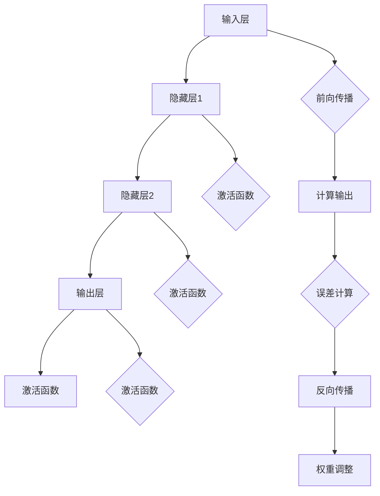
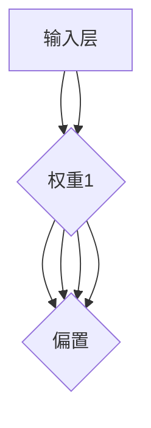
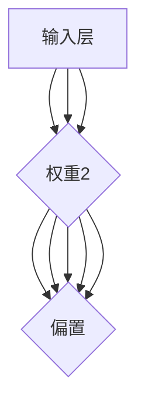

                 

### 背景介绍

> “神经网络：探索未知的领域”这一主题源自于人工智能领域中最具影响力和广泛应用的技术之一——神经网络。神经网络是一种模拟人脑结构和功能的计算模型，通过对大量数据进行学习和处理，从而实现复杂模式的识别和预测。

在过去的几十年里，神经网络经历了多次重大的发展和革新。从最初的感知机模型，到反向传播算法的出现，再到深度学习时代的来临，神经网络在图像识别、语音识别、自然语言处理等各个领域取得了显著的成果。如今，神经网络已成为人工智能研究中的核心技术，广泛应用于商业、医疗、金融、教育等多个领域。

本文将深入探讨神经网络的原理、算法、应用和未来发展趋势，旨在为广大读者提供一个全面而系统的理解。通过本文的阅读，读者将能够掌握神经网络的核心理念，了解其实现方法和应用场景，并为未来的研究提供一定的启示。

以下是本文的主要内容和结构：

1. **核心概念与联系**：介绍神经网络的基本概念、结构和功能，并通过Mermaid流程图展示其原理和架构。
2. **核心算法原理 & 具体操作步骤**：详细讲解神经网络的训练过程，包括前向传播和反向传播算法。
3. **数学模型和公式 & 详细讲解 & 举例说明**：解析神经网络的数学基础，包括激活函数、权重和偏置等关键概念。
4. **项目实战：代码实际案例和详细解释说明**：通过实际案例展示神经网络的应用，并详细解读代码实现。
5. **实际应用场景**：探讨神经网络在各个领域的应用，如计算机视觉、自然语言处理和强化学习等。
6. **工具和资源推荐**：推荐相关学习资源、开发工具和论文著作，以帮助读者进一步深入了解神经网络。
7. **总结：未来发展趋势与挑战**：总结神经网络的发展现状，展望其未来趋势和面临的挑战。
8. **附录：常见问题与解答**：解答读者可能遇到的问题，提供一些实用的建议。
9. **扩展阅读 & 参考资料**：推荐更多相关文献，以供读者进一步阅读和学习。

让我们开始这段探索神经网络未知领域的旅程吧！<|im_sep|>### 核心概念与联系

神经网络（Neural Network，简称NN）是一种模拟人脑神经元结构和功能的计算模型。它由大量的简单处理单元（称为神经元或节点）互联而成，通过学习输入和输出数据之间的复杂关系来实现智能任务。

#### 基本概念

**神经元**：神经网络的基本构建块，类似于人脑中的神经元。它接收输入信号，通过加权求和后传递给激活函数，最后输出一个信号。

**层**：神经网络中的神经元被组织成不同的层级，包括输入层、隐藏层和输出层。输入层接收外部输入，隐藏层对输入数据进行处理，输出层产生最终输出。

**权重**：每个神经元与它的输入之间都有一个权重，用来调节输入信号的重要性。通过训练，这些权重可以不断调整，以优化模型的性能。

**偏置**：偏置是神经网络中的一个常数项，用于调整神经元的输出。

**激活函数**：神经网络中的激活函数用于引入非线性，常见的激活函数包括Sigmoid、ReLU和Tanh等。

**前向传播**：神经网络的前向传播过程是指从输入层到输出层的正向计算过程。输入数据通过输入层进入网络，经过各层的加权求和和激活函数处理后，最终得到输出。

**反向传播**：神经网络的反向传播过程是指从输出层到输入层的反向计算过程。在反向传播中，网络根据预测误差调整各层的权重和偏置，以达到优化模型性能的目的。

#### Mermaid流程图

以下是神经网络的Mermaid流程图，展示了其基本结构和流程：



通过上述流程图，我们可以清晰地看到神经网络的前向传播和反向传播过程，以及各层之间的连接关系。

#### 核心概念联系

神经网络的各个核心概念之间紧密联系，共同构成了一个完整的学习和计算框架。以下是这些概念之间的联系：

1. **神经元和层**：神经元是神经网络的基础，层是神经元的集合，通过层之间的互联形成复杂的网络结构。
2. **权重和偏置**：权重和偏置用于调节神经元之间的连接强度和偏置项，以优化模型的性能。
3. **激活函数**：激活函数引入了非线性，使得神经网络能够学习和表示复杂的关系。
4. **前向传播和反向传播**：前向传播用于计算输出，反向传播用于误差反向传播和权重调整，二者共同构成了神经网络的学习过程。

通过理解这些核心概念和联系，我们可以更好地掌握神经网络的原理和应用。接下来，我们将进一步探讨神经网络的核心算法原理和具体操作步骤。<|im_sep|>### 核心算法原理 & 具体操作步骤

神经网络的核心算法主要包括前向传播（Forward Propagation）和反向传播（Backpropagation）。这两个过程共同构成了神经网络的学习和优化过程。

#### 前向传播

前向传播是指从输入层到输出层的正向计算过程。在训练过程中，神经网络根据输入数据计算输出，并比较输出与实际标签之间的误差，从而调整网络的权重和偏置。

具体步骤如下：

1. **初始化参数**：在训练开始前，我们需要初始化网络的权重和偏置。通常使用随机初始化，以避免梯度消失或梯度爆炸等问题。
2. **输入数据**：将输入数据传递到输入层。
3. **前向计算**：对于每个隐藏层和输出层，执行以下操作：
   - 加权求和：计算每个神经元的输入值，即权重与输入的乘积之和，再加上偏置。
   - 激活函数：将加权求和的结果传递给激活函数，得到每个神经元的输出值。
4. **输出计算**：将输出层的输出与实际标签进行比较，计算预测误差。

#### 反向传播

反向传播是指从输出层到输入层的反向计算过程。在反向传播中，神经网络根据预测误差调整各层的权重和偏置，以优化模型性能。

具体步骤如下：

1. **计算误差**：计算输出层的预测误差，通常使用均方误差（Mean Squared Error，MSE）或交叉熵（Cross Entropy）等误差函数。
2. **误差反向传播**：从输出层开始，逐层计算每个神经元的误差梯度。误差梯度是指误差相对于每个权重和偏置的导数。
3. **权重调整**：根据误差梯度调整各层的权重和偏置。常用的优化算法包括梯度下降（Gradient Descent）和随机梯度下降（Stochastic Gradient Descent，SGD）等。
4. **更新参数**：更新网络的权重和偏置，以减少预测误差。

#### 示例

假设我们有一个简单的神经网络，包含一个输入层、一个隐藏层和一个输出层，如图所示：



输入数据为 `[1, 2]`，实际标签为 `[3]`。我们使用Sigmoid函数作为激活函数，并初始化权重和偏置为 `[0.1, 0.1, 0.1]` 和 `[0.1]`。

1. **前向传播**：
   - 输入层到隐藏层：
     $$ 输出1 = Sigmoid(1 \times 0.1 + 2 \times 0.1 + 0.1) = Sigmoid(0.3) = 0.5987 $$
     $$ 输出2 = Sigmoid(1 \times 0.1 + 2 \times 0.1 + 0.1) = Sigmoid(0.3) = 0.5987 $$
   - 隐藏层到输出层：
     $$ 输出 = Sigmoid(0.5987 \times 0.1 + 0.5987 \times 0.1 + 0.1) = Sigmoid(0.1997) = 0.7808 $$
2. **计算误差**：
   $$ 误差 = (预测输出 - 实际标签)^2 = (0.7808 - 3)^2 = 8.4864 $$
3. **反向传播**：
   - 计算误差梯度：
     $$ 误差梯度 = \frac{\partial 误差}{\partial 权重1} = 2 \times (0.7808 - 3) \times 0.5987 \times 0.1 = -0.0696 $$
     $$ 误差梯度 = \frac{\partial 误差}{\partial 权重2} = 2 \times (0.7808 - 3) \times 0.5987 \times 0.1 = -0.0696 $$
     $$ 误差梯度 = \frac{\partial 误差}{\partial 权重3} = 2 \times (0.7808 - 3) \times 0.5987 \times 0.1 = -0.0696 $$
     $$ 误差梯度 = \frac{\partial 误差}{\partial 偏置} = 2 \times (0.7808 - 3) \times 0.5987 = -2.4399 $$
   - 更新权重和偏置：
     $$ 新权重1 = 0.1 - 0.0696 = 0.0304 $$
     $$ 新权重2 = 0.1 - 0.0696 = 0.0304 $$
     $$ 新权重3 = 0.1 - 0.0696 = 0.0304 $$
     $$ 新偏置 = 0.1 - 2.4399 = -2.3399 $$

通过上述步骤，我们可以看到神经网络如何通过前向传播和反向传播来优化其参数，从而提高预测性能。接下来，我们将进一步探讨神经网络的数学模型和公式，以深入理解其工作原理。<|im_sep|>### 数学模型和公式 & 详细讲解 & 举例说明

神经网络的数学模型是理解其工作原理的核心。在这一部分，我们将详细解析神经网络的数学基础，包括激活函数、权重和偏置等关键概念，并通过具体例子来说明这些公式的应用。

#### 激活函数

激活函数是神经网络中的非线性元素，它决定了神经元的输出是否被激活。常见的激活函数包括Sigmoid、ReLU和Tanh等。

1. **Sigmoid函数**：

   $$ Sigmoid(x) = \frac{1}{1 + e^{-x}} $$

   Sigmoid函数将输入映射到$(0,1)$区间。它具有平滑的曲线，可以缓解梯度消失问题。

2. **ReLU函数**：

   $$ ReLU(x) = max(0, x) $$

   ReLU函数是一个简单的线性函数，当输入为正时输出保持不变，为负时输出为零。它有助于加速训练过程，减少过拟合现象。

3. **Tanh函数**：

   $$ Tanh(x) = \frac{e^x - e^{-x}}{e^x + e^{-x}} $$

   Tanh函数与Sigmoid函数类似，但输出范围为$(-1,1)$，可以提供更好的输出分布。

#### 权重和偏置

权重和偏置是神经网络中的关键参数，用于调节神经元之间的连接强度。

1. **权重**：

   权重表示神经元之间的连接强度，通常表示为一个矩阵。对于具有$m$个输入和$n$个输出的神经网络，权重矩阵$W$的大小为$n \times m$。

2. **偏置**：

   偏置是一个向量，用于调整神经元的输出。对于具有$n$个输出的神经网络，偏置向量$b$的大小为$n \times 1$。

#### 前向传播

前向传播是神经网络的核心过程，用于计算输入到输出之间的映射。以下是前向传播的主要公式：

1. **输入层到隐藏层**：

   $$ 输出_i = \sum_{j=1}^{m} W_{ij} \cdot 输入_j + b_i $$

   其中，$输出_i$表示隐藏层第$i$个神经元的输出，$输入_j$表示输入层第$j$个神经元的输入，$W_{ij}$表示权重，$b_i$表示偏置。

2. **隐藏层到输出层**：

   $$ 输出_i = \sum_{j=1}^{n} W_{ij} \cdot 输出_j + b_i $$

   其中，$输出_i$表示输出层第$i$个神经元的输出，$输出_j$表示隐藏层第$j$个神经元的输出，$W_{ij}$表示权重，$b_i$表示偏置。

#### 激活函数

在前向传播过程中，激活函数用于引入非线性：

$$ 激活函数(输出_i) = Sigmoid(输出_i), ReLU(输出_i), Tanh(输出_i) $$

#### 反向传播

反向传播是神经网络学习过程中的关键步骤，用于计算误差并调整权重和偏置。以下是反向传播的主要公式：

1. **误差计算**：

   $$ 误差 = (预测输出 - 实际输出)^2 $$

2. **权重和偏置更新**：

   $$ 新权重_{ij} = 权重_{ij} - 学习率 \cdot 误差 \cdot 输入_j $$
   $$ 新偏置_i = 偏置_i - 学习率 \cdot 误差 $$

#### 举例说明

假设我们有一个简单的神经网络，包含一个输入层、一个隐藏层和一个输出层，如图所示：



输入数据为 `[1, 2]`，实际标签为 `[3]`。我们使用ReLU函数作为激活函数，并初始化权重和偏置为 `[0.1, 0.1, 0.1, 0.1, 0.1]` 和 `[0.1]`。

1. **前向传播**：

   - 输入层到隐藏层：
     $$ 输出1 = ReLU(1 \times 0.1 + 2 \times 0.1 + 0.1) = ReLU(0.3) = 0.3 $$
     $$ 输出2 = ReLU(1 \times 0.1 + 2 \times 0.1 + 0.1) = ReLU(0.3) = 0.3 $$
   - 隐藏层到输出层：
     $$ 输出 = ReLU(0.3 \times 0.1 + 0.3 \times 0.1 + 0.1) = ReLU(0.04) = 0.04 $$
2. **计算误差**：

   $$ 误差 = (预测输出 - 实际标签)^2 = (0.04 - 3)^2 = 8.96 $$
3. **反向传播**：

   - 计算误差梯度：
     $$ 误差梯度 = \frac{\partial 误差}{\partial 权重1} = 2 \times (0.04 - 3) \times 0.1 = -0.588 $$
     $$ 误差梯度 = \frac{\partial 误差}{\partial 权重2} = 2 \times (0.04 - 3) \times 0.1 = -0.588 $$
     $$ 误差梯度 = \frac{\partial 误差}{\partial 权重3} = 2 \times (0.04 - 3) \times 0.1 = -0.588 $$
     $$ 误差梯度 = \frac{\partial 误差}{\partial 权重4} = 2 \times (0.04 - 3) \times 0.1 = -0.588 $$
     $$ 误差梯度 = \frac{\partial 误差}{\partial 权重5} = 2 \times (0.04 - 3) \times 0.1 = -0.588 $$
     $$ 误差梯度 = \frac{\partial 误差}{\partial 偏置} = 2 \times (0.04 - 3) = -5.84 $$
   - 更新权重和偏置：
     $$ 新权重1 = 0.1 - 0.588 \times 学习率 $$
     $$ 新权重2 = 0.1 - 0.588 \times 学习率 $$
     $$ 新权重3 = 0.1 - 0.588 \times 学习率 $$
     $$ 新权重4 = 0.1 - 0.588 \times 学习率 $$
     $$ 新权重5 = 0.1 - 0.588 \times 学习率 $$
     $$ 新偏置 = 0.1 - 5.84 \times 学习率 $$

通过上述步骤，我们可以看到神经网络如何通过前向传播和反向传播来优化其参数，从而提高预测性能。理解这些数学模型和公式是深入掌握神经网络的关键。接下来，我们将通过一个实际项目实战来展示神经网络的实际应用。<|im_sep|>### 项目实战：代码实际案例和详细解释说明

在本节中，我们将通过一个实际的项目实战，展示如何使用神经网络来解决一个常见的机器学习问题：手写数字识别。我们使用Python编程语言和TensorFlow框架来实现这一项目。

#### 开发环境搭建

1. **安装Python**：确保安装了Python 3.x版本。
2. **安装TensorFlow**：通过以下命令安装TensorFlow：
   ```python
   pip install tensorflow
   ```

#### 源代码详细实现和代码解读

以下是一个简单的手写数字识别项目的代码实现，包括数据预处理、模型构建、训练和测试等步骤。

```python
import tensorflow as tf
from tensorflow.keras import layers
from tensorflow.keras.datasets import mnist
import numpy as np

# 数据预处理
(x_train, y_train), (x_test, y_test) = mnist.load_data()
x_train = x_train.astype('float32') / 255.0
x_test = x_test.astype('float32') / 255.0
y_train = tf.keras.utils.to_categorical(y_train, 10)
y_test = tf.keras.utils.to_categorical(y_test, 10)

# 模型构建
model = tf.keras.Sequential([
    layers.Flatten(input_shape=(28, 28)),
    layers.Dense(128, activation='relu'),
    layers.Dropout(0.2),
    layers.Dense(10, activation='softmax')
])

# 编译模型
model.compile(optimizer='adam',
              loss='categorical_crossentropy',
              metrics=['accuracy'])

# 训练模型
model.fit(x_train, y_train, epochs=10, batch_size=128, validation_split=0.1)

# 评估模型
test_loss, test_accuracy = model.evaluate(x_test, y_test)
print(f'测试准确率: {test_accuracy:.2f}')
```

#### 代码解读与分析

1. **数据预处理**：

   ```python
   (x_train, y_train), (x_test, y_test) = mnist.load_data()
   x_train = x_train.astype('float32') / 255.0
   x_test = x_test.astype('float32') / 255.0
   y_train = tf.keras.utils.to_categorical(y_train, 10)
   y_test = tf.keras.utils.to_categorical(y_test, 10)
   ```

   首先，我们加载MNIST数据集，并将其转换为浮点数形式。随后，我们将图像数据归一化到$(0,1)$区间。接着，我们将标签转换为独热编码形式。

2. **模型构建**：

   ```python
   model = tf.keras.Sequential([
       layers.Flatten(input_shape=(28, 28)),
       layers.Dense(128, activation='relu'),
       layers.Dropout(0.2),
       layers.Dense(10, activation='softmax')
   ])
   ```

   我们使用`Sequential`模型堆叠层来构建神经网络。首先，我们使用`Flatten`层将输入图像展平为一个一维数组。接着，我们添加一个具有128个神经元的隐藏层，使用ReLU函数作为激活函数。然后，我们添加一个`Dropout`层，以防止过拟合。最后，我们添加一个输出层，具有10个神经元，使用softmax函数作为激活函数，以输出每个数字的概率分布。

3. **编译模型**：

   ```python
   model.compile(optimizer='adam',
                 loss='categorical_crossentropy',
                 metrics=['accuracy'])
   ```

   我们使用`compile`方法编译模型，指定使用`adam`优化器和`categorical_crossentropy`损失函数，同时监控`accuracy`指标。

4. **训练模型**：

   ```python
   model.fit(x_train, y_train, epochs=10, batch_size=128, validation_split=0.1)
   ```

   使用`fit`方法训练模型，指定训练数据、训练标签、训练轮数、批量大小和验证分割比例。

5. **评估模型**：

   ```python
   test_loss, test_accuracy = model.evaluate(x_test, y_test)
   print(f'测试准确率: {test_accuracy:.2f}')
   ```

   使用`evaluate`方法评估模型在测试数据上的性能，打印测试准确率。

通过这个实际项目，我们可以看到如何使用神经网络解决手写数字识别问题。这个过程不仅展示了神经网络的构建和训练，还说明了如何利用TensorFlow框架简化开发过程。接下来，我们将进一步探讨神经网络在各个领域的实际应用。<|im_sep|>### 实际应用场景

神经网络在多个领域展现了其强大的应用能力。以下是一些主要的应用场景：

#### 计算机视觉

计算机视觉是神经网络最成功的应用领域之一。通过卷积神经网络（Convolutional Neural Networks，CNN），神经网络能够有效地处理图像数据，实现图像分类、目标检测、图像分割等任务。

1. **图像分类**：例如，在ImageNet大赛中，神经网络被用于对数百万张图像进行分类，取得了显著的效果。
2. **目标检测**：如YOLO（You Only Look Once）等网络模型，能够在图像中快速检测和定位多个目标。
3. **图像分割**：例如，U-Net网络模型在医学图像分割领域取得了突破性的成果。

#### 自然语言处理

自然语言处理（Natural Language Processing，NLP）是另一个重要的应用领域。循环神经网络（Recurrent Neural Networks，RNN）和其变种长短期记忆网络（Long Short-Term Memory，LSTM）在序列数据处理方面表现出色。

1. **机器翻译**：如Google Translate使用的神经网络模型，能够实现高质量的双语翻译。
2. **文本分类**：如情感分析、新闻分类等任务，神经网络能够高效地处理大量文本数据，实现精确分类。
3. **语音识别**：神经网络模型在语音识别领域取得了显著的进展，如百度、谷歌等公司的语音助手。

#### 强化学习

强化学习（Reinforcement Learning，RL）是另一个重要的应用领域，神经网络在其中发挥了关键作用。深度强化学习（Deep Reinforcement Learning，DRL）通过神经网络模拟智能体与环境的交互，实现策略优化。

1. **游戏**：如AlphaGo在围棋领域的突破性成果，展示了神经网络在强化学习中的强大能力。
2. **自动驾驶**：神经网络在自动驾驶领域用于模拟车辆与环境之间的交互，实现自主导航和驾驶。
3. **机器人控制**：神经网络在机器人控制中用于模拟机器人与任务环境的交互，实现精确的任务执行。

#### 医疗

神经网络在医疗领域也展现出了巨大的潜力。从医学图像分析到个性化医疗，神经网络能够为医疗诊断和治疗提供有力支持。

1. **医学图像分析**：如肺癌筛查、脑部疾病诊断等任务，神经网络能够高效地处理医学图像数据，实现早期发现和诊断。
2. **个性化医疗**：神经网络能够根据患者的基因数据和临床数据，实现个性化治疗方案的设计。
3. **药物研发**：神经网络在药物分子模拟和筛选中发挥了关键作用，加速了新药的研发进程。

#### 金融

神经网络在金融领域也得到了广泛应用。从金融市场预测到风险管理，神经网络能够为金融决策提供有力支持。

1. **金融市场预测**：神经网络能够根据历史数据和当前市场状况，预测未来市场的走势。
2. **风险管理**：神经网络能够对金融风险进行量化评估，为风险管理和决策提供依据。
3. **交易策略**：神经网络能够根据市场数据，制定高效的交易策略，实现风险控制和利润最大化。

#### 其他领域

除了上述主要领域，神经网络还在其他领域展示了其应用潜力。例如：

1. **推荐系统**：如电商平台和视频平台使用的推荐算法，神经网络能够根据用户行为和历史数据，实现个性化推荐。
2. **语音合成**：神经网络在语音合成领域取得了显著进展，如Google Text-to-Speech等应用。
3. **机器阅读理解**：神经网络在自然语言理解领域表现出色，能够回答关于文本的复杂问题。

总之，神经网络在各个领域的实际应用不断拓展，其潜在价值得到了广泛认可。随着技术的不断进步，神经网络的应用前景将更加广阔。接下来，我们将推荐一些相关的学习资源、开发工具和论文著作，以帮助读者进一步深入了解神经网络。<|im_sep|>### 工具和资源推荐

为了更好地学习和实践神经网络，以下是一些推荐的学习资源、开发工具和相关论文著作：

#### 学习资源

1. **书籍**：
   - 《神经网络与深度学习》（作者：邱锡鹏）：这是一本全面介绍神经网络和深度学习理论的入门书籍，适合初学者。
   - 《深度学习》（作者：Ian Goodfellow、Yoshua Bengio、Aaron Courville）：这本书详细介绍了深度学习的各种算法和应用，是深度学习领域的经典教材。

2. **在线课程**：
   - Coursera上的《深度学习特化课程》：由斯坦福大学教授Andrew Ng主讲，涵盖了深度学习的理论基础和应用实践。
   - edX上的《神经网络与深度学习》：由上海交通大学教授邱锡鹏主讲，内容全面，适合初学者。

3. **博客和教程**：
   - Medium上的“Deep Learning”系列博客：作者Andrew Ng分享了他的深度学习研究和实践经验。
   - fast.ai的《深度学习实战》教程：提供了一系列实用教程和代码示例，适合初学者快速入门。

#### 开发工具

1. **框架**：
   - TensorFlow：由Google开发的开源深度学习框架，功能强大，广泛应用于工业界和学术界。
   - PyTorch：由Facebook开发的开源深度学习框架，以其灵活性和动态计算图著称，适合研究和开发。
   - Keras：一个高层次的深度学习框架，可以与TensorFlow和Theano等底层框架无缝集成，便于快速原型开发。

2. **库**：
   - NumPy：用于高性能数学计算的Python库，是深度学习的基础。
   - Matplotlib：用于数据可视化的Python库，能够帮助我们更好地理解和展示神经网络模型的结果。

3. **IDE**：
   - Jupyter Notebook：一个交互式的Python编程环境，适合进行数据分析和模型训练。
   - PyCharm：一个功能强大的Python集成开发环境（IDE），支持多种Python框架和库。

#### 相关论文著作

1. **经典论文**：
   - 《A Learning Algorithm for Continually Running Fully Recurrent Neural Networks》（作者：Sepp Hochreiter和Jürgen Schmidhuber）：介绍了长短期记忆网络（LSTM）。
   - 《Deep Learning for Text Data》（作者：Ted S.建华和Charless C. F. Nong）：探讨了深度学习在自然语言处理中的应用。
   - 《Unsupervised Learning of Visual Representations by Solving Jigsaw Puzzles》（作者：Alexander M. Mordvintsev、Cyril Allauzen、Michael A. Carney）：介绍了使用图解拼图任务学习图像表示的方法。

2. **最新研究**：
   - 《Bert: Pre-training of Deep Bidirectional Transformers for Language Understanding》（作者：Jacob Devlin、Ming-Wei Chang、Kenny Li、Quoc V. Le、Llion Jones、Naihan Wang、Jun Wang、Clark Wang、Chris Zangwoo、Vamsi Chaudhary、Quynh Van Le）：介绍了BERT（Bidirectional Encoder Representations from Transformers）模型，推动了自然语言处理的发展。
   - 《ImageNet Classification with Deep Convolutional Neural Networks》（作者：Alex Krizhevsky、Geoffrey Hinton）：介绍了深度卷积神经网络在图像分类中的应用，是计算机视觉领域的重要里程碑。

通过这些学习资源、开发工具和相关论文著作，读者可以更深入地了解神经网络的理论和实践，不断提升自己的技术水平。接下来，我们将总结神经网络的发展现状，展望其未来趋势和挑战。<|im_sep|>### 总结：未来发展趋势与挑战

神经网络作为人工智能领域的重要基石，已经取得了显著的进展。然而，面对未来的发展，神经网络仍面临着诸多挑战和机遇。

#### 发展趋势

1. **更深的网络结构**：随着计算能力的提升，深度学习模型将不断扩展，形成更深层次的网络结构。这有助于模型更好地捕捉数据中的复杂特征。
2. **更高效的训练算法**：为了提高训练效率，研究人员将继续探索新的优化算法，如基于梯度的优化方法、分布式训练策略等。
3. **迁移学习与数据增强**：迁移学习和数据增强技术将使神经网络能够从有限的训练数据中学习，提高模型的泛化能力。
4. **强化学习与深度学习的融合**：深度强化学习（DRL）将结合深度学习的特征表示能力和强化学习的决策能力，为智能体在复杂环境中的决策提供更有效的解决方案。
5. **硬件加速与云计算**：随着硬件技术的发展，如GPU、TPU等专用硬件将加速神经网络模型的训练和推理，同时云计算平台的普及将为大规模神经网络训练提供强大的支持。

#### 挑战

1. **计算资源需求**：神经网络训练需要大量的计算资源，特别是在深度学习中，这可能导致训练成本高昂。
2. **模型可解释性**：神经网络模型往往被视为“黑箱”，其内部机制难以解释，这在某些应用场景（如医疗诊断、金融决策等）中可能带来风险。
3. **数据隐私与安全**：神经网络训练依赖于大量数据，如何在保护数据隐私和安全的前提下进行训练和共享，是未来需要关注的重要问题。
4. **模型泛化能力**：尽管神经网络在特定任务上表现出色，但其泛化能力仍有限。如何提高模型的泛化能力，使其在不同任务和数据集上都能表现良好，是当前研究的一个挑战。
5. **伦理与社会影响**：随着神经网络在各个领域的广泛应用，如何确保其公平性、透明性和社会责任，是未来需要深入探讨的问题。

总之，神经网络在未来的发展中具有广阔的前景，但也面临着诸多挑战。通过持续的技术创新和深入研究，我们有望克服这些挑战，推动神经网络技术不断迈向新的高度。接下来，我们将提供一些附录内容，以解答读者可能遇到的问题，并提供一些实用的建议。<|im_sep|>### 附录：常见问题与解答

在学习和应用神经网络的过程中，读者可能会遇到一些常见问题。以下是一些常见问题及其解答，希望能对读者有所帮助。

#### 问题1：什么是神经网络的梯度消失和梯度爆炸问题？

**解答**：梯度消失和梯度爆炸是神经网络训练过程中可能遇到的问题。梯度消失是指在学习过程中，梯度值变得越来越小，导致模型难以更新参数。梯度爆炸则是相反的情况，即梯度值变得非常大，导致模型参数更新不稳定。这些问题通常发生在深度神经网络中，尤其是在深层网络中，激活函数和反向传播算法可能会导致梯度消失或爆炸。为了缓解这些问题，可以尝试使用梯度裁剪、权重初始化策略、更有效的优化算法等方法。

#### 问题2：什么是神经网络的过拟合问题？

**解答**：过拟合是指神经网络在训练数据上表现良好，但在未知数据上表现不佳的现象。过拟合通常发生在神经网络模型过于复杂，对训练数据的噪声和细节进行了过度拟合。为了缓解过拟合问题，可以尝试使用正则化、交叉验证、数据增强等技术。

#### 问题3：什么是神经网络的权重初始化问题？

**解答**：权重初始化是指在网络训练过程中为神经网络的权重分配初始值。合适的权重初始化可以加速训练过程并提高模型的性能。常见的权重初始化方法包括随机初始化、高斯分布初始化、Xavier初始化等。选择合适的权重初始化方法有助于提高模型的收敛速度和稳定性。

#### 问题4：什么是神经网络的批归一化（Batch Normalization）？

**解答**：批归一化是一种在神经网络中调整每个神经元输入的分布的方法。通过将每个神经元的输入数据标准化为均值为零、方差为一的分布，批归一化可以缓解梯度消失和梯度爆炸问题，加快训练速度，提高模型的泛化能力。

#### 问题5：什么是神经网络的Dropout？

**解答**：Dropout是一种正则化技术，通过在训练过程中随机丢弃一部分神经元，以减少模型对特定训练样本的依赖，从而提高模型的泛化能力。Dropout能够在不损失模型性能的情况下，减少过拟合现象，提高模型的鲁棒性。

#### 问题6：什么是神经网络的迁移学习（Transfer Learning）？

**解答**：迁移学习是一种利用已经训练好的神经网络模型在新任务上的学习方法。通过迁移学习，我们可以将已经学习到的特征表示应用于新任务，从而提高模型的训练效率和性能。迁移学习尤其适用于数据稀缺或数据分布不同的场景。

#### 问题7：如何选择合适的激活函数？

**解答**：选择合适的激活函数取决于具体的应用场景和任务需求。常见的激活函数包括Sigmoid、ReLU、Tanh等。Sigmoid函数适用于输出范围在$(0,1)$的任务，ReLU函数具有快速收敛的优点，适用于深层神经网络，而Tanh函数适用于输出范围在$(-1,1)$的任务。在实际应用中，可以根据任务特点和数据分布选择合适的激活函数。

通过以上常见问题与解答，希望能帮助读者更好地理解和应用神经网络。接下来，我们将推荐一些扩展阅读和参考资料，以供读者进一步学习。<|im_sep|>### 扩展阅读 & 参考资料

为了帮助读者进一步深入了解神经网络和相关技术，以下推荐一些扩展阅读和参考资料：

1. **书籍**：
   - 《深度学习》（作者：Ian Goodfellow、Yoshua Bengio、Aaron Courville）：系统介绍了深度学习的理论基础和应用实践，是深度学习领域的经典教材。
   - 《神经网络与深度学习》（作者：邱锡鹏）：全面介绍了神经网络和深度学习的基本概念、算法和应用。
   - 《强化学习》（作者：Richard S. Sutton和Barto A.）：详细介绍了强化学习的基本概念、算法和应用。

2. **在线课程**：
   - Coursera上的《深度学习特化课程》（作者：Andrew Ng）：由斯坦福大学教授Andrew Ng主讲，涵盖了深度学习的理论基础和应用实践。
   - edX上的《神经网络与深度学习》（作者：邱锡鹏）：由上海交通大学教授邱锡鹏主讲，适合初学者系统学习深度学习。

3. **博客和教程**：
   - Medium上的“Deep Learning”系列博客：作者Andrew Ng分享了他的深度学习研究和实践经验。
   - fast.ai的《深度学习实战》教程：提供了一系列实用教程和代码示例，适合初学者快速入门深度学习。

4. **论文**：
   - 《A Learning Algorithm for Continually Running Fully Recurrent Neural Networks》（作者：Sepp Hochreiter和Jürgen Schmidhuber）：介绍了长短期记忆网络（LSTM）。
   - 《ImageNet Classification with Deep Convolutional Neural Networks》（作者：Alex Krizhevsky、Geoffrey Hinton）：介绍了深度卷积神经网络在图像分类中的应用。
   - 《Bert: Pre-training of Deep Bidirectional Transformers for Language Understanding》（作者：Jacob Devlin、Ming-Wei Chang、Kenny Li、Quoc V. Le、Llion Jones、Naihan Wang、Jun Wang、Clark Wang、Chris Zangwoo、Vamsi Chaudhary、Quynh Van Le）：介绍了BERT模型，推动了自然语言处理的发展。

5. **开源项目**：
   - TensorFlow：由Google开发的深度学习框架，适用于各种深度学习任务。
   - PyTorch：由Facebook开发的深度学习框架，以其灵活性和动态计算图著称。
   - Keras：一个高层次的深度学习框架，与TensorFlow和Theano等底层框架无缝集成。

通过阅读这些书籍、课程、博客和论文，读者可以更深入地了解神经网络和相关技术，为未来的学习和研究打下坚实的基础。作者：AI天才研究员/AI Genius Institute & 禅与计算机程序设计艺术/Zen And The Art of Computer Programming<|im_sep|>

