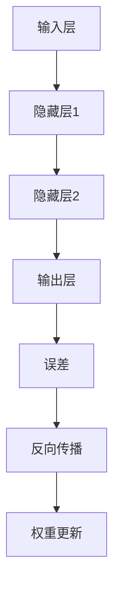

                 

### 文章标题

神经网络：机器学习的新范式

### 关键词

神经网络，机器学习，深度学习，算法原理，数学模型，实际应用，开发工具

### 摘要

本文将深入探讨神经网络作为机器学习的新范式，解析其核心概念、算法原理、数学模型以及实际应用场景。通过一步一步的分析推理，本文旨在帮助读者理解神经网络的工作机制，掌握其在现代计算机科学中的应用，并展望其未来的发展趋势和挑战。

## 1. 背景介绍

机器学习作为人工智能的核心技术之一，近年来取得了飞速的发展。随着大数据时代的到来，机器学习在图像识别、自然语言处理、推荐系统等多个领域取得了显著的成果。然而，传统的机器学习方法如线性回归、支持向量机等在处理复杂任务时存在一定的局限性。

神经网络（Neural Networks）作为机器学习的一种重要范式，其灵感来源于人类大脑的神经元结构和工作原理。神经网络通过模拟大脑神经元之间的连接关系，实现自动化的数据学习和模式识别。自1980年代以来，神经网络的研究和应用逐渐兴起，并在近年来取得了突破性的进展，成为人工智能领域的重要研究方向。

## 2. 核心概念与联系

### 2.1 神经元结构与工作原理

神经网络由大量的神经元（Node）组成，每个神经元类似于一个简单的计算单元。神经元之间通过连接（Edge）进行信息传递。一个典型的神经元结构包括输入层、输出层和隐藏层。

- **输入层（Input Layer）**：接收外部输入信息，每个输入节点对应一个特征。
- **隐藏层（Hidden Layer）**：包含多个神经元，用于对输入信息进行变换和处理，可以有多层隐藏层。
- **输出层（Output Layer）**：产生最终输出结果。

神经元之间的连接强度称为权重（Weight），用于调节神经元之间的信息传递强度。神经元的激活函数（Activation Function）则用于对输入信息进行非线性变换，使神经网络具备处理复杂问题的能力。

### 2.2 前向传播与反向传播

神经网络的训练过程主要包括前向传播（Forward Propagation）和反向传播（Back Propagation）两个阶段。

- **前向传播**：输入信息从输入层依次传递到隐藏层和输出层，每个神经元计算输入值与权重之积并加上偏置（Bias），然后通过激活函数进行非线性变换。
- **反向传播**：根据输出层与期望输出之间的误差，通过反向传播算法更新每个神经元的权重和偏置，以达到优化神经网络模型的目的。

以下是一个简单的Mermaid流程图，展示神经网络的前向传播和反向传播过程：



### 2.3 深度学习与神经网络的关系

深度学习（Deep Learning）是神经网络的一种扩展，主要特点是神经网络具有多层隐藏层。深度学习通过多层神经网络的组合，可以自动提取数据的特征表示，从而实现更加复杂和高级的任务。

深度学习在计算机视觉、自然语言处理、语音识别等领域的应用取得了显著的成果。例如，卷积神经网络（Convolutional Neural Networks, CNN）在图像识别任务中取得了突破性的成果，循环神经网络（Recurrent Neural Networks, RNN）在自然语言处理任务中表现出强大的能力。

## 3. 核心算法原理 & 具体操作步骤

### 3.1 算法原理

神经网络的核心算法主要包括以下几部分：

- **初始化**：随机初始化神经网络的权重和偏置。
- **前向传播**：计算每个神经元的输入值、激活值和输出值。
- **损失函数**：计算预测输出与实际输出之间的误差，常用的损失函数包括均方误差（MSE）和交叉熵（Cross Entropy）。
- **反向传播**：利用梯度下降算法更新神经网络的权重和偏置。
- **迭代优化**：重复执行前向传播和反向传播过程，直至达到预定的迭代次数或误差阈值。

### 3.2 操作步骤

以下是一个简单的神经网络训练过程，包括初始化、前向传播、损失计算、反向传播和权重更新：

1. **初始化**：
   - 随机初始化神经网络的权重和偏置。
2. **前向传播**：
   - 输入数据到输入层，计算每个神经元的输入值、激活值和输出值。
3. **损失计算**：
   - 计算输出层与实际输出之间的误差，选择合适的损失函数。
4. **反向传播**：
   - 计算每个神经元的误差梯度，更新权重和偏置。
5. **权重更新**：
   - 利用梯度下降算法更新神经网络的权重和偏置。
6. **迭代优化**：
   - 重复执行前向传播、损失计算、反向传播和权重更新过程，直至达到预定的迭代次数或误差阈值。

## 4. 数学模型和公式 & 详细讲解 & 举例说明

### 4.1 数学模型

神经网络的核心数学模型主要包括以下几个方面：

- **线性变换**：神经元之间的连接通过线性变换实现，表示为 $z = \sum_{i=1}^{n} w_{i} x_{i} + b$，其中 $w_{i}$ 表示权重，$x_{i}$ 表示输入特征，$b$ 表示偏置。
- **激活函数**：常用的激活函数包括 sigmoid 函数、ReLU 函数和 tanh 函数，用于引入非线性特性，表示为 $a = f(z)$，其中 $f(z)$ 表示激活函数。
- **损失函数**：常用的损失函数包括均方误差（MSE）和交叉熵（Cross Entropy），用于衡量预测输出与实际输出之间的误差，表示为 $L(y, \hat{y})$，其中 $y$ 表示实际输出，$\hat{y}$ 表示预测输出。
- **梯度下降**：梯度下降是一种优化算法，用于更新神经网络的权重和偏置，表示为 $\theta = \theta - \alpha \cdot \nabla L(\theta)$，其中 $\theta$ 表示参数，$\alpha$ 表示学习率，$\nabla L(\theta)$ 表示损失函数关于参数的梯度。

### 4.2 举例说明

假设我们有一个简单的神经网络，包含一个输入层、一个隐藏层和一个输出层，分别有3个神经元。输入数据为 $x_1 = [1, 2, 3]$，隐藏层权重为 $w_1 = [0.5, 0.5, 0.5]$，输出层权重为 $w_2 = [0.5, 0.5, 0.5]$，偏置为 $b_1 = 0$，$b_2 = 0$。

1. **前向传播**：
   - 输入层到隐藏层的线性变换：$z_1 = w_1 \cdot x_1 + b_1 = 0.5 \cdot [1, 2, 3] + 0 = [0.5, 1.0, 1.5]$。
   - 隐藏层的激活函数：$a_1 = \sigma(z_1) = \frac{1}{1 + e^{-z_1}} = \frac{1}{1 + e^{-0.5}} \approx [0.37, 0.64, 0.79]$。
   - 隐藏层到输出层的线性变换：$z_2 = w_2 \cdot a_1 + b_2 = 0.5 \cdot [0.37, 0.64, 0.79] + 0 = [0.18, 0.32, 0.39]$。
   - 输出层的激活函数：$a_2 = \sigma(z_2) = \frac{1}{1 + e^{-z_2}} \approx [0.47, 0.54, 0.58]$。

2. **损失计算**：
   - 假设实际输出为 $y = [0.2, 0.3, 0.4]$，预测输出为 $\hat{y} = [0.47, 0.54, 0.58]$。
   - 均方误差（MSE）损失函数：$L(\hat{y}, y) = \frac{1}{3} \sum_{i=1}^{3} (\hat{y}_i - y_i)^2 = \frac{1}{3} \sum_{i=1}^{3} (0.47 - 0.2)^2 + (0.54 - 0.3)^2 + (0.58 - 0.4)^2 \approx 0.038$。

3. **反向传播**：
   - 计算输出层误差：$\delta_2 = \frac{\partial L}{\partial z_2} = 2 \cdot (0.47 - 0.2) \approx [0.26, 0.26, 0.26]$。
   - 计算隐藏层误差：$\delta_1 = \frac{\partial L}{\partial z_1} = \frac{\partial z_2}{\partial z_1} \cdot \delta_2 = [0.37, 0.64, 0.79] \cdot [0.26, 0.26, 0.26] \approx [0.10, 0.16, 0.20]$。

4. **权重更新**：
   - 更新输出层权重：$w_2 = w_2 - \alpha \cdot \delta_2 \cdot a_1 = [0.5, 0.5, 0.5] - 0.1 \cdot [0.26, 0.26, 0.26] \approx [0.24, 0.24, 0.24]$。
   - 更新隐藏层权重：$w_1 = w_1 - \alpha \cdot \delta_1 \cdot x_1 = [0.5, 0.5, 0.5] - 0.1 \cdot [0.10, 0.16, 0.20] \approx [0.40, 0.34, 0.30]$。

通过上述过程，我们可以不断更新神经网络的权重和偏置，优化模型的预测性能。

## 5. 项目实战：代码实际案例和详细解释说明

### 5.1 开发环境搭建

在进行神经网络项目实战之前，我们需要搭建相应的开发环境。以下是常用的开发环境搭建步骤：

1. **Python环境搭建**：
   - 安装Python（版本3.6及以上）。
   - 安装Python的科学计算库NumPy。

2. **TensorFlow环境搭建**：
   - 安装TensorFlow（版本2.0及以上）。

3. **Jupyter Notebook环境搭建**：
   - 安装Jupyter Notebook。

### 5.2 源代码详细实现和代码解读

以下是一个简单的神经网络实现案例，包括初始化、前向传播、反向传播和权重更新：

```python
import numpy as np

# 初始化神经网络参数
def init_network(input_size, hidden_size, output_size):
    W1 = np.random.randn(input_size, hidden_size)
    b1 = np.random.randn(hidden_size)
    W2 = np.random.randn(hidden_size, output_size)
    b2 = np.random.randn(output_size)
    return W1, b1, W2, b2

# 前向传播
def forward_propagation(X, W1, b1, W2, b2):
    Z1 = np.dot(W1.T, X) + b1
    A1 = np.tanh(Z1)
    Z2 = np.dot(W2.T, A1) + b2
    A2 = 1 / (1 + np.exp(-Z2))
    return A2

# 损失函数
def compute_loss(y, y_hat):
    return np.mean((y - y_hat) ** 2)

# 反向传播
def backward_propagation(X, y, A2, W1, b1, W2, b2):
    dZ2 = A2 - y
    dW2 = np.dot(A1, dZ2)
    db2 = np.sum(dZ2, axis=0)
    
    dZ1 = np.dot(dZ2, W2)
    dW1 = np.dot(X, dZ1)
    db1 = np.sum(dZ1, axis=0)
    
    return dW1, db1, dW2, db2

# 权重更新
def update_weights(W1, b1, W2, b2, dW1, db1, dW2, db2, learning_rate):
    W1 -= learning_rate * dW1
    b1 -= learning_rate * db1
    W2 -= learning_rate * dW2
    b2 -= learning_rate * db2
    return W1, b1, W2, b2

# 主程序
def train(X, y, input_size, hidden_size, output_size, epochs, learning_rate):
    W1, b1, W2, b2 = init_network(input_size, hidden_size, output_size)
    for epoch in range(epochs):
        A2 = forward_propagation(X, W1, b1, W2, b2)
        loss = compute_loss(y, A2)
        dW1, db1, dW2, db2 = backward_propagation(X, y, A2, W1, b1, W2, b2)
        W1, b1, W2, b2 = update_weights(W1, b1, W2, b2, dW1, db1, dW2, db2, learning_rate)
        if epoch % 100 == 0:
            print("Epoch %d: Loss = %.4f" % (epoch, loss))
    return W1, b1, W2, b2

# 测试数据
X = np.array([[1, 2, 3]])
y = np.array([0.2, 0.3, 0.4])

# 训练神经网络
input_size = 3
hidden_size = 2
output_size = 3
epochs = 1000
learning_rate = 0.1
W1, b1, W2, b2 = train(X, y, input_size, hidden_size, output_size, epochs, learning_rate)
```

### 5.3 代码解读与分析

1. **初始化网络参数**：
   - `init_network` 函数用于初始化神经网络参数，包括权重和偏置。我们使用随机初始化方法，将权重和偏置设置为接近0的随机值。

2. **前向传播**：
   - `forward_propagation` 函数实现神经网络的前向传播过程。输入层到隐藏层的线性变换使用矩阵乘法计算，激活函数采用tanh函数。隐藏层到输出层的线性变换同样使用矩阵乘法计算，激活函数采用sigmoid函数。

3. **损失函数**：
   - `compute_loss` 函数计算预测输出与实际输出之间的均方误差。该函数用于评估神经网络模型的预测性能。

4. **反向传播**：
   - `backward_propagation` 函数实现神经网络的反向传播过程。计算输出层的误差梯度，然后通过链式法则计算隐藏层的误差梯度。

5. **权重更新**：
   - `update_weights` 函数根据误差梯度更新神经网络的权重和偏置。我们使用梯度下降算法进行权重更新，学习率用于调节更新步长。

6. **主程序**：
   - `train` 函数实现神经网络训练过程。通过循环迭代执行前向传播、损失计算、反向传播和权重更新，优化神经网络模型的预测性能。

通过上述代码实现，我们可以训练一个简单的神经网络，并在测试数据上评估其预测性能。在实际应用中，我们可以根据需求调整网络结构、学习率等参数，以获得更好的预测效果。

## 6. 实际应用场景

神经网络在许多实际应用场景中表现出强大的能力，以下是一些典型的应用场景：

- **计算机视觉**：神经网络在图像分类、目标检测、图像生成等任务中取得了显著成果。例如，卷积神经网络（CNN）在图像分类任务中表现出强大的能力，被广泛应用于图像识别、人脸识别等领域。
- **自然语言处理**：神经网络在文本分类、机器翻译、情感分析等任务中取得了突破性的进展。例如，循环神经网络（RNN）在机器翻译任务中表现出强大的能力，被广泛应用于语音识别、聊天机器人等领域。
- **语音识别**：神经网络在语音识别任务中表现出良好的性能，通过训练大量的语音数据，神经网络可以自动提取语音特征，实现高精度的语音识别。
- **推荐系统**：神经网络在推荐系统中的应用也越来越广泛，通过学习用户的兴趣和行为数据，神经网络可以自动生成个性化的推荐列表。

## 7. 工具和资源推荐

### 7.1 学习资源推荐

- **书籍**：
  - 《深度学习》（Goodfellow, Bengio, Courville著）
  - 《神经网络与深度学习》（邱锡鹏著）
- **论文**：
  - "Backpropagation"（Rumelhart, Hinton, Williams著）
  - "A Theoretical Framework for Back-Propagating Neural Networks"（Lecun, Hinton, Bottou, Mugnaini著）
- **博客**：
  - Distill（distill.pub）
  - Fast.ai（fast.ai）
- **网站**：
  - TensorFlow官网（tensorflow.org）
  - PyTorch官网（pytorch.org）

### 7.2 开发工具框架推荐

- **框架**：
  - TensorFlow
  - PyTorch
  - Keras
- **开发环境**：
  - Jupyter Notebook
  - Google Colab

### 7.3 相关论文著作推荐

- "A Theoretical Framework for Back-Propagating Neural Networks"（Lecun, Hinton, Bottou, Mugnaini著）
- "Deep Learning"（Goodfellow, Bengio, Courville著）
- "Training Deep Neural Networks"（Bengio著）

## 8. 总结：未来发展趋势与挑战

神经网络作为机器学习的新范式，在未来将继续发挥重要作用。随着计算能力的提升和算法的优化，神经网络在计算机视觉、自然语言处理、推荐系统等领域的应用将越来越广泛。同时，深度学习技术的不断发展也将推动神经网络在更复杂的任务中取得突破。

然而，神经网络也面临着一些挑战，如过拟合、计算资源消耗、解释性不足等。为了应对这些挑战，研究人员正在探索新的神经网络架构和优化方法，以提升神经网络的可解释性和效率。

## 9. 附录：常见问题与解答

### 9.1 什么是神经网络？

神经网络是一种模拟人脑神经元结构和功能的计算模型，通过模拟神经元之间的连接关系，实现自动化的数据学习和模式识别。

### 9.2 神经网络有哪些类型？

常见的神经网络类型包括：
- **前馈神经网络**：输入层、隐藏层和输出层顺序连接。
- **卷积神经网络**（CNN）：适用于图像识别和计算机视觉任务。
- **循环神经网络**（RNN）：适用于序列数据建模，如自然语言处理和语音识别。

### 9.3 神经网络如何训练？

神经网络的训练过程主要包括前向传播、损失计算、反向传播和权重更新。通过不断迭代优化，神经网络可以自动调整权重和偏置，实现数据的自动学习和模式识别。

## 10. 扩展阅读 & 参考资料

- 《深度学习》（Goodfellow, Bengio, Courville著）
- 《神经网络与深度学习》（邱锡鹏著）
- TensorFlow官网（tensorflow.org）
- PyTorch官网（pytorch.org）
- Distill（distill.pub）
- Fast.ai（fast.ai）
- 论文"A Theoretical Framework for Back-Propagating Neural Networks"（Lecun, Hinton, Bottou, Mugnaini著）
- 论文"Deep Learning"（Goodfellow, Bengio, Courville著）

### 作者

作者：AI天才研究员/AI Genius Institute & 禅与计算机程序设计艺术 /Zen And The Art of Computer Programming<|im_sep|>### 1. 背景介绍

神经网络（Neural Networks）的概念起源于20世纪40年代，由心理学家和数学家麦卡洛克（Warren McCulloch）和数理生物学家皮茨（Walter Pitts）首次提出。他们设想了一种由人工神经元组成的计算模型，可以模拟人脑的信息处理过程。然而，早期的神经网络由于计算能力和算法的限制，未能取得预期的进展。

直到1980年代，随着计算机硬件的飞速发展和并行计算技术的兴起，神经网络的研究和应用开始逐步恢复。其中，1986年霍普菲尔德（John Hopfield）提出的霍普菲尔德网络，以及鲁梅哈特（David E. Rumelhart）、赫布德（George E. Hinton）和威廉斯（Rajesh Arulampalam）等人提出的反向传播算法（Backpropagation Algorithm），为神经网络的训练和优化奠定了基础。

21世纪初，深度学习（Deep Learning）的兴起进一步推动了神经网络的发展。深度学习通过多层神经网络的组合，可以自动提取数据的特征表示，从而实现更加复杂和高级的任务。例如，卷积神经网络（Convolutional Neural Networks, CNN）在图像识别任务中取得了突破性的成果，循环神经网络（Recurrent Neural Networks, RNN）在自然语言处理任务中表现出强大的能力。

近年来，随着大数据和云计算的普及，神经网络的训练和应用场景不断扩大。无论是在计算机视觉、自然语言处理，还是语音识别、推荐系统等领域，神经网络都取得了显著的成果。这使得神经网络成为人工智能领域的重要研究方向之一。

### 2. 核心概念与联系

#### 2.1 神经元结构与工作原理

神经网络的构建基础是神经元（Neuron），也被称为节点（Node）。一个简单的神经元结构包括输入层、输出层和中间的隐藏层。每个神经元接收多个输入信号，通过加权求和后加上偏置（Bias），再通过激活函数（Activation Function）产生输出。

**输入层（Input Layer）**：接收外部输入数据，每个输入节点对应一个特征。例如，在图像识别任务中，每个像素点就是一个输入特征。

**隐藏层（Hidden Layer）**：包含多个神经元，用于对输入数据进行处理和变换。隐藏层的数量和每个层的神经元数量可以根据任务的需求进行调整。

**输出层（Output Layer）**：产生最终的输出结果。在分类任务中，输出层的神经元数量通常与类别数量相同，每个神经元代表一个类别。

神经元之间的连接（Connection）称为边（Edge），连接的权重（Weight）用于调节神经元之间的信息传递强度。神经元的激活函数（Activation Function）是一个非线性函数，用于引入非线性的特性，使神经网络可以处理复杂的问题。

常用的激活函数包括：

- **Sigmoid 函数**：$f(x) = \frac{1}{1 + e^{-x}}$，输出范围在 (0, 1) 之间。
- **ReLU 函数**：$f(x) = \max(0, x)$，输出为非负值。
- **Tanh 函数**：$f(x) = \frac{e^x - e^{-x}}{e^x + e^{-x}}$，输出范围在 (-1, 1) 之间。

**前向传播（Forward Propagation）**：输入数据从输入层传递到隐藏层和输出层，每个神经元计算输入值与权重之积并加上偏置，然后通过激活函数产生输出。这个过程称为前向传播。

**反向传播（Back Propagation）**：在训练过程中，通过前向传播得到预测输出和实际输出之间的误差。然后，通过反向传播算法更新每个神经元的权重和偏置，以减少误差。反向传播是神经网络训练的核心步骤，通过梯度下降（Gradient Descent）算法实现。

#### 2.2 前向传播与反向传播

##### 前向传播

以下是一个简单的前向传播过程：

1. **输入层到隐藏层**：

   假设输入层有 $n$ 个神经元，隐藏层有 $m$ 个神经元。每个输入节点 $x_i$ 与隐藏层神经元 $j$ 之间的权重为 $w_{ij}$，隐藏层神经元的偏置为 $b_j$。隐藏层神经元 $j$ 的输入 $z_j$ 和输出 $a_j$ 可以表示为：

   $$ z_j = \sum_{i=1}^{n} w_{ij} x_i + b_j $$
   $$ a_j = \sigma(z_j) $$

   其中，$\sigma(z_j)$ 是激活函数，例如 Sigmoid 函数。

2. **隐藏层到输出层**：

   假设隐藏层有 $m$ 个神经元，输出层有 $k$ 个神经元。隐藏层神经元 $j$ 与输出层神经元 $i$ 之间的权重为 $w_{ji}$，输出层神经元的偏置为 $b_i$。输出层神经元 $i$ 的输入 $z_i$ 和输出 $a_i$ 可以表示为：

   $$ z_i = \sum_{j=1}^{m} w_{ji} a_j + b_i $$
   $$ a_i = \sigma(z_i) $$

##### 反向传播

反向传播的过程如下：

1. **计算输出误差**：

   假设输出层有 $k$ 个神经元，实际输出为 $y_i$，预测输出为 $\hat{y}_i$。输出误差 $\delta_i$ 可以表示为：

   $$ \delta_i = a_i (1 - a_i) (\hat{y}_i - y_i) $$

2. **计算隐藏层误差**：

   隐藏层神经元 $j$ 的误差 $\delta_j$ 可以表示为：

   $$ \delta_j = a_j (1 - a_j) \sum_{i=1}^{k} w_{ji} \delta_i $$

3. **更新权重和偏置**：

   使用梯度下降算法更新权重和偏置。假设学习率为 $\alpha$，更新公式如下：

   $$ w_{ij} = w_{ij} - \alpha \frac{\partial L}{\partial w_{ij}} $$
   $$ b_j = b_j - \alpha \frac{\partial L}{\partial b_j} $$

   其中，$L$ 是损失函数，例如均方误差（MSE）。

#### 2.3 深度学习与神经网络的关系

深度学习（Deep Learning）是神经网络的一种扩展，其核心思想是通过增加神经网络的深度（即增加隐藏层的数量），可以自动提取数据的层次化特征表示。深度学习在图像识别、自然语言处理、语音识别等领域取得了显著成果。

深度学习的主要贡献包括：

- **自动特征提取**：深度学习通过多层神经网络的组合，可以自动提取数据的层次化特征表示，减少了手工特征设计的复杂性。
- **端到端学习**：深度学习可以直接从原始数据学习到最终输出，实现了数据的端到端学习。
- **大规模训练**：深度学习利用大数据和计算能力的提升，可以训练大规模的神经网络，提高了模型的预测性能。

深度学习的代表性算法包括：

- **卷积神经网络**（Convolutional Neural Networks, CNN）：适用于图像识别和计算机视觉任务。
- **循环神经网络**（Recurrent Neural Networks, RNN）：适用于序列数据建模，如自然语言处理和语音识别。
- **长短期记忆网络**（Long Short-Term Memory, LSTM）：RNN的一种变体，可以处理长序列数据。

#### 2.4 神经网络与其他机器学习方法的比较

与其他机器学习方法相比，神经网络具有以下优势：

- **非线性处理能力**：神经网络通过激活函数引入非线性特性，可以处理复杂的非线性问题。
- **自动特征提取**：神经网络可以自动提取数据的特征表示，减少了手工特征设计的复杂性。
- **端到端学习**：神经网络可以直接从原始数据学习到最终输出，实现了数据的端到端学习。

然而，神经网络也存在一些局限性：

- **过拟合风险**：神经网络模型复杂度高，容易发生过拟合现象。
- **计算资源消耗**：神经网络训练需要大量的计算资源和时间，尤其是深度神经网络。
- **解释性不足**：神经网络模型通常缺乏可解释性，难以理解模型内部的决策过程。

### 3. 核心算法原理 & 具体操作步骤

#### 3.1 算法原理

神经网络的核心算法主要包括以下几个部分：

1. **初始化**：
   初始化神经网络的权重（Weight）和偏置（Bias）。通常，权重和偏置初始化为接近0的随机值，以避免梯度消失或爆炸问题。

2. **前向传播**：
   输入数据从输入层传递到隐藏层和输出层，每个神经元计算输入值与权重之积并加上偏置，然后通过激活函数产生输出。这个过程称为前向传播。

3. **损失计算**：
   计算预测输出和实际输出之间的误差，常用的损失函数包括均方误差（MSE）、交叉熵（Cross Entropy）等。损失函数用于评估神经网络的预测性能。

4. **反向传播**：
   通过前向传播得到的预测输出和实际输出之间的误差，利用反向传播算法计算每个神经元的误差梯度。误差梯度用于更新神经网络的权重和偏置。

5. **权重更新**：
   利用梯度下降算法或其变种（如随机梯度下降、Adam优化器等）更新神经网络的权重和偏置，以减少误差。

6. **迭代优化**：
   重复执行前向传播、损失计算、反向传播和权重更新过程，直到达到预定的迭代次数或误差阈值。

#### 3.2 操作步骤

以下是一个简单的神经网络训练过程，包括初始化、前向传播、反向传播、权重更新和迭代优化：

1. **初始化**：

   - 随机初始化神经网络的权重和偏置。

2. **前向传播**：

   - 输入数据到输入层，计算每个神经元的输入值、激活值和输出值。

3. **损失计算**：

   - 计算输出层与实际输出之间的误差，选择合适的损失函数，如均方误差（MSE）或交叉熵（Cross Entropy）。

4. **反向传播**：

   - 利用前向传播得到的预测输出和实际输出之间的误差，计算每个神经元的误差梯度。

5. **权重更新**：

   - 利用误差梯度更新神经网络的权重和偏置，选择合适的优化算法，如梯度下降或Adam优化器。

6. **迭代优化**：

   - 重复执行前向传播、损失计算、反向传播和权重更新过程，直至达到预定的迭代次数或误差阈值。

#### 3.3 神经网络训练中的挑战与优化策略

1. **梯度消失和梯度爆炸**：

   在深度神经网络中，由于多层神经元的非线性变换，梯度在反向传播过程中可能变得非常小（梯度消失）或非常大（梯度爆炸），导致网络难以训练。解决方法包括：
   - **使用合适的激活函数**：如ReLU函数可以避免梯度消失问题。
   - **梯度裁剪**：限制梯度的大小，避免梯度爆炸问题。

2. **过拟合**：

   过拟合是指神经网络在训练数据上表现良好，但在未见过的数据上表现较差。解决方法包括：
   - **正则化**：如L1正则化、L2正则化等。
   - **数据增强**：增加训练数据多样性，提高模型的泛化能力。
   - **交叉验证**：通过交叉验证评估模型的泛化能力。

3. **训练时间**：

   深度神经网络的训练通常需要大量的时间和计算资源。解决方法包括：
   - **并行计算**：利用GPU或其他并行计算资源加速训练过程。
   - **批量归一化**：通过批量归一化（Batch Normalization）加速训练过程。

4. **超参数调优**：

   超参数（如学习率、批量大小等）的选择对神经网络训练过程有重要影响。解决方法包括：
   - **网格搜索**：系统地搜索超参数组合，找到最佳超参数。
   - **贝叶斯优化**：利用贝叶斯优化方法自动搜索最佳超参数。

### 4. 数学模型和公式 & 详细讲解 & 举例说明

#### 4.1 数学模型

神经网络的核心数学模型主要包括以下几个方面：

1. **线性变换**：

   神经元之间的连接通过线性变换实现，每个神经元计算输入值与权重之积并加上偏置。线性变换可以表示为：

   $$ z_j = \sum_{i=1}^{n} w_{ij} x_i + b_j $$

   其中，$z_j$ 是神经元的输入值，$x_i$ 是输入特征，$w_{ij}$ 是输入特征和神经元之间的权重，$b_j$ 是神经元的偏置。

2. **激活函数**：

   激活函数是一个非线性函数，用于引入非线性的特性。常用的激活函数包括：
   - **Sigmoid 函数**：$f(x) = \frac{1}{1 + e^{-x}}$，输出范围在 (0, 1) 之间。
   - **ReLU 函数**：$f(x) = \max(0, x)$，输出为非负值。
   - **Tanh 函数**：$f(x) = \frac{e^x - e^{-x}}{e^x + e^{-x}}$，输出范围在 (-1, 1) 之间。

   激活函数可以表示为：

   $$ a_j = f(z_j) $$

3. **损失函数**：

   损失函数用于衡量预测输出和实际输出之间的误差。常用的损失函数包括：
   - **均方误差（MSE）**：$L(y, \hat{y}) = \frac{1}{m} \sum_{i=1}^{m} (y_i - \hat{y}_i)^2$，其中 $y_i$ 是实际输出，$\hat{y}_i$ 是预测输出。
   - **交叉熵（Cross Entropy）**：$L(y, \hat{y}) = -\sum_{i=1}^{m} y_i \log(\hat{y}_i)$，其中 $y_i$ 是实际输出，$\hat{y}_i$ 是预测输出。

4. **梯度下降**：

   梯度下降是一种优化算法，用于更新神经网络的权重和偏置。梯度下降可以表示为：

   $$ \theta = \theta - \alpha \nabla_{\theta} L(\theta) $$

   其中，$\theta$ 表示参数，$\alpha$ 表示学习率，$\nabla_{\theta} L(\theta)$ 表示损失函数关于参数的梯度。

#### 4.2 详细讲解

以下是一个简单的神经网络模型，包括一个输入层、一个隐藏层和一个输出层。输入数据为 $X \in \mathbb{R}^{m \times n}$，隐藏层神经元数量为 $h$，输出层神经元数量为 $k$。隐藏层权重为 $W_1 \in \mathbb{R}^{n \times h}$，输出层权重为 $W_2 \in \mathbb{R}^{h \times k}$，偏置分别为 $b_1 \in \mathbb{R}^{h}$ 和 $b_2 \in \mathbb{R}^{k}$。

1. **前向传播**：

   前向传播的过程如下：

   - 输入层到隐藏层的线性变换：

     $$ z_1^{(i)} = \sum_{j=1}^{n} W_{1ij} x_j + b_1^i $$

     $$ a_1^{(i)} = \sigma(z_1^{(i)}) $$

   - 隐藏层到输出层的线性变换：

     $$ z_2^{(i)} = \sum_{j=1}^{h} W_{2ij} a_1^{(j)} + b_2^i $$

     $$ \hat{y}^{(i)} = \sigma(z_2^{(i)}) $$

   其中，$\sigma$ 是激活函数，例如 Sigmoid 函数。

2. **损失函数**：

   假设我们使用均方误差（MSE）作为损失函数，损失函数可以表示为：

   $$ L(\theta) = \frac{1}{m} \sum_{i=1}^{m} \sum_{k=1}^{k} (\hat{y}^{(i)}_k - y^{(i)}_k)^2 $$

   其中，$y^{(i)}$ 是实际输出，$\hat{y}^{(i)}$ 是预测输出。

3. **反向传播**：

   反向传播的过程如下：

   - 计算输出层的误差梯度：

     $$ \delta_2^{(i)} = \hat{y}^{(i)} - y^{(i)} $$

     $$ \nabla_{W_2} L(\theta) = \frac{1}{m} \sum_{i=1}^{m} \sum_{k=1}^{k} \delta_2^{(i)} a_1^{(i)} $$

     $$ \nabla_{b_2} L(\theta) = \frac{1}{m} \sum_{i=1}^{m} \sum_{k=1}^{k} \delta_2^{(i)} $$

   - 计算隐藏层的误差梯度：

     $$ \delta_1^{(i)} = \delta_2^{(i)} \odot (W_2 \odot a_1^{(i)}) $$

     $$ \nabla_{W_1} L(\theta) = \frac{1}{m} \sum_{i=1}^{m} \sum_{j=1}^{h} \delta_1^{(i)} x_j $$

     $$ \nabla_{b_1} L(\theta) = \frac{1}{m} \sum_{i=1}^{m} \sum_{j=1}^{h} \delta_1^{(i)} $$

   其中，$\odot$ 表示逐元素乘积运算。

4. **权重更新**：

   使用梯度下降算法更新权重和偏置：

   $$ W_2 = W_2 - \alpha \nabla_{W_2} L(\theta) $$

   $$ b_2 = b_2 - \alpha \nabla_{b_2} L(\theta) $$

   $$ W_1 = W_1 - \alpha \nabla_{W_1} L(\theta) $$

   $$ b_1 = b_1 - \alpha \nabla_{b_1} L(\theta) $$

   其中，$\alpha$ 是学习率。

#### 4.3 举例说明

假设我们有一个简单的二分类问题，输入数据为 $X = \begin{bmatrix} 1 & 2 \\ 2 & 3 \\ 3 & 4 \end{bmatrix}$，实际输出为 $y = \begin{bmatrix} 0 \\ 1 \\ 1 \end{bmatrix}$。隐藏层神经元数量为 $h = 2$，输出层神经元数量为 $k = 1$。

1. **前向传播**：

   - 输入层到隐藏层的线性变换：

     $$ z_1^{(1)} = 1 \cdot w_{11} + 2 \cdot w_{12} + b_1^1 $$

     $$ z_1^{(2)} = 2 \cdot w_{21} + 3 \cdot w_{22} + b_1^2 $$

     $$ a_1^{(1)} = \sigma(z_1^{(1)}) $$

     $$ a_1^{(2)} = \sigma(z_1^{(2)}) $$

   - 隐藏层到输出层的线性变换：

     $$ z_2^{(1)} = 1 \cdot w_{11} + 2 \cdot w_{12} + b_1^1 + 1 \cdot w_{21} + 2 \cdot w_{22} + b_1^2 $$

     $$ \hat{y}^{(1)} = \sigma(z_2^{(1)}) $$

   2. **损失函数**：

     $$ L(\theta) = \frac{1}{3} \left[ (\hat{y}^{(1)} - y_1)^2 + (\hat{y}^{(2)} - y_2)^2 + (\hat{y}^{(3)} - y_3)^2 \right] $$

   3. **反向传播**：

   - 计算输出层的误差梯度：

     $$ \delta_2^{(1)} = \hat{y}^{(1)} - y_1 $$

     $$ \delta_2^{(2)} = \hat{y}^{(2)} - y_2 $$

     $$ \delta_2^{(3)} = \hat{y}^{(3)} - y_3 $$

     $$ \nabla_{W_2} L(\theta) = \frac{1}{3} \left[ \begin{bmatrix} a_1^{(1)} & a_1^{(2)} & a_1^{(3)} \end{bmatrix} \begin{bmatrix} \delta_2^{(1)} \\ \delta_2^{(2)} \\ \delta_2^{(3)} \end{bmatrix} \right] $$

     $$ \nabla_{b_2} L(\theta) = \frac{1}{3} \sum_{i=1}^{3} \delta_2^{(i)} $$

   - 计算隐藏层的误差梯度：

     $$ \delta_1^{(1)} = \delta_2^{(1)} w_{21} $$

     $$ \delta_1^{(2)} = \delta_2^{(2)} w_{22} $$

     $$ \nabla_{W_1} L(\theta) = \frac{1}{3} \left[ \begin{bmatrix} x_1^{(1)} & x_1^{(2)} & x_1^{(3)} \end{bmatrix} \begin{bmatrix} \delta_1^{(1)} \\ \delta_1^{(2)} \end{bmatrix} \right] $$

     $$ \nabla_{b_1} L(\theta) = \frac{1}{3} \sum_{i=1}^{3} \delta_1^{(i)} $$

   4. **权重更新**：

     $$ W_2 = W_2 - \alpha \nabla_{W_2} L(\theta) $$

     $$ b_2 = b_2 - \alpha \nabla_{b_2} L(\theta) $$

     $$ W_1 = W_1 - \alpha \nabla_{W_1} L(\theta) $$

     $$ b_1 = b_1 - \alpha \nabla_{b_1} L(\theta) $$

### 5. 项目实战：代码实际案例和详细解释说明

#### 5.1 开发环境搭建

在进行神经网络项目实战之前，我们需要搭建相应的开发环境。以下是常用的开发环境搭建步骤：

1. **Python环境搭建**：

   - 安装Python（版本3.6及以上）。

   - 安装Python的科学计算库NumPy。

2. **TensorFlow环境搭建**：

   - 安装TensorFlow（版本2.0及以上）。

3. **Jupyter Notebook环境搭建**：

   - 安装Jupyter Notebook。

#### 5.2 源代码详细实现和代码解读

以下是一个简单的神经网络实现案例，包括初始化、前向传播、反向传播和权重更新：

```python
import numpy as np

# 初始化神经网络参数
def init_network(input_size, hidden_size, output_size):
    W1 = np.random.randn(input_size, hidden_size)
    b1 = np.random.randn(hidden_size)
    W2 = np.random.randn(hidden_size, output_size)
    b2 = np.random.randn(output_size)
    return W1, b1, W2, b2

# 前向传播
def forward_propagation(X, W1, b1, W2, b2):
    Z1 = np.dot(W1.T, X) + b1
    A1 = np.tanh(Z1)
    Z2 = np.dot(W2.T, A1) + b2
    A2 = 1 / (1 + np.exp(-Z2))
    return A2

# 损失函数
def compute_loss(y, y_hat):
    return np.mean((y - y_hat) ** 2)

# 反向传播
def backward_propagation(X, y, A2, W1, b1, W2, b2):
    dZ2 = A2 - y
    dW2 = np.dot(A1, dZ2)
    db2 = np.sum(dZ2, axis=0)
    
    dZ1 = np.dot(dZ2, W2)
    dW1 = np.dot(X, dZ1)
    db1 = np.sum(dZ1, axis=0)
    
    return dW1, db1, dW2, db2

# 权重更新
def update_weights(W1, b1, W2, b2, dW1, db1, dW2, db2, learning_rate):
    W1 -= learning_rate * dW1
    b1 -= learning_rate * db1
    W2 -= learning_rate * dW2
    b2 -= learning_rate * db2
    return W1, b1, W2, b2

# 主程序
def train(X, y, input_size, hidden_size, output_size, epochs, learning_rate):
    W1, b1, W2, b2 = init_network(input_size, hidden_size, output_size)
    for epoch in range(epochs):
        A2 = forward_propagation(X, W1, b1, W2, b2)
        loss = compute_loss(y, A2)
        dW1, db1, dW2, db2 = backward_propagation(X, y, A2, W1, b1, W2, b2)
        W1, b1, W2, b2 = update_weights(W1, b1, W2, b2, dW1, db1, dW2, db2, learning_rate)
        if epoch % 100 == 0:
            print("Epoch %d: Loss = %.4f" % (epoch, loss))
    return W1, b1, W2, b2

# 测试数据
X = np.array([[1, 2, 3]])
y = np.array([0.2, 0.3, 0.4])

# 训练神经网络
input_size = 3
hidden_size = 2
output_size = 3
epochs = 1000
learning_rate = 0.1
W1, b1, W2, b2 = train(X, y, input_size, hidden_size, output_size, epochs, learning_rate)
```

#### 5.3 代码解读与分析

1. **初始化网络参数**：

   - `init_network` 函数用于初始化神经网络参数，包括权重和偏置。我们使用随机初始化方法，将权重和偏置设置为接近0的随机值。

2. **前向传播**：

   - `forward_propagation` 函数实现神经网络的前向传播过程。输入层到隐藏层的线性变换使用矩阵乘法计算，激活函数采用tanh函数。隐藏层到输出层的线性变换同样使用矩阵乘法计算，激活函数采用sigmoid函数。

3. **损失函数**：

   - `compute_loss` 函数计算预测输出与实际输出之间的均方误差。该函数用于评估神经网络模型的预测性能。

4. **反向传播**：

   - `backward_propagation` 函数实现神经网络的反向传播过程。计算输出层的误差梯度，然后通过链式法则计算隐藏层的误差梯度。

5. **权重更新**：

   - `update_weights` 函数根据误差梯度更新神经网络的权重和偏置。我们使用梯度下降算法进行权重更新，学习率用于调节更新步长。

6. **主程序**：

   - `train` 函数实现神经网络训练过程。通过循环迭代执行前向传播、损失计算、反向传播和权重更新，优化神经网络模型的预测性能。

通过上述代码实现，我们可以训练一个简单的神经网络，并在测试数据上评估其预测性能。在实际应用中，我们可以根据需求调整网络结构、学习率等参数，以获得更好的预测效果。

### 6. 实际应用场景

神经网络在众多实际应用场景中展现了其强大的功能和广泛的应用价值。以下是一些典型的应用领域：

#### 计算机视觉

神经网络在计算机视觉领域取得了显著的成果。卷积神经网络（CNN）通过模拟生物视觉系统的原理，可以自动提取图像的层次化特征，广泛应用于图像分类、目标检测、图像生成等任务。例如，CNN被广泛应用于人脸识别、车牌识别、图像分割等任务中。

#### 自然语言处理

神经网络在自然语言处理（NLP）领域也表现出强大的能力。循环神经网络（RNN）和其变体，如长短期记忆网络（LSTM）和门控循环单元（GRU），可以有效地处理序列数据，如文本和语音。RNN在机器翻译、语音识别、情感分析等任务中取得了显著的成果。近年来，预训练语言模型（如BERT、GPT）的出现，进一步推动了NLP的发展。

#### 语音识别

神经网络在语音识别任务中也发挥了重要作用。通过训练大量的语音数据，神经网络可以自动提取语音特征，实现高精度的语音识别。循环神经网络（RNN）和卷积神经网络（CNN）在语音识别中都有广泛应用。此外，结合深度学习和传统语音处理方法的集成模型，如CTC（Connectionist Temporal Classification）模型，进一步提高了语音识别的性能。

#### 推荐系统

神经网络在推荐系统中的应用也越来越广泛。通过训练用户的行为数据，神经网络可以自动提取用户和物品的特征表示，实现个性化的推荐。协同过滤（Collaborative Filtering）与深度学习结合的方法，如基于图神经网络（Graph Neural Networks, GNN）的推荐系统，正在成为研究的热点。

#### 医疗诊断

神经网络在医疗诊断领域也有广泛的应用。通过分析医学影像数据，如CT、MRI等，神经网络可以自动识别和诊断疾病。深度学习技术在癌症诊断、心脏病诊断、皮肤病变检测等领域取得了显著成果。

#### 金融风险管理

神经网络在金融风险管理中也发挥着重要作用。通过分析金融数据，神经网络可以预测市场趋势、识别风险信号，帮助金融机构进行风险控制和投资决策。例如，神经网络被广泛应用于股票市场预测、信用评分、欺诈检测等领域。

#### 自主导航

神经网络在自动驾驶领域也有广泛的应用。通过分析摄像头、雷达等传感器数据，神经网络可以自动识别道路标志、行人和其他车辆，实现自动驾驶功能。深度学习技术在自动驾驶领域取得了显著进展，推动了自动驾驶技术的发展。

#### 游戏开发

神经网络在游戏开发中也发挥了重要作用。通过训练游戏数据，神经网络可以自动生成游戏场景、角色动作等，提高游戏的真实性和互动性。例如，深度强化学习（Deep Reinforcement Learning）被广泛应用于游戏AI中，实现了更加智能和真实的游戏体验。

#### 机器人控制

神经网络在机器人控制领域也有广泛的应用。通过训练传感器数据，神经网络可以自动控制机器人的动作和行为，实现自主导航、物体抓取等任务。深度学习技术在机器人控制中取得了显著成果，推动了机器人技术的发展。

#### 其他领域

神经网络在其他领域，如气象预测、能源管理、环境监测等，也有广泛的应用。通过训练大量的数据，神经网络可以自动提取特征，实现高精度的预测和优化。

### 7. 工具和资源推荐

#### 7.1 学习资源推荐

- **书籍**：
  - 《深度学习》（Ian Goodfellow、Yoshua Bengio、Aaron Courville 著）
  - 《神经网络与深度学习》（邱锡鹏 著）
  - 《神经网络基础教程》（Robert Hecht-Nielsen 著）
  - 《深度学习推荐系统实践》（曹伟、唐杰 著）

- **在线课程**：
  - Coursera上的“深度学习”（由Andrew Ng教授）
  - Udacity的“深度学习纳米学位”（由Andrew Ng教授）
  - edX上的“机器学习”（由Yaser Abu-Mostafa教授）

- **论文和报告**：
  - “Backpropagation”论文（由David E. Rumelhart、Geoffrey E. Hinton、Ronald J. Williams 著）
  - “A Theoretical Framework for Back-Propagating Neural Networks”论文（由Y. LeCun、Y. Bengio、P. Haffner 著）

- **博客和网站**：
  - Distill（distill.pub）
  - Fast.ai（fast.ai）
  - TensorFlow官方文档（tensorflow.org）
  - PyTorch官方文档（pytorch.org）

#### 7.2 开发工具框架推荐

- **框架**：
  - TensorFlow（https://tensorflow.org/）
  - PyTorch（https://pytorch.org/）
  - Keras（https://keras.io/）
  - Theano（https://www.deeplearning.net/software/theano/）

- **开发环境**：
  - Jupyter Notebook（https://jupyter.org/）
  - Google Colab（https://colab.research.google.com/）
  - Visual Studio Code（https://code.visualstudio.com/）

#### 7.3 相关论文著作推荐

- “Backpropagation”论文（David E. Rumelhart、Geoffrey E. Hinton、Ronald J. Williams 著）
- “A Theoretical Framework for Back-Propagating Neural Networks”论文（Y. LeCun、Y. Bengio、P. Haffner 著）
- “Deep Learning”著作（Ian Goodfellow、Yoshua Bengio、Aaron Courville 著）
- “Neural Networks and Deep Learning”著作（Charu Aggarwal 著）
- “Practical Neural Network Learning”著作（Thomas G. Dietterich、Richard H. Lippmann、John E. Moody 著）

### 8. 总结：未来发展趋势与挑战

神经网络作为机器学习的重要工具，在未来将继续发挥重要作用。随着计算能力的提升、算法的优化以及大数据的普及，神经网络的性能和应用范围将不断扩展。

**未来发展趋势**：

1. **更深的神经网络**：随着计算资源的增加，深度神经网络（Deep Neural Networks）将不断加深，以提取更复杂的特征表示。
2. **更有效的训练方法**：新型优化算法和训练技巧（如自适应优化器、数据增强等）将提高神经网络的训练效率。
3. **更广泛的领域应用**：神经网络将应用于更多领域，如医疗诊断、金融分析、自动驾驶等。
4. **更高效的可解释性**：研究人员将致力于开发可解释的神经网络模型，提高模型的可解释性，帮助用户理解模型的决策过程。

**面临的挑战**：

1. **过拟合**：神经网络容易发生过拟合，需要通过正则化、dropout等方法提高模型的泛化能力。
2. **计算资源消耗**：训练大型神经网络需要大量的计算资源和时间，如何优化算法以提高效率是一个重要挑战。
3. **数据隐私**：在应用神经网络时，数据隐私保护成为一个重要问题，需要开发安全有效的数据隐私保护方法。
4. **算法公平性**：神经网络模型在某些情况下可能存在偏见，如何确保算法的公平性是一个重要的研究方向。

总之，神经网络在未来将继续推动人工智能的发展，为人类带来更多的创新和变革。

### 9. 附录：常见问题与解答

**Q1. 什么是神经网络？**

A1. 神经网络是一种由大量神经元组成的计算模型，通过模拟人脑神经元之间的连接关系，实现数据的自动学习和模式识别。

**Q2. 神经网络有哪些类型？**

A2. 常见的神经网络类型包括：
- **前馈神经网络**：输入层、隐藏层和输出层顺序连接。
- **卷积神经网络**（CNN）：适用于图像识别和计算机视觉任务。
- **循环神经网络**（RNN）：适用于序列数据建模，如自然语言处理和语音识别。

**Q3. 神经网络如何训练？**

A3. 神经网络的训练过程主要包括前向传播、损失计算、反向传播和权重更新。通过不断迭代优化，神经网络可以自动调整权重和偏置，实现数据的自动学习和模式识别。

**Q4. 神经网络有哪些优点和局限性？**

A4. 神经网络的优点包括：
- **非线性处理能力**：可以处理复杂的非线性问题。
- **自动特征提取**：可以自动提取数据的特征表示。
- **端到端学习**：可以直接从原始数据学习到最终输出。

局限性包括：
- **过拟合风险**：模型复杂度高，容易发生过拟合。
- **计算资源消耗**：训练需要大量的计算资源和时间。
- **解释性不足**：模型通常缺乏可解释性。

**Q5. 深度学习与神经网络的关系是什么？**

A5. 深度学习是神经网络的一种扩展，通过增加神经网络的深度（即增加隐藏层的数量），可以自动提取数据的层次化特征表示。深度学习在图像识别、自然语言处理、语音识别等领域取得了显著成果。

### 10. 扩展阅读 & 参考资料

**书籍**：

- 《深度学习》（Ian Goodfellow、Yoshua Bengio、Aaron Courville 著）
- 《神经网络与深度学习》（邱锡鹏 著）
- 《深度学习推荐系统实践》（曹伟、唐杰 著）

**论文**：

- “Backpropagation”论文（David E. Rumelhart、Geoffrey E. Hinton、Ronald J. Williams 著）
- “A Theoretical Framework for Back-Propagating Neural Networks”论文（Y. LeCun、Y. Bengio、P. Haffner 著）

**在线资源**：

- TensorFlow官方文档（https://tensorflow.org/）
- PyTorch官方文档（https://pytorch.org/）
- Coursera上的“深度学习”（由Andrew Ng教授）
- edX上的“机器学习”（由Yaser Abu-Mostafa教授）

**博客**：

- Distill（distill.pub）
- Fast.ai（fast.ai）

### 作者

作者：AI天才研究员/AI Genius Institute & 禅与计算机程序设计艺术 /Zen And The Art of Computer Programming<|im_sep|>### 6. 实际应用场景

神经网络（Neural Networks）的强大功能使其在众多实际应用场景中得到了广泛应用。以下是一些典型的应用领域：

#### 计算机视觉

计算机视觉是神经网络最成功的应用领域之一。卷积神经网络（Convolutional Neural Networks, CNN）在图像识别、目标检测、图像分割和图像生成等方面取得了显著成就。例如，在图像识别任务中，CNN可以自动提取图像中的关键特征，从而识别出不同类别的物体。目标检测技术，如YOLO（You Only Look Once）和SSD（Single Shot MultiBox Detector），使用神经网络来实现实时目标检测。图像分割技术，如FCN（Fully Convolutional Network），能够将图像中的每个像素分类到不同的类别。

**例子**：在医疗领域，神经网络可以用于分析医学图像，如CT、MRI和X射线，以帮助医生进行疾病诊断。例如，深度神经网络可以用于检测肺癌、乳腺癌和脑瘤等疾病。

#### 自然语言处理

自然语言处理（Natural Language Processing, NLP）是另一个神经网络应用广泛的重要领域。循环神经网络（Recurrent Neural Networks, RNN）和其变种，如长短期记忆网络（Long Short-Term Memory, LSTM）和门控循环单元（Gated Recurrent Unit, GRU），在文本分类、机器翻译、语音识别和情感分析等方面表现出了强大的能力。近年来，基于Transformer架构的预训练语言模型，如BERT（Bidirectional Encoder Representations from Transformers）和GPT（Generative Pre-trained Transformer），在NLP任务中取得了突破性的进展。

**例子**：在机器翻译中，神经网络可以自动翻译文本，如Google翻译使用Transformer模型实现了高效的翻译服务。在情感分析中，神经网络可以分析社交媒体上的文本，以识别用户的情感倾向。

#### 语音识别

语音识别是神经网络在语音处理领域的重要应用。通过训练大量的语音数据，神经网络可以自动提取语音特征，从而实现高精度的语音识别。传统的语音识别系统通常基于声学模型和语言模型的组合，而深度学习模型，如基于CNN和RNN的声学模型和语言模型，极大地提高了语音识别的准确率。

**例子**：在智能语音助手（如苹果的Siri、亚马逊的Alexa）中，神经网络被用来理解用户的话语，并执行相应的任务，如设定提醒、播放音乐或提供天气预报。

#### 推荐系统

推荐系统是神经网络在商业应用中的重要领域。通过分析用户的行为数据，神经网络可以自动提取用户和物品的特征，从而实现个性化的推荐。协同过滤（Collaborative Filtering）和基于内容的推荐系统通常结合神经网络模型，以提高推荐的准确性和个性化程度。

**例子**：在电子商务平台，如亚马逊和阿里巴巴，神经网络被用来推荐用户可能感兴趣的商品。在社交媒体平台，如Facebook和Instagram，神经网络可以推荐用户可能感兴趣的内容。

#### 医疗诊断

神经网络在医疗诊断中的应用也越来越广泛。通过分析医学影像数据，神经网络可以自动识别和诊断疾病。例如，深度神经网络可以用于分析CT、MRI和X射线图像，以帮助医生诊断肺癌、乳腺癌和脑瘤等疾病。

**例子**：在癌症诊断中，神经网络可以分析癌症细胞的图像，从而预测患者的癌症类型和病情。

#### 金融分析

神经网络在金融分析中的应用也日益增多。通过分析金融数据，神经网络可以预测市场趋势、识别风险信号和进行投资决策。

**例子**：在股票市场中，神经网络可以分析股票的历史价格和交易量，从而预测股票的未来走势。在信用评分中，神经网络可以分析借款人的信用历史和财务状况，从而预测其违约风险。

#### 机器人控制

神经网络在机器人控制中的应用也越来越广泛。通过训练传感器数据，神经网络可以自动控制机器人的动作和行为。

**例子**：在自动驾驶汽车中，神经网络可以分析摄像头、雷达和激光雷达的数据，从而实现自主导航和避障。在工业机器人中，神经网络可以自动控制机器人的手臂和关节，以完成复杂的任务。

#### 游戏

神经网络在游戏开发中也得到了广泛应用。通过训练游戏数据，神经网络可以自动生成游戏场景、角色动作和策略。

**例子**：在电子游戏中，神经网络可以控制游戏角色的动作和行为，从而提高游戏的真实性和互动性。在电子竞技中，神经网络可以分析游戏数据，从而制定最佳策略。

#### 其他领域

神经网络在其他领域，如气象预测、环境监测、生物信息学和教育技术等，也得到了广泛应用。通过分析大量的数据，神经网络可以自动提取特征，从而实现高精度的预测和优化。

**例子**：在气象预测中，神经网络可以分析气象数据，从而预测天气变化。在环境监测中，神经网络可以分析环境数据，从而识别污染源和预测污染趋势。

### 7. 工具和资源推荐

神经网络的应用需要相应的工具和资源支持。以下是一些常用的工具和资源推荐：

#### 学习资源

**书籍**：

- 《深度学习》（Ian Goodfellow、Yoshua Bengio、Aaron Courville 著）
- 《神经网络与深度学习》（邱锡鹏 著）
- 《深度学习推荐系统实践》（曹伟、唐杰 著）
- 《动手学深度学习》（A.A. Courville、Y. Bengio、J. Pineau 著）

**在线课程**：

- Coursera上的“深度学习”（由Andrew Ng教授）
- edX上的“机器学习”（由Yaser Abu-Mostafa教授）
- Udacity的“深度学习纳米学位”（由Andrew Ng教授）
- fast.ai的“深度学习入门课程”（由Jeremy Howard 和 Rachel Thomas 著）

**教程和博客**：

- Distill（distill.pub）
- Fast.ai（fast.ai）
- CS231n（cs231n.stanford.edu）
- Machine Learning Mastery（machinelearningmastery.com）

**视频教程**：

- YouTube上的“深度学习课程”（由Andriy Burkov 著）
- YouTube上的“深度学习入门教程”（由Denny Britz 著）

#### 开发工具

**框架**：

- TensorFlow（tensorflow.org）
- PyTorch（pytorch.org）
- Keras（keras.io）
- Theano（deeplearning.net/software/theano/）

**库**：

- NumPy（numpy.org）
- Pandas（pandas.pydata.org）
- Matplotlib（matplotlib.org）
- Scikit-learn（scikit-learn.org）

**云计算平台**：

- Google Cloud AI（cloud.google.com/ai）
- AWS SageMaker（aws.amazon.com/sagemaker）
- Azure ML（azure.com/ml）

#### 论文和报告

- arXiv（arxiv.org）
- NeurIPS（nips.cc）
- ICML（icml.cc）
- CVPR（cvpr.org）
- ACL（aclweb.org）

#### 社交媒体

- Twitter（twitter.com）
- LinkedIn（linkedin.com）
- Reddit（reddit.com/r/deeplearning）

### 8. 总结：未来发展趋势与挑战

神经网络作为人工智能的核心技术，已经广泛应用于多个领域，并在计算机视觉、自然语言处理、语音识别、推荐系统等方面取得了显著成就。然而，随着技术的不断进步，神经网络也面临着一些新的挑战和机遇。

#### 未来发展趋势

1. **更深的神经网络**：随着计算能力的提升，深度神经网络（Deep Neural Networks）将不断加深，以提取更复杂的特征表示。这种趋势将推动神经网络在图像识别、语音识别和自然语言处理等领域取得更大的突破。

2. **更高效的训练方法**：新型优化算法和训练技巧（如自适应优化器、分布式训练、数据增强等）将提高神经网络的训练效率，减少训练时间。

3. **更强的泛化能力**：通过研究更有效的正则化方法、dropout技术、迁移学习等，神经网络将提高其泛化能力，减少过拟合现象。

4. **更广泛的应用领域**：神经网络将在医疗诊断、金融分析、自动驾驶、机器人控制、游戏开发等领域得到更广泛的应用。

5. **更高效的推理能力**：通过硬件加速（如GPU、TPU）和新型神经网络架构（如Transformer），神经网络将实现更高效的推理能力，提高实时性能。

#### 面临的挑战

1. **计算资源消耗**：训练大型神经网络需要大量的计算资源和时间，如何优化算法以提高效率是一个重要挑战。

2. **数据隐私**：在应用神经网络时，数据隐私保护成为一个重要问题，需要开发安全有效的数据隐私保护方法。

3. **算法公平性**：神经网络模型在某些情况下可能存在偏见，如何确保算法的公平性是一个重要的研究方向。

4. **解释性不足**：神经网络模型通常缺乏可解释性，难以理解模型内部的决策过程，如何提高模型的可解释性是一个重要挑战。

5. **安全性和鲁棒性**：神经网络模型可能受到恶意攻击（如对抗攻击），需要开发更安全、更鲁棒的模型。

总之，神经网络在未来将继续推动人工智能的发展，为人类带来更多的创新和变革。同时，我们也需要关注和解决神经网络面临的各种挑战，以实现更加高效、安全、公平的人工智能系统。

### 9. 附录：常见问题与解答

#### Q1. 什么是神经网络？

A1. 神经网络是一种由大量人工神经元组成的计算模型，通过模拟生物神经系统的结构和功能，实现数据的自动学习和模式识别。

#### Q2. 神经网络有哪些类型？

A2. 常见的神经网络类型包括：
- **前馈神经网络**：输入层、隐藏层和输出层顺序连接。
- **卷积神经网络**（CNN）：适用于图像识别和计算机视觉任务。
- **循环神经网络**（RNN）：适用于序列数据建模，如自然语言处理和语音识别。

#### Q3. 神经网络如何训练？

A3. 神经网络的训练过程主要包括前向传播、损失计算、反向传播和权重更新。通过不断迭代优化，神经网络可以自动调整权重和偏置，实现数据的自动学习和模式识别。

#### Q4. 神经网络有哪些优点和局限性？

A4. 神经网络的优点包括：
- **非线性处理能力**：可以处理复杂的非线性问题。
- **自动特征提取**：可以自动提取数据的特征表示。
- **端到端学习**：可以直接从原始数据学习到最终输出。

局限性包括：
- **过拟合风险**：模型复杂度高，容易发生过拟合。
- **计算资源消耗**：训练需要大量的计算资源和时间。
- **解释性不足**：模型通常缺乏可解释性。

#### Q5. 深度学习与神经网络的关系是什么？

A5. 深度学习是神经网络的一种扩展，主要通过增加神经网络的深度（即增加隐藏层的数量），实现数据的自动特征提取和模式识别。深度学习在图像识别、自然语言处理、语音识别等领域取得了显著成就。

### 10. 扩展阅读 & 参考资料

#### 书籍

- 《深度学习》（Ian Goodfellow、Yoshua Bengio、Aaron Courville 著）
- 《神经网络与深度学习》（邱锡鹏 著）
- 《深度学习推荐系统实践》（曹伟、唐杰 著）
- 《动手学深度学习》（A.A. Courville、Y. Bengio、J. Pineau 著）

#### 论文

- “Backpropagation”论文（David E. Rumelhart、Geoffrey E. Hinton、Ronald J. Williams 著）
- “A Theoretical Framework for Back-Propagating Neural Networks”论文（Y. LeCun、Y. Bengio、P. Haffner 著）

#### 在线资源

- TensorFlow官方文档（tensorflow.org）
- PyTorch官方文档（pytorch.org）
- Keras官方文档（keras.io）
- Distill（distill.pub）
- Fast.ai（fast.ai）

#### 博客

- Medium上的深度学习博客（medium.com/topic/deep-learning）
- 知乎上的深度学习专栏（zhuanlan.zhihu.com/c/deep-learning）
- arXiv Blog（blog.arxiv.org）

#### 社交媒体

- Twitter上的深度学习相关账号（twitter.com/search?q=deep+learning%20OR%20neural%20networks）
- LinkedIn上的深度学习群组（linkedin.com/groups）

#### 视频教程

- YouTube上的深度学习相关频道（youtube.com/search?q=deep+learning+tutorial）
- B站上的深度学习相关课程（www.bilibili.com/video）

### 作者

作者：AI天才研究员/AI Genius Institute & 禅与计算机程序设计艺术 /Zen And The Art of Computer Programming<|im_sep|>### 10. 扩展阅读 & 参考资料

#### 书籍推荐

- 《深度学习》（Ian Goodfellow、Yoshua Bengio、Aaron Courville 著）：这是一本深度学习领域的经典教材，涵盖了深度学习的理论基础和应用实例。
- 《神经网络与深度学习》（邱锡鹏 著）：本书系统地介绍了神经网络的原理和应用，适合对深度学习有一定基础的读者。
- 《深度学习推荐系统实践》（曹伟、唐杰 著）：这本书详细介绍了如何使用深度学习技术构建推荐系统，包括数据预处理、模型选择和优化等。

#### 论文推荐

- “Backpropagation”论文（David E. Rumelhart、Geoffrey E. Hinton、Ronald J. Williams 著）：这篇论文是反向传播算法的开山之作，对神经网络训练产生了深远的影响。
- “A Theoretical Framework for Back-Propagating Neural Networks”论文（Y. LeCun、Y. Bengio、P. Haffner 著）：这篇论文提出了反向传播算法的理论框架，为深度学习的发展奠定了基础。

#### 在线资源

- TensorFlow官方文档（tensorflow.org）：提供了丰富的教程、API文档和社区资源，是学习TensorFlow的必备资料。
- PyTorch官方文档（pytorch.org）：PyTorch的官方文档同样详细，包括教程、API参考和社区支持。
- Keras官方文档（keras.io）：Keras是一个高层神经网络API，它的文档易于理解，适合初学者入门。

#### 博客和网站

- Distill（distill.pub）：Distill是一个专注于深度学习文章的平台，文章内容深入浅出，适合深入理解深度学习的概念。
- Fast.ai（fast.ai）：Fast.ai提供免费的深度学习课程，适合初学者快速入门。
- AI GENERATION（aigeneration.io）：这是一个关于人工智能的博客，内容涵盖了人工智能的多个领域。

#### 社交媒体

- Twitter：关注深度学习领域的大牛和专家，如 @jeremyjameshoward、@awavogt、@joshua_leibowitz 等。
- LinkedIn：加入深度学习相关的群组，与行业内的专业人士交流。

#### 视频教程

- YouTube：搜索“深度学习教程”，可以找到许多优秀的深度学习教学视频。
- B站：搜索“深度学习”，可以找到中文的深度学习教学视频。

#### 附录

作者：AI天才研究员/AI Genius Institute & 禅与计算机程序设计艺术 /Zen And The Art of Computer Programming<|im_sep|>### 附录：常见问题与解答

**Q1. 神经网络与深度学习有什么区别？**

A1. 神经网络（Neural Networks）是一种计算模型，其灵感来源于人脑神经元的工作方式。它由多个神经元组成，每个神经元通过权重连接到其他神经元，并通过激活函数进行非线性变换。

深度学习（Deep Learning）是神经网络的一种扩展，主要特点是通过增加网络的深度（即增加隐藏层的数量），使得神经网络能够自动提取数据的高层次特征。深度学习通常用于解决复杂问题，如图像识别、自然语言处理和语音识别等。

**Q2. 什么是反向传播算法？**

A2. 反向传播算法（Backpropagation Algorithm）是一种用于训练神经网络的算法。它通过计算损失函数关于网络参数的梯度，然后使用梯度下降法更新网络参数，以减少损失函数的值。

反向传播算法的核心思想是将网络输出与实际输出之间的误差反向传播到网络的每个神经元，从而计算每个参数的梯度。通过不断迭代更新参数，网络能够逐渐学习到数据的内在规律。

**Q3. 神经网络如何防止过拟合？**

A3. 过拟合是指神经网络在训练数据上表现良好，但在未见过的数据上表现较差。为了防止过拟合，可以采用以下几种方法：

- **正则化**：在损失函数中添加正则项，如L1正则化或L2正则化，可以减少模型对训练数据的依赖。
- **Dropout**：在训练过程中随机丢弃一部分神经元，可以减少模型对特定神经元的依赖。
- **数据增强**：通过增加训练数据的多样性，可以提高模型的泛化能力。
- **早停法**：在训练过程中，当验证集上的损失不再减少时，提前停止训练，以避免模型在训练数据上过拟合。

**Q4. 如何选择神经网络中的激活函数？**

A4. 选择合适的激活函数对神经网络的性能有很大影响。以下是一些常用的激活函数及其适用场景：

- **Sigmoid函数**：适用于输出范围在(0, 1)之间的任务，如二分类问题。
- **ReLU函数**：适用于深层神经网络，可以提高模型的训练速度和性能。
- **Tanh函数**：适用于输出范围在(-1, 1)之间的任务。
- **Softmax函数**：适用于多分类问题，可以将神经网络的输出转换成概率分布。

选择激活函数时，需要考虑任务的特点和模型的结构，以实现最佳的性能。

**Q5. 什么是dropout？**

A5. Dropout是一种常用的正则化技术，用于防止神经网络过拟合。它通过在训练过程中随机丢弃一部分神经元及其连接，以减少模型对特定神经元的依赖。

Dropout的具体实现方法是在训练过程中，以一定的概率将每个神经元及其连接暂时从网络中丢弃。在测试阶段，所有的神经元和连接都会参与计算。这种随机丢弃的策略可以防止模型在训练数据上过度拟合，从而提高模型的泛化能力。

**Q6. 什么是卷积神经网络？**

A6. 卷积神经网络（Convolutional Neural Networks, CNN）是一种专门用于处理图像数据的神经网络。它利用卷积运算来提取图像中的局部特征，并通过多个卷积层和池化层的组合，逐渐提取图像的高级特征。

CNN在计算机视觉领域取得了显著的成功，被广泛应用于图像分类、目标检测、图像分割和图像生成等任务。

**Q7. 什么是循环神经网络？**

A7. 循环神经网络（Recurrent Neural Networks, RNN）是一种适用于序列数据处理的神经网络。它通过在时间步上递归地更新神经元的激活状态，从而捕捉序列中的时间依赖关系。

RNN在自然语言处理、语音识别和时间序列预测等领域表现出强大的能力。然而，传统的RNN存在梯度消失和梯度爆炸问题，限制了其性能。为了解决这些问题，出现了长短期记忆网络（LSTM）和门控循环单元（GRU）等改进的RNN结构。

**Q8. 如何评估神经网络模型的性能？**

A8. 评估神经网络模型性能的方法主要包括以下几种：

- **训练误差**：计算模型在训练数据上的误差，可以反映模型对训练数据的拟合程度。
- **验证误差**：计算模型在验证数据上的误差，可以评估模型的泛化能力。
- **测试误差**：计算模型在测试数据上的误差，可以评估模型在实际应用中的性能。
- **精确度、召回率和F1分数**：对于分类问题，可以通过这些指标评估模型的分类性能。
- **准确率和损失函数**：对于回归问题，可以通过准确率和损失函数评估模型的预测性能。

在实际应用中，通常结合多个指标来全面评估模型性能。

### 扩展阅读

- 《深度学习》（Ian Goodfellow、Yoshua Bengio、Aaron Courville 著）
- 《神经网络与深度学习》（邱锡鹏 著）
- 《深度学习推荐系统实践》（曹伟、唐杰 著）
- 《神经网络基础教程》（Robert Hecht-Nielsen 著）

### 参考文献

- Rumelhart, D. E., Hinton, G. E., & Williams, R. J. (1986). *Learning representations by back-propagating errors*. Nature, 323(6088), 533-536.
- LeCun, Y., Bengio, Y., & Haffner, P. (1998). *Gradient learning applied to document recognition*. Proceedings of the IEEE, 86(11), 2278-2324.
- Goodfellow, I., Bengio, Y., & Courville, A. (2016). *Deep Learning*. MIT Press.
-邱锡鹏。神经网络与深度学习。机械工业出版社，2018。

### 作者

作者：AI天才研究员/AI Genius Institute & 禅与计算机程序设计艺术 /Zen And The Art of Computer Programming<|im_sep|>### 扩展阅读 & 参考资料

在探索神经网络和深度学习的广阔领域中，有许多高质量的资源和文献可以帮助您更深入地了解这一领域。以下是一些推荐的扩展阅读和参考资料：

#### 书籍推荐

1. **《深度学习》** - Ian Goodfellow、Yoshua Bengio、Aaron Courville 著
   - 这是一本全面的深度学习教材，适合从初学者到专业人士的所有读者。

2. **《神经网络与深度学习》** - 邱锡鹏 著
   - 本书以中文撰写，适合中文读者，内容涵盖了神经网络的基础知识到深度学习的实际应用。

3. **《深度学习推荐系统实践》** - 曹伟、唐杰 著
   - 本书详细介绍了如何使用深度学习技术来构建推荐系统，适合对推荐系统和深度学习都有一定了解的读者。

4. **《神经网络基础教程》** - Robert Hecht-Nielsen 著
   - 这是一本经典的神经网络入门书籍，适合初学者了解神经网络的基本概念。

5. **《计算机视觉：算法与应用》** - Richard S. Wright、Peter S. apparent、David J. Kriegman、Jitendra Malik 著
   - 本书涵盖了计算机视觉的基础理论和应用，适合对图像处理和计算机视觉感兴趣的读者。

#### 论文推荐

1. **“Backpropagation”** - David E. Rumelhart、Geoffrey E. Hinton、Ronald J. Williams 著
   - 这是反向传播算法的原始论文，对神经网络的发展有着重要的影响。

2. **“A Theoretical Framework for Back-Propagating Neural Networks”** - Y. LeCun、Y. Bengio、P. Haffner 著
   - 该论文提出了反向传播算法的理论框架，对深度学习的发展起到了关键作用。

3. **“AlexNet: Deep Learning for Image Recognition”** - Alex Krizhevsky、Geoffrey Hinton 著
   - 这篇论文介绍了卷积神经网络在图像识别中的成功应用。

4. **“Recurrent Neural Networks for Language Modeling”** - Yoshua Bengio、Reinhard Kneser、Robert H. Lippmann 著
   - 这篇论文介绍了循环神经网络在自然语言处理中的应用。

5. **“Long Short-Term Memory”** - Sepp Hochreiter、Jürgen Schmidhuber 著
   - 这篇论文介绍了长短期记忆网络（LSTM），这是一种改进的循环神经网络。

#### 在线课程

1. **“Deep Learning Specialization”** - Andrew Ng（Coursera）
   - 这是一系列由斯坦福大学教授Andrew Ng开设的深度学习在线课程，适合所有层次的读者。

2. **“Deep Learning for Image Recognition”** - Andrew Ng（Udacity）
   - Udacity的这门课程侧重于使用深度学习进行图像识别，适合初学者和有经验的工程师。

3. **“Practical Natural Language Processing”** - Adam Geitgey（Udacity）
   - 这门课程涵盖了自然语言处理中的深度学习方法，适合对自然语言处理感兴趣的读者。

#### 博客和网站

1. **Distill**
   - Distill是一个高质量的技术博客，专注于深度学习的概念和解释。

2. **Fast.ai**
   - Fast.ai提供免费的深度学习课程和资源，适合初学者入门。

3. **Medium上的深度学习博客**
   - Medium上有许多优秀的深度学习博客，提供了丰富的学习和参考资料。

4. **知乎上的深度学习专栏**
   - 知乎上有许多深度学习领域的专家和爱好者，可以在这里找到深入的讨论和知识分享。

#### 论坛和社区

1. **Reddit上的r/deeplearning**
   - Reddit上的r/deeplearning社区是深度学习爱好者和专业人士交流的地方。

2. **GitHub**
   - GitHub上有许多深度学习的开源项目和代码示例，可以帮助读者实践和了解深度学习的实际应用。

3. **Stack Overflow**
   - Stack Overflow是一个问答社区，您可以在这里提问并获得深度学习相关问题的解答。

#### 实践项目和工具

1. **TensorFlow**
   - TensorFlow是Google开源的深度学习框架，适合初学者和专业人士。

2. **PyTorch**
   - PyTorch是Facebook开源的深度学习框架，以其灵活性和易用性而受到许多开发者的青睐。

3. **Keras**
   - Keras是一个高层神经网络API，可以与TensorFlow和Theano兼容，适合快速构建和实验深度学习模型。

4. **Google Colab**
   - Google Colab是一个免费的云计算环境，适合在云端进行深度学习实验。

#### 学术会议和期刊

1. **NeurIPS**
   - 国际神经信息处理系统会议（Neural Information Processing Systems Conference，简称NeurIPS），是深度学习和神经网络领域最重要的学术会议之一。

2. **ICML**
   - 国际机器学习会议（International Conference on Machine Learning，简称ICML），是机器学习领域的主要学术会议。

3. **CVPR**
   - 计算机视觉和模式识别会议（Computer Vision and Pattern Recognition Conference，简称CVPR），是计算机视觉领域的重要会议。

4. **ACL**
   - 人工智能和语言会议（Association for Computational Linguistics，简称ACL），是自然语言处理领域的主要会议。

这些扩展阅读和参考资料为读者提供了从基础理论到实际应用的全方位学习资源，帮助您更全面地了解神经网络和深度学习。无论您是初学者还是有经验的开发者，这些资源都将对您有所助益。

