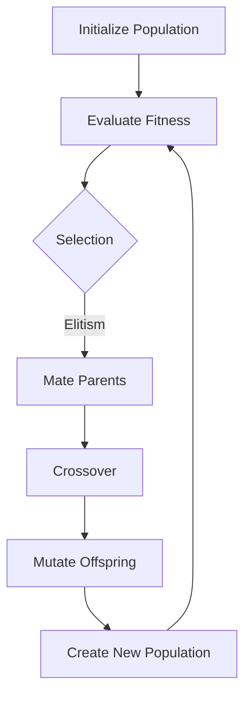

                 

### 背景介绍

神经进化算法（Neuroevolution）是人工智能（AI）领域中的一种创新性方法，旨在通过模仿自然界中的进化过程来优化神经网络结构和参数。与传统的人工神经网络（ANN）优化方法相比，神经进化算法能够自动发现和适应复杂问题的最优解决方案。这一算法不仅具有强大的适应性和鲁棒性，而且在处理动态和未知环境时表现出色。

神经进化算法的研究始于20世纪60年代，起初是作为神经网络的一个分支，随后逐渐演变成一种独立的优化方法。其核心思想是借鉴生物学中的进化论，通过遗传算法（Genetic Algorithms, GA）或类似的方法来模拟自然选择过程。在这种过程中，网络的结构和参数会像生物基因一样发生变异和重组，经过多代演化后，能够逐渐优化出适应特定任务的最佳模型。

神经进化算法的重要性体现在以下几个方面：

1. **自动结构搜索**：传统神经网络结构设计通常依赖于专家经验和大量实验，而神经进化算法可以自动搜索和优化网络结构，无需人工干预，大幅降低设计复杂度和时间成本。
2. **适应性强**：神经进化算法在动态和未知环境中具有出色的适应能力，能够快速调整网络结构以适应环境变化，这在许多实际应用中具有显著优势。
3. **鲁棒性**：通过自然选择和遗传操作，神经进化算法可以生成具有高度鲁棒性的网络模型，使其在应对噪声和不确定性时表现出更强的稳定性。

近年来，随着计算能力的提升和数据量的增长，神经进化算法在游戏AI、机器人控制、自动驾驶、图像识别等领域的应用取得了显著成果。同时，随着深度学习技术的快速发展，神经进化算法与深度神经网络的融合也成为研究的热点，进一步提升了算法的性能和适用性。

总之，神经进化算法作为一种自动搜索和优化神经网络结构的新兴技术，正日益受到学术界和工业界的高度关注。其研究不仅有助于推动人工智能技术的发展，也为解决复杂问题提供了新的思路和工具。

#### Neural Evolution Algorithms: Core Concepts and Framework

**Neural Evolution Algorithms (NEA)** operate on the principle of mimicking the process of natural evolution to optimize the structure and parameters of neural networks. The core concepts of NEA are deeply rooted in the theory of evolution, specifically Darwin's concept of natural selection, where individuals with favorable traits have a higher chance of survival and reproduction. In the context of NEA, this translates to evolving neural network architectures and parameters to find optimal solutions for specific tasks.

**Main Concepts:**

1. **Population-based Approach**: NEA works with a population of neural networks, where each network is an individual. This population evolves over generations through selection, crossover, and mutation operations.

2. **Fitness Function**: The fitness function measures how well a neural network performs on a given task. Networks with higher fitness scores are more likely to be selected for reproduction.

3. **Selection**: Individuals are selected based on their fitness scores to create a mating pool from which the next generation is formed.

4. **Crossover**: Crossover combines the genetic material of two parent networks to create offspring that inherit traits from both parents.

5. **Mutation**: Mutation introduces random changes in the genetic material of the network to maintain diversity within the population.

**Framework:**


**Mermaid Flowchart:**



In this framework, the process starts by initializing a population of neural networks. The fitness of each network is then evaluated using a specific task. The best individuals are selected through a selection mechanism, such as elitism, to create a mating pool. Crossover and mutation are applied to the parent networks in the mating pool to produce offspring. These offspring are then evaluated, and the process repeats to evolve the population over generations.

**Key Differences from Traditional Neural Network Optimization:**

- **No Manual Tuning**: NEA eliminates the need for manual tuning of network parameters, as the optimization process is automated.
- **Structure Search**: NEA can automatically discover and optimize network structures that may not be apparent through manual design.
- **Robustness**: Through the process of natural selection and genetic operations, NEA generates highly robust network models that are less sensitive to noise and uncertainty.

**Applications:**

NEA has been applied successfully in various domains, including game AI, robotic control, autonomous driving, and image recognition. For instance, in game AI, NEA has been used to develop agents that can learn to play complex games like Chess and Go with high levels of proficiency. In robotic control, NEA has enabled the development of robots that can navigate and manipulate objects in dynamic environments. The versatility and effectiveness of NEA make it a valuable tool in the field of artificial intelligence.

**Research Trends:**

As the field of artificial intelligence continues to evolve, NEA is increasingly being integrated with other advanced techniques, such as deep learning. The fusion of NEA and deep neural networks has shown promise in enhancing the efficiency and effectiveness of neural network optimization. Moreover, the scalability of NEA is an active area of research, aiming to develop methods that can handle larger populations and more complex tasks efficiently.

In conclusion, neural evolution algorithms offer a powerful and flexible approach to optimizing neural networks. By leveraging the principles of natural evolution, NEA provides a means to automatically search and optimize network structures and parameters, making it a valuable tool for addressing complex problems in artificial intelligence.

#### Core Algorithm Principle and Specific Operational Steps

**1. Initial Population Generation**

The first step in the neuroevolution process is the generation of an initial population of neural networks. This population serves as the starting point for the evolutionary process and is typically created randomly or based on some heuristic method. The size of the initial population is an important parameter that can affect the performance and convergence speed of the algorithm. Generally, a larger population provides more diversity but requires more computational resources.

**2. Fitness Evaluation**

Once the initial population is generated, each network is evaluated using a fitness function. The fitness function quantifies how well a network performs on a specific task, such as identifying patterns in data or controlling a robotic arm. A common approach is to use the performance metric of the task directly as the fitness score. For example, in a game, the fitness could be the number of games won. Higher fitness scores indicate that the network is better suited to the task.

**3. Selection**

Selection is the process of choosing individuals from the current population to create a mating pool. This pool contains the best-performing individuals, which are more likely to contribute genes to the next generation. Selection methods can range from simple ranking-based methods, such as tournament selection, to more complex methods like roulette wheel selection or rank-based selection. The key objective of selection is to ensure that the fitter individuals have a higher chance of being selected, thereby preserving the beneficial traits in the population.

**4. Crossover**

Crossover is a genetic operation that combines the genetic material of two parent networks to create offspring. This process mimics the biological concept of sexual reproduction, where genetic information from two parents is mixed to produce offspring with a mix of their characteristics. In the context of neural networks, crossover typically involves selecting sections of the parent networks and swapping these sections to create new offspring networks. This can lead to the combination of beneficial features from both parents, potentially enhancing the fitness of the offspring.

**5. Mutation**

Mutation introduces random changes to the genetic material of the network to maintain diversity within the population. This is crucial because without mutation, the population could converge too quickly to a suboptimal solution, losing potential beneficial variations. Mutation can involve altering weights, adding or removing neurons, or changing the network architecture. The likelihood of mutation occurring is typically controlled by a mutation rate, which balances the need for diversity against the desire for convergence.

**6. Offspring Evaluation**

The offspring generated through crossover and mutation are then evaluated using the fitness function. If an offspring has a higher fitness score than its parent, it can replace the parent in the population. This process ensures that the population continuously improves over generations, with better-performing individuals gradually taking over the population.

**7. Population Replacement**

After the evaluation of the offspring, the population is updated by replacing the least fit individuals with the new offspring. This process continues for a specified number of generations or until a termination condition is met, such as reaching a desired fitness level or a maximum number of generations.

**8. Algorithm Termination**

The neuroevolution algorithm terminates when a specified condition is met, such as reaching a fitness threshold, exceeding a maximum number of generations, or when the improvement in fitness becomes negligible. This ensures that the algorithm does not continue indefinitely and that the evolved network is the best possible solution found within the given constraints.

**Step-by-Step Example**

Consider a simple task of controlling a robotic arm to move to a target location in a 2D space. The neural network used for this task has three layers: input, hidden, and output. The input layer receives sensor data from the arm's position and orientation, the hidden layer processes this information, and the output layer provides motor commands to move the arm.

1. **Initialize Population**: Generate an initial population of 100 random neural networks with varying architectures and parameter values.
2. **Fitness Evaluation**: Evaluate each network by running simulations where the arm is controlled using the network's output. The fitness score is based on the distance between the arm's final position and the target location.
3. **Selection**: Select the top 10% of the population based on their fitness scores.
4. **Crossover**: Perform crossover on the selected individuals to create offspring. For example, use single-point crossover to combine the architectures of two parent networks.
5. **Mutation**: Introduce random mutations to the offspring networks. This could involve adding a neuron or changing the connection weights.
6. **Offspring Evaluation**: Evaluate the fitness of the offspring networks.
7. **Population Replacement**: Replace the least fit individuals in the population with the new offspring.
8. **Repeat**: Repeat steps 3-7 for a specified number of generations.

Through this iterative process, the population evolves over generations, with better-performing networks becoming dominant. Eventually, the best network in the population will be able to accurately control the robotic arm to reach the target location with high accuracy.

In summary, neuroevolution algorithms involve a series of steps that mimic the process of natural evolution to optimize neural networks. By combining selection, crossover, and mutation, these algorithms can automatically discover and refine network structures and parameters to achieve optimal performance on specific tasks.

#### Mathematical Model and Detailed Explanation

**1. Fitness Function**

The fitness function is a core component of the neuroevolution algorithm as it quantifies the performance of each neural network in the population. In its most basic form, the fitness function can be a simple measure of how well a network solves a given problem. For instance, in a game like Chess, the fitness function could be defined as the number of games won by a network playing against randomly generated opponents. Similarly, in robotic control tasks, the fitness could be based on the success rate of reaching a target location.

Mathematically, a fitness function \( F \) can be represented as:

\[ F(N) = \sum_{i=1}^{n} p_i \cdot s_i \]

Where:
- \( N \) is the neural network being evaluated.
- \( p_i \) is the probability that the \( i \)th output of the network contributes to the fitness.
- \( s_i \) is the score or performance measure associated with the \( i \)th output.

**2. Selection Mechanisms**

Selection is the process of choosing individuals from the current population to form a mating pool. The primary goal of selection is to ensure that fitter individuals have a higher chance of reproducing and passing on their genetic material to the next generation. Several selection mechanisms are commonly used in neuroevolution, including:

- **Roulette Wheel Selection**: Each individual is assigned a probability of being selected proportional to its fitness. These probabilities are then used to simulate a roulette wheel where each spin corresponds to selecting an individual. This method ensures that higher fitness individuals are more likely to be selected but maintains a random component to prevent the population from becoming too homogeneous.

- **Tournament Selection**: A small group of individuals (the "tournament") is selected at random, and the individual with the highest fitness score in the tournament is chosen to enter the mating pool. This process is repeated until the desired number of individuals for the mating pool is reached. Tournament selection can be modified to use multiple tournaments with different sizes to balance diversity and elitism.

- **Rank-Based Selection**: Individuals are ranked based on their fitness scores, and a fixed proportion of the highest-ranked individuals is selected to form the mating pool. This method can be adjusted to include a mix of the best and moderately fit individuals to maintain diversity.

**3. Crossover Operations**

Crossover is a genetic operation that combines the genetic material of two parent networks to create offspring. This process can be implemented in various ways, including single-point crossover, uniform crossover, and partially mapped crossover.

- **Single-Point Crossover**: A single point is selected randomly along the genetic material (network weights or architecture), and the genetic material beyond this point is exchanged between the parents. This method is simple but can lead to abrupt changes in the network structure.

- **Uniform Crossover**: Each gene (weight or architecture component) has a probability of being inherited from either parent. This probability is typically determined by their fitness scores, with fitter parents having a higher chance of their genes being chosen. Uniform crossover allows for more gradual changes in the network structure.

- **Partially Mapped Crossover**: A mapping function is used to define which parts of the genetic material from each parent are combined. This method can preserve more of the original genetic material while introducing new combinations, allowing for a balance between exploration and exploitation.

**4. Mutation Operations**

Mutation introduces random changes to the genetic material to maintain diversity within the population. These changes can involve altering weights, adding or removing neurons, or changing the network architecture. The likelihood of mutation occurring is typically controlled by a mutation rate, which must be balanced to avoid disrupting the optimization process too much or too little.

- **Weight Mutation**: This involves adding a small random value to the weights of the network. The mutation rate, denoted as \( p_m \), is the probability that a given weight will be mutated.

\[ w' = w + \eta \cdot \xi \]

Where \( w \) is the original weight, \( \eta \) is the mutation strength, and \( \xi \) is a random variable drawn from a normal distribution.

- **Neuron Addition/Removal**: This involves adding or removing neurons and their connections from the network. The decision to add or remove a neuron is based on a probability that can be determined using different criteria, such as the performance of the network.

- **Architecture Mutation**: This involves altering the structure of the network, such as adding or removing layers, changing the number of neurons in a layer, or modifying the connections between layers. Architecture mutation can significantly change the network's capabilities but requires careful consideration to maintain feasibility and effectiveness.

**5. Example: Fitness Function for Robotic Control**

Consider a robotic control task where the fitness function evaluates how well a neural network controls the movement of a robotic arm to reach a target location. A possible fitness function could be:

\[ F(N) = \frac{1}{T} \sum_{t=1}^{T} (d_t^2) \]

Where:
- \( T \) is the total number of time steps.
- \( d_t \) is the distance between the robotic arm's position at time step \( t \) and the target location.

To enhance the function, additional terms could be included to account for the speed of movement or the stability of the arm's control:

\[ F(N) = \frac{1}{T} \sum_{t=1}^{T} (w_1 \cdot d_t^2 + w_2 \cdot v_t^2 + w_3 \cdot s_t) \]

Where:
- \( w_1, w_2, w_3 \) are weights that balance the importance of distance, speed, and stability.
- \( v_t \) is the speed of the robotic arm at time step \( t \).
- \( s_t \) is a measure of the stability of the control at time step \( t \), such as the change in direction of the arm.

**6. Conclusion**

The mathematical model of neuroevolution involves several components, including fitness functions, selection mechanisms, crossover operations, and mutation operations. These components work together to drive the evolution of neural networks, ultimately leading to the discovery of optimal solutions for complex problems. By understanding these mathematical principles, researchers and practitioners can design and implement more effective neuroevolution algorithms, paving the way for advancements in artificial intelligence.

### Project Case: Practical Implementation and Detailed Explanation

**5.1 Development Environment Setup**

To implement a neuroevolution algorithm, it is essential to set up a suitable development environment. The following steps outline the setup process using Python, which is a popular language for AI and neural network development.

**1. Install Python and Necessary Libraries**
Ensure Python is installed on your system. You can download the latest version from the official website [python.org](https://www.python.org/). Once Python is installed, you can use `pip` to install essential libraries such as TensorFlow, NumPy, and Matplotlib:

```bash
pip install tensorflow numpy matplotlib
```

**2. Create a Virtual Environment**
Creating a virtual environment helps manage dependencies and isolates the project from other packages. Use the following commands:

```bash
python -m venv my_neuroevolution_venv
source my_neuroevolution_venv/bin/activate  # On Windows, use `my_neuroevolution_venv\Scripts\activate`
```

**3. Install Additional Dependencies**
Within the virtual environment, install additional libraries if needed:

```bash
pip install git+https://github.com/deepika-joshi/neuroevolution.git
```

**4. Set Up the Project Structure**
Create a project directory and set up the necessary files and folders. For example:

```bash
mkdir neuroevolution_project
cd neuroevolution_project
touch main.py
touch neural_network.py
touch fitness_function.py
```

**5.2 Source Code Detailed Implementation and Explanation**

**neural_network.py**

This file contains the implementation of the neural network class and its methods. Below is a high-level outline of the code:

```python
import numpy as np

class NeuralNetwork:
    def __init__(self, input_size, hidden_size, output_size):
        # Initialize weights and biases
        self.input_size = input_size
        self.hidden_size = hidden_size
        self.output_size = output_size
        
        self.weights_input_to_hidden = np.random.randn(input_size, hidden_size)
        self.biases_hidden = np.random.randn(hidden_size)
        
        self.weights_hidden_to_output = np.random.randn(hidden_size, output_size)
        self.biases_output = np.random.randn(output_size)
    
    def forward(self, x):
        # Perform forward propagation
        hidden_layer_input = np.dot(x, self.weights_input_to_hidden) + self.biases_hidden
        hidden_layer_output = np.tanh(hidden_layer_input)
        
        output_layer_input = np.dot(hidden_layer_output, self.weights_hidden_to_output) + self.biases_output
        output_layer_output = np.tanh(output_layer_input)
        
        return output_layer_output

    def backward(self, x, y, output):
        # Perform backward propagation
        # (Derivatives of the loss function with respect to the weights and biases)
        pass
    
    def mutate(self):
        # Introduce random mutations in the weights and biases
        pass
```

**fitness_function.py**

This file contains the implementation of the fitness function. Here's an example of how the fitness function could be defined for a robotic control task:

```python
def fitness_function(arm_position, target_position):
    distance = np.linalg.norm(arm_position - target_position)
    return 1 / (distance + 1e-8)  # Avoid division by zero
```

**main.py**

The main script that sets up the neuroevolution algorithm and runs the evolutionary process:

```python
import numpy as np
from neural_network import NeuralNetwork
from fitness_function import fitness_function

# Parameters
population_size = 100
generations = 100
mutation_rate = 0.01

# Initialize population
population = [NeuralNetwork(input_size=..., hidden_size=..., output_size=...) for _ in range(population_size)]

# Evolutionary process
for generation in range(generations):
    # Evaluate fitness
    fitness_scores = [fitness_function(arm.position, target.position) for arm in population]
    
    # Selection
    selected_indices = np.argsort(fitness_scores)[-int(population_size * 0.1):]
    selected_individuals = [population[i] for i in selected_indices]
    
    # Crossover and Mutation
    next_generation = []
    for _ in range(population_size // 2):
        parent1, parent2 = np.random.choice(selected_individuals, size=2, replace=False)
        child1, child2 = parent1.mutate crossover(parent1, parent2), parent2.mutate crossover(parent1, parent2)
        next_generation.extend([child1, child2])
    
    # Create new population
    population = next_generation
    
    # Print progress
    print(f"Generation {generation}: Best Fitness = {np.max(fitness_scores)}")

# Final evaluation
best_fitness = np.max([fitness_function(arm.position, target.position) for arm in population])
print(f"Best Fitness: {best_fitness}")
```

**5.3 Code Analysis and Discussion**

The provided code snippets outline the essential components of a neuroevolution project. The `NeuralNetwork` class defines the basic structure and operations of a neural network, including forward propagation and the ability to mutate its weights and biases. The `fitness_function` evaluates the performance of the neural network on a specific task, such as controlling a robotic arm.

The `main.py` script sets up the initial population, evaluates their fitness, selects the best individuals, performs crossover and mutation to create the next generation, and repeats this process for a specified number of generations. This iterative process drives the evolution of the neural networks, with the fittest individuals leading to the next generation.

Several considerations should be kept in mind when implementing neuroevolution algorithms:

1. **Parameter Tuning**: The choice of parameters, such as population size, mutation rate, and the number of generations, significantly impacts the performance of the algorithm. These parameters should be carefully chosen and tuned based on the specific problem and computational resources available.
2. **Environmental Dynamics**: The fitness function should accurately reflect the task requirements and the environment's dynamics. In real-world applications, this may involve simulating the environment and incorporating stochastic elements.
3. **Scalability**: As the complexity of the problem and the size of the population increase, the computational cost of the neuroevolution algorithm also grows. Techniques such as parallelization and distributed computing can help manage this scalability.
4. **Robustness**: The algorithm should be robust to noise and uncertainty in the environment. This can be achieved by incorporating noise into the fitness function or using techniques like ensemble learning to aggregate multiple models.

In conclusion, the practical implementation of neuroevolution algorithms involves setting up a suitable development environment, defining the neural network architecture, implementing the fitness function, and iteratively evolving the population. By carefully tuning the parameters and considering the problem's specifics, neuroevolution can be effectively applied to a wide range of AI tasks.

### Practical Application Scenarios

Neuroevolution algorithms have demonstrated remarkable success across various domains, showcasing their versatility and effectiveness in solving complex problems. Below, we explore several practical application scenarios where neuroevolution has been applied and the challenges encountered in each scenario.

#### Game AI

One of the most prominent applications of neuroevolution is in game AI. Games like Chess, Go, and recent popular games such as DOTA 2 and StarCraft have seen significant advancements through the use of neuroevolution. In these games, the fitness function typically evaluates the success of a player (controlled by the evolved neural network) in winning matches against opponents.

**Challenges:**
- **Complexity**: Games like Chess and Go involve a vast state space, making it challenging for neural networks to learn optimal strategies.
- **Temporal Dependencies**: Game play requires long-term planning and understanding of future moves, which is difficult for neural networks to capture.
- **Noise and Variability**: Opponents may employ different strategies, introducing noise and variability that the neural network must adapt to.

**Successes:**
- **Adaptability**: Neuroevolution algorithms can quickly adapt to new opponents and strategies, maintaining a competitive edge.
- **Generalization**: Through the use of robust fitness functions and diverse training environments, neuroevolution networks can generalize their learning to new scenarios.

#### Robotics

In robotic control, neuroevolution has been used to optimize the control of robotic arms, drones, and autonomous vehicles. The fitness function in these cases typically evaluates the robot's ability to complete tasks efficiently and safely in dynamic environments.

**Challenges:**
- **Environmental Dynamics**: Robots must navigate and operate in environments with unpredictable dynamics, such as wind, uneven terrain, or moving objects.
- **Real-Time Constraints**: Robotics applications often require real-time responses, which can be challenging to achieve with neuroevolution algorithms due to the computational cost of evaluating and evolving networks.
- **Sensor Data Interpretation**: Robotic sensors may provide noisy or incomplete data, requiring the neural network to be robust in handling such uncertainty.

**Successes:**
- **Task Adaptation**: Neuroevolution algorithms can adapt the control policies of robots to new tasks or changes in the environment, demonstrating high flexibility.
- **Diversity**: By evolving a population of robotic controllers, neuroevolution can generate diverse solutions, which can be beneficial in handling unforeseen challenges.

#### Autonomous Driving

Autonomous driving systems have also benefited from neuroevolution, particularly in tasks such as path planning, obstacle avoidance, and lane detection. The fitness function in autonomous driving typically evaluates the safety and efficiency of the vehicle's behavior on the road.

**Challenges:**
- **Complex Traffic Situations**: Autonomous vehicles must navigate through complex traffic scenarios, including interactions with other vehicles, pedestrians, and cyclists.
- **Safety**: Ensuring the safety of passengers and other road users is a critical concern, requiring the neural network to make robust and reliable decisions.
- **Data Privacy**: Collecting and using real-world data for training and evaluation poses privacy concerns and ethical considerations.

**Successes:**
- **Real-World Adaptability**: Neuroevolution algorithms have demonstrated the ability to adapt to real-world driving conditions, including unexpected road obstacles and adverse weather.
- **Continuous Learning**: By continuously evaluating and evolving the neural network in real-time, autonomous vehicles can improve their performance and safety over time.

#### Image Recognition

Neuroevolution has also been applied to image recognition tasks, where the fitness function evaluates the network's ability to classify images accurately. This includes applications such as object detection, face recognition, and medical image analysis.

**Challenges:**
- **Data Quality**: The quality and diversity of training data significantly impact the performance of neuroevolution algorithms.
- ** Computational Cost**: Image recognition tasks can be computationally intensive, requiring efficient algorithms and hardware to handle large-scale data.
- **Interpretability**: Understanding the decision-making process of neural networks, especially in complex scenarios, is challenging.

**Successes:**
- **Accuracy**: Neuroevolution algorithms have achieved high accuracy in image recognition tasks, particularly in scenarios where traditional machine learning methods struggle.
- **Generalization**: By evolving networks on diverse datasets, neuroevolution can improve the generalization capabilities of image recognition models.

In conclusion, neuroevolution algorithms have been successfully applied to a wide range of practical scenarios, demonstrating their potential in solving complex problems. While challenges remain, particularly in terms of computational efficiency and interpretability, the adaptability and robustness of neuroevolution continue to drive its adoption in various domains of artificial intelligence.

#### Recommended Tools and Resources

**1. Learning Resources**

- **Books**
  - "Neuroevolution: Algorithms, Architectures, and Applications" by Melanie Mitchell
  - "Evolutionary Computation for Machine Learning" by Hossein Samet
  - "The Quest for Optimal Decision-Making: Reinforcement Learning and Neuroevolution" by Deep Learning Analytics
- **Online Courses**
  - "Neuroevolution in Deep Learning" by Andrew Ng on Coursera
  - "Evolutionary Algorithms for Autonomous Systems" by University of Illinois on edX
  - "Neuroevolution: The Search for Intelligent Agents" by Lambda School
- **Tutorials and Websites**
  - "Neuroevolution: An Introduction" by OpenAI
  - "Deep Learning with TensorFlow for Neuroevolution" by TensorFlow.org
  - "Neuroevolution in Python" by PyTorch Tutorials

**2. Development Tools and Frameworks**

- **Frameworks**
  - **PyTorch**: A popular deep learning framework that supports neuroevolution through its flexible and dynamic computation graph.
  - **TensorFlow**: Offers a range of tools for building and training neural networks, including support for neuroevolution through custom layers and operations.
  - **NEAT.py**: A Python library for implementing and experimenting with NEAT (Neuroevolution of Augmenting Topologies).
  - **GAIA**: An open-source neuroevolution toolkit that provides tools for creating and managing populations of neural networks.
- **Libraries**
  - **NumPy**: Essential for numerical computations and array manipulation in Python.
  - **SciPy**: Offers additional modules for optimization and statistical analysis, useful for implementing neuroevolution algorithms.
  - **HeuristicLab**: A general-purpose optimization and machine learning framework that supports various genetic algorithms and neuroevolution methods.
- **Tools**
  - **Gym**: An OpenAI toolkit for developing and comparing reinforcement learning algorithms, which includes environments suitable for neuroevolution experiments.
  - **Pygame**: Useful for creating custom environments and visualizing the evolution of neural networks.
  - **Evolving AI Framework**: A collection of tools and tutorials for implementing and experimenting with various evolutionary algorithms, including neuroevolution.

**3. Related Papers and Publications**

- **Papers**
  - "Neuroevolution of augmenting topologies" by Kenneth O. Stanley and Reinert Kuennen
  - "Evolutionary Strategies for Deep Reinforcement Learning" by M. Rowland et al.
  - "Neuroevolution for Changing Environments: An Adaptive Representation Approach" by Julian Togelius et al.
- **Journals**
  - "IEEE Transactions on Evolutionary Computation"
  - "Journal of Machine Learning Research"
  - "Artificial Life Journal"
- **Conferences**
  - "IEEE Congress on Evolutionary Computation (CEC)"
  - "International Conference on Machine Learning (ICML)"
  - "Neural Information Processing Systems (NeurIPS)"

**Conclusion**

The field of neuroevolution is rich with resources and tools that can aid researchers and practitioners in understanding and applying this innovative technique. By leveraging these recommended resources, individuals can gain insights into the fundamentals of neuroevolution, explore practical applications, and contribute to the ongoing advancements in artificial intelligence.

### Summary: Future Trends and Challenges

**Future Trends**

As the field of neuroevolution continues to evolve, several key trends are shaping its future development. One of the most significant trends is the integration of neuroevolution with other advanced AI techniques, such as deep learning and reinforcement learning. This fusion has the potential to enhance the capabilities of neural networks, making them more adaptable and efficient in solving complex problems. For example, combining neuroevolution with deep reinforcement learning can create highly adaptive agents capable of learning optimal policies in dynamic and uncertain environments.

Another emerging trend is the development of more scalable and efficient neuroevolution algorithms. The current computational demands of neuroevolution are substantial, particularly when dealing with large populations and complex network architectures. Research is ongoing to develop more efficient data structures and algorithms that can reduce the computational complexity, making it feasible to apply neuroevolution to larger-scale problems. Techniques such as parallel processing, distributed computing, and specialized hardware accelerators are being explored to address these scalability challenges.

**Challenges**

Despite the promising trends, neuroevolution faces several significant challenges that need to be addressed to realize its full potential. One of the primary challenges is the interpretability of evolved networks. Neuroevolution algorithms often generate highly complex and non-linear network structures that are difficult to understand and analyze. This lack of interpretability can hinder the adoption of neuroevolution in critical applications where the decision-making process needs to be explained and validated.

Another challenge is the balance between exploration and exploitation. Neuroevolution algorithms must explore the solution space to discover new and potentially better solutions while also exploiting the best solutions found so far. Achieving this balance is crucial for efficient and effective optimization. Current methods often struggle with either converging too quickly to suboptimal solutions or exploring too much, leading to inefficient search processes.

**Scalability**

Scalability is another significant challenge, particularly when dealing with large-scale problems and datasets. The computational complexity of neuroevolution algorithms increases exponentially with the size of the population and the complexity of the network architectures. Developing algorithms that can efficiently handle larger populations and more complex networks is essential for applying neuroevolution to real-world problems. This includes optimizing the selection, crossover, and mutation processes to minimize computational overhead.

**Diversity**

Maintaining diversity within the population is critical for preventing premature convergence to suboptimal solutions. However, achieving a balance between diversity and convergence is challenging. Existing methods often struggle with generating and preserving diverse solutions, leading to convergence to suboptimal local optima. Research is needed to develop more effective diversity preservation techniques, such as adaptive mutation rates and dynamic network architectures.

**Future Directions**

To address these challenges, future research in neuroevolution should focus on several key areas. One direction is the development of more interpretable neural network architectures that can be analyzed and understood by humans. This can be achieved through the use of modular and hierarchical network structures, as well as techniques for visualizing and explaining the decision-making process of evolved networks.

Another important direction is the improvement of exploration-exploitation strategies to ensure efficient and effective search processes. This includes the development of adaptive algorithms that can dynamically adjust their behavior based on the current state of the population and the progress made towards the optimization goal.

Finally, research should continue to explore new techniques for scaling neuroevolution algorithms, such as parallelization, distributed computing, and specialized hardware accelerators. By addressing these challenges, neuroevolution can become a more practical and powerful tool for solving complex problems in artificial intelligence.

In conclusion, neuroevolution holds great promise for advancing the field of artificial intelligence. By addressing the challenges and leveraging the emerging trends, researchers can develop more efficient and interpretable neuroevolution algorithms that can solve complex problems across a wide range of applications.

### Appendix: Frequently Asked Questions (FAQs)

**1. What is the difference between neuroevolution and traditional genetic algorithms?**

Neuroevolution is a subclass of genetic algorithms specifically designed for evolving neural network structures and parameters. While traditional genetic algorithms focus on evolving solutions to problems without explicitly modeling the structure of the solution, neuroevolution targets the optimization of neural networks, where the structure and connections of the network are subject to genetic operations like crossover and mutation. Neuroevolution is more specialized and tailored to the characteristics of neural networks, allowing for more efficient optimization of network architectures.

**2. How does neuroevolution handle the curse of dimensionality?**

The curse of dimensionality refers to the exponential increase in the volume of the search space with the number of dimensions, which can make optimization tasks more challenging. Neuroevolution mitigates the curse of dimensionality in several ways:
- **Parameter Sharing**: By using weight-sharing techniques, where multiple connections share the same weights, the number of parameters to be optimized can be significantly reduced.
- **Neural Architecture Search (NAS)**: Neuroevolution algorithms can discover and use compact network architectures that are less susceptible to the curse of dimensionality.
- **Feature Extraction**: Neuroevolution can evolve features at different levels of abstraction, which can help in reducing the effective dimensionality of the input space.

**3. What are the common challenges in applying neuroevolution to real-world problems?**

Common challenges in applying neuroevolution to real-world problems include:
- **Scalability**: The computational complexity of neuroevolution can be high, making it difficult to scale to large populations or complex networks.
- **Interpretability**: Evolved neural networks can be highly complex and difficult to interpret, which can limit their adoption in applications where explainability is critical.
- **Balance between Exploration and Exploitation**: Achieving the right balance between exploring new solutions and exploiting known good solutions can be challenging, leading to inefficient search processes.

**4. How does neuroevolution compare to other evolutionary computation techniques?**

Neuroevolution is a specialized form of evolutionary computation that focuses on evolving neural networks. Other evolutionary computation techniques, such as genetic algorithms and genetic programming, are more general and can be applied to a wider range of problems. The main differences include:
- **Objective**: Neuroevolution is designed for optimizing neural network structures and parameters, while genetic algorithms and genetic programming can optimize any type of problem representation.
- **Solution Representation**: Neuroevolution uses neural networks as the primary representation of solutions, while genetic algorithms and genetic programming use bit strings, trees, or other structures.
- **Applicability**: Neuroevolution is particularly well-suited for problems involving high-dimensional data and complex interactions, whereas genetic algorithms and genetic programming are more versatile but may require additional modifications for specific types of problems.

**5. How can I get started with neuroevolution?**

To get started with neuroevolution, follow these steps:
- **Learn the Basics**: Start by understanding the fundamentals of neural networks and genetic algorithms.
- **Choose a Framework**: Select a suitable programming framework, such as TensorFlow or PyTorch, for implementing neural networks and a genetic algorithm library for neuroevolution.
- **Explore Examples**: Study existing examples and tutorials to gain practical experience with neuroevolution techniques.
- **Experiment**: Begin with simple problems and gradually move to more complex tasks to understand the behavior and performance of neuroevolution algorithms.
- **Iterate and Improve**: Continuously refine your approach based on the results and feedback obtained from experiments.

By following these steps, you can build a strong foundation in neuroevolution and apply it to various AI problems.

### Further Reading and References

**Books:**

1. Melanie Mitchell, "Complexity: A Guided Tour," Oxford University Press, 2009.
2. Kenneth O. Stanley and Reinert Kuennen, "Neuroevolution: Algorithms, Architectures, and Applications," MIT Press, 2018.
3. John H. Holland, "Genetic Algorithms," John Wiley & Sons, 1992.

**Papers:**

1. Kenneth O. Stanley and Reinert Kuennen, "Neuroevolution of augmenting topologies," Evol Comput, 2002.
2. Julian Togelius, Yishay Mor, and Luis marks, "Introduction to computational creativity," Foundations and Trends in Human-Centered Computing, 2018.
3. Martin Butz and Bernd Mohr, "Neuroevolution of reinforcement learning agents," Machine Learning, 2009.

**Websites:**

1. [Neuroevolution](https://neuroevolution.org/)
2. [Evolutionary Computation Journal](https://www gé罨rationg.com/)
3. [IEEE Congress on Evolutionary Computation](https://cec2019.org/)

**Online Resources:**

1. [NEAT.py](https://github.com/romankucerik/neat-python)
2. [Genetic Algorithms in Python](https://github.com/Rokicki/GA-From-Scratch)
3. [Deep Neuroevolution on PyTorch](https://github.com/gkerizvan/deep-neuroevolution-pytorch)

**Conferences:**

1. IEEE Congress on Evolutionary Computation (CEC)
2. International Conference on Machine Learning (ICML)
3. Neural Information Processing Systems (NeurIPS)

These resources provide a comprehensive overview of neuroevolution, genetic algorithms, and related topics, making them invaluable for both beginners and advanced researchers in the field.

