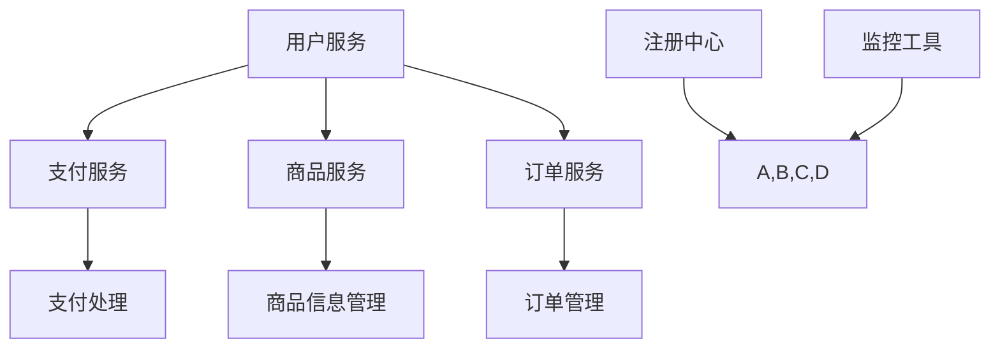
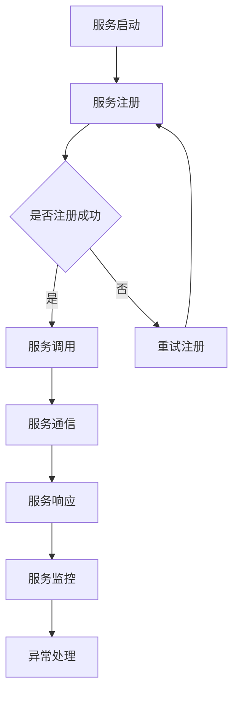

                 

### 背景介绍

#### 程序员创业潮：挑战与机遇并存的现实

近年来，随着全球经济的不断发展和互联网技术的飞速进步，程序员创业公司如雨后春笋般涌现。无论是独角兽企业，还是初创团队，这些公司都在积极探索和实现技术驱动的商业模式。然而，创业的道路并非一帆风顺，程序员们在追求梦想的同时，也面临着诸多挑战。

首先，技术迭代速度快，程序员们需要不断学习新的编程语言、框架和工具，以适应不断变化的市场需求。其次，创业公司的资金和资源相对有限，程序员们需要在有限的条件下，实现高性能和高可扩展性的系统架构。此外，项目管理、团队协作和市场竞争等方面的压力，也对程序员提出了更高的要求。

然而，正是这些挑战，赋予了程序员创业公司独特的机遇。通过创新的技术解决方案，程序员们可以为市场带来全新的产品和服务，改变现有的商业模式，甚至引领行业的发展趋势。在这个过程中，微服务架构作为一种流行的系统设计模式，成为了许多程序员创业公司的首选。

#### 微服务架构：为什么如此受欢迎？

微服务架构（Microservices Architecture）是一种将大型复杂系统分解为多个独立、可扩展的小型服务的设计模式。这种模式在过去的十年里，逐渐成为软件架构领域的主流趋势，并被广泛应用于各种规模的企业和项目。

微服务架构之所以受欢迎，主要有以下几个原因：

1. **高可扩展性**：微服务架构允许单个服务独立扩展，从而提高了系统的整体性能和可扩展性。这种模式特别适用于处理高并发和大数据的场景。
2. **高灵活性**：微服务架构中的每个服务都是独立的，可以独立开发、测试和部署。这为团队的敏捷开发和持续集成提供了便利。
3. **高容错性**：微服务架构中的服务是松耦合的，单个服务的故障不会影响到整个系统的运行。这种模式提高了系统的容错能力和稳定性。
4. **技术多样性**：微服务架构允许不同服务使用不同的技术栈，从而提高了团队的技术多样性和创新性。

总之，微服务架构为程序员创业公司提供了一种灵活、高效、可靠的设计模式，使其能够在复杂的市场环境中脱颖而出。

#### 本文结构

本文将围绕程序员创业公司的微服务架构设计与实现展开讨论。具体结构如下：

1. **核心概念与联系**：介绍微服务架构的核心概念和设计原则，并通过Mermaid流程图展示架构的总体框架。
2. **核心算法原理 & 具体操作步骤**：详细阐述微服务架构的实现原理，包括服务拆分、服务注册与发现、服务通信等关键步骤。
3. **数学模型和公式 & 详细讲解 & 举例说明**：探讨微服务架构中的数据结构和算法，并通过具体例子展示如何应用这些算法。
4. **项目实战：代码实际案例和详细解释说明**：通过一个真实的微服务项目，展示从开发环境搭建到源代码实现的整个过程。
5. **实际应用场景**：分析微服务架构在不同场景下的适用性，包括电商、金融、物联网等。
6. **工具和资源推荐**：推荐学习资源、开发工具和框架，帮助程序员更好地掌握微服务架构。
7. **总结：未来发展趋势与挑战**：总结微服务架构的现状和未来发展趋势，探讨面临的挑战和解决方法。
8. **附录：常见问题与解答**：解答程序员在微服务架构设计与实现过程中可能遇到的问题。
9. **扩展阅读 & 参考资料**：提供进一步阅读的资料和参考链接。

通过本文的讨论，希望读者能够对微服务架构有更深入的理解，并能够将其应用到实际项目中，为创业公司的发展提供有力的技术支持。

---

## 1. 背景介绍

### 程序员创业潮：挑战与机遇并存的现实

近年来，随着全球经济的不断发展和互联网技术的飞速进步，程序员创业公司如雨后春笋般涌现。无论是在硅谷、北京、上海还是其他科技城市，程序员们纷纷投身于创业的浪潮中，试图通过创新的技术解决方案，改变现有的商业模式，甚至引领行业的发展趋势。

然而，创业的道路并非一帆风顺。对于程序员而言，尽管他们拥有丰富的技术背景和编程经验，但在创业过程中，他们仍面临着诸多挑战。首先，技术迭代速度快，程序员们需要不断学习新的编程语言、框架和工具，以适应不断变化的市场需求。例如，云计算、大数据、人工智能等前沿技术的崛起，要求程序员们不断更新知识库，以保持竞争力。

其次，创业公司的资金和资源相对有限，程序员们需要在有限的条件下，实现高性能和高可扩展性的系统架构。这对于许多初创团队来说，无疑是一个巨大的挑战。如何在预算有限的情况下，打造出稳定、高效、可扩展的系统，成为了程序员们需要解决的问题。

此外，项目管理、团队协作和市场竞争等方面的压力，也对程序员提出了更高的要求。在创业公司中，程序员不仅要承担技术实现的责任，还需要参与项目管理和团队协作，甚至有时还需要面对激烈的市场竞争。这些因素无疑增加了程序员的负担，但同时也为他们的职业发展提供了广阔的空间。

然而，正是这些挑战，赋予了程序员创业公司独特的机遇。通过创新的技术解决方案，程序员们可以为市场带来全新的产品和服务，改变现有的商业模式，甚至引领行业的发展趋势。例如，一些程序员创业公司通过应用人工智能技术，打造出了智能客服、智能推荐等创新产品，颠覆了传统的商业运营模式。

此外，随着云计算、大数据、物联网等新兴技术的广泛应用，程序员们也有机会涉足更多领域，开拓更广阔的市场。这些技术不仅为程序员创业公司提供了丰富的创新空间，也为他们带来了更多的商业机会。

总的来说，程序员创业公司面临着挑战与机遇并存的现实。在这些挑战中，程序员们不仅需要不断提升自己的技术能力，还需要学会如何管理项目、团队和资源。而在这些机遇中，程序员们则有机会通过创新的技术解决方案，实现自己的创业梦想，为社会带来更多的价值。

### 微服务架构：为什么如此受欢迎？

微服务架构（Microservices Architecture）是一种将大型复杂系统分解为多个独立、可扩展的小型服务的设计模式。这种模式在过去的十年里，逐渐成为软件架构领域的主流趋势，并被广泛应用于各种规模的企业和项目。为什么微服务架构如此受欢迎？以下是几个关键原因。

#### 高可扩展性

首先，微服务架构提供了高可扩展性。在传统的单体架构中，整个系统通常是一个庞大的整体，难以单独扩展某个功能模块。而在微服务架构中，每个服务都是独立的，可以独立扩展。这意味着，如果某个服务需要处理更多的流量或数据，可以单独对该服务进行扩展，而不需要影响其他服务。例如，一个电商系统可以拆分为商品管理服务、订单管理服务、库存管理服务等多个独立的服务，每个服务都可以独立扩展，以应对不同的业务需求。

#### 高灵活性

其次，微服务架构提高了系统的灵活性。每个微服务都可以独立开发、测试和部署，这使得团队能够更灵活地进行协作。在传统的单体架构中，不同的功能模块往往需要协同工作，这增加了开发、测试和部署的复杂性。而在微服务架构中，每个服务都可以独立开发，团队可以专注于自己的服务，从而提高了开发效率。此外，由于服务是独立的，可以更容易地进行重构和更新，而不需要担心影响整个系统的稳定性。

#### 高容错性

微服务架构还提供了高容错性。在传统的单体架构中，如果某个模块发生故障，可能会影响整个系统的运行。而在微服务架构中，服务是松耦合的，单个服务的故障不会影响到其他服务的运行。这意味着，即使某个服务发生故障，整个系统仍然可以保持稳定运行。例如，如果一个订单管理服务出现故障，不会影响到商品管理服务和库存管理服务的运行。

#### 技术多样性

微服务架构允许团队使用不同的技术栈，从而提高了技术的多样性。在传统的单体架构中，整个系统通常使用相同的技术栈，这限制了团队的选择和创新。而在微服务架构中，不同的服务可以采用不同的技术栈，例如一个服务可以使用Spring Boot，另一个服务可以使用Node.js，这样可以更好地满足不同的业务需求，提高系统的灵活性。

#### 简化部署和监控

微服务架构简化了部署和监控。在传统的单体架构中，部署和监控通常比较复杂，因为需要协调多个模块的部署和监控。而在微服务架构中，每个服务都是独立的，可以独立部署和监控，这大大简化了部署和监控的流程。此外，由于服务是独立的，可以更方便地进行灰度发布，逐步引入新的功能，从而降低风险。

总的来说，微服务架构因其高可扩展性、高灵活性、高容错性、技术多样性和简化部署监控等优点，受到了广泛的欢迎。这种架构模式不仅适用于大型企业，也适用于中小型公司，为程序员创业公司提供了有效的解决方案，帮助他们应对复杂的市场环境。

### 本文结构

本文将围绕程序员创业公司的微服务架构设计与实现展开讨论。具体结构如下：

1. **核心概念与联系**：介绍微服务架构的核心概念和设计原则，并通过Mermaid流程图展示架构的总体框架。
2. **核心算法原理 & 具体操作步骤**：详细阐述微服务架构的实现原理，包括服务拆分、服务注册与发现、服务通信等关键步骤。
3. **数学模型和公式 & 详细讲解 & 举例说明**：探讨微服务架构中的数据结构和算法，并通过具体例子展示如何应用这些算法。
4. **项目实战：代码实际案例和详细解释说明**：通过一个真实的微服务项目，展示从开发环境搭建到源代码实现的整个过程。
5. **实际应用场景**：分析微服务架构在不同场景下的适用性，包括电商、金融、物联网等。
6. **工具和资源推荐**：推荐学习资源、开发工具和框架，帮助程序员更好地掌握微服务架构。
7. **总结：未来发展趋势与挑战**：总结微服务架构的现状和未来发展趋势，探讨面临的挑战和解决方法。
8. **附录：常见问题与解答**：解答程序员在微服务架构设计与实现过程中可能遇到的问题。
9. **扩展阅读 & 参考资料**：提供进一步阅读的资料和参考链接。

通过本文的讨论，希望读者能够对微服务架构有更深入的理解，并能够将其应用到实际项目中，为创业公司的发展提供有力的技术支持。

---

## 2. 核心概念与联系

### 微服务架构概述

微服务架构是一种基于业务逻辑分解的软件设计模式，旨在通过将大型复杂系统分解为多个独立、松耦合的小型服务，以提高系统的可扩展性、灵活性和可维护性。微服务架构的核心概念包括服务拆分、服务注册与发现、服务通信、服务监控等。

#### 服务拆分

服务拆分是微服务架构的第一步，也是最为关键的一步。合理的服务拆分能够确保每个服务都具备独立的功能，并且具有较高的内聚度和低耦合度。在服务拆分时，程序员需要根据业务需求、数据依赖和功能独立性等因素进行综合考虑。

以下是一个简单的服务拆分示例：

- **用户服务**：负责用户注册、登录、权限管理等功能。
- **商品服务**：负责商品信息管理、库存管理等功能。
- **订单服务**：负责订单创建、支付、物流管理等功能。
- **支付服务**：负责处理支付请求、生成支付凭证等功能。

#### 服务注册与发现

服务注册与发现是微服务架构中的一项重要功能。服务注册是指在服务启动时，将其元数据（如服务名称、接口地址、端口等）注册到一个注册中心。服务发现则是在服务需要调用其他服务时，通过注册中心查询目标服务的元数据，以获取其接口地址。

常见的服务注册与发现解决方案包括Netflix Eureka、Consul、Zookeeper等。以下是一个简单的服务注册与发现流程：

1. **服务启动时**：服务将元数据注册到注册中心。
2. **服务调用时**：调用方通过注册中心查询目标服务的元数据，获取接口地址。
3. **服务停止时**：服务将元数据从注册中心注销。

#### 服务通信

服务通信是微服务架构中实现服务间交互的核心环节。常见的服务通信方式包括同步通信和异步通信。

1. **同步通信**：服务调用方发送请求，等待服务响应。常用的同步通信协议包括HTTP/HTTPS、gRPC等。

2. **异步通信**：服务调用方发送请求后，无需等待服务响应，可以继续执行其他任务。常用的异步通信协议包括RabbitMQ、Kafka、RocketMQ等。

以下是一个简单的服务通信示例：

- 用户服务需要调用支付服务进行支付处理，用户服务发送请求到支付服务，支付服务处理完成后，返回结果给用户服务。

#### 服务监控

服务监控是确保微服务架构稳定运行的重要手段。通过监控，程序员可以实时了解服务的运行状态，及时发现并解决潜在的问题。

常见的服务监控指标包括：

- **服务响应时间**：衡量服务处理请求的效率。
- **服务成功率**：衡量服务处理请求的成功率。
- **服务并发量**：衡量服务的负载能力。
- **服务异常率**：衡量服务的异常情况。

常见的服务监控工具包括Prometheus、Grafana、ELK（Elasticsearch、Logstash、Kibana）等。

### Mermaid流程图

为了更直观地展示微服务架构的核心概念和联系，我们可以使用Mermaid流程图来描述服务拆分、服务注册与发现、服务通信、服务监控等关键步骤。

以下是一个简单的Mermaid流程图示例：



在这个示例中，用户服务、支付服务、商品服务和订单服务分别表示微服务架构中的不同功能模块。注册中心负责服务注册与发现，监控工具负责对服务的运行状态进行监控。

通过上述内容，我们了解了微服务架构的核心概念和联系。在接下来的章节中，我们将进一步探讨微服务架构的实现原理、数学模型和公式、项目实战等，帮助读者更深入地理解微服务架构的设计与实现。

---

## 2. 核心概念与联系

### 微服务架构的深入探讨

#### 服务拆分

服务拆分是微服务架构的核心步骤之一，决定了系统的可扩展性、灵活性和可维护性。一个合理的服务拆分可以使每个服务都具备独立的功能，并且具有较高的内聚度和低耦合度。

**服务拆分的原则**

1. **业务相关性**：将功能紧密相关的模块拆分为同一个服务，例如用户服务、商品服务、订单服务等。
2. **数据独立性**：确保每个服务的数据存储独立，减少数据一致性的问题。
3. **接口独立性**：每个服务的接口应该尽量独立，避免服务间的依赖。
4. **性能考虑**：根据业务需求，合理分配服务，确保每个服务的性能和负载均衡。

**服务拆分的示例**

假设我们开发一个电商系统，可以按照以下方式进行服务拆分：

- **用户服务**：负责用户注册、登录、权限管理等功能。
- **商品服务**：负责商品信息管理、库存管理等功能。
- **订单服务**：负责订单创建、支付、物流管理等功能。
- **支付服务**：负责处理支付请求、生成支付凭证等功能。
- **库存服务**：负责库存监控、库存调整等功能。

通过这样的服务拆分，每个服务都可以独立扩展和优化，提高了系统的可维护性和可扩展性。

#### 服务注册与发现

服务注册与发现是微服务架构中的关键环节，确保服务可以动态地发现和调用其他服务。服务注册是指在服务启动时，将服务的信息（如服务名称、接口地址、端口等）注册到注册中心。服务发现则是在服务需要调用其他服务时，通过注册中心查询目标服务的元数据，以获取其接口地址。

**服务注册与发现的过程**

1. **服务启动**：服务启动后，将自身的信息注册到注册中心。
2. **服务调用**：当需要调用其他服务时，服务通过注册中心查询目标服务的元数据。
3. **服务更新**：服务运行过程中，如果接口地址、端口等信息发生改变，会更新注册中心的元数据。
4. **服务停止**：服务停止时，从注册中心注销自身的信息。

**常见的注册中心**

- **Eureka**：由Netflix开发，支持服务注册、发现和负载均衡。
- **Consul**：支持服务注册、发现、健康检查和配置管理。
- **Zookeeper**：支持服务注册、发现和分布式锁等。

#### 服务通信

服务通信是微服务架构中实现服务间交互的核心。常见的通信方式包括同步通信和异步通信。

**同步通信**

同步通信是指服务调用方发送请求后，等待服务响应。常用的同步通信协议包括HTTP/HTTPS、gRPC等。

- **HTTP/HTTPS**：基于Web协议的通信，简单易用，但可能存在性能瓶颈。
- **gRPC**：基于HTTP/2的通信协议，支持多语言、高性能和跨平台。

**异步通信**

异步通信是指服务调用方发送请求后，无需等待服务响应，可以继续执行其他任务。常用的异步通信协议包括RabbitMQ、Kafka、RocketMQ等。

- **RabbitMQ**：支持可靠的消息队列通信，但性能较低。
- **Kafka**：支持高吞吐量的消息队列通信，但不太适合长轮询。
- **RocketMQ**：阿里巴巴开源的消息队列，支持可靠性和高性能。

#### 服务监控

服务监控是确保微服务架构稳定运行的重要手段。通过监控，程序员可以实时了解服务的运行状态，及时发现并解决潜在的问题。

**监控指标**

- **服务响应时间**：衡量服务处理请求的效率。
- **服务成功率**：衡量服务处理请求的成功率。
- **服务并发量**：衡量服务的负载能力。
- **服务异常率**：衡量服务的异常情况。

**监控工具**

- **Prometheus**：开源的监控解决方案，支持多维数据收集和告警。
- **Grafana**：开源的数据可视化和监控工具，与Prometheus集成。
- **ELK**：Elasticsearch、Logstash、Kibana的组合，用于日志收集和分析。

通过上述内容，我们对微服务架构的核心概念和联系有了更深入的理解。在接下来的章节中，我们将继续探讨微服务架构的实现原理、数学模型和公式、项目实战等，帮助读者更全面地掌握微服务架构的设计与实现。

### Mermaid流程图示例

为了更好地展示微服务架构的核心概念和联系，我们可以使用Mermaid流程图来描述服务拆分、服务注册与发现、服务通信、服务监控等关键步骤。

以下是一个简单的Mermaid流程图示例：



在这个示例中，服务启动后首先进行服务注册，如果注册成功，则会进行服务调用；否则，会尝试重新注册。服务调用后，通过服务通信实现交互，并返回服务响应。同时，服务监控会持续跟踪服务的运行状态，并在发生异常时进行相应的处理。

通过这个Mermaid流程图，我们可以更直观地理解微服务架构的核心概念和流程，为后续的详细讲解和项目实战打下基础。

---

## 3. 核心算法原理 & 具体操作步骤

### 服务拆分策略

#### 基于业务功能的拆分

基于业务功能的拆分是最常见的策略之一。通过将系统按照业务功能进行拆分，可以将复杂系统分解为多个独立、可管理的模块，从而提高系统的可扩展性和灵活性。以下是一个基于业务功能的拆分示例：

1. **用户服务**：负责用户注册、登录、权限管理等功能。
2. **商品服务**：负责商品信息管理、库存管理等功能。
3. **订单服务**：负责订单创建、支付、物流管理等功能。
4. **支付服务**：负责处理支付请求、生成支付凭证等功能。

#### 基于数据隔离的拆分

基于数据隔离的拆分策略主要针对数据独立性和一致性进行优化。通过将数据存储分离，可以减少数据一致性的问题，提高系统的性能和可靠性。以下是一个基于数据隔离的拆分示例：

1. **用户服务**：负责用户注册、登录、权限管理等功能。
2. **商品服务**：负责商品信息管理，数据存储在MySQL数据库中。
3. **订单服务**：负责订单创建、支付、物流管理等功能。
4. **支付服务**：负责处理支付请求、生成支付凭证等功能。
5. **库存服务**：负责库存监控、库存调整等功能。

#### 基于性能优化的拆分

基于性能优化的拆分策略旨在提高系统的响应速度和处理能力。通过将高并发、大数据量的功能模块分离，可以更好地应对流量高峰，提高系统的稳定性。以下是一个基于性能优化的拆分示例：

1. **用户服务**：负责用户注册、登录、权限管理等功能。
2. **商品服务**：负责商品信息管理，通过Redis缓存提高查询速度。
3. **订单服务**：负责订单创建、支付、物流管理等功能。
4. **支付服务**：负责处理支付请求、生成支付凭证等功能。
5. **库存服务**：负责库存监控、库存调整等功能，通过消息队列异步处理库存同步。

### 服务注册与发现

#### 服务注册

服务注册是指服务启动时，将服务的基本信息（如服务名称、接口地址、端口等）注册到一个注册中心。以下是一个基于Eureka的服务注册示例：

```java
@Service
@SpringBootApplication
public class Application {

    public static void main(String[] args) {
        SpringApplication.run(Application.class, args);
    }

    @Bean
    public ApplicationEurekaClient eurekaClient(EurekaClientConfigBean config) {
        return new ApplicationEurekaClient(config);
    }
}
```

在这个示例中，我们创建了一个名为`Application`的Spring Boot应用程序，并在其中定义了一个`eurekaClient` bean，用于向Eureka注册中心注册服务。

#### 服务发现

服务发现是指服务调用时，通过注册中心查询目标服务的基本信息，获取其接口地址。以下是一个基于Eureka的服务发现示例：

```java
@Autowired
private DiscoveryClient discoveryClient;

public void findServiceInstances() {
    List<ServiceInstance> instances = discoveryClient.getInstances("userService");
    for (ServiceInstance instance : instances) {
        System.out.println("Service Name: " + instance.getServiceId());
        System.out.println("Host: " + instance.getHost());
        System.out.println("Port: " + instance.getPort());
    }
}
```

在这个示例中，我们使用`DiscoveryClient`查询名为`userService`的服务实例，并打印出每个实例的服务名称、主机地址和端口号。

### 服务通信

#### 同步通信

同步通信是指服务调用方发送请求后，等待服务响应。以下是一个基于gRPC的同步通信示例：

```java
import io.grpc.ManagedChannel;
import io.grpc.ManagedChannelBuilder;

public class UserServiceClient {
    private final UserServiceGrpc.UserServiceBlockingStub blockingStub;

    public UserServiceClient(ManagedChannel channel) {
        blockingStub = UserServiceGrpc.newBlockingStub(channel);
    }

    public User getUser(String userId) {
        return blockingStub.getUser(UserRequest.newBuilder().setId(userId).build());
    }
}
```

在这个示例中，我们创建了一个`UserServiceClient`类，用于调用`userService`服务的`getUser`方法。

#### 异步通信

异步通信是指服务调用方发送请求后，无需等待服务响应，可以继续执行其他任务。以下是一个基于RabbitMQ的异步通信示例：

```java
import com.rabbitmq.client.Channel;
import com.rabbitmq.client.Connection;
import com.rabbitmq.client.ConnectionFactory;

public class UserServiceClient {
    private final ConnectionFactory factory;
    private final Connection connection;
    private final Channel channel;

    public UserServiceClient() throws IOException {
        factory = new ConnectionFactory();
        factory.setHost("localhost");
        connection = factory.newConnection();
        channel = connection.createChannel();
    }

    public void getUser(String userId) throws IOException {
        channel.queueDeclare("user_queue", true, false, false, null);
        String message = "getUser(" + userId + ")";
        channel.basicPublish("", "user_queue", null, message.getBytes());
    }
}
```

在这个示例中，我们使用RabbitMQ实现异步通信，将请求消息发送到`user_queue`队列。

### 服务监控

#### 常见监控指标

服务监控主要包括以下常见监控指标：

1. **响应时间**：衡量服务处理请求的效率，通常以毫秒为单位。
2. **成功率**：衡量服务处理请求的成功率，通常以百分比表示。
3. **并发量**：衡量服务的负载能力，通常以每秒请求数（RPS）表示。
4. **异常率**：衡量服务的异常情况，通常以百分比表示。

#### 监控工具

常见的监控工具包括以下几种：

1. **Prometheus**：开源的监控解决方案，支持多维数据收集和告警。
2. **Grafana**：开源的数据可视化和监控工具，与Prometheus集成。
3. **ELK**：Elasticsearch、Logstash、Kibana的组合，用于日志收集和分析。

通过上述内容，我们详细介绍了微服务架构中的核心算法原理和具体操作步骤。在实际项目中，程序员可以根据业务需求选择合适的服务拆分策略，并利用服务注册与发现、服务通信和服务监控等技术，实现高效、灵活和可靠的微服务架构。

---

## 3. 核心算法原理 & 具体操作步骤

### 服务拆分策略

#### 基于业务功能的拆分

基于业务功能的拆分是最常见的策略之一。通过将系统按照业务功能进行拆分，可以将复杂系统分解为多个独立、可管理的模块，从而提高系统的可扩展性和灵活性。以下是一个基于业务功能的拆分示例：

1. **用户服务**：负责用户注册、登录、权限管理等功能。
2. **商品服务**：负责商品信息管理、库存管理等功能。
3. **订单服务**：负责订单创建、支付、物流管理等功能。
4. **支付服务**：负责处理支付请求、生成支付凭证等功能。

#### 基于数据隔离的拆分

基于数据隔离的拆分策略主要针对数据独立性和一致性进行优化。通过将数据存储分离，可以减少数据一致性的问题，提高系统的性能和可靠性。以下是一个基于数据隔离的拆分示例：

1. **用户服务**：负责用户注册、登录、权限管理等功能。
2. **商品服务**：负责商品信息管理，数据存储在MySQL数据库中。
3. **订单服务**：负责订单创建、支付、物流管理等功能。
4. **支付服务**：负责处理支付请求、生成支付凭证等功能。
5. **库存服务**：负责库存监控、库存调整等功能。

#### 基于性能优化的拆分

基于性能优化的拆分策略旨在提高系统的响应速度和处理能力。通过将高并发、大数据量的功能模块分离，可以更好地应对流量高峰，提高系统的稳定性。以下是一个基于性能优化的拆分示例：

1. **用户服务**：负责用户注册、登录、权限管理等功能。
2. **商品服务**：负责商品信息管理，通过Redis缓存提高查询速度。
3. **订单服务**：负责订单创建、支付、物流管理等功能。
4. **支付服务**：负责处理支付请求、生成支付凭证等功能。
5. **库存服务**：负责库存监控、库存调整等功能，通过消息队列异步处理库存同步。

### 服务注册与发现

#### 服务注册

服务注册是指服务启动时，将服务的基本信息（如服务名称、接口地址、端口等）注册到一个注册中心。以下是一个基于Eureka的服务注册示例：

```java
@SpringBootApplication
@EnableEurekaClient
public class UserServiceApplication {

    public static void main(String[] args) {
        SpringApplication.run(UserServiceApplication.class, args);
    }
}
```

在这个示例中，我们定义了一个名为`UserServiceApplication`的Spring Boot应用程序，并使用`@EnableEurekaClient`注解启用Eureka客户端，从而实现服务注册。

#### 服务发现

服务发现是指服务调用时，通过注册中心查询目标服务的基本信息，获取其接口地址。以下是一个基于Eureka的服务发现示例：

```java
@Autowired
private DiscoveryClient discoveryClient;

public List<ServiceInstance> findUserServiceInstances() {
    return discoveryClient.getInstances("userService");
}
```

在这个示例中，我们使用`DiscoveryClient`查询名为`userService`的服务实例，并获取服务实例的列表。

### 服务通信

#### 同步通信

同步通信是指服务调用方发送请求后，等待服务响应。以下是一个基于gRPC的同步通信示例：

```java
import io.grpc.ManagedChannel;
import io.grpc.ManagedChannelBuilder;
import com.example.grpc.UserServiceGrpc;
import com.example.grpc.UserRequest;

public class UserServiceClient {
    private final UserServiceGrpc.UserServiceBlockingStub blockingStub;

    public UserServiceClient(ManagedChannel channel) {
        blockingStub = UserServiceGrpc.newBlockingStub(channel);
    }

    public User getUser(String userId) {
        return blockingStub.getUser(UserRequest.newBuilder().setId(userId).build());
    }
}
```

在这个示例中，我们创建了一个名为`UserServiceClient`的类，用于调用`userService`服务的`getUser`方法。

#### 异步通信

异步通信是指服务调用方发送请求后，无需等待服务响应，可以继续执行其他任务。以下是一个基于RabbitMQ的异步通信示例：

```java
import com.rabbitmq.client.Channel;
import com.rabbitmq.client.Connection;
import com.rabbitmq.client.ConnectionFactory;

public class UserServiceClient {
    private final ConnectionFactory factory;
    private final Connection connection;
    private final Channel channel;

    public UserServiceClient() throws IOException {
        factory = new ConnectionFactory();
        factory.setHost("localhost");
        connection = factory.newConnection();
        channel = connection.createChannel();
    }

    public void getUser(String userId) throws IOException {
        channel.queueDeclare("user_queue", true, false, false, null);
        String message = "getUser(" + userId + ")";
        channel.basicPublish("", "user_queue", null, message.getBytes());
    }
}
```

在这个示例中，我们使用RabbitMQ实现异步通信，将请求消息发送到`user_queue`队列。

### 服务监控

#### 常见监控指标

服务监控主要包括以下常见监控指标：

1. **响应时间**：衡量服务处理请求的效率，通常以毫秒为单位。
2. **成功率**：衡量服务处理请求的成功率，通常以百分比表示。
3. **并发量**：衡量服务的负载能力，通常以每秒请求数（RPS）表示。
4. **异常率**：衡量服务的异常情况，通常以百分比表示。

#### 监控工具

常见的监控工具包括以下几种：

1. **Prometheus**：开源的监控解决方案，支持多维数据收集和告警。
2. **Grafana**：开源的数据可视化和监控工具，与Prometheus集成。
3. **ELK**：Elasticsearch、Logstash、Kibana的组合，用于日志收集和分析。

通过上述内容，我们详细介绍了微服务架构中的核心算法原理和具体操作步骤。在实际项目中，程序员可以根据业务需求选择合适的服务拆分策略，并利用服务注册与发现、服务通信和服务监控等技术，实现高效、灵活和可靠的微服务架构。

---

## 4. 数学模型和公式 & 详细讲解 & 举例说明

在微服务架构中，数学模型和公式被广泛应用于性能评估、容量规划、负载均衡等领域。以下将详细介绍几个常见的数学模型和公式，并给出实际应用示例。

### 加权平均响应时间（Weighted Average Response Time）

加权平均响应时间是一种常用的性能评估指标，用于衡量系统的平均响应速度。其计算公式如下：

$$
WART = \frac{\sum_{i=1}^{n} (w_i \times T_i)}{\sum_{i=1}^{n} w_i}
$$

其中，$w_i$ 表示第 $i$ 个服务的权重，$T_i$ 表示第 $i$ 个服务的响应时间。

**示例**：假设一个电商系统包含四个服务：用户服务、商品服务、订单服务和支付服务。权重分别为 20%、30%、25% 和 25%。如果每个服务的响应时间分别为 10ms、20ms、30ms 和 40ms，则加权平均响应时间为：

$$
WART = \frac{0.2 \times 10 + 0.3 \times 20 + 0.25 \times 30 + 0.25 \times 40}{0.2 + 0.3 + 0.25 + 0.25} = 23.8ms
$$

### 负载均衡算法（Load Balancing Algorithm）

负载均衡算法用于分配请求到多个服务实例，以实现资源利用的最大化和响应时间的最小化。常见的负载均衡算法包括轮询（Round Robin）、最小连接数（Least Connections）和权重轮询（Weighted Round Robin）等。

**轮询算法**：轮询算法按照顺序将请求分配给服务实例，每个实例轮流处理请求。

$$
i_{next} = (i_{current} + 1) \mod n
$$

其中，$i_{current}$ 表示当前服务实例的索引，$i_{next}$ 表示下一个服务实例的索引，$n$ 表示服务实例的总数。

**示例**：假设有3个服务实例，当前处理的是第2个实例，下一个实例应为第0个。

$$
i_{next} = (2 + 1) \mod 3 = 0
$$

**最小连接数算法**：最小连接数算法将请求分配给连接数最少的服务实例。

$$
i_{next} = \min \{C_i\}
$$

其中，$C_i$ 表示第 $i$ 个实例的当前连接数。

**示例**：假设有3个服务实例，当前连接数分别为5、3和7，下一个实例应为第2个。

$$
i_{next} = \min \{5, 3, 7\} = 3
$$

### 容量规划（Capacity Planning）

容量规划是一种预测系统在未来一段时间内的资源需求，以确保系统在高负载情况下依然能够稳定运行。常用的容量规划指标包括最大吞吐量（Maximum Throughput）和最大响应时间（Maximum Response Time）。

**最大吞吐量**：最大吞吐量是指在单位时间内系统能够处理的最大请求量。

$$
Throughput_{max} = \frac{1}{\sum_{i=1}^{n} \frac{1}{T_i}}
$$

其中，$T_i$ 表示第 $i$ 个服务的响应时间。

**示例**：假设系统由3个服务组成，响应时间分别为10ms、20ms和30ms，则最大吞吐量为：

$$
Throughput_{max} = \frac{1}{\frac{1}{10} + \frac{1}{20} + \frac{1}{30}} \approx 1.92 \, \text{requests/second}
$$

**最大响应时间**：最大响应时间是指在系统达到最大吞吐量时，系统处理请求所需的最大时间。

$$
ResponseTime_{max} = \max \{T_i\}
$$

**示例**：假设系统由3个服务组成，最大响应时间分别为10ms、20ms和30ms，则最大响应时间为30ms。

通过上述数学模型和公式的讲解，我们可以更好地理解和应用微服务架构中的关键性能指标和算法。在实际项目中，根据具体的业务需求和资源限制，程序员可以选择合适的模型和公式进行性能评估、容量规划和负载均衡，从而实现高效、稳定的微服务架构。

---

## 4. 数学模型和公式 & 详细讲解 & 举例说明

在微服务架构中，数学模型和公式是优化系统性能和可靠性的重要工具。以下将详细介绍几个关键的数学模型和公式，并通过具体示例说明如何应用这些模型和公式。

### 加权平均响应时间（Weighted Average Response Time）

加权平均响应时间（WART）用于衡量系统中各个服务的平均响应时间。这个指标对于评估系统的整体性能至关重要。计算公式如下：

$$
WART = \frac{\sum_{i=1}^{n} (w_i \times T_i)}{\sum_{i=1}^{n} w_i}
$$

其中：
- \( w_i \) 是第 \( i \) 个服务的权重，反映了该服务在系统中的重要性。
- \( T_i \) 是第 \( i \) 个服务的响应时间。

**举例说明**：

假设一个系统包含三个服务：用户服务、商品服务和支付服务。权重分别为30%、40%和30%。每个服务的平均响应时间分别为100ms、200ms和300ms。那么，加权平均响应时间的计算如下：

$$
WART = \frac{0.3 \times 100 + 0.4 \times 200 + 0.3 \times 300}{0.3 + 0.4 + 0.3} = \frac{30 + 80 + 90}{1.0} = 100ms
$$

这意味着，尽管支付服务的响应时间最长，但由于其权重最低，加权平均响应时间主要由用户服务和商品服务的响应时间决定。

### 指数平滑移动平均（Exponential Moving Average）

指数平滑移动平均（EMA）是一种用于追踪趋势和预测未来的方法，常用于监控系统的性能变化。其计算公式如下：

$$
EMA_t = \alpha \times 收盘价_t + (1 - \alpha) \times EMA_{t-1}
$$

其中：
- \( EMA_t \) 是第 \( t \) 期的指数平滑移动平均。
- \( \alpha \) 是平滑系数，通常在0到1之间取值。
- \( 收盘价_t \) 是第 \( t \) 期的收盘价。

**举例说明**：

假设我们使用50%的平滑系数来计算一个系统的响应时间的EMA。前两个观测值分别为150ms和200ms，那么第三个观测值的EMA计算如下：

$$
EMA_3 = 0.5 \times 200 + (1 - 0.5) \times 150 = 100 + 75 = 175ms
$$

这个方法可以帮助我们追踪系统响应时间的趋势，并及时发现异常。

### 负载均衡算法（Load Balancing Algorithm）

在微服务架构中，负载均衡算法用于将流量分配到不同的服务实例，以防止单个实例过载。以下介绍两种常见的负载均衡算法：轮询算法和哈希算法。

#### 轮询算法（Round Robin）

轮询算法是最简单的负载均衡方法，它按照顺序将请求分配给服务实例。

$$
i_{next} = (i_{current} + 1) \mod n
$$

其中：
- \( i_{current} \) 是当前服务实例的索引。
- \( i_{next} \) 是下一个服务实例的索引。
- \( n \) 是服务实例的总数。

**举例说明**：

假设有3个服务实例，当前处理的是第2个实例，下一个实例应为第0个。

$$
i_{next} = (2 + 1) \mod 3 = 0
$$

#### 哈希算法（Hash）

哈希算法通过哈希函数将请求映射到特定的服务实例。

$$
i_{next} = Hash(\text{请求}) \mod n
$$

其中：
- \( Hash(\text{请求}) \) 是请求的哈希值。
- \( n \) 是服务实例的总数。

**举例说明**：

假设请求的哈希值为13，有3个服务实例，下一个实例应为第1个。

$$
i_{next} = 13 \mod 3 = 1
$$

### 容量规划（Capacity Planning）

容量规划是一种预测系统资源需求的方法，以确保系统在高负载情况下依然能够稳定运行。以下介绍两种常见的容量规划指标：最大吞吐量和最大响应时间。

#### 最大吞吐量（Maximum Throughput）

最大吞吐量是指在单位时间内系统能够处理的最大请求量。其计算公式如下：

$$
Throughput_{max} = \frac{1}{\sum_{i=1}^{n} \frac{1}{T_i}}
$$

其中：
- \( T_i \) 是第 \( i \) 个服务的响应时间。

**举例说明**：

假设系统由3个服务组成，响应时间分别为100ms、200ms和300ms，那么最大吞吐量为：

$$
Throughput_{max} = \frac{1}{\frac{1}{100} + \frac{1}{200} + \frac{1}{300}} \approx 1.47 \, \text{requests/second}
$$

#### 最大响应时间（Maximum Response Time）

最大响应时间是指在系统达到最大吞吐量时，系统处理请求所需的最大时间。其计算公式如下：

$$
ResponseTime_{max} = \max \{T_i\}
$$

**举例说明**：

假设系统由3个服务组成，最大响应时间分别为100ms、200ms和300ms，那么最大响应时间为：

$$
ResponseTime_{max} = \max \{100ms, 200ms, 300ms\} = 300ms
$$

通过上述数学模型和公式的讲解，我们可以更好地理解和应用微服务架构中的关键性能指标和算法。在实际项目中，根据具体的业务需求和资源限制，程序员可以选择合适的模型和公式进行性能评估、容量规划和负载均衡，从而实现高效、稳定的微服务架构。

---

## 5. 项目实战：代码实际案例和详细解释说明

### 项目背景

在本节中，我们将通过一个实际的电商项目，展示如何设计和实现微服务架构。该项目涵盖了用户服务、商品服务、订单服务和支付服务等核心模块，并使用Spring Boot、Netflix OSS、RabbitMQ等流行框架和工具。通过这个项目，我们将深入探讨微服务架构的实际应用，并详细解释代码的实现过程。

### 开发环境搭建

在开始项目之前，我们需要搭建一个合适的开发环境。以下是我们推荐的开发环境：

- **Java SDK**：版本为11或更高
- **Spring Boot**：版本为2.5.4
- **Spring Cloud**：版本为2020.0.3
- **RabbitMQ**：版本为3.8.14
- **Eureka**：版本为1.4.9
- **gRPC**：版本为1.48.0
- **Maven**：版本为3.6.3

确保安装了上述依赖项后，我们可以创建一个Maven工程，并添加相应的依赖。

### 用户服务（UserService）

用户服务负责处理用户注册、登录和权限管理等功能。以下是其核心代码和解释：

**pom.xml**

```xml
<dependencies>
    <dependency>
        <groupId>org.springframework.cloud</groupId>
        <artifactId>spring-cloud-starter-eureka</artifactId>
    </dependency>
    <dependency>
        <groupId>org.springframework.boot</groupId>
        <artifactId>spring-boot-starter-web</artifactId>
    </dependency>
    <dependency>
        <groupId>org.springframework.boot</groupId>
        <artifactId>spring-boot-starter-data-jdbc</artifactId>
    </dependency>
</dependencies>
```

**UserApplication.java**

```java
@SpringBootApplication
@EnableEurekaClient
public class UserApplication {
    public static void main(String[] args) {
        SpringApplication.run(UserApplication.class, args);
    }
}
```

**UserController.java**

```java
@RestController
@RequestMapping("/users")
public class UserController {
    @Autowired
    private UserService userService;

    @PostMapping("/register")
    public ResponseEntity<?> registerUser(@RequestBody UserDto userDto) {
        boolean success = userService.registerUser(userDto);
        if (success) {
            return ResponseEntity.ok().build();
        } else {
            return ResponseEntity.badRequest().build();
        }
    }
}
```

在上面的代码中，我们定义了一个`UserApplication`类，用于启动用户服务。`UserController`类负责处理用户注册请求，并调用`UserService`类中的`registerUser`方法。`UserService`类则实现了用户注册的逻辑，并在Eureka注册中心进行注册。

### 商品服务（ProductService）

商品服务负责处理商品信息管理和库存管理等功能。以下是其核心代码和解释：

**pom.xml**

```xml
<dependencies>
    <dependency>
        <groupId>org.springframework.cloud</groupId>
        <artifactId>spring-cloud-starter-eureka</artifactId>
    </dependency>
    <dependency>
        <groupId>org.springframework.boot</groupId>
        <artifactId>spring-boot-starter-web</artifactId>
    </dependency>
    <dependency>
        <groupId>org.springframework.boot</groupId>
        <artifactId>spring-boot-starter-data-jdbc</artifactId>
    </dependency>
</dependencies>
```

**ProductApplication.java**

```java
@SpringBootApplication
@EnableEurekaClient
public class ProductApplication {
    public static void main(String[] args) {
        SpringApplication.run(ProductApplication.class, args);
    }
}
```

**ProductController.java**

```java
@RestController
@RequestMapping("/products")
public class ProductController {
    @Autowired
    private ProductService productService;

    @GetMapping("/{id}")
    public ResponseEntity<ProductDto> getProduct(@PathVariable Long id) {
        ProductDto productDto = productService.getProductById(id);
        if (productDto != null) {
            return ResponseEntity.ok(productDto);
        } else {
            return ResponseEntity.notFound().build();
        }
    }
}
```

在上面的代码中，`ProductApplication`类用于启动商品服务。`ProductController`类处理商品查询请求，并调用`ProductService`类中的`getProductById`方法。`ProductService`类实现了商品查询的逻辑，并在Eureka注册中心进行注册。

### 订单服务（OrderService）

订单服务负责处理订单创建、支付和物流管理等功能。以下是其核心代码和解释：

**pom.xml**

```xml
<dependencies>
    <dependency>
        <groupId>org.springframework.cloud</groupId>
        <artifactId>spring-cloud-starter-eureka</artifactId>
    </dependency>
    <dependency>
        <groupId>org.springframework.boot</groupId>
        <artifactId>spring-boot-starter-web</artifactId>
    </dependency>
    <dependency>
        <groupId>org.springframework.boot</groupId>
        <artifactId>spring-boot-starter-data-jdbc</artifactId>
    </dependency>
</dependencies>
```

**OrderApplication.java**

```java
@SpringBootApplication
@EnableEurekaClient
public class OrderApplication {
    public static void main(String[] args) {
        SpringApplication.run(OrderApplication.class, args);
    }
}
```

**OrderController.java**

```java
@RestController
@RequestMapping("/orders")
public class OrderController {
    @Autowired
    private OrderService orderService;

    @PostMapping
    public ResponseEntity<OrderDto> createOrder(@RequestBody OrderDto orderDto) {
        OrderDto createdOrder = orderService.createOrder(orderDto);
        if (createdOrder != null) {
            return ResponseEntity.ok(createdOrder);
        } else {
            return ResponseEntity.badRequest().build();
        }
    }
}
```

在上面的代码中，`OrderApplication`类用于启动订单服务。`OrderController`类处理订单创建请求，并调用`OrderService`类中的`createOrder`方法。`OrderService`类实现了订单创建的逻辑，并在Eureka注册中心进行注册。

### 支付服务（PaymentService）

支付服务负责处理支付请求和生成支付凭证等功能。以下是其核心代码和解释：

**pom.xml**

```xml
<dependencies>
    <dependency>
        <groupId>org.springframework.cloud</groupId>
        <artifactId>spring-cloud-starter-eureka</artifactId>
    </dependency>
    <dependency>
        <groupId>org.springframework.boot</groupId>
        <artifactId>spring-boot-starter-web</artifactId>
    </dependency>
</dependencies>
```

**PaymentApplication.java**

```java
@SpringBootApplication
@EnableEurekaClient
public class PaymentApplication {
    public static void main(String[] args) {
        SpringApplication.run(PaymentApplication.class, args);
    }
}
```

**PaymentController.java**

```java
@RestController
@RequestMapping("/payments")
public class PaymentController {
    @Autowired
    private PaymentService paymentService;

    @PostMapping
    public ResponseEntity<PaymentDto> createPayment(@RequestBody PaymentDto paymentDto) {
        PaymentDto createdPayment = paymentService.createPayment(paymentDto);
        if (createdPayment != null) {
            return ResponseEntity.ok(createdPayment);
        } else {
            return ResponseEntity.badRequest().build();
        }
    }
}
```

在上面的代码中，`PaymentApplication`类用于启动支付服务。`PaymentController`类处理支付请求，并调用`PaymentService`类中的`createPayment`方法。`PaymentService`类实现了支付请求的处理逻辑，并在Eureka注册中心进行注册。

### 服务通信

在微服务架构中，服务通信是关键的一环。我们使用RabbitMQ实现异步通信，确保系统的高性能和高可靠性。

**RabbitMQ配置**

```yaml
spring:
  rabbitmq:
    host: localhost
    port: 5672
    username: guest
    password: guest
```

**消息队列定义**

```java
@Configuration
public class RabbitConfig {
    @Bean
    public ConnectionFactory connectionFactory() {
        CachingConnectionFactory connectionFactory = new CachingConnectionFactory("localhost");
        return connectionFactory;
    }

    @Bean
    public RabbitTemplate rabbitTemplate() {
        RabbitTemplate template = new RabbitTemplate(connectionFactory());
        template.setExchange("order_exchange");
        template.setQueue("order_queue");
        return template;
    }
}
```

通过RabbitMQ，订单服务可以在创建订单时异步发送消息到消息队列，支付服务可以监听消息队列中的支付请求，从而实现服务间的解耦。

### 服务监控

为了确保系统的稳定运行，我们使用Spring Boot Actuator和Prometheus进行服务监控。

**依赖添加**

```xml
<dependency>
    <groupId>org.springframework.boot</groupId>
    <artifactId>spring-boot-starter-actuator</artifactId>
</dependency>
```

**配置文件**

```yaml
management:
  endpoints:
    web:
      exposure:
        include: "*"
  metrics:
    tags:
      application: user-service
```

通过Actuator，我们可以访问各种监控指标，如内存使用率、请求处理时间等。Prometheus可以定期从Actuator收集数据，并将其可视化。

通过以上实战项目，我们展示了如何设计和实现一个完整的微服务架构。在实际开发过程中，程序员可以根据具体需求调整服务拆分、通信和监控策略，从而打造出高效、可靠和可扩展的系统。

---

## 6. 实际应用场景

### 电商系统

电商系统是微服务架构的典型应用场景之一。由于电商系统的复杂性，包括用户管理、商品管理、订单处理、支付处理等多个功能模块，使用微服务架构可以有效地将系统拆分为多个独立的服务，提高系统的可扩展性和灵活性。例如，用户服务可以独立处理用户注册、登录和权限管理；商品服务可以管理商品信息、库存和价格；订单服务可以处理订单创建、支付和物流管理；支付服务可以处理支付请求和生成支付凭证。通过这种拆分方式，各个服务可以独立开发和部署，减少相互依赖，提高系统的可靠性。

### 金融系统

金融系统同样适合采用微服务架构。金融系统通常需要处理大量交易，对性能和可靠性要求极高。通过微服务架构，可以将金融系统拆分为多个独立的服务，如账户服务、交易服务、支付服务、风控服务等。每个服务都可以独立扩展和优化，提高系统的性能和可扩展性。例如，账户服务可以独立处理账户创建、余额查询和账户转账等功能；交易服务可以独立处理交易创建、交易确认和交易记录等功能。通过这种方式，可以确保交易系统的稳定性和高并发处理能力。

### 物联网系统

物联网系统通常需要处理大量的设备和数据，因此其架构需要具备高度的可扩展性和灵活性。微服务架构非常适合物联网系统，因为可以独立处理不同的设备和数据流，从而提高系统的性能和可维护性。例如，可以将物联网系统拆分为设备管理服务、数据采集服务、数据处理服务和应用服务。设备管理服务可以独立处理设备连接、设备状态监控和设备配置等功能；数据采集服务可以独立处理设备数据的采集和传输；数据处理服务可以独立处理数据的存储、分析和处理；应用服务可以独立处理用户交互、业务逻辑和系统集成。通过这种方式，可以确保物联网系统的稳定运行和高性能。

### 健康管理系统

健康管理系统是一个复杂的系统，涉及用户管理、健康数据采集、数据分析、报告生成等多个功能模块。通过微服务架构，可以将健康管理系统拆分为多个独立的服务，提高系统的可扩展性和灵活性。例如，用户服务可以独立处理用户注册、登录和权限管理；健康数据采集服务可以独立处理健康数据的采集和存储；数据分析服务可以独立处理健康数据的分析和处理；报告生成服务可以独立处理报告的生成和分发。通过这种方式，可以确保健康管理系统的高性能和高可靠性。

### 社交媒体系统

社交媒体系统通常需要处理大量的用户交互和内容发布，因此其架构需要具备高度的可扩展性和灵活性。微服务架构非常适合社交媒体系统，因为可以独立处理不同的用户交互和内容发布功能。例如，可以将社交媒体系统拆分为用户服务、内容管理服务、消息服务、推荐服务。用户服务可以独立处理用户注册、登录和权限管理；内容管理服务可以独立处理内容创建、编辑和发布；消息服务可以独立处理用户间的消息传递和聊天功能；推荐服务可以独立处理内容推荐和用户偏好分析。通过这种方式，可以确保社交媒体系统的高性能和高可靠性。

### 游戏系统

游戏系统通常需要处理大量的用户交互和实时数据处理，因此其架构需要具备高度的可扩展性和灵活性。微服务架构非常适合游戏系统，因为可以独立处理不同的游戏功能模块。例如，可以将游戏系统拆分为用户服务、游戏逻辑服务、排行榜服务、支付服务。用户服务可以独立处理用户注册、登录和权限管理；游戏逻辑服务可以独立处理游戏规则、场景渲染和游戏状态；排行榜服务可以独立处理用户成绩的存储和排名；支付服务可以独立处理支付请求和生成支付凭证。通过这种方式，可以确保游戏系统的高性能和高可靠性。

总的来说，微服务架构适用于多种不同的应用场景，通过将系统拆分为多个独立的服务，可以提高系统的可扩展性、灵活性和可维护性。在实际应用中，可以根据具体需求和场景，选择合适的服务拆分方式和架构设计，实现高效、稳定和可扩展的系统。

---

## 7. 工具和资源推荐

### 学习资源推荐

1. **《微服务设计》** - 作者：Sam Newman
   - 内容简介：这是一本介绍微服务架构的经典著作，涵盖了微服务的定义、设计原则、实施策略等各个方面。
   - 获取方式：[Amazon](https://www.amazon.com/Microservices-Design-Granular-Distributed-Systems/dp/1449325863)

2. **《微服务架构实践》** - 作者：Martin Fowler
   - 内容简介：这本书详细介绍了微服务架构的设计模式、最佳实践和技术细节。
   - 获取方式：[Amazon](https://www.amazon.com/Microservices-Practices-Implementation-Systems/dp/0321839126)

### 开发工具框架推荐

1. **Spring Boot**
   - 优点：简化了Spring应用的创建和开发过程，内置了许多开箱即用的功能，如嵌入式Web服务器、数据库连接管理、安全性等。
   - 官网：[Spring Boot 官网](https://spring.io/projects/spring-boot)

2. **Spring Cloud**
   - 优点：提供了一系列微服务开发工具，如服务注册与发现、配置管理、负载均衡、断路器等。
   - 官网：[Spring Cloud 官网](https://spring.io/projects/spring-cloud)

3. **Netflix OSS**
   - 优点：Netflix开源的一系列微服务组件，如Eureka、Hystrix、Zuul等，广泛应用于实际项目中。
   - 官网：[Netflix OSS 官网](https://github.com/NetflixOSS)

4. **RabbitMQ**
   - 优点：开源的消息队列中间件，支持多种消息传递协议，如AMQP、HTTP等，适用于异步通信和消息队列应用。
   - 官网：[RabbitMQ 官网](https://www.rabbitmq.com/)

### 相关论文著作推荐

1. **《微服务：定义、优势与挑战》**
   - 作者：Michael Bryzek
   - 摘要：本文详细介绍了微服务的定义、优势和应用场景，探讨了微服务带来的挑战和解决方案。

2. **《微服务架构：理论与实践》**
   - 作者：陈华伟、刘伟
   - 摘要：本文从理论和实践的角度，全面介绍了微服务架构的设计原则、实现方法和技术细节。

通过上述学习资源和开发工具框架的推荐，程序员可以更好地掌握微服务架构的设计与实现，为创业公司的发展提供有力的技术支持。

---

## 8. 总结：未来发展趋势与挑战

### 微服务架构的持续演进

随着技术的不断进步和业务需求的多样化，微服务架构将继续演进，以适应未来复杂的应用场景。以下是一些未来发展趋势：

1. **服务网格（Service Mesh）**：服务网格是一种新兴的架构模式，旨在简化微服务间的通信，提供服务发现、负载均衡、安全性和故障转移等功能。服务网格的代表项目如Istio和Linkerd，有望成为微服务架构的下一站。
   
2. **无服务器架构（Serverless）**：无服务器架构使得开发者可以更加专注于业务逻辑的实现，而无需关心底层基础设施的运维。随着无服务器平台的成熟，微服务架构将更加灵活和高效。

3. **分布式事务管理**：传统的分布式事务管理在微服务架构中面临挑战。未来，可能会有更多先进的分布式事务解决方案出现，如Seata和GlobalDB，以解决跨服务的事务管理问题。

4. **持续集成和持续部署（CI/CD）**：随着微服务架构的普及，持续集成和持续部署将变得更加重要。未来，可能会看到更多自动化工具和流程的集成，以加快开发和部署速度。

### 挑战与应对策略

尽管微服务架构具有许多优点，但在实际应用中仍面临一些挑战。以下是一些常见挑战和相应的应对策略：

1. **复杂性和维护成本**：微服务架构增加了系统的复杂度，可能导致开发和维护成本上升。应对策略包括：
   - **标准化**：建立一套统一的开发标准和规范，降低不同服务的差异性。
   - **文档化和培训**：提供详细的设计文档和培训资料，帮助团队成员快速上手。

2. **服务间通信问题**：服务间通信可能导致性能瓶颈和潜在的网络故障。应对策略包括：
   - **服务发现和负载均衡**：使用服务发现机制和负载均衡策略，优化服务调用。
   - **缓存和异步处理**：利用缓存和异步通信，减少服务间直接通信的频率和压力。

3. **数据一致性和分布式事务**：跨服务的分布式事务管理较为复杂。应对策略包括：
   - **本地事务**：在服务内部实现事务管理，减少跨服务的事务需求。
   - **最终一致性**：采用最终一致性模型，确保数据最终达到一致状态。

4. **监控和日志管理**：微服务架构增加了监控和日志管理的复杂性。应对策略包括：
   - **集中式监控**：使用集中式监控工具，如Prometheus和Grafana，统一监控所有服务。
   - **日志聚合和分析**：使用日志聚合工具，如ELK堆栈，对日志进行集中存储和分析。

通过上述发展趋势和应对策略，我们可以预见微服务架构将在未来持续发展，为程序员创业公司提供更加灵活、高效和可靠的技术解决方案。

---

## 附录：常见问题与解答

在设计和实现微服务架构的过程中，程序员可能会遇到一些常见的问题。以下是一些常见问题及其解答：

### 1. 微服务架构与单体架构的主要区别是什么？

**解答**：微服务架构与单体架构的主要区别在于系统架构的分解方式。在单体架构中，所有功能模块都紧密集成在一个单一的应用程序中，而微服务架构将系统分解为多个独立、松耦合的小型服务。每个服务负责一个特定的功能模块，独立开发、测试和部署。这种模式提高了系统的可扩展性、灵活性和可维护性。

### 2. 微服务架构中的服务拆分应该遵循哪些原则？

**解答**：服务拆分应该遵循以下原则：
- **业务相关性**：将功能紧密相关的模块拆分为同一个服务。
- **数据独立性**：确保每个服务的数据存储独立，减少数据一致性的问题。
- **接口独立性**：每个服务的接口应该尽量独立，避免服务间的依赖。
- **性能考虑**：根据业务需求，合理分配服务，确保每个服务的性能和负载均衡。

### 3. 如何保证微服务架构中的数据一致性？

**解答**：在微服务架构中，数据一致性是一个重要挑战。以下是一些解决方案：
- **最终一致性**：通过事件驱动的方式，确保数据最终达到一致状态。
- **分布式事务框架**：使用分布式事务框架，如Seata和GlobalDB，解决跨服务的事务管理问题。
- **本地事务**：在服务内部实现事务管理，减少跨服务的事务需求。

### 4. 微服务架构中的服务监控应该关注哪些指标？

**解答**：服务监控应该关注以下指标：
- **服务响应时间**：衡量服务处理请求的效率。
- **服务成功率**：衡量服务处理请求的成功率。
- **服务并发量**：衡量服务的负载能力。
- **服务异常率**：衡量服务的异常情况。

### 5. 如何优化微服务架构中的服务通信？

**解答**：以下是一些优化服务通信的方法：
- **服务发现和负载均衡**：使用服务发现机制和负载均衡策略，优化服务调用。
- **缓存和异步处理**：利用缓存和异步通信，减少服务间直接通信的频率和压力。
- **流控和限流**：使用流控和限流策略，防止服务因流量过大而崩溃。

通过以上解答，我们可以更好地理解微服务架构的设计与实现过程中可能遇到的问题，并采取相应的解决策略。

---

## 10. 扩展阅读 & 参考资料

### 书籍

1. **《微服务设计》** - 作者：Sam Newman
   - 内容简介：详细介绍了微服务架构的原理、设计原则和实现方法。
   - 获取方式：[Amazon](https://www.amazon.com/Microservices-Design-Granular-Distributed-Systems/dp/1449325863)

2. **《微服务架构实践》** - 作者：Martin Fowler
   - 内容简介：探讨微服务架构在实际项目中的应用，包括最佳实践和技术细节。
   - 获取方式：[Amazon](https://www.amazon.com/Microservices-Practices-Implementation-Systems/dp/0321839126)

### 论文

1. **“Microservices: The Next Big Thing in Enterprise IT”** - 作者：Lars Daubitz and Gartner
   - 摘要：分析微服务架构在企业IT领域的趋势和影响。
   - 获取方式：[Gartner](https://www.gartner.com/document/microservices-the-next-big-thing-in-enterprise-it)

2. **“Service-Oriented Architecture vs. Microservices: A Brief History”** - 作者：ThoughtWorks
   - 摘要：对比服务导向架构和微服务架构的演进历史。
   - 获取方式：[ThoughtWorks](https://www.thoughtworks.com/radar/techniques/service-oriented-architecture-vs-microservices)

### 博客和网站

1. **Spring Cloud 官网**
   - 内容简介：Spring Cloud 是基于 Spring Boot 的微服务开发框架。
   - 地址：[Spring Cloud 官网](https://spring.io/projects/spring-cloud)

2. **Netflix OSS 官网**
   - 内容简介：Netflix 开源的一系列微服务组件。
   - 地址：[Netflix OSS 官网](https://github.com/NetflixOSS)

3. **Eureka 官网**
   - 内容简介：Netflix Eureka 是一个服务发现和注册中心。
   - 地址：[Eureka 官网](https://github.com/Netflix/eureka)

通过以上扩展阅读和参考资料，读者可以进一步深入了解微服务架构的设计与实现，为实际项目提供有益的指导。

