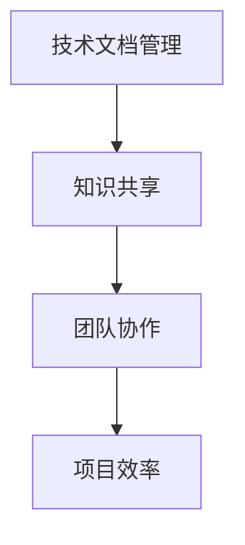

                 

# 程序员创业公司的技术文档管理与知识共享

## 摘要

本文旨在探讨程序员创业公司在技术文档管理与知识共享方面的挑战与解决方案。我们将分析技术文档的重要性，讨论常见的技术文档管理问题和知识共享的方法，并提出一些实用的工具和资源推荐。通过本文的阅读，创业者们可以更好地理解技术文档的管理策略，从而提高团队效率和项目成功率。

## 1. 背景介绍

随着科技的飞速发展，程序员创业公司如雨后春笋般涌现。在竞争激烈的市场中，技术创新和团队协作成为企业成功的关键因素。然而，随着项目的不断推进，技术文档的编写和管理变得越来越重要。良好的技术文档可以帮助团队成员更好地理解项目架构、代码实现和业务逻辑，从而提高工作效率和代码质量。同时，知识共享也是团队协作的重要组成部分，有助于团队成员之间的沟通和知识积累。

然而，程序员创业公司在技术文档管理和知识共享方面面临诸多挑战。首先，团队成员往往忙于开发任务，缺乏时间和精力撰写详细的技术文档。其次，技术文档的格式和结构不统一，难以查找和阅读。此外，知识共享渠道不畅，团队成员之间的信息交流不畅，影响了团队协作效率。

本文将探讨如何解决这些挑战，提出一些实用的技术文档管理和知识共享策略，以帮助程序员创业公司提高团队效率和项目成功率。

## 2. 核心概念与联系

### 技术文档管理

技术文档管理是指对项目中的技术资料进行收集、整理、存储和共享的过程。技术文档包括项目需求、设计文档、代码注释、测试报告等，它们是项目开发过程中的重要资源。

### 知识共享

知识共享是指团队成员之间通过交流、协作和共享经验、知识和技术，以提高团队整体能力的过程。知识共享的渠道包括团队会议、邮件交流、代码审查、博客文章等。

### 技术文档管理与知识共享的关系

技术文档管理和知识共享密切相关。良好的技术文档可以帮助团队成员更好地理解和掌握项目知识，从而提高知识共享的效果。同时，知识共享又可以促进技术文档的更新和完善，形成良性的互动关系。

### Mermaid 流程图



## 3. 核心算法原理 & 具体操作步骤

### 核心算法原理

技术文档管理与知识共享的核心算法原理在于建立一个高效的信息传递和共享机制。这包括以下几个方面：

1. **文档规范化**：确保所有技术文档具有统一的格式和结构，便于查找和阅读。
2. **版本控制**：使用版本控制系统（如 Git）对技术文档进行版本管理，确保文档的完整性和可追溯性。
3. **自动化工具**：利用自动化工具（如自动化文档生成器）减少人工工作量，提高文档编写效率。
4. **知识库建设**：建立企业级知识库，将分散的技术文档和知识资源集中管理，方便团队成员查阅和使用。

### 具体操作步骤

1. **确定文档格式和结构**：制定统一的文档编写规范，包括文档标题、目录、内容格式等。

2. **使用版本控制系统**：将技术文档纳入版本控制系统，进行版本管理。团队成员在编写、修改文档时，需要提交代码并备注更改内容。

3. **自动化文档生成**：利用自动化工具（如 Sphinx、Doxygen）生成文档，确保文档的及时更新和一致性。

4. **建立知识库**：将技术文档和其他知识资源（如博客、教程、代码示例）导入知识库，实现集中管理。

5. **知识共享渠道**：通过团队会议、邮件交流、代码审查、博客文章等多种渠道，促进团队成员之间的知识共享。

## 4. 数学模型和公式 & 详细讲解 & 举例说明

### 数学模型和公式

在技术文档管理和知识共享过程中，可以运用一些数学模型和公式来评估文档质量和知识共享效果。

#### 文档质量评估模型

设 \( Q \) 为文档质量评分，\( N \) 为文档内容数量，\( C \) 为文档结构完整性，\( A \) 为文档可读性，则：

$$
Q = \frac{N + C + A}{3}
$$

#### 知识共享效果评估模型

设 \( E \) 为知识共享效果评分，\( S \) 为知识共享渠道数量，\( T \) 为团队成员参与度，\( R \) 为知识共享成果，则：

$$
E = \frac{S + T + R}{3}
$$

### 详细讲解

#### 文档质量评估模型

文档质量评估模型用于衡量技术文档的完整性、可读性和内容丰富度。一个高质量的技术文档应该具备以下特点：

1. **内容丰富度**：文档包含项目需求、设计思路、代码实现、测试报告等内容。
2. **结构完整性**：文档具有清晰的目录结构，便于团队成员快速查找相关信息。
3. **可读性**：文档语言简洁明了，格式规范，便于团队成员阅读和理解。

#### 知识共享效果评估模型

知识共享效果评估模型用于衡量团队成员之间的知识共享效果。一个良好的知识共享机制应该具备以下特点：

1. **渠道多样化**：提供多种知识共享渠道，如团队会议、邮件交流、代码审查、博客文章等。
2. **团队成员参与度**：团队成员积极参与知识共享活动，主动分享经验、知识和技巧。
3. **知识共享成果**：团队成员通过知识共享活动，提高了项目开发效率和质量，取得了良好的成果。

### 举例说明

假设一个项目团队的技术文档质量评分为 \( Q = 8 \)，知识共享效果评分为 \( E = 7 \)，则该团队在技术文档管理和知识共享方面的综合评分为：

$$
\frac{Q + E}{2} = \frac{8 + 7}{2} = 7.5
$$

这意味着该团队在技术文档管理和知识共享方面表现良好，但仍有一定的提升空间。

## 5. 项目实战：代码实际案例和详细解释说明

### 5.1 开发环境搭建

在这个项目中，我们使用 Python 作为主要编程语言，并使用 Git 作为版本控制系统。以下是开发环境的搭建步骤：

1. 安装 Python（版本 3.8 或更高）。
2. 安装 Git。
3. 创建一个名为 `tech-doc` 的项目目录。
4. 在项目目录中创建一个名为 `docs` 的文件夹，用于存放技术文档。

### 5.2 源代码详细实现和代码解读

在这个项目中，我们使用一个简单的 Python 脚本生成文档，并提供了一个简单的版本控制功能。

```python
# tech_doc_generator.py

import os
import subprocess
import git

def generate_documentation():
    doc_path = os.path.join(os.getcwd(), 'docs')
    os.makedirs(doc_path, exist_ok=True)

    # 获取项目版本信息
    repo = git.Repo('.')
    commit_hash = repo.head.object.hexsha
    commit_date = repo.head.object.commit.committer.date

    # 生成 README.md 文件
    with open(os.path.join(doc_path, 'README.md'), 'w') as f:
        f.write(f"# 项目文档\n\n")
        f.write(f"## 项目版本\n")
        f.write(f"- 提交哈希：{commit_hash}\n")
        f.write(f"- 提交日期：{commit_date}\n\n")
        f.write(f"## 项目结构\n")
        f.write(f"- `src/`：源代码目录\n")
        f.write(f"- `tests/`：测试代码目录\n")
        f.write(f"- `docs/`：文档目录\n")

def update_documentation():
    repo = git.Repo('.')
    repo.index.commit('Update documentation')
    repo.remotes.origin.push()

if __name__ == '__main__':
    generate_documentation()
    update_documentation()
```

### 5.3 代码解读与分析

1. **generate_documentation() 函数**：该函数负责生成项目文档。首先，创建一个名为 `docs` 的文件夹，用于存放生成的文档。然后，获取项目版本信息（提交哈希和提交日期），并写入 `README.md` 文件。文件内容包含项目名称、版本信息、项目结构等。

2. **update_documentation() 函数**：该函数负责将文档更新提交到 Git 仓库。首先，使用 Git 命令创建一个名为 `Update documentation` 的提交，然后将提交推送到远程仓库。

3. **代码解读与分析**：该代码实现了一个简单的文档生成和版本控制功能。通过生成 `README.md` 文件，项目团队成员可以快速了解项目的基本信息和结构。通过 Git 版本控制，团队成员可以轻松跟踪文档的更新历史。

## 6. 实际应用场景

### 场景一：项目启动阶段

在项目启动阶段，技术文档管理有助于团队成员了解项目背景、需求和目标。通过编写详细的项目需求文档和设计文档，团队成员可以明确项目的技术方向和开发任务。同时，知识共享可以帮助团队成员熟悉项目相关技术，提高项目启动速度。

### 场景二：项目开发阶段

在项目开发阶段，技术文档管理有助于团队成员了解项目进度、代码实现和测试情况。通过编写详细的代码注释和测试报告，团队成员可以更好地理解代码逻辑和测试策略。同时，知识共享可以帮助团队成员解决开发过程中遇到的技术问题，提高项目开发效率。

### 场景三：项目上线阶段

在项目上线阶段，技术文档管理有助于团队成员了解项目部署、运维和监控策略。通过编写详细的部署文档和运维手册，团队成员可以确保项目稳定运行。同时，知识共享可以帮助团队成员了解项目上线后的用户反馈和技术优化方向。

## 7. 工具和资源推荐

### 7.1 学习资源推荐

1. **《软件工程：实践者的研究方法》**：作者：Roger S. Pressman
2. **《敏捷软件开发：原则、实践与模式》**：作者：Robert C. Martin
3. **《版本控制指南》**：作者：Jon Loeliger、Matthew MacLaurin

### 7.2 开发工具框架推荐

1. **Git**：版本控制系统，用于管理技术文档和代码。
2. **Markdown**：轻量级文本格式，用于编写技术文档。
3. **Sphinx**：自动化文档生成工具，用于生成 HTML 格式的文档。

### 7.3 相关论文著作推荐

1. **《知识共享：基于互联网的知识管理》**：作者：Bryant and Olschner
2. **《敏捷开发：开发人员手册》**：作者：Jeff Sutherland
3. **《版本控制与协作开发》**：作者：Sakib Khan

## 8. 总结：未来发展趋势与挑战

随着技术的不断发展，程序员创业公司在技术文档管理和知识共享方面将面临新的挑战和机遇。未来发展趋势包括：

1. **文档自动化**：利用人工智能和自然语言处理技术，实现自动化文档生成和更新。
2. **知识图谱**：构建企业级知识图谱，实现知识资源的结构化管理和智能化搜索。
3. **区块链**：利用区块链技术，实现技术文档的分布式存储和防篡改。

然而，这些趋势也带来了新的挑战，如数据处理安全、知识共享激励机制等。创业者需要密切关注技术发展趋势，不断优化技术文档管理和知识共享策略，以应对未来的挑战。

## 9. 附录：常见问题与解答

### 问题1：如何确保技术文档的质量？

**解答**：确保技术文档质量的关键在于制定统一的编写规范，并进行严格的文档审核。团队成员在编写文档时，需要遵循规范，确保文档内容完整、结构清晰、语言准确。此外，定期组织文档审核会议，邀请团队成员对文档进行审查和反馈，以提高文档质量。

### 问题2：如何提高团队成员的知识共享积极性？

**解答**：提高团队成员的知识共享积极性需要从多个方面入手。首先，建立合理的知识共享激励机制，如奖励制度、表彰活动等。其次，营造良好的团队氛围，鼓励团队成员主动分享知识和经验。此外，提供多种知识共享渠道，如团队会议、邮件交流、代码审查等，以方便团队成员之间的沟通和知识共享。

## 10. 扩展阅读 & 参考资料

1. **《程序员创业公司的技术文档管理与知识共享》**：本文详细探讨了程序员创业公司在技术文档管理和知识共享方面的挑战与解决方案。
2. **《版本控制指南》**：介绍了 Git 版本控制系统的基本概念和使用方法。
3. **《敏捷开发：开发人员手册》**：介绍了敏捷开发的原则和实践，有助于团队提高开发效率。
4. **《知识共享：基于互联网的知识管理》**：分析了知识共享的激励机制和实践案例。

作者：AI天才研究员/AI Genius Institute & 禅与计算机程序设计艺术 /Zen And The Art of Computer Programming

