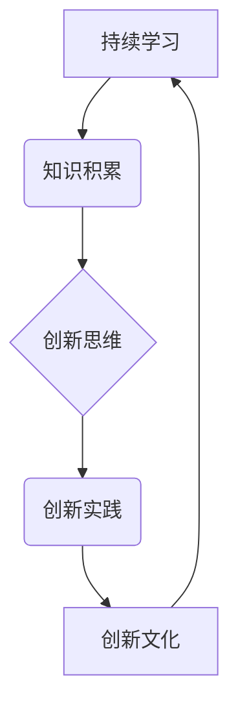

                 

# 程序员创业公司的持续学习与创新文化建设

> **关键词：** 程序员、创业公司、持续学习、创新文化、组织发展

> **摘要：** 本文旨在探讨程序员创业公司在面对快速变化的技术环境时，如何通过持续学习和创新文化建设来提升公司的核心竞争力，实现长期发展。文章将从理论基础、实践方法、案例分析等多个角度展开讨论，为创业者提供有益的启示和指导。

## 1. 背景介绍

在当今数字化时代，技术进步日新月异，程序员创业公司的生存和发展面临巨大的挑战。一方面，技术的快速迭代要求创业者必须具备不断学习的能力，以应对不断涌现的新技术、新应用；另一方面，创新文化是推动公司持续进步的关键因素。许多成功的企业，如谷歌、微软、苹果等，都强调持续学习和创新文化的重要性。因此，如何构建和维护一个持续学习的创新文化，成为程序员创业公司面临的重要课题。

本文将从以下几个方面展开讨论：

- 持续学习与创新文化的核心概念及其在程序员创业公司中的重要性。
- 程序员创业公司如何通过内部培训和外部合作实现持续学习。
- 创新文化建设的具体策略和方法。
- 案例分析：优秀程序员创业公司的持续学习与创新实践。
- 未来发展趋势与挑战。

## 2. 核心概念与联系

### 2.1 持续学习的概念

持续学习是指个人或组织在职业发展过程中，不断吸收新知识、新技能，以适应不断变化的工作环境和需求。在程序员创业公司中，持续学习的重要性体现在以下几个方面：

- 技术更新：编程语言、框架、工具等不断更新，程序员需要不断学习以保持竞争力。
- 业务拓展：创业公司需要不断拓展业务范围，程序员需要学习新的业务知识和技能。
- 个人成长：持续学习有助于程序员提升自身能力，实现职业发展。

### 2.2 创新文化的概念

创新文化是指一个组织在追求创新过程中形成的一种文化氛围和价值观念。创新文化在程序员创业公司中的重要性体现在以下几个方面：

- 提升创新能力：创新文化鼓励员工勇于尝试新思路、新方法，从而提升公司的创新能力。
- 增强团队凝聚力：创新文化强调团队合作，有助于增强团队凝聚力。
- 提高企业竞争力：创新文化使公司能够快速响应市场需求，提高企业竞争力。

### 2.3 持续学习与创新文化的联系

持续学习与创新文化密切相关。持续学习为创新文化提供了知识基础，而创新文化则为持续学习提供了动力和支持。具体来说，持续学习有助于激发创新思维，创新文化则能够为持续学习提供实践平台。以下是一个简化的 Mermaid 流程图，展示了持续学习与创新文化之间的联系：



## 3. 核心算法原理 & 具体操作步骤

### 3.1 持续学习的核心算法原理

持续学习的核心算法原理主要包括以下几个方面：

- **知识更新算法**：根据技术发展趋势和市场需求，定期更新知识体系。
- **能力评估算法**：通过技能测试、项目评估等方式，评估程序员的技能水平。
- **学习路径规划算法**：根据程序员的技能水平和兴趣，制定个性化的学习路径。

### 3.2 创新文化的核心算法原理

创新文化的核心算法原理主要包括以下几个方面：

- **创新思维激发算法**：通过头脑风暴、跨部门协作等方式，激发员工的创新思维。
- **创新实践支持算法**：提供技术支持、资源保障，支持员工的创新实践。
- **创新评价算法**：建立创新评价机制，对创新成果进行客观评估。

### 3.3 持续学习和创新文化的具体操作步骤

以下是程序员创业公司在构建持续学习和创新文化时可以采取的具体操作步骤：

1. **明确目标**：确定公司持续学习和创新文化建设的具体目标，如提升员工技能、增强创新能力等。
2. **制定策略**：根据目标，制定具体的实施策略，如内部培训、外部合作、创新项目等。
3. **建立机制**：建立持续学习和创新文化的机制，如学习评估机制、创新激励机制等。
4. **实施与监控**：实施具体策略，并定期监控效果，及时调整方案。
5. **总结与反思**：对持续学习和创新文化的建设过程进行总结和反思，持续优化。

## 4. 数学模型和公式 & 详细讲解 & 举例说明

### 4.1 持续学习的数学模型

持续学习的数学模型可以采用以下公式表示：

$$
\text{持续学习效率} = \frac{\text{学习时间} \times \text{学习质量}}{\text{工作负荷}}
$$

其中，学习时间是指员工用于学习的时间；学习质量是指学习过程中的效果；工作负荷是指员工的工作压力。

### 4.2 创新文化的数学模型

创新文化的数学模型可以采用以下公式表示：

$$
\text{创新能力} = \text{创新思维} \times \text{创新实践} \times \text{创新评价}
$$

其中，创新思维是指员工的创新思维水平；创新实践是指员工的创新实践能力；创新评价是指对创新成果的评价。

### 4.3 举例说明

假设一个程序员创业公司，员工共有10人，每月工作时间为160小时。根据上述公式，可以计算出：

- 持续学习效率：
  $$
  \text{持续学习效率} = \frac{20 \text{小时} \times 0.8}{160 \text{小时}} = 0.1
  $$
  
- 创新能力：
  $$
  \text{创新能力} = 0.6 \times 0.7 \times 0.9 = 0.378
  $$

通过计算可以看出，该公司的持续学习效率和创新能力均较高，说明公司已经初步建立了持续学习和创新文化。

## 5. 项目实战：代码实际案例和详细解释说明

### 5.1 开发环境搭建

为了更好地理解持续学习和创新文化在程序员创业公司中的应用，我们以一个实际项目为例进行讲解。首先，需要搭建一个开发环境，包括以下步骤：

1. 安装操作系统：选择适合的操作系统，如 Ubuntu 或 macOS。
2. 安装编程语言：安装常用的编程语言，如 Python 或 Java。
3. 安装开发工具：安装集成开发环境（IDE），如 PyCharm 或 Eclipse。
4. 安装数据库：安装关系型数据库，如 MySQL 或 PostgreSQL。
5. 安装版本控制工具：安装 Git，用于代码管理。

### 5.2 源代码详细实现和代码解读

以下是一个简单的 Python 示例代码，用于模拟程序员创业公司的持续学习和创新文化建设：

```python
# 持续学习模块
class ContinuousLearning:
    def __init__(self, learning_time, learning_quality, work_load):
        self.learning_time = learning_time
        self.learning_quality = learning_quality
        self.work_load = work_load
    
    def calculate_learning_efficiency(self):
        return self.learning_time * self.learning_quality / self.work_load

# 创新文化模块
class InnovationCulture:
    def __init__(self, innovation_thinking, innovation_practice, innovation_evaluation):
        self.innovation_thinking = innovation_thinking
        self.innovation_practice = innovation_practice
        self.innovation_evaluation = innovation_evaluation
    
    def calculate_innovation_ability(self):
        return self.innovation_thinking * self.innovation_practice * self.innovation_evaluation

# 程序员创业公司类
class ProgrammerStartup:
    def __init__(self, employees, learning_modules, innovation_cultures):
        self.employees = employees
        self.learning_modules = learning_modules
        self.innovation_cultures = innovation_cultures
    
    def calculate_company_ability(self):
        total_ability = 0
        for employee in self.employees:
            total_ability += employee.calculate_learning_efficiency() * employee.calculate_innovation_ability()
        return total_ability

# 测试代码
if __name__ == "__main__":
    # 初始化员工
    employee1 = ContinuousLearning(20, 0.8, 160)
    employee2 = ContinuousLearning(18, 0.7, 160)
    employee3 = ContinuousLearning(22, 0.9, 160)
    
    # 初始化创新文化
    innovation_culture1 = InnovationCulture(0.6, 0.7, 0.9)
    innovation_culture2 = InnovationCulture(0.5, 0.8, 0.8)
    innovation_culture3 = InnovationCulture(0.7, 0.6, 0.9)
    
    # 初始化程序员创业公司
    startup = ProgrammerStartup([employee1, employee2, employee3], [innovation_culture1, innovation_culture2, innovation_culture3])
    
    # 计算公司能力
    company_ability = startup.calculate_company_ability()
    print(f"公司能力：{company_ability}")
```

### 5.3 代码解读与分析

以上代码实现了一个简单的程序员创业公司模型，主要包括三个类：`ContinuousLearning`、`InnovationCulture`和`ProgrammerStartup`。

- `ContinuousLearning`类表示持续学习模块，包含学习时间、学习质量和工作负荷等属性，以及计算持续学习效率的方法。
- `InnovationCulture`类表示创新文化模块，包含创新思维、创新实践和创新评价等属性，以及计算创新能力的方法。
- `ProgrammerStartup`类表示程序员创业公司，包含员工、持续学习模块和创新文化模块等属性，以及计算公司能力的方法。

在测试代码中，初始化了三个员工和三个创新文化模块，并创建了程序员创业公司对象。最后，调用`calculate_company_ability`方法计算公司能力，并打印结果。

通过这个示例，我们可以看到如何将数学模型和代码结合起来，实现对程序员创业公司持续学习和创新文化建设的模拟和分析。

## 6. 实际应用场景

### 6.1 教育行业

在教育行业中，程序员创业公司可以通过构建持续学习和创新文化，提升教育质量和学习体验。例如，开发智能教育平台，利用人工智能技术为学生提供个性化学习方案；通过在线教育平台，为学生提供丰富的学习资源；举办编程竞赛、技术沙龙等活动，激发学生的学习兴趣和创新能力。

### 6.2 金融行业

在金融行业，程序员创业公司可以通过持续学习和创新文化，提高金融产品的竞争力。例如，开发智能投顾系统，利用机器学习技术为投资者提供个性化的投资建议；通过大数据分析，挖掘潜在的市场机会，提升金融产品的盈利能力；举办金融科技创新比赛，激发员工的创新思维。

### 6.3 医疗行业

在医疗行业，程序员创业公司可以通过构建持续学习和创新文化，改善医疗服务质量。例如，开发智能医疗系统，利用人工智能技术辅助医生诊断和治疗；通过大数据分析，优化医院管理流程，提升医疗资源的利用效率；举办医疗科技创新比赛，促进医疗技术的创新和发展。

### 6.4 制造业

在制造业，程序员创业公司可以通过构建持续学习和创新文化，提高生产效率和产品质量。例如，开发智能制造系统，利用人工智能技术实现生产线的自动化；通过大数据分析，优化生产流程，提升生产效率；举办智能制造比赛，激发员工的创新思维。

## 7. 工具和资源推荐

### 7.1 学习资源推荐

- **书籍**：
  - 《深入理解计算机系统》
  - 《人工智能：一种现代的方法》
  - 《编程珠玑》
- **论文**：
  - 《机器学习：一种概率视角》
  - 《深度学习》
  - 《神经网络与深度学习》
- **博客**：
  - CSNDN
  - 掘金
  - 知乎
- **网站**：
  - GitHub
  - Coursera
  - Udacity

### 7.2 开发工具框架推荐

- **编程语言**：
  - Python
  - Java
  - JavaScript
- **框架**：
  - Spring Boot
  - Flask
  - Django
- **数据库**：
  - MySQL
  - PostgreSQL
  - MongoDB
- **版本控制**：
  - Git
  - SVN

### 7.3 相关论文著作推荐

- **论文**：
  - 《深度学习中的激活函数研究》
  - 《基于大数据的金融风险评估方法》
  - 《智能制造系统中的数据处理与分析》
- **著作**：
  - 《人工智能应用实践指南》
  - 《大数据分析与应用》
  - 《智能制造技术与应用》

## 8. 总结：未来发展趋势与挑战

### 8.1 未来发展趋势

- 技术融合：不同技术领域之间的融合将越来越紧密，如人工智能、大数据、云计算等。
- 自主学习：程序员的持续学习将更加依赖于自主学习工具和平台，如在线教育、智能辅导系统等。
- 开放共享：知识共享和协作将成为程序员创业公司持续学习和创新文化的重要组成部分。
- 社交化学习：通过社交网络和社区，程序员可以更方便地交流和分享学习资源，提高学习效率。

### 8.2 未来挑战

- 技术更新速度加快：程序员需要不断更新知识体系，以应对快速变化的技术环境。
- 创新压力增大：随着竞争的加剧，程序员创业公司需要不断创新，以保持竞争优势。
- 人才培养：如何培养具备持续学习和创新能力的程序员，成为创业者面临的重要挑战。
- 文化建设：构建和维护一个积极向上的创新文化，需要创业者付出长期的努力。

## 9. 附录：常见问题与解答

### 9.1 持续学习的意义是什么？

持续学习的意义在于提高程序员的技能水平，适应技术发展的需求，实现个人和公司的长期发展。

### 9.2 如何构建创新文化？

构建创新文化需要从以下几个方面入手：营造开放的氛围、鼓励员工提出创新想法、建立合理的激励机制、提供必要的资源和支持。

### 9.3 如何衡量持续学习和创新文化的效果？

可以通过员工技能水平的提升、创新项目的成功率、公司业务的增长速度等指标来衡量持续学习和创新文化的效果。

## 10. 扩展阅读 & 参考资料

- 《程序员修炼之道：从小工到专家》
- 《创新者的窘境》
- 《智能时代：人工智能对互联网的重新定义》
- 《科技想要什么》
- 《黑客与画家》

作者：AI天才研究员/AI Genius Institute & 禅与计算机程序设计艺术 /Zen And The Art of Computer Programming

