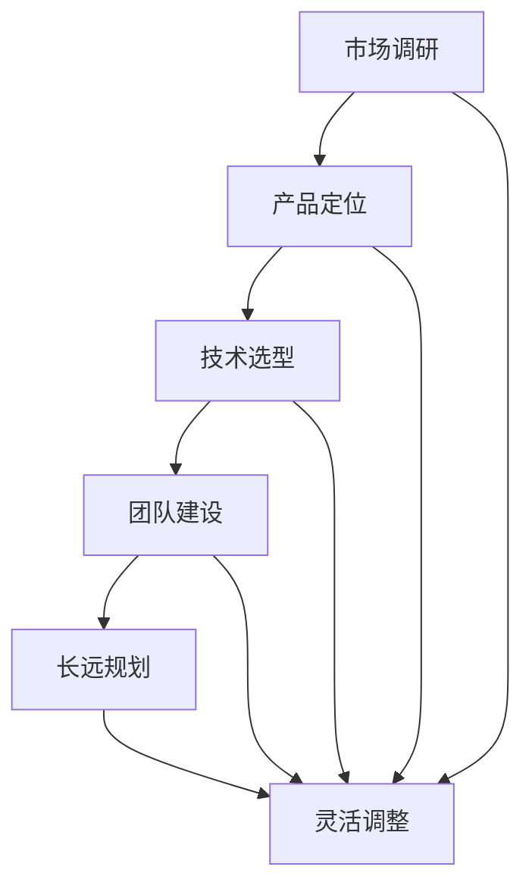

                 

# 程序员创业者的产品路线图：长远规划与灵活调整

> 关键词：程序员、创业者、产品路线图、长远规划、灵活调整、IT领域

> 摘要：本文旨在为程序员创业者提供一套系统的产品路线图，帮助他们在初创阶段制定长远规划，并在发展过程中灵活调整策略。文章从市场调研、产品定位、技术选型、团队建设等方面进行详细分析，旨在为创业者提供有价值的参考和指导。

## 1. 背景介绍

在当今快速发展的信息技术时代，程序员创业者正变得越来越普遍。随着互联网、人工智能、大数据等技术的兴起，创业者们看到了前所未有的机会。然而，成功的创业并非易事，特别是在产品开发过程中，如何制定一份科学合理的路线图，以实现长远规划和灵活调整，是每个创业者必须面对的挑战。

本文将探讨程序员创业者在产品开发过程中需要关注的核心要素，包括市场调研、产品定位、技术选型、团队建设等。通过分析这些要素，我们将为创业者提供一套系统的产品路线图，帮助他们更好地规划产品发展，实现创业目标。

## 2. 核心概念与联系

在制定产品路线图之前，我们需要明确几个核心概念，这些概念是构建成功产品的基石。

### 2.1 市场调研

市场调研是产品开发的第一步，它帮助创业者了解目标市场、用户需求和竞争态势。通过市场调研，创业者可以确定产品的市场需求、定位和潜在用户。

### 2.2 产品定位

产品定位是明确产品在市场中的位置和价值。一个清晰的产品定位有助于创业者制定战略，吸引目标用户，并确保产品的独特性和竞争力。

### 2.3 技术选型

技术选型是产品开发过程中至关重要的一环，它决定了产品的性能、可扩展性和维护成本。创业者需要根据产品需求和市场趋势选择合适的技术栈。

### 2.4 团队建设

团队建设是产品成功的关键，一个高效的团队可以快速响应市场变化，提高开发效率。创业者需要招聘合适的人才，建立良好的团队文化和协作机制。

### 2.5 长远规划与灵活调整

长远规划是创业者制定的发展蓝图，它帮助创业者设定短期和长期目标，明确资源分配和时间节点。灵活调整则是根据市场反馈和实际进展，对产品路线图进行必要的调整，以确保产品能够持续适应市场变化。

### 2.6 Mermaid 流程图

以下是一个简单的 Mermaid 流程图，展示上述核心概念之间的联系：



## 3. 核心算法原理 & 具体操作步骤

### 3.1 市场调研

市场调研的核心算法是数据分析和用户访谈。数据分析可以帮助创业者了解市场趋势、用户行为和竞争对手情况。用户访谈则是获取用户真实需求和反馈的有效途径。

具体操作步骤如下：

1. 收集数据：从公开来源、社交媒体、行业报告等渠道获取数据。
2. 数据分析：使用统计方法和数据可视化工具分析数据，提取有价值的信息。
3. 用户访谈：设计访谈问题，与目标用户进行深入交流，了解他们的需求和痛点。
4. 数据整合：将数据分析和用户访谈结果进行整合，形成市场调研报告。

### 3.2 产品定位

产品定位的核心算法是SWOT分析（优势、劣势、机会、威胁）。SWOT分析帮助创业者明确产品的市场地位和竞争优势。

具体操作步骤如下：

1. 确定产品特点：分析产品的功能、性能、用户体验等。
2. 评估优势和劣势：分析产品在市场中的优势和劣势。
3. 识别机会和威胁：分析市场趋势、竞争对手和用户需求，确定机会和威胁。
4. 形成产品定位：根据SWOT分析结果，明确产品的市场定位。

### 3.3 技术选型

技术选型的核心算法是成本效益分析和性能评估。成本效益分析帮助创业者评估不同技术方案的成本和收益，性能评估则是评估技术方案的性能和可扩展性。

具体操作步骤如下：

1. 确定技术需求：分析产品需求，确定所需的技术功能和技术标准。
2. 成本效益分析：评估不同技术方案的成本、维护成本和开发成本。
3. 性能评估：测试不同技术方案的性能，选择最优方案。
4. 确定技术栈：根据成本效益分析和性能评估结果，确定产品所需的技术栈。

### 3.4 团队建设

团队建设的核心算法是能力匹配和团队文化塑造。能力匹配帮助创业者招聘合适的人才，团队文化塑造则是建立良好的团队氛围和协作机制。

具体操作步骤如下：

1. 确定团队需求：分析产品开发需求，确定所需的人才类型和能力。
2. 招聘人才：根据团队需求，通过招聘网站、猎头等渠道招聘合适的人才。
3. 培养团队文化：建立共同的目标、价值观和协作机制，形成良好的团队文化。
4. 激励和留才：制定合理的薪酬和激励机制，提高团队凝聚力和忠诚度。

## 4. 数学模型和公式 & 详细讲解 & 举例说明

### 4.1 市场调研

在市场调研中，常用的数学模型是回归分析和聚类分析。回归分析可以帮助创业者预测市场趋势和用户需求，聚类分析则可以帮助创业者识别用户群体。

#### 4.1.1 回归分析

回归分析的基本公式为：

$$ Y = \beta_0 + \beta_1X + \epsilon $$

其中，$Y$ 是因变量（如市场需求），$X$ 是自变量（如时间、广告投入等），$\beta_0$ 和 $\beta_1$ 是回归系数，$\epsilon$ 是误差项。

举例说明：

假设创业者想要预测某产品在未来一年的市场需求，收集了以下数据：

| 时间 | 广告投入（万元） | 市场需求（件） |
| --- | --- | --- |
| 1 | 10 | 100 |
| 2 | 15 | 120 |
| 3 | 20 | 150 |
| 4 | 25 | 180 |

使用回归分析，可以建立市场需求和广告投入之间的线性关系，从而预测未来市场需求。

#### 4.1.2 聚类分析

聚类分析的基本公式是：

$$ C = \sum_{i=1}^{n} w_i (x_i - \bar{x})^2 $$

其中，$C$ 是聚类中心，$w_i$ 是权重，$x_i$ 是数据点，$\bar{x}$ 是聚类中心的平均值。

举例说明：

假设创业者想要将用户分为不同的群体，收集了以下用户数据：

| 用户ID | 年龄 | 收入 | 消费习惯 |
| --- | --- | --- | --- |
| 1 | 25 | 5000 | 健身 |
| 2 | 30 | 8000 | 旅游 |
| 3 | 40 | 10000 | 阅读 |
| 4 | 20 | 3000 | 美食 |

使用聚类分析，可以将这些用户分为不同的群体，以便进行针对性的市场推广。

### 4.2 产品定位

在产品定位中，常用的数学模型是SWOT分析。SWOT分析的基本公式为：

$$ SWOT = S + W + O + T $$

其中，$S$ 是优势，$W$ 是劣势，$O$ 是机会，$T$ 是威胁。

举例说明：

假设创业者想要对某产品进行SWOT分析，收集了以下信息：

| 因素 | 说明 |
| --- | --- |
| 优势 | 技术领先 |
| 劣势 | 市场份额低 |
| 机会 | 新市场开拓 |
| 威胁 | 竞争对手强大 |

通过SWOT分析，创业者可以明确产品的市场地位和竞争优势，从而制定相应的产品定位策略。

### 4.3 技术选型

在技术选型中，常用的数学模型是成本效益分析。成本效益分析的基本公式为：

$$ 成本效益 = \frac{收益}{成本} $$

举例说明：

假设创业者需要选择两种不同的技术方案，分别计算其成本和收益：

| 技术方案 | 成本（万元） | 收益（万元） |
| --- | --- | --- |
| A | 100 | 150 |
| B | 200 | 250 |

计算成本效益：

$$ 成本效益_A = \frac{150}{100} = 1.5 $$
$$ 成本效益_B = \frac{250}{200} = 1.25 $$

根据成本效益分析，技术方案A具有更高的成本效益，是更优的选择。

### 4.4 团队建设

在团队建设中，常用的数学模型是能力匹配分析。能力匹配分析的基本公式为：

$$ 能力匹配度 = \frac{实际能力}{预期能力} $$

举例说明：

假设创业者需要招聘一名软件开发工程师，预期其具有以下能力：

| 能力 | 预期能力 |
| --- | --- |
| 编程能力 | 高级 |
| 项目管理能力 | 中级 |
| 团队协作能力 | 高级 |

在实际招聘过程中，发现应聘者具有以下能力：

| 能力 | 实际能力 |
| --- | --- |
| 编程能力 | 高级 |
| 项目管理能力 | 初级 |
| 团队协作能力 | 高级 |

计算能力匹配度：

$$ 能力匹配度 = \frac{高级 + 高级 + 高级}{高级 + 初级 + 高级} = 0.875 $$

根据能力匹配分析，应聘者的能力匹配度较高，适合担任软件开发工程师职位。

## 5. 项目实战：代码实际案例和详细解释说明

### 5.1 开发环境搭建

在本文的项目实战中，我们将使用Python作为主要编程语言，搭建一个简单的用户管理系统。以下是开发环境的搭建步骤：

1. 安装Python：访问Python官方网站（[python.org](https://www.python.org/)），下载并安装Python 3.x版本。
2. 配置Python环境：打开终端，执行以下命令：

   ```bash
   python --version
   python -m pip --version
   ```

   如果命令输出正确版本信息，表示Python环境已配置。

3. 安装必要的库：在终端中执行以下命令，安装用于用户管理的库（例如`Flask`）：

   ```bash
   pip install Flask
   ```

### 5.2 源代码详细实现和代码解读

以下是一个简单的用户管理系统的Python代码实现：

```python
from flask import Flask, request, jsonify

app = Flask(__name__)

users = [
    {"id": 1, "username": "alice", "email": "alice@example.com"},
    {"id": 2, "username": "bob", "email": "bob@example.com"},
]

@app.route('/users', methods=['GET', 'POST'])
def handle_users():
    if request.method == 'GET':
        return jsonify(users)
    elif request.method == 'POST':
        user_data = request.json
        users.append(user_data)
        return jsonify({"message": "User created successfully."})

if __name__ == '__main__':
    app.run(debug=True)
```

**代码解读：**

1. 导入必要的库：`Flask` 库用于构建Web应用。
2. 初始化 Flask 应用对象：`app = Flask(__name__)`。
3. 定义用户数据列表：`users = [...]`，存储用户信息。
4. 定义 `/users` 路由：使用 `@app.route('/users', methods=['GET', 'POST'])` 装饰器。
5. 实现 GET 和 POST 请求处理：
   - GET 请求：返回用户数据列表。
   - POST 请求：添加新用户到列表。
6. 运行应用：`app.run(debug=True)`。

### 5.3 代码解读与分析

**用户数据模型：**

用户数据以字典形式存储在列表中，每个字典代表一个用户，包含 `id`、`username` 和 `email` 字段。

**GET 请求处理：**

当接收到 GET 请求时，`handle_users` 函数返回用户数据列表。这是通过 `jsonify` 函数实现的，它将 Python 对象转换为 JSON 格式的响应。

**POST 请求处理：**

当接收到 POST 请求时，`handle_users` 函数从请求中提取 JSON 数据，并添加到用户数据列表中。然后，通过 `jsonify` 函数返回一个包含成功消息的 JSON 响应。

**性能分析：**

- **读取操作（GET）：** 读取操作直接从内存中的列表中获取数据，效率较高。
- **写入操作（POST）：** 写入操作涉及将新用户添加到内存中的列表，并返回响应。对于小型应用，这通常是足够的，但对于大型应用，可能需要考虑使用数据库进行持久化存储。

## 6. 实际应用场景

在现实世界中，程序员创业者面临多种实际应用场景，这些场景需要他们灵活应用产品路线图中的各个要素。

### 6.1 市场需求分析

创业者可能需要分析大量市场数据，以确定目标市场的需求。这可以通过使用数据分析工具（如Pandas、Excel）进行数据清洗、分析和可视化来实现。

### 6.2 产品迭代

在产品开发过程中，创业者需要不断迭代产品，以满足用户需求和市场变化。这要求他们具备快速开发和部署的能力，通常需要使用自动化测试和持续集成（CI/CD）工具。

### 6.3 技术挑战

在技术选型过程中，创业者可能会遇到各种技术挑战，如性能优化、可扩展性等。解决这些问题需要深入的技术知识和实践经验。

### 6.4 团队协作

团队协作是产品成功的关键。创业者需要建立良好的沟通和协作机制，确保团队成员能够高效合作，共同实现产品目标。

## 7. 工具和资源推荐

### 7.1 学习资源推荐

- **书籍：**
  - 《精益创业》（The Lean Startup）
  - 《敏捷软件开发》（Agile Software Development）

- **论文：**
  - "The Lean Startup" by Eric Ries
  - "Agile Manifesto" by the Agile Manifesto Group

- **博客：**
  - [精益创业博客](https://www.leanstartup.com/)
  - [敏捷软件开发博客](https://www.agilealliance.org/agile101/)

- **网站：**
  - [产品管理协会](https://www.productschool.com/)
  - [敏捷联盟](https://www.agilealliance.org/)

### 7.2 开发工具框架推荐

- **开发工具：**
  - Visual Studio Code
  - PyCharm

- **框架：**
  - Flask
  - Django

### 7.3 相关论文著作推荐

- "The Lean Startup" by Eric Ries
- "Agile Software Development: Principles, Patterns, and Practices" by Robert C. Martin
- "User Story Mapping: Discover the Whole Story, Build the Right Product" by Jeff Patton

## 8. 总结：未来发展趋势与挑战

在未来，程序员创业者将继续面临各种机遇和挑战。随着人工智能、大数据、物联网等技术的快速发展，市场需求将更加多样化和复杂化。创业者需要不断学习和适应新技术，以提高产品的竞争力。

同时，创业者还面临着资源有限、市场竞争激烈等挑战。因此，制定科学合理的长远规划，并在发展过程中灵活调整策略，是确保成功的关键。

## 9. 附录：常见问题与解答

### 9.1 如何进行市场调研？

市场调研可以通过以下步骤进行：

1. 确定调研目标：明确调研的目的和要解决的问题。
2. 收集数据：从公开来源、社交媒体、行业报告等渠道收集数据。
3. 数据分析：使用统计方法和数据可视化工具分析数据。
4. 用户访谈：与目标用户进行深入交流，了解他们的需求和痛点。
5. 数据整合：将数据分析和用户访谈结果进行整合。

### 9.2 如何进行产品定位？

产品定位可以通过以下步骤进行：

1. 确定产品特点：分析产品的功能、性能、用户体验等。
2. 评估优势和劣势：分析产品在市场中的优势和劣势。
3. 识别机会和威胁：分析市场趋势、竞争对手和用户需求。
4. 形成产品定位：根据SWOT分析结果，明确产品的市场定位。

### 9.3 如何进行技术选型？

技术选型可以通过以下步骤进行：

1. 确定技术需求：分析产品需求，确定所需的技术功能和技术标准。
2. 成本效益分析：评估不同技术方案的成本、维护成本和开发成本。
3. 性能评估：测试不同技术方案的性能。
4. 确定技术栈：根据成本效益分析和性能评估结果，确定产品所需的技术栈。

### 9.4 如何进行团队建设？

团队建设可以通过以下步骤进行：

1. 确定团队需求：分析产品开发需求，确定所需的人才类型和能力。
2. 招聘人才：通过招聘网站、猎头等渠道招聘合适的人才。
3. 培养团队文化：建立共同的目标、价值观和协作机制。
4. 激励和留才：制定合理的薪酬和激励机制。

## 10. 扩展阅读 & 参考资料

- 《精益创业》
- 《敏捷软件开发》
- 《用户故事地图》
- 《产品经理手册》
- 《程序员创业指南》

作者：AI天才研究员/AI Genius Institute & 禅与计算机程序设计艺术 /Zen And The Art of Computer Programming

