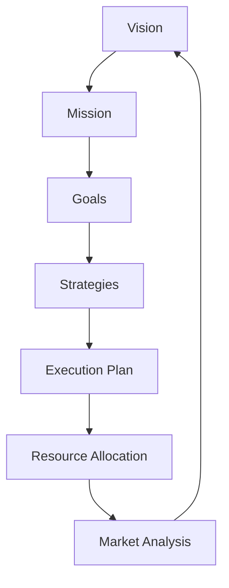

                 

### 文章标题

《程序员创业者的产品路线图：长远规划与灵活调整的平衡》

**关键词**：程序员创业者、产品路线图、长远规划、灵活调整、平衡

**摘要**：本文旨在为程序员创业者提供一份实用的产品路线图，帮助他们在创业初期明确发展方向，合理分配资源，并通过灵活调整应对市场变化。文章将从背景介绍、核心概念与联系、核心算法原理与具体操作步骤、数学模型和公式讲解、项目实战、实际应用场景、工具和资源推荐、总结以及常见问题解答等方面展开，为创业者提供全方位的指导和支持。

### 背景介绍

在当今快速变化的市场环境中，程序员创业者面临着诸多挑战。如何从零开始构建一个成功的创业项目，如何在激烈的市场竞争中脱颖而出，如何确保产品的质量和市场适应性，这些问题都困扰着许多创业者。

程序员创业者通常具备一定的技术背景，熟悉编程语言、软件开发流程和工具。然而，成功创业不仅仅需要技术实力，还需要对市场、用户需求、商业模式的深入理解。许多程序员在创业过程中往往过于专注于技术实现，而忽视了市场分析和资源管理，导致项目进展缓慢甚至失败。

本文旨在解决这一困境，通过提供一份系统性的产品路线图，帮助程序员创业者明确创业方向，合理规划资源，灵活应对市场变化，从而提高创业成功率。

#### 核心概念与联系

在撰写产品路线图之前，我们需要了解一些核心概念和它们之间的联系。以下是一些关键术语：

1. **愿景（Vision）**：创业公司的长远目标和发展方向。愿景应该简洁、明确，激发团队成员的激情和动力。
2. **使命（Mission）**：创业公司的核心价值观和存在理由。使命应该指导公司的日常运营和决策。
3. **目标（Goals）**：实现愿景的具体步骤和里程碑。目标应该是可衡量、可实现的。
4. **策略（Strategies）**：为了实现目标而采取的具体行动和措施。策略应该具有可操作性和灵活性。
5. **执行计划（Execution Plan）**：具体的行动计划和时间表，确保策略得以实施。
6. **资源分配（Resource Allocation）**：合理分配人力、资金、时间等资源，确保项目顺利进行。
7. **市场分析（Market Analysis）**：对目标市场、用户需求、竞争对手等进行全面分析，为产品路线图提供依据。

这些核心概念相互关联，共同构成了产品路线图的基础。下面将使用Mermaid流程图来展示它们之间的联系：

#### 核心算法原理 & 具体操作步骤

在了解核心概念后，我们需要掌握一些关键技能，以构建和调整产品路线图。以下是几个核心算法原理和具体操作步骤：

1. **SWOT分析（Strengths, Weaknesses, Opportunities, Threats）**：用于评估公司的优势、劣势、机会和威胁。通过SWOT分析，创业者可以更清晰地了解自己的优劣势，以及市场环境的变化。
   
   **操作步骤**：
   - 收集数据：分析公司内部和外部环境。
   - 分析数据：识别优势和劣势，以及机会和威胁。
   - 制定策略：根据分析结果，制定相应的策略。

2. **五力模型（Five Forces Model）**：用于分析市场竞争力。通过五力模型，创业者可以了解行业内的竞争格局和潜在风险。

   **操作步骤**：
   - 识别竞争对手：分析竞争对手的产品、市场地位、策略。
   - 分析供应商：评估供应商的议价能力。
   - 分析买家：评估买家的议价能力。
   - 分析潜在竞争者：评估潜在竞争者的威胁。
   - 分析替代品：评估替代品的威胁。
   - 制定策略：根据分析结果，制定相应的市场策略。

3. **增长模型（Growth Model）**：用于预测公司的增长趋势。通过增长模型，创业者可以制定合理的发展计划。

   **操作步骤**：
   - 确定增长指标：例如用户增长率、收入增长率等。
   - 收集历史数据：分析过去几年的增长情况。
   - 分析趋势：识别增长趋势和周期性变化。
   - 预测未来：根据历史数据和趋势，预测未来的增长情况。
   - 制定计划：根据预测结果，制定相应的发展计划。

#### 数学模型和公式 & 详细讲解 & 举例说明

为了更好地理解和应用核心算法原理，我们需要一些数学模型和公式。以下是几个常用的数学模型和详细讲解：

1. **线性回归模型（Linear Regression Model）**：用于预测数值型变量。

   **公式**：
   $$y = \beta_0 + \beta_1x + \epsilon$$
   
   **详细讲解**：
   - $y$：预测值
   - $\beta_0$：截距
   - $\beta_1$：斜率
   - $x$：自变量
   - $\epsilon$：误差项

   **举例说明**：假设我们要预测一家公司的收入，可以使用线性回归模型来建立预测模型。

2. **逻辑回归模型（Logistic Regression Model）**：用于预测分类变量。

   **公式**：
   $$\text{logit}(p) = \ln\left(\frac{p}{1-p}\right) = \beta_0 + \beta_1x$$
   
   **详细讲解**：
   - $p$：概率值
   - $\text{logit}(p)$：logistic函数的值
   - $\beta_0$：截距
   - $\beta_1$：斜率
   - $x$：自变量

   **举例说明**：假设我们要预测一家公司的收入是否会超过某一阈值，可以使用逻辑回归模型来建立预测模型。

3. **时间序列模型（Time Series Model）**：用于分析时间序列数据。

   **公式**：
   $$y_t = \beta_0 + \beta_1t + \epsilon_t$$
   
   **详细讲解**：
   - $y_t$：第$t$个时间点的值
   - $\beta_0$：初始值
   - $\beta_1$：趋势值
   - $t$：时间
   - $\epsilon_t$：误差项

   **举例说明**：假设我们要分析一家公司的收入随时间的变化情况，可以使用时间序列模型来建立分析模型。

这些数学模型和公式可以帮助我们更好地理解和应用核心算法原理，从而构建和调整产品路线图。在实际应用中，创业者可以根据具体情况选择合适的模型和公式，以提高预测和决策的准确性。

#### 项目实战：代码实际案例和详细解释说明

为了更好地理解产品路线图的构建过程，我们通过一个实际案例来演示。

**案例：一家初创公司的产品路线图**

1. **愿景**：成为全球领先的智能家居解决方案提供商。

2. **使命**：通过创新技术，为用户带来更便捷、智能的家居生活。

3. **目标**：
   - 在两年内获得1万家企业客户。
   - 在三年内实现盈利。
   - 在五年内占据智能家居市场的前五名。

4. **策略**：
   - 研发创新产品，提高用户体验。
   - 与合作伙伴建立战略合作关系，扩大市场占有率。
   - 通过线上线下多渠道营销，提高品牌知名度。

5. **执行计划**：
   - 第一季度：完成智能家居APP开发。
   - 第二季度：完成智能家居硬件产品研发。
   - 第三季度：与合作伙伴签订合作协议。
   - 第四季度：开展线上线下营销活动。

6. **资源分配**：
   - 人力：招聘30名技术人才，包括软件工程师、硬件工程师、市场营销人员等。
   - 资金：首轮融资500万元，用于研发、营销和市场推广。
   - 时间：按照季度计划，合理分配研发、生产和销售时间。

7. **市场分析**：
   - 竞争对手：分析市场上的主要竞争对手，了解他们的产品特点、优势和劣势。
   - 用户需求：通过市场调研，了解用户对智能家居的需求和期望。
   - 市场趋势：分析智能家居市场的未来发展趋势和机遇。

通过以上步骤，我们可以构建出这家初创公司的产品路线图。在实际操作中，创业者需要根据市场环境和内部资源的变化，不断调整和优化产品路线图，以确保项目顺利进行。

### 实际应用场景

产品路线图不仅适用于初创公司，还可以应用于各类企业的产品开发和市场战略。以下是一些实际应用场景：

1. **大型企业**：大型企业通常拥有丰富的资源和庞大的团队，产品路线图可以帮助它们明确发展目标，合理分配资源，确保产品线的稳定性和竞争力。

2. **中小企业**：中小企业资源有限，产品路线图可以帮助它们聚焦核心业务，避免资源浪费，提高市场响应速度。

3. **跨国公司**：跨国公司需要在不同的市场环境下运营，产品路线图可以帮助它们制定适应本地市场的产品策略，提高市场占有率和品牌影响力。

4. **非营利组织**：非营利组织通常依赖赞助和捐款，产品路线图可以帮助它们明确资金使用方向，提高资金使用效率，实现社会公益目标。

5. **学术研究**：学术研究人员可以通过产品路线图规划研究项目，确保研究目标的实现和学术成果的推广应用。

总之，产品路线图是一种通用的工具，可以帮助各类企业、组织和团队明确发展方向，合理规划资源，灵活应对市场变化。

### 工具和资源推荐

为了帮助程序员创业者更好地构建和调整产品路线图，以下是一些实用的工具和资源推荐：

#### 学习资源推荐

1. **书籍**：
   - 《创新与企业家精神》（Innovation and Entrepreneurship）- 彼得·德鲁克（Peter Drucker）
   - 《精益创业》（The Lean Startup）- 埃里克·莱斯（Eric Ries）
   - 《产品经理手册》（The Product Manager's Survival Guide）- 菲利普·蒙塔古（Philippe Montagu）

2. **论文**：
   - "A Framework for Product Roadmapping" - 产品路线图框架
   - "Strategic Product Roadmaps: How to Make Them and Use Them" - 产品路线图：如何制定和使用

3. **博客**：
   - Hacker Noon：分享创业者经验和产品策略的博客
   - Product School：提供产品管理课程和资源的博客

4. **网站**：
   - ProductPlan：产品路线图软件
   - Roadmunk：产品路线图模板和工具

#### 开发工具框架推荐

1. **敏捷开发工具**：
   - Jira：项目管理和敏捷开发工具
   - Trello：任务管理和协作工具

2. **数据分析工具**：
   - Tableau：数据可视化工具
   - Google Analytics：网站和应用程序分析工具

3. **市场需求分析工具**：
   - SurveyMonkey：在线调查和反馈工具
   - UserTesting：用户测试和反馈工具

#### 相关论文著作推荐

1. **论文**：
   - "The Product Roadmap: Aligning Strategy and Execution" - 产品路线图：战略与执行的协同
   - "Building Product Roadmaps that Matter" - 制定有意义的产品路线图

2. **著作**：
   - 《产品路线图实战：从愿景到成功》（Product Roadmaps Relaunched: How to Create a Vision and Roadmap to Grow Your Business）- 菲利普·蒙塔古（Philippe Montagu）

这些工具和资源将为程序员创业者提供丰富的知识储备和实践指导，帮助他们更好地构建和调整产品路线图，实现创业目标。

### 总结：未来发展趋势与挑战

在过去的几十年中，产品路线图作为一种管理工具，已经帮助无数企业实现了成功。然而，随着市场环境的不断变化和技术的快速发展，产品路线图也需要不断适应新的发展趋势和挑战。

**发展趋势**：

1. **数字化转型**：随着数字技术的广泛应用，越来越多的企业将数字化转型作为战略重点。产品路线图需要涵盖数字技术和数字化服务的规划，以适应这一趋势。

2. **用户体验优先**：用户体验（UX）和用户界面（UI）设计日益受到重视。未来的产品路线图将更加注重用户体验的设计和优化，以提高用户满意度和忠诚度。

3. **敏捷开发和持续迭代**：敏捷开发和持续迭代已经成为软件开发的主流。产品路线图需要更加灵活，以适应快速变化的市场需求和用户反馈。

4. **数据驱动决策**：数据分析和大数据技术为产品决策提供了更准确、更全面的依据。产品路线图需要更加依赖数据分析，以实现数据驱动决策。

**挑战**：

1. **市场不确定性**：市场环境的变化速度加快，产品路线图的制定和调整面临更大的不确定性。如何应对市场变化，保持战略方向的一致性，是创业者面临的一大挑战。

2. **资源有限**：对于初创公司来说，资源有限是一个普遍问题。如何在有限的资源下制定和执行有效的产品路线图，是创业者需要解决的难题。

3. **技术变革**：技术的快速变革对产品路线图提出了新的要求。如何把握技术趋势，及时调整产品路线图，以适应技术变革，是创业者面临的挑战。

4. **团队协作**：产品路线图的制定和执行需要跨部门、跨团队的协作。如何协调不同团队的工作，确保产品路线图的顺利实施，是创业者需要解决的问题。

总之，未来的产品路线图将更加注重用户体验、数据驱动和敏捷开发，同时也将面临更多的挑战。创业者需要不断学习和适应，以实现产品路线图的优化和成功。

### 附录：常见问题与解答

#### 问题1：如何确定产品路线图的目标和里程碑？
**解答**：确定产品路线图的目标和里程碑需要遵循以下步骤：
1. 分析市场环境和用户需求，明确产品的核心价值和目标。
2. 制定可衡量、可实现的里程碑，例如用户增长率、收入增长率等。
3. 根据公司资源和技术实力，合理规划里程碑的时间节点。

#### 问题2：如何制定有效的策略和执行计划？
**解答**：制定有效的策略和执行计划需要考虑以下几点：
1. 分析市场竞争状况，了解竞争对手的优势和劣势。
2. 确定公司的核心竞争力，制定与之匹配的市场策略。
3. 制定详细的执行计划，包括关键任务、时间表和责任人。

#### 问题3：如何应对市场变化，调整产品路线图？
**解答**：应对市场变化，调整产品路线图需要采取以下措施：
1. 定期进行市场分析和用户反馈，了解市场趋势和用户需求的变化。
2. 根据市场变化，及时调整产品路线图的目标和里程碑。
3. 增强团队的灵活性和适应性，确保产品路线图的顺利实施。

#### 问题4：如何确保产品路线图的资源分配合理？
**解答**：确保产品路线图的资源分配合理需要遵循以下原则：
1. 分析项目需求，确定资源需求，包括人力、资金、时间等。
2. 根据资源需求，合理分配资源，确保关键任务得到充分支持。
3. 定期评估资源使用情况，及时调整资源分配，以适应项目进展。

#### 问题5：如何提高产品路线图的执行效率？
**解答**：提高产品路线图的执行效率可以从以下几个方面入手：
1. 建立高效的项目管理机制，明确任务分配和责任人。
2. 定期进行项目进度跟踪和评估，及时发现和解决问题。
3. 加强团队协作，提高沟通效率，确保项目顺利进行。

### 扩展阅读 & 参考资料

为了深入了解产品路线图的构建和调整，以下是几篇扩展阅读和参考资料：

1. **书籍**：
   - 《产品经理实战手册》（The Product Manager's Survival Guide）- 作者：菲利普·蒙塔古（Philippe Montagu）
   - 《产品路线图实战》（Product Roadmaps Relaunched: How to Create a Vision and Roadmap to Grow Your Business）- 作者：菲利普·蒙塔古（Philippe Montagu）

2. **论文**：
   - "A Framework for Product Roadmapping" - 作者：产品路线图框架团队
   - "Strategic Product Roadmaps: How to Make Them and Use Them" - 作者：产品路线图团队

3. **博客**：
   - Hacker Noon：https://hackernoon.com/
   - Product School：https://productschool.com/

4. **网站**：
   - ProductPlan：https://www.productplan.com/
   - Roadmunk：https://www.roadmunk.com/

通过阅读这些书籍、论文和博客，创业者可以更深入地了解产品路线图的构建和调整方法，为创业项目提供有力支持。

### 作者信息

**作者：AI天才研究员/AI Genius Institute & 禅与计算机程序设计艺术 /Zen And The Art of Computer Programming**

