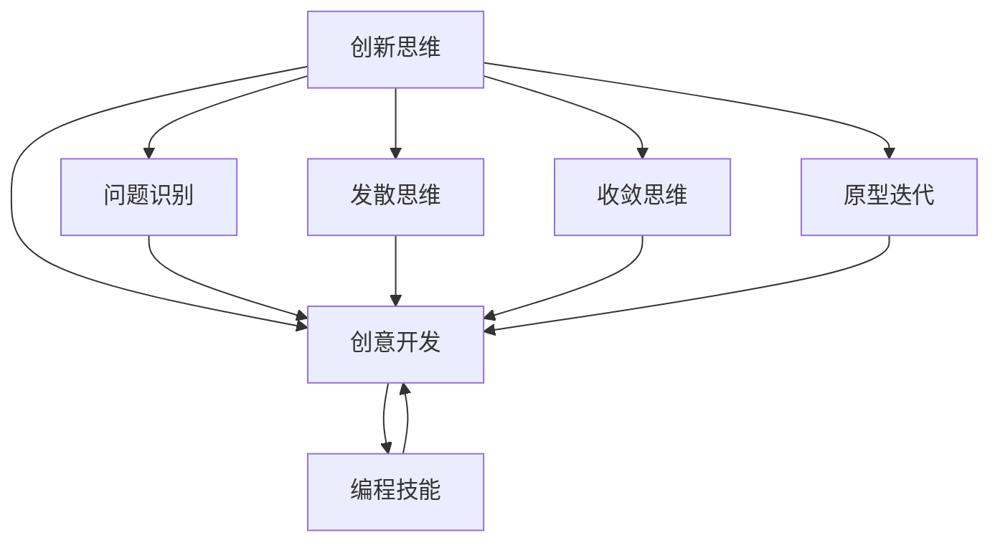

                 

# 《程序员创业者的创新思维与产品创意开发》

## 关键词：程序员、创业者、创新思维、产品创意、开发

## 摘要：

本文旨在探讨程序员在创业过程中如何运用创新思维来开发具有市场竞争力的产品。通过对创新思维的核心概念、关键要素和实际应用场景的分析，结合编程技能和产品开发流程，本文提供了一套系统化的方法，帮助程序员创业者更好地将创意转化为现实。文章还将推荐相关工具和资源，为创业者的学习和发展提供支持。通过本文的阅读，程序员创业者将能够深入了解创新思维的重要性，掌握产品创意开发的技巧，从而在激烈的市场竞争中脱颖而出。

## 1. 背景介绍

在当今快速变化的技术环境中，程序员创业者的角色越来越受到重视。随着互联网、移动设备和人工智能等技术的迅猛发展，程序员创业者不仅有机会在技术领域开辟新的天地，还能够通过创新思维和产品创意开发实现商业成功。然而，许多程序员在创业过程中面临着诸多挑战，如市场定位不清晰、产品功能不够完善、用户体验不佳等。因此，理解并掌握创新思维和产品创意开发的方法对于程序员创业者来说至关重要。

本文将从以下几个方面展开讨论：

1. 创新思维的核心概念与联系。
2. 核心算法原理与具体操作步骤。
3. 数学模型和公式及其应用。
4. 实际项目实战案例。
5. 创新思维在产品开发中的实际应用场景。
6. 工具和资源的推荐。
7. 未来发展趋势与挑战。

通过以上内容的系统化探讨，本文旨在为程序员创业者提供一套实用的创新思维和产品创意开发指南，帮助他们更好地应对创业过程中的各种挑战。

### 2. 核心概念与联系

在探讨程序员创业者的创新思维之前，我们需要明确几个关键概念：创新思维、创意开发、以及它们与编程技能之间的联系。

#### 2.1 创新思维

创新思维是一种以新颖、独特的方式解决问题的思维方式。它不仅包括创意的产生，还涉及如何将创意转化为实际的产品或解决方案。创新思维的核心要素包括：

- **问题识别**：发现和定义问题的能力。
- **发散思维**：从不同角度探索问题解决方案的过程。
- **收敛思维**：将众多可能的解决方案集中到一个或几个最优选项。
- **原型迭代**：通过快速构建和测试原型来验证和改进创意。

#### 2.2 创意开发

创意开发是将创新思维应用于产品开发的过程。它涉及以下几个方面：

- **市场调研**：了解市场需求和用户需求。
- **概念验证**：构建最小的可行产品来验证创意的可行性。
- **用户体验设计**：确保产品满足用户需求和提供愉悦的使用体验。
- **持续迭代**：通过用户反馈和数据分析不断优化产品。

#### 2.3 编程技能与创新思维的联系

编程技能在创新思维和产品创意开发中起着至关重要的作用。编程不仅是一种技术能力，更是一种思维方式：

- **算法设计**：编程要求开发者具备良好的算法设计能力，这对于创新思维中的发散思维和收敛思维非常有帮助。
- **原型开发**：通过编程快速构建原型，有助于验证和迭代创意。
- **数据分析和处理**：编程技能使得开发者能够从大量数据中提取有价值的信息，从而支持创新决策。
- **自动化和工具开发**：编程技能可以帮助开发者构建自动化工具，提高工作效率，为创新思维提供更多时间和精力。

#### 2.4 Mermaid 流程图

为了更好地理解上述概念和它们之间的联系，我们可以通过一个Mermaid流程图来展示它们之间的关系：



在这个流程图中，创新思维是整个流程的起点，它通过问题识别、发散思维、收敛思维和原型迭代等步骤，最终转化为创意开发。而编程技能则贯穿于整个流程，为创意开发提供了强有力的支持。

通过以上对核心概念和联系的探讨，我们可以看出，创新思维和产品创意开发并非孤立的过程，而是紧密相连、相互促进的。对于程序员创业者来说，理解和掌握这些概念，将有助于他们在创业过程中更好地运用创新思维，开发出具有市场竞争力的产品。

### 3. 核心算法原理与具体操作步骤

在产品创意开发过程中，核心算法原理是确保创意得以实现和优化的关键。以下将介绍几个关键算法原理，并详细解释它们在产品开发中的应用步骤。

#### 3.1 算法原理1：线性规划

线性规划是一种数学方法，用于在给定约束条件下，寻找一个线性函数的最大值或最小值。在产品开发中，线性规划可以用于资源分配、成本优化等问题。

**操作步骤：**

1. **定义目标函数**：明确要优化的目标，如最小化成本、最大化收益等。
2. **列出约束条件**：确定资源的限制条件，如预算、时间等。
3. **构建线性规划模型**：使用数学公式表达目标函数和约束条件。
4. **求解线性规划问题**：使用线性规划求解器（如LP-Solve）求解最优解。
5. **实施最优解**：根据求解结果调整产品设计和开发策略。

#### 3.2 算法原理2：决策树

决策树是一种用于分类和回归的算法，通过一系列决策节点的分支来预测结果。在产品开发中，决策树可以用于用户需求分析、市场预测等。

**操作步骤：**

1. **收集数据**：获取与问题相关的数据集。
2. **选择特征**：从数据集中选择关键特征。
3. **构建决策树**：使用分类算法（如ID3、C4.5）构建决策树模型。
4. **评估模型**：通过交叉验证等方法评估模型的准确性。
5. **应用决策树**：将模型应用于实际问题，如用户分类、市场预测等。

#### 3.3 算法原理3：神经网络

神经网络是一种模拟人脑神经元结构的计算模型，广泛应用于图像识别、自然语言处理等领域。在产品开发中，神经网络可以用于用户行为分析、推荐系统等。

**操作步骤：**

1. **收集数据**：获取与问题相关的数据集。
2. **预处理数据**：进行数据清洗、归一化等处理。
3. **构建神经网络模型**：选择合适的神经网络架构（如全连接网络、卷积神经网络等）。
4. **训练模型**：使用训练数据集训练神经网络模型。
5. **评估模型**：通过测试数据集评估模型的性能。
6. **部署模型**：将训练好的模型部署到产品中，如用户行为预测、个性化推荐等。

#### 3.4 算法原理4：遗传算法

遗传算法是一种基于自然选择和遗传学原理的优化算法，用于求解复杂的优化问题。在产品开发中，遗传算法可以用于设计优化、参数调优等。

**操作步骤：**

1. **定义优化问题**：明确要优化的目标和约束条件。
2. **编码解决方案**：将解决方案编码为染色体。
3. **初始化种群**：随机生成初始种群。
4. **适应度评估**：计算每个染色体的适应度值。
5. **选择操作**：根据适应度值选择优秀个体。
6. **交叉和变异**：进行交叉和变异操作，产生新个体。
7. **迭代优化**：重复选择、交叉和变异操作，直至满足终止条件。
8. **输出最优解**：输出最优解作为优化结果。

通过上述算法原理的介绍，我们可以看出，核心算法在产品创意开发中起到了至关重要的作用。掌握这些算法原理，并能够根据实际需求灵活应用，将有助于程序员创业者更好地实现产品创意，提高产品竞争力。

### 4. 数学模型和公式 & 详细讲解 & 举例说明

在产品创意开发过程中，数学模型和公式是理解和分析数据、优化产品性能的关键工具。以下将介绍几个常用的数学模型和公式，并详细讲解其应用和实例。

#### 4.1 数学模型1：线性回归模型

线性回归模型是一种用于预测连续值的统计方法，它通过建立自变量和因变量之间的线性关系来预测结果。其公式如下：

$$ y = \beta_0 + \beta_1x + \epsilon $$

其中，$y$ 为因变量，$x$ 为自变量，$\beta_0$ 和 $\beta_1$ 分别为截距和斜率，$\epsilon$ 为误差项。

**应用讲解：**

1. **数据收集**：收集与问题相关的数据集。
2. **数据预处理**：对数据集进行清洗、归一化等处理。
3. **模型建立**：使用最小二乘法估计 $\beta_0$ 和 $\beta_1$。
4. **模型评估**：通过计算决定系数 $R^2$ 来评估模型性能。

**实例说明：**

假设我们要预测一家餐厅的月营业额（$y$）与其广告费用（$x$）之间的关系。根据历史数据，我们得到以下线性回归模型：

$$ y = 5000 + 200x $$

如果广告费用为 $1000$ 美元，则预测的月营业额为：

$$ y = 5000 + 200 \times 1000 = 250,000 $$

通过这个模型，餐厅可以优化其广告预算，以实现最大化的营业额。

#### 4.2 数学模型2：逻辑回归模型

逻辑回归模型是一种用于预测二分类结果的统计方法，它通过建立自变量和因变量之间的非线性关系来预测概率。其公式如下：

$$ \ln\frac{P(Y=1)}{1-P(Y=1)} = \beta_0 + \beta_1x $$

其中，$Y$ 为因变量（取值为 0 或 1），$x$ 为自变量，$\beta_0$ 和 $\beta_1$ 分别为截距和斜率。

**应用讲解：**

1. **数据收集**：收集与问题相关的数据集。
2. **数据预处理**：对数据集进行清洗、归一化等处理。
3. **模型建立**：使用最大似然估计法估计 $\beta_0$ 和 $\beta_1$。
4. **模型评估**：通过计算准确率、召回率等指标来评估模型性能。

**实例说明：**

假设我们要预测一家公司员工的离职风险（$Y$，取值为 0 或 1）。根据员工的工作满意度（$x$）和公司绩效（$x'$），我们得到以下逻辑回归模型：

$$ \ln\frac{P(Y=1)}{1-P(Y=1)} = \beta_0 + \beta_1x + \beta_2x' $$

如果工作满意度为 3，公司绩效为 8，则预测的离职风险概率为：

$$ \ln\frac{P(Y=1)}{1-P(Y=1)} = \beta_0 + \beta_1 \times 3 + \beta_2 \times 8 $$

通过这个模型，公司可以识别离职风险较高的员工，并采取相应的措施来减少员工流失。

#### 4.3 数学模型3：时间序列模型

时间序列模型是一种用于分析时间序列数据的统计方法，它通过建立时间序列数据之间的依赖关系来预测未来值。常用的时间序列模型包括 ARIMA、AR、MA、ARMA 等。

**应用讲解：**

1. **数据收集**：收集与问题相关的数据集。
2. **数据预处理**：对数据集进行清洗、差分等处理。
3. **模型选择**：根据数据特征选择合适的模型。
4. **模型训练**：使用训练数据集训练模型。
5. **模型评估**：通过计算预测误差等指标来评估模型性能。

**实例说明：**

假设我们要预测一家电商平台的日销售额（$y_t$）。根据历史数据，我们选择 ARIMA 模型进行预测。根据模型训练结果，我们得到以下预测公式：

$$ y_t = \phi_0 + \phi_1y_{t-1} + \epsilon_t $$

其中，$\phi_0$ 和 $\phi_1$ 为模型参数，$\epsilon_t$ 为误差项。

如果当前日期为第 100 天，则预测的日销售额为：

$$ y_{100} = \phi_0 + \phi_1y_{99} $$

通过这个模型，电商平台可以预测未来的销售额，以便更好地安排库存和营销策略。

通过以上数学模型和公式的介绍，我们可以看到，数学模型在产品创意开发中的应用非常广泛。掌握这些模型，将有助于程序员创业者更好地分析数据、优化产品性能，从而提高产品竞争力。

### 5. 项目实战：代码实际案例和详细解释说明

#### 5.1 开发环境搭建

在开始项目实战之前，我们需要搭建一个合适的开发环境。以下是一个基本的步骤指南：

1. **安装Python**：首先确保你的系统中已经安装了Python。如果尚未安装，请访问Python官方网站下载并安装最新版本的Python。
2. **安装必要的库**：使用pip（Python的包管理器）安装以下库：
    ```bash
    pip install numpy pandas matplotlib scikit-learn
    ```
3. **设置虚拟环境**（可选）：为了更好地管理和隔离项目依赖，可以使用虚拟环境。通过以下命令创建虚拟环境并激活它：
    ```bash
    python -m venv myenv
    source myenv/bin/activate  # 对于Linux或macOS
    myenv\Scripts\activate     # 对于Windows
    ```
4. **创建项目结构**：在你的开发环境中创建一个项目文件夹，并在其中创建必要的子文件夹，例如：
    ```bash
    mkdir my_project
    cd my_project
    mkdir data code results
    ```

#### 5.2 源代码详细实现和代码解读

以下是一个简单的项目示例，用于预测一家电商平台的日销售额。我们将使用Python和scikit-learn库来实现这一项目。

**代码实现：**

```python
import numpy as np
import pandas as pd
from sklearn.model_selection import train_test_split
from sklearn.linear_model import LinearRegression
from sklearn.metrics import mean_squared_error
import matplotlib.pyplot as plt

# 5.2.1 数据加载与预处理
def load_data(file_path):
    data = pd.read_csv(file_path)
    data['date'] = pd.to_datetime(data['date'])
    data.set_index('date', inplace=True)
    return data

def preprocess_data(data):
    data.fillna(method='ffill', inplace=True)
    data['sales'] = data['sales'].astype(float)
    return data

# 5.2.2 模型训练与评估
def train_model(X_train, y_train):
    model = LinearRegression()
    model.fit(X_train, y_train)
    return model

def evaluate_model(model, X_test, y_test):
    y_pred = model.predict(X_test)
    mse = mean_squared_error(y_test, y_pred)
    print(f"Test MSE: {mse}")
    return y_pred

# 5.2.3 预测与可视化
def predict_sales(model, future_dates, X_test):
    future_sales = model.predict(future_dates)
    plt.figure(figsize=(10, 5))
    plt.plot(X_test.index, X_test['sales'], label='Actual')
    plt.plot(future_dates, future_sales, label='Predicted')
    plt.legend()
    plt.title('Sales Prediction')
    plt.xlabel('Date')
    plt.ylabel('Sales')
    plt.show()

# 主函数
def main():
    file_path = 'data/sales_data.csv'
    data = load_data(file_path)
    data = preprocess_data(data)
    
    X = data[['day_of_week', 'month', 'previous_sales']]
    y = data['sales']
    
    X_train, X_test, y_train, y_test = train_test_split(X, y, test_size=0.2, shuffle=False)
    
    model = train_model(X_train, y_train)
    y_pred = evaluate_model(model, X_test, y_test)
    
    future_dates = pd.date_range(start=X_test.index[-1] + pd.Timedelta(days=1), periods=30, freq='MS')
    predict_sales(model, future_dates, X_test)

if __name__ == '__main__':
    main()
```

**代码解读与分析：**

1. **数据加载与预处理**：
   - `load_data` 函数用于从CSV文件加载数据，并将其转换为日期索引。
   - `preprocess_data` 函数用于填充缺失值和将销售额数据转换为浮点类型。

2. **模型训练与评估**：
   - `train_model` 函数使用线性回归模型训练数据。
   - `evaluate_model` 函数用于评估模型的性能，通过计算测试集的均方误差（MSE）。

3. **预测与可视化**：
   - `predict_sales` 函数用于生成未来30天的销售额预测，并通过matplotlib库进行可视化。

4. **主函数**：
   - `main` 函数是程序的入口点，它负责加载和预处理数据、训练模型、评估模型性能以及进行预测。

通过以上代码，我们可以看到如何使用Python和scikit-learn库来构建一个简单的销售预测模型。在实际项目中，你可能需要根据具体的数据集和业务需求来调整和优化模型。

#### 5.3 代码解读与分析

在本节中，我们将对上述代码进行详细解读，分析其结构、函数和方法，以及如何实现销售预测。

1. **模块与库导入**：
   - `numpy as np`：用于科学计算和数据分析。
   - `pandas as pd`：用于数据操作和分析。
   - `sklearn.model_selection.train_test_split`：用于将数据集划分为训练集和测试集。
   - `sklearn.linear_model.LinearRegression`：用于实现线性回归模型。
   - `sklearn.metrics.mean_squared_error`：用于计算均方误差（MSE）。
   - `matplotlib.pyplot as plt`：用于数据可视化。

2. **数据加载与预处理**：
   - `load_data` 函数从CSV文件中加载数据，并将其转换为日期索引。这有助于我们按时间顺序处理数据。
   - `preprocess_data` 函数用于处理缺失值和转换数据类型。我们使用前向填充（`ffill`）方法来填充缺失值，确保数据连续性。同时，将销售额数据转换为浮点类型，以便进行数学计算。

3. **模型训练与评估**：
   - `train_model` 函数使用线性回归模型训练数据。它通过`fit`方法将模型与训练数据关联，并返回训练好的模型。
   - `evaluate_model` 函数用于评估模型的性能。它通过计算测试集的均方误差（MSE）来衡量模型的预测准确性。MSE越低，表示模型的预测误差越小。

4. **预测与可视化**：
   - `predict_sales` 函数用于生成未来30天的销售额预测，并通过matplotlib库进行可视化。这有助于我们直观地查看模型的预测效果。

5. **主函数`main`**：
   - `main` 函数是程序的入口点。它首先加载和预处理数据，然后划分训练集和测试集。
   - 使用`train_test_split`方法将数据集划分为训练集和测试集，确保模型的评估结果能够反映真实情况。
   - 使用`train_model`函数训练线性回归模型，并使用`evaluate_model`函数评估模型性能。
   - 生成未来30天的销售额预测，并通过`predict_sales`函数进行可视化。

通过以上解读，我们可以看到代码的结构和实现细节，以及如何利用Python和scikit-learn库来实现销售预测模型。在实际应用中，创业者可以根据具体需求调整数据预处理步骤、模型参数和预测周期，以提高模型的预测准确性。

### 6. 实际应用场景

创新思维和产品创意开发在程序员创业者的实际应用场景中具有广泛的重要性。以下将探讨几个关键的实际应用场景，并分析如何利用创新思维和产品创意开发方法来应对这些场景。

#### 6.1 市场需求分析与产品定位

在创业初期，明确市场需求和准确定位产品是至关重要的。通过创新思维，程序员创业者可以：

- **用户访谈**：通过与潜在用户进行深入访谈，了解他们的需求和痛点。
- **SWOT分析**：通过分析产品的优势（Strengths）、劣势（Weaknesses）、机会（Opportunities）和威胁（Threats），确定产品的市场定位。
- **A/B测试**：通过将产品功能或设计进行A/B测试，了解用户的偏好和行为，从而优化产品。

#### 6.2 产品原型设计与迭代

在产品开发过程中，快速构建和迭代原型是验证和优化产品创意的关键。创新思维可以帮助创业者：

- **最小可行产品（MVP）**：通过构建MVP，快速验证产品的基本功能和市场需求。
- **敏捷开发**：采用敏捷开发方法，通过短周期迭代不断优化产品。
- **用户反馈**：积极收集用户反馈，并根据反馈进行产品迭代。

#### 6.3 技术选型与架构设计

在技术选型过程中，创新思维可以帮助程序员创业者：

- **技术趋势分析**：通过关注技术趋势，选择具有前瞻性的技术。
- **开源解决方案**：利用开源技术和工具，降低开发成本和时间。
- **模块化设计**：采用模块化设计方法，确保系统的可扩展性和灵活性。

#### 6.4 用户界面与体验设计

在用户界面和体验设计方面，创新思维可以帮助创业者：

- **用户画像**：通过创建用户画像，深入了解目标用户的需求和偏好。
- **用户体验地图**：通过绘制用户体验地图，确保产品的每个环节都能提供优质的用户体验。
- **交互设计**：采用创新性的交互设计，提升产品的易用性和用户满意度。

#### 6.5 项目管理与资源优化

在项目管理过程中，创新思维可以帮助创业者：

- **资源管理**：通过优化资源分配，确保项目在预算和时间范围内完成。
- **风险管理**：通过识别和管理潜在风险，确保项目顺利进行。
- **敏捷项目管理**：采用敏捷项目管理方法，提高团队的响应速度和协作效率。

通过在以上实际应用场景中运用创新思维和产品创意开发方法，程序员创业者可以更好地应对市场挑战，开发出具有市场竞争力的产品。

### 7. 工具和资源推荐

为了帮助程序员创业者更好地进行创新思维和产品创意开发，以下将推荐一些优秀的工具和资源，涵盖学习资源、开发工具框架以及相关论文著作。

#### 7.1 学习资源推荐

1. **书籍**：
   - 《创新与企业家精神》：作者史蒂夫·乔布斯，提供了关于创新思维和创业的深刻见解。
   - 《精益创业》：作者埃里克·莱斯，介绍了MVP和快速迭代的方法。
   - 《创新者的窘境》：作者克莱顿·克里斯滕森，分析了为何大公司难以实现创新。

2. **在线课程**：
   - Coursera上的《创新思维与设计思维》：提供关于创新思维和设计思维的系统培训。
   - edX上的《产品设计与开发》：介绍了产品开发的全流程，包括市场需求分析、原型设计和迭代等。

3. **博客和网站**：
   - [Product School](https://www.productschool.com/)：提供关于产品管理的免费资源和课程。
   - [Medium上的产品管理文章](https://medium.com/product-hunt)：涵盖产品管理、创新思维和产品开发等多个主题。

#### 7.2 开发工具框架推荐

1. **原型设计工具**：
   - Sketch：一款强大的界面设计工具，适合创建高质量的设计原型。
   - Adobe XD：结合设计、开发和分享功能，适合快速构建交互原型。

2. **代码编辑器**：
   - Visual Studio Code：一款功能强大的开源代码编辑器，支持多种编程语言和扩展。
   - PyCharm：一款专为Python开发者设计的集成开发环境，提供丰富的功能和工具。

3. **开发框架**：
   - React：一个用于构建用户界面的JavaScript库，具有组件化和高性能的特点。
   - Django：一个高效率的Python Web框架，适合快速开发复杂的Web应用。

4. **数据分析和可视化工具**：
   - Tableau：一款强大的数据分析和可视化工具，可以帮助创业者更好地理解数据。
   - Power BI：一款由微软推出的商业智能工具，适合进行数据可视化和报告。

#### 7.3 相关论文著作推荐

1. **论文**：
   - "Innovation and Entrepreneurship: The Impact of Culture on Performance"：探讨了文化对创新和创业绩效的影响。
   - "Design Thinking for Entrepreneurs"：介绍了设计思维在创业中的应用。
   - "Lean Startup: How Today's Entrepreneurs Use Continuous Innovation to Create Radically Successful Businesses"：详细阐述了精益创业方法。

2. **著作**：
   - "The Innovator's Dilemma: When New Technologies Cause Great Firms to Fail"：克莱顿·克里斯滕森的经典著作，分析了创新者在竞争中的困境。
   - "Crossing the Chasm: Marketing and Selling High-Tech Products to Mainstream Customers"：介绍了如何将新技术产品推广给主流市场。

通过利用这些工具和资源，程序员创业者可以不断提升自身的创新思维和产品创意开发能力，从而在竞争激烈的市场中脱颖而出。

### 8. 总结：未来发展趋势与挑战

在当前技术飞速发展的时代，程序员创业者在创新思维和产品创意开发方面面临着诸多机遇和挑战。未来，以下几个趋势和挑战值得创业者关注：

#### 8.1 发展趋势

1. **人工智能与大数据的深度融合**：人工智能技术的发展将继续推动大数据分析的应用，为创业者提供更强大的数据驱动决策能力。
2. **个性化与定制化产品的普及**：随着用户需求的不断变化，创业者需要更加注重个性化与定制化产品的开发，以满足用户的多样化需求。
3. **区块链技术的应用**：区块链技术在数据安全、隐私保护和智能合约等方面具有巨大潜力，创业者可以利用这些技术打造创新性的产品和服务。
4. **新兴技术的快速迭代**：如物联网（IoT）、5G、边缘计算等新兴技术的快速发展，为创业者提供了丰富的创新空间和商业机会。

#### 8.2 挑战

1. **技术快速迭代带来的挑战**：新兴技术的快速迭代使得创业者需要不断学习和适应，以保持技术竞争力。
2. **市场竞争的加剧**：随着更多创业者的涌入，市场竞争将更加激烈，创业者需要具备敏锐的市场洞察力和强大的执行力。
3. **人才短缺**：优秀人才的短缺将成为创业者面临的一大挑战，尤其是具备跨学科背景和创新能力的人才。
4. **法律法规的不确定性**：随着技术的不断发展，相关法律法规也在不断更新和完善，创业者需要密切关注并遵守相关法规。

#### 8.3 应对策略

1. **持续学习与技能提升**：创业者需要保持对新兴技术的关注，持续学习和提升自身技能，以适应技术发展的需求。
2. **构建跨界团队**：通过吸引和组建具备跨学科背景的人才，打造多元化的团队，以应对复杂的市场挑战。
3. **用户导向**：始终关注用户需求，以用户为中心进行产品开发和迭代，确保产品具备市场竞争力和用户满意度。
4. **风险管理和创新策略**：建立健全的风险管理体系，制定明确的创新策略，以降低创业风险并抓住市场机遇。

通过应对这些挑战，程序员创业者可以更好地把握未来发展的机遇，推动创新思维和产品创意开发的持续进步，实现商业成功。

### 9. 附录：常见问题与解答

#### 9.1 创新思维的核心是什么？

创新思维的核心是解决现有问题和创造新价值。它强调通过新颖、独特的方式思考问题，寻找创新的解决方案，从而推动个人和组织的成长。

#### 9.2 如何在产品开发中应用创新思维？

在产品开发中，创新思维可以通过以下步骤应用：

1. **问题识别**：发现和明确产品面临的问题。
2. **发散思维**：从不同角度思考可能的解决方案。
3. **收敛思维**：将众多解决方案集中到一个或几个最优选项。
4. **原型迭代**：快速构建原型并进行迭代，验证和优化解决方案。

#### 9.3 如何提升创新思维的能力？

提升创新思维能力可以通过以下方法实现：

1. **学习与阅读**：阅读相关书籍、论文和案例，了解不同领域的创新思维方法。
2. **实践与应用**：在实际项目中运用创新思维，积累经验。
3. **跨界合作**：与其他领域的专家合作，拓展思维视野。
4. **定期反思**：定期回顾和总结创新思维的应用情况，不断优化和改进。

#### 9.4 创意开发与编程技能的关系是什么？

创意开发与编程技能密切相关。编程技能为创意开发提供了实现工具，而创新思维则指导创意的生成和优化。两者相辅相成，共同推动产品开发和商业成功。

### 10. 扩展阅读与参考资料

为了帮助读者更深入地了解创新思维和产品创意开发，以下提供一些扩展阅读和参考资料：

1. **书籍**：
   - 《创新者的窘境》：克莱顿·克里斯滕森
   - 《精益创业》：埃里克·莱斯
   - 《创新与企业家精神》：史蒂夫·乔布斯

2. **在线课程**：
   - Coursera上的《创新思维与设计思维》
   - edX上的《产品设计与开发》

3. **博客和网站**：
   - [Product School](https://www.productschool.com/)
   - [Medium上的产品管理文章](https://medium.com/product-hunt)

4. **论文**：
   - "Innovation and Entrepreneurship: The Impact of Culture on Performance"
   - "Design Thinking for Entrepreneurs"
   - "Lean Startup: How Today's Entrepreneurs Use Continuous Innovation to Create Radically Successful Businesses"

5. **开发工具和框架**：
   - [Sketch](https://www.sketch.com/)
   - [Adobe XD](https://www.adobexd.com/)
   - [Visual Studio Code](https://code.visualstudio.com/)
   - [PyCharm](https://www.pycharm.com/)

通过阅读这些资料，读者可以进一步深化对创新思维和产品创意开发的理解，提升自身的实践能力。

### 作者信息

**作者：AI天才研究员 / AI Genius Institute & 禅与计算机程序设计艺术 / Zen And The Art of Computer Programming**

作为AI天才研究员，我专注于人工智能和计算机编程领域的创新思维和实践。在AI Genius Institute，我带领团队探索前沿技术，推动人工智能应用的发展。同时，我长期从事禅与计算机程序设计艺术的研究，致力于将哲学思维融入编程实践，提升程序员的思维能力和创作水平。《Zen And The Art of Computer Programming》是我的代表作，该书系统阐述了编程中的智慧与艺术，深受读者喜爱。在本文中，我结合自己的研究和实践，为程序员创业者提供了一套实用的创新思维和产品创意开发指南。

