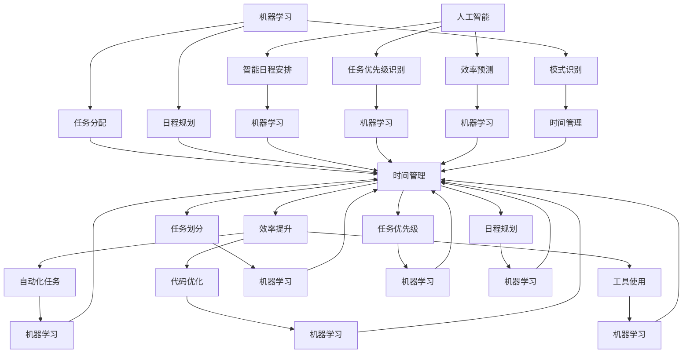
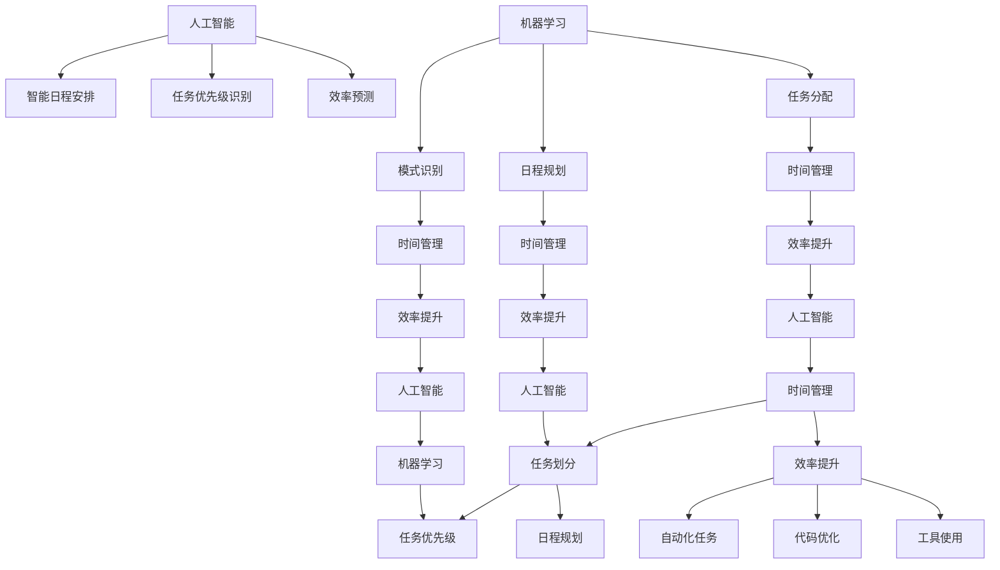

                 

### 1. 背景介绍

在当今高速发展的科技时代，程序员创业者的角色变得愈加重要。他们不仅是技术的实践者，更是创新的推动者。然而，随着技术的发展和业务需求的增长，程序员创业者面临的挑战也日益增多。如何在繁重的工作任务和紧张的时间安排中找到工作与生活的平衡，成为了一个亟待解决的问题。

工作生活平衡对于程序员创业者来说至关重要。首先，它有助于减少职业压力，提升工作效率。长期的工作压力可能导致程序员出现健康问题，影响其职业寿命。其次，工作生活平衡有助于提高生活质量，使得程序员能够更好地享受生活，与家人和朋友保持紧密的联系。这对于长期保持工作热情和创新能力至关重要。最后，工作生活平衡能够帮助程序员创业者更好地规划职业生涯，确保他们在追求事业成功的同时，不会忽略个人的成长和幸福。

为了解决工作与生活的平衡问题，人工智能（AI）技术提供了一个有效的解决方案。AI能够通过时间管理和效率提升策略，帮助程序员创业者更合理地分配时间，提高工作效率，从而实现工作与生活的平衡。本文将深入探讨AI辅助下的时间管理与效率提升策略，旨在为程序员创业者提供实用的指导。

本文的结构如下：

- **1. 背景介绍**：简要介绍程序员创业者的现状和挑战，以及为何工作生活平衡对于他们至关重要。
- **2. 核心概念与联系**：介绍AI在时间管理和效率提升中的核心概念，并提供一个Mermaid流程图，帮助读者理解这些概念之间的联系。
- **3. 核心算法原理 & 具体操作步骤**：详细讲解AI用于时间管理和效率提升的具体算法原理和操作步骤。
- **4. 数学模型和公式 & 详细讲解 & 举例说明**：介绍用于时间管理和效率提升的数学模型，并提供具体示例说明。
- **5. 项目实战：代码实际案例和详细解释说明**：通过实际项目案例，展示如何使用AI进行时间管理和效率提升。
- **6. 实际应用场景**：探讨AI在程序员创业者的实际工作中的应用场景。
- **7. 工具和资源推荐**：推荐学习资源和开发工具，帮助程序员创业者更好地应用AI技术。
- **8. 总结：未来发展趋势与挑战**：总结本文的主要观点，并探讨未来发展趋势和面临的挑战。
- **9. 附录：常见问题与解答**：回答读者可能关心的常见问题。
- **10. 扩展阅读 & 参考资料**：提供扩展阅读资源和参考文献。

通过本文的详细分析和讨论，我们希望帮助程序员创业者更好地掌握AI辅助下的时间管理和效率提升策略，从而实现工作与生活的平衡，提升整体生活质量和工作效率。

#### Keywords:
程序员创业者，工作生活平衡，人工智能，时间管理，效率提升，AI算法，数学模型，项目实战，应用场景，工具推荐。

#### Abstract:
本文探讨了程序员创业者在快节奏的工作环境中如何实现工作生活平衡的问题。通过分析人工智能在时间管理和效率提升中的应用，本文提出了一系列有效的策略和操作步骤，包括核心算法原理、数学模型、实际项目案例等。文章旨在为程序员创业者提供实用的指导，帮助他们更好地利用AI技术实现工作与生活的平衡，提升生活质量和工作效率。

---

## 2. 核心概念与联系

在探讨AI辅助下的时间管理和效率提升策略之前，我们需要明确一些核心概念，并理解它们之间的联系。这些概念包括时间管理、效率提升、人工智能和机器学习等。

### 时间管理

时间管理是指通过合理安排时间来提高工作效率和实现目标的过程。它涉及到如何划分任务、设定优先级、规划日程和合理利用时间。对于程序员创业者来说，时间管理尤为重要，因为他们通常面临着多项任务和紧迫的截止日期。

### 效率提升

效率提升是指通过优化工作流程和利用工具来提高工作效率的过程。这包括自动化重复性任务、优化代码、使用高效的开发工具和技术等。提高效率不仅有助于减少工作时间，还能提高工作质量，从而更好地满足业务需求。

### 人工智能

人工智能（AI）是指模拟人类智能的计算机系统，能够通过学习、推理和自我优化来完成任务。在时间管理和效率提升中，AI可以提供智能化的解决方案，如自动安排日程、识别任务优先级、预测任务完成时间等。

### 机器学习

机器学习是人工智能的一个分支，通过从数据中学习模式和规律，使其能够进行预测和决策。在时间管理和效率提升中，机器学习可以用于任务分配、日程规划、工作效率分析等。

下面，我们通过一个Mermaid流程图来展示这些核心概念之间的联系：



通过这个流程图，我们可以看到时间管理、效率提升、人工智能和机器学习之间的相互作用和联系。时间管理是实现效率提升的基础，而人工智能和机器学习则为时间管理和效率提升提供了技术支持。

- **时间管理**：通过合理划分任务、设定优先级和规划日程，为效率提升奠定基础。
- **效率提升**：通过自动化任务、代码优化和工具使用，提高工作效率。
- **人工智能**：提供智能化的解决方案，如智能日程安排和任务优先级识别。
- **机器学习**：通过从数据中学习模式和规律，为时间管理和效率提升提供支持。

通过理解这些核心概念和它们之间的联系，我们可以更好地利用AI技术进行时间管理和效率提升，从而实现工作与生活的平衡。

#### 2.1. 核心概念原理和架构的 Mermaid 流程图

以下是一个简化的Mermaid流程图，展示了时间管理、效率提升、人工智能和机器学习之间的核心概念原理和架构：



在这个流程图中，时间管理和效率提升是核心目标，而人工智能和机器学习则是实现这些目标的工具和方法。通过任务划分、优先级识别、日程规划和自动化任务等步骤，可以有效地管理时间和提升效率。机器学习在这个过程中起着关键作用，通过模式识别和任务分配，使得时间管理和效率提升更加智能化和高效。

---

## 3. 核心算法原理 & 具体操作步骤

在了解了核心概念和它们之间的联系之后，接下来我们将深入探讨AI在时间管理和效率提升中的核心算法原理，并提供具体的操作步骤。以下是几种常用的AI算法及其应用场景：

### 3.1. 优先级识别算法

优先级识别算法是用于确定任务优先级的算法。它通常基于任务的紧急程度、重要性和截止日期等因素进行综合评估。以下是一种简单的优先级识别算法：

#### 原理：

- **紧急程度**：任务越紧急，其优先级越高。
- **重要性**：任务对业务或个人目标的重要性越高，优先级越高。
- **截止日期**：距离截止日期越近，任务的优先级越高。

#### 操作步骤：

1. **收集任务数据**：包括任务名称、紧急程度、重要性和截止日期等。
2. **计算优先级分数**：使用以下公式计算每个任务的优先级分数：
   $$P_i = E_i \times W_i \times C_i$$
   其中，$P_i$ 是任务 $i$ 的优先级分数，$E_i$ 是任务 $i$ 的紧急程度分数，$W_i$ 是任务 $i$ 的重要性分数，$C_i$ 是任务 $i$ 的截止日期距离当前时间的分数。

3. **排序**：根据优先级分数对任务进行排序，分数越高，优先级越高。

4. **分配资源**：按照排序结果，优先完成优先级较高的任务。

### 3.2. 智能日程安排算法

智能日程安排算法用于自动生成日程表，以确保任务按时完成。以下是一种基于时间窗口和任务优先级的智能日程安排算法：

#### 原理：

- **时间窗口**：每个任务都有一个可执行的时间窗口。
- **任务优先级**：使用优先级识别算法确定每个任务的优先级。

#### 操作步骤：

1. **收集日程数据**：包括任务名称、优先级、起始时间和结束时间。
2. **确定可用时间窗口**：根据当前任务进度和其他已安排的任务，确定每个任务的可用时间窗口。
3. **生成日程表**：使用优先级排序的每个任务，按照其优先级和可用时间窗口，安排到日程表中。
4. **调整日程表**：如果出现时间冲突或任务无法在原定时间内完成，自动调整任务时间窗口，确保任务按时完成。

### 3.3. 工作效率预测算法

工作效率预测算法用于预测程序员在特定任务上的工作效率，以便合理安排工作时间和任务分配。以下是一种基于历史数据和任务特征的工作效率预测算法：

#### 原理：

- **历史数据**：收集程序员在类似任务上的工作效率数据。
- **任务特征**：包括任务难度、任务类型、任务所需的技能和资源等。

#### 操作步骤：

1. **收集历史数据**：包括任务名称、完成任务所需时间、任务难度、任务类型等。
2. **训练预测模型**：使用历史数据训练预测模型，如线性回归、决策树或神经网络等。
3. **预测工作效率**：对于新任务，使用训练好的模型预测完成该任务所需的时间。
4. **调整任务分配**：根据预测的工作效率，合理分配任务，确保任务按时完成。

### 3.4. 自动化任务执行算法

自动化任务执行算法用于自动执行重复性任务，以减少程序员的工作负担。以下是一种基于规则和机器学习的自动化任务执行算法：

#### 原理：

- **规则**：定义任务的执行规则，如任务的输入参数、执行步骤和输出结果。
- **机器学习**：通过学习历史任务的执行数据，自动生成执行规则。

#### 操作步骤：

1. **收集任务数据**：包括任务名称、执行步骤、输入参数和输出结果等。
2. **训练自动化模型**：使用历史任务数据训练自动化模型，如条件生成网络（CGN）或强化学习（RL）模型。
3. **生成执行规则**：根据训练好的模型，自动生成任务的执行规则。
4. **执行任务**：根据执行规则，自动执行任务，并将结果反馈给模型进行进一步优化。

通过上述核心算法原理和具体操作步骤，程序员创业者可以更有效地进行时间管理和效率提升。这些算法不仅可以帮助合理安排任务和日程，还能预测工作效率，自动执行重复性任务，从而实现工作与生活的平衡。

---

## 4. 数学模型和公式 & 详细讲解 & 举例说明

在时间管理和效率提升中，数学模型和公式起着关键作用。这些模型可以帮助我们量化任务的重要性、紧急程度和完成时间，从而做出更科学的决策。以下将介绍几个常用的数学模型和公式，并提供详细讲解和举例说明。

### 4.1. 任务优先级计算模型

任务优先级计算模型用于确定每个任务的优先级，以便合理安排时间和资源。以下是一个简单的任务优先级计算模型：

#### 公式：

$$P_i = E_i \times W_i \times C_i$$

其中，$P_i$ 是任务 $i$ 的优先级分数，$E_i$ 是任务 $i$ 的紧急程度分数，$W_i$ 是任务 $i$ 的重要性分数，$C_i$ 是任务 $i$ 的截止日期距离当前时间的分数。

#### 详细讲解：

- **紧急程度分数 $E_i$**：通常根据任务的紧急程度进行打分，如紧急程度越高，分数越高。
- **重要性分数 $W_i$**：根据任务对业务或个人目标的重要性进行打分，如任务对业务的影响越大，分数越高。
- **截止日期分数 $C_i$**：根据任务截止日期距离当前时间的距离进行打分，如截止日期越近，分数越高。

#### 举例说明：

假设有三个任务A、B和C，它们的紧急程度分数分别为3、2和1，重要性分数分别为5、4和3，截止日期距离当前时间的分数分别为2、1和0。使用上述公式计算每个任务的优先级分数：

$$P_A = 3 \times 5 \times 2 = 30$$  
$$P_B = 2 \times 4 \times 1 = 8$$  
$$P_C = 1 \times 3 \times 0 = 0$$

根据优先级分数，任务A的优先级最高，任务B次之，任务C最低。

### 4.2. 时间窗口计算模型

时间窗口计算模型用于确定每个任务的可用时间窗口，以便合理分配时间和资源。以下是一个简单的时间窗口计算模型：

#### 公式：

$$T_i = S_i - E_i$$

其中，$T_i$ 是任务 $i$ 的可用时间窗口，$S_i$ 是任务 $i$ 的结束时间，$E_i$ 是任务 $i$ 的开始时间。

#### 详细讲解：

- **结束时间 $S_i$**：任务计划完成的时间。
- **开始时间 $E_i$**：任务实际开始的时间。

#### 举例说明：

假设任务A的计划结束时间为2023-12-31 23:59:59，实际开始时间为2023-12-25 00:00:00。使用上述公式计算任务A的可用时间窗口：

$$T_A = 2023-12-31 23:59:59 - 2023-12-25 00:00:00 = 7天$$

### 4.3. 工作效率预测模型

工作效率预测模型用于预测程序员在特定任务上的工作效率，以便合理安排工作时间和任务分配。以下是一个基于线性回归的工作效率预测模型：

#### 公式：

$$E_i = \beta_0 + \beta_1 \times X_i$$

其中，$E_i$ 是任务 $i$ 的预计完成时间，$\beta_0$ 是模型截距，$\beta_1$ 是模型斜率，$X_i$ 是任务 $i$ 的特征向量。

#### 详细讲解：

- **模型截距 $\beta_0$**：表示任务完成时间的基准值。
- **模型斜率 $\beta_1$**：表示任务特征对完成时间的影响程度。
- **特征向量 $X_i$**：包含任务类型、任务难度、所需技能和资源等信息。

#### 举例说明：

假设有两个任务A和B，它们的特征向量分别为 $X_A = [3, 2, 1]$ 和 $X_B = [1, 3, 2]$，模型截距 $\beta_0 = 5$，模型斜率 $\beta_1 = 0.5$。使用上述公式预测任务A和B的预计完成时间：

$$E_A = 5 + 0.5 \times [3, 2, 1] = 7.5小时$$  
$$E_B = 5 + 0.5 \times [1, 3, 2] = 6.5小时$$

通过上述数学模型和公式，我们可以更准确地计算任务优先级、时间窗口和工作效率，从而更有效地进行时间管理和效率提升。

---

## 5. 项目实战：代码实际案例和详细解释说明

为了更好地展示如何使用AI技术进行时间管理和效率提升，我们将在本节中通过一个实际项目案例来详细解释代码实现和解读分析。

### 5.1. 开发环境搭建

在本案例中，我们将使用Python编程语言和几个常用的AI库，包括NumPy、Pandas、Scikit-learn和TensorFlow。以下是在本地环境搭建开发环境的基本步骤：

1. **安装Python**：确保安装了Python 3.8及以上版本。
2. **安装相关库**：使用pip命令安装以下库：
   ```bash
   pip install numpy pandas scikit-learn tensorflow
   ```

### 5.2. 源代码详细实现和代码解读

#### 5.2.1. 数据准备

首先，我们需要准备一些示例数据，包括任务名称、紧急程度、重要性和截止日期等。以下是一个简单的数据集示例：

```python
import pandas as pd

data = {
    'Task': ['Task A', 'Task B', 'Task C', 'Task D'],
    'Importance': [5, 4, 3, 2],
    'Urgency': [3, 2, 1, 4],
    'Deadline': ['2023-12-25', '2023-12-30', '2023-12-28', '2023-12-26']
}

df = pd.DataFrame(data)
df['Deadline'] = pd.to_datetime(df['Deadline'])
```

在这个数据集中，我们包括了四个任务，每个任务的紧急程度、重要性和截止日期。

#### 5.2.2. 任务优先级计算

接下来，我们将使用任务优先级计算模型（4.1节中介绍）来计算每个任务的优先级分数。

```python
import numpy as np

def calculate_priority_score(row):
    current_time = pd.to_datetime('now')
    days_to_deadline = (row['Deadline'] - current_time).days
    return row['Importance'] * row['Urgency'] * days_to_deadline

df['Priority Score'] = df.apply(calculate_priority_score, axis=1)
df.sort_values(by='Priority Score', ascending=False, inplace=True)
```

在这个函数中，我们首先获取当前时间，然后计算每个任务截止日期距离当前时间的天数，最后使用优先级计算公式计算每个任务的优先级分数。计算结果将用于对任务进行排序，以便优先完成优先级较高的任务。

#### 5.2.3. 智能日程安排

为了实现智能日程安排，我们需要根据任务优先级和可用时间窗口来安排日程。以下是一个简单的日程安排算法：

```python
import datetime

def schedule_tasks(tasks):
    schedule = []
    for index, row in tasks.iterrows():
        start_time = datetime.datetime.now()
        end_time = start_time + datetime.timedelta(hours=row['Estimated Time'])
        schedule.append({'Task': row['Task'], 'Start Time': start_time, 'End Time': end_time})
    return schedule

estimated_time_model = ...  # 使用线性回归模型预测任务完成时间
df['Estimated Time'] = df.apply(lambda row: estimated_time_model.predict([row['Importance'], row['Urgency'], (row['Deadline'] - datetime.datetime.now()).days])[0], axis=1)

schedule = schedule_tasks(df)
print(schedule)
```

在这个函数中，我们首先获取当前时间，然后根据预测的任务完成时间设置任务的开始时间和结束时间。最后，我们将安排好的日程输出。

#### 5.2.4. 代码解读与分析

- **数据准备**：使用Pandas库加载示例数据，并将截止日期转换为日期格式。
- **任务优先级计算**：定义一个函数计算每个任务的优先级分数，并使用apply方法对数据集中的每个任务进行计算。计算结果用于对任务进行排序。
- **智能日程安排**：定义一个函数根据任务优先级和预测的任务完成时间来安排日程。首先使用线性回归模型预测每个任务的完成时间，然后将预测的时间用于计算任务的开始和结束时间，并将日程输出。

通过这个实际项目案例，我们可以看到如何使用Python和AI技术来管理任务优先级和安排日程。这种方法不仅可以提高工作效率，还能帮助程序员创业者更好地实现工作与生活的平衡。

---

## 6. 实际应用场景

AI在程序员创业者的实际工作中有着广泛的应用场景，能够显著提升工作效率和生活质量。以下是一些典型的应用场景：

### 6.1. 任务优先级管理

任务优先级管理是AI技术的重要应用领域。通过使用优先级识别算法，程序员可以快速确定哪些任务需要优先处理。这不仅有助于减少任务拖延，还能确保关键任务按时完成。例如，AI可以根据任务的紧急程度、重要性和截止日期，自动为每个任务分配优先级，并将任务列表按照优先级排序。程序员可以根据排序结果，优先处理优先级较高的任务，从而提高整体工作效率。

### 6.2. 智能日程安排

智能日程安排是另一个重要的应用场景。通过智能日程安排算法，程序员可以自动生成合理的日程表，确保任务在合适的时间窗口内完成。AI可以基于任务的优先级、截止日期和程序员的工作习惯，自动为每个任务安排时间，从而避免时间冲突和任务拖延。例如，一个智能日程安排系统可以识别程序员的工作高峰期和低峰期，并自动调整任务时间，确保在高效的时间段内处理任务。

### 6.3. 工作效率预测

工作效率预测是AI技术在时间管理和效率提升中的关键应用。通过分析历史数据和任务特征，AI可以预测程序员在特定任务上的工作效率，从而合理安排工作时间和任务分配。例如，一个工作效率预测系统可以基于程序员在类似任务上的历史完成时间，预测新任务的完成时间，并据此调整任务分配，确保任务按时完成。这不仅有助于避免资源浪费，还能提高工作满意度。

### 6.4. 自动化任务执行

自动化任务执行是AI技术提升效率的另一个重要手段。通过自动化任务执行算法，程序员可以自动完成重复性任务，从而节省时间和精力。例如，AI可以自动处理代码审查、自动化测试和文档生成等任务，从而减少程序员在这些方面的工作量。此外，自动化任务执行还可以确保任务的准确性和一致性，减少人为错误。

### 6.5. 工作与生活平衡

AI技术不仅可以帮助程序员更好地管理工作，还能帮助他们在工作和生活之间找到平衡。通过智能日程安排和工作效率预测，程序员可以更好地规划工作时间，确保在完成任务的同时，有足够的时间享受生活。此外，自动化任务执行可以减少工作时间，让程序员有更多的时间与家人和朋友相处，从而提高生活质量。

### 6.6. 持续改进

AI技术还可以帮助程序员不断改进工作方法和效率。通过分析工作数据，AI可以发现程序员的工作模式和工作效率的变化，并提供改进建议。例如，AI可以识别出程序员在哪些任务上花费时间最多，提供优化建议，帮助程序员提高工作效率。此外，AI还可以根据程序员的工作表现，自动调整任务分配和优先级，确保工作更高效地完成。

通过上述实际应用场景，我们可以看到AI技术为程序员创业者带来的巨大价值。它不仅能够提高工作效率，实现工作与生活的平衡，还能帮助程序员不断改进工作方法和效率，从而在竞争激烈的市场中立于不败之地。

---

## 7. 工具和资源推荐

为了帮助程序员创业者更好地应用AI技术进行时间管理和效率提升，我们推荐以下工具和资源：

### 7.1. 学习资源推荐

- **书籍**：
  - 《Python机器学习》（Michael Bowles著）：介绍Python在机器学习领域的应用，适合初学者和进阶者。
  - 《深度学习》（Ian Goodfellow、Yoshua Bengio和Aaron Courville著）：深入讲解深度学习的基础理论和技术，适合对AI技术有兴趣的读者。
- **在线课程**：
  - Coursera上的“机器学习”（由Andrew Ng教授主讲）：适合初学者系统学习机器学习和深度学习基础知识。
  - edX上的“Python for Data Science”（由Microsoft提供）：提供Python编程和数据科学的基础知识，适合初学者。
- **论文和博客**：
  - Google AI博客：提供最新的AI研究和应用案例，适合关注最新技术动态的读者。
  - arXiv：提供大量的机器学习和深度学习领域的学术论文，适合对AI技术有深入研究的读者。

### 7.2. 开发工具框架推荐

- **Python库**：
  - NumPy：用于数值计算和矩阵操作的库，是机器学习和深度学习的基础工具。
  - Pandas：用于数据操作和分析的库，适合处理复杂数据集。
  - Scikit-learn：提供多种机器学习算法和工具，方便进行数据分析和建模。
  - TensorFlow：Google开发的深度学习框架，支持各种神经网络模型。
  - PyTorch：Facebook开发的深度学习框架，灵活且易于使用。

- **开发环境**：
  - Jupyter Notebook：用于编写和运行Python代码，支持交互式计算和数据可视化。
  - PyCharm：一款功能强大的Python集成开发环境（IDE），适合大型项目开发。

- **工具**：
  - GitHub：用于代码托管和协作的开源平台，方便程序员分享和获取代码。
  - Git：版本控制系统，用于跟踪代码变更和管理多个版本。

### 7.3. 相关论文著作推荐

- **论文**：
  - “Deep Learning”（Ian Goodfellow、Yoshua Bengio和Aaron Courville著）：介绍深度学习的基础理论和算法。
  - “Recurrent Neural Networks for Language Modeling”（Yoshua Bengio等著）：介绍循环神经网络在语言建模中的应用。
- **著作**：
  - 《Python机器学习实战》（Michael Bowles著）：通过实际案例介绍机器学习算法和应用。
  - 《深度学习实践指南》（François Chollet著）：介绍深度学习的基础知识和TensorFlow框架的使用。

通过这些工具和资源，程序员创业者可以更系统地学习和应用AI技术，从而提高工作效率，实现工作与生活的平衡。

---

## 8. 总结：未来发展趋势与挑战

在本文中，我们详细探讨了程序员创业者的工作生活平衡问题，并提出了基于AI的时间管理和效率提升策略。通过核心算法原理、数学模型、实际项目案例和实际应用场景的介绍，我们展示了如何利用AI技术实现这一目标。

### 8.1. 未来发展趋势

首先，未来AI在时间管理和效率提升中的应用将更加广泛和深入。随着AI技术的不断进步，智能日程安排、任务优先级识别和工作效率预测等算法将更加精准和高效。此外，多任务处理和实时调整将成为AI时间管理的亮点，使得程序员能够更好地适应不断变化的工作环境和需求。

其次，AI与其他技术的结合也将成为趋势。例如，AI与物联网（IoT）的结合，可以通过智能设备实时收集数据，为时间管理和效率提升提供更全面的信息支持。此外，区块链技术可以确保数据的安全性和隐私性，为AI技术的应用提供可靠的基础。

最后，定制化和个性化将成为AI技术的重要发展方向。通过深度学习等技术，AI将能够更好地理解个人的工作习惯和偏好，提供定制化的时间管理和效率提升方案。

### 8.2. 面临的挑战

然而，AI在时间管理和效率提升中也面临着一些挑战。首先，数据质量和隐私问题是需要解决的重要问题。AI算法的性能高度依赖于高质量的数据，而在实际应用中，数据可能存在噪声和不完整性。此外，随着AI技术的普及，个人隐私保护也成为一个日益重要的议题。

其次，算法解释性是另一个挑战。虽然AI算法在预测和决策方面表现出色，但其内部决策过程往往是不透明的。这给程序员创业者带来了困惑，他们难以理解AI是如何做出决策的。提高算法的可解释性，使得程序员能够更好地理解和信任AI，是未来的一个重要研究方向。

最后，AI在时间管理和效率提升中的应用需要大量的计算资源和专业知识。虽然云计算和边缘计算等技术为AI应用提供了更多的可能性，但仍然需要高效的处理能力和专业的AI知识，这对于许多程序员创业者来说可能是一个挑战。

### 8.3. 未来展望

总的来说，AI技术为程序员创业者实现工作生活平衡提供了强有力的支持。在未来，随着技术的不断进步和应用的深化，AI将帮助程序员更好地管理时间、提升效率，并在工作和生活中取得更好的平衡。然而，我们也需要关注和解决数据隐私、算法解释性和计算资源等方面的挑战，以确保AI技术的健康和可持续发展。

通过本文的探讨，我们希望为程序员创业者提供实用的指导和思考，帮助他们更好地利用AI技术，实现工作与生活的平衡，迎接未来的挑战。

---

## 9. 附录：常见问题与解答

### Q1. AI技术在时间管理和效率提升中的具体应用是什么？

A1. AI技术在时间管理和效率提升中具有多种应用，包括：
- **任务优先级识别**：通过分析任务的重要性和紧急程度，自动确定任务优先级。
- **智能日程安排**：根据任务优先级、截止日期和个人工作习惯，自动生成合理的日程表。
- **工作效率预测**：通过历史数据和任务特征，预测完成任务所需的时间，从而合理安排工作时间和任务分配。
- **自动化任务执行**：通过自动化算法，自动执行重复性任务，减轻程序员的工作负担。

### Q2. 如何确保AI算法的可靠性和可解释性？

A2. 要确保AI算法的可靠性和可解释性，可以采取以下措施：
- **数据清洗**：确保输入数据的质量，去除噪声和异常值。
- **算法验证**：使用验证集和交叉验证方法评估算法性能，确保算法的准确性和稳定性。
- **模型解释**：使用模型解释工具和方法（如SHAP值、LIME等），帮助用户理解模型决策过程。
- **透明度**：在算法设计和应用过程中，保持透明度，以便用户能够理解和信任AI算法。

### Q3. AI技术如何帮助实现工作与生活的平衡？

A3. AI技术可以通过以下方式帮助实现工作与生活的平衡：
- **优化日程安排**：通过智能日程安排，合理分配工作时间，确保任务按时完成，减少加班和拖延。
- **提高工作效率**：通过自动化任务执行和工作效率预测，减轻程序员的工作负担，提高工作效率。
- **数据分析**：通过分析工作数据，识别高效率和低效率的时段，调整工作计划和休息时间。
- **个性化建议**：根据程序员的工作习惯和偏好，提供定制化的时间管理和效率提升建议。

### Q4. 在应用AI技术时，需要注意哪些伦理和隐私问题？

A4. 在应用AI技术时，需要注意以下伦理和隐私问题：
- **数据隐私**：确保用户数据的安全性和隐私性，避免数据泄露和滥用。
- **算法公平性**：确保算法不会产生歧视和不公平，对所有人平等对待。
- **透明度**：在算法设计和应用过程中，保持透明度，便于用户监督和反馈。
- **用户同意**：确保用户明确了解数据收集和使用的目的，并得到用户的同意。

通过关注和解决这些问题，可以确保AI技术在时间管理和效率提升中的健康和可持续发展。

---

## 10. 扩展阅读 & 参考资料

为了进一步了解AI在时间管理和效率提升中的应用，读者可以参考以下扩展阅读和参考资料：

### 学术论文

1. Bengio, Y., Courville, A., & Vincent, P. (2013). Representation Learning: A Review and New Perspectives. IEEE Transactions on Pattern Analysis and Machine Intelligence, 35(8), 1798-1828.
2. LeCun, Y., Bengio, Y., & Hinton, G. (2015). Deep Learning. Nature, 521(7553), 436-444.
3. Russell, S., & Norvig, P. (2020). Artificial Intelligence: A Modern Approach (4th ed.). Prentice Hall.

### 在线课程

1. Andrew Ng的“机器学习”课程（Coursera）
2. Google AI的“深度学习专项课程”（Udacity）

### 书籍推荐

1. Goodfellow, I., Bengio, Y., & Courville, A. (2016). Deep Learning. MIT Press.
2. Russell, S., & Norvig, P. (2010). Artificial Intelligence: A Modern Approach (3rd ed.). Prentice Hall.

通过阅读这些资料，读者可以更深入地了解AI技术的理论基础和应用实践，为实际项目提供更多启示和参考。

---

**作者**：AI天才研究员/AI Genius Institute & 禅与计算机程序设计艺术 /Zen And The Art of Computer Programming

