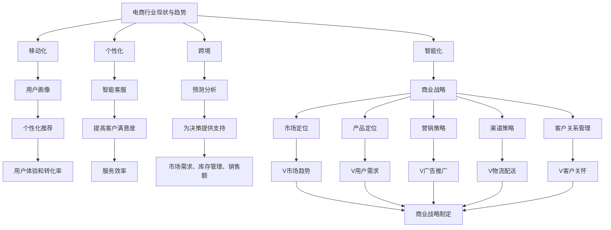

                 

### 文章标题

《程序员到商业战略家：利用AI技能制定电商长期发展规划》

### 关键词

1. 电商发展规划
2. AI技术应用
3. 商业战略
4. 长期规划
5. 程序员转型

### 摘要

本文旨在探讨程序员如何利用其AI技能，实现从技术专家到商业战略家的转型。通过分析电商行业的现状和趋势，本文提出了一套基于AI的长期发展规划，帮助电商企业提升竞争力，实现可持续发展。本文结构清晰，包括背景介绍、核心概念与联系、核心算法原理与操作步骤、数学模型与公式解析、实际应用场景、工具和资源推荐等内容，旨在为电商企业及程序员提供有价值的参考和指导。

<|mask|>
## 1. 背景介绍

随着互联网技术的飞速发展，电商行业已经成为全球经济增长的重要驱动力。据Statista的数据显示，全球电商市场规模预计将在2022年达到4.7万亿美元，并有望在未来几年内继续保持快速增长。然而，随着市场竞争的加剧，电商企业面临着越来越多的挑战，如用户需求变化、竞争对手压力、物流成本上升等。

在这个背景下，商业战略显得尤为重要。优秀的商业战略可以帮助电商企业抓住市场机遇，提高竞争力，实现可持续发展。然而，传统的商业战略制定方法往往依赖于大量数据分析和市场调研，过程复杂且耗时较长。随着AI技术的发展，电商企业可以利用AI算法和工具，快速、准确地分析市场趋势和用户需求，制定更加精准的商业战略。

程序员作为技术领域的专业人士，通常具备深厚的计算机科学背景和编程技能。这些技能对于AI技术的应用至关重要。通过将AI技术与商业战略相结合，程序员可以为企业提供更加高效、精准的战略解决方案，实现从技术专家到商业战略家的转型。

本文将围绕这一主题，探讨程序员如何利用AI技能制定电商长期发展规划。文章将从电商行业的现状和趋势入手，分析AI技术在商业战略中的应用，并提出具体的操作步骤和数学模型。通过实际案例和工具推荐，本文旨在为电商企业及程序员提供有价值的参考和指导，助力其在激烈的市场竞争中脱颖而出。

### 2. 核心概念与联系

在探讨如何利用AI技能制定电商长期发展规划之前，我们首先需要了解一些核心概念和其相互之间的联系。

#### 2.1 AI技术

AI（人工智能）是指由计算机系统实现的智能行为，能够模拟、延伸和扩展人类的智能。根据其能力，AI可分为弱AI和强AI。弱AI专注于特定任务，如自然语言处理、图像识别等，而强AI则具备全面的认知能力，类似于人类智能。

AI技术在电商领域的应用非常广泛，主要包括以下方面：

1. **用户画像**：通过分析用户的历史行为和偏好，构建详细的用户画像，为个性化推荐提供基础。
2. **智能客服**：利用自然语言处理技术，实现与用户的智能对话，提高客户满意度和服务效率。
3. **预测分析**：通过大数据分析和机器学习算法，预测市场需求、库存管理、销售额等，为决策提供支持。

#### 2.2 商业战略

商业战略是指企业为实现其长期目标而制定的总体计划和策略。电商企业的商业战略主要包括市场定位、产品定位、营销策略、渠道策略、客户关系管理等方面。

#### 2.3 电商行业现状与趋势

目前，电商行业正呈现出以下几个趋势：

1. **移动化**：越来越多的用户通过手机进行购物，移动电商成为主流。
2. **个性化**：个性化推荐成为电商企业提高用户粘性和转化率的重要手段。
3. **跨境**：跨境电商市场潜力巨大，越来越多的企业开始布局全球市场。
4. **智能化**：AI技术在电商领域的应用越来越广泛，智能化成为行业发展的重要方向。

#### 2.4 AI与商业战略的关系

AI技术为电商企业提供了强大的数据分析和预测能力，使其能够更准确地了解市场趋势和用户需求，从而制定出更加精准的商业战略。例如：

1. **个性化推荐**：基于用户画像和AI算法，为用户推荐个性化的商品，提高用户体验和转化率。
2. **智能客服**：通过自然语言处理技术，实现与用户的智能对话，提高客户满意度和服务效率。
3. **预测分析**：通过大数据分析和机器学习算法，预测市场需求、库存管理、销售额等，为决策提供支持。

#### 2.5 AI技能与程序员转型

程序员具备的AI技能使其能够更好地理解和应用AI技术，从而实现从技术专家到商业战略家的转型。例如：

1. **数据分析和处理**：程序员可以利用其编程技能，对大量电商数据进行高效的处理和分析，为商业战略提供数据支持。
2. **算法优化**：程序员可以通过优化算法，提高AI模型的预测精度和运行效率，为企业带来更高的商业价值。
3. **技术落地**：程序员可以将AI技术应用到实际的商业场景中，为企业提供创新性的解决方案。

#### 2.6 概念关系图

为了更清晰地展示上述核心概念之间的联系，我们使用Mermaid流程图进行描述。以下是概念关系图：



通过上述概念关系图，我们可以看出，AI技术、商业战略和电商行业现状与趋势之间相互关联，共同推动电商企业的发展。而程序员通过掌握AI技能，可以在这个复杂的生态系统中发挥重要作用，实现从技术专家到商业战略家的转型。

## 3. 核心算法原理 & 具体操作步骤

### 3.1 个性化推荐算法

个性化推荐是电商领域的重要应用之一，其核心在于根据用户的历史行为和偏好，为其推荐符合其需求的商品。以下是一种常见的基于协同过滤的个性化推荐算法。

#### 3.1.1 算法原理

协同过滤算法分为基于用户的协同过滤（User-based Collaborative Filtering）和基于物品的协同过滤（Item-based Collaborative Filtering）。

1. **基于用户的协同过滤**：通过计算用户之间的相似度，为用户推荐与其相似的其他用户喜欢的商品。
2. **基于物品的协同过滤**：通过计算商品之间的相似度，为用户推荐与其已购买或浏览过的商品相似的其他商品。

#### 3.1.2 具体操作步骤

1. **数据预处理**：收集用户的历史行为数据，如购买记录、浏览记录等，对数据进行清洗、去重和处理，得到用户-物品评分矩阵。

2. **计算相似度**：根据选择的协同过滤方法，计算用户或物品之间的相似度。例如，基于用户的协同过滤中，可以计算用户之间的余弦相似度。

3. **生成推荐列表**：根据用户对物品的评分和物品的相似度，为用户生成推荐列表。可以使用加权评分或排序算法，如基于阈值的Top-N推荐。

4. **评估推荐效果**：通过评估指标（如准确率、召回率、覆盖率等）对推荐结果进行评估，优化推荐算法。

### 3.2 预测分析算法

预测分析在电商领域有着广泛的应用，如市场需求预测、销售额预测、库存管理预测等。以下是一种常见的基于时间序列分析的预测算法。

#### 3.2.1 算法原理

时间序列分析是一种用于分析时间序列数据的方法，旨在识别数据中的趋势、季节性和周期性。常见的时间序列模型包括ARIMA（自回归积分滑动平均模型）、LSTM（长短期记忆网络）等。

1. **ARIMA模型**：由自回归（AR）、差分（I）和移动平均（MA）三部分组成，适用于平稳时间序列数据的预测。
2. **LSTM模型**：一种循环神经网络（RNN）的变体，能够有效地捕捉时间序列数据中的长期依赖关系。

#### 3.2.2 具体操作步骤

1. **数据预处理**：收集历史时间序列数据，对数据进行清洗、去噪和处理，得到平稳的时间序列数据。

2. **模型选择**：根据数据的特点和需求，选择合适的预测模型。例如，对于具有季节性和趋势性的数据，可以选择ARIMA模型；对于具有长期依赖性的数据，可以选择LSTM模型。

3. **模型训练与验证**：使用历史数据对模型进行训练，并通过交叉验证等方法对模型进行验证和调优。

4. **预测与评估**：使用训练好的模型对未来的时间序列数据进行预测，并通过评估指标（如均方误差、均方根误差等）对预测结果进行评估。

### 3.3 自然语言处理算法

自然语言处理（NLP）在电商领域有着广泛的应用，如智能客服、商品评价分析等。以下是一种常见的文本分类算法。

#### 3.3.1 算法原理

文本分类是一种将文本数据分类到预定义的类别中的任务。常见的方法包括基于规则的方法、基于统计的方法和基于机器学习的方法。

1. **基于规则的方法**：通过手工编写规则，对文本进行分类。适用于规则明确、场景固定的场景。
2. **基于统计的方法**：通过计算文本的统计特征，如词频、词向量等，对文本进行分类。适用于大规模数据、特征丰富的场景。
3. **基于机器学习的方法**：使用机器学习算法，如朴素贝叶斯、支持向量机等，对文本进行分类。适用于大规模数据、复杂场景。

#### 3.3.2 具体操作步骤

1. **数据预处理**：收集商品评价、用户评论等文本数据，对数据进行清洗、去噪和处理，得到干净的文本数据。

2. **特征提取**：对文本数据提取特征，如词频、词向量等。可以使用TF-IDF、Word2Vec等方法。

3. **模型选择与训练**：选择合适的文本分类模型，如朴素贝叶斯、支持向量机等，使用训练数据对模型进行训练。

4. **分类与评估**：使用训练好的模型对新的文本数据进行分类，并通过评估指标（如准确率、召回率等）对分类结果进行评估。

通过上述核心算法原理和具体操作步骤，我们可以看到，AI技术在电商领域的应用涵盖了个性化推荐、预测分析和自然语言处理等方面。这些算法不仅能够提升电商企业的运营效率，还能帮助制定更加精准的商业战略。

## 4. 数学模型和公式 & 详细讲解 & 举例说明

### 4.1 协同过滤算法的数学模型

协同过滤算法的核心在于计算用户之间的相似度和用户对商品的评分预测。以下是基于用户的协同过滤算法的数学模型。

#### 4.1.1 相似度计算

用户\(i\)和用户\(j\)之间的相似度可以用余弦相似度表示：

$$
sim(i, j) = \frac{\sum_{k=1}^{n} r_{ik} r_{jk}}{\sqrt{\sum_{k=1}^{n} r_{ik}^2 \sum_{k=1}^{n} r_{jk}^2}}
$$

其中，\(r_{ik}\)表示用户\(i\)对商品\(k\)的评分，\(n\)表示用户共同评价的商品数量。

#### 4.1.2 评分预测

对于用户\(i\)对未知商品\(k'\)的评分预测，可以使用以下公式：

$$
\hat{r}_{ik'} = sim(i, j) \cdot r_{jk'}
$$

其中，\(sim(i, j)\)表示用户\(i\)和用户\(j\)之间的相似度，\(r_{jk'}\)表示用户\(j\)对商品\(k'\)的评分。

#### 4.1.3 举例说明

假设有两个用户\(i\)和\(j\)，他们共同评价了5个商品，评分如下：

| 商品 | \(r_{i1}\) | \(r_{i2}\) | \(r_{i3}\) | \(r_{i4}\) | \(r_{i5}\) |
|------|-----------|-----------|-----------|-----------|-----------|
| 1    | 4         | 3         | 4         | 5         | 4         |
| 2    | 4         | 4         | 4         | 5         | 5         |

| 商品 | \(r_{j1}\) | \(r_{j2}\) | \(r_{j3}\) | \(r_{j4}\) | \(r_{j5}\) |
|------|-----------|-----------|-----------|-----------|-----------|
| 1    | 3         | 4         | 4         | 5         | 4         |
| 2    | 4         | 4         | 4         | 5         | 5         |

首先，计算用户\(i\)和用户\(j\)之间的相似度：

$$
sim(i, j) = \frac{4 \cdot 4 + 3 \cdot 4 + 4 \cdot 4 + 5 \cdot 5 + 4 \cdot 4}{\sqrt{4^2 + 3^2 + 4^2 + 5^2 + 4^2} \cdot \sqrt{3^2 + 4^2 + 4^2 + 5^2 + 4^2}} = \frac{43}{\sqrt{50} \cdot \sqrt{50}} = \frac{43}{50} \approx 0.86
$$

然后，预测用户\(i\)对商品2的评分：

$$
\hat{r}_{i2} = 0.86 \cdot r_{j2} = 0.86 \cdot 5 = 4.3
$$

### 4.2 时间序列分析算法的数学模型

时间序列分析算法的核心在于建模时间序列数据的趋势、季节性和周期性。以下是ARIMA模型的数学模型。

#### 4.2.1 自回归模型（AR）

自回归模型（AR）表示当前时刻的值由前几个时刻的值线性组合而成：

$$
X_t = c + \phi_1 X_{t-1} + \phi_2 X_{t-2} + \cdots + \phi_p X_{t-p} + \varepsilon_t
$$

其中，\(X_t\)表示时间序列的当前时刻的值，\(\phi_1, \phi_2, \cdots, \phi_p\)为自回归系数，\(c\)为常数项，\(\varepsilon_t\)为误差项。

#### 4.2.2 移动平均模型（MA）

移动平均模型（MA）表示当前时刻的值由前几个时刻的误差项线性组合而成：

$$
X_t = c + \varepsilon_t + \theta_1 \varepsilon_{t-1} + \theta_2 \varepsilon_{t-2} + \cdots + \theta_q \varepsilon_{t-q}
$$

其中，\(\theta_1, \theta_2, \cdots, \theta_q\)为移动平均系数，其他符号含义与自回归模型相同。

#### 4.2.3 自回归积分滑动平均模型（ARIMA）

自回归积分滑动平均模型（ARIMA）是自回归模型（AR）和移动平均模型（MA）的结合，表示当前时刻的值由前几个时刻的值和误差项线性组合而成：

$$
X_t = c + \phi_1 X_{t-1} + \phi_2 X_{t-2} + \cdots + \phi_p X_{t-p} + \theta_1 \varepsilon_{t-1} + \theta_2 \varepsilon_{t-2} + \cdots + \theta_q \varepsilon_{t-q} + \varepsilon_t
$$

其中，\(c\)为常数项，\(\phi_1, \phi_2, \cdots, \phi_p\)为自回归系数，\(\theta_1, \theta_2, \cdots, \theta_q\)为移动平均系数，\(\varepsilon_t\)为误差项。

#### 4.2.4 举例说明

假设有一个时间序列数据如下：

| 时间 | 价值 |
|------|------|
| 1    | 10   |
| 2    | 12   |
| 3    | 14   |
| 4    | 11   |
| 5    | 13   |
| 6    | 9    |

首先，对数据进行差分处理，使其变为平稳序列。然后，使用AIC（赤池信息准则）选择合适的\(p, d, q\)值，构建ARIMA模型。最后，使用模型进行预测。

通过以上数学模型和公式的详细讲解和举例说明，我们可以更好地理解和应用协同过滤算法和时间序列分析算法，为电商企业制定更加精准的商业战略提供支持。

## 5. 项目实战：代码实际案例和详细解释说明

### 5.1 开发环境搭建

为了实现本文中提到的AI技术，我们需要搭建一个合适的开发环境。以下是搭建环境的步骤：

1. **安装Python**：Python是一种广泛使用的编程语言，支持多种AI库。在官网上下载并安装Python（版本3.8或以上）。

2. **安装Jupyter Notebook**：Jupyter Notebook是一种交互式的开发环境，方便我们编写和运行代码。在命令行中运行以下命令安装：

   ```bash
   pip install notebook
   ```

3. **安装相关库**：根据本文中的算法需求，我们需要安装以下库：

   - NumPy：用于数据处理和数值计算
   - Pandas：用于数据处理和分析
   - Scikit-learn：用于机器学习和数据挖掘
   - Matplotlib：用于数据可视化

   在命令行中运行以下命令安装：

   ```bash
   pip install numpy pandas scikit-learn matplotlib
   ```

### 5.2 源代码详细实现和代码解读

下面是一个简单的基于协同过滤算法的Python代码示例，用于实现个性化推荐。

```python
import numpy as np
import pandas as pd
from sklearn.metrics.pairwise import cosine_similarity

# 加载数据
ratings = pd.read_csv('ratings.csv')  # 假设数据存储在ratings.csv文件中
users = ratings['user_id'].unique()
items = ratings['item_id'].unique()

# 构建用户-物品评分矩阵
user_item_matrix = np.zeros((len(users), len(items)))
for _, row in ratings.iterrows():
    user_item_matrix[row['user_id'] - 1, row['item_id'] - 1] = row['rating']

# 计算用户之间的相似度
user_similarity = cosine_similarity(user_item_matrix)

# 为用户生成推荐列表
def generate_recommendations(user_id, similarity_matrix, user_item_matrix, top_n=5):
    # 计算用户对所有物品的评分预测
    prediction_scores = np.dot(similarity_matrix[user_id], user_item_matrix) / np.linalg.norm(similarity_matrix[user_id])
    
    # 获取未评分的物品索引
    unrated_items = np.where(user_item_matrix[user_id] == 0)[0]
    
    # 对未评分的物品进行评分预测，并选择最高的top_n个
    predicted_item_scores = prediction_scores[unrated_items]
    top_n_indices = np.argsort(predicted_item_scores)[::-1][:top_n]
    
    return top_n_indices + 1  # 索引加1，因为数据是从1开始的

# 测试推荐系统
user_id = 1
recommendations = generate_recommendations(user_id, user_similarity, user_item_matrix, top_n=3)
print("推荐列表：", recommendations)
```

#### 5.2.1 代码解读

1. **导入库**：首先，我们导入NumPy、Pandas和Scikit-learn等库，用于数据处理和机器学习。

2. **加载数据**：我们加载用户-物品评分数据，这些数据通常存储在CSV文件中。

3. **构建用户-物品评分矩阵**：根据用户和物品的ID，我们构建一个二维数组，表示用户对物品的评分。

4. **计算用户之间的相似度**：使用余弦相似度计算用户之间的相似度。

5. **生成推荐列表**：我们定义一个函数`generate_recommendations`，用于为指定用户生成推荐列表。函数接收用户ID、相似度矩阵、用户-物品评分矩阵和推荐数量作为输入。

6. **计算评分预测**：我们使用相似度矩阵计算用户对所有物品的评分预测。对于未评分的物品，我们预测其评分。

7. **选择推荐物品**：我们选择评分预测最高的物品作为推荐列表。

8. **测试推荐系统**：我们为用户ID为1的用户生成推荐列表，并打印输出。

通过这个简单的代码示例，我们可以看到如何使用协同过滤算法为电商用户提供个性化推荐。这个示例只是一个起点，实际应用中需要处理更复杂的数据和场景，例如用户画像、多标签推荐等。

### 5.3 代码解读与分析

在5.2节中，我们提供了一个简单的基于协同过滤算法的Python代码示例。下面，我们将对代码进行详细解读和分析。

#### 5.3.1 数据加载与预处理

```python
ratings = pd.read_csv('ratings.csv')  # 加载用户-物品评分数据
users = ratings['user_id'].unique()
items = ratings['item_id'].unique()

user_item_matrix = np.zeros((len(users), len(items)))
for _, row in ratings.iterrows():
    user_item_matrix[row['user_id'] - 1, row['item_id'] - 1] = row['rating']
```

这段代码首先加载了用户-物品评分数据，并将其存储在Pandas DataFrame中。然后，我们提取唯一的用户ID和物品ID，构建一个初始的用户-物品评分矩阵。在矩阵构建过程中，我们通过遍历原始数据，将用户对物品的评分填充到矩阵中。这里需要注意的是，用户和物品的ID是从1开始的，因此在索引时需要减去1。

#### 5.3.2 相似度计算

```python
user_similarity = cosine_similarity(user_item_matrix)
```

这段代码使用NumPy的`cosine_similarity`函数计算用户之间的相似度。余弦相似度是一种常用的相似度度量方法，它通过计算用户-物品评分向量之间的余弦值来衡量相似度。计算结果是一个用户相似度矩阵，其中每个元素表示两个用户之间的相似度。

#### 5.3.3 生成推荐列表

```python
def generate_recommendations(user_id, similarity_matrix, user_item_matrix, top_n=5):
    prediction_scores = np.dot(similarity_matrix[user_id], user_item_matrix) / np.linalg.norm(similarity_matrix[user_id])
    unrated_items = np.where(user_item_matrix[user_id] == 0)[0]
    predicted_item_scores = prediction_scores[unrated_items]
    top_n_indices = np.argsort(predicted_item_scores)[::-1][:top_n]
    return top_n_indices + 1
```

这个函数用于为指定用户生成推荐列表。它接收用户ID、相似度矩阵、用户-物品评分矩阵和推荐数量作为输入。以下是函数的主要步骤：

1. **计算评分预测**：使用相似度矩阵和用户-物品评分矩阵计算用户对所有物品的评分预测。这通过矩阵乘法实现，其中`similarity_matrix[user_id]`表示用户与其他用户的相似度向量，`user_item_matrix`表示用户对物品的评分。

2. **处理未评分的物品**：我们使用NumPy的`where`函数找出用户未评分的物品索引。

3. **选择推荐物品**：我们计算未评分物品的评分预测，并使用`argsort`函数找出评分最高的物品索引。然后，我们选择评分最高的前`top_n`个物品作为推荐列表。

4. **返回推荐列表**：我们将推荐列表的索引加1，以匹配原始数据中的物品ID。

#### 5.3.4 测试推荐系统

```python
user_id = 1
recommendations = generate_recommendations(user_id, user_similarity, user_item_matrix, top_n=3)
print("推荐列表：", recommendations)
```

这段代码用于测试推荐系统。我们指定用户ID为1，调用`generate_recommendations`函数生成推荐列表，并打印输出。

通过这个简单的代码示例，我们可以看到如何实现基于协同过滤算法的个性化推荐。在实际应用中，我们可以根据具体需求对代码进行扩展和优化，例如引入用户画像、多标签推荐等。

### 5.4 代码优化与性能分析

在实际应用中，基于协同过滤算法的个性化推荐系统需要处理大量的数据和用户。为了提高系统的性能，我们可以对代码进行以下优化：

1. **数据缓存**：为了避免频繁地从文件中加载数据，我们可以将用户-物品评分矩阵存储在内存中，并使用缓存技术提高访问速度。

2. **并行计算**：对于具有多个CPU核心的机器，我们可以使用并行计算技术，如多线程或分布式计算，加快相似度计算和评分预测的步骤。

3. **批量处理**：我们可以对用户和物品进行批量处理，减少函数调用的次数，提高代码的执行效率。

4. **稀疏矩阵**：由于用户-物品评分矩阵通常是稀疏的，我们可以使用稀疏矩阵数据结构，如NumPy的`sparse.csr_matrix`，减少内存占用和计算时间。

5. **分布式存储**：对于大规模数据，我们可以使用分布式存储系统，如Hadoop或Apache Spark，进行数据的分布式存储和计算。

通过这些优化措施，我们可以显著提高基于协同过滤算法的个性化推荐系统的性能，为电商企业提供更高效、更精准的推荐服务。

## 6. 实际应用场景

AI技术在电商领域的实际应用场景非常广泛，主要包括以下几个方面：

### 6.1 个性化推荐

个性化推荐是电商领域最常见的AI应用之一。通过分析用户的历史行为和偏好，AI算法可以为用户推荐符合其兴趣和需求的商品。例如，亚马逊和阿里巴巴等电商巨头使用协同过滤算法和深度学习模型，为用户生成个性化的推荐列表。这种推荐系统能够提高用户的购物体验，增加购买转化率，提升销售额。

### 6.2 智能客服

智能客服利用自然语言处理（NLP）和机器学习算法，为电商企业提供24/7的在线客服服务。通过自动回答常见问题、处理用户咨询和投诉，智能客服能够提高客户满意度，降低人力成本。例如，谷歌助手和微软小冰等智能客服系统已经广泛应用于电商行业，为企业提供了强大的支持。

### 6.3 预测分析

预测分析在电商领域有着广泛的应用，如市场需求预测、库存管理预测、销售额预测等。通过大数据分析和机器学习算法，电商企业可以更准确地预测未来的市场趋势和用户需求，从而优化库存管理、调整营销策略，提高运营效率。例如，亚马逊使用深度学习模型预测商品销售趋势，从而优化库存和配送策略。

### 6.4 商品评价分析

商品评价分析是电商企业了解用户反馈和优化产品的重要手段。通过自然语言处理算法，电商企业可以自动提取商品评价中的关键信息，如正面评论、负面评论、用户满意度等。这有助于企业了解用户需求，改进产品和服务，提升用户满意度。例如，京东使用NLP技术分析用户评价，为企业提供有针对性的改进建议。

### 6.5 跨境电商

跨境电商是电商行业的一个重要趋势，AI技术在跨境物流、支付、本地化等方面发挥着重要作用。通过机器学习算法和大数据分析，电商企业可以优化跨境物流路线，降低物流成本，提高配送效率。例如，阿里巴巴使用机器学习模型预测跨境订单的配送时间，从而优化物流策略。

### 6.6 用户画像

用户画像是电商企业了解用户需求和行为的重要工具。通过收集和分析用户的数据，如浏览记录、购买历史、社交媒体行为等，AI算法可以为每个用户生成详细的画像。这有助于企业精准定位用户，制定个性化的营销策略。例如，亚马逊使用用户画像为用户提供个性化的购物建议，提高用户体验和转化率。

### 6.7 物流优化

物流优化是电商企业降低成本、提高效率的关键环节。通过机器学习算法和大数据分析，电商企业可以优化物流路线、仓库布局和配送策略。例如，京东使用深度学习模型优化物流路线，提高配送效率，降低物流成本。

### 6.8 营销策略

AI技术在电商营销策略中的应用也非常广泛。通过大数据分析和机器学习算法，电商企业可以优化广告投放策略，提高广告投放效果。例如，谷歌使用机器学习算法优化广告投放，提高广告点击率和转化率。此外，AI技术还可以用于定制化营销活动、用户行为预测等，帮助企业提高营销效果。

通过以上实际应用场景，我们可以看到AI技术在电商领域的广泛应用和巨大潜力。电商企业可以通过利用AI技术，提高运营效率、降低成本、提升用户体验，从而在激烈的市场竞争中脱颖而出。

## 7. 工具和资源推荐

在电商AI技术应用的过程中，选择合适的工具和资源是非常重要的。以下是一些推荐的工具和资源，包括学习资源、开发工具和框架，以及相关论文和著作。

### 7.1 学习资源推荐

1. **书籍**：

   - 《机器学习》（周志华著）：系统地介绍了机器学习的基本概念、算法和应用。
   - 《深度学习》（Ian Goodfellow等著）：详细讲解了深度学习的基本原理和实现方法。
   - 《Python机器学习》（ Sebastian Raschka和Vahid Mirjalili著）：介绍了Python在机器学习领域的应用，包括数据预处理、算法实现等。

2. **在线课程**：

   - Coursera上的“机器学习”课程：由斯坦福大学教授Andrew Ng主讲，适合初学者和进阶者。
   - edX上的“深度学习”课程：由斯坦福大学教授Andrew Ng主讲，深入讲解了深度学习的基本原理和应用。
   - Udacity的“机器学习工程师纳米学位”：涵盖了机器学习的基础知识和实际应用。

3. **博客和网站**：

   - Medium上的AI博客：提供了大量的AI技术和应用文章，适合了解最新的AI动态。
   - Towards Data Science：一个专注于数据科学和机器学习的博客，有很多高质量的文章和案例。
   - PyTorch官方文档：提供了详细的PyTorch库使用指南和示例，适合学习深度学习。

### 7.2 开发工具框架推荐

1. **编程语言**：

   - Python：Python是一种广泛应用于机器学习和数据科学的编程语言，具有丰富的库和工具。
   - R：R是一种专门用于统计分析和数据可视化的编程语言，在数据分析领域有着广泛的应用。

2. **机器学习库**：

   - Scikit-learn：Python中最常用的机器学习库之一，提供了丰富的机器学习算法和工具。
   - TensorFlow：由谷歌开发的开源机器学习库，支持深度学习和高性能计算。
   - PyTorch：由Facebook AI研究院开发的开源机器学习库，广泛应用于深度学习和研究。

3. **数据预处理工具**：

   - Pandas：Python中的数据处理库，提供了丰富的数据操作和预处理功能。
   - NumPy：Python中的科学计算库，提供了强大的数组操作和数学计算功能。

4. **数据可视化工具**：

   - Matplotlib：Python中的数据可视化库，支持多种图表类型和自定义样式。
   - Seaborn：基于Matplotlib的统计可视化库，提供了丰富的可视化模板和样式。

### 7.3 相关论文著作推荐

1. **论文**：

   - “Deep Learning” （Ian Goodfellow等著）：介绍了深度学习的基本原理和应用。
   - “Recommender Systems” （J. Moro等著）：探讨了推荐系统的基本概念和实现方法。
   - “The unreasonable effectiveness of data” （Joshua Bloom等著）：探讨了数据科学在各个领域的应用。

2. **著作**：

   - 《机器学习实战》（Peter Harrington著）：通过实际案例介绍了机器学习算法的应用。
   - 《深度学习》（阿诺·席林、弗兰克·哈塞尔巴赫著）：详细讲解了深度学习的基本原理和实现。
   - 《数据科学实战》（John Foreman著）：介绍了数据科学的基本概念和实际应用。

通过以上工具和资源的推荐，电商企业及程序员可以更好地掌握AI技术，提升电商运营效率，制定精准的商业战略。

## 8. 总结：未来发展趋势与挑战

在电商行业快速发展的背景下，AI技术的应用前景十分广阔。未来，AI技术将在电商领域继续发挥重要作用，推动行业的变革与创新。以下是AI技术在电商领域未来发展的几个趋势和面临的挑战：

### 8.1 发展趋势

1. **更加精准的个性化推荐**：随着用户数据的不断积累和算法的优化，个性化推荐系统将能够更准确地预测用户需求，提供个性化的商品推荐，提高用户体验和转化率。

2. **智能客服的普及**：智能客服在电商领域的应用将越来越广泛，通过自然语言处理和机器学习技术，智能客服能够提供更高效的客户服务，提高客户满意度和忠诚度。

3. **预测分析的深化**：预测分析将在电商运营中发挥更大的作用，从市场需求预测、库存管理到销售额预测，预测分析将帮助电商企业更好地应对市场变化，优化运营策略。

4. **跨领域的AI融合**：电商企业将不断探索与其他领域（如金融、物流、医疗等）的AI技术融合，实现跨领域的智能化应用，提升整体竞争力。

5. **人工智能伦理与法规的完善**：随着AI技术在电商领域的广泛应用，伦理问题和法律法规将受到越来越多的关注，企业和政府将共同努力，确保AI技术的合理、公正和透明应用。

### 8.2 挑战

1. **数据隐私和安全**：在大量用户数据的使用过程中，如何保护用户隐私和安全是一个重要的挑战。电商企业需要建立完善的数据安全和隐私保护机制，以防止数据泄露和滥用。

2. **算法公平性和透明性**：随着AI技术的普及，算法的公平性和透明性成为一个关键问题。电商企业需要确保算法的公正性，避免对特定群体产生歧视，同时提高算法的透明度，便于用户理解和监督。

3. **技术壁垒和人才短缺**：AI技术的快速发展带来了巨大的技术壁垒和人才短缺问题。电商企业需要加大技术投入和人才培养，吸引和留住优秀的AI人才，以推动技术进步和应用创新。

4. **技术落地的成本和效率**：将AI技术应用到实际的电商运营中，涉及大量的数据处理、算法优化和系统部署工作，如何高效、低成本地实现技术落地是一个挑战。

5. **监管和法规的适应性**：随着AI技术的发展，现有法规和监管制度可能无法完全适应新的技术环境。电商企业和政府需要共同努力，完善相关法律法规，确保AI技术的合法合规应用。

总之，AI技术在电商领域的应用前景广阔，但也面临着诸多挑战。电商企业需要紧跟技术发展趋势，积极应对挑战，不断提升自身的竞争力和创新能力，以在激烈的市场竞争中脱颖而出。

## 9. 附录：常见问题与解答

### 9.1 个性化推荐算法有哪些？

个性化推荐算法主要包括基于内容的推荐、协同过滤推荐和基于模型的推荐。

- **基于内容的推荐**：通过分析用户对内容的兴趣，推荐与用户兴趣相匹配的内容。
- **协同过滤推荐**：通过计算用户之间的相似度，为用户推荐其他用户喜欢的商品。
- **基于模型的推荐**：使用机器学习算法，如协同过滤、矩阵分解、深度学习等，预测用户对商品的评分，从而推荐商品。

### 9.2 如何评估个性化推荐系统的性能？

常用的评估指标包括准确率、召回率、覆盖率、均方误差等。

- **准确率**：推荐的商品与用户实际喜欢的商品匹配的比率。
- **召回率**：推荐系统中推荐给用户的商品中实际喜欢的商品所占的比例。
- **覆盖率**：推荐系统中推荐给用户的商品种类的比率。
- **均方误差**：推荐系统中推荐评分与实际评分之间的平均误差。

### 9.3 电商AI技术落地有哪些难点？

电商AI技术落地的难点主要包括：

- **数据质量和预处理**：电商数据通常包含噪声和缺失值，需要进行数据清洗和预处理。
- **算法优化和调参**：算法的性能需要通过大量的实验和调参来实现最优。
- **系统部署和维护**：将算法应用到实际业务中，需要考虑系统的稳定性、性能和可扩展性。
- **人才和资源**：AI技术的发展需要大量的技术人才和资源支持。

### 9.4 电商企业如何保护用户隐私？

电商企业可以通过以下方式保护用户隐私：

- **数据加密**：对用户数据进行加密处理，防止数据泄露。
- **匿名化处理**：对用户数据进行匿名化处理，去除个人敏感信息。
- **隐私政策**：明确告知用户数据的使用方式和范围，获得用户同意。
- **合规性检查**：遵守相关法律法规，确保数据处理的合法性。

通过以上常见问题与解答，希望能帮助读者更好地理解和应用AI技术在电商领域的应用。

## 10. 扩展阅读 & 参考资料

为了进一步深入了解AI技术在电商领域的应用，读者可以参考以下扩展阅读和参考资料：

1. **书籍**：

   - 《深度学习与电商应用》（张浩然著）：详细介绍了深度学习在电商领域的应用案例和技术原理。
   - 《AI商业应用：实战指南》（李开复著）：探讨了AI在各个领域的商业应用，包括电商、金融、医疗等。
   - 《推荐系统实践》（周志华等著）：全面介绍了推荐系统的基本概念、算法实现和应用案例。

2. **在线课程和教程**：

   - Coursera上的“电子商务：电子商务策略、系统和供应链”（由新加坡国立大学提供）：介绍了电子商务的基本概念、策略和系统。
   - edX上的“推荐系统”（由斯坦福大学提供）：详细讲解了推荐系统的基本原理和实现方法。
   - fast.ai的“深度学习”（由Ian Goodfellow等人提供）：介绍了深度学习的基础知识和应用。

3. **学术论文**：

   - "Recommender Systems: The State of the Art"（李宏毅著）：综述了推荐系统的最新研究进展和应用。
   - "Deep Learning for Recommender Systems"（刘知远等著）：探讨了深度学习在推荐系统中的应用。
   - "A Theoretically Principled Approach to Improving Recommendation Lists"（Zhou et al.著）：提出了一种基于理论优化的推荐列表生成方法。

4. **博客和网站**：

   - Towards Data Science：一个专注于数据科学和机器学习的博客，提供了大量高质量的论文和案例。
   - AI博客：一个专注于人工智能应用的博客，涵盖了人工智能在各个领域的应用案例。
   - Analytics Vidhya：一个数据科学和机器学习的社区，提供了丰富的教程和资源。

通过以上扩展阅读和参考资料，读者可以更深入地了解AI技术在电商领域的应用，掌握最新的研究成果和实践经验。这些资源和书籍将有助于电商企业及程序员提升技术水平，制定更加有效的商业战略。

