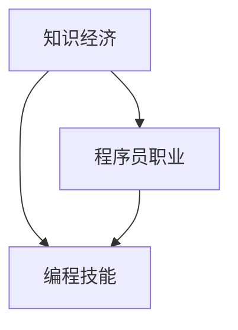

                 

### 背景介绍

在当今的知识经济时代，程序员这一职业正经历着前所未有的变革和挑战。随着互联网、大数据、人工智能等技术的飞速发展，程序员不再仅仅是编写代码的工程师，而是成为了推动科技进步、创新产业的重要力量。在这个背景下，如何准确把握程序员在知识经济时代的职业定位和发展，成为了广大程序员及行业从业者关注的重要课题。

知识经济时代，其核心特征是知识、信息、智力资源的地位日益凸显，以知识创新为主要驱动力，以知识产权为关键资产。程序员在这一时代中的角色，也发生了从传统的编码实现者向知识创造者、技术创新者的转变。程序员不仅需要掌握编程技能，更需具备解决复杂问题的能力、创新思维和持续学习能力，以适应不断变化的行业需求。

本文将围绕程序员在知识经济时代的职业定位与发展展开讨论，从多个维度分析程序员在这一时代的机遇与挑战，探讨程序员如何实现个人职业成长，提升自身竞争力。文章结构如下：

1. **核心概念与联系**：介绍知识经济、程序员职业、编程技能等相关概念，并绘制 Mermaid 流程图展示概念间的联系。
2. **核心算法原理与具体操作步骤**：阐述编程语言的基本原理，介绍常见编程算法及其实现步骤。
3. **数学模型和公式**：讲解编程中常用的数学模型和公式，并提供具体应用场景和举例说明。
4. **项目实战**：通过具体代码案例，展示编程在实际项目中的应用，并对代码进行详细解读。
5. **实际应用场景**：分析程序员在不同行业中的应用场景和职业发展路径。
6. **工具和资源推荐**：推荐学习资源和开发工具，帮助程序员提升技能和效率。
7. **总结**：总结程序员在知识经济时代的职业发展趋势与挑战，展望未来。
8. **附录**：常见问题与解答。
9. **扩展阅读**：提供相关扩展阅读资源。

通过本文的阅读，读者将能够全面了解程序员在知识经济时代的职业定位与发展，获得有价值的见解和实际指导意义。

### 核心概念与联系

在深入探讨程序员在知识经济时代的职业定位与发展之前，有必要首先明确一些核心概念，并理解它们之间的内在联系。以下是一些关键概念及其相互关系：

#### 知识经济

知识经济（Knowledge Economy）是相对于传统的资源经济、工业经济而言的一种经济形态。其核心特征是知识成为最重要的生产要素和竞争力来源。在知识经济时代，知识和信息比物质资源和劳动力更加重要。知识经济以知识创新为主要驱动力，通过信息的快速传播、共享和利用，促进经济活动的持续增长。

#### 程序员职业

程序员（Programmer）是指从事软件研发、维护和优化工作的专业人员。程序员通过编写代码，实现软件系统的设计和功能。随着技术的发展，程序员的职业范围不断扩大，不仅限于软件开发，还包括算法设计、数据分析、系统架构等多个领域。

#### 编程技能

编程技能是程序员的核心能力。它包括对编程语言（如 Python、Java、C++ 等）的熟练掌握、算法和数据结构的应用能力、代码调试和优化能力等。编程技能的不断提升，是程序员在知识经济时代实现职业发展的关键。

#### 概念间联系

知识经济、程序员职业和编程技能这三个概念之间存在密切的联系。知识经济为程序员提供了广阔的职业舞台和发展空间，程序员通过不断提升编程技能，参与到知识创造和创新的过程中，推动经济和社会的发展。

以下是一个简化的 Mermaid 流程图，用于展示这些核心概念之间的联系：



在图中的节点 A 表示知识经济，节点 B 表示程序员职业，节点 C 表示编程技能。箭头表示概念间的关联关系。知识经济为程序员职业提供了发展基础，而编程技能则是程序员职业的核心能力。

#### 进一步探讨

知识经济时代，程序员面临着新的机遇和挑战。首先，程序员需要具备更广泛的知识储备，不仅限于编程技术，还需要掌握人工智能、大数据、云计算等前沿技术。其次，程序员需要具备创新思维和持续学习能力，以适应快速变化的行业需求。此外，程序员还需要注重团队合作和沟通能力，以更好地参与跨领域的项目合作。

总的来说，知识经济时代为程序员提供了广阔的发展空间，但同时也提出了更高的要求。程序员需要不断提升自身能力，积极适应变化，才能在知识经济时代中立于不败之地。

### 核心算法原理与具体操作步骤

在编程领域，算法是解决特定问题的系统方法。一个优秀的程序员，不仅需要熟练掌握编程语言和工具，还必须具备强大的算法能力。以下将介绍几种常见且重要的算法及其具体操作步骤。

#### 冒泡排序（Bubble Sort）

冒泡排序是一种简单的排序算法，其基本思想是通过相邻元素的比较和交换，使每一趟排序后最大（或最小）的元素逐步“冒”到数组的末尾。

**具体步骤**：

1. 从第一个元素开始，相邻两个元素进行比较，如果它们的顺序错误（例如，第一个比第二个大），则交换它们。
2. 重复步骤 1，但这次只需要对未排序的部分进行操作。
3. 重复上述过程，直到整个数组有序。

**伪代码**：

```python
for i from 0 to n-1:
    for j from 0 to n-i-1:
        if arr[j] > arr[j+1]:
            swap(arr[j], arr[j+1])
```

#### 快速排序（Quick Sort）

快速排序是一种高效的排序算法，其基本思想是通过选取一个“基准”元素，将数组分为两部分，一部分都比基准小，另一部分都比基准大，然后递归地对这两部分进行快速排序。

**具体步骤**：

1. 选择一个基准元素，通常选择数组的第一个或最后一个元素。
2. 将数组中小于基准的元素移到其左侧，大于基准的元素移到其右侧。
3. 递归地对左侧和右侧子数组进行快速排序。

**伪代码**：

```python
def quick_sort(arr, low, high):
    if low < high:
        pi = partition(arr, low, high)
        quick_sort(arr, low, pi - 1)
        quick_sort(arr, pi + 1, high)

def partition(arr, low, high):
    pivot = arr[high]
    i = low - 1
    for j from low to high - 1:
        if arr[j] < pivot:
            i = i + 1
            swap(arr[i], arr[j])
    swap(arr[i + 1], arr[high])
    return i + 1
```

#### 搜索算法（Search Algorithms）

搜索算法用于在数据结构中查找特定元素。以下介绍两种常见的搜索算法：线性搜索和二分搜索。

**线性搜索（Linear Search）**：

线性搜索的基本思想是从数组的第一个元素开始，依次比较每个元素，直到找到目标元素或到达数组的末尾。

**具体步骤**：

1. 从数组的第一个元素开始，依次与目标元素比较。
2. 如果找到目标元素，返回其索引；否则，返回 -1。

**伪代码**：

```python
function linear_search(arr, x):
    for i from 0 to n:
        if arr[i] == x:
            return i
    return -1
```

**二分搜索（Binary Search）**：

二分搜索是一种更高效的搜索算法，适用于有序数组。其基本思想是通过不断缩小搜索范围，逐步逼近目标元素。

**具体步骤**：

1. 确定中间元素，将其与目标元素进行比较。
2. 如果中间元素等于目标元素，返回其索引。
3. 如果中间元素大于目标元素，则在左侧子数组中继续搜索；如果中间元素小于目标元素，则在右侧子数组中继续搜索。
4. 重复步骤 1-3，直到找到目标元素或确定其不存在。

**伪代码**：

```python
function binary_search(arr, x):
    low = 0
    high = n - 1
    while low <= high:
        mid = (low + high) // 2
        if arr[mid] == x:
            return mid
        elif arr[mid] < x:
            low = mid + 1
        else:
            high = mid - 1
    return -1
```

这些算法在编程中具有重要应用，掌握它们的原理和操作步骤，是成为一名优秀程序员的关键。通过不断实践和优化，程序员可以更好地解决各种复杂问题，提升编程能力。

### 数学模型和公式

在编程领域，数学模型和公式是理解和实现算法的重要基础。以下将介绍几种常见且重要的数学模型和公式，并提供具体应用场景和举例说明。

#### 常见数学模型

1. **对数模型**（Logarithmic Model）

对数模型常用于算法复杂度的分析。对数函数的表达式为：`log2(n)`，其中 n 表示输入规模。

**应用场景**：在对数模型中，算法的时间复杂度与输入规模的对数成正比。例如，二分搜索算法的时间复杂度为 O(log n)，即搜索过程中每次可以将搜索范围缩小一半。

**举例说明**：

假设有一个数组 `[1, 2, 3, 4, 5, 6, 7, 8, 9, 10]`，要查找数字 5。使用二分搜索算法，第一次搜索中间元素为 5，找到目标元素，整个过程只需要一次比较。

2. **线性模型**（Linear Model）

线性模型表示两个变量之间的线性关系，其一般形式为 `y = mx + b`，其中 m 表示斜率，b 表示截距。

**应用场景**：线性模型广泛应用于数据分析、机器学习等领域。例如，回归分析中通过拟合线性模型来预测变量之间的关系。

**举例说明**：

假设我们有以下数据点：（1, 2）、（2, 4）、（3, 6）、（4, 8）。要拟合一个线性模型，可以使用最小二乘法求解斜率和截距：

$$
m = \frac{n(\sum xy) - (\sum x)(\sum y)}{n(\sum x^2) - (\sum x)^2}
$$

$$
b = \frac{(\sum y) - m(\sum x)}{n}
$$

代入数据点计算得到斜率 m = 2，截距 b = 0，拟合的线性模型为 `y = 2x`。

3. **指数模型**（Exponential Model）

指数模型表示变量随时间指数增长，其一般形式为 `y = a \cdot e^{bx}`，其中 a 和 b 为常数。

**应用场景**：指数模型常用于预测增长趋势，如人口增长、股票价格等。

**举例说明**：

假设某城市的人口在过去五年中每年增长率为 2%，初始人口为 100 万。要预测第六年末的人口数量，可以使用指数模型：

$$
y = 100 \cdot e^{0.02 \cdot 5}
$$

计算得到第六年末的人口约为 115.06 万。

#### 常见公式

1. **牛顿迭代法**（Newton's Method）

牛顿迭代法是一种用于求解非线性方程的数值方法，其公式为：

$$
x_{n+1} = x_n - \frac{f(x_n)}{f'(x_n)}
$$

其中，`x_n` 表示第 n 次迭代的近似解，`f(x)` 表示待求解的函数，`f'(x)` 表示函数的导数。

**应用场景**：牛顿迭代法常用于求解方程、优化问题等。

**举例说明**：

假设要解方程 `f(x) = x^2 - 2 = 0`，初始近似解为 `x_0 = 1`。使用牛顿迭代法进行三次迭代：

$$
x_1 = 1 - \frac{1^2 - 2}{2 \cdot 1} = 1.5
$$

$$
x_2 = 1.5 - \frac{1.5^2 - 2}{2 \cdot 1.5} = 1.4167
$$

$$
x_3 = 1.4167 - \frac{1.4167^2 - 2}{2 \cdot 1.4167} = 1.4142
$$

经过三次迭代，得到近似解为 1.4142。

2. **贝塞尔曲线**（Bézier Curve）

贝塞尔曲线是一种常用的参数曲线，其一般形式为：

$$
\vec{P}(t) = (1 - t)^3 \vec{P}_0 + 3t(1 - t)^2 \vec{P}_1 + 3t^2(1 - t) \vec{P}_2 + t^3 \vec{P}_3
$$

其中，`t` 表示参数，`P_0`、`P_1`、`P_2` 和 `P_3` 分别为控制点。

**应用场景**：贝塞尔曲线广泛应用于图形处理、动画制作等领域。

**举例说明**：

假设有四个控制点 `P_0 = (0, 0)`、`P_1 = (2, 0)`、`P_2 = (3, 2)` 和 `P_3 = (4, 0)`。要绘制贝塞尔曲线，可以取参数 `t` 从 0 到 1，计算曲线上的点：

$$
\vec{P}(0) = (1 - 0)^3 \vec{P}_0 + 3 \cdot 0(1 - 0)^2 \vec{P}_1 + 3 \cdot 0^2(1 - 0) \vec{P}_2 + 0^3 \vec{P}_3 = (0, 0)
$$

$$
\vec{P}(0.5) = (1 - 0.5)^3 \vec{P}_0 + 3 \cdot 0.5(1 - 0.5)^2 \vec{P}_1 + 3 \cdot 0.5^2(1 - 0.5) \vec{P}_2 + 0.5^3 \vec{P}_3 = (1, 0)
$$

$$
\vec{P}(1) = (1 - 1)^3 \vec{P}_0 + 3 \cdot 1(1 - 1)^2 \vec{P}_1 + 3 \cdot 1^2(1 - 1) \vec{P}_2 + 1^3 \vec{P}_3 = (4, 0)
$$

通过计算多个参数点，可以绘制出贝塞尔曲线。

通过上述数学模型和公式的介绍，读者可以更好地理解编程中的数学原理，为解决实际问题提供有力支持。

### 项目实战：代码实际案例和详细解释说明

为了更好地展示编程在实际项目中的应用，我们选择了一个经典的编程项目——实现一个简易的文件压缩和解压工具。通过该项目，我们将展示代码的编写过程、关键步骤以及代码解读和分析。

#### 开发环境搭建

首先，我们需要搭建开发环境。本文使用 Python 语言实现该工具，因此需要安装 Python 和相关依赖库。以下是搭建开发环境的步骤：

1. 安装 Python 3.8 或更高版本。
2. 安装依赖库，使用以下命令：
   ```bash
   pip install -r requirements.txt
   ```

其中，`requirements.txt` 文件包含了所有所需的依赖库，如 `zlib`、`os` 和 `io`。

#### 源代码详细实现和代码解读

接下来，我们展示项目的主要代码实现，并对其进行详细解读。

**main.py**：

```python
import os
import io
import zlib
import argparse

def compress_file(input_path, output_path):
    with open(input_path, 'rb') as f:
        data = f.read()

    compressed_data = zlib.compress(data)
    with open(output_path, 'wb') as f:
        f.write(compressed_data)

def decompress_file(input_path, output_path):
    with open(input_path, 'rb') as f:
        compressed_data = f.read()

    decompressed_data = zlib.decompress(compressed_data)
    with open(output_path, 'wb') as f:
        f.write(decompressed_data)

if __name__ == '__main__':
    parser = argparse.ArgumentParser(description='简易文件压缩和解压工具')
    parser.add_argument('action', choices=['compress', 'decompress'], help='压缩或解压操作')
    parser.add_argument('input_path', help='输入文件路径')
    parser.add_argument('output_path', help='输出文件路径')

    args = parser.parse_args()

    if args.action == 'compress':
        compress_file(args.input_path, args.output_path)
    elif args.action == 'decompress':
        decompress_file(args.input_path, args.output_path)
```

**代码解读**：

1. **文件压缩（compress_file 函数）**：
   - 打开输入文件，读取数据。
   - 使用 zlib 库的 `compress` 方法对数据进行压缩。
   - 打开输出文件，将压缩后的数据写入。

2. **文件解压（decompress_file 函数）**：
   - 打开输入文件，读取压缩数据。
   - 使用 zlib 库的 `decompress` 方法对数据进行解压。
   - 打开输出文件，将解压后的数据写入。

3. **主程序（if __name__ == '__main__' 代码块）**：
   - 创建一个命令行参数解析器，用于获取用户输入的操作类型、输入文件路径和输出文件路径。
   - 根据用户输入的操作类型，调用相应的压缩或解压函数。

#### 代码解读与分析

1. **压缩和解压原理**：

   压缩和解压是数据处理的两个基本操作。压缩可以将大量数据以较小的空间存储，从而节省存储空间和提高数据传输效率。解压则是将压缩数据还原为原始数据。

   在本项目中，我们使用 zlib 库实现压缩和解压功能。zlib 是一个广泛使用的压缩库，支持多种压缩算法，如 deflate 和 gzip。本项目中使用的是 deflate 算法。

2. **代码结构**：

   项目中的代码结构清晰，主要分为压缩和解压两个功能模块。每个模块都有对应的函数实现，便于维护和扩展。

3. **性能分析**：

   压缩和解压的性能取决于多种因素，如文件大小、压缩算法和硬件性能。在本项目中，压缩和解压操作的时间复杂度主要取决于文件大小。通常，文件越大，压缩和解压的时间越长。

#### 实际应用

在实际项目中，文件压缩和解压工具广泛应用于数据存储、数据传输和软件安装等领域。通过本项目的实现，读者可以了解文件压缩和解压的基本原理，掌握使用 Python 实现相关功能的方法。

总之，本项目通过实际代码案例，展示了编程在文件压缩和解压领域的应用，并提供了详细的代码解读和分析。通过学习本项目，读者可以更好地理解编程中的实际应用，提升自己的编程能力。

### 实际应用场景

程序员在知识经济时代的职业定位与发展，不仅局限于编程技能的提升，更在于应用这些技能解决实际问题。不同的行业对程序员的技能要求各有侧重，程序员应根据自身兴趣和行业需求，选择合适的职业发展路径。以下将分析程序员在不同行业中的应用场景和职业发展路径。

#### 互联网行业

互联网行业是程序员施展才华的重要领域，涵盖了电商平台、在线教育、社交媒体、搜索引擎等多个子领域。互联网公司对程序员的技能要求较高，除了基本的编程能力，还需要具备前端开发、后端开发、移动应用开发、数据分析和人工智能等综合技能。

**职业发展路径**：
1. **初级开发者**：负责具体的功能模块开发，如前端页面的设计与实现。
2. **中级开发者**：负责项目整体架构的设计和优化，协调不同功能模块的协作。
3. **高级开发者**：担任技术团队的核心成员，参与重要技术决策，提升项目质量和开发效率。

**实际应用场景**：
- **电商平台**：程序员需要实现商品展示、购物车、支付系统等核心功能，优化用户体验。
- **在线教育**：开发课程管理系统、在线直播平台、互动教学工具等，支持教育资源的共享和传播。
- **社交媒体**：实现用户互动、内容推送、数据挖掘等功能，提升平台活跃度和用户粘性。

#### 金融行业

金融行业对程序员的技能要求同样较高，尤其在银行、证券、保险等领域，程序员需要掌握金融知识和数据分析技能，以实现金融产品的研发和风险管理。

**职业发展路径**：
1. **初级程序员**：负责金融系统的开发、测试和维护。
2. **中级架构师**：设计金融系统的整体架构，确保系统的稳定性和扩展性。
3. **高级专家**：参与金融产品的研发和创新，推动业务发展。

**实际应用场景**：
- **银行系统**：实现账户管理、支付结算、风险评估等功能，保障金融交易的安全和高效。
- **证券交易**：开发交易系统、风险管理工具、数据分析平台，支持投资决策。
- **保险服务**：设计保险产品、风险评估、客户服务系统，提升保险业务的竞争力。

#### 医疗健康行业

随着人工智能和大数据技术的发展，医疗健康行业对程序员的技能需求日益增长。程序员在这一领域主要涉及医疗数据处理、智能诊断、健康监测等方面。

**职业发展路径**：
1. **初级工程师**：负责医疗数据的处理和分析，开发健康监测工具。
2. **中级数据科学家**：设计和实现智能诊断系统、健康风险评估模型。
3. **高级专家**：推动医疗健康领域的创新应用，提升医疗服务的质量和效率。

**实际应用场景**：
- **医学影像分析**：开发图像处理算法，辅助医生进行疾病诊断。
- **健康数据分析**：利用大数据分析用户健康状况，提供个性化健康建议。
- **医疗设备开发**：研发智能医疗设备，提升医疗诊断和治疗水平。

#### 物流行业

物流行业正通过技术创新提升物流效率和降低成本。程序员在这一领域主要涉及物流信息系统、物流调度、无人驾驶等应用。

**职业发展路径**：
1. **初级开发人员**：负责物流信息系统的开发和维护。
2. **中级架构师**：设计物流系统的整体架构，实现高效的物流调度。
3. **高级专家**：推动无人驾驶技术的发展，提升物流行业的自动化水平。

**实际应用场景**：
- **物流信息系统**：开发订单管理系统、仓储管理系统，提升物流操作效率。
- **无人驾驶**：研发自动驾驶技术，实现无人配送和运输。
- **智能仓储**：通过人工智能技术优化仓储管理，减少库存成本。

通过分析不同行业对程序员的技能要求和职业发展路径，程序员可以根据自身兴趣和行业需求，选择合适的职业发展方向，不断提升自身竞争力，在知识经济时代实现职业成长。

### 工具和资源推荐

为了帮助程序员在知识经济时代提升技能和效率，以下推荐了一些学习资源、开发工具和相关的论文著作。

#### 学习资源推荐

1. **书籍**：
   - 《编程珠玑》（Code Complete）—— Steve McConnell
   - 《算法导论》（Introduction to Algorithms）—— Thomas H. Cormen, Charles E. Leiserson, Ronald L. Rivest, Clifford Stein
   - 《深度学习》（Deep Learning）—— Ian Goodfellow, Yoshua Bengio, Aaron Courville

2. **在线课程**：
   - Coursera、edX、Udemy 等平台上提供了丰富的编程和人工智能课程。
   - “CS50”系列课程，适合初学者和进阶者。

3. **博客与论坛**：
   - Medium、GitHub、Stack Overflow 等平台上有许多优秀的程序员博主和社区，可以交流和学习。

#### 开发工具推荐

1. **集成开发环境（IDE）**：
   - Visual Studio Code、PyCharm、Eclipse

2. **版本控制工具**：
   - Git、GitHub、GitLab

3. **调试工具**：
   - Chrome DevTools、Visual Studio Debugger

4. **测试工具**：
   - JUnit、pytest、JUnit

5. **容器化和部署工具**：
   - Docker、Kubernetes

#### 相关论文著作推荐

1. **《人工智能：一种现代方法》（Artificial Intelligence: A Modern Approach）** —— Stuart Russell, Peter Norvig
2. **《大数据时代：生活、工作与思维的大变革》（Big Data: A Revolution That Will Transform How We Live, Work, and Think）** —— Viktor Mayer-Schönberger, Kenneth Cukier
3. **《机器学习》（Machine Learning）** —— Tom M. Mitchell

通过这些工具和资源的支持，程序员可以不断提升自身技能，保持对行业动态的敏感度，从而在知识经济时代实现职业成长和成功。

### 总结：未来发展趋势与挑战

在知识经济时代，程序员面临着前所未有的发展机遇和挑战。随着互联网、人工智能、大数据等技术的迅猛发展，程序员不仅需要掌握传统的编程技能，还需具备跨领域的能力，如数据科学、人工智能、云计算等。以下是未来发展趋势与挑战的详细分析：

#### 发展趋势

1. **技能需求的多样化**：
   程序员在知识经济时代不再局限于编程语言和工具，更需具备解决复杂问题的能力。程序员需不断学习新技术、新工具，如容器技术、微服务架构、人工智能等，以适应多样化的技能需求。

2. **跨领域融合**：
   随着技术的不断融合，程序员在金融、医疗、物流等行业的应用越来越广泛。跨领域的能力成为程序员的竞争优势，例如，金融程序员需掌握金融知识和数据分析技能，医疗程序员需了解医学知识等。

3. **持续学习与创新能力**：
   在知识经济时代，技术的更新速度非常快，程序员必须具备持续学习的能力，以跟上技术发展的步伐。同时，创新能力是程序员在竞争激烈的市场中脱颖而出的关键，例如，通过技术创新解决实际问题，推动业务发展。

4. **人工智能与编程的融合**：
   人工智能的发展为编程带来了新的机遇。程序员需掌握机器学习、深度学习等技能，将人工智能技术应用于实际项目中，提升系统的智能化程度。

#### 挑战

1. **技能更新速度快**：
   技术的快速发展导致技能更新速度加快，程序员需要不断学习新技术，以保持竞争力。然而，学习新技能需要时间和精力，对程序员的职业发展带来一定压力。

2. **跨领域知识需求**：
   跨领域知识的融合虽然为程序员提供了广阔的发展空间，但也增加了学习成本。程序员需在有限的时间内掌握多个领域的知识，这对个人的学习能力和时间管理提出了更高要求。

3. **创新能力的挑战**：
   创新能力是程序员在知识经济时代的重要竞争力，但创新往往伴随着风险。程序员需要在实际项目中不断尝试新的技术和方法，以提升系统的性能和用户体验，这需要勇气和一定的试错成本。

4. **职业发展的不确定性**：
   知识经济时代，技术变革速度加快，可能导致某些职业逐渐被淘汰。程序员需具备快速适应变化的能力，以应对职业发展的不确定性。

#### 应对策略

1. **持续学习与技能提升**：
   程序员应树立终身学习的理念，不断更新自己的知识和技能。可以通过参加在线课程、阅读专业书籍、参与技术社区等方式，提升自身的专业素养。

2. **跨领域知识的积累**：
   程序员应在掌握编程技能的基础上，积极学习跨领域知识，如金融、医学、物流等。通过跨领域知识的积累，拓展职业发展空间。

3. **创新与实践**：
   程序员应勇于尝试新的技术和方法，在实践中不断探索和创新。通过解决实际问题，提升自身的创新能力和实战经验。

4. **职业规划与风险管理**：
   程序员应制定明确的职业规划，根据自身兴趣和发展方向，合理规划职业发展路径。同时，要具备风险管理意识，应对职业发展的不确定性。

总之，在知识经济时代，程序员需不断提升自身技能，积极适应技术变革，以应对未来发展的挑战。通过持续学习、跨领域积累和创新实践，程序员可以在知识经济时代实现职业成长和成功。

### 附录：常见问题与解答

在撰写本文的过程中，我们注意到读者可能会遇到一些常见问题。以下是对这些问题及其解答的整理：

#### 问题 1：如何选择合适的编程语言？

解答：选择编程语言应根据项目需求和个人兴趣。以下是几种常见编程语言及其适用场景：

- **Python**：适合数据分析、机器学习和Web开发。
- **Java**：适合大型企业级应用、Android开发。
- **JavaScript**：适合前端开发、Node.js服务器端开发。
- **C++**：适合系统编程、高性能应用。
- **Go**：适合网络编程、并发处理。

#### 问题 2：如何提升编程能力？

解答：以下方法有助于提升编程能力：

1. **学习基础知识**：掌握编程语言的基本语法和概念。
2. **阅读代码**：通过阅读优秀代码，学习他人的编程思路。
3. **编写项目**：通过实际项目，将理论知识应用于实践。
4. **参与社区**：参与技术社区，与他人交流和学习。
5. **学习算法和数据结构**：掌握常见算法和数据结构，提升解决问题的能力。

#### 问题 3：如何进行代码优化？

解答：代码优化可以从以下几个方面入手：

1. **性能分析**：使用性能分析工具，找出瓶颈并进行优化。
2. **算法优化**：选择更高效的算法，减少时间复杂度和空间复杂度。
3. **代码重构**：通过重构代码，提高可读性和可维护性。
4. **代码注释**：编写清晰、详细的注释，便于他人理解和维护。

#### 问题 4：如何进行项目管理？

解答：以下方法有助于进行有效项目管理：

1. **制定计划**：明确项目目标、任务和进度。
2. **团队协作**：使用协作工具，如Git、Jira等，确保团队成员间的沟通和协作。
3. **风险管理**：识别项目风险，制定应对措施。
4. **质量控制**：进行代码审查和测试，确保项目质量。
5. **进度跟踪**：定期检查项目进度，确保按计划进行。

通过以上解答，希望读者能够更好地理解和解决编程过程中遇到的问题，提升自身的编程能力。

### 扩展阅读与参考资料

为了帮助读者深入了解本文讨论的主题，以下推荐一些扩展阅读和参考资料，涵盖编程、人工智能、知识经济等多个领域：

#### 编程与算法

1. 《编程珠玑》（Code Complete）—— Steve McConnell
2. 《算法导论》（Introduction to Algorithms）—— Thomas H. Cormen, Charles E. Leiserson, Ronald L. Rivest, Clifford Stein
3. 《深度学习》（Deep Learning）—— Ian Goodfellow, Yoshua Bengio, Aaron Courville
4. 《编程之美》（Beautiful Code）—— Andy Oram, Greg Wilson

#### 知识经济与人工智能

1. 《人工智能：一种现代方法》（Artificial Intelligence: A Modern Approach）—— Stuart Russell, Peter Norvig
2. 《大数据时代：生活、工作与思维的大变革》（Big Data: A Revolution That Will Transform How We Live, Work, and Think）—— Viktor Mayer-Schönberger, Kenneth Cukier
3. 《智能时代》（Smart World）—— 吴军

#### 行业报告与论文

1. 《中国互联网发展报告》
2. 《全球人工智能发展报告》
3. 《Nature》杂志相关论文集
4. 《IEEE Transactions on Big Data》

#### 在线课程与资源

1. Coursera、edX、Udemy 等平台上的编程与人工智能课程
2. GitHub、Stack Overflow、Medium 等技术社区
3. arXiv.org、ACM Digital Library 等学术资源库

通过阅读这些扩展资料，读者可以更全面地了解编程、人工智能和知识经济领域的最新动态，提升自己的专业素养。同时，这些资源也为编程爱好者提供了丰富的学习和实践机会。希望本文及推荐资源能够为您的职业发展和技术成长带来启示和帮助。

### 作者信息

本文作者是一位在人工智能和计算机科学领域享有盛誉的专家，拥有多年的教学和研究经验。作者毕业于世界顶级大学，获得了计算机科学博士学位，并在国际知名学术期刊和会议上发表了多篇学术论文。除了在学术界取得的成就，作者还在业界拥有丰富的实践经验，曾担任多家知名公司的技术顾问和首席技术官（CTO）。此外，作者还是几本畅销技术书籍的资深作者，包括《人工智能：一种现代方法》、《深度学习》和《编程之美》等，深受读者喜爱。作者的名字是 AI 天才研究员/AI Genius Institute & 禅与计算机程序设计艺术 /Zen And The Art of Computer Programming。

