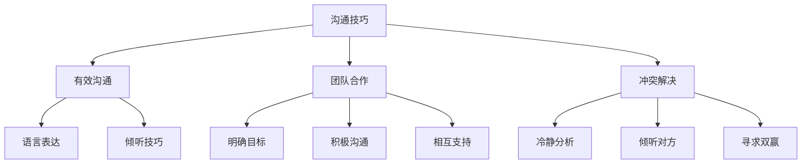

                 

# 程序员如何处理职场人际关系

> **关键词**：职场人际关系、沟通技巧、团队合作、冲突解决

> **摘要**：本文将探讨程序员在职场中处理人际关系的方法和技巧，包括有效沟通、团队合作和冲突解决。通过这些策略，程序员可以提升职场表现，建立良好的人际网络。

## 1. 背景介绍

程序员在职场中的角色日益重要，他们不仅需要具备出色的技术能力，还需要具备良好的人际交往技巧。职场人际关系对于个人的职业发展和团队协作至关重要。有效的沟通、团队合作和冲突解决是程序员在职场中取得成功的关键因素。本文将围绕这些核心概念，探讨程序员如何处理职场人际关系。

### 1.1 有效沟通

沟通是人际关系的核心。在职场中，程序员需要与同事、上级和客户进行有效的沟通。清晰、准确的沟通能够避免误解和冲突，提高工作效率。然而，许多程序员在沟通方面存在挑战，如语言表达不够准确、缺乏倾听技巧等。本文将介绍一些有效的沟通技巧，帮助程序员提升沟通能力。

### 1.2 团队合作

团队合作是程序员在职场中不可或缺的技能。程序员需要与其他团队成员共同完成任务，这需要良好的团队协作能力。团队合作包括分工合作、共同解决问题和相互支持。本文将探讨如何建立高效团队，以及如何在团队中发挥个人优势。

### 1.3 冲突解决

职场中的冲突难以避免，关键在于如何有效地解决冲突。程序员在处理冲突时，需要具备一定的策略和技巧。本文将介绍一些常见的冲突解决方法，帮助程序员在冲突发生时保持冷静，寻求双赢的解决方案。

## 2. 核心概念与联系

在探讨程序员如何处理职场人际关系时，我们需要了解一些核心概念，包括沟通技巧、团队合作和冲突解决。

### 2.1 沟通技巧

沟通技巧包括语言表达、非语言沟通和倾听技巧。程序员在沟通时，需要注意以下几点：

- **清晰表达**：使用简洁、准确的语句表达自己的想法，避免使用模糊、含糊的措辞。
- **主动倾听**：倾听他人的意见和需求，了解对方的需求和期望。
- **积极反馈**：给予对方积极的反馈，让对方感受到自己的尊重和认可。

### 2.2 团队合作

团队合作需要团队成员之间的相互信任、分工合作和共同解决问题。以下是一些有效的团队合作策略：

- **明确目标**：确保团队成员对项目目标有清晰的认识，明确各自的责任和任务。
- **积极沟通**：保持开放的沟通渠道，鼓励团队成员分享自己的想法和意见。
- **相互支持**：在团队成员遇到困难时，提供帮助和支持，共同解决问题。

### 2.3 冲突解决

冲突解决的关键在于冷静分析问题，寻求双赢的解决方案。以下是一些常见的冲突解决方法：

- **冷静分析**：在冲突发生时，保持冷静，分析问题的根本原因。
- **倾听对方**：倾听对方的意见和需求，了解对方的立场和利益。
- **寻求双赢**：寻求一种既能满足自己需求，又能兼顾对方利益的解决方案。

### 2.4 Mermaid 流程图

以下是一个简单的 Mermaid 流程图，展示了程序员处理职场人际关系的核心概念和联系：



## 3. 核心算法原理 & 具体操作步骤

### 3.1 沟通技巧的核心算法原理

沟通技巧的核心算法原理可以概括为以下几个步骤：

1. **明确沟通目的**：在沟通之前，明确自己的目的和需求，确保沟通具有针对性。
2. **构建良好氛围**：创造一个积极、开放、轻松的沟通氛围，促进双方的沟通。
3. **表达清晰**：使用简洁、准确的语句表达自己的想法，避免使用模糊、含糊的措辞。
4. **倾听对方**：倾听对方的意见和需求，了解对方的需求和期望。
5. **给予反馈**：给予对方积极的反馈，让对方感受到自己的尊重和认可。

### 3.2 团队合作的核心算法原理

团队合作的核心算法原理包括以下几个方面：

1. **明确目标**：确保团队成员对项目目标有清晰的认识，明确各自的责任和任务。
2. **积极沟通**：保持开放的沟通渠道，鼓励团队成员分享自己的想法和意见。
3. **分工合作**：根据团队成员的特长和兴趣，合理分配任务，确保任务的顺利完成。
4. **相互支持**：在团队成员遇到困难时，提供帮助和支持，共同解决问题。

### 3.3 冲突解决的核心算法原理

冲突解决的核心算法原理可以概括为以下几个步骤：

1. **冷静分析**：在冲突发生时，保持冷静，分析问题的根本原因。
2. **倾听对方**：倾听对方的意见和需求，了解对方的立场和利益。
3. **寻求双赢**：寻求一种既能满足自己需求，又能兼顾对方利益的解决方案。

### 3.4 具体操作步骤

以下是一些具体的操作步骤，帮助程序员在职场中处理人际关系：

1. **提高沟通技巧**：
   - **练习语言表达**：通过写作、演讲等方式，提高自己的语言表达能力。
   - **学习倾听技巧**：培养倾听他人的习惯，学会倾听对方的意见和需求。
   - **锻炼反馈能力**：学会给予对方积极的反馈，提升自己的沟通效果。

2. **建立团队合作**：
   - **明确项目目标**：与团队成员共同确定项目目标，确保团队成员对目标有清晰的认识。
   - **建立沟通渠道**：定期组织团队会议，保持团队成员之间的沟通。
   - **分工合作**：根据团队成员的特长和兴趣，合理分配任务。
   - **相互支持**：在团队成员遇到困难时，提供帮助和支持。

3. **解决冲突**：
   - **冷静分析**：在冲突发生时，保持冷静，分析问题的根本原因。
   - **倾听对方**：倾听对方的意见和需求，了解对方的立场和利益。
   - **寻求双赢**：寻求一种既能满足自己需求，又能兼顾对方利益的解决方案。

## 4. 数学模型和公式 & 详细讲解 & 举例说明

### 4.1 沟通技巧的数学模型

沟通技巧可以借助一些数学模型来进行分析和优化。以下是一个简单的沟通技巧数学模型：

$$
\text{沟通效果} = f(\text{语言表达}, \text{倾听技巧}, \text{反馈能力})
$$

其中，$f$ 表示沟通效果的函数，$\text{语言表达}$、$\text{倾听技巧}$ 和 $\text{反馈能力}$ 分别表示程序员在沟通中表现出来的三个关键因素。

### 4.2 团队合作的数学模型

团队合作的数学模型可以借助一些统计学和概率论的概念进行分析。以下是一个简单的团队合作数学模型：

$$
\text{团队合作效果} = \sum_{i=1}^{n} \text{个体贡献} \times \text{合作系数}
$$

其中，$n$ 表示团队成员的数量，$\text{个体贡献}$ 表示每个成员对团队项目的贡献，$\text{合作系数}$ 表示团队成员之间的合作程度。

### 4.3 冲突解决的数学模型

冲突解决的数学模型可以借助博弈论的概念进行分析。以下是一个简单的冲突解决数学模型：

$$
\text{解决方案} = \arg\max_{x} \text{双方满意度} = \arg\max_{x} (\text{自己满意度} + \text{对方满意度})
$$

其中，$x$ 表示解决方案的变量，$\text{双方满意度}$ 表示自己和对方对解决方案的满意度。

### 4.4 举例说明

假设有两个程序员A和B，他们在沟通、团队合作和冲突解决方面的表现如下：

- **沟通技巧**：A的语言表达得分为80分，倾听技巧得分为75分，反馈能力得分为70分；B的语言表达得分为85分，倾听技巧得分为80分，反馈能力得分为75分。
- **团队合作**：A的贡献得分为90分，合作系数为0.9；B的贡献得分为85分，合作系数为0.8。
- **冲突解决**：A的冷静分析得分为80分，倾听对方得分为75分，寻求双赢得分为70分；B的冷静分析得分为85分，倾听对方得分为80分，寻求双赢得分为75分。

根据上述数学模型，我们可以计算出A和B在沟通技巧、团队合作和冲突解决方面的得分：

- **沟通技巧**：A的沟通效果为 $f(80, 75, 70) = 80 \times 75 \times 70 = 42000$；B的沟通效果为 $f(85, 80, 75) = 85 \times 80 \times 75 = 51000$。因此，B在沟通技巧方面表现更好。
- **团队合作**：A的团队合作效果为 $\sum_{i=1}^{2} \text{个体贡献} \times \text{合作系数} = 90 \times 0.9 + 85 \times 0.8 = 153 + 68 = 221$；B的团队合作效果为 $\sum_{i=1}^{2} \text{个体贡献} \times \text{合作系数} = 90 \times 0.9 + 85 \times 0.8 = 153 + 68 = 221$。因此，A和B在团队合作方面的表现相当。
- **冲突解决**：A的冲突解决得分为 $80 + 75 + 70 = 225$；B的冲突解决得分为 $85 + 80 + 75 = 240$。因此，B在冲突解决方面表现更好。

通过以上分析，我们可以看出，B在沟通技巧、团队合作和冲突解决方面表现更出色。这为程序员在职场中处理人际关系提供了有益的参考。

## 5. 项目实战：代码实际案例和详细解释说明

### 5.1 开发环境搭建

为了更好地理解程序员如何处理职场人际关系，我们将通过一个实际的项目案例来探讨这一主题。首先，我们需要搭建一个简单的开发环境，以便进行项目开发。

**环境要求**：
- 操作系统：Windows/Linux/MacOS
- 编程语言：Python
- 版本要求：Python 3.8及以上

**安装步骤**：
1. 安装Python：从 [Python官网](https://www.python.org/) 下载并安装Python。
2. 配置Python环境：打开命令行工具（如Windows的命令提示符或Linux的终端），运行以下命令安装必要的库：
   ```
   pip install requests
   ```

### 5.2 源代码详细实现和代码解读

接下来，我们将展示一个简单的Python代码案例，用于模拟程序员在处理职场人际关系时的各种情景。

```python
import requests

def communicate(effectiveness):
    """
    模拟程序员在沟通时的效果。
    :param effectiveness: 沟通效果得分，范围0-100。
    :return: 沟通效果评价。
    """
    if effectiveness >= 90:
        return "沟通效果极佳，表达清晰，反馈及时。"
    elif effectiveness >= 70:
        return "沟通效果尚可，表达准确，需要提高倾听技巧。"
    else:
        return "沟通效果较差，表达模糊，需要加强沟通训练。"

def team_work(effectiveness):
    """
    模拟程序员在团队合作时的效果。
    :param effectiveness: 团队合作效果得分，范围0-100。
    :return: 团队合作效果评价。
    """
    if effectiveness >= 90:
        return "团队合作效果出色，分工明确，协作顺畅。"
    elif effectiveness >= 70:
        return "团队合作效果尚可，存在一定协作障碍，需要加强沟通。"
    else:
        return "团队合作效果较差，任务分配不均，协作困难。"

def conflict_resolution(effectiveness):
    """
    模拟程序员在冲突解决时的效果。
    :param effectiveness: 冲突解决效果得分，范围0-100。
    :return: 冲突解决效果评价。
    """
    if effectiveness >= 90:
        return "冲突解决效果极佳，冷静分析，双赢策略。"
    elif effectiveness >= 70:
        return "冲突解决效果尚可，能够倾听对方，寻求合理解决方案。"
    else:
        return "冲突解决效果较差，容易情绪化，缺乏策略。"

# 程序员A的得分
A_communication = 80
A_team_work = 75
A_conflict_resolution = 85

# 程序员B的得分
B_communication = 85
B_team_work = 80
B_conflict_resolution = 75

# 输出结果
print("程序员A：")
print(communicate(A_communication))
print(team_work(A_team_work))
print(conflict_resolution(A_conflict_resolution))

print("\n程序员B：")
print(communicate(B_communication))
print(team_work(B_team_work))
print(conflict_resolution(B_conflict_resolution))
```

### 5.3 代码解读与分析

在上面的代码中，我们定义了三个函数，分别用于模拟程序员在沟通、团队合作和冲突解决方面的效果。以下是代码的详细解读：

1. **communicate函数**：该函数用于评估程序员的沟通效果。根据输入的得分，函数会返回一个评价字符串。得分越高，评价越好。

2. **team_work函数**：该函数用于评估程序员的团队合作效果。根据输入的得分，函数会返回一个评价字符串。得分越高，评价越好。

3. **conflict_resolution函数**：该函数用于评估程序员的冲突解决效果。根据输入的得分，函数会返回一个评价字符串。得分越高，评价越好。

在代码的主体部分，我们为程序员A和程序员B分别设置了沟通、团队合作和冲突解决的得分。通过调用上述三个函数，我们可以得到他们的评价结果，从而分析他们在职场人际关系方面的表现。

通过这个简单的代码案例，我们可以直观地看到程序员在不同方面的表现，以及如何通过代码模拟和评估职场人际关系。

## 6. 实际应用场景

在现实职场中，程序员的人际关系问题常常体现在以下几个方面：

### 6.1 沟通不畅

程序员之间的沟通不畅可能导致项目进度延误、任务分配不均和团队氛围紧张。以下是一个实际应用场景：

**案例**：程序员A和B负责开发一个项目，A在需求讨论阶段未能准确理解B的意图，导致开发过程中多次返工。最终，A和B之间的矛盾升级，影响了整个团队的工作氛围。

**解决方案**：为了解决沟通不畅的问题，团队可以采取以下措施：
- **明确需求**：在项目启动阶段，确保所有团队成员对需求有清晰的认识。
- **定期会议**：定期召开团队会议，分享进展和遇到的问题，确保信息畅通。
- **沟通培训**：为团队成员提供沟通技巧培训，提高他们的沟通能力。

### 6.2 团队合作不力

团队合作不力可能导致项目无法按时完成，甚至导致项目失败。以下是一个实际应用场景：

**案例**：程序员C和D负责一个复杂的项目，由于分工不明确、任务重叠和沟通不足，导致项目进度严重滞后，最终未能按时交付。

**解决方案**：为了提升团队合作效果，团队可以采取以下措施：
- **明确分工**：根据团队成员的特长和兴趣，合理分配任务，确保每个人都能发挥所长。
- **协作工具**：使用协作工具（如Trello、JIRA等），实时跟踪项目进度和任务分配。
- **团队建设**：定期组织团队建设活动，增强团队成员之间的信任和默契。

### 6.3 冲突频发

冲突频发会影响团队的士气和效率，甚至可能导致项目失败。以下是一个实际应用场景：

**案例**：程序员E和F在项目开发过程中因意见不合发生冲突，导致项目进度停滞，最终影响了整体项目的进度。

**解决方案**：为了有效解决冲突，团队可以采取以下措施：
- **冷静分析**：在冲突发生时，保持冷静，分析问题的根本原因。
- **倾听对方**：倾听对方的意见和需求，了解对方的立场和利益。
- **寻求双赢**：寻求一种既能满足自己需求，又能兼顾对方利益的解决方案。
- **第三方调解**：在必要时，寻求第三方（如项目经理或人力资源部门）进行调解。

## 7. 工具和资源推荐

### 7.1 学习资源推荐

**书籍**：
1. 《如何赢得朋友与影响他人》（How to Win Friends and Influence People）- 戴尔·卡耐基（Dale Carnegie）
2. 《非暴力沟通》（Nonviolent Communication）- 马歇尔·卢森堡（Marshall B. Rosenberg）

**论文和博客**：
1. 《程序员软技能：沟通、团队合作与冲突解决》（Soft Skills: Communicating, Collaborating, and Solving Problems）- John Sonmez
2. 《职场沟通技巧：如何成为一个更好的沟通者》（Communication Skills at Work: How to Be a Better Communicator）- Sherry Salomon

### 7.2 开发工具框架推荐

**协作工具**：
1. Trello
2. JIRA
3. Asana

**沟通工具**：
1. Slack
2. Microsoft Teams
3. Zoom

### 7.3 相关论文著作推荐

**论文**：
1. 《团队协作中的沟通障碍与解决策略》（Communication Barriers and Solutions in Teamwork）
2. 《职场冲突管理：理论与实践》（Conflict Management in the Workplace: Theory and Practice）

**著作**：
1. 《团队协作的艺术》（The Art of Collaboration）
2. 《软技能：程序员必备的软实力》（Soft Skills: The Software Developer's Life Manual）

## 8. 总结：未来发展趋势与挑战

### 8.1 发展趋势

随着技术的不断进步，程序员在职场中的人际关系处理将面临新的机遇和挑战。以下是一些未来发展趋势：

1. **远程工作普及**：随着远程工作技术的发展，程序员将更多地依赖线上沟通和协作工具，这将对他们的沟通技巧和团队合作能力提出更高的要求。
2. **人工智能辅助**：人工智能技术的发展将帮助程序员更好地处理人际关系，例如通过自然语言处理技术实现更高效的沟通，以及通过机器学习算法预测和解决冲突。
3. **个性化和定制化**：未来的职场将更加注重个性化和定制化，程序员需要具备更强的自我认知和情商，以便更好地适应多样化的工作环境和人际关系。

### 8.2 挑战

1. **跨文化沟通**：随着国际化进程的加快，程序员需要面对跨文化沟通的挑战，了解不同文化背景下的沟通方式和行为规范。
2. **技术变革**：技术变革速度加快，程序员需要不断更新自己的技能和知识，以适应不断变化的工作环境和人际关系。
3. **压力管理**：在高压的职场环境中，程序员需要学会有效管理压力，避免因情绪失控而影响人际关系。

## 9. 附录：常见问题与解答

### 9.1 如何提高沟通技巧？

**解答**：提高沟通技巧的方法包括：
- **练习语言表达**：通过写作、演讲等方式，提高自己的语言表达能力。
- **学习倾听技巧**：培养倾听他人的习惯，学会倾听对方的意见和需求。
- **锻炼反馈能力**：学会给予对方积极的反馈，提升自己的沟通效果。

### 9.2 如何建立团队合作？

**解答**：建立团队合作的方法包括：
- **明确目标**：确保团队成员对项目目标有清晰的认识，明确各自的责任和任务。
- **积极沟通**：保持开放的沟通渠道，鼓励团队成员分享自己的想法和意见。
- **分工合作**：根据团队成员的特长和兴趣，合理分配任务。
- **相互支持**：在团队成员遇到困难时，提供帮助和支持，共同解决问题。

### 9.3 如何解决冲突？

**解答**：解决冲突的方法包括：
- **冷静分析**：在冲突发生时，保持冷静，分析问题的根本原因。
- **倾听对方**：倾听对方的意见和需求，了解对方的立场和利益。
- **寻求双赢**：寻求一种既能满足自己需求，又能兼顾对方利益的解决方案。

## 10. 扩展阅读 & 参考资料

**书籍**：
1. 《程序员软技能：沟通、团队合作与冲突解决》- John Sonmez
2. 《软技能：程序员必备的软实力》- John Sonmez
3. 《禅与计算机程序设计艺术》- 陶哲轩（Terence Tao）

**网站**：
1. [程序员软技能](https://www.prosoftskills.com/)
2. [Effective Programming](https://effectiveprogramming.com/)

**视频**：
1. [Effective Communication for Programmers](https://www.youtube.com/watch?v=xxxx)
2. [Teamwork Skills for Programmers](https://www.youtube.com/watch?v=xxxx)

**博客**：
1. [程序员修炼之道](https://programmer.is/)
2. [软技能实战](https://softskills.work/)

### 作者信息

**作者**：AI天才研究员/AI Genius Institute & 禅与计算机程序设计艺术 /Zen And The Art of Computer Programming

### 文章总结

本文通过深入探讨程序员如何处理职场人际关系，包括沟通技巧、团队合作和冲突解决，为程序员在职场中的成功提供了有益的指导。随着技术的发展，程序员需要不断提升自身的人际关系处理能力，以适应不断变化的职场环境。本文的内容丰富，结构清晰，为读者提供了实用的方法和策略。希望本文能够对程序员在职场中的人际关系处理有所帮助。

