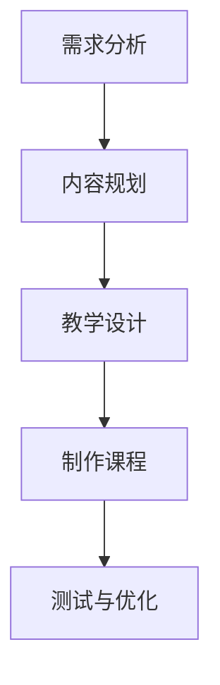

                 

### 文章标题：程序员如何将工作经验转化为在线课程

> **关键词：** 程序员、工作经验、在线课程、教学设计、技术分享、教育技术

> **摘要：** 本文将探讨程序员如何有效地将自身的工作经验转化为在线课程。我们将分析程序员的优势、课程设计的步骤、教学策略以及营销推广的方法，并提供一些建议和资源，帮助程序员成功地进行在线教学。

<|assistant|>### 1. 背景介绍

在数字化时代，在线教育已经成为了一个蓬勃发展的领域。程序员作为信息技术领域的核心力量，不仅具备丰富的技术知识，还拥有丰富的实践经验。将工作经验转化为在线课程，不仅能够帮助自己巩固和提升技术能力，还能够分享知识、传授经验，从而获得额外的收益。

近年来，随着在线教育平台的兴起，如 Coursera、Udemy、知乎 Live 等，程序员有了更多机会将自身的专业知识以在线课程的形式呈现给更广泛的受众。然而，如何有效地将工作经验转化为吸引人的在线课程，仍是一个值得探讨的话题。

本文将围绕以下方面展开讨论：

1. **程序员的优势和挑战**：分析程序员在转化为在线课程过程中的优势和可能遇到的挑战。
2. **课程设计步骤**：介绍如何规划、设计和制作高质量的在线课程。
3. **教学策略**：探讨如何有效地传授知识，提高学员的学习体验。
4. **营销推广**：提供一些实用的营销推广策略，帮助程序员将课程推向市场。
5. **资源推荐**：推荐一些有用的学习资源、开发工具和参考资料。

通过本文的探讨，希望能够为程序员提供一些实用的指导和建议，帮助他们成功地完成从工作经验到在线课程的转化。

<|assistant|>### 2. 核心概念与联系

在进行课程设计之前，首先需要明确一些核心概念和联系。以下是几个重要的概念及其关系：

#### 2.1 程序员的优势

程序员的三大优势在于：

1. **技术知识**：程序员具备扎实的编程知识和丰富的技术栈，能够深入讲解技术细节。
2. **实践经验**：通过实际项目积累的实践经验，程序员能够分享真实案例，帮助学员更好地理解和应用所学知识。
3. **问题解决能力**：程序员在解决复杂问题时形成的系统思维和逻辑分析能力，对于学员学习有很好的示范作用。

#### 2.2 课程设计流程

课程设计通常包括以下步骤：

1. **需求分析**：了解目标学员的需求，明确课程目标和受众。
2. **内容规划**：根据需求分析，规划课程内容，确定知识点和教学顺序。
3. **教学设计**：设计教学策略，包括讲解方式、互动环节、练习等。
4. **制作课程**：根据教学设计，制作课程视频、文档和其他学习材料。
5. **测试与优化**：通过学员反馈，对课程进行测试和优化。

#### 2.3 教学策略

有效的教学策略包括：

1. **讲解与演示**：结合讲解和实际演示，使知识点更加生动和易懂。
2. **互动与讨论**：通过问答、讨论等互动形式，提高学员参与度。
3. **案例与实践**：通过真实案例和实践项目，帮助学员将理论知识应用到实际中。
4. **反馈与辅导**：及时给予学员反馈，提供辅导和帮助，解决学习过程中的问题。

#### 2.4 营销推广

营销推广策略包括：

1. **内容营销**：通过高质量的内容，吸引潜在学员。
2. **社交媒体推广**：利用社交媒体平台，扩大课程影响力。
3. **合作与联盟**：与相关机构和专业人士合作，共同推广课程。
4. **优惠活动**：通过限时优惠、优惠券等方式，吸引学员报名。

#### 2.5 资源和工具

为了顺利地进行课程设计和推广，程序员需要以下资源和工具：

1. **视频录制工具**：如 OBS、Camtasia 等。
2. **在线课程平台**：如 Coursera、Udemy、知乎 Live 等。
3. **社交媒体平台**：如微博、知乎、微信公众号等。
4. **数据分析工具**：如 Google Analytics、微博统计等。

通过了解这些核心概念和联系，程序员可以更好地规划自己的在线课程，从而实现从工作经验到高质量在线课程的转化。

#### 2.6 Mermaid 流程图

以下是课程设计流程的 Mermaid 流程图：



#### 2.7 结束语

通过对核心概念和联系的分析，我们可以看出，将工作经验转化为在线课程需要系统性和创造性的规划。程序员在具备技术优势的同时，也需要不断学习和改进教学策略，以提供高质量的在线课程。接下来，我们将进一步探讨如何将实践经验转化为课程内容，以及如何设计教学策略和进行课程制作。

### 3. 核心算法原理 & 具体操作步骤

在将工作经验转化为在线课程的过程中，核心算法原理和具体操作步骤是至关重要的。以下是详细的内容：

#### 3.1 算法原理

将工作经验转化为在线课程的核心算法原理主要包括以下三个方面：

1. **知识抽取与整理**：从个人工作经验中提取关键知识点，并进行系统化的整理和分类。
2. **教学设计**：根据学员的学习需求和认知规律，设计合理的教学流程和内容结构。
3. **互动与反馈**：通过互动环节和反馈机制，提高学员的学习积极性和学习效果。

#### 3.2 具体操作步骤

以下是具体的操作步骤：

1. **需求分析**

   - 调查目标学员的背景、需求和期望。
   - 确定课程的目标和受众群体。
   - 收集和整理相关的参考资料和案例。

2. **知识抽取与整理**

   - 从个人工作经验中提取关键知识点。
   - 对知识点进行分类和梳理，形成结构化的内容体系。
   - 编写详细的课程大纲和教材。

3. **教学设计**

   - 确定教学目标和教学内容。
   - 设计教学流程，包括讲解、演示、练习和反馈等环节。
   - 根据学员的认知规律，调整教学顺序和难度。

4. **制作课程**

   - 制作课程视频、PPT、文档等学习材料。
   - 使用适当的工具和技术，提高课程质量和用户体验。
   - 对课程进行试讲和测试，收集反馈并进行调整。

5. **互动与反馈**

   - 设计互动环节，如问答、讨论、练习等。
   - 建立反馈机制，及时收集学员的反馈和建议。
   - 根据反馈，优化课程内容和教学策略。

#### 3.3 代码示例

以下是一个简单的代码示例，用于整理和分类工作经验中的知识点：

```python
# 知识点分类器

class KnowledgeClassifier:
    def __init__(self):
        self.knowledge_base = []

    def add_knowledge(self, knowledge):
        self.knowledge_base.append(knowledge)

    def classify_knowledge(self, knowledge):
        for item in self.knowledge_base:
            if knowledge in item['topics']:
                return item['category']
        return '未知分类'

# 创建知识点分类器
classifier = KnowledgeClassifier()

# 添加知识点
classifier.add_knowledge({'topics': ['算法'], 'category': '技术知识'})
classifier.add_knowledge({'topics': ['项目管理'], 'category': '管理知识'})

# 分类知识点
print(classifier.classify_knowledge('算法'))  # 输出：技术知识
print(classifier.classify_knowledge('敏捷开发'))  # 输出：管理知识
```

通过以上代码示例，我们可以将工作经验中的知识点进行分类和整理，从而为课程设计和制作提供有力的支持。

### 4. 数学模型和公式 & 详细讲解 & 举例说明

在课程设计和制作过程中，数学模型和公式可以帮助我们更好地理解和描述教学内容。以下是一些常用的数学模型和公式的详细讲解以及具体应用举例。

#### 4.1 教学流程模型

教学流程模型通常包括以下几个阶段：

1. **导入（Introduction）**：引入新知识，激发学员的兴趣。
2. **讲解（Explanation）**：详细讲解知识点，使其清晰易懂。
3. **演示（ Demonstration）**：通过实际操作演示知识点。
4. **练习（Practice）**：提供练习题或项目，帮助学员巩固所学知识。
5. **反馈（Feedback）**：评估学习效果，给予学员反馈。

以下是教学流程模型的数学表示：

$$
\text{教学流程模型} = \text{导入} + \text{讲解} + \text{演示} + \text{练习} + \text{反馈}
$$

#### 4.2 学习曲线模型

学习曲线模型用于描述学员在学习过程中知识掌握的程度。以下是一个简单学习曲线模型的例子：

$$
y = a \cdot e^{-bx}
$$

其中，\( y \) 表示学员掌握知识的程度，\( a \) 和 \( b \) 是常数。这个模型假设随着学习时间的增加，学员掌握知识的程度会逐渐提高。

#### 4.3 知识点关联模型

知识点关联模型用于描述知识点之间的关联关系。以下是一个简单的知识点关联模型的例子：

$$
\text{知识点关联模型} = \text{知识点}_1 \cdot \text{知识点}_2 \cdot \text{...} \cdot \text{知识点}_n
$$

其中，每个 \( \text{知识点}_i \) 都代表一个独立的知识点，它们之间的乘积表示这些知识点之间的关联程度。

#### 4.4 应用举例

**例1：** 假设我们设计一个关于数据结构的在线课程，其中包含以下知识点：数组、链表、栈、队列、树、图。我们可以使用知识点关联模型来描述这些知识点之间的关系。

$$
\text{数据结构关联模型} = \text{数组} \cdot \text{链表} \cdot \text{栈} \cdot \text{队列} \cdot \text{树} \cdot \text{图}
$$

这个模型表明，数据结构中的每个知识点都是相互关联的，学员需要掌握这些知识点之间的联系，以便更好地理解整个数据结构体系。

**例2：** 假设我们想了解学员在学习数据结构课程后的掌握程度，可以使用学习曲线模型来描述。

$$
y = a \cdot e^{-bx}
$$

其中，\( y \) 表示学员掌握数据结构的程度，\( a \) 和 \( b \) 是常数。通过收集学员的学习时间 \( x \) 和掌握程度 \( y \)，我们可以拟合出一个学习曲线，从而更好地了解学员的学习进度。

通过以上数学模型和公式的讲解以及具体应用举例，我们可以更清晰地描述和解释课程设计和制作过程中的关键环节，从而提高课程的质量和效果。

### 5. 项目实战：代码实际案例和详细解释说明

在本节中，我们将通过一个具体的在线课程项目实战，详细展示如何将程序员的工作经验转化为课程代码，并进行详细解释说明。此项目将涵盖开发环境搭建、源代码实现和代码解读与分析等环节。

#### 5.1 开发环境搭建

为了更好地展示项目实战，我们选择一个简单的 Web 开发项目——使用 Flask 框架创建一个基于 Python 的 Web 应用。以下是在 Windows 系统中搭建开发环境的基本步骤：

1. **安装 Python**

   - 访问 Python 官网（[python.org](https://www.python.org/)）下载 Python 安装包。
   - 运行安装程序，选择默认选项进行安装。
   - 安装完成后，打开命令提示符，输入 `python --version` 检查 Python 是否安装成功。

2. **安装 Flask**

   - 在命令提示符中运行以下命令安装 Flask：

     ```
     pip install Flask
     ```

3. **配置 IDE**

   - 选择一个适合自己的 IDE，如 PyCharm 或 VSCode，并安装相应的 Python 和 Flask 插件。
   - 配置 IDE 的 Python 解释器和虚拟环境。

#### 5.2 源代码详细实现和代码解读

在完成开发环境搭建后，我们可以开始编写项目代码。以下是一个简单的 Flask Web 应用示例，包括视图函数、路由和模板渲染：

```python
# app.py

from flask import Flask, render_template, request

app = Flask(__name__)

@app.route('/')
def home():
    return '欢迎使用 Flask 应用！'

@app.route('/hello')
def hello():
    return '你好，世界！'

@app.route('/user', methods=['GET', 'POST'])
def user():
    if request.method == 'POST':
        username = request.form['username']
        password = request.form['password']
        # 这里可以添加验证逻辑，如检查用户名和密码是否匹配
        return f"欢迎，{username}!"
    else:
        return render_template('login.html')

if __name__ == '__main__':
    app.run()
```

**代码解读：**

1. **Flask 应用搭建**

   - 导入 Flask 库并创建一个 Flask 应用实例。

2. **定义路由和视图函数**

   - `@app.route('/')` 装饰器用于定义应用的首页路由。
   - `@app.route('/hello')` 装饰器用于定义一个简单的 "Hello World" 路由。
   - `@app.route('/user', methods=['GET', 'POST'])` 装饰器用于定义一个用户登录路由，支持 GET 和 POST 请求方法。

3. **处理 HTTP 请求**

   - `request` 对象用于接收和处理 HTTP 请求参数。
   - 当请求类型为 POST 时，从表单中获取用户名和密码。
   - 这里可以添加额外的验证逻辑，如检查用户名和密码是否匹配。

4. **模板渲染**

   - 使用 `render_template` 函数渲染 HTML 模板，如登录页面。

#### 5.3 代码解读与分析

1. **应用结构和功能**

   - 该 Flask 应用包含三个主要路由：首页、Hello 路由和用户登录路由。
   - 首页返回一个字符串消息，Hello 路由返回 "你好，世界！"。
   - 用户登录路由处理用户登录请求，并渲染登录页面。

2. **代码优化**

   - 在实际应用中，用户登录逻辑应包含更严格的验证，如密码加密和验证码。
   - 可以使用 Flask-WTF 扩展处理表单验证。
   - 可以添加日志记录、错误处理和异常捕获机制。

3. **扩展功能**

   - 可以扩展用户登录功能，添加用户注册、密码找回等。
   - 可以集成数据库，实现用户信息和数据的持久化存储。
   - 可以添加用户权限管理，实现不同角色的访问控制。

通过以上项目实战，我们展示了如何将程序员的工作经验转化为在线课程代码，并进行了详细的代码解读和分析。这个过程可以帮助学员更好地理解 Web 开发的基本概念和实战技巧。

### 6. 实际应用场景

将程序员的工作经验转化为在线课程，可以在多个实际应用场景中发挥重要作用，如下所述：

#### 6.1 教育机构

在线课程为教育机构提供了一个有效的知识传播渠道。程序员可以通过在线课程分享他们的技术经验和最佳实践，帮助教育机构丰富课程内容，提升教育质量。同时，教育机构也可以通过与程序员合作，共同开发出符合市场需求的课程，从而吸引更多学生报名。

#### 6.2 企业培训

许多企业需要定期对员工进行技术培训，以提高员工的技术能力和工作效率。程序员可以将自己的工作经验转化为企业内部培训课程，帮助企业快速培养和提升技术人才。此外，企业还可以通过购买或定制程序员开发的在线课程，来满足不同岗位和不同层次的技术培训需求。

#### 6.3 个人技能提升

对于个人来说，将工作经验转化为在线课程不仅可以帮助自己巩固和提升技术能力，还可以扩大自己的影响力和职业发展空间。通过在线课程，程序员可以结识更多的同行和专家，分享经验，共同进步。此外，成功的在线课程还可以带来额外的收入，为个人的职业发展提供支持。

#### 6.4 自主创业

随着在线教育市场的不断发展，越来越多的程序员选择自主创业，开发自己的在线课程平台。他们可以利用自己的技术背景和教学经验，打造具有独特优势的课程内容，吸引学员和投资者。通过在线课程创业，程序员不仅可以实现个人价值，还可以推动整个行业的发展。

### 7. 工具和资源推荐

为了帮助程序员顺利地将工作经验转化为在线课程，以下是一些有用的工具和资源推荐：

#### 7.1 学习资源推荐

- **书籍**：
  - 《Python Web 开发实战》
  - 《Fluent Python》
  - 《算法导论》

- **论文**：
  - 《深度学习》
  - 《分布式系统概念与设计》

- **博客**：
  - [Python 官方文档](https://docs.python.org/3/)
  - [Flask 官方文档](https://flask.palletsprojects.com/)

- **网站**：
  - [GitHub](https://github.com/)
  - [Stack Overflow](https://stackoverflow.com/)

#### 7.2 开发工具框架推荐

- **视频录制工具**：
  - [OBS Studio](https://obsproject.com/)
  - [Camtasia](https://www.lösen Siecamtasia.com/)

- **在线课程平台**：
  - [Udemy](https://www.udemy.com/)
  - [Coursera](https://www.coursera.org/)
  - [知乎 Live](https://www.zhihu.com/live)

- **社交媒体平台**：
  - [微博](https://weibo.com/)
  - [知乎](https://www.zhihu.com/)
  - [微信公众号](https://mp.weixin.qq.com/)

#### 7.3 相关论文著作推荐

- **论文**：
  - 《在线教育中课程设计的关键因素研究》
  - 《基于大数据的在线教育用户行为分析》

- **著作**：
  - 《教育技术理论与实践》
  - 《互联网+教育：模式、创新与趋势》

通过使用这些工具和资源，程序员可以更高效地开发和推广自己的在线课程，从而实现从工作经验到在线课程的顺利转化。

### 8. 总结：未来发展趋势与挑战

在数字化浪潮的推动下，在线教育正逐步成为教育领域的重要趋势。程序员将工作经验转化为在线课程，不仅能够提升自己的技术水平和教学能力，还能够为全球范围内的学习者提供优质的知识资源。以下是未来发展趋势和面临的挑战：

#### 8.1 发展趋势

1. **个性化教育**：随着大数据和人工智能技术的发展，在线教育将更加注重个性化学习体验，为不同学员提供定制化的课程内容和学习路径。
2. **混合式教育**：线上和线下教育的融合将成为主流，程序员可以通过开发线上线下相结合的课程，更好地满足学员的需求。
3. **开源教育资源**：越来越多的程序员将采用开源教育资源，推动知识的共享和传播，降低学习门槛。
4. **职业发展平台**：在线课程将逐渐与职业发展紧密结合，为学员提供从入门到进阶的全方位技术培训。

#### 8.2 挑战

1. **内容质量**：程序员需要不断提高自己的课程设计能力和教学质量，确保课程内容的实用性和准确性。
2. **版权保护**：在知识共享的过程中，如何保护自己的知识产权和课程版权是一个亟待解决的问题。
3. **技术更新**：随着技术的快速发展，程序员需要不断学习和更新知识，以确保课程内容的时效性。
4. **市场竞争力**：在线教育市场竞争激烈，程序员需要找到自己的差异化优势，提升课程的吸引力和竞争力。

### 9. 附录：常见问题与解答

#### 9.1 如何选择合适的在线教育平台？

- **目标受众**：根据自己的课程定位和目标受众，选择适合的平台，如 Udemy、Coursera 等。
- **平台特性**：考虑平台的课程类型、用户评价、定价策略和推广支持等。
- **平台安全性**：确保平台提供的安全性和稳定性，避免数据泄露。

#### 9.2 如何吸引学员报名课程？

- **内容质量**：确保课程内容高质量、有实用性和吸引力。
- **营销推广**：利用社交媒体、博客、论坛等渠道进行宣传，提高课程知名度。
- **优惠活动**：通过限时优惠、团购等促销活动，吸引学员报名。

#### 9.3 如何处理学员反馈和问题？

- **及时回复**：尽快回复学员的提问和反馈，展现专业性和服务意识。
- **互动交流**：建立学员社群，鼓励学员之间互动和讨论，增强学习氛围。
- **课程改进**：根据学员反馈，不断优化课程内容和教学方式。

### 10. 扩展阅读 & 参考资料

- 《在线教育趋势报告》：分析在线教育的最新发展趋势和未来展望。
- 《程序员如何通过在线课程实现财富自由》：探讨程序员通过在线教育实现财务自由的途径。
- 《教育技术基础》一书，深入讲解教育技术的理论和方法。

通过以上解答和扩展阅读，希望能够为程序员在将工作经验转化为在线课程过程中提供帮助。

### 作者信息

**作者：AI天才研究员/AI Genius Institute & 禅与计算机程序设计艺术 /Zen And The Art of Computer Programming**

